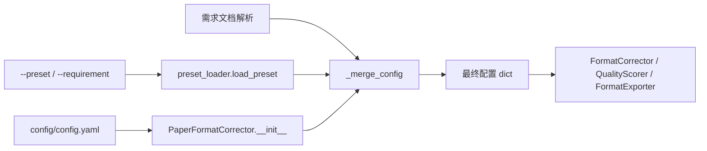

## 系统概述

本项目的配置系统以 YAML 文件为核心，采用「全局运行配置 + 云端/本地预设模板 + 运行时覆盖」的分层加载模型。所有配置均通过 `yaml.safe_load` 解析为 Python dict，由主程序在启动时合并后注入到各服务组件。

## 配置文件分层与职责

### 1. 全局运行配置 `config/config.yaml`
- 位置：仓库根目录 `config/config.yaml`
- 内容：默认字体、标题层级、页边距、摘要/关键词/参考文献格式、自动检测正则、并行度等运行时参数
- 加载方式：`PaperFormatCorrector.__init__` 直接读取并校验
- CLI/GUI 入口统一支持 `-c/--config` 参数覆盖默认路径

### 2. 更新器配置 `config/updater.yaml`
- 位置：`config/updater.yaml`
- 内容：远程模板仓库 URL、本地缓存目录、检查间隔、是否自动更新
- 使用方：CLI 的 `template update` 子命令、桌面 GUI 的更新功能

### 3. 预设模板库 `presets/*.yaml`
- 位置：`presets/` 目录下每个 `.yaml` 文件对应一个预设（如 `ieee.yaml`、`nature.yaml`、`chinese_thesis.yaml`）
- 结构：包含 `description`（元数据，会被剥离）和实际配置片段（`format_rules`、`auto_detect` 等）
- 加载方式：`infra/preset_loader.py` 提供 `load_preset(name)`、`list_presets()`、`get_preset_choices()` 三个 API
- 安全：对 preset name 做白名单正则校验 + 路径穿越防护

### 4. 需求文档动态配置
- 支持通过自然语言或结构化规则文档（`.txt`/`.docx`）生成配置片段
- 解析优先级：LLM 解析 → 离线规则解析器 → 正则解析器
- 解析结果通过 `_merge_config` 深度合并到当前配置

## 配置加载与合并流程

- 基础配置：从 `config/config.yaml` 加载
- 预设覆盖：`apply_preset(preset_name)` 调用 `load_preset` 获取增量配置
- 需求覆盖：`apply_requirement(...)` 解析需求文档得到增量配置
- 合并策略：`_merge_config(base, override)` 递归深拷贝合并，跳过以 `_` 开头的键

## 关键实现要点

- **类型校验**：`_validate_config` 对 margins/body_text/headings 等关键字段进行值域校验，失败时抛出明确错误
- **多进程隔离**：`ProcessPoolExecutor` 中每个子进程独立创建 `FormatCorrector` 实例，避免 lxml 共享状态问题
- **URL 安全**：`VersionChecker._validate_url` 强制 HTTPS（localhost 除外）+ 域名白名单，防止 SSRF
- **降级策略**：网络不可用时 `VersionChecker` 返回空列表而非报错；缺失 `updater.yaml` 时提示用户手动配置

## 开发者约定

1. 新增配置项应在 `config/config.yaml` 中添加注释说明，并在 `_validate_config` 中补充校验逻辑
2. 新增预设模板应放在 `presets/` 目录，文件名即 preset name，需包含 `description` 字段
3. 通过 CLI 覆盖配置时优先使用 `--config` 指定完整路径，其次用 `--preset` 应用内置预设
4. 涉及远程 URL 的配置必须经过 `VersionChecker._validate_url` 校验后再发起请求
5. 配置文件变更不应影响已运行的后台线程（如 AutoUpdater），需通过显式重启生效