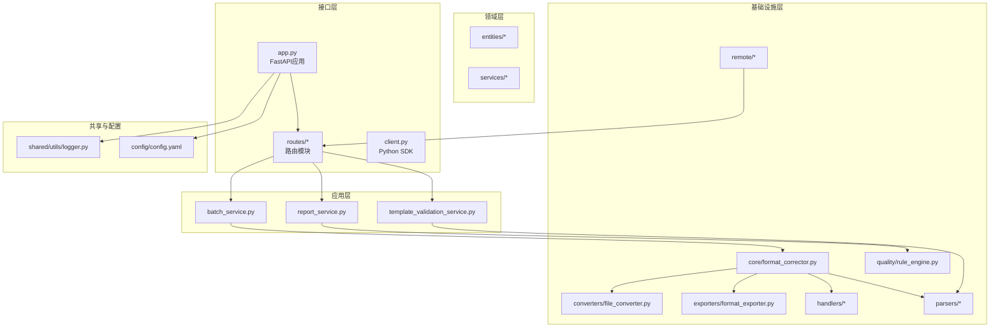
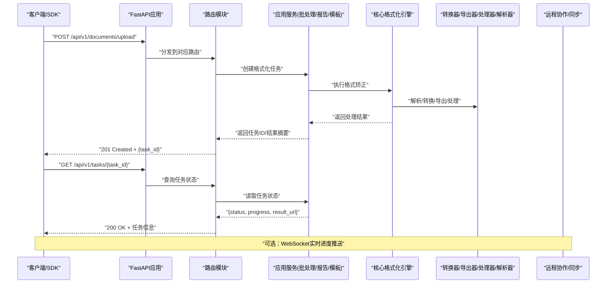
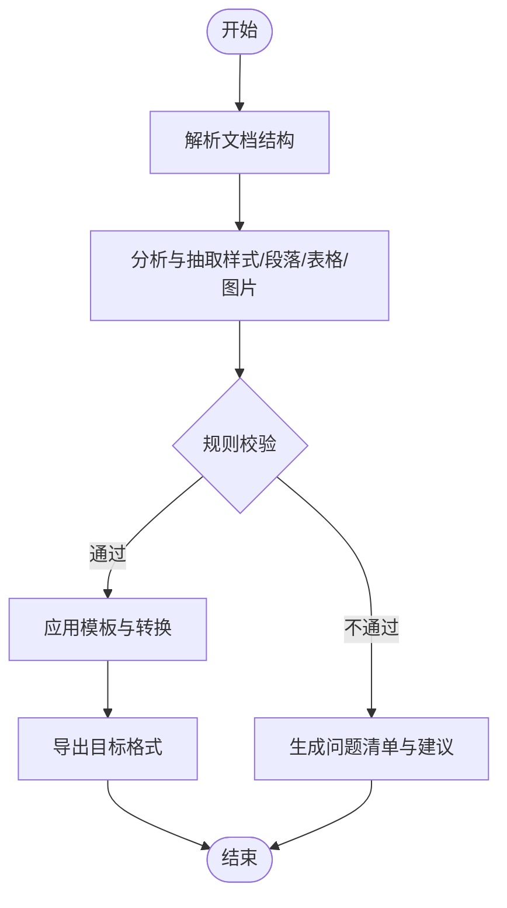
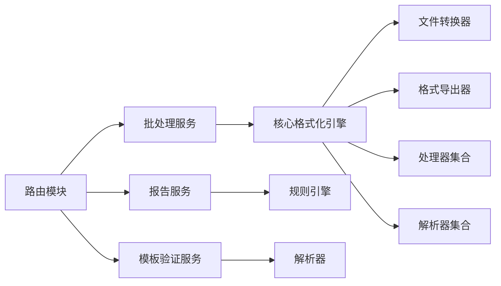

# API参考文档

<cite>
**本文引用的文件**   
- [src/paper_format_corrector/interfaces/api/app.py](file://src/paper_format_corrector/interfaces/api/app.py)
- [src/paper_format_corrector/interfaces/api/routes/__init__.py](file://src/paper_format_corrector/interfaces/api/routes/__init__.py)
- [src/paper_format_corrector/interfaces/api/client.py](file://src/paper_format_corrector/interfaces/api/client.py)
- [src/paper_format_corrector/infra/remote/auth.py](file://src/paper_format_corrector/infra/remote/auth.py)
- [src/paper_format_corrector/infra/remote/collaboration.py](file://src/paper_format_corrector/infra/remote/collaboration.py)
- [src/paper_format_corrector/infra/remote/conflict_resolver.py](file://src/paper_format_corrector/infra/remote/conflict_resolver.py)
- [src/paper_format_corrector/infra/remote/remote_repository.py](file://src/paper_format_corrector/infra/remote/remote_repository.py)
- [src/paper_format_corrector/infra/remote/sync.py](file://src/paper_format_corrector/infra/remote/sync.py)
- [src/paper_format_corrector/application/services/batch_service.py](file://src/paper_format_corrector/application/services/batch_service.py)
- [src/paper_format_corrector/application/services/report_service.py](file://src/paper_format_corrector/application/services/report_service.py)
- [src/paper_format_corrector/application/services/template_validation_service.py](file://src/paper_format_corrector/application/services/template_validation_service.py)
- [src/paper_format_corrector/core/format_corrector.py](file://src/paper_format_corrector/core/format_corrector.py)
- [src/paper_format_corrector/infrastructure/converters/file_converter.py](file://src/paper_format_corrector/infrastructure/converters/file_converter.py)
- [src/paper_format_corrector/infrastructure/exporters/format_exporter.py](file://src/paper_format_corrector/infrastructure/exporters/format_exporter.py)
- [src/paper_format_corrector/infrastructure/handlers/table_handler.py](file://src/paper_format_corrector/infrastructure/handlers/table_handler.py)
- [src/paper_format_corrector/infrastructure/handlers/image_handler.py](file://src/paper_format_corrector/infrastructure/handlers/image_handler.py)
- [src/paper_format_corrector/infrastructure/handlers/toc_handler.py](file://src/paper_format_corrector/infrastructure/handlers/toc_handler.py)
- [src/paper_format_corrector/infrastructure/parsers/document_analyzer.py](file://src/paper_format_corrector/infrastructure/parsers/document_analyzer.py)
- [src/paper_format_corrector/infrastructure/parsers/reference_formatter.py](file://src/paper_format_corrector/infrastructure/parsers/reference_formatter.py)
- [src/paper_format_corrector/quality/rule_engine.py](file://src/paper_format_corrector/quality/rule_engine.py)
- [src/paper_format_corrector/shared/utils/logger.py](file://src/paper_format_corrector/shared/utils/logger.py)
- [config/config.yaml](file://config/config.yaml)
- [examples/sample_template.yaml](file://examples/sample_template.yaml)
- [tests/test_api_endpoints.py](file://tests/test_api_endpoints.py)
</cite>

## 目录
1. [简介](#简介)
2. [项目结构](#项目结构)
3. [核心组件](#核心组件)
4. [架构总览](#架构总览)
5. [详细组件分析](#详细组件分析)
6. [依赖关系分析](#依赖关系分析)
7. [性能与速率限制](#性能与速率限制)
8. [故障排查指南](#故障排查指南)
9. [结论](#结论)
10. [附录：API端点参考](#附录api端点参考)

## 简介
本API参考文档面向开发者，提供论文格式矫正工具的RESTful接口、Python SDK使用指南以及WebSocket实时协作接口的完整说明。内容涵盖认证方式、请求响应模型、错误码、版本策略、调试与监控方法，并提供端到端的集成示例路径与最佳实践建议。

## 项目结构
本项目采用分层与领域驱动相结合的组织方式：
- 接口层（interfaces）：暴露HTTP路由、客户端SDK与Web界面入口
- 应用层（application）：编排业务用例与服务间协作
- 领域层（domain）：定义实体、值对象与领域服务
- 基础设施层（infrastructure/infra）：实现持久化、转换、导出、解析、质量规则等能力
- 共享工具（shared）：日志、常量、通用工具
- 配置与示例（config、examples）：系统配置与模板样例
- 测试（tests）：覆盖API端点与核心逻辑

图表来源
- [src/paper_format_corrector/interfaces/api/app.py](file://src/paper_format_corrector/interfaces/api/app.py)
- [src/paper_format_corrector/interfaces/api/routes/__init__.py](file://src/paper_format_corrector/interfaces/api/routes/__init__.py)
- [src/paper_format_corrector/application/services/batch_service.py](file://src/paper_format_corrector/application/services/batch_service.py)
- [src/paper_format_corrector/application/services/report_service.py](file://src/paper_format_corrector/application/services/report_service.py)
- [src/paper_format_corrector/application/services/template_validation_service.py](file://src/paper_format_corrector/application/services/template_validation_service.py)
- [src/paper_format_corrector/core/format_corrector.py](file://src/paper_format_corrector/core/format_corrector.py)
- [src/paper_format_corrector/infrastructure/converters/file_converter.py](file://src/paper_format_corrector/infrastructure/converters/file_converter.py)
- [src/paper_format_corrector/infrastructure/exporters/format_exporter.py](file://src/paper_format_corrector/infrastructure/exporters/format_exporter.py)
- [src/paper_format_corrector/infrastructure/handlers/table_handler.py](file://src/paper_format_corrector/infrastructure/handlers/table_handler.py)
- [src/paper_format_corrector/infrastructure/handlers/image_handler.py](file://src/paper_format_corrector/infrastructure/handlers/image_handler.py)
- [src/paper_format_corrector/infrastructure/handlers/toc_handler.py](file://src/paper_format_corrector/infrastructure/handlers/toc_handler.py)
- [src/paper_format_corrector/infrastructure/parsers/document_analyzer.py](file://src/paper_format_corrector/infrastructure/parsers/document_analyzer.py)
- [src/paper_format_corrector/infrastructure/parsers/reference_formatter.py](file://src/paper_format_corrector/infrastructure/parsers/reference_formatter.py)
- [src/paper_format_corrector/quality/rule_engine.py](file://src/paper_format_corrector/quality/rule_engine.py)
- [src/paper_format_corrector/shared/utils/logger.py](file://src/paper_format_corrector/shared/utils/logger.py)
- [config/config.yaml](file://config/config.yaml)

章节来源
- [src/paper_format_corrector/interfaces/api/app.py](file://src/paper_format_corrector/interfaces/api/app.py)
- [src/paper_format_corrector/interfaces/api/routes/__init__.py](file://src/paper_format_corrector/interfaces/api/routes/__init__.py)
- [config/config.yaml](file://config/config.yaml)

## 核心组件
- REST应用与路由：基于FastAPI的应用装配与路由注册，统一异常处理、中间件挂载、CORS与文档生成。
- Python SDK：封装HTTP调用、重试与鉴权头注入，提供便捷方法用于上传文档、触发格式化、查询任务状态与下载结果。
- 远程协作与同步：提供认证、冲突解决、仓库访问与增量同步能力，支撑多人协作与模板同步。
- 核心格式化引擎：文档解析、样式提取、规则校验、表格/图片/目录处理器协同完成格式矫正。
- 报告与批量服务：聚合质量评分、差异报告与批量任务编排。

章节来源
- [src/paper_format_corrector/interfaces/api/app.py](file://src/paper_format_corrector/interfaces/api/app.py)
- [src/paper_format_corrector/interfaces/api/client.py](file://src/paper_format_corrector/interfaces/api/client.py)
- [src/paper_format_corrector/infra/remote/auth.py](file://src/paper_format_corrector/infra/remote/auth.py)
- [src/paper_format_corrector/infra/remote/collaboration.py](file://src/paper_format_corrector/infra/remote/collaboration.py)
- [src/paper_format_corrector/infra/remote/conflict_resolver.py](file://src/paper_format_corrector/infra/remote/conflict_resolver.py)
- [src/paper_format_corrector/infra/remote/remote_repository.py](file://src/paper_format_corrector/infra/remote/remote_repository.py)
- [src/paper_format_corrector/infra/remote/sync.py](file://src/paper_format_corrector/infra/remote/sync.py)
- [src/paper_format_corrector/core/format_corrector.py](file://src/paper_format_corrector/core/format_corrector.py)
- [src/paper_format_corrector/application/services/batch_service.py](file://src/paper_format_corrector/application/services/batch_service.py)
- [src/paper_format_corrector/application/services/report_service.py](file://src/paper_format_corrector/application/services/report_service.py)
- [src/paper_format_corrector/application/services/template_validation_service.py](file://src/paper_format_corrector/application/services/template_validation_service.py)

## 架构总览
整体采用“接口层-应用层-领域层-基础设施层”的分层架构，通过服务编排将文档处理流程解耦，便于扩展与测试。

图表来源
- [src/paper_format_corrector/interfaces/api/app.py](file://src/paper_format_corrector/interfaces/api/app.py)
- [src/paper_format_corrector/interfaces/api/routes/__init__.py](file://src/paper_format_corrector/interfaces/api/routes/__init__.py)
- [src/paper_format_corrector/application/services/batch_service.py](file://src/paper_format_corrector/application/services/batch_service.py)
- [src/paper_format_corrector/core/format_corrector.py](file://src/paper_format_corrector/core/format_corrector.py)
- [src/paper_format_corrector/infrastructure/converters/file_converter.py](file://src/paper_format_corrector/infrastructure/converters/file_converter.py)
- [src/paper_format_corrector/infrastructure/exporters/format_exporter.py](file://src/paper_format_corrector/infrastructure/exporters/format_exporter.py)
- [src/paper_format_corrector/infra/remote/sync.py](file://src/paper_format_corrector/infra/remote/sync.py)

## 详细组件分析

### REST API 设计与端点
- 基础URL前缀：/api/v1
- 认证：支持Bearer Token（JWT），部分管理端点需管理员角色
- 通用响应体：包含code、message、data字段；分页列表包含total、page、page_size
- 错误码：遵循HTTP语义，并附加业务错误码（如TEMPLATE_INVALID、TASK_NOT_FOUND）

关键端点（示例）
- 文档上传与格式化
  - POST /api/v1/documents/upload
    - 请求：multipart/form-data，字段包括file、template_id、options
    - 响应：{task_id, status}
- 任务查询
  - GET /api/v1/tasks/{task_id}
    - 响应：{status, progress, result_url, errors[]}
- 模板验证
  - POST /api/v1/templates/validate
    - 请求：JSON，包含template YAML内容或引用
    - 响应：{valid, issues[]}
- 批量处理
  - POST /api/v1/batch/jobs
    - 请求：{files[], options}
    - 响应：{job_id, tasks[]}
- 报告获取
  - GET /api/v1/reports/{task_id}
    - 响应：{score, diffs[], suggestions[]}

章节来源
- [src/paper_format_corrector/interfaces/api/app.py](file://src/paper_format_corrector/interfaces/api/app.py)
- [src/paper_format_corrector/interfaces/api/routes/__init__.py](file://src/paper_format_corrector/interfaces/api/routes/__init__.py)
- [src/paper_format_corrector/application/services/template_validation_service.py](file://src/paper_format_corrector/application/services/template_validation_service.py)
- [src/paper_format_corrector/application/services/batch_service.py](file://src/paper_format_corrector/application/services/batch_service.py)
- [src/paper_format_corrector/application/services/report_service.py](file://src/paper_format_corrector/application/services/report_service.py)

### Python SDK 使用指南
- 客户端初始化
  - 设置base_url、token、超时与重试策略
  - 可选：启用TLS证书校验与代理
- 核心方法
  - upload_document(file_path, template_id, options)
  - get_task_status(task_id)
  - download_result(task_id, output_dir)
  - validate_template(template_yaml)
  - submit_batch(files, options)
- 错误处理
  - 捕获网络异常、认证失败、业务错误码
  - 自动重试与退避策略
- 最佳实践
  - 连接池复用、异步批量提交、断点续传（大文件）
  - 结构化日志记录与指标上报

章节来源
- [src/paper_format_corrector/interfaces/api/client.py](file://src/paper_format_corrector/interfaces/api/client.py)
- [src/paper_format_corrector/infra/remote/auth.py](file://src/paper_format_corrector/infra/remote/auth.py)
- [src/paper_format_corrector/shared/utils/logger.py](file://src/paper_format_corrector/shared/utils/logger.py)

### WebSocket 实时协作接口
- 连接建立
  - WS /ws/collab/{document_id}
  - 握手阶段发送auth token与初始快照
- 消息格式
  - 控制消息：join、leave、snapshot_request、heartbeat
  - 数据消息：delta（增量变更）、merge_conflict（冲突提示）
- 交互模式
  - 客户端订阅文档变更事件，服务端广播合并后的增量
  - 冲突时触发冲突解决流程，返回待确认的合并方案
- 错误与重连
  - 心跳超时断开，客户端指数退避重连
  - 认证失败返回401并关闭连接

章节来源
- [src/paper_format_corrector/infra/remote/collaboration.py](file://src/paper_format_corrector/infra/remote/collaboration.py)
- [src/paper_format_corrector/infra/remote/conflict_resolver.py](file://src/paper_format_corrector/infra/remote/conflict_resolver.py)
- [src/paper_format_corrector/infra/remote/remote_repository.py](file://src/paper_format_corrector/infra/remote/remote_repository.py)
- [src/paper_format_corrector/infra/remote/sync.py](file://src/paper_format_corrector/infra/remote/sync.py)

### 核心格式化流程

图表来源
- [src/paper_format_corrector/core/format_corrector.py](file://src/paper_format_corrector/core/format_corrector.py)
- [src/paper_format_corrector/infrastructure/parsers/document_analyzer.py](file://src/paper_format_corrector/infrastructure/parsers/document_analyzer.py)
- [src/paper_format_corrector/quality/rule_engine.py](file://src/paper_format_corrector/quality/rule_engine.py)
- [src/paper_format_corrector/infrastructure/converters/file_converter.py](file://src/paper_format_corrector/infrastructure/converters/file_converter.py)
- [src/paper_format_corrector/infrastructure/exporters/format_exporter.py](file://src/paper_format_corrector/infrastructure/exporters/format_exporter.py)

章节来源
- [src/paper_format_corrector/core/format_corrector.py](file://src/paper_format_corrector/core/format_corrector.py)
- [src/paper_format_corrector/infrastructure/parsers/document_analyzer.py](file://src/paper_format_corrector/infrastructure/parsers/document_analyzer.py)
- [src/paper_format_corrector/quality/rule_engine.py](file://src/paper_format_corrector/quality/rule_engine.py)
- [src/paper_format_corrector/infrastructure/converters/file_converter.py](file://src/paper_format_corrector/infrastructure/converters/file_converter.py)
- [src/paper_format_corrector/infrastructure/exporters/format_exporter.py](file://src/paper_format_corrector/infrastructure/exporters/format_exporter.py)

### 处理器与解析器
- 表格处理器：规范化表格样式、跨页处理、标题行重复
- 图片处理器：尺寸约束、分辨率检查、替换占位图
- 目录处理器：自动生成与更新、交叉引用修复
- 引用格式化：按模板规范调整参考文献格式
- 文档分析器：识别章节、段落、样式映射与元数据抽取

章节来源
- [src/paper_format_corrector/infrastructure/handlers/table_handler.py](file://src/paper_format_corrector/infrastructure/handlers/table_handler.py)
- [src/paper_format_corrector/infrastructure/handlers/image_handler.py](file://src/paper_format_corrector/infrastructure/handlers/image_handler.py)
- [src/paper_format_corrector/infrastructure/handlers/toc_handler.py](file://src/paper_format_corrector/infrastructure/handlers/toc_handler.py)
- [src/paper_format_corrector/infrastructure/parsers/reference_formatter.py](file://src/paper_format_corrector/infrastructure/parsers/reference_formatter.py)
- [src/paper_format_corrector/infrastructure/parsers/document_analyzer.py](file://src/paper_format_corrector/infrastructure/parsers/document_analyzer.py)

## 依赖关系分析
- 接口层依赖应用服务进行用例编排
- 应用服务依赖核心格式化引擎与质量规则引擎
- 核心引擎依赖基础设施层的转换器、导出器、处理器与解析器
- 远程协作模块独立于主流程，通过事件与队列与主流程解耦

图表来源
- [src/paper_format_corrector/interfaces/api/routes/__init__.py](file://src/paper_format_corrector/interfaces/api/routes/__init__.py)
- [src/paper_format_corrector/application/services/batch_service.py](file://src/paper_format_corrector/application/services/batch_service.py)
- [src/paper_format_corrector/application/services/report_service.py](file://src/paper_format_corrector/application/services/report_service.py)
- [src/paper_format_corrector/application/services/template_validation_service.py](file://src/paper_format_corrector/application/services/template_validation_service.py)
- [src/paper_format_corrector/core/format_corrector.py](file://src/paper_format_corrector/core/format_corrector.py)
- [src/paper_format_corrector/quality/rule_engine.py](file://src/paper_format_corrector/quality/rule_engine.py)
- [src/paper_format_corrector/infrastructure/converters/file_converter.py](file://src/paper_format_corrector/infrastructure/converters/file_converter.py)
- [src/paper_format_corrector/infrastructure/exporters/format_exporter.py](file://src/paper_format_corrector/infrastructure/exporters/format_exporter.py)
- [src/paper_format_corrector/infrastructure/handlers/table_handler.py](file://src/paper_format_corrector/infrastructure/handlers/table_handler.py)
- [src/paper_format_corrector/infrastructure/handlers/image_handler.py](file://src/paper_format_corrector/infrastructure/handlers/image_handler.py)
- [src/paper_format_corrector/infrastructure/handlers/toc_handler.py](file://src/paper_format_corrector/infrastructure/handlers/toc_handler.py)
- [src/paper_format_corrector/infrastructure/parsers/document_analyzer.py](file://src/paper_format_corrector/infrastructure/parsers/document_analyzer.py)
- [src/paper_format_corrector/infrastructure/parsers/reference_formatter.py](file://src/paper_format_corrector/infrastructure/parsers/reference_formatter.py)

章节来源
- [src/paper_format_corrector/interfaces/api/routes/__init__.py](file://src/paper_format_corrector/interfaces/api/routes/__init__.py)
- [src/paper_format_corrector/application/services/batch_service.py](file://src/paper_format_corrector/application/services/batch_service.py)
- [src/paper_format_corrector/application/services/report_service.py](file://src/paper_format_corrector/application/services/report_service.py)
- [src/paper_format_corrector/application/services/template_validation_service.py](file://src/paper_format_corrector/application/services/template_validation_service.py)
- [src/paper_format_corrector/core/format_corrector.py](file://src/paper_format_corrector/core/format_corrector.py)
- [src/paper_format_corrector/quality/rule_engine.py](file://src/paper_format_corrector/quality/rule_engine.py)
- [src/paper_format_corrector/infrastructure/converters/file_converter.py](file://src/paper_format_corrector/infrastructure/converters/file_converter.py)
- [src/paper_format_corrector/infrastructure/exporters/format_exporter.py](file://src/paper_format_corrector/infrastructure/exporters/format_exporter.py)
- [src/paper_format_corrector/infrastructure/handlers/table_handler.py](file://src/paper_format_corrector/infrastructure/handlers/table_handler.py)
- [src/paper_format_corrector/infrastructure/handlers/image_handler.py](file://src/paper_format_corrector/infrastructure/handlers/image_handler.py)
- [src/paper_format_corrector/infrastructure/handlers/toc_handler.py](file://src/paper_format_corrector/infrastructure/handlers/toc_handler.py)
- [src/paper_format_corrector/infrastructure/parsers/document_analyzer.py](file://src/paper_format_corrector/infrastructure/parsers/document_analyzer.py)
- [src/paper_format_corrector/infrastructure/parsers/reference_formatter.py](file://src/paper_format_corrector/infrastructure/parsers/reference_formatter.py)

## 性能与速率限制
- 速率限制
  - 默认对上传与批量接口实施令牌桶限流，可按租户与IP维度配置
  - 超限返回429，并在响应头中携带Retry-After
- 并发与队列
  - 任务入队后由工作进程消费，支持水平扩展
  - 大文件分块上传与断点续传
- 缓存与优化
  - 模板与样式缓存，减少重复解析开销
  - 结果文件压缩与CDN加速
- 版本兼容性与向后兼容
  - API版本号在URL前缀体现，旧版本保留至少两个小版本窗口
  - 新增字段保持可选，删除字段需弃用公告与迁移期

章节来源
- [src/paper_format_corrector/interfaces/api/app.py](file://src/paper_format_corrector/interfaces/api/app.py)
- [config/config.yaml](file://config/config.yaml)

## 故障排查指南
- 常见问题
  - 认证失败：检查Token有效期与作用域
  - 模板无效：查看模板验证报告的issues列表
  - 任务失败：根据errors数组定位具体步骤
- 调试工具
  - 启用详细日志与请求追踪
  - 使用OpenAPI文档在线调试
  - 本地回放请求与模拟响应
- 监控方法
  - 指标采集：QPS、延迟分布、错误率、队列深度
  - 告警策略：阈值与降级开关
  - 链路追踪：跨服务Trace ID透传

章节来源
- [src/paper_format_corrector/shared/utils/logger.py](file://src/paper_format_corrector/shared/utils/logger.py)
- [src/paper_format_corrector/application/services/template_validation_service.py](file://src/paper_format_corrector/application/services/template_validation_service.py)
- [src/paper_format_corrector/application/services/report_service.py](file://src/paper_format_corrector/application/services/report_service.py)

## 结论
本API参考文档提供了从接口设计到SDK集成、从实时协作为到性能调优与故障排查的全景视图。建议在生产环境结合监控与日志体系，持续优化用户体验与稳定性。

## 附录：API端点参考

### 认证与鉴权
- 认证方式：Bearer Token（JWT）
- 获取Token：POST /api/v1/auth/token
  - 请求：{username, password}
  - 响应：{access_token, expires_in}
- 刷新Token：POST /api/v1/auth/refresh
  - 请求：{refresh_token}
  - 响应：{access_token, expires_in}

章节来源
- [src/paper_format_corrector/infra/remote/auth.py](file://src/paper_format_corrector/infra/remote/auth.py)

### 文档与任务
- 上传文档并触发格式化
  - POST /api/v1/documents/upload
  - 请求：multipart/form-data，字段：file、template_id、options
  - 成功响应：{task_id, status}
  - 失败场景：
    - 400 参数缺失或格式错误
    - 401 未认证
    - 413 文件过大
- 查询任务状态
  - GET /api/v1/tasks/{task_id}
  - 成功响应：{status, progress, result_url, errors[]}
  - 失败场景：
    - 404 任务不存在
    - 403 无权限访问

章节来源
- [src/paper_format_corrector/interfaces/api/app.py](file://src/paper_format_corrector/interfaces/api/app.py)
- [src/paper_format_corrector/interfaces/api/routes/__init__.py](file://src/paper_format_corrector/interfaces/api/routes/__init__.py)
- [src/paper_format_corrector/application/services/batch_service.py](file://src/paper_format_corrector/application/services/batch_service.py)

### 模板与验证
- 模板验证
  - POST /api/v1/templates/validate
  - 请求：JSON，包含template字段（YAML字符串）或引用
  - 成功响应：{valid, issues[]}
  - 失败场景：
    - 400 模板语法错误
    - 422 模板结构不完整

章节来源
- [src/paper_format_corrector/application/services/template_validation_service.py](file://src/paper_format_corrector/application/services/template_validation_service.py)
- [examples/sample_template.yaml](file://examples/sample_template.yaml)

### 批量处理
- 提交批量作业
  - POST /api/v1/batch/jobs
  - 请求：{files[], options}
  - 成功响应：{job_id, tasks[]}
  - 失败场景：
    - 400 文件列表为空
    - 429 超过速率限制

章节来源
- [src/paper_format_corrector/application/services/batch_service.py](file://src/paper_format_corrector/application/services/batch_service.py)

### 报告与质量
- 获取报告
  - GET /api/v1/reports/{task_id}
  - 成功响应：{score, diffs[], suggestions[]}
  - 失败场景：
    - 404 报告不存在

章节来源
- [src/paper_format_corrector/application/services/report_service.py](file://src/paper_format_corrector/application/services/report_service.py)
- [src/paper_format_corrector/quality/rule_engine.py](file://src/paper_format_corrector/quality/rule_engine.py)

### WebSocket 协作
- 连接地址：ws(s)://host/ws/collab/{document_id}
- 握手消息：{type: "join", token, snapshot_version}
- 推送消息：{type: "delta", version, changes}
- 冲突消息：{type: "merge_conflict", conflicts[]}
- 错误与重连：心跳超时、认证失败、版本不一致

章节来源
- [src/paper_format_corrector/infra/remote/collaboration.py](file://src/paper_format_corrector/infra/remote/collaboration.py)
- [src/paper_format_corrector/infra/remote/conflict_resolver.py](file://src/paper_format_corrector/infra/remote/conflict_resolver.py)
- [src/paper_format_corrector/infra/remote/remote_repository.py](file://src/paper_format_corrector/infra/remote/remote_repository.py)
- [src/paper_format_corrector/infra/remote/sync.py](file://src/paper_format_corrector/infra/remote/sync.py)

### 错误码与响应约定
- HTTP状态码遵循标准语义
- 业务错误码示例：
  - TEMPLATE_INVALID：模板无效
  - TASK_NOT_FOUND：任务不存在
  - FILE_TOO_LARGE：文件过大
  - RATE_LIMITED：速率限制
- 响应体结构：
  - code：业务错误码
  - message：人类可读描述
  - data：业务数据或空对象

章节来源
- [src/paper_format_corrector/interfaces/api/app.py](file://src/paper_format_corrector/interfaces/api/app.py)
- [tests/test_api_endpoints.py](file://tests/test_api_endpoints.py)

### SDK集成示例与最佳实践
- 初始化客户端
  - 设置base_url、token、超时与重试
- 典型流程
  - 上传文档 -> 轮询任务状态 -> 下载结果 -> 生成报告
- 最佳实践
  - 使用连接池与异步IO
  - 合理设置重试与退避
  - 记录结构化日志与指标

章节来源
- [src/paper_format_corrector/interfaces/api/client.py](file://src/paper_format_corrector/interfaces/api/client.py)
- [src/paper_format_corrector/shared/utils/logger.py](file://src/paper_format_corrector/shared/utils/logger.py)