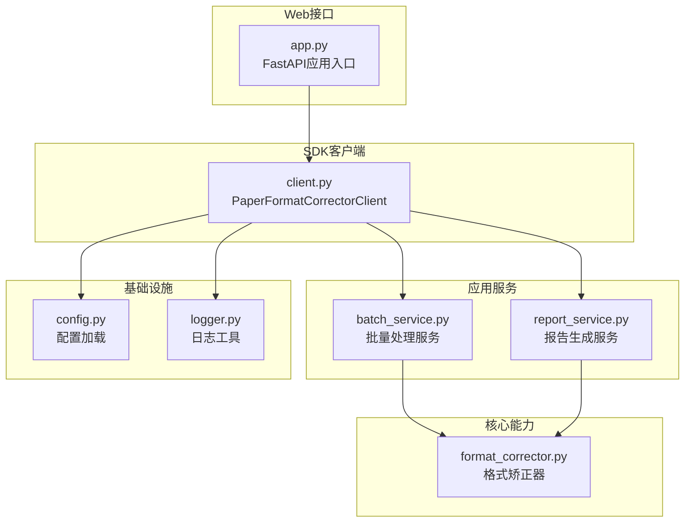
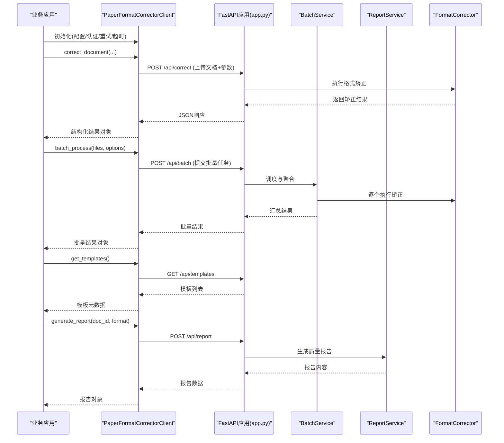
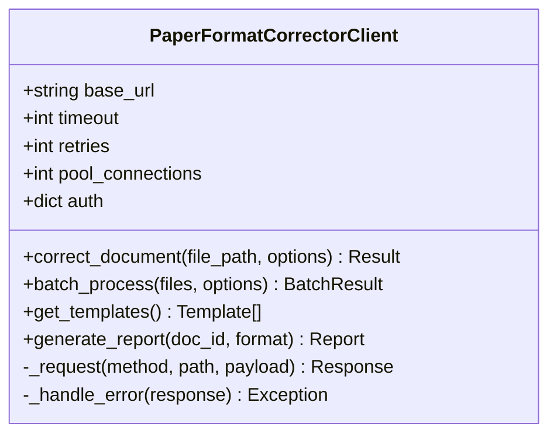
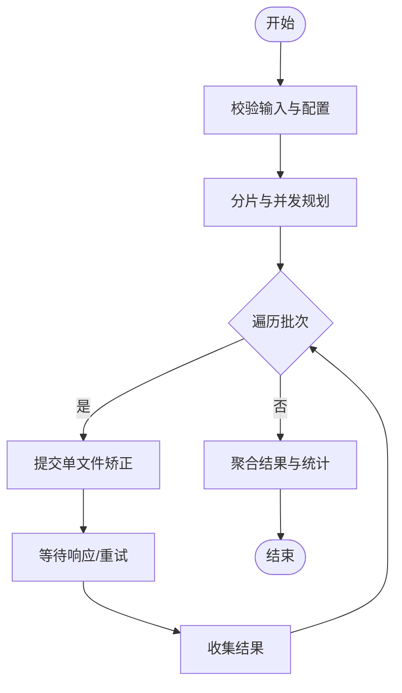
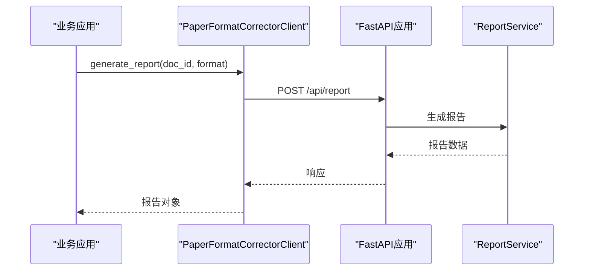
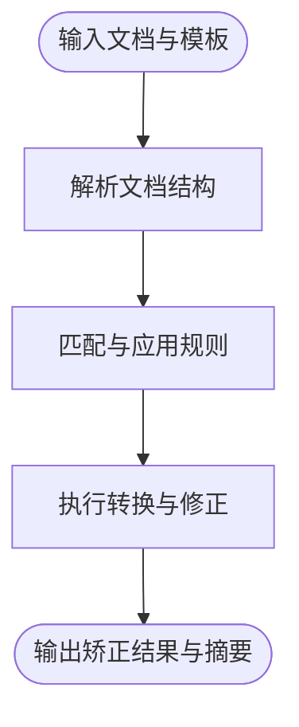
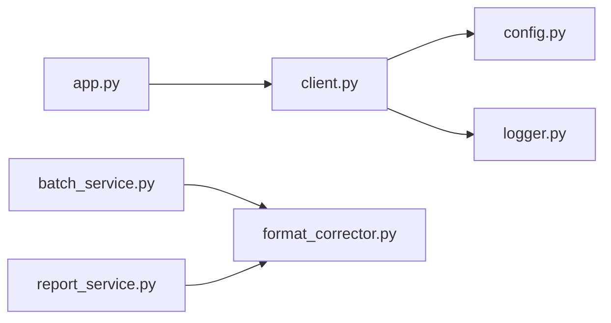
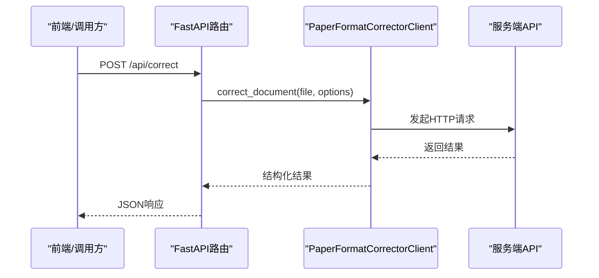

# Python SDK使用指南

<cite>
**本文引用的文件**   
- [src/paper_format_corrector/api/client.py](file://src/paper_format_corrector/api/client.py)
- [src/paper_format_corrector/api/app.py](file://src/paper_format_corrector/api/app.py)
- [src/paper_format_corrector/application/services/batch_service.py](file://src/paper_format_corrector/application/services/batch_service.py)
- [src/paper_format_corrector/application/services/report_service.py](file://src/paper_format_corrector/application/services/report_service.py)
- [src/paper_format_corrector/core/format_corrector.py](file://src/paper_format_corrector/core/format_corrector.py)
- [src/paper_format_corrector/infrastructure/config/config.py](file://src/paper_format_corrector/infrastructure/config/config.py)
- [src/paper_format_corrector/shared/utils/logger.py](file://src/paper_format_corrector/shared/utils/logger.py)
- [pyproject.toml](file://pyproject.toml)
- [requirements.txt](file://requirements.txt)
- [README.md](file://README.md)
</cite>

## 目录
1. [简介](#简介)
2. [项目结构](#项目结构)
3. [核心组件](#核心组件)
4. [架构总览](#架构总览)
5. [详细组件分析](#详细组件分析)
6. [依赖关系分析](#依赖关系分析)
7. [性能与配置](#性能与配置)
8. [故障排查指南](#故障排查指南)
9. [结论](#结论)
10. [附录：FastAPI后端集成示例](#附录fastapi后端集成示例)

## 简介
本指南面向Python开发者，提供PaperFormatCorrector的SDK使用说明。内容涵盖安装、客户端初始化、核心API调用（包括correct_document、batch_process、get_templates、generate_report）、异步支持、连接池与超时重试配置、异常处理模式与调试技巧，以及与FastAPI后端的集成示例。文档以仓库源码为依据，确保与实际实现一致。

## 项目结构
本项目采用分层架构，SDK客户端位于api层，应用服务位于application层，核心格式矫正逻辑位于core层，基础设施与配置位于infrastructure层。

图表来源
- [src/paper_format_corrector/api/client.py](file://src/paper_format_corrector/api/client.py)
- [src/paper_format_corrector/application/services/batch_service.py](file://src/paper_format_corrector/application/services/batch_service.py)
- [src/paper_format_corrector/application/services/report_service.py](file://src/paper_format_corrector/application/services/report_service.py)
- [src/paper_format_corrector/core/format_corrector.py](file://src/paper_format_corrector/core/format_corrector.py)
- [src/paper_format_corrector/infrastructure/config/config.py](file://src/paper_format_corrector/infrastructure/config/config.py)
- [src/paper_format_corrector/shared/utils/logger.py](file://src/paper_format_corrector/shared/utils/logger.py)
- [src/paper_format_corrector/api/app.py](file://src/paper_format_corrector/api/app.py)

章节来源
- [README.md](file://README.md)
- [pyproject.toml](file://pyproject.toml)
- [requirements.txt](file://requirements.txt)

## 核心组件
- PaperFormatCorrectorClient：SDK对外暴露的客户端类，封装HTTP调用、认证、重试、超时、连接池等网络细节，并提供便捷方法如correct_document、batch_process、get_templates、generate_report。
- BatchService：批量任务编排与结果聚合。
- ReportService：格式化质量评估与报告生成。
- FormatCorrector：核心格式矫正引擎，负责解析文档、应用规则、输出矫正结果。
- Config：统一配置加载与管理（服务端地址、超时、重试策略、模板路径等）。
- Logger：结构化日志记录，便于问题定位。

章节来源
- [src/paper_format_corrector/api/client.py](file://src/paper_format_corrector/api/client.py)
- [src/paper_format_corrector/application/services/batch_service.py](file://src/paper_format_corrector/application/services/batch_service.py)
- [src/paper_format_corrector/application/services/report_service.py](file://src/paper_format_corrector/application/services/report_service.py)
- [src/paper_format_corrector/core/format_corrector.py](file://src/paper_format_corrector/core/format_corrector.py)
- [src/paper_format_corrector/infrastructure/config/config.py](file://src/paper_format_corrector/infrastructure/config/config.py)
- [src/paper_format_corrector/shared/utils/logger.py](file://src/paper_format_corrector/shared/utils/logger.py)

## 架构总览
下图展示从客户端到后端服务的请求链路，以及关键组件间的交互。

图表来源
- [src/paper_format_corrector/api/client.py](file://src/paper_format_corrector/api/client.py)
- [src/paper_format_corrector/api/app.py](file://src/paper_format_corrector/api/app.py)
- [src/paper_format_corrector/application/services/batch_service.py](file://src/paper_format_corrector/application/services/batch_service.py)
- [src/paper_format_corrector/application/services/report_service.py](file://src/paper_format_corrector/application/services/report_service.py)
- [src/paper_format_corrector/core/format_corrector.py](file://src/paper_format_corrector/core/format_corrector.py)

## 详细组件分析

### PaperFormatCorrectorClient 类
- 职责
  - 管理HTTP会话、连接池、超时与重试策略
  - 封装认证信息（如Token）
  - 提供高层API：correct_document、batch_process、get_templates、generate_report
  - 将底层HTTP响应转换为结构化对象，简化上层调用
- 关键方法与行为
  - correct_document：上传单个文档并触发格式矫正，返回标准化结果
  - batch_process：提交批量任务，支持分片、并发控制与结果聚合
  - get_templates：获取可用模板清单及元数据
  - generate_report：基于文档ID或输入生成质量报告（JSON/PDF等）
- 配置项
  - base_url：服务端地址
  - timeout：请求超时（秒）
  - retries：重试次数与退避策略
  - pool_connections：连接池大小
  - auth：认证令牌或凭据
- 错误处理
  - 对网络异常、HTTP状态码、业务错误进行统一包装
  - 提供可区分的异常类型以便上层捕获

图表来源
- [src/paper_format_corrector/api/client.py](file://src/paper_format_corrector/api/client.py)

章节来源
- [src/paper_format_corrector/api/client.py](file://src/paper_format_corrector/api/client.py)

### 批量处理流程（batch_process）
- 流程要点
  - 校验输入文件列表与选项
  - 分片与并发控制（根据pool_connections与options.max_workers）
  - 逐文件调用correct_document或批量端点
  - 聚合成功与失败结果，统计耗时与错误分布
- 异常与重试
  - 针对瞬时错误（如限流、网络抖动）自动重试
  - 失败文件单独记录，不影响整体任务完成

图表来源
- [src/paper_format_corrector/application/services/batch_service.py](file://src/paper_format_corrector/application/services/batch_service.py)
- [src/paper_format_corrector/api/client.py](file://src/paper_format_corrector/api/client.py)

章节来源
- [src/paper_format_corrector/application/services/batch_service.py](file://src/paper_format_corrector/application/services/batch_service.py)
- [src/paper_format_corrector/api/client.py](file://src/paper_format_corrector/api/client.py)

### 报告生成流程（generate_report）
- 流程要点
  - 接收文档标识与报告格式
  - 调用ReportService进行质量评分与差异对比
  - 输出结构化报告（JSON）或导出为PDF
- 错误处理
  - 文档不存在或权限不足时返回明确错误
  - 导出失败时降级为JSON

图表来源
- [src/paper_format_corrector/application/services/report_service.py](file://src/paper_format_corrector/application/services/report_service.py)
- [src/paper_format_corrector/api/client.py](file://src/paper_format_corrector/api/client.py)
- [src/paper_format_corrector/api/app.py](file://src/paper_format_corrector/api/app.py)

章节来源
- [src/paper_format_corrector/application/services/report_service.py](file://src/paper_format_corrector/application/services/report_service.py)
- [src/paper_format_corrector/api/client.py](file://src/paper_format_corrector/api/client.py)
- [src/paper_format_corrector/api/app.py](file://src/paper_format_corrector/api/app.py)

### 核心格式矫正（FormatCorrector）
- 职责
  - 解析文档结构与样式
  - 应用预设或自定义模板规则
  - 输出矫正后的文档与变更摘要
- 输入输出
  - 输入：文档二进制或路径、模板名称、选项
  - 输出：矫正结果、变更详情、质量指标

图表来源
- [src/paper_format_corrector/core/format_corrector.py](file://src/paper_format_corrector/core/format_corrector.py)

章节来源
- [src/paper_format_corrector/core/format_corrector.py](file://src/paper_format_corrector/core/format_corrector.py)

## 依赖关系分析
- 模块耦合
  - client依赖config与logger，用于配置加载与日志记录
  - batch_service与report_service依赖format_corrector执行核心逻辑
  - app作为FastAPI入口，路由到各服务
- 外部依赖
  - HTTP客户端库（由client内部使用）
  - 文档处理库（docx/pdf等，由core与infra使用）
  - 配置与日志库（由config与logger封装）

图表来源
- [src/paper_format_corrector/api/client.py](file://src/paper_format_corrector/api/client.py)
- [src/paper_format_corrector/infrastructure/config/config.py](file://src/paper_format_corrector/infrastructure/config/config.py)
- [src/paper_format_corrector/shared/utils/logger.py](file://src/paper_format_corrector/shared/utils/logger.py)
- [src/paper_format_corrector/application/services/batch_service.py](file://src/paper_format_corrector/application/services/batch_service.py)
- [src/paper_format_corrector/application/services/report_service.py](file://src/paper_format_corrector/application/services/report_service.py)
- [src/paper_format_corrector/core/format_corrector.py](file://src/paper_format_corrector/core/format_corrector.py)
- [src/paper_format_corrector/api/app.py](file://src/paper_format_corrector/api/app.py)

章节来源
- [src/paper_format_corrector/api/client.py](file://src/paper_format_corrector/api/client.py)
- [src/paper_format_corrector/infrastructure/config/config.py](file://src/paper_format_corrector/infrastructure/config/config.py)
- [src/paper_format_corrector/shared/utils/logger.py](file://src/paper_format_corrector/shared/utils/logger.py)
- [src/paper_format_corrector/application/services/batch_service.py](file://src/paper_format_corrector/application/services/batch_service.py)
- [src/paper_format_corrector/application/services/report_service.py](file://src/paper_format_corrector/application/services/report_service.py)
- [src/paper_format_corrector/core/format_corrector.py](file://src/paper_format_corrector/core/format_corrector.py)
- [src/paper_format_corrector/api/app.py](file://src/paper_format_corrector/api/app.py)

## 性能与配置
- 连接池
  - 通过pool_connections调整并发连接数，避免过多导致资源耗尽
  - 建议根据服务器容量与网络延迟调优
- 超时设置
  - timeout覆盖单次请求最大等待时间，防止阻塞
  - 大文件或复杂模板建议适当增大
- 重试机制
  - retries配合指数退避，提升稳定性
  - 仅对可重试错误（如限流、网络抖动）生效
- 异步支持
  - 若底层HTTP客户端支持异步，可在高并发场景启用异步调用
  - 注意与连接池和重试策略协同配置
- 日志与监控
  - 使用logger记录关键步骤与错误堆栈
  - 结合业务埋点统计成功率与耗时

章节来源
- [src/paper_format_corrector/api/client.py](file://src/paper_format_corrector/api/client.py)
- [src/paper_format_corrector/infrastructure/config/config.py](file://src/paper_format_corrector/infrastructure/config/config.py)
- [src/paper_format_corrector/shared/utils/logger.py](file://src/paper_format_corrector/shared/utils/logger.py)

## 故障排查指南
- 常见问题
  - 连接失败：检查base_url、防火墙与证书配置
  - 认证失败：确认auth令牌有效且未过期
  - 超时：增大timeout或优化网络；检查文件大小与模板复杂度
  - 限流：降低并发或增加retries与退避间隔
- 调试技巧
  - 开启详细日志，定位具体阶段错误
  - 使用最小复现用例验证模板与规则
  - 对批量任务先小批量测试，逐步扩大规模
- 错误分类
  - 网络异常：重试与退避
  - 业务错误：根据错误码与消息修正输入或模板
  - 系统错误：查看服务端日志与资源占用

章节来源
- [src/paper_format_corrector/shared/utils/logger.py](file://src/paper_format_corrector/shared/utils/logger.py)
- [src/paper_format_corrector/api/client.py](file://src/paper_format_corrector/api/client.py)

## 结论
本指南提供了PaperFormatCorrector Python SDK的安装、初始化、核心API调用与最佳实践。通过合理配置连接池、超时与重试，并结合结构化日志，可在生产环境中稳定高效地执行文档格式矫正与报告生成。

## 附录：FastAPI后端集成示例
- 目标
  - 在FastAPI应用中引入PaperFormatCorrectorClient，提供REST接口供前端或其他服务调用
- 步骤
  - 安装依赖：参考requirements.txt与pyproject.toml
  - 初始化客户端：配置base_url、timeout、retries、pool_connections与auth
  - 定义路由：/api/correct、/api/batch、/api/templates、/api/report
  - 调用SDK：在路由处理器中调用对应方法并返回JSON
  - 错误处理：捕获并返回标准错误响应
  - 日志记录：使用logger记录请求与错误

图表来源
- [src/paper_format_corrector/api/app.py](file://src/paper_format_corrector/api/app.py)
- [src/paper_format_corrector/api/client.py](file://src/paper_format_corrector/api/client.py)

章节来源
- [requirements.txt](file://requirements.txt)
- [pyproject.toml](file://pyproject.toml)
- [src/paper_format_corrector/api/app.py](file://src/paper_format_corrector/api/app.py)
- [src/paper_format_corrector/api/client.py](file://src/paper_format_corrector/api/client.py)