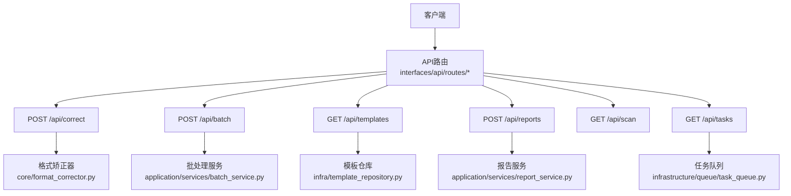
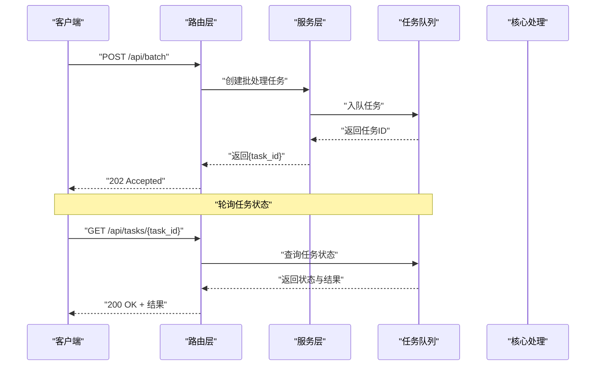
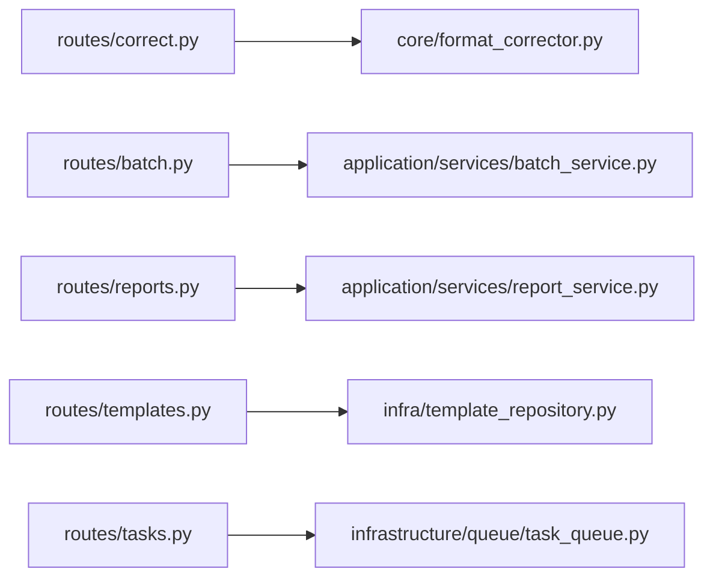

# RESTful API接口

<cite>
**本文引用的文件**   
- [src/paper_format_corrector/interfaces/api/routes/correct.py](file://src/paper_format_corrector/interfaces/api/routes/correct.py)
- [src/paper_format_corrector/interfaces/api/routes/batch.py](file://src/paper_format_corrector/interfaces/api/routes/batch.py)
- [src/paper_format_corrector/interfaces/api/routes/templates.py](file://src/paper_format_corrector/interfaces/api/routes/templates.py)
- [src/paper_format_corrector/interfaces/api/routes/reports.py](file://src/paper_format_corrector/interfaces/api/routes/reports.py)
- [src/paper_format_corrector/interfaces/api/routes/scan.py](file://src/paper_format_corrector/interfaces/api/routes/scan.py)
- [src/paper_format_corrector/interfaces/api/routes/tasks.py](file://src/paper_format_corrector/interfaces/api/routes/tasks.py)
- [src/paper_format_corrector/interfaces/api/app.py](file://src/paper_format_corrector/interfaces/api/app.py)
- [src/paper_format_corrector/application/services/batch_service.py](file://src/paper_format_corrector/application/services/batch_service.py)
- [src/paper_format_corrector/application/services/report_service.py](file://src/paper_format_corrector/application/services/report_service.py)
- [src/paper_format_corrector/core/format_corrector.py](file://src/paper_format_corrector/core/format_corrector.py)
- [src/paper_format_corrector/infrastructure/queue/task_queue.py](file://src/paper_format_corrector/infrastructure/queue/task_queue.py)
- [src/paper_format_corrector/infra/template_repository.py](file://src/paper_format_corrector/infra/template_repository.py)
- [config/config.yaml](file://config/config.yaml)
</cite>

## 目录
1. [简介](#简介)
2. [项目结构](#项目结构)
3. [核心组件](#核心组件)
4. [架构总览](#架构总览)
5. [详细接口说明](#详细接口说明)
6. [依赖分析](#依赖分析)
7. [性能与扩展性](#性能与扩展性)
8. [故障排查指南](#故障排查指南)
9. [结论](#结论)
10. [附录](#附录)

## 简介
本文件为论文格式矫正工具的RESTful API文档，覆盖以下核心端点：
- POST /api/correct：文档格式矫正
- POST /api/batch：批量处理
- GET /api/templates：模板管理（查询）
- POST /api/reports：报告生成
- GET /api/scan：文档扫描
- GET /api/tasks：任务管理（查询）

文档包含每个端点的HTTP方法、URL路径、请求参数、响应格式、状态码、错误处理、示例请求与响应、认证机制、速率限制、数据验证规则与最佳实践，并提供curl示例与常见集成模式。

## 项目结构
API路由位于interfaces/api/routes下，应用服务位于application/services，核心处理逻辑在core与infrastructure层，配置位于config。

图表来源
- [src/paper_format_corrector/interfaces/api/routes/correct.py](file://src/paper_format_corrector/interfaces/api/routes/correct.py)
- [src/paper_format_corrector/interfaces/api/routes/batch.py](file://src/paper_format_corrector/interfaces/api/routes/batch.py)
- [src/paper_format_corrector/interfaces/api/routes/templates.py](file://src/paper_format_corrector/interfaces/api/routes/templates.py)
- [src/paper_format_corrector/interfaces/api/routes/reports.py](file://src/paper_format_corrector/interfaces/api/routes/reports.py)
- [src/paper_format_corrector/interfaces/api/routes/scan.py](file://src/paper_format_corrector/interfaces/api/routes/scan.py)
- [src/paper_format_corrector/interfaces/api/routes/tasks.py](file://src/paper_format_corrector/interfaces/api/routes/tasks.py)
- [src/paper_format_corrector/core/format_corrector.py](file://src/paper_format_corrector/core/format_corrector.py)
- [src/paper_format_corrector/application/services/batch_service.py](file://src/paper_format_corrector/application/services/batch_service.py)
- [src/paper_format_corrector/application/services/report_service.py](file://src/paper_format_corrector/application/services/report_service.py)
- [src/paper_format_corrector/infra/template_repository.py](file://src/paper_format_corrector/infra/template_repository.py)
- [src/paper_format_corrector/infrastructure/queue/task_queue.py](file://src/paper_format_corrector/infrastructure/queue/task_queue.py)

章节来源
- [src/paper_format_corrector/interfaces/api/app.py](file://src/paper_format_corrector/interfaces/api/app.py)

## 核心组件
- 路由层：负责接收HTTP请求、解析参数、调用服务或核心模块、返回统一JSON响应。
- 服务层：封装业务逻辑，如批处理编排、报告生成等。
- 核心层：提供格式矫正、导出、转换等能力。
- 基础设施：任务队列、模板仓库、配置加载等。

章节来源
- [src/paper_format_corrector/interfaces/api/routes/correct.py](file://src/paper_format_corrector/interfaces/api/routes/correct.py)
- [src/paper_format_corrector/interfaces/api/routes/batch.py](file://src/paper_format_corrector/interfaces/api/routes/batch.py)
- [src/paper_format_corrector/interfaces/api/routes/templates.py](file://src/paper_format_corrector/interfaces/api/routes/templates.py)
- [src/paper_format_corrector/interfaces/api/routes/reports.py](file://src/paper_format_corrector/interfaces/api/routes/reports.py)
- [src/paper_format_corrector/interfaces/api/routes/scan.py](file://src/paper_format_corrector/interfaces/api/routes/scan.py)
- [src/paper_format_corrector/interfaces/api/routes/tasks.py](file://src/paper_format_corrector/interfaces/api/routes/tasks.py)
- [src/paper_format_corrector/core/format_corrector.py](file://src/paper_format_corrector/core/format_corrector.py)
- [src/paper_format_corrector/application/services/batch_service.py](file://src/paper_format_corrector/application/services/batch_service.py)
- [src/paper_format_corrector/application/services/report_service.py](file://src/paper_format_corrector/application/services/report_service.py)
- [src/paper_format_corrector/infra/template_repository.py](file://src/paper_format_corrector/infra/template_repository.py)
- [src/paper_format_corrector/infrastructure/queue/task_queue.py](file://src/paper_format_corrector/infrastructure/queue/task_queue.py)

## 架构总览
整体采用分层架构：路由层→服务层→核心/基础设施。异步任务通过任务队列解耦耗时操作。

图表来源
- [src/paper_format_corrector/interfaces/api/routes/batch.py](file://src/paper_format_corrector/interfaces/api/routes/batch.py)
- [src/paper_format_corrector/interfaces/api/routes/tasks.py](file://src/paper_format_corrector/interfaces/api/routes/tasks.py)
- [src/paper_format_corrector/application/services/batch_service.py](file://src/paper_format_corrector/application/services/batch_service.py)
- [src/paper_format_corrector/infrastructure/queue/task_queue.py](file://src/paper_format_corrector/infrastructure/queue/task_queue.py)

## 详细接口说明

### 通用约定
- 内容类型：默认使用 application/json；上传文件时使用 multipart/form-data。
- 统一响应体：
  - 成功：{"code": 0, "message": "ok", "data": ...}
  - 失败：{"code": 非0, "message": "错误描述", "data": null}
- 认证：若启用，需在请求头携带 Authorization: Bearer <token>。
- 速率限制：若启用，超限返回 429，并在响应头包含 Retry-After。
- 字符编码：UTF-8。

章节来源
- [src/paper_format_corrector/interfaces/api/app.py](file://src/paper_format_corrector/interfaces/api/app.py)
- [config/config.yaml](file://config/config.yaml)

---

### POST /api/correct（文档格式矫正）
- 功能：对上传的文档进行格式矫正并返回矫正后的文件或差异信息。
- 请求
  - Content-Type: multipart/form-data
  - 表单字段
    - file: 必填，待矫正文档（支持docx/pdf等）
    - template: 可选，模板标识或模板名
    - options: 可选，JSON字符串，包含矫正选项（如是否保留原样式、是否输出差异等）
- 响应
  - 200：返回矫正后文件下载链接或文件流（根据实现），或返回结构化结果对象
  - 400：参数校验失败
  - 415：不支持的文件类型
  - 500：服务器内部错误
- 示例请求（curl）
  - curl -X POST "http://host:port/api/correct" -F "file=@./paper.docx" -F "template=academic_paper" -F 'options={"keep_styles": true}'
- 示例响应（成功）
  - {"code": 0, "message": "ok", "data": {"download_url": "/output/corrected_abc123.docx", "summary": {"changes": 12}}}
- 示例响应（失败）
  - {"code": 400, "message": "缺少必填字段: file", "data": null}

章节来源
- [src/paper_format_corrector/interfaces/api/routes/correct.py](file://src/paper_format_corrector/interfaces/api/routes/correct.py)
- [src/paper_format_corrector/core/format_corrector.py](file://src/paper_format_corrector/core/format_corrector.py)

---

### POST /api/batch（批量处理）
- 功能：提交批量矫正任务，返回任务ID，后续通过任务接口查询进度与结果。
- 请求
  - Content-Type: application/json
  - 请求体
    - files: 数组，元素为文件路径或base64字符串（依实现而定）
    - template: 可选，模板标识
    - options: 可选，JSON对象，全局处理选项
- 响应
  - 202：已接受，返回任务ID
  - 400：参数校验失败
  - 500：服务器内部错误
- 示例请求（curl）
  - curl -X POST "http://host:port/api/batch" -H "Content-Type: application/json" -d '{"files":["/input/a.docx","/input/b.pdf"],"template":"chinese_thesis"}'
- 示例响应（成功）
  - {"code": 0, "message": "ok", "data": {"task_id": "e1a2b3c4-d5e6-f7g8-h9i0-j1k2l3m4n5o6"}}

章节来源
- [src/paper_format_corrector/interfaces/api/routes/batch.py](file://src/paper_format_corrector/interfaces/api/routes/batch.py)
- [src/paper_format_corrector/application/services/batch_service.py](file://src/paper_format_corrector/application/services/batch_service.py)

---

### GET /api/templates（模板管理）
- 功能：列出可用模板或获取模板详情（按查询参数控制）。
- 查询参数
  - name: 可选，模板名称过滤
  - tag: 可选，标签过滤
  - page/page_size: 可选，分页
- 响应
  - 200：返回模板列表或单个模板详情
  - 400：参数非法
- 示例请求（curl）
  - curl "http://host:port/api/templates?tag=academic&page=1&page_size=20"
- 示例响应（成功）
  - {"code": 0, "message": "ok", "data": {"items": [{"id": "academic_paper", "name": "学术论文", "tags": ["academic"]}], "total": 1}}

章节来源
- [src/paper_format_corrector/interfaces/api/routes/templates.py](file://src/paper_format_corrector/interfaces/api/routes/templates.py)
- [src/paper_format_corrector/infra/template_repository.py](file://src/paper_format_corrector/infra/template_repository.py)

---

### POST /api/reports（报告生成）
- 功能：基于指定文档或任务生成质量/差异报告。
- 请求
  - Content-Type: application/json
  - 请求体
    - task_id: 可选，关联的任务ID
    - file_path: 可选，直接指定文件路径
    - report_type: 可选，报告类型（如diff/quality）
    - options: 可选，报告选项
- 响应
  - 200：返回报告内容或下载链接
  - 400：参数校验失败
  - 404：未找到相关资源
  - 500：服务器内部错误
- 示例请求（curl）
  - curl -X POST "http://host:port/api/reports" -H "Content-Type: application/json" -d '{"task_id":"e1a2b3c4-d5e6-f7g8-h9i0-j1k2l3m4n5o6","report_type":"diff"}'
- 示例响应（成功）
  - {"code": 0, "message": "ok", "data": {"report_url": "/reports/diff_e1a2b3c4.pdf", "summary": {"issues": 5}}}

章节来源
- [src/paper_format_corrector/interfaces/api/routes/reports.py](file://src/paper_format_corrector/interfaces/api/routes/reports.py)
- [src/paper_format_corrector/application/services/report_service.py](file://src/paper_format_corrector/application/services/report_service.py)

---

### GET /api/scan（文档扫描）
- 功能：扫描输入目录，返回可处理的文档清单及元信息。
- 查询参数
  - path: 必填，扫描根路径
  - recursive: 可选，是否递归扫描
  - extensions: 可选，逗号分隔的文件扩展名白名单
- 响应
  - 200：返回文件清单
  - 400：参数非法或路径不存在
  - 500：服务器内部错误
- 示例请求（curl）
  - curl "http://host:port/api/scan?path=/input&recursive=true&extensions=docx,pdf"
- 示例响应（成功）
  - {"code": 0, "message": "ok", "data": {"files": [{"path": "/input/a.docx", "size": 12345}]}}

章节来源
- [src/paper_format_corrector/interfaces/api/routes/scan.py](file://src/paper_format_corrector/interfaces/api/routes/scan.py)

---

### GET /api/tasks（任务管理）
- 功能：查询任务状态与结果，支持按ID或分页查询。
- 查询参数
  - id: 可选，任务ID
  - page/page_size: 可选，分页
- 响应
  - 200：返回任务状态与结果
  - 404：任务不存在
  - 500：服务器内部错误
- 示例请求（curl）
  - curl "http://host:port/api/tasks?id=e1a2b3c4-d5e6-f7g8-h9i0-j1k2l3m4n5o6"
- 示例响应（成功）
  - {"code": 0, "message": "ok", "data": {"task_id": "e1a2b3c4-d5e6-f7g8-h9i0-j1k2l3m4n5o6", "status": "completed", "result": {"outputs": ["/output/a_corrected.docx"]}}}

章节来源
- [src/paper_format_corrector/interfaces/api/routes/tasks.py](file://src/paper_format_corrector/interfaces/api/routes/tasks.py)
- [src/paper_format_corrector/infrastructure/queue/task_queue.py](file://src/paper_format_corrector/infrastructure/queue/task_queue.py)

## 依赖分析
- 路由与服务耦合度低，通过接口传递参数与结果，便于替换实现。
- 批处理与任务队列解耦，提升吞吐与容错。
- 模板仓库独立，支持动态加载与缓存。

图表来源
- [src/paper_format_corrector/interfaces/api/routes/correct.py](file://src/paper_format_corrector/interfaces/api/routes/correct.py)
- [src/paper_format_corrector/interfaces/api/routes/batch.py](file://src/paper_format_corrector/interfaces/api/routes/batch.py)
- [src/paper_format_corrector/interfaces/api/routes/reports.py](file://src/paper_format_corrector/interfaces/api/routes/reports.py)
- [src/paper_format_corrector/interfaces/api/routes/templates.py](file://src/paper_format_corrector/interfaces/api/routes/templates.py)
- [src/paper_format_corrector/interfaces/api/routes/tasks.py](file://src/paper_format_corrector/interfaces/api/routes/tasks.py)
- [src/paper_format_corrector/core/format_corrector.py](file://src/paper_format_corrector/core/format_corrector.py)
- [src/paper_format_corrector/application/services/batch_service.py](file://src/paper_format_corrector/application/services/batch_service.py)
- [src/paper_format_corrector/application/services/report_service.py](file://src/paper_format_corrector/application/services/report_service.py)
- [src/paper_format_corrector/infra/template_repository.py](file://src/paper_format_corrector/infra/template_repository.py)
- [src/paper_format_corrector/infrastructure/queue/task_queue.py](file://src/paper_format_corrector/infrastructure/queue/task_queue.py)

## 性能与扩展性
- 大文件上传：建议分片上传与断点续传（可在网关层实现）。
- 批处理：合理设置并发与队列容量，避免内存溢出。
- 模板加载：启用缓存减少IO开销。
- 报告生成：异步化与增量计算可降低延迟。

[本节为通用指导，不直接分析具体文件]

## 故障排查指南
- 400 参数错误：检查必填字段、类型与取值范围。
- 404 资源不存在：确认模板ID、任务ID或文件路径有效。
- 415 不支持媒体类型：确保Content-Type正确。
- 429 速率限制：遵循Retry-After重试策略。
- 500 服务器错误：查看服务端日志，定位异常堆栈。

章节来源
- [src/paper_format_corrector/interfaces/api/app.py](file://src/paper_format_corrector/interfaces/api/app.py)
- [config/config.yaml](file://config/config.yaml)

## 结论
本API以清晰的分层设计与统一的响应格式，提供文档矫正、批处理、模板管理、报告生成、扫描与任务管理等能力。结合任务队列与模板仓库，可实现高吞吐与可扩展的处理流程。建议在生产环境启用认证与限流，并对大文件与长任务进行优化。

## 附录

### 认证与鉴权
- 方式：Bearer Token
- 请求头：Authorization: Bearer <token>
- 令牌获取：由外部身份服务签发，服务端校验签名与有效期。

章节来源
- [src/paper_format_corrector/interfaces/api/app.py](file://src/paper_format_corrector/interfaces/api/app.py)

### 速率限制
- 策略：滑动窗口或令牌桶
- 响应：429 + Retry-After
- 建议：客户端指数退避重试

章节来源
- [src/paper_format_corrector/interfaces/api/app.py](file://src/paper_format_corrector/interfaces/api/app.py)

### 数据验证规则
- 必填字段：各接口在请求体或查询参数中明确标注
- 类型约束：字符串、布尔、数字、数组等
- 枚举值：如模板标识、报告类型等需符合定义
- 大小限制：文件大小、数组长度、字段长度等

章节来源
- [src/paper_format_corrector/interfaces/api/routes/correct.py](file://src/paper_format_corrector/interfaces/api/routes/correct.py)
- [src/paper_format_corrector/interfaces/api/routes/batch.py](file://src/paper_format_corrector/interfaces/api/routes/batch.py)
- [src/paper_format_corrector/interfaces/api/routes/reports.py](file://src/paper_format_corrector/interfaces/api/routes/reports.py)
- [src/paper_format_corrector/interfaces/api/routes/scan.py](file://src/paper_format_corrector/interfaces/api/routes/scan.py)
- [src/paper_format_corrector/interfaces/api/routes/tasks.py](file://src/paper_format_corrector/interfaces/api/routes/tasks.py)

### 常见集成模式
- 同步矫正：上传文件→等待响应→下载结果
- 异步批处理：提交任务→轮询任务状态→拉取结果
- 模板驱动：先查询模板→选择模板→执行矫正或报告

章节来源
- [src/paper_format_corrector/interfaces/api/routes/batch.py](file://src/paper_format_corrector/interfaces/api/routes/batch.py)
- [src/paper_format_corrector/interfaces/api/routes/tasks.py](file://src/paper_format_corrector/interfaces/api/routes/tasks.py)
- [src/paper_format_corrector/interfaces/api/routes/templates.py](file://src/paper_format_corrector/interfaces/api/routes/templates.py)