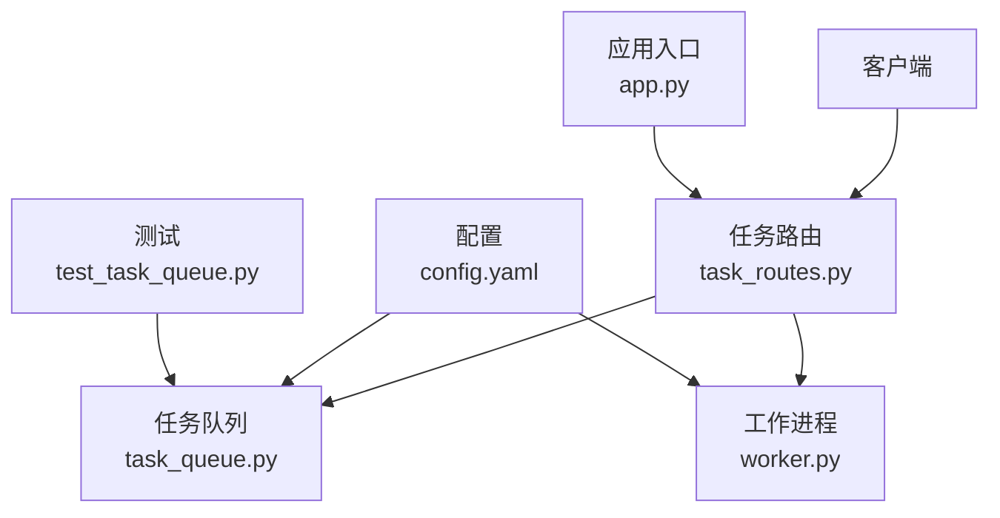
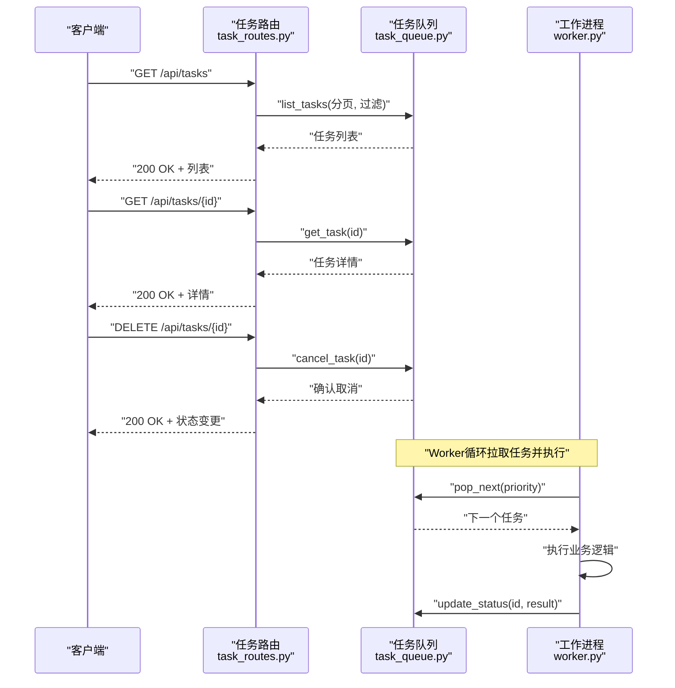
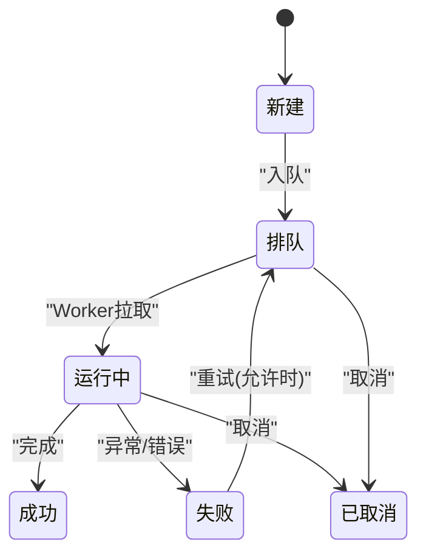
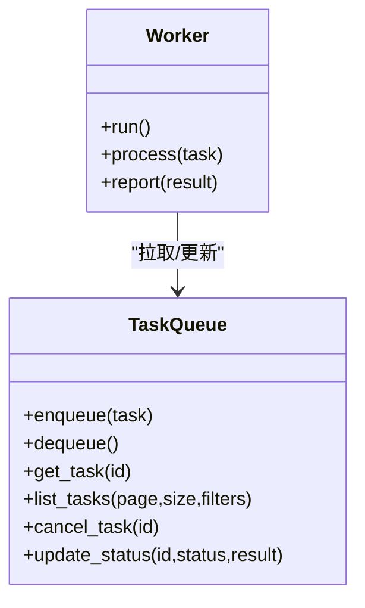
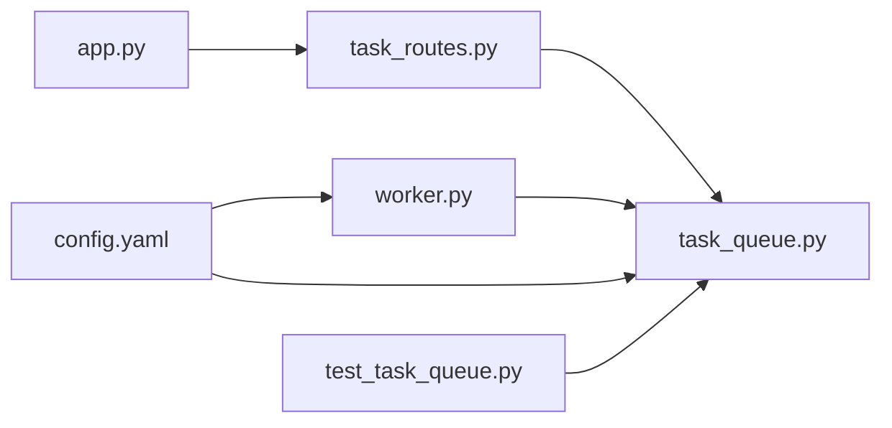

# 任务管理接口

<cite>
**本文引用的文件**   
- [src/paper_format_corrector/interfaces/api/routes/task_routes.py](file://src/paper_format_corrector/interfaces/api/routes/task_routes.py)
- [src/paper_format_corrector/infrastructure/queue/task_queue.py](file://src/paper_format_corrector/infrastructure/queue/task_queue.py)
- [src/paper_format_corrector/infrastructure/queue/worker.py](file://src/paper_format_corrector/infrastructure/queue/worker.py)
- [src/paper_format_corrector/app.py](file://src/paper_format_corrector/app.py)
- [tests/test_task_queue.py](file://tests/test_task_queue.py)
- [config/config.yaml](file://config/config.yaml)
</cite>

## 目录
1. [简介](#简介)
2. [项目结构](#项目结构)
3. [核心组件](#核心组件)
4. [架构总览](#架构总览)
5. [详细组件分析](#详细组件分析)
6. [依赖关系分析](#依赖关系分析)
7. [性能考虑](#性能考虑)
8. [故障排查指南](#故障排查指南)
9. [结论](#结论)
10. [附录](#附录)

## 简介
本文件面向“任务管理API”的开发者与运维人员，系统化说明以下端点：
- GET /api/tasks：查询任务列表（支持分页、过滤）
- GET /api/tasks/{id}：获取指定任务状态
- DELETE /api/tasks/{id}：取消任务

同时覆盖任务生命周期、状态转换、优先级调度与资源管理；并提供监控、日志查看、性能分析与故障排查示例。最后给出分布式任务处理与负载均衡的配置指南。

## 项目结构
与任务管理相关的代码主要分布在以下模块：
- API路由层：定义REST端点与请求校验
- 队列基础设施：任务入队、出队、持久化与状态机
- Worker进程：消费队列并执行任务
- 应用入口：注册路由、启动服务
- 配置：队列参数、并发度、存储路径等
- 测试：验证任务队列行为与边界条件



图表来源
- [src/paper_format_corrector/interfaces/api/routes/task_routes.py](file://src/paper_format_corrector/interfaces/api/routes/task_routes.py)
- [src/paper_format_corrector/infrastructure/queue/task_queue.py](file://src/paper_format_corrector/infrastructure/queue/task_queue.py)
- [src/paper_format_corrector/infrastructure/queue/worker.py](file://src/paper_format_corrector/infrastructure/queue/worker.py)
- [src/paper_format_corrector/app.py](file://src/paper_format_corrector/app.py)
- [config/config.yaml](file://config/config.yaml)
- [tests/test_task_queue.py](file://tests/test_task_queue.py)

章节来源
- [src/paper_format_corrector/interfaces/api/routes/task_routes.py](file://src/paper_format_corrector/interfaces/api/routes/task_routes.py)
- [src/paper_format_corrector/infrastructure/queue/task_queue.py](file://src/paper_format_corrector/infrastructure/queue/task_queue.py)
- [src/paper_format_corrector/infrastructure/queue/worker.py](file://src/paper_format_corrector/infrastructure/queue/worker.py)
- [src/paper_format_corrector/app.py](file://src/paper_format_corrector/app.py)
- [config/config.yaml](file://config/config.yaml)
- [tests/test_task_queue.py](file://tests/test_task_queue.py)

## 核心组件
- 任务路由层
  - 提供GET /api/tasks、GET /api/tasks/{id}、DELETE /api/tasks/{id}三个端点
  - 负责参数校验、权限控制（可选）、调用队列服务、返回统一响应格式
- 任务队列
  - 维护任务集合与状态机（新建、排队、运行中、成功、失败、已取消）
  - 支持按优先级排序、分页查询、按状态过滤
  - 将任务元数据持久化到文件系统或外部存储
- Worker进程
  - 从队列拉取任务，设置状态为运行中，执行业务逻辑
  - 完成后更新结果与状态，记录耗时与错误信息
- 应用入口
  - 初始化配置、启动HTTP服务、注册路由
- 配置
  - 队列容量、最大并发、重试策略、存储路径、日志级别等

章节来源
- [src/paper_format_corrector/interfaces/api/routes/task_routes.py](file://src/paper_format_corrector/interfaces/api/routes/task_routes.py)
- [src/paper_format_corrector/infrastructure/queue/task_queue.py](file://src/paper_format_corrector/infrastructure/queue/task_queue.py)
- [src/paper_format_corrector/infrastructure/queue/worker.py](file://src/paper_format_corrector/infrastructure/queue/worker.py)
- [src/paper_format_corrector/app.py](file://src/paper_format_corrector/app.py)
- [config/config.yaml](file://config/config.yaml)

## 架构总览
下图展示一次典型的任务查询与取消流程，以及Worker对任务的消费过程。



图表来源
- [src/paper_format_corrector/interfaces/api/routes/task_routes.py](file://src/paper_format_corrector/interfaces/api/routes/task_routes.py)
- [src/paper_format_corrector/infrastructure/queue/task_queue.py](file://src/paper_format_corrector/infrastructure/queue/task_queue.py)
- [src/paper_format_corrector/infrastructure/queue/worker.py](file://src/paper_format_corrector/infrastructure/queue/worker.py)

## 详细组件分析

### 任务路由层（REST端点）
- GET /api/tasks
  - 功能：列出任务，支持分页与过滤（如按状态、优先级）
  - 输入：查询参数（page、size、status、priority等）
  - 输出：任务列表与分页元信息
- GET /api/tasks/{id}
  - 功能：获取单个任务的状态与结果摘要
  - 输入：路径参数 id
  - 输出：任务详情
- DELETE /api/tasks/{id}
  - 功能：取消任务（若可取消）
  - 输入：路径参数 id
  - 输出：操作结果与当前状态

```mermaid
flowchart TD
Start(["进入路由"]) --> Validate["校验参数与权限"]
Validate --> Route{"选择端点"}
Route --> |GET /api/tasks| List["调用队列 list_tasks()"]
Route --> |GET /api/tasks/{id}| Get["调用队列 get_task(id)"]
Route --> |DELETE /api/tasks/{id}| Cancel["调用队列 cancel_task(id)"]
List --> RespList["返回任务列表"]
Get --> RespGet["返回任务详情"]
Cancel --> RespCancel["返回取消结果"]
RespList --> End(["结束"])
RespGet --> End
RespCancel --> End
```

图表来源
- [src/paper_format_corrector/interfaces/api/routes/task_routes.py](file://src/paper_format_corrector/interfaces/api/routes/task_routes.py)

章节来源
- [src/paper_format_corrector/interfaces/api/routes/task_routes.py](file://src/paper_format_corrector/interfaces/api/routes/task_routes.py)

### 任务队列与状态机
- 状态定义
  - 新建：任务创建后进入队列
  - 排队：等待被Worker拉取
  - 运行中：Worker正在处理
  - 成功：处理完成且结果可用
  - 失败：处理异常或业务错误
  - 已取消：被用户或系统主动取消
- 优先级调度
  - 基于任务优先级进行出队排序，高优先级优先
- 资源管理
  - 限制队列容量、Worker并发数、单任务超时时间
  - 失败重试次数与退避策略
- 持久化
  - 任务元数据落盘，便于恢复与审计



图表来源
- [src/paper_format_corrector/infrastructure/queue/task_queue.py](file://src/paper_format_corrector/infrastructure/queue/task_queue.py)

章节来源
- [src/paper_format_corrector/infrastructure/queue/task_queue.py](file://src/paper_format_corrector/infrastructure/queue/task_queue.py)

### Worker进程
- 拉取策略
  - 轮询或长轮询，按优先级出队
- 执行模型
  - 单进程多线程或多进程，受并发度配置限制
- 结果上报
  - 更新任务状态、写入结果摘要、记录耗时与错误堆栈
- 健康检查
  - 心跳与存活探针，便于编排平台管理



图表来源
- [src/paper_format_corrector/infrastructure/queue/task_queue.py](file://src/paper_format_corrector/infrastructure/queue/task_queue.py)
- [src/paper_format_corrector/infrastructure/queue/worker.py](file://src/paper_format_corrector/infrastructure/queue/worker.py)

章节来源
- [src/paper_format_corrector/infrastructure/queue/worker.py](file://src/paper_format_corrector/infrastructure/queue/worker.py)

### 应用入口与路由注册
- 初始化配置与日志
- 启动HTTP服务
- 注册任务相关路由
- 优雅关闭与资源清理

章节来源
- [src/paper_format_corrector/app.py](file://src/paper_format_corrector/app.py)

### 配置项（节选）
- 队列容量与并发
  - queue.max_size：队列最大长度
  - worker.concurrency：Worker并发数
- 存储与路径
  - storage.path：任务持久化目录
- 重试与超时
  - retry.max_attempts：最大重试次数
  - task.timeout_seconds：单任务超时秒数
- 日志
  - log.level：日志级别
  - log.dir：日志目录

章节来源
- [config/config.yaml](file://config/config.yaml)

## 依赖关系分析
- 路由层依赖队列服务，不直接访问存储
- Worker依赖队列服务，通过状态机驱动任务流转
- 配置集中管理，影响队列与Worker行为
- 测试用例覆盖队列关键路径，保障稳定性



图表来源
- [src/paper_format_corrector/interfaces/api/routes/task_routes.py](file://src/paper_format_corrector/interfaces/api/routes/task_routes.py)
- [src/paper_format_corrector/infrastructure/queue/task_queue.py](file://src/paper_format_corrector/infrastructure/queue/task_queue.py)
- [src/paper_format_corrector/infrastructure/queue/worker.py](file://src/paper_format_corrector/infrastructure/queue/worker.py)
- [src/paper_format_corrector/app.py](file://src/paper_format_corrector/app.py)
- [config/config.yaml](file://config/config.yaml)
- [tests/test_task_queue.py](file://tests/test_task_queue.py)

章节来源
- [src/paper_format_corrector/interfaces/api/routes/task_routes.py](file://src/paper_format_corrector/interfaces/api/routes/task_routes.py)
- [src/paper_format_corrector/infrastructure/queue/task_queue.py](file://src/paper_format_corrector/infrastructure/queue/task_queue.py)
- [src/paper_format_corrector/infrastructure/queue/worker.py](file://src/paper_format_corrector/infrastructure/queue/worker.py)
- [src/paper_format_corrector/app.py](file://src/paper_format_corrector/app.py)
- [config/config.yaml](file://config/config.yaml)
- [tests/test_task_queue.py](file://tests/test_task_queue.py)

## 性能考虑
- 队列容量与背压
  - 合理设置max_size，避免内存膨胀；必要时引入外部消息队列
- 并发与CPU/IO瓶颈
  - 根据CPU核数与IO特性调整worker.concurrency
- 优先级与公平性
  - 高优先级任务可能饿死低优先级任务，建议加入权重或时间片机制
- 持久化I/O
  - 使用高性能文件系统或对象存储；批量写入与异步落盘
- 超时与重试
  - 合理设置task.timeout_seconds与retry.max_attempts，避免雪崩
- 监控指标
  - 队列长度、平均等待时间、成功率、失败率、Worker利用率

[本节为通用指导，无需源码引用]

## 故障排查指南
- 常见问题
  - 任务堆积：检查队列容量与Worker并发，关注失败率与重试风暴
  - 任务卡住：核对超时配置与Worker健康探针
  - 取消无效：确认任务是否已进入运行中阶段
- 定位步骤
  - 查看任务状态与结果摘要（GET /api/tasks/{id}）
  - 检查Worker日志与错误堆栈
  - 观察队列长度与出队速率
- 恢复策略
  - 扩容Worker实例
  - 降低入队速率或暂停新任务
  - 清理失败任务并重试

章节来源
- [tests/test_task_queue.py](file://tests/test_task_queue.py)

## 结论
本任务管理API以清晰的分层设计实现任务查询、状态获取与取消能力，并通过队列与Worker完成优先级调度与资源管理。配合合理的配置与监控，可在单机与分布式环境下稳定运行。

[本节为总结，无需源码引用]

## 附录

### API参考（摘要）
- GET /api/tasks
  - 描述：查询任务列表
  - 查询参数：page、size、status、priority
  - 返回：任务列表与分页信息
- GET /api/tasks/{id}
  - 描述：获取任务状态与结果摘要
  - 路径参数：id
  - 返回：任务详情
- DELETE /api/tasks/{id}
  - 描述：取消任务
  - 路径参数：id
  - 返回：操作结果与当前状态

[本节为接口摘要，无需源码引用]

### 监控与日志示例
- 监控指标采集
  - 暴露队列长度、出队速率、任务耗时分布、失败率等指标
- 日志查看
  - 聚合Worker与应用日志，按任务ID关联追踪
- 性能分析
  - 结合指标与日志定位热点与瓶颈

[本节为通用实践，无需源码引用]

### 分布式任务处理与负载均衡
- 多实例部署
  - 多个Worker实例共享同一队列后端（文件或外部消息队列）
- 负载均衡
  - 在HTTP网关层对路由服务做负载均衡，确保高可用
- 配置要点
  - 统一队列存储地址与认证
  - 合理设置并发与超时，避免争用
  - 启用健康检查与自动重启

[本节为通用方案，无需源码引用]