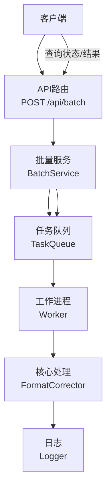
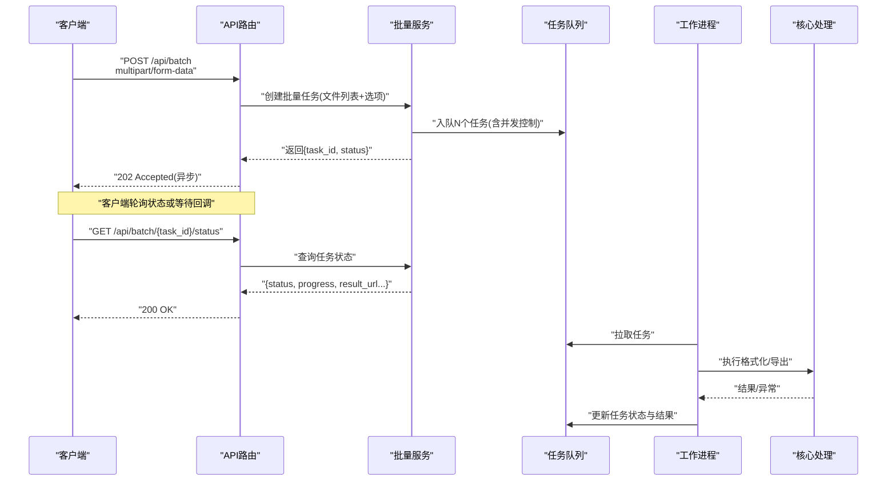
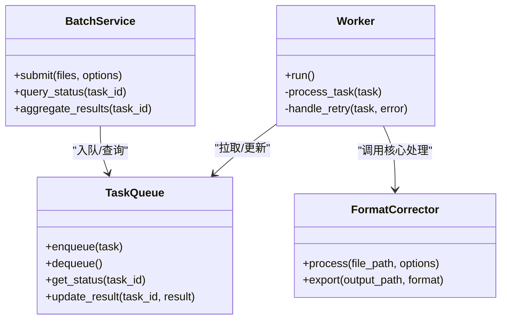
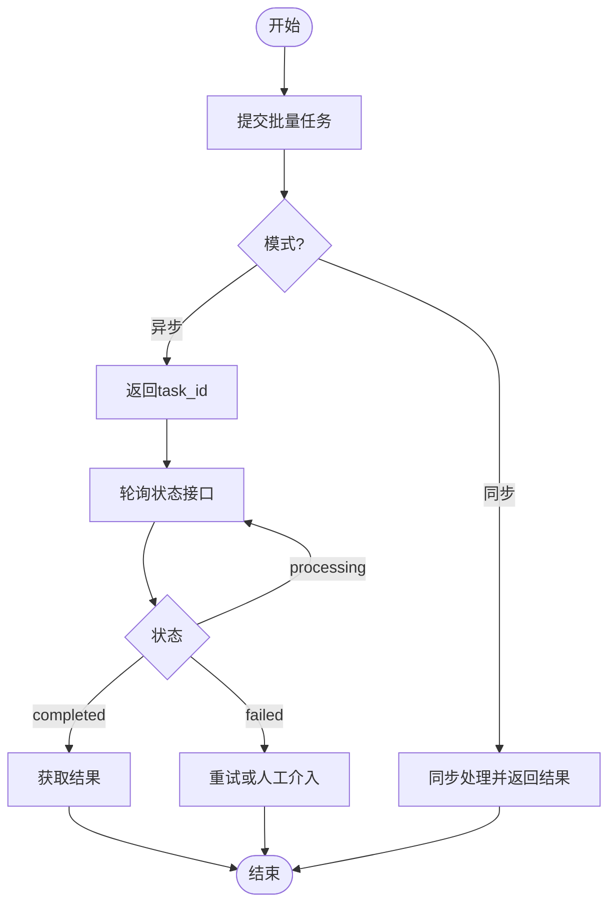

# 批量处理接口

<cite>
**本文引用的文件**   
- [src/paper_format_corrector/interfaces/api/routes/batch.py](file://src/paper_format_corrector/interfaces/api/routes/batch.py)
- [src/paper_format_corrector/application/services/batch_service.py](file://src/paper_format_corrector/application/services/batch_service.py)
- [src/paper_format_corrector/infrastructure/queue/task_queue.py](file://src/paper_format_corrector/infrastructure/queue/task_queue.py)
- [src/paper_format_corrector/infrastructure/queue/worker.py](file://src/paper_format_corrector/infrastructure/queue/worker.py)
- [src/paper_format_corrector/core/format_corrector.py](file://src/paper_format_corrector/core/format_corrector.py)
- [src/paper_format_corrector/infra/logger.py](file://src/paper_format_corrector/infra/logger.py)
- [tests/test_task_queue.py](file://tests/test_task_queue.py)
</cite>

## 目录
1. [简介](#简介)
2. [项目结构](#项目结构)
3. [核心组件](#核心组件)
4. [架构总览](#架构总览)
5. [详细组件分析](#详细组件分析)
6. [依赖分析](#依赖分析)
7. [性能考虑](#性能考虑)
8. [故障排查指南](#故障排查指南)
9. [结论](#结论)
10. [附录](#附录)

## 简介
本文件面向使用“批量处理API”的开发者与集成方，聚焦于 POST /api/batch 端点的设计与实现。该接口支持：
- 批量文件上传（多文件、大文件）
- 任务队列管理与并发控制
- 异步处理模式（提交即返回）
- 进度跟踪与结果获取
- 错误重试机制与可观测性

文档同时提供请求参数、响应格式、调用示例以及大规模文档处理的优化建议与最佳实践。

## 项目结构
与批量处理相关的代码主要分布在以下模块：
- API路由层：定义HTTP接口与入参校验
- 应用服务层：编排批量任务创建、状态查询与结果聚合
- 基础设施层：任务队列与后台工作进程
- 核心处理层：格式化矫正等具体业务逻辑
- 日志与可观测性：统一日志记录

图表来源
- [src/paper_format_corrector/interfaces/api/routes/batch.py](file://src/paper_format_corrector/interfaces/api/routes/batch.py)
- [src/paper_format_corrector/application/services/batch_service.py](file://src/paper_format_corrector/application/services/batch_service.py)
- [src/paper_format_corrector/infrastructure/queue/task_queue.py](file://src/paper_format_corrector/infrastructure/queue/task_queue.py)
- [src/paper_format_corrector/infrastructure/queue/worker.py](file://src/paper_format_corrector/infrastructure/queue/worker.py)
- [src/paper_format_corrector/core/format_corrector.py](file://src/paper_format_corrector/core/format_corrector.py)
- [src/paper_format_corrector/infra/logger.py](file://src/paper_format_corrector/infra/logger.py)

章节来源
- [src/paper_format_corrector/interfaces/api/routes/batch.py](file://src/paper_format_corrector/interfaces/api/routes/batch.py)
- [src/paper_format_corrector/application/services/batch_service.py](file://src/paper_format_corrector/application/services/batch_service.py)
- [src/paper_format_corrector/infrastructure/queue/task_queue.py](file://src/paper_format_corrector/infrastructure/queue/task_queue.py)
- [src/paper_format_corrector/infrastructure/queue/worker.py](file://src/paper_format_corrector/infrastructure/queue/worker.py)
- [src/paper_format_corrector/core/format_corrector.py](file://src/paper_format_corrector/core/format_corrector.py)
- [src/paper_format_corrector/infra/logger.py](file://src/paper_format_corrector/infra/logger.py)

## 核心组件
- API路由层
  - 负责接收多文件上传、解析请求体、校验参数并委托给批量服务。
  - 支持同步/异步两种模式；异步模式下立即返回任务ID，供后续查询。
- 批量服务层
  - 将每个文件映射为独立任务，写入任务队列，维护任务元数据与状态。
  - 提供任务状态查询与结果聚合能力。
- 任务队列与工作进程
  - 任务队列持久化任务消息，支持并发消费。
  - 工作进程从队列拉取任务，执行核心处理逻辑，更新任务状态与结果。
- 核心处理层
  - 执行具体的文档格式化矫正、导出等操作。
- 日志
  - 统一记录关键流程与异常信息，便于问题定位与审计。

章节来源
- [src/paper_format_corrector/interfaces/api/routes/batch.py](file://src/paper_format_corrector/interfaces/api/routes/batch.py)
- [src/paper_format_corrector/application/services/batch_service.py](file://src/paper_format_corrector/application/services/batch_service.py)
- [src/paper_format_corrector/infrastructure/queue/task_queue.py](file://src/paper_format_corrector/infrastructure/queue/task_queue.py)
- [src/paper_format_corrector/infrastructure/queue/worker.py](file://src/paper_format_corrector/infrastructure/queue/worker.py)
- [src/paper_format_corrector/core/format_corrector.py](file://src/paper_format_corrector/core/format_corrector.py)
- [src/paper_format_corrector/infra/logger.py](file://src/paper_format_corrector/infra/logger.py)

## 架构总览
下图展示了从客户端发起批量处理到结果产出的完整链路，包括异步模式下的状态轮询与结果获取。

图表来源
- [src/paper_format_corrector/interfaces/api/routes/batch.py](file://src/paper_format_corrector/interfaces/api/routes/batch.py)
- [src/paper_format_corrector/application/services/batch_service.py](file://src/paper_format_corrector/application/services/batch_service.py)
- [src/paper_format_corrector/infrastructure/queue/task_queue.py](file://src/paper_format_corrector/infrastructure/queue/task_queue.py)
- [src/paper_format_corrector/infrastructure/queue/worker.py](file://src/paper_format_corrector/infrastructure/queue/worker.py)
- [src/paper_format_corrector/core/format_corrector.py](file://src/paper_format_corrector/core/format_corrector.py)

## 详细组件分析

### 接口定义：POST /api/batch
- 功能
  - 接收批量文件与处理选项，创建任务集合并返回任务标识。
  - 支持同步与异步两种模式；默认推荐异步以承载大规模任务。
- 请求
  - 内容类型：multipart/form-data
  - 表单字段
    - files: 多个文件对象（支持docx/pdf等）
    - options: JSON字符串或对象，包含处理选项与并发控制
      - mode: sync | async（可选，默认async）
      - concurrency: 整数（可选，限制并发度）
      - retry_policy: 重试策略配置（可选）
        - max_retries: 最大重试次数
        - backoff: 退避策略（如exponential）
        - timeout_seconds: 单任务超时
      - output_format: 输出格式（如docx/pdf/html）
      - template: 模板标识或路径（可选）
      - extra: 扩展参数（可选）
- 响应
  - 成功
    - 202 Accepted（异步）
      - task_id: 批次任务ID
      - status: pending/processing/completed/failed
      - message: 提示信息
    - 200 OK（同步）
      - 直接返回处理结果摘要或下载链接
  - 失败
    - 400/422: 参数校验失败
    - 5xx: 服务端异常
- 注意事项
  - 大文件上传需配合网关/代理的超时与大小限制调整
  - 异步模式下建议客户端轮询状态接口或使用回调

章节来源
- [src/paper_format_corrector/interfaces/api/routes/batch.py](file://src/paper_format_corrector/interfaces/api/routes/batch.py)
- [src/paper_format_corrector/application/services/batch_service.py](file://src/paper_format_corrector/application/services/batch_service.py)

### 批量服务：BatchService
- 职责
  - 解析请求参数，生成任务清单
  - 根据并发控制将任务入队
  - 维护任务生命周期与状态聚合
- 关键流程
  - 参数校验与规范化
  - 任务去重与分片（按文件大小/复杂度）
  - 批量入队与并发上限控制
  - 返回任务ID与初始状态
- 状态与结果
  - 支持查询单个任务与批次汇总
  - 结果存储位置由配置决定（本地/对象存储）

章节来源
- [src/paper_format_corrector/application/services/batch_service.py](file://src/paper_format_corrector/application/services/batch_service.py)

### 任务队列与工作进程
- 任务队列
  - 持久化任务消息，支持优先级与重试
  - 暴露入队、出队、状态查询接口
- 工作进程
  - 从队列拉取任务，执行核心处理
  - 更新任务状态、进度与结果
  - 捕获异常并触发重试策略

图表来源
- [src/paper_format_corrector/infrastructure/queue/task_queue.py](file://src/paper_format_corrector/infrastructure/queue/task_queue.py)
- [src/paper_format_corrector/infrastructure/queue/worker.py](file://src/paper_format_corrector/infrastructure/queue/worker.py)
- [src/paper_format_corrector/application/services/batch_service.py](file://src/paper_format_corrector/application/services/batch_service.py)
- [src/paper_format_corrector/core/format_corrector.py](file://src/paper_format_corrector/core/format_corrector.py)

章节来源
- [src/paper_format_corrector/infrastructure/queue/task_queue.py](file://src/paper_format_corrector/infrastructure/queue/task_queue.py)
- [src/paper_format_corrector/infrastructure/queue/worker.py](file://src/paper_format_corrector/infrastructure/queue/worker.py)

### 核心处理：FormatCorrector
- 职责
  - 对单个文件执行格式化矫正、引用修复、样式应用等
  - 输出指定格式的结果文件
- 输入/输出
  - 输入：文件路径、处理选项
  - 输出：结果文件路径、统计信息、错误详情
- 错误处理
  - 结构化异常，便于重试与上报
  - 记录详细日志，包含上下文与耗时

章节来源
- [src/paper_format_corrector/core/format_corrector.py](file://src/paper_format_corrector/core/format_corrector.py)
- [src/paper_format_corrector/infra/logger.py](file://src/paper_format_corrector/infra/logger.py)

### 异步处理与进度跟踪
- 异步模式
  - 提交后立即返回task_id，客户端通过状态接口轮询
- 进度跟踪
  - 任务级进度：pending/processing/completed/failed
  - 批次级汇总：已完成数/总数、失败数、平均耗时
- 结果获取
  - 完成后可通过结果URL或专用接口下载

图表来源
- [src/paper_format_corrector/interfaces/api/routes/batch.py](file://src/paper_format_corrector/interfaces/api/routes/batch.py)
- [src/paper_format_corrector/application/services/batch_service.py](file://src/paper_format_corrector/application/services/batch_service.py)

章节来源
- [src/paper_format_corrector/interfaces/api/routes/batch.py](file://src/paper_format_corrector/interfaces/api/routes/batch.py)
- [src/paper_format_corrector/application/services/batch_service.py](file://src/paper_format_corrector/application/services/batch_service.py)

### 错误重试机制
- 重试策略
  - 最大重试次数、指数退避、超时控制
- 触发条件
  - 网络抖动、临时资源不可用、外部依赖限流
- 幂等性
  - 任务ID唯一，重复提交不会导致重复处理
- 失败降级
  - 部分失败不影响其他任务，支持单独重试

章节来源
- [src/paper_format_corrector/infrastructure/queue/task_queue.py](file://src/paper_format_corrector/infrastructure/queue/task_queue.py)
- [src/paper_format_corrector/infrastructure/queue/worker.py](file://src/paper_format_corrector/infrastructure/queue/worker.py)
- [src/paper_format_corrector/application/services/batch_service.py](file://src/paper_format_corrector/application/services/batch_service.py)

### 使用示例（概念性说明）
- 异步提交
  - 使用multipart/form-data上传files与options，mode=async
  - 获得task_id后轮询状态接口直至completed
- 同步提交
  - 设置mode=sync，适用于小批量、低延迟场景
- 结果下载
  - 完成后通过结果URL或专用接口获取打包结果

[本节为概念性说明，不直接分析具体文件]

## 依赖分析
- 组件耦合
  - API路由仅依赖批量服务，保持薄控制器
  - 批量服务依赖任务队列与工作进程，解耦处理逻辑
  - 工作进程依赖核心处理与日志，职责单一
- 外部依赖
  - 任务队列可能基于内存/磁盘/消息中间件
  - 结果存储可能为本地文件系统或对象存储
- 潜在风险
  - 队列积压导致处理延迟
  - 大文件导致内存峰值升高
  - 外部依赖不稳定引发重试风暴

图表来源
- [src/paper_format_corrector/interfaces/api/routes/batch.py](file://src/paper_format_corrector/interfaces/api/routes/batch.py)
- [src/paper_format_corrector/application/services/batch_service.py](file://src/paper_format_corrector/application/services/batch_service.py)
- [src/paper_format_corrector/infrastructure/queue/task_queue.py](file://src/paper_format_corrector/infrastructure/queue/task_queue.py)
- [src/paper_format_corrector/infrastructure/queue/worker.py](file://src/paper_format_corrector/infrastructure/queue/worker.py)
- [src/paper_format_corrector/core/format_corrector.py](file://src/paper_format_corrector/core/format_corrector.py)
- [src/paper_format_corrector/infra/logger.py](file://src/paper_format_corrector/infra/logger.py)

章节来源
- [src/paper_format_corrector/interfaces/api/routes/batch.py](file://src/paper_format_corrector/interfaces/api/routes/batch.py)
- [src/paper_format_corrector/application/services/batch_service.py](file://src/paper_format_corrector/application/services/batch_service.py)
- [src/paper_format_corrector/infrastructure/queue/task_queue.py](file://src/paper_format_corrector/infrastructure/queue/task_queue.py)
- [src/paper_format_corrector/infrastructure/queue/worker.py](file://src/paper_format_corrector/infrastructure/queue/worker.py)
- [src/paper_format_corrector/core/format_corrector.py](file://src/paper_format_corrector/core/format_corrector.py)
- [src/paper_format_corrector/infra/logger.py](file://src/paper_format_corrector/infra/logger.py)

## 性能考虑
- 并发控制
  - 合理设置concurrency，避免CPU/IO瓶颈
  - 结合系统资源监控动态调整
- 批处理分片
  - 大任务拆分为子任务，提升吞吐与容错
- 缓存与复用
  - 模板、字体、样式等资源预加载与共享
- I/O优化
  - 使用流式读写，减少内存占用
  - 结果文件压缩与增量输出
- 队列与持久化
  - 选择高可用队列后端，避免单点故障
  - 定期清理过期任务与结果
- 监控与告警
  - 记录关键指标：队列长度、处理时长、失败率
  - 设置阈值告警，及时扩容或限流

[本节提供通用指导，不直接分析具体文件]

## 故障排查指南
- 常见问题
  - 任务长时间pending：检查队列是否被消费、工作进程是否存活
  - 处理失败：查看任务日志与异常堆栈，确认输入文件有效性
  - 结果缺失：检查结果存储路径与权限
- 定位方法
  - 通过task_id检索任务日志
  - 检查队列状态与重试计数
  - 核对并发配置与系统资源使用
- 恢复策略
  - 手动重试失败任务
  - 重启工作进程或扩容实例
  - 清理阻塞任务，释放队列

章节来源
- [src/paper_format_corrector/infra/logger.py](file://src/paper_format_corrector/infra/logger.py)
- [tests/test_task_queue.py](file://tests/test_task_queue.py)

## 结论
POST /api/batch 提供了稳定、可扩展的批量处理能力，结合异步模式、任务队列与重试机制，能够高效支撑大规模文档处理场景。通过合理的并发控制、I/O优化与监控告警，可在保证质量的同时最大化吞吐与稳定性。

[本节为总结性内容，不直接分析具体文件]

## 附录
- 术语
  - 任务ID：批次任务的唯一标识
  - 进度：任务所处阶段与完成比例
  - 重试策略：失败后的自动恢复策略
- 参考测试
  - 队列行为与边界用例可参考相关测试文件

章节来源
- [tests/test_task_queue.py](file://tests/test_task_queue.py)