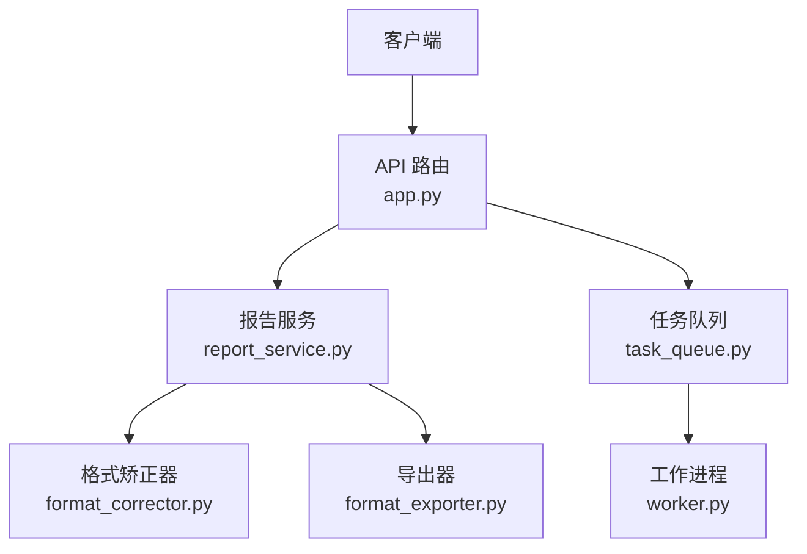
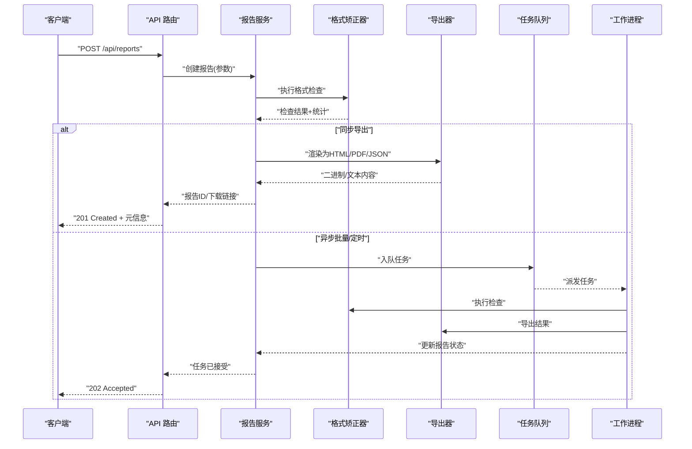
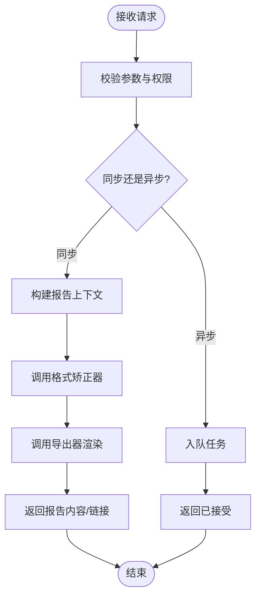
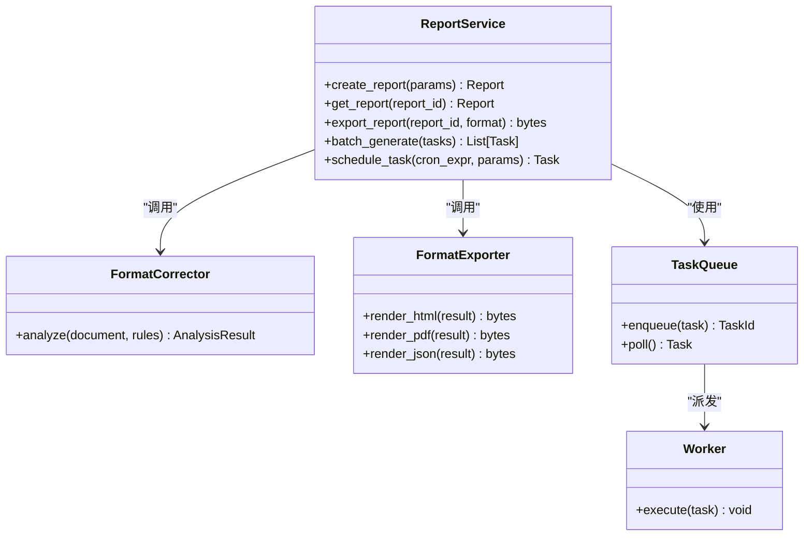
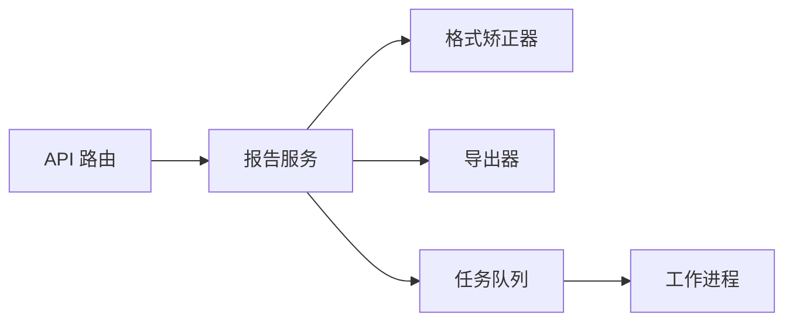

# 报告服务接口

<cite>
**本文引用的文件**   
- [src/paper_format_corrector/api/app.py](file://src/paper_format_corrector/api/app.py)
- [src/paper_format_corrector/application/services/report_service.py](file://src/paper_format_corrector/application/services/report_service.py)
- [src/paper_format_corrector/infrastructure/exporters/format_exporter.py](file://src/paper_format_corrector/infrastructure/exporters/format_exporter.py)
- [src/paper_format_corrector/core/format_corrector.py](file://src/paper_format_corrector/core/format_corrector.py)
- [src/paper_format_corrector/infrastructure/queue/task_queue.py](file://src/paper_format_corrector/infrastructure/queue/task_queue.py)
- [src/paper_format_corrector/infrastructure/queue/worker.py](file://src/paper_format_corrector/infrastructure/queue/worker.py)
- [tests/test_report_service.py](file://tests/test_report_service.py)
- [tests/test_api_endpoints.py](file://tests/test_api_endpoints.py)
</cite>

## 目录
1. [简介](#简介)
2. [项目结构](#项目结构)
3. [核心组件](#核心组件)
4. [架构总览](#架构总览)
5. [详细组件分析](#详细组件分析)
6. [依赖关系分析](#依赖关系分析)
7. [性能考虑](#性能考虑)
8. [故障排查指南](#故障排查指南)
9. [结论](#结论)
10. [附录](#附录)

## 简介
本报告服务面向文档格式检查与报告生成，提供以下能力：
- 生成格式检查报告（支持 HTML、PDF、JSON）
- 查询报告详情
- 导出报告为指定格式
- 批量生成与定时任务集成
- 报告定制与可视化统计

该服务通过 REST API 暴露能力，内部由应用层服务编排核心格式化与导出逻辑，并可通过队列进行异步处理。

## 项目结构
与报告服务相关的代码主要分布在如下模块：
- API 路由与应用入口：定义 HTTP 端点与请求响应流程
- 应用服务：封装业务编排（报告生成、导出、批量等）
- 核心引擎：格式检查与修正
- 导出器：将结构化结果渲染为 HTML/PDF/JSON
- 任务队列：异步执行耗时任务（批量、定时）

图表来源
- [src/paper_format_corrector/api/app.py](file://src/paper_format_corrector/api/app.py)
- [src/paper_format_corrector/application/services/report_service.py](file://src/paper_format_corrector/application/services/report_service.py)
- [src/paper_format_corrector/core/format_corrector.py](file://src/paper_format_corrector/core/format_corrector.py)
- [src/paper_format_corrector/infrastructure/exporters/format_exporter.py](file://src/paper_format_corrector/infrastructure/exporters/format_exporter.py)
- [src/paper_format_corrector/infrastructure/queue/task_queue.py](file://src/paper_format_corrector/infrastructure/queue/task_queue.py)
- [src/paper_format_corrector/infrastructure/queue/worker.py](file://src/paper_format_corrector/infrastructure/queue/worker.py)

章节来源
- [src/paper_format_corrector/api/app.py](file://src/paper_format_corrector/api/app.py)
- [src/paper_format_corrector/application/services/report_service.py](file://src/paper_format_corrector/application/services/report_service.py)
- [src/paper_format_corrector/core/format_corrector.py](file://src/paper_format_corrector/core/format_corrector.py)
- [src/paper_format_corrector/infrastructure/exporters/format_exporter.py](file://src/paper_format_corrector/infrastructure/exporters/format_exporter.py)
- [src/paper_format_corrector/infrastructure/queue/task_queue.py](file://src/paper_format_corrector/infrastructure/queue/task_queue.py)
- [src/paper_format_corrector/infrastructure/queue/worker.py](file://src/paper_format_corrector/infrastructure/queue/worker.py)

## 核心组件
- API 路由层
  - 负责解析请求参数、校验输入、调用应用服务、返回统一响应体
  - 关键端点：POST /api/reports、GET /api/reports/{id}、GET /api/reports/export
- 报告服务（ReportService）
  - 编排格式检查、统计计算、可视化数据准备、持久化与导出
- 格式矫正器（FormatCorrector）
  - 执行规则检测与问题定位，产出结构化检查结果
- 导出器（FormatExporter）
  - 将结构化结果渲染为 HTML、PDF、JSON
- 任务队列与工作进程
  - 支持批量生成与定时任务的异步执行

章节来源
- [src/paper_format_corrector/api/app.py](file://src/paper_format_corrector/api/app.py)
- [src/paper_format_corrector/application/services/report_service.py](file://src/paper_format_corrector/application/services/report_service.py)
- [src/paper_format_corrector/core/format_corrector.py](file://src/paper_format_corrector/core/format_corrector.py)
- [src/paper_format_corrector/infrastructure/exporters/format_exporter.py](file://src/paper_format_corrector/infrastructure/exporters/format_exporter.py)
- [src/paper_format_corrector/infrastructure/queue/task_queue.py](file://src/paper_format_corrector/infrastructure/queue/task_queue.py)
- [src/paper_format_corrector/infrastructure/queue/worker.py](file://src/paper_format_corrector/infrastructure/queue/worker.py)

## 架构总览
报告服务的整体交互流程如下：
- 客户端发起创建报告请求，路由层校验后交由报告服务
- 报告服务调用格式矫正器进行分析，汇总统计与可视化数据
- 根据请求或配置选择导出格式，调用导出器生成最终产物
- 对于批量或定时任务，通过任务队列异步执行，工作进程完成实际处理

图表来源
- [src/paper_format_corrector/api/app.py](file://src/paper_format_corrector/api/app.py)
- [src/paper_format_corrector/application/services/report_service.py](file://src/paper_format_corrector/application/services/report_service.py)
- [src/paper_format_corrector/core/format_corrector.py](file://src/paper_format_corrector/core/format_corrector.py)
- [src/paper_format_corrector/infrastructure/exporters/format_exporter.py](file://src/paper_format_corrector/infrastructure/exporters/format_exporter.py)
- [src/paper_format_corrector/infrastructure/queue/task_queue.py](file://src/paper_format_corrector/infrastructure/queue/task_queue.py)
- [src/paper_format_corrector/infrastructure/queue/worker.py](file://src/paper_format_corrector/infrastructure/queue/worker.py)

## 详细组件分析

### API 路由层
- POST /api/reports
  - 功能：提交待检查的文档或参数，生成格式检查报告
  - 输入：文档路径/内容、模板/预设、导出格式、是否异步
  - 输出：报告 ID、状态、可选的下载链接
- GET /api/reports/{id}
  - 功能：获取指定报告的详情（包含统计、问题列表、可视化数据摘要）
  - 输出：报告元信息、状态、时间戳、统计摘要
- GET /api/reports/export
  - 功能：按报告 ID 导出为指定格式（HTML、PDF、JSON）
  - 输出：二进制流或文本内容，附带 Content-Type

图表来源
- [src/paper_format_corrector/api/app.py](file://src/paper_format_corrector/api/app.py)
- [src/paper_format_corrector/application/services/report_service.py](file://src/paper_format_corrector/application/services/report_service.py)

章节来源
- [src/paper_format_corrector/api/app.py](file://src/paper_format_corrector/api/app.py)
- [tests/test_api_endpoints.py](file://tests/test_api_endpoints.py)

### 报告服务（ReportService）
职责：
- 组装报告上下文（文档、模板、规则集、导出选项）
- 协调格式矫正器执行分析
- 聚合统计指标与可视化数据
- 管理报告生命周期（创建、查询、导出、清理）
- 对接任务队列以支持批量与定时任务

图表来源
- [src/paper_format_corrector/application/services/report_service.py](file://src/paper_format_corrector/application/services/report_service.py)
- [src/paper_format_corrector/core/format_corrector.py](file://src/paper_format_corrector/core/format_corrector.py)
- [src/paper_format_corrector/infrastructure/exporters/format_exporter.py](file://src/paper_format_corrector/infrastructure/exporters/format_exporter.py)
- [src/paper_format_corrector/infrastructure/queue/task_queue.py](file://src/paper_format_corrector/infrastructure/queue/task_queue.py)
- [src/paper_format_corrector/infrastructure/queue/worker.py](file://src/paper_format_corrector/infrastructure/queue/worker.py)

章节来源
- [src/paper_format_corrector/application/services/report_service.py](file://src/paper_format_corrector/application/services/report_service.py)
- [tests/test_report_service.py](file://tests/test_report_service.py)

### 导出器（FormatExporter）
- HTML 导出：生成包含统计概览、问题清单、图表占位与可交互元素的页面
- PDF 导出：基于 HTML 或模板渲染为 PDF，适合打印与归档
- JSON 导出：结构化数据，便于二次分析与集成

章节来源
- [src/paper_format_corrector/infrastructure/exporters/format_exporter.py](file://src/paper_format_corrector/infrastructure/exporters/format_exporter.py)

### 任务队列与工作进程
- 任务队列：用于解耦耗时操作（批量生成、定时任务），支持持久化与重试
- 工作进程：消费任务，执行格式检查与导出，更新报告状态

章节来源
- [src/paper_format_corrector/infrastructure/queue/task_queue.py](file://src/paper_format_corrector/infrastructure/queue/task_queue.py)
- [src/paper_format_corrector/infrastructure/queue/worker.py](file://src/paper_format_corrector/infrastructure/queue/worker.py)

## 依赖关系分析
- 低耦合高内聚：API 路由仅负责协议适配；报告服务编排业务；导出器专注渲染；队列与进程解耦耗时任务
- 外部依赖：
  - 文档解析与规则引擎（在格式矫正器中实现）
  - 导出库（HTML/PDF/JSON）
  - 任务存储（队列后端）

图表来源
- [src/paper_format_corrector/api/app.py](file://src/paper_format_corrector/api/app.py)
- [src/paper_format_corrector/application/services/report_service.py](file://src/paper_format_corrector/application/services/report_service.py)
- [src/paper_format_corrector/core/format_corrector.py](file://src/paper_format_corrector/core/format_corrector.py)
- [src/paper_format_corrector/infrastructure/exporters/format_exporter.py](file://src/paper_format_corrector/infrastructure/exporters/format_exporter.py)
- [src/paper_format_corrector/infrastructure/queue/task_queue.py](file://src/paper_format_corrector/infrastructure/queue/task_queue.py)
- [src/paper_format_corrector/infrastructure/queue/worker.py](file://src/paper_format_corrector/infrastructure/queue/worker.py)

章节来源
- [src/paper_format_corrector/api/app.py](file://src/paper_format_corrector/api/app.py)
- [src/paper_format_corrector/application/services/report_service.py](file://src/paper_format_corrector/application/services/report_service.py)
- [src/paper_format_corrector/core/format_corrector.py](file://src/paper_format_corrector/core/format_corrector.py)
- [src/paper_format_corrector/infrastructure/exporters/format_exporter.py](file://src/paper_format_corrector/infrastructure/exporters/format_exporter.py)
- [src/paper_format_corrector/infrastructure/queue/task_queue.py](file://src/paper_format_corrector/infrastructure/queue/task_queue.py)
- [src/paper_format_corrector/infrastructure/queue/worker.py](file://src/paper_format_corrector/infrastructure/queue/worker.py)

## 性能考虑
- 异步优先：对大文档或批量任务建议采用异步模式，避免阻塞请求线程
- 缓存策略：对相同模板与规则的中间结果可缓存，减少重复计算
- 分页与增量：报告详情与问题列表支持分页，按需加载
- 资源限制：导出 PDF 时控制并发与内存占用，必要时拆分任务
- 监控与告警：记录关键指标（处理时长、错误率、队列积压）

## 故障排查指南
- 常见问题
  - 参数缺失或类型错误：检查请求体字段与必填项
  - 文档不可读或路径不安全：确认文件存在且路径白名单通过
  - 导出失败：检查导出库安装与环境依赖
  - 队列堆积：检查工作进程数量与任务重试策略
- 诊断步骤
  - 查看 API 日志与错误堆栈
  - 检查任务队列状态与失败任务
  - 验证报告服务与导出器的中间产物
  - 复现最小用例并逐步缩小范围

章节来源
- [tests/test_api_endpoints.py](file://tests/test_api_endpoints.py)
- [tests/test_report_service.py](file://tests/test_report_service.py)

## 结论
报告服务通过清晰的层次划分与职责分离，提供了稳定高效的格式检查与报告生成能力。借助任务队列与工作进程，系统能够支撑批量与定时场景。导出器支持多格式输出，满足多样化需求。建议在部署时关注异步化、缓存与监控，以获得更好的性能与可观测性。

## 附录

### API 规范要点
- POST /api/reports
  - 用途：创建格式检查报告
  - 典型参数：文档源、模板/预设、导出格式、是否异步
  - 响应：报告 ID、状态、下载链接（可选）
- GET /api/reports/{id}
  - 用途：获取报告详情
  - 响应：元信息、统计摘要、问题列表（分页）、可视化数据摘要
- GET /api/reports/export
  - 用途：导出报告
  - 参数：报告 ID、目标格式（html/pdf/json）
  - 响应：二进制或文本内容，Content-Type 对应格式

章节来源
- [src/paper_format_corrector/api/app.py](file://src/paper_format_corrector/api/app.py)
- [tests/test_api_endpoints.py](file://tests/test_api_endpoints.py)

### 报告内容与结构
- 统计信息
  - 文档基本信息（标题、作者、页数、字数等）
  - 规则命中统计（按类别/严重级别）
  - 趋势与分布（如问题随段落分布）
- 可视化图表
  - 饼图/柱状图：问题类别占比
  - 折线图：质量评分变化
  - 热力图：问题密度分布
- 问题清单
  - 位置定位（章节/段落/行号）
  - 描述与建议修复
  - 关联规则与参考链接

章节来源
- [src/paper_format_corrector/application/services/report_service.py](file://src/paper_format_corrector/application/services/report_service.py)
- [src/paper_format_corrector/infrastructure/exporters/format_exporter.py](file://src/paper_format_corrector/infrastructure/exporters/format_exporter.py)

### 报告定制
- 模板与主题：自定义 HTML/PDF 模板，调整样式与布局
- 规则集：启用/禁用特定规则，设置阈值与严重级别
- 导出选项：是否包含原始文档、是否嵌入图表、语言与本地化

章节来源
- [src/paper_format_corrector/application/services/report_service.py](file://src/paper_format_corrector/application/services/report_service.py)
- [src/paper_format_corrector/infrastructure/exporters/format_exporter.py](file://src/paper_format_corrector/infrastructure/exporters/format_exporter.py)

### 批量生成示例
- 构造任务列表：每个任务包含文档源、模板、导出格式
- 调用批量接口：返回任务 ID 列表
- 轮询状态：通过报告 ID 查询进度与结果
- 失败重试：针对失败任务自动或手动重试

章节来源
- [src/paper_format_corrector/application/services/report_service.py](file://src/paper_format_corrector/application/services/report_service.py)
- [src/paper_format_corrector/infrastructure/queue/task_queue.py](file://src/paper_format_corrector/infrastructure/queue/task_queue.py)
- [src/paper_format_corrector/infrastructure/queue/worker.py](file://src/paper_format_corrector/infrastructure/queue/worker.py)

### 定时任务示例
- 使用 cron 表达式定义调度周期
- 绑定参数模板（如固定模板与规则集）
- 触发后写入队列，工作进程执行并落盘结果

章节来源
- [src/paper_format_corrector/application/services/report_service.py](file://src/paper_format_corrector/application/services/report_service.py)
- [src/paper_format_corrector/infrastructure/queue/task_queue.py](file://src/paper_format_corrector/infrastructure/queue/task_queue.py)

### 报告分析工具与集成方案
- 分析工具
  - 统计聚合：按规则/类别/严重级别汇总
  - 差异对比：不同版本报告间的变更追踪
  - 质量评分：综合多项指标给出总体评分
- 集成方案
  - CI/CD 流水线：在构建阶段运行报告生成与质量门禁
  - 文档平台：将报告嵌入知识库或协作平台
  - 监控系统：采集指标并告警

章节来源
- [src/paper_format_corrector/application/services/report_service.py](file://src/paper_format_corrector/application/services/report_service.py)
- [src/paper_format_corrector/infrastructure/exporters/format_exporter.py](file://src/paper_format_corrector/infrastructure/exporters/format_exporter.py)