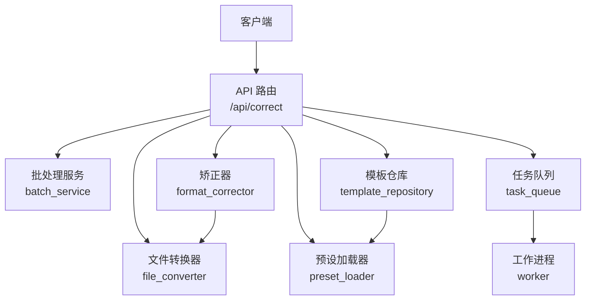
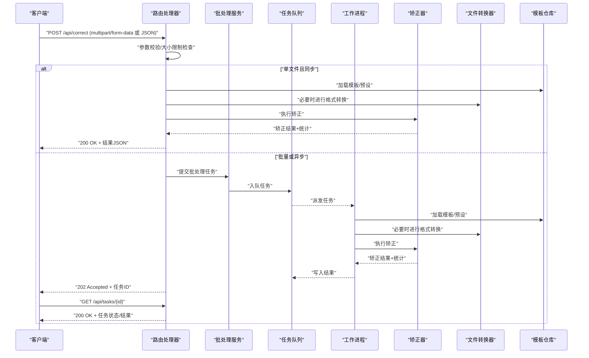
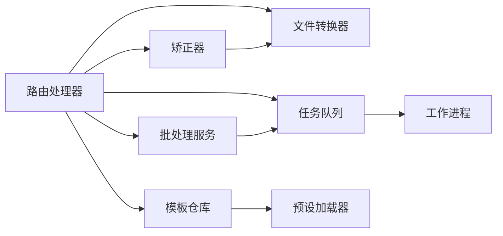

# 文档矫正接口

<cite>
**本文引用的文件**   
- [src/paper_format_corrector/interfaces/api/routes/correct.py](file://src/paper_format_corrector/interfaces/api/routes/correct.py)
- [src/paper_format_corrector/application/services/batch_service.py](file://src/paper_format_corrector/application/services/batch_service.py)
- [src/paper_format_corrector/infrastructure/converters/file_converter.py](file://src/paper_format_corrector/infrastructure/converters/file_converter.py)
- [src/paper_format_corrector/core/format_corrector.py](file://src/paper_format_corrector/core/format_corrector.py)
- [src/paper_format_corrector/infra/template_repository.py](file://src/paper_format_corrector/infra/template_repository.py)
- [src/paper_format_corrector/infra/preset_loader.py](file://src/paper_format_corrector/infra/preset_loader.py)
- [src/paper_format_corrector/infrastructure/queue/task_queue.py](file://src/paper_format_corrector/infrastructure/queue/task_queue.py)
- [src/paper_format_corrector/infrastructure/queue/worker.py](file://src/paper_format_corrector/infrastructure/queue/worker.py)
- [src/paper_format_corrector/shared/utils/file_utils.py](file://src/paper_format_corrector/shared/utils/file_utils.py)
- [config/config.yaml](file://config/config.yaml)
</cite>

## 目录
1. [简介](#简介)
2. [项目结构](#项目结构)
3. [核心组件](#核心组件)
4. [架构总览](#架构总览)
5. [详细组件分析](#详细组件分析)
6. [依赖分析](#依赖分析)
7. [性能考虑](#性能考虑)
8. [故障排查指南](#故障排查指南)
9. [结论](#结论)
10. [附录](#附录)

## 简介
本章节面向需要集成“文档格式矫正”能力的开发者，提供 POST /api/correct 接口的完整规范与实现说明。该接口支持上传单个或批量文档（DOCX、PDF、LaTeX），按模板或预设进行格式矫正，返回矫正结果、修改统计与错误信息；同时支持自定义配置项与异步批量处理模式。

## 项目结构
与 /api/correct 相关的代码主要分布在以下模块：
- 路由层：接收请求、参数校验、调用服务层
- 应用服务层：编排矫正流程、批处理任务
- 基础设施层：文件转换、模板加载、队列调度
- 核心逻辑层：具体矫正算法与规则执行
- 工具与配置：通用工具函数、系统配置

图表来源
- [src/paper_format_corrector/interfaces/api/routes/correct.py](file://src/paper_format_corrector/interfaces/api/routes/correct.py)
- [src/paper_format_corrector/application/services/batch_service.py](file://src/paper_format_corrector/application/services/batch_service.py)
- [src/paper_format_corrector/infrastructure/converters/file_converter.py](file://src/paper_format_corrector/infrastructure/converters/file_converter.py)
- [src/paper_format_corrector/core/format_corrector.py](file://src/paper_format_corrector/core/format_corrector.py)
- [src/paper_format_corrector/infra/template_repository.py](file://src/paper_format_corrector/infra/template_repository.py)
- [src/paper_format_corrector/infra/preset_loader.py](file://src/paper_format_corrector/infra/preset_loader.py)
- [src/paper_format_corrector/infrastructure/queue/task_queue.py](file://src/paper_format_corrector/infrastructure/queue/task_queue.py)
- [src/paper_format_corrector/infrastructure/queue/worker.py](file://src/paper_format_corrector/infrastructure/queue/worker.py)

章节来源
- [src/paper_format_corrector/interfaces/api/routes/correct.py](file://src/paper_format_corrector/interfaces/api/routes/correct.py)
- [src/paper_format_corrector/application/services/batch_service.py](file://src/paper_format_corrector/application/services/batch_service.py)
- [src/paper_format_corrector/infrastructure/converters/file_converter.py](file://src/paper_format_corrector/infrastructure/converters/file_converter.py)
- [src/paper_format_corrector/core/format_corrector.py](file://src/paper_format_corrector/core/format_corrector.py)
- [src/paper_format_corrector/infra/template_repository.py](file://src/paper_format_corrector/infra/template_repository.py)
- [src/paper_format_corrector/infra/preset_loader.py](file://src/paper_format_corrector/infra/preset_loader.py)
- [src/paper_format_corrector/infrastructure/queue/task_queue.py](file://src/paper_format_corrector/infrastructure/queue/task_queue.py)
- [src/paper_format_corrector/infrastructure/queue/worker.py](file://src/paper_format_corrector/infrastructure/queue/worker.py)

## 核心组件
- 路由处理器：负责解析 multipart/form-data 或 JSON 请求体，校验参数，选择同步或异步路径，并构造响应。
- 批处理服务：将多文件矫正任务入队，管理任务状态与结果聚合。
- 矫正器：根据模板/预设对文档进行结构化分析与样式修正。
- 文件转换器：在 DOCX、PDF、LaTeX 之间进行必要转换与中间表示生成。
- 模板仓库与预设加载器：加载内置或用户自定义模板与预设配置。
- 任务队列与工作进程：承载耗时矫正任务的异步执行与结果回写。

章节来源
- [src/paper_format_corrector/interfaces/api/routes/correct.py](file://src/paper_format_corrector/interfaces/api/routes/correct.py)
- [src/paper_format_corrector/application/services/batch_service.py](file://src/paper_format_corrector/application/services/batch_service.py)
- [src/paper_format_corrector/core/format_corrector.py](file://src/paper_format_corrector/core/format_corrector.py)
- [src/paper_format_corrector/infrastructure/converters/file_converter.py](file://src/paper_format_corrector/infrastructure/converters/file_converter.py)
- [src/paper_format_corrector/infra/template_repository.py](file://src/paper_format_corrector/infra/template_repository.py)
- [src/paper_format_corrector/infra/preset_loader.py](file://src/paper_format_corrector/infra/preset_loader.py)
- [src/paper_format_corrector/infrastructure/queue/task_queue.py](file://src/paper_format_corrector/infrastructure/queue/task_queue.py)
- [src/paper_format_corrector/infrastructure/queue/worker.py](file://src/paper_format_corrector/infrastructure/queue/worker.py)

## 架构总览
下图展示了从客户端发起请求到最终返回结果的端到端流程，包括同步与异步两种模式。

图表来源
- [src/paper_format_corrector/interfaces/api/routes/correct.py](file://src/paper_format_corrector/interfaces/api/routes/correct.py)
- [src/paper_format_corrector/application/services/batch_service.py](file://src/paper_format_corrector/application/services/batch_service.py)
- [src/paper_format_corrector/infrastructure/queue/task_queue.py](file://src/paper_format_corrector/infrastructure/queue/task_queue.py)
- [src/paper_format_corrector/infrastructure/queue/worker.py](file://src/paper_format_corrector/infrastructure/queue/worker.py)
- [src/paper_format_corrector/core/format_corrector.py](file://src/paper_format_corrector/core/format_corrector.py)
- [src/paper_format_corrector/infrastructure/converters/file_converter.py](file://src/paper_format_corrector/infrastructure/converters/file_converter.py)
- [src/paper_format_corrector/infra/template_repository.py](file://src/paper_format_corrector/infra/template_repository.py)

## 详细组件分析

### 路由处理器（/api/correct）
- 功能要点
  - 支持 multipart/form-data 与 application/json 两种请求体
  - 参数包含：文件字段、模板标识、预设名称、自定义配置、是否异步等
  - 校验文件大小、类型白名单、必填字段
  - 同步路径直接返回矫正结果；异步路径返回任务ID供后续查询
- 关键行为
  - 当检测到批量文件或开启异步标志时，走批处理服务与任务队列
  - 模板优先使用显式传入的模板内容或模板ID，否则回退到预设
  - 自定义配置合并到最终矫正配置中

章节来源
- [src/paper_format_corrector/interfaces/api/routes/correct.py](file://src/paper_format_corrector/interfaces/api/routes/correct.py)

#### 请求参数定义
- 表单字段（multipart/form-data）
  - files: 一个或多个文件（docx/pdf/tex/latex）
  - template_id: 模板ID（可选）
  - preset_name: 预设名称（可选）
  - config: 自定义配置对象（可选）
  - async: 布尔值，是否异步处理（可选）
- JSON 字段（application/json）
  - files: 文件列表，每个元素包含文件名、base64数据或URL引用
  - template_id: 模板ID（可选）
  - preset_name: 预设名称（可选）
  - config: 自定义配置对象（可选）
  - async: 布尔值，是否异步处理（可选）

章节来源
- [src/paper_format_corrector/interfaces/api/routes/correct.py](file://src/paper_format_corrector/interfaces/api/routes/correct.py)

#### 响应格式
- 成功响应（200 OK，同步）
  - data: 矫正结果对象
    - file_id: 文件唯一标识
    - output_url: 输出文件下载链接
    - stats: 修改统计对象
      - paragraphs_changed: 段落变更数
      - styles_applied: 样式应用数
      - references_fixed: 引用修复数
      - images_resized: 图片调整数
    - warnings: 警告列表
  - message: 成功消息
- 接受任务（202 Accepted，异步）
  - task_id: 任务ID
  - status: pending
  - message: 任务已创建
- 错误响应（4xx/5xx）
  - code: 错误码
  - message: 人类可读的错误描述
  - details: 附加信息（如字段名、原因）

章节来源
- [src/paper_format_corrector/interfaces/api/routes/correct.py](file://src/paper_format_corrector/interfaces/api/routes/correct.py)

#### 请求示例（curl）
- 单文件同步矫正（表单）
  - curl -X POST http://localhost:8000/api/correct -F "files=@sample.docx" -F "preset_name=academic_paper"
- 单文件同步矫正（JSON）
  - curl -X POST http://localhost:8000/api/correct -H "Content-Type: application/json" -d '{"files":[{"name":"sample.pdf","data":"BASE64_DATA"}],"preset_name":"chinese_thesis"}'
- 批量异步矫正
  - curl -X POST http://localhost:8000/api/correct -F "files=@a.docx" -F "files=@b.tex" -F "async=true" -F "template_id=tsinghua_v2"

章节来源
- [src/paper_format_corrector/interfaces/api/routes/correct.py](file://src/paper_format_corrector/interfaces/api/routes/correct.py)

#### Python 客户端示例
- 使用 requests 发送表单与JSON请求
- 处理同步返回结果与异步任务轮询
- 示例覆盖：单文件、批量、自定义配置

章节来源
- [src/paper_format_corrector/interfaces/api/client.py](file://src/paper_format_corrector/interfaces/api/client.py)

### 批处理服务（batch_service）
- 职责
  - 将多个文件的矫正任务组织为批次
  - 控制并发度与重试策略
  - 聚合各文件矫正结果与错误
- 关键点
  - 支持断点续传与失败隔离
  - 提供进度回调与状态查询

章节来源
- [src/paper_format_corrector/application/services/batch_service.py](file://src/paper_format_corrector/application/services/batch_service.py)

### 矫正器（format_corrector）
- 职责
  - 基于模板/预设的规则引擎执行样式与结构矫正
  - 生成修改统计与差异报告
- 关键点
  - 可插拔规则集
  - 增量更新与幂等性保证

章节来源
- [src/paper_format_corrector/core/format_corrector.py](file://src/paper_format_corrector/core/format_corrector.py)

### 文件转换器（file_converter）
- 职责
  - 在 DOCX、PDF、LaTeX 之间进行必要的转换
  - 生成中间表示以供矫正器消费
- 关键点
  - 保留元数据与嵌入资源
  - 异常容错与降级策略

章节来源
- [src/paper_format_corrector/infrastructure/converters/file_converter.py](file://src/paper_format_corrector/infrastructure/converters/file_converter.py)

### 模板仓库与预设加载器
- 模板仓库
  - 提供模板ID到模板内容的映射
  - 支持本地与远程模板源
- 预设加载器
  - 加载 presets 目录下的 YAML 预设
  - 提供默认值与覆盖机制

章节来源
- [src/paper_format_corrector/infra/template_repository.py](file://src/paper_format_corrector/infra/template_repository.py)
- [src/paper_format_corrector/infra/preset_loader.py](file://src/paper_format_corrector/infra/preset_loader.py)

### 任务队列与工作进程
- 任务队列
  - 持久化任务状态
  - 支持优先级与超时
- 工作进程
  - 拉取任务并执行矫正流程
  - 上报进度与结果

章节来源
- [src/paper_format_corrector/infrastructure/queue/task_queue.py](file://src/paper_format_corrector/infrastructure/queue/task_queue.py)
- [src/paper_format_corrector/infrastructure/queue/worker.py](file://src/paper_format_corrector/infrastructure/queue/worker.py)

### 文件工具与配置
- 文件工具
  - 统一读取、校验与临时文件管理
- 配置
  - 全局大小限制、超时、并发度等

章节来源
- [src/paper_format_corrector/shared/utils/file_utils.py](file://src/paper_format_corrector/shared/utils/file_utils.py)
- [config/config.yaml](file://config/config.yaml)

## 依赖分析
- 耦合关系
  - 路由层依赖批处理服务、矫正器、转换器、模板仓库与队列
  - 批处理服务依赖队列与工作进程
  - 矫正器依赖转换器与模板/预设
- 外部依赖
  - 文件系统与网络IO
  - 第三方库（用于 PDF/LaTeX 转换）

图表来源
- [src/paper_format_corrector/interfaces/api/routes/correct.py](file://src/paper_format_corrector/interfaces/api/routes/correct.py)
- [src/paper_format_corrector/application/services/batch_service.py](file://src/paper_format_corrector/application/services/batch_service.py)
- [src/paper_format_corrector/infrastructure/queue/task_queue.py](file://src/paper_format_corrector/infrastructure/queue/task_queue.py)
- [src/paper_format_corrector/infrastructure/queue/worker.py](file://src/paper_format_corrector/infrastructure/queue/worker.py)
- [src/paper_format_corrector/core/format_corrector.py](file://src/paper_format_corrector/core/format_corrector.py)
- [src/paper_format_corrector/infrastructure/converters/file_converter.py](file://src/paper_format_corrector/infrastructure/converters/file_converter.py)
- [src/paper_format_corrector/infra/template_repository.py](file://src/paper_format_corrector/infra/template_repository.py)
- [src/paper_format_corrector/infra/preset_loader.py](file://src/paper_format_corrector/infra/preset_loader.py)

章节来源
- [src/paper_format_corrector/interfaces/api/routes/correct.py](file://src/paper_format_corrector/interfaces/api/routes/correct.py)
- [src/paper_format_corrector/application/services/batch_service.py](file://src/paper_format_corrector/application/services/batch_service.py)
- [src/paper_format_corrector/infrastructure/queue/task_queue.py](file://src/paper_format_corrector/infrastructure/queue/task_queue.py)
- [src/paper_format_corrector/infrastructure/queue/worker.py](file://src/paper_format_corrector/infrastructure/queue/worker.py)
- [src/paper_format_corrector/core/format_corrector.py](file://src/paper_format_corrector/core/format_corrector.py)
- [src/paper_format_corrector/infrastructure/converters/file_converter.py](file://src/paper_format_corrector/infrastructure/converters/file_converter.py)
- [src/paper_format_corrector/infra/template_repository.py](file://src/paper_format_corrector/infra/template_repository.py)
- [src/paper_format_corrector/infra/preset_loader.py](file://src/paper_format_corrector/infra/preset_loader.py)

## 性能考虑
- 并发与批处理
  - 合理设置队列并发度，避免内存峰值过高
  - 大文件分批处理与流式读写
- 缓存与复用
  - 模板与预设预加载，减少I/O开销
  - 中间表示缓存，避免重复转换
- 超时与限流
  - 针对长任务设置合理超时
  - 对客户端请求进行速率限制

[本节为通用指导，不直接分析具体文件]

## 故障排查指南
- 常见错误
  - 文件过大：检查配置中的最大文件大小限制
  - 不支持的文件类型：确认扩展名在白名单内
  - 模板缺失：核对模板ID或预设名称是否正确
  - 异步任务未完成：通过任务ID查询状态
- 定位方法
  - 查看路由日志与队列任务日志
  - 检查工作进程运行状态与资源占用
  - 验证模板与预设文件完整性

章节来源
- [src/paper_format_corrector/interfaces/api/routes/correct.py](file://src/paper_format_corrector/interfaces/api/routes/correct.py)
- [src/paper_format_corrector/infrastructure/queue/task_queue.py](file://src/paper_format_corrector/infrastructure/queue/task_queue.py)
- [src/paper_format_corrector/infrastructure/queue/worker.py](file://src/paper_format_corrector/infrastructure/queue/worker.py)
- [config/config.yaml](file://config/config.yaml)

## 结论
POST /api/correct 提供了统一的文档格式矫正入口，支持单文件与批量、同步与异步多种模式，兼容 DOCX、PDF、LaTeX 等主流格式。通过模板与预设机制，结合自定义配置，可满足多样化场景需求。建议在生产环境启用异步批处理与任务队列，以获得更好的可扩展性与稳定性。

[本节为总结性内容，不直接分析具体文件]

## 附录

### 支持的输入格式与限制
- 支持格式
  - DOCX：Microsoft Word 文档
  - PDF：便携式文档格式
  - LaTeX：tex/latex 源码
- 大小限制
  - 单文件上限由配置文件决定
  - 批量请求总大小受网关与服务双重限制
- 超时设置
  - 同步请求默认超时时间
  - 异步任务最长执行时间与重试次数

章节来源
- [config/config.yaml](file://config/config.yaml)
- [src/paper_format_corrector/shared/utils/file_utils.py](file://src/paper_format_corrector/shared/utils/file_utils.py)

### 自定义配置项（config）
- 常用键
  - font_family: 字体族
  - line_spacing: 行距
  - margin: 页边距
  - reference_style: 引用样式
  - image_resize: 图片缩放策略
- 覆盖顺序
  - 预设默认值 < 模板配置 < 自定义配置

章节来源
- [src/paper_format_corrector/infra/preset_loader.py](file://src/paper_format_corrector/infra/preset_loader.py)
- [src/paper_format_corrector/infra/template_repository.py](file://src/paper_format_corrector/infra/template_repository.py)

### 错误码与处理建议
- 400 参数错误：检查必填字段与类型
- 413 文件过大：压缩文件或降低分辨率
- 415 不支持类型：转换为受支持格式
- 422 模板/预设无效：核对ID或名称
- 500 内部错误：查看服务端日志与依赖服务状态

章节来源
- [src/paper_format_corrector/interfaces/api/routes/correct.py](file://src/paper_format_corrector/interfaces/api/routes/correct.py)