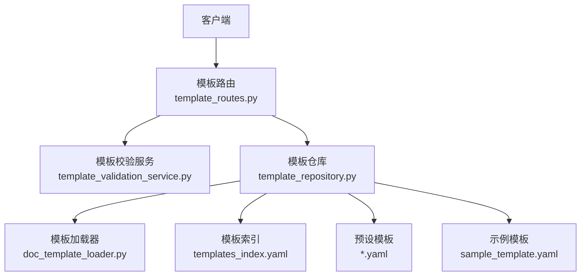
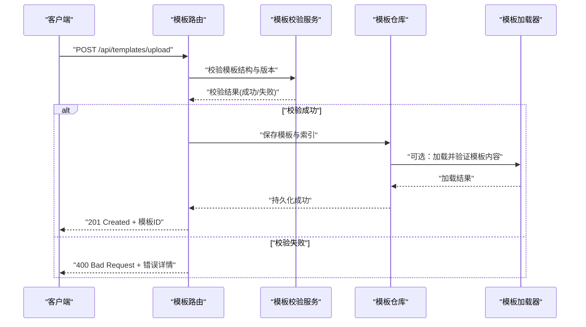
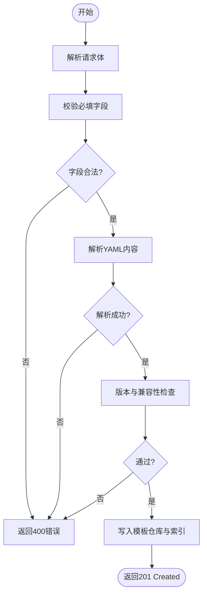
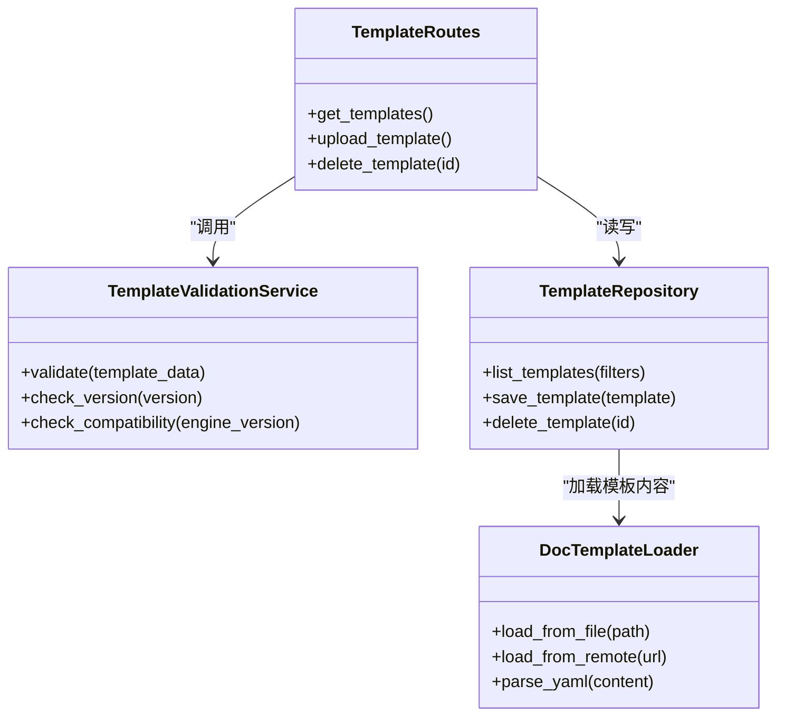

# 模板管理接口

<cite>
**本文引用的文件**   
- [src/paper_format_corrector/interfaces/api/routes/template_routes.py](file://src/paper_format_corrector/interfaces/api/routes/template_routes.py)
- [src/paper_format_corrector/application/services/template_validation_service.py](file://src/paper_format_corrector/application/services/template_validation_service.py)
- [src/paper_format_corrector/infra/template_repository.py](file://src/paper_format_corrector/infra/template_repository.py)
- [src/paper_format_corrector/infra/doc_template_loader.py](file://src/paper_format_corrector/infra/doc_template_loader.py)
- [presets/templates_index.yaml](file://presets/templates_index.yaml)
- [presets/academic_paper.yaml](file://presets/academic_paper.yaml)
- [examples/sample_template.yaml](file://examples/sample_template.yaml)
- [docs/template_guide.md](file://docs/template_guide.md)
</cite>

## 目录
1. [简介](#简介)
2. [项目结构](#项目结构)
3. [核心组件](#核心组件)
4. [架构总览](#架构总览)
5. [详细组件分析](#详细组件分析)
6. [依赖关系分析](#依赖关系分析)
7. [性能考虑](#性能考虑)
8. [故障排查指南](#故障排查指南)
9. [结论](#结论)
10. [附录](#附录)

## 简介
本文件为“模板管理”相关API接口的权威文档，覆盖以下能力：
- 获取预设模板列表：GET /api/templates
- 上传自定义模板：POST /api/templates/upload
- 删除模板：DELETE /api/templates/{id}

同时提供模板数据结构、验证规则、版本管理与兼容性检查说明，并给出模板创建、更新、测试与部署的完整工作流程示例。文末包含YAML模板语法规范与内置模板说明。

## 项目结构
与模板管理相关的代码主要分布在以下位置：
- API路由层：定义REST端点与请求/响应契约
- 应用服务层：负责模板校验、版本与兼容性检查
- 基础设施层：负责模板仓库（存储/索引）、加载器（读取本地/远端）
- 预设模板与示例：提供内置模板与样例文件
- 文档：模板使用指南与语法说明

图表来源
- [src/paper_format_corrector/interfaces/api/routes/template_routes.py](file://src/paper_format_corrector/interfaces/api/routes/template_routes.py)
- [src/ppaper_format_corrector/application/services/template_validation_service.py](file://src/paper_format_corrector/application/services/template_validation_service.py)
- [src/paper_format_corrector/infra/template_repository.py](file://src/paper_format_corrector/infra/template_repository.py)
- [src/paper_format_corrector/infra/doc_template_loader.py](file://src/paper_format_corrector/infra/doc_template_loader.py)
- [presets/templates_index.yaml](file://presets/templates_index.yaml)
- [presets/academic_paper.yaml](file://presets/academic_paper.yaml)
- [examples/sample_template.yaml](file://examples/sample_template.yaml)

章节来源
- [src/paper_format_corrector/interfaces/api/routes/template_routes.py](file://src/paper_format_corrector/interfaces/api/routes/template_routes.py)
- [src/paper_format_corrector/application/services/template_validation_service.py](file://src/paper_format_corrector/application/services/template_validation_service.py)
- [src/paper_format_corrector/infra/template_repository.py](file://src/paper_format_corrector/infra/template_repository.py)
- [src/paper_format_corrector/infra/doc_template_loader.py](file://src/paper_format_corrector/infra/doc_template_loader.py)
- [presets/templates_index.yaml](file://presets/templates_index.yaml)
- [examples/sample_template.yaml](file://examples/sample_template.yaml)
- [docs/template_guide.md](file://docs/template_guide.md)

## 核心组件
- 模板路由（API层）
  - 暴露三个端点：获取模板列表、上传模板、删除模板
  - 负责参数解析、调用服务层、返回统一响应格式
- 模板校验服务（应用层）
  - 执行模板结构校验、字段约束、版本与兼容性检查
  - 输出校验结果与错误信息
- 模板仓库（基础设施层）
  - 维护模板索引与元数据
  - 提供模板的增删改查与持久化
- 模板加载器（基础设施层）
  - 从本地或远端加载模板内容
  - 解析YAML并转换为内部模型

章节来源
- [src/paper_format_corrector/interfaces/api/routes/template_routes.py](file://src/paper_format_corrector/interfaces/api/routes/template_routes.py)
- [src/paper_format_corrector/application/services/template_validation_service.py](file://src/paper_format_corrector/application/services/template_validation_service.py)
- [src/paper_format_corrector/infra/template_repository.py](file://src/paper_format_corrector/infra/template_repository.py)
- [src/paper_format_corrector/infra/doc_template_loader.py](file://src/paper_format_corrector/infra/doc_template_loader.py)

## 架构总览
下图展示了模板管理的端到端流程：客户端通过HTTP访问路由层，路由层委托校验服务进行合法性检查，再由仓库完成持久化与检索，必要时由加载器读取模板源文件。

图表来源
- [src/paper_format_corrector/interfaces/api/routes/template_routes.py](file://src/paper_format_corrector/interfaces/api/routes/template_routes.py)
- [src/paper_format_corrector/application/services/template_validation_service.py](file://src/paper_format_corrector/application/services/template_validation_service.py)
- [src/paper_format_corrector/infra/template_repository.py](file://src/paper_format_corrector/infra/template_repository.py)
- [src/paper_format_corrector/infra/doc_template_loader.py](file://src/paper_format_corrector/infra/doc_template_loader.py)

## 详细组件分析

### 端点：获取模板列表 GET /api/templates
- 功能
  - 返回系统可用的模板清单，包括预设模板与已上传的自定义模板
- 查询参数
  - category（可选）：按分类过滤
  - keyword（可选）：关键字模糊匹配
  - version（可选）：按版本筛选
- 响应
  - 200 OK：返回模板列表，每项包含模板标识、名称、版本、分类、描述、是否内置等元信息
- 错误
  - 400 Bad Request：参数非法
  - 500 Internal Server Error：服务器异常

章节来源
- [src/paper_format_corrector/interfaces/api/routes/template_routes.py](file://src/paper_format_corrector/interfaces/api/routes/template_routes.py)
- [presets/templates_index.yaml](file://presets/templates_index.yaml)

### 端点：上传自定义模板 POST /api/templates/upload
- 功能
  - 接收YAML模板文件，执行结构与版本校验后入库
- 请求体
  - multipart/form-data 或 application/json（以路由实现为准）
  - 必填字段：模板标识、名称、版本、分类、正文内容（YAML字符串或文件）
- 校验规则
  - 必填字段存在且类型正确
  - YAML可被解析
  - 版本符合语义化版本要求
  - 兼容性检查通过（与当前引擎版本兼容）
- 响应
  - 201 Created：上传成功，返回模板ID与摘要
  - 400 Bad Request：校验失败，返回错误明细
  - 409 Conflict：模板标识冲突
  - 500 Internal Server Error：服务器异常

图表来源
- [src/paper_format_corrector/interfaces/api/routes/template_routes.py](file://src/paper_format_corrector/interfaces/api/routes/template_routes.py)
- [src/paper_format_corrector/application/services/template_validation_service.py](file://src/paper_format_corrector/application/services/template_validation_service.py)
- [src/paper_format_corrector/infra/template_repository.py](file://src/paper_format_corrector/infra/template_repository.py)

章节来源
- [src/paper_format_corrector/interfaces/api/routes/template_routes.py](file://src/paper_format_corrector/interfaces/api/routes/template_routes.py)
- [src/paper_format_corrector/application/services/template_validation_service.py](file://src/paper_format_corrector/application/services/template_validation_service.py)
- [src/paper_format_corrector/infra/template_repository.py](file://src/paper_format_corrector/infra/template_repository.py)

### 端点：删除模板 DELETE /api/templates/{id}
- 功能
  - 根据模板ID删除指定模板及其索引条目
- 路径参数
  - id：模板唯一标识
- 响应
  - 204 No Content：删除成功
  - 404 Not Found：模板不存在
  - 403 Forbidden：无权限删除（如内置模板）
  - 500 Internal Server Error：服务器异常

章节来源
- [src/paper_format_corrector/interfaces/api/routes/template_routes.py](file://src/paper_format_corrector/interfaces/api/routes/template_routes.py)
- [src/paper_format_corrector/infra/template_repository.py](file://src/paper_format_corrector/infra/template_repository.py)

### 模板数据结构
- 通用字段
  - id：模板唯一标识（字符串）
  - name：模板名称（非空）
  - version：语义化版本号（主.次.修订）
  - category：分类（如学术、商务、公文等）
  - description：简要描述
  - is_builtin：是否为内置模板（布尔）
  - created_at/updated_at：时间戳（可选）
- 模板内容
  - 以YAML形式表达，具体键值遵循模板语法规范（见附录）
- 示例
  - 参考示例模板文件以了解最小可用结构

章节来源
- [examples/sample_template.yaml](file://examples/sample_template.yaml)
- [presets/academic_paper.yaml](file://presets/academic_paper.yaml)

### 验证规则与兼容性检查
- 结构校验
  - 必填字段完整性
  - 字段类型与取值范围
  - YAML语法正确性
- 版本管理
  - 支持语义化版本
  - 升级策略：向后兼容时允许小版本升级；破坏性变更需提升主版本
- 兼容性检查
  - 与当前引擎版本的特性矩阵比对
  - 不兼容项将阻止上传或运行

章节来源
- [src/paper_format_corrector/application/services/template_validation_service.py](file://src/paper_format_corrector/application/services/template_validation_service.py)

### 模板仓库与加载器
- 模板仓库
  - 维护模板元数据与索引
  - 提供增删改查接口
- 模板加载器
  - 从本地磁盘或远端仓库加载模板源文件
  - 解析YAML并转换为内部模型供上层使用

章节来源
- [src/paper_format_corrector/infra/template_repository.py](file://src/paper_format_corrector/infra/template_repository.py)
- [src/paper_format_corrector/infra/doc_template_loader.py](file://src/paper_format_corrector/infra/doc_template_loader.py)

## 依赖关系分析

图表来源
- [src/paper_format_corrector/interfaces/api/routes/template_routes.py](file://src/paper_format_corrector/interfaces/api/routes/template_routes.py)
- [src/paper_format_corrector/application/services/template_validation_service.py](file://src/paper_format_corrector/application/services/template_validation_service.py)
- [src/paper_format_corrector/infra/template_repository.py](file://src/paper_format_corrector/infra/template_repository.py)
- [src/paper_format_corrector/infra/doc_template_loader.py](file://src/paper_format_corrector/infra/doc_template_loader.py)

章节来源
- [src/paper_format_corrector/interfaces/api/routes/template_routes.py](file://src/paper_format_corrector/interfaces/api/routes/template_routes.py)
- [src/paper_format_corrector/application/services/template_validation_service.py](file://src/paper_format_corrector/application/services/template_validation_service.py)
- [src/paper_format_corrector/infra/template_repository.py](file://src/paper_format_corrector/infra/template_repository.py)
- [src/paper_format_corrector/infra/doc_template_loader.py](file://src/paper_format_corrector/infra/doc_template_loader.py)

## 性能考虑
- 列表接口建议分页与缓存，减少重复计算
- 上传接口对大体积YAML进行流式解析，避免一次性加载到内存
- 索引更新采用增量方式，降低IO压力
- 兼容性检查可异步预检，避免阻塞主流程

[本节为通用指导，无需源码引用]

## 故障排查指南
- 常见错误码
  - 400：参数缺失、类型错误或YAML解析失败
  - 409：模板标识冲突
  - 403：权限不足（如删除内置模板）
  - 404：模板不存在
  - 500：服务器内部错误
- 排查步骤
  - 确认请求体结构与字段类型
  - 使用离线工具验证YAML语法
  - 查看模板版本与引擎版本兼容性矩阵
  - 检查模板仓库权限与存储空间

章节来源
- [src/paper_format_corrector/interfaces/api/routes/template_routes.py](file://src/paper_format_corrector/interfaces/api/routes/template_routes.py)
- [src/paper_format_corrector/application/services/template_validation_service.py](file://src/paper_format_corrector/application/services/template_validation_service.py)

## 结论
模板管理API提供了完整的模板生命周期管理能力，涵盖获取、上传与删除。通过严格的校验与兼容性检查，确保模板质量与系统稳定性。结合预设模板与示例，用户可快速上手并扩展自有模板生态。

[本节为总结，无需源码引用]

## 附录

### YAML模板语法规范（要点）
- 根节点
  - id：唯一标识
  - name：名称
  - version：语义化版本
  - category：分类
  - description：描述
- 内容区域
  - 标题、段落、表格、图片、页眉页脚、目录等结构化元素
  - 样式与排版属性（字体、字号、行距、对齐等）
  - 引用与参考文献格式
- 变量与占位符
  - 支持在文本中插入变量，渲染时替换为实际值
- 条件与循环
  - 基于数据驱动的条件显示与列表生成
- 校验提示
  - 未识别字段将被忽略或报错（取决于严格模式）
  - 类型不匹配将导致上传失败

章节来源
- [docs/template_guide.md](file://docs/template_guide.md)
- [examples/sample_template.yaml](file://examples/sample_template.yaml)

### 内置模板说明
- 模板索引
  - 提供所有内置模板的元数据清单，便于前端展示与筛选
- 典型内置模板
  - 学术论文模板：适用于期刊与会议论文
  - 商业计划书模板：面向创业与投资场景
  - 合同模板：标准合同条款与条款编号
  - 会议纪要模板：结构化记录与行动项
  - 公文模板：党政机关公文格式
  - 报告模板：企业日常报告与汇报材料
- 使用建议
  - 优先选择与目标机构一致的内置模板
  - 如需定制，可在内置模板基础上派生新版本

章节来源
- [presets/templates_index.yaml](file://presets/templates_index.yaml)
- [presets/academic_paper.yaml](file://presets/academic_paper.yaml)

### 完整工作流程示例（创建、更新、测试、部署）
- 创建
  - 准备YAML模板文件，确保满足语法与必填字段
  - 调用上传接口提交模板
- 更新
  - 修改模板版本（遵循语义化版本）
  - 重新上传新版本，保持标识一致
- 测试
  - 使用示例数据渲染模板，验证内容与样式
  - 检查兼容性检查结果与警告项
- 部署
  - 将模板纳入索引并发布至生产环境
  - 监控使用反馈与错误日志，持续优化

章节来源
- [src/paper_format_corrector/interfaces/api/routes/template_routes.py](file://src/paper_format_corrector/interfaces/api/routes/template_routes.py)
- [src/paper_format_corrector/application/services/template_validation_service.py](file://src/paper_format_corrector/application/services/template_validation_service.py)
- [src/paper_format_corrector/infra/template_repository.py](file://src/paper_format_corrector/infra/template_repository.py)
- [docs/template_guide.md](file://docs/template_guide.md)