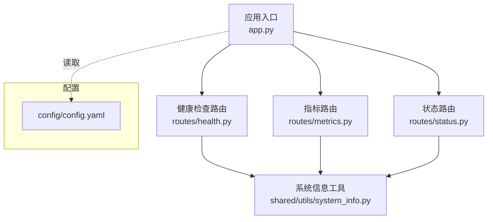
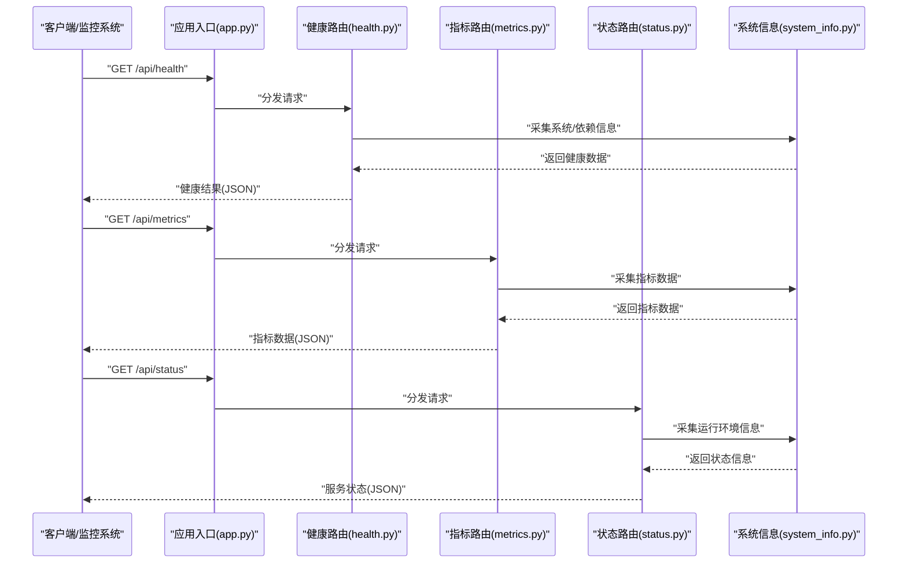
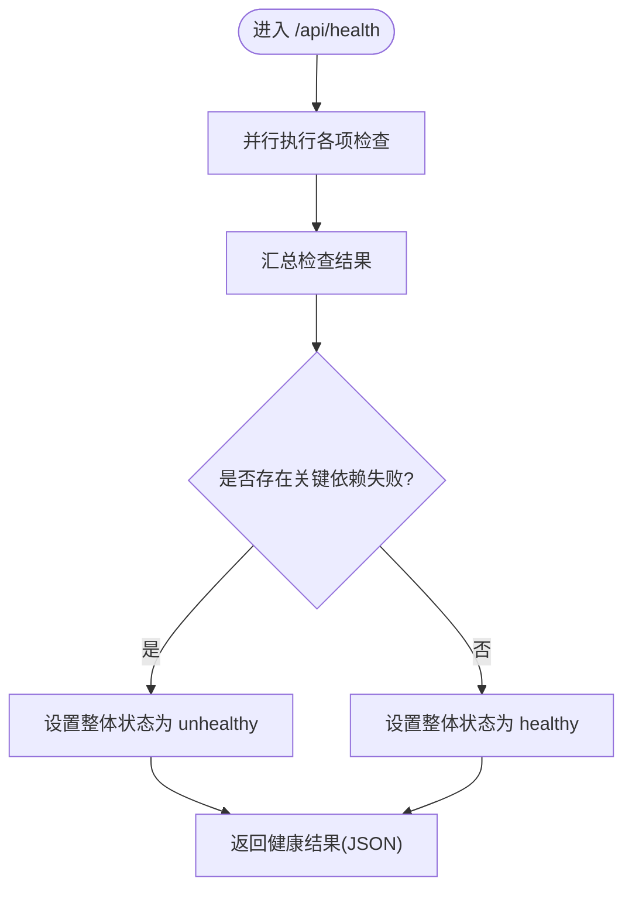
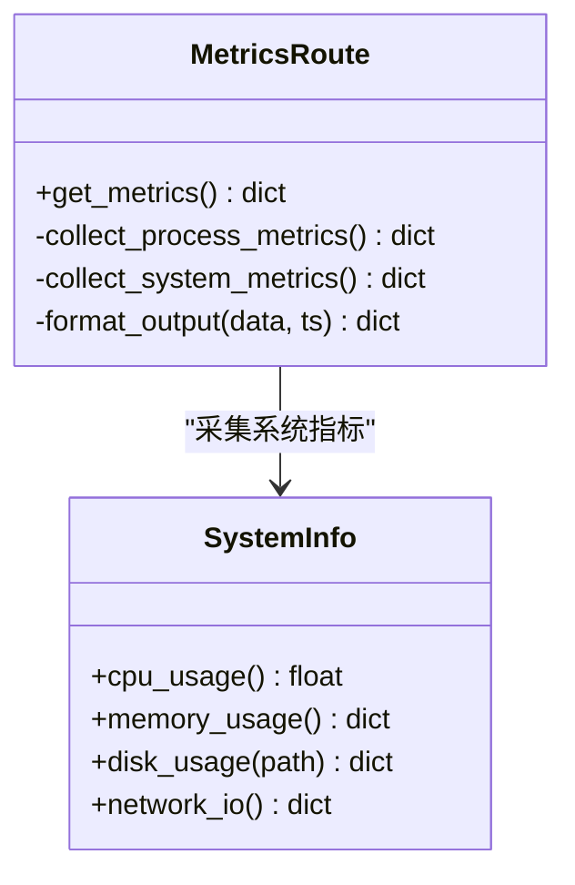
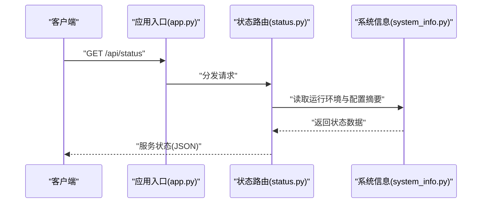
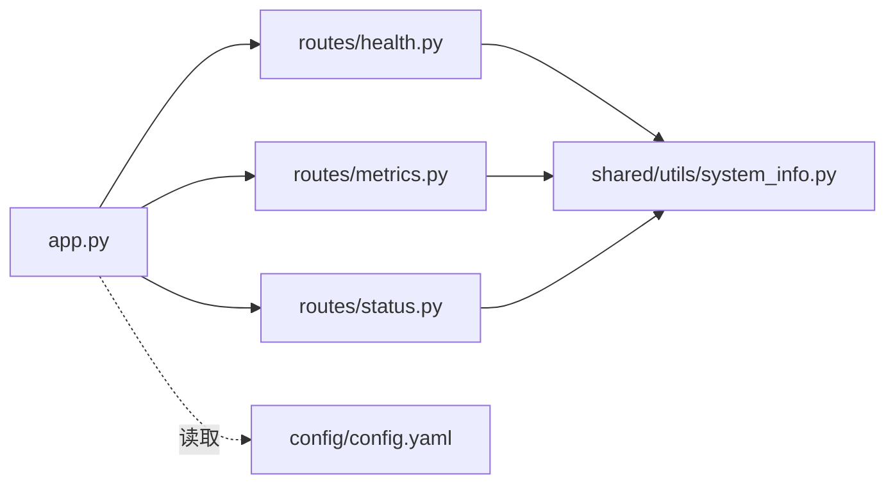

# 系统健康检查接口

<cite>
**本文引用的文件**   
- [src/paper_format_corrector/interfaces/api/routes/health.py](file://src/paper_format_corrector/interfaces/api/routes/health.py)
- [src/paper_format_corrector/interfaces/api/routes/metrics.py](file://src/paper_format_corrector/interfaces/api/routes/metrics.py)
- [src/paper_format_corrector/interfaces/api/routes/status.py](file://src/paper_format_corrector/interfaces/api/routes/status.py)
- [src/paper_format_corrector/app.py](file://src/paper_format_corrector/app.py)
- [src/paper_format_corrector/shared/utils/system_info.py](file://src/paper_format_corrector/shared/utils/system_info.py)
- [config/config.yaml](file://config/config.yaml)
</cite>

## 目录
1. [简介](#简介)
2. [项目结构](#项目结构)
3. [核心组件](#核心组件)
4. [架构总览](#架构总览)
5. [详细组件分析](#详细组件分析)
6. [依赖关系分析](#依赖关系分析)
7. [性能与监控建议](#性能与监控建议)
8. [故障诊断指南](#故障诊断指南)
9. [结论](#结论)
10. [附录：容器化与健康探针配置](#附录容器化与健康探针配置)

## 简介
本文件面向运维与平台工程团队，系统化说明论文格式矫正工具在 API 层提供的健康检查与可观测性能力。重点覆盖以下端点：
- GET /api/health：系统状态检查（存活、就绪、关键依赖）
- GET /api/metrics：性能指标获取（进程、资源、业务指标）
- GET /api/status：服务状态查询（版本、启动时间、运行环境等）

文档包含指标定义、响应语义、监控集成示例、告警策略建议以及容器化部署中的健康探针配置方法。

## 项目结构
健康检查相关代码位于 interfaces.api.routes 子包下，由应用入口统一注册路由。系统信息收集通过 shared.utils.system_info 提供。

图表来源
- [src/paper_format_corrector/app.py](file://src/paper_format_corrector/app.py)
- [src/paper_format_corrector/interfaces/api/routes/health.py](file://src/paper_format_corrector/interfaces/api/routes/health.py)
- [src/paper_format_corrector/interfaces/api/routes/metrics.py](file://src/paper_format_corrector/interfaces/api/routes/metrics.py)
- [src/paper_format_corrector/interfaces/api/routes/status.py](file://src/paper_format_corrector/interfaces/api/routes/status.py)
- [src/paper_format_corrector/shared/utils/system_info.py](file://src/paper_format_corrector/shared/utils/system_info.py)
- [config/config.yaml](file://config/config.yaml)

章节来源
- [src/paper_format_corrector/app.py](file://src/paper_format_corrector/app.py)
- [src/paper_format_corrector/interfaces/api/routes/health.py](file://src/paper_format_corrector/interfaces/api/routes/health.py)
- [src/paper_format_corrector/interfaces/api/routes/metrics.py](file://src/paper_format_corrector/interfaces/api/routes/metrics.py)
- [src/paper_format_corrector/interfaces/api/routes/status.py](file://src/paper_format_corrector/interfaces/api/routes/status.py)
- [src/paper_format_corrector/shared/utils/system_info.py](file://src/paper_format_corrector/shared/utils/system_info.py)
- [config/config.yaml](file://config/config.yaml)

## 核心组件
- 健康检查路由：负责聚合存活、就绪与依赖检查结果，返回统一的 JSON 结构。
- 指标路由：暴露进程与系统级指标，便于 Prometheus 抓取或外部监控系统采集。
- 状态路由：返回服务元数据与运行上下文，用于快速定位实例与环境差异。
- 系统信息工具：封装 CPU、内存、磁盘、网络等系统信息的采集逻辑。

章节来源
- [src/paper_format_corrector/interfaces/api/routes/health.py](file://src/paper_format_corrector/interfaces/api/routes/health.py)
- [src/paper_format_corrector/interfaces/api/routes/metrics.py](file://src/paper_format_corrector/interfaces/api/routes/metrics.py)
- [src/paper_format_corrector/interfaces/api/routes/status.py](file://src/paper_format_corrector/interfaces/api/routes/status.py)
- [src/paper_format_corrector/shared/utils/system_info.py](file://src/paper_format_corrector/shared/utils/system_info.py)

## 架构总览
健康检查与指标采集采用“路由 + 工具”的轻量模式：应用入口集中注册路由，各路由按需调用系统信息工具，避免耦合到具体框架细节。

图表来源
- [src/paper_format_corrector/app.py](file://src/paper_format_corrector/app.py)
- [src/paper_format_corrector/interfaces/api/routes/health.py](file://src/paper_format_corrector/interfaces/api/routes/health.py)
- [src/paper_format_corrector/interfaces/api/routes/metrics.py](file://src/paper_format_corrector/interfaces/api/routes/metrics.py)
- [src/paper_format_corrector/interfaces/api/routes/status.py](file://src/paper_format_corrector/interfaces/api/routes/status.py)
- [src/paper_format_corrector/shared/utils/system_info.py](file://src/paper_format_corrector/shared/utils/system_info.py)

## 详细组件分析

### 健康检查接口 GET /api/health
- 功能目标
  - 存活检查：确认进程是否响应。
  - 就绪检查：确认依赖可用、内部初始化完成。
  - 依赖健康：数据库、模板仓库、外部服务等关键依赖的状态。
- 典型响应字段
  - status：整体健康状态（如 healthy/unhealthy）。
  - checks：子项集合，包含 name、status、detail、latency_ms 等。
  - timestamp：检查时间戳。
- 判定规则
  - 任一关键依赖失败将导致整体 unhealthy。
  - 非关键依赖失败仅记录警告，不影响整体健康。
- 错误处理
  - 超时、异常捕获并标记为 failed，附带错误摘要。
- 监控与告警
  - 基于 checks[].status 与整体 status 设置阈值与持续时长告警。
  - 对高延迟依赖单独告警。

图表来源
- [src/paper_format_corrector/interfaces/api/routes/health.py](file://src/paper_format_corrector/interfaces/api/routes/health.py)
- [src/paper_format_corrector/shared/utils/system_info.py](file://src/paper_format_corrector/shared/utils/system_info.py)

章节来源
- [src/paper_format_corrector/interfaces/api/routes/health.py](file://src/paper_format_corrector/interfaces/api/routes/health.py)
- [src/paper_format_corrector/shared/utils/system_info.py](file://src/paper_format_corrector/shared/utils/system_info.py)

### 性能指标接口 GET /api/metrics
- 功能目标
  - 暴露进程与系统级指标，供 Prometheus 或其他监控系统抓取。
- 典型指标类别
  - 进程指标：CPU 使用率、内存占用、线程数、句柄数。
  - 系统指标：磁盘使用率、I/O 吞吐、网络收发。
  - 业务指标：队列长度、任务成功率/失败率、平均耗时（若实现）。
- 输出格式
  - 以结构化 JSON 返回，键名清晰、单位明确、带时间戳。
- 性能考虑
  - 指标采集应异步/缓存，避免阻塞主流程。
  - 控制采样频率与数据粒度，防止过度开销。

图表来源
- [src/paper_format_corrector/interfaces/api/routes/metrics.py](file://src/paper_format_corrector/interfaces/api/routes/metrics.py)
- [src/paper_format_corrector/shared/utils/system_info.py](file://src/paper_format_corrector/shared/utils/system_info.py)

章节来源
- [src/paper_format_corrector/interfaces/api/routes/metrics.py](file://src/paper_format_corrector/interfaces/api/routes/metrics.py)
- [src/paper_format_corrector/shared/utils/system_info.py](file://src/paper_format_corrector/shared/utils/system_info.py)

### 服务状态接口 GET /api/status
- 功能目标
  - 返回服务元数据与运行环境信息，便于定位问题与版本管理。
- 典型字段
  - version：服务版本。
  - start_time：启动时间。
  - uptime_seconds：运行时长。
  - platform：操作系统与 Python 版本。
  - config_summary：关键配置摘要（不含敏感信息）。
- 用途
  - 灰度发布验证、多实例差异化排查、审计与合规。

图表来源
- [src/paper_format_corrector/interfaces/api/routes/status.py](file://src/paper_format_corrector/interfaces/api/routes/status.py)
- [src/paper_format_corrector/shared/utils/system_info.py](file://src/paper_format_corrector/shared/utils/system_info.py)
- [src/paper_format_corrector/app.py](file://src/paper_format_corrector/app.py)

章节来源
- [src/paper_format_corrector/interfaces/api/routes/status.py](file://src/paper_format_corrector/interfaces/api/routes/status.py)
- [src/paper_format_corrector/shared/utils/system_info.py](file://src/paper_format_corrector/shared/utils/system_info.py)
- [src/paper_format_corrector/app.py](file://src/paper_format_corrector/app.py)

## 依赖关系分析
- 路由层与工具层解耦：路由只负责编排与格式化，系统信息采集集中在 system_info 模块，降低耦合度。
- 应用入口集中注册：所有健康与指标路由由 app.py 统一挂载，便于扩展与维护。
- 配置驱动：部分行为可通过 config.yaml 开关或阈值控制（例如是否启用某项检查）。

图表来源
- [src/paper_format_corrector/app.py](file://src/paper_format_corrector/app.py)
- [src/paper_format_corrector/interfaces/api/routes/health.py](file://src/paper_format_corrector/interfaces/api/routes/health.py)
- [src/paper_format_corrector/interfaces/api/routes/metrics.py](file://src/paper_format_corrector/interfaces/api/routes/metrics.py)
- [src/paper_format_corrector/interfaces/api/routes/status.py](file://src/paper_format_corrector/interfaces/api/routes/status.py)
- [src/paper_format_corrector/shared/utils/system_info.py](file://src/paper_format_corrector/shared/utils/system_info.py)
- [config/config.yaml](file://config/config.yaml)

章节来源
- [src/paper_format_corrector/app.py](file://src/paper_format_corrector/app.py)
- [src/paper_format_corrector/interfaces/api/routes/health.py](file://src/paper_format_corrector/interfaces/api/routes/health.py)
- [src/paper_format_corrector/interfaces/api/routes/metrics.py](file://src/paper_format_corrector/interfaces/api/routes/metrics.py)
- [src/paper_format_corrector/interfaces/api/routes/status.py](file://src/paper_format_corrector/interfaces/api/routes/status.py)
- [src/paper_format_corrector/shared/utils/system_info.py](file://src/paper_format_corrector/shared/utils/system_info.py)
- [config/config.yaml](file://config/config.yaml)

## 性能与监控建议
- 指标采集
  - 使用本地缓存与增量计算，避免每次请求都进行昂贵操作。
  - 对 I/O 密集型检查设置超时与降级策略。
- 监控集成
  - 将 /api/metrics 接入 Prometheus，定期抓取；结合 Grafana 可视化。
  - 对 /api/health 建立可用性探测与告警，关注 unhealthy 持续时间。
- 容量规划
  - 根据 CPU/内存/磁盘阈值设定扩容与限流策略。
  - 针对长尾依赖（如远程模板仓库）增加熔断与重试退避。

[本节为通用指导，不直接分析具体文件]

## 故障诊断指南
- 常见问题
  - 健康检查频繁失败：检查依赖连通性与超时配置。
  - 指标缺失或延迟高：确认采集器未阻塞主流程，必要时开启缓存。
  - 状态不一致：对比 /api/status 的版本与配置摘要，定位环境差异。
- 定位步骤
  - 查看 /api/health 中各 check 的 detail 与 latency_ms。
  - 拉取 /api/metrics 的 CPU、内存、磁盘、网络指标，关联时间点事件。
  - 核对 /api/status 的 platform 与 config_summary，确认部署一致性。
- 日志与追踪
  - 为健康检查与指标采集添加结构化日志，便于检索与关联。
  - 在关键路径埋点，记录耗时与错误码。

章节来源
- [src/paper_format_corrector/interfaces/api/routes/health.py](file://src/paper_format_corrector/interfaces/api/routes/health.py)
- [src/paper_format_corrector/interfaces/api/routes/metrics.py](file://src/paper_format_corrector/interfaces/api/routes/metrics.py)
- [src/paper_format_corrector/interfaces/api/routes/status.py](file://src/paper_format_corrector/interfaces/api/routes/status.py)

## 结论
通过 /api/health、/api/metrics、/api/status 三个端点，系统提供了完整的健康检查、性能指标与服务状态能力。配合合理的监控与告警策略，可有效提升系统的可观测性与稳定性。建议在容器化环境中配置合适的存活与就绪探针，并结合 Prometheus/Grafana 构建可视化面板。

[本节为总结，不直接分析具体文件]

## 附录：容器化与健康探针配置
- Kubernetes 探针
  - livenessProbe：指向 /api/health，确保进程存活。
  - readinessProbe：指向 /api/health，确保服务就绪后再接收流量。
  - startupProbe：指向 /api/status，用于慢启动场景的启动检测。
- 配置要点
  - initialDelaySeconds：根据启动耗时合理设置。
  - periodSeconds/thresholds：平衡灵敏度与误报。
  - 超时与失败次数：避免抖动导致的误判。
- 监控与告警
  - 将 /api/metrics 暴露给 Prometheus，创建仪表盘。
  - 对 unhealthy 持续时间、指标越界设置告警规则。
- 安全与访问控制
  - 限制健康与指标接口的访问范围（内网/白名单）。
  - 避免在 /api/status 中泄露敏感配置。

[本节为概念性配置指南，不直接分析具体文件]