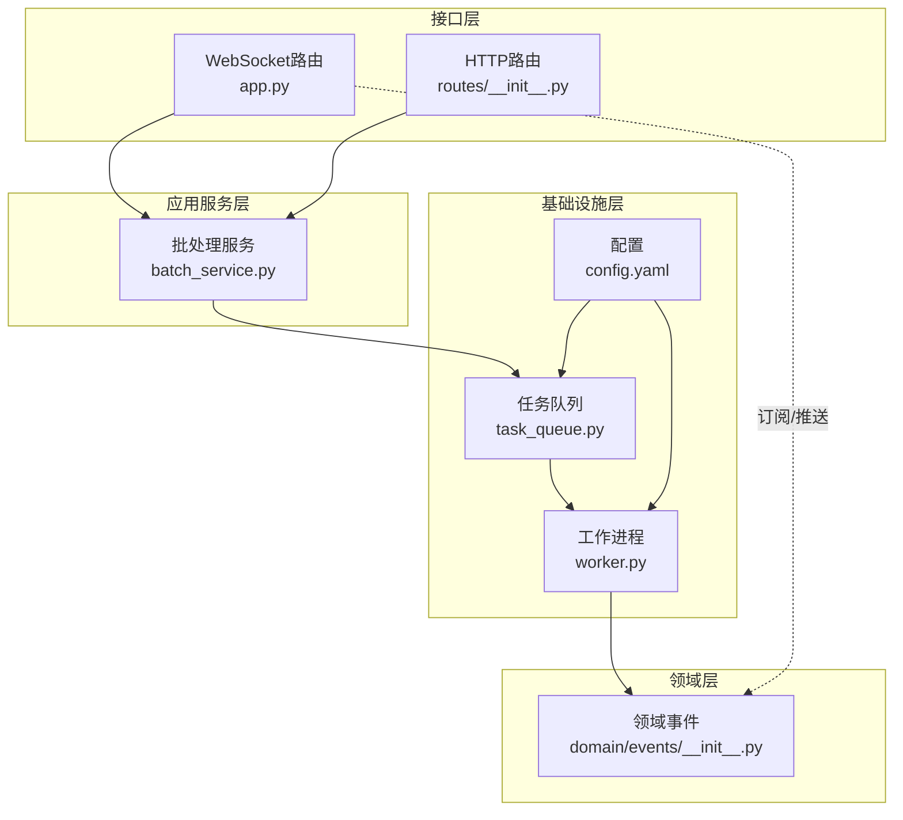
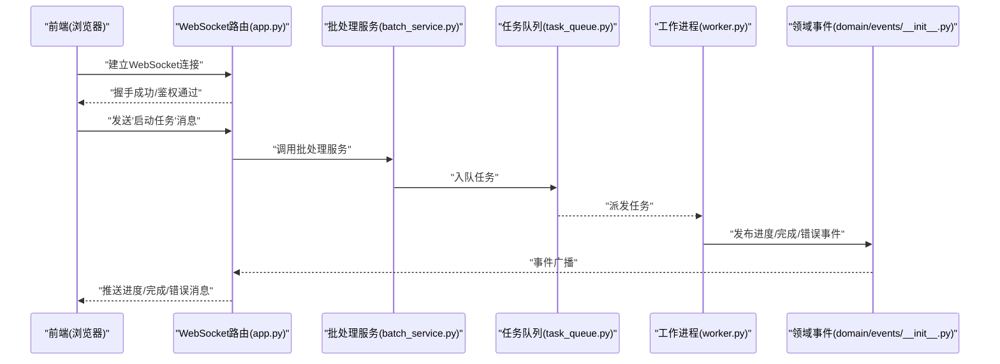
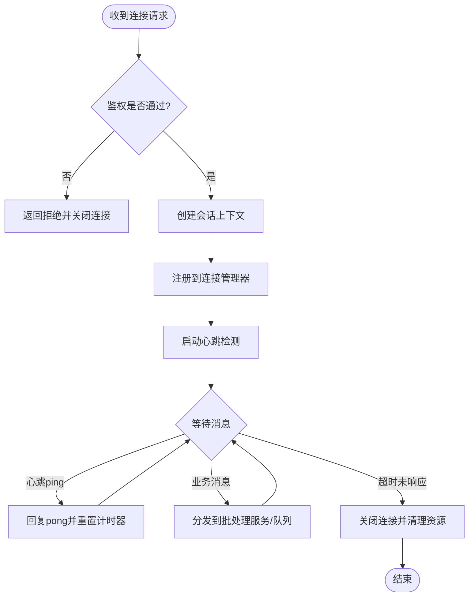
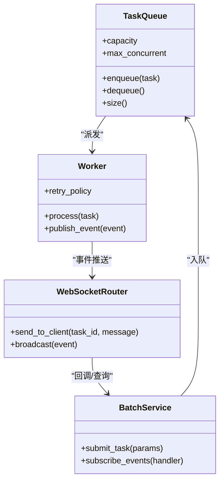
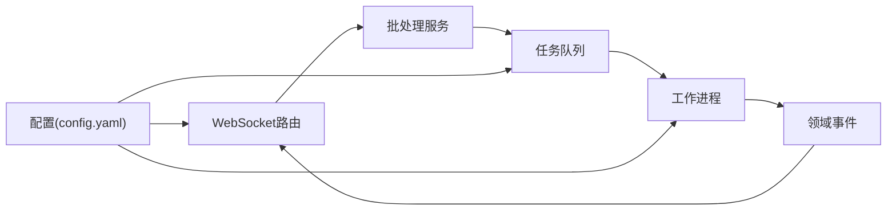

# WebSocket实时接口

<cite>
**本文引用的文件**   
- [src/paper_format_corrector/interfaces/api/app.py](file://src/paper_format_corrector/interfaces/api/app.py)
- [src/paper_format_corrector/interfaces/api/routes/__init__.py](file://src/paper_format_corrector/interfaces/api/routes/__init__.py)
- [src/paper_format_corrector/infrastructure/queue/task_queue.py](file://src/paper_format_corrector/infrastructure/queue/task_queue.py)
- [src/paper_format_corrector/infrastructure/queue/worker.py](file://src/paper_format_corrector/infrastructure/queue/worker.py)
- [src/paper_format_corrector/application/services/batch_service.py](file://src/paper_format_corrector/application/services/batch_service.py)
- [src/paper_format_corrector/domain/events/__init__.py](file://src/paper_format_corrector/domain/events/__init__.py)
- [config/config.yaml](file://config/config.yaml)
- [tests/test_task_queue.py](file://tests/test_task_queue.py)
</cite>

## 目录
1. [简介](#简介)
2. [项目结构](#项目结构)
3. [核心组件](#核心组件)
4. [架构总览](#架构总览)
5. [详细组件分析](#详细组件分析)
6. [依赖关系分析](#依赖关系分析)
7. [性能与并发](#性能与并发)
8. [故障排查指南](#故障排查指南)
9. [结论](#结论)
10. [附录：消息协议与事件定义](#附录消息协议与事件定义)

## 简介
本文件面向“论文格式矫正工具”的WebSocket实时通信能力，提供连接建立、消息协议、事件类型、任务监控与进度推送、错误通知、心跳与断线重连、前端集成示例、队列集成、并发限制、性能优化与调试监控等完整说明。文档同时给出基于现有代码库的架构图与流程图，帮助读者快速理解并落地实现。

## 项目结构
本项目采用分层与领域驱动相结合的组织方式：
- 接口层：HTTP API与WebSocket路由入口
- 应用服务层：编排批处理流程、模板校验、报告生成等
- 领域层：实体、值对象、事件模型
- 基础设施层：任务队列、工作进程、外部工具适配、配置加载等
- 配置与测试：集中化配置与端到端验证

图表来源
- [src/paper_format_corrector/interfaces/api/app.py](file://src/paper_format_corrector/interfaces/api/app.py)
- [src/paper_format_corrector/interfaces/api/routes/__init__.py](file://src/paper_format_corrector/interfaces/api/routes/__init__.py)
- [src/paper_format_corrector/application/services/batch_service.py](file://src/paper_format_corrector/application/services/batch_service.py)
- [src/paper_format_corrector/infrastructure/queue/task_queue.py](file://src/paper_format_corrector/infrastructure/queue/task_queue.py)
- [src/paper_format_corrector/infrastructure/queue/worker.py](file://src/paper_format_corrector/infrastructure/queue/worker.py)
- [src/paper_format_corrector/domain/events/__init__.py](file://src/paper_format_corrector/domain/events/__init__.py)
- [config/config.yaml](file://config/config.yaml)

章节来源
- [src/paper_format_corrector/interfaces/api/app.py](file://src/paper_format_corrector/interfaces/api/app.py)
- [src/paper_format_corrector/interfaces/api/routes/__init__.py](file://src/paper_format_corrector/interfaces/api/routes/__init__.py)
- [src/paper_format_corrector/application/services/batch_service.py](file://src/paper_format_corrector/application/services/batch_service.py)
- [src/paper_format_corrector/infrastructure/queue/task_queue.py](file://src/paper_format_corrector/infrastructure/queue/task_queue.py)
- [src/paper_format_corrector/infrastructure/queue/worker.py](file://src/paper_format_corrector/infrastructure/queue/worker.py)
- [src/paper_format_corrector/domain/events/__init__.py](file://src/paper_format_corrector/domain/events/__init__.py)
- [config/config.yaml](file://config/config.yaml)

## 核心组件
- WebSocket路由与连接管理：负责接收客户端连接、鉴权（可选）、会话上下文维护、心跳检测、断线清理与重连引导。
- 任务队列与工作进程：将格式化任务入队，由工作进程消费执行，产出进度与结果事件。
- 批处理服务：编排多步骤处理流程，向队列提交任务，监听领域事件并转发至WebSocket通道。
- 领域事件：统一的事件模型，承载任务状态变更、进度、错误等信息。
- 配置中心：集中管理WebSocket端口、心跳间隔、最大并发、队列容量等参数。

章节来源
- [src/paper_format_corrector/interfaces/api/app.py](file://src/paper_format_corrector/interfaces/api/app.py)
- [src/paper_format_corrector/application/services/batch_service.py](file://src/paper_format_corrector/application/services/batch_service.py)
- [src/paper_format_corrector/infrastructure/queue/task_queue.py](file://src/paper_format_corrector/infrastructure/queue/task_queue.py)
- [src/paper_format_corrector/infrastructure/queue/worker.py](file://src/paper_format_corrector/infrastructure/queue/worker.py)
- [src/paper_format_corrector/domain/events/__init__.py](file://src/paper_format_corrector/domain/events/__init__.py)
- [config/config.yaml](file://config/config.yaml)

## 架构总览
下图展示从前端连接到后端任务执行的端到端流程，包括连接建立、任务提交、队列调度、工作进程执行、事件发布与WebSocket推送。

图表来源
- [src/paper_format_corrector/interfaces/api/app.py](file://src/paper_format_corrector/interfaces/api/app.py)
- [src/paper_format_corrector/application/services/batch_service.py](file://src/paper_format_corrector/application/services/batch_service.py)
- [src/paper_format_corrector/infrastructure/queue/task_queue.py](file://src/paper_format_corrector/infrastructure/queue/task_queue.py)
- [src/paper_format_corrector/infrastructure/queue/worker.py](file://src/paper_format_corrector/infrastructure/queue/worker.py)
- [src/paper_format_corrector/domain/events/__init__.py](file://src/paper_format_corrector/domain/events/__init__.py)

## 详细组件分析

### WebSocket路由与连接管理
职责
- 建立与升级WebSocket连接
- 维护连接上下文与会话标识
- 心跳检测与超时断开
- 断线重连引导与退避策略
- 按任务ID或用户维度进行消息路由

关键流程
- 连接建立：握手通过后创建会话上下文，注册到连接管理器
- 心跳机制：周期性发送ping，客户端需回复pong；未响应则判定为异常
- 断线重连：前端在onclose中触发指数退避重连，服务端对重复连接做去重与限流

图表来源
- [src/paper_format_corrector/interfaces/api/app.py](file://src/paper_format_corrector/interfaces/api/app.py)

章节来源
- [src/paper_format_corrector/interfaces/api/app.py](file://src/paper_format_corrector/interfaces/api/app.py)

### 任务队列与工作进程
职责
- 任务入队与出队
- 并发控制与背压
- 失败重试与死信队列
- 与WebSocket事件桥接

关键流程
- 入队：批处理服务将任务序列化后入队，附带任务ID、优先级、超时时间
- 出队：工作进程按策略拉取任务，执行格式化逻辑
- 事件：工作进程在执行过程中发布进度、完成、错误事件
- 回推：WebSocket路由订阅事件并按任务ID推送给对应客户端

图表来源
- [src/paper_format_corrector/infrastructure/queue/task_queue.py](file://src/paper_format_corrector/infrastructure/queue/task_queue.py)
- [src/paper_format_corrector/infrastructure/queue/worker.py](file://src/paper_format_corrector/infrastructure/queue/worker.py)
- [src/paper_format_corrector/application/services/batch_service.py](file://src/paper_format_corrector/application/services/batch_service.py)
- [src/paper_format_corrector/interfaces/api/app.py](file://src/paper_format_corrector/interfaces/api/app.py)

章节来源
- [src/paper_format_corrector/infrastructure/queue/task_queue.py](file://src/paper_format_corrector/infrastructure/queue/task_queue.py)
- [src/paper_format_corrector/infrastructure/queue/worker.py](file://src/paper_format_corrector/infrastructure/queue/worker.py)
- [src/paper_format_corrector/application/services/batch_service.py](file://src/paper_format_corrector/application/services/batch_service.py)

### 领域事件与消息协议
事件类型
- 任务开始：包含任务ID、开始时间、阶段信息
- 进度更新：包含任务ID、百分比、当前阶段、耗时统计
- 任务完成：包含任务ID、结果摘要、输出路径或下载链接
- 错误通知：包含任务ID、错误码、错误信息、建议操作

消息格式约定
- 统一信封：type、payload、timestamp、traceId
- type枚举：如“task_start”、“task_progress”、“task_complete”、“error”
- payload结构：根据type动态扩展字段
- traceId：用于全链路追踪与日志关联

章节来源
- [src/paper_format_corrector/domain/events/__init__.py](file://src/paper_format_corrector/domain/events/__init__.py)

### 前端JavaScript集成与错误处理
集成要点
- 连接建立：使用原生WebSocket或封装库，支持自动重连与指数退避
- 心跳处理：定时发送ping，收到pong重置定时器
- 消息路由：根据任务ID绑定回调，避免全局监听导致错乱
- 错误处理：网络异常、鉴权失败、任务失败、超时等场景分别处理
- UI反馈：进度条、状态标签、错误提示、重试按钮

参考实现位置
- 前端集成示例可参考Web界面相关源码与静态资源组织方式

章节来源
- [src/paper_format_corrector/interfaces/web](file://src/paper_format_corrector/interfaces/web)

## 依赖关系分析
- WebSocket路由依赖批处理服务进行任务编排
- 批处理服务依赖任务队列进行异步调度
- 工作进程消费队列任务并发布领域事件
- WebSocket路由订阅事件并推送给前端
- 配置中心影响心跳间隔、并发上限、队列容量等运行时行为

图表来源
- [src/paper_format_corrector/interfaces/api/app.py](file://src/paper_format_corrector/interfaces/api/app.py)
- [src/paper_format_corrector/application/services/batch_service.py](file://src/paper_format_corrector/application/services/batch_service.py)
- [src/paper_format_corrector/infrastructure/queue/task_queue.py](file://src/paper_format_corrector/infrastructure/queue/task_queue.py)
- [src/paper_format_corrector/infrastructure/queue/worker.py](file://src/paper_format_corrector/infrastructure/queue/worker.py)
- [src/paper_format_corrector/domain/events/__init__.py](file://src/paper_format_corrector/domain/events/__init__.py)
- [config/config.yaml](file://config/config.yaml)

章节来源
- [src/paper_format_corrector/interfaces/api/app.py](file://src/paper_format_corrector/interfaces/api/app.py)
- [src/paper_format_corrector/application/services/batch_service.py](file://src/paper_format_corrector/application/services/batch_service.py)
- [src/paper_format_corrector/infrastructure/queue/task_queue.py](file://src/paper_format_corrector/infrastructure/queue/task_queue.py)
- [src/paper_format_corrector/infrastructure/queue/worker.py](file://src/paper_format_corrector/infrastructure/queue/worker.py)
- [src/paper_format_corrector/domain/events/__init__.py](file://src/paper_format_corrector/domain/events/__init__.py)
- [config/config.yaml](file://config/config.yaml)

## 性能与并发
- 并发连接限制：通过配置项限制最大WebSocket连接数，防止资源耗尽
- 心跳间隔：合理设置心跳周期，平衡实时性与带宽消耗
- 队列容量与背压：当队列接近容量时，返回排队提示或降级策略
- 批量推送：合并高频进度消息，降低前端渲染压力
- 连接复用：同一用户多标签页共享会话，减少重复鉴权与资源占用
- 水平扩展：多实例部署时，使用中心化事件总线或Redis Pub/Sub进行跨实例广播

章节来源
- [config/config.yaml](file://config/config.yaml)
- [tests/test_task_queue.py](file://tests/test_task_queue.py)

## 故障排查指南
常见问题
- 连接频繁断开：检查心跳配置与网络延迟，确认客户端重连策略
- 任务无进度：确认队列是否积压、工作进程是否存活、事件是否发布
- 消息错乱：核对任务ID与traceId，确保前端按任务ID路由消息
- 鉴权失败：检查令牌有效期与签名算法，确认路由鉴权中间件生效

定位方法
- 查看WebSocket路由日志，关注握手、心跳、消息收发记录
- 检查任务队列监控指标：入队/出队速率、堆积量、失败率
- 检查工作进程日志：任务执行耗时、异常堆栈、重试次数
- 使用浏览器开发者工具的Network面板观察WebSocket帧

章节来源
- [src/paper_format_corrector/interfaces/api/app.py](file://src/paper_format_corrector/interfaces/api/app.py)
- [src/paper_format_corrector/infrastructure/queue/task_queue.py](file://src/paper_format_corrector/infrastructure/queue/task_queue.py)
- [src/paper_format_corrector/infrastructure/queue/worker.py](file://src/paper_format_corrector/infrastructure/queue/worker.py)

## 结论
通过WebSocket与任务队列的结合，系统实现了高吞吐、低延迟的实时任务监控与进度推送。合理的连接管理、心跳机制、断线重连与错误处理策略保障了用户体验与系统稳定性。配合配置中心的灵活调优与完善的监控手段，可在生产环境中稳定运行。

## 附录：消息协议与事件定义
- 连接建立
  - 客户端发起WebSocket连接，携带鉴权信息（可选）
  - 服务端返回握手成功或错误码
- 消息信封
  - type：字符串，消息类型
  - payload：对象，具体数据
  - timestamp：时间戳
  - traceId：追踪ID
- 事件类型
  - task_start：任务开始
  - task_progress：进度更新
  - task_complete：任务完成
  - error：错误通知
- 典型字段
  - task_id：任务唯一标识
  - percent：进度百分比
  - stage：当前阶段
  - error_code：错误码
  - suggestion：建议操作

章节来源
- [src/paper_format_corrector/domain/events/__init__.py](file://src/paper_format_corrector/domain/events/__init__.py)