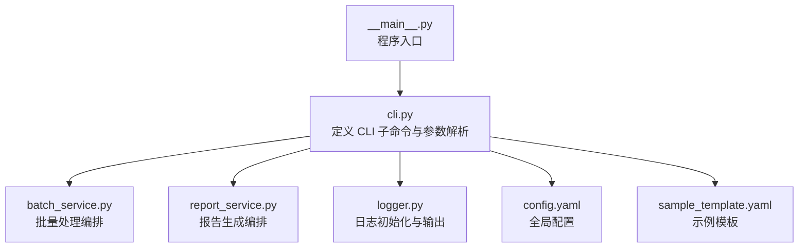
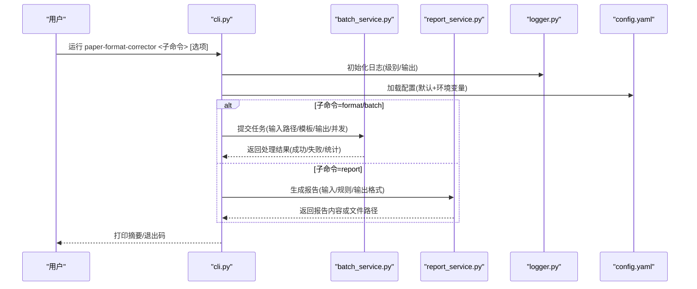
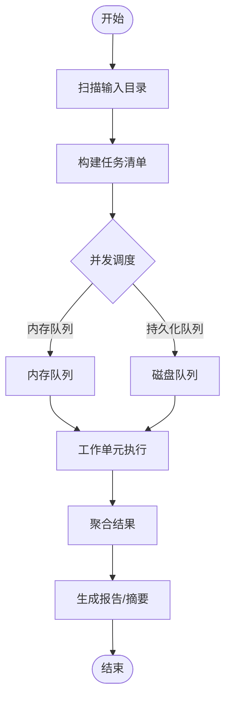
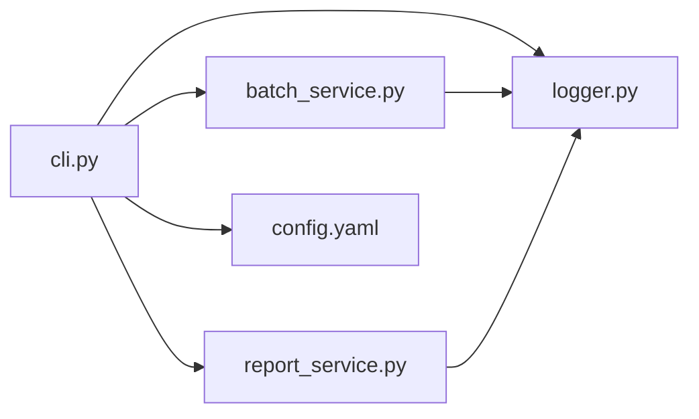

# 命令行接口

<cite>
**本文引用的文件**   
- [src/paper_format_corrector/cli.py](file://src/paper_format_corrector/cli.py)
- [src/paper_format_corrector/__main__.py](file://src/paper_format_corrector/__main__.py)
- [src/paper_format_corrector/application/services/batch_service.py](file://src/paper_format_corrector/application/services/batch_service.py)
- [src/paper_format_corrector/application/services/report_service.py](file://src/paper_format_corrector/application/services/report_service.py)
- [src/paper_format_corrector/infra/logger.py](file://src/paper_format_corrector/infra/logger.py)
- [config/config.yaml](file://config/config.yaml)
- [examples/sample_template.yaml](file://examples/sample_template.yaml)
- [.github/workflows/ci.yml](file://.github/workflows/ci.yml)
</cite>

## 目录
1. [简介](#简介)
2. [项目结构](#项目结构)
3. [核心组件](#核心组件)
4. [架构总览](#架构总览)
5. [详细组件分析](#详细组件分析)
6. [依赖关系分析](#依赖关系分析)
7. [性能考虑](#性能考虑)
8. [故障排查指南](#故障排查指南)
9. [结论](#结论)
10. [附录](#附录)

## 简介
本文件为 paper-format-corrector 的命令行接口（CLI）完整使用文档，覆盖以下命令与能力：
- format：对单个或一组文档执行格式矫正
- batch：批量处理目录下的文档
- template：模板相关操作（如校验、导出等）
- report：生成质量报告或差异报告

文档包含参数说明、输入输出格式、配置文件支持、环境变量、日志输出格式、错误码含义，并提供丰富的示例与 CI/CD 集成方案。

## 项目结构
CLI 入口由包入口与子命令处理器组成，服务层提供批处理与报告生成能力，基础设施层负责日志与配置加载。

图表来源
- [src/paper_format_corrector/cli.py](file://src/paper_format_corrector/cli.py)
- [src/paper_format_corrector/application/services/batch_service.py](file://src/paper_format_corrector/application/services/batch_service.py)
- [src/paper_format_corrector/application/services/report_service.py](file://src/paper_format_corrector/application/services/report_service.py)
- [src/paper_format_corrector/infra/logger.py](file://src/paper_format_corrector/infra/logger.py)
- [config/config.yaml](file://config/config.yaml)
- [examples/sample_template.yaml](file://examples/sample_template.yaml)
- [src/paper_format_corrector/__main__.py](file://src/paper_format_corrector/__main__.py)

章节来源
- [src/paper_format_corrector/cli.py](file://src/paper_format_corrector/cli.py)
- [src/paper_format_corrector/__main__.py](file://src/paper_format_corrector/__main__.py)

## 核心组件
- CLI 子命令注册器：集中定义 format、batch、template、report 四个子命令及其参数。
- 批处理服务：遍历输入路径，按策略并行或串行处理文档，汇总结果。
- 报告服务：基于规则引擎或差异对比生成结构化报告（JSON/YAML/文本）。
- 日志系统：统一日志级别、输出目标与格式化。
- 配置加载：从默认位置与环境变量合并加载配置。

章节来源
- [src/paper_format_corrector/cli.py](file://src/paper_format_corrector/cli.py)
- [src/paper_format_corrector/application/services/batch_service.py](file://src/paper_format_corrector/application/services/batch_service.py)
- [src/paper_format_corrector/application/services/report_service.py](file://src/paper_format_corrector/application/services/report_service.py)
- [src/paper_format_corrector/infra/logger.py](file://src/paper_format_corrector/infra/logger.py)

## 架构总览
下图展示 CLI 到服务层的调用关系与数据流向。

图表来源
- [src/paper_format_corrector/cli.py](file://src/paper_format_corrector/cli.py)
- [src/paper_format_corrector/application/services/batch_service.py](file://src/paper_format_corrector/application/services/batch_service.py)
- [src/paper_format_corrector/application/services/report_service.py](file://src/paper_format_corrector/application/services/report_service.py)
- [src/paper_format_corrector/infra/logger.py](file://src/paper_format_corrector/infra/logger.py)
- [config/config.yaml](file://config/config.yaml)

## 详细组件分析

### 通用参数与全局选项
- 常用全局选项
  - --config/-c：指定配置文件路径（YAML），未指定时尝试默认位置
  - --log-level/-l：日志级别（如 DEBUG/INFO/WARNING/ERROR）
  - --log-file/-f：将日志写入文件；同时可保留控制台输出
  - --output-dir/-o：指定输出目录（部分命令需要）
  - --dry-run：仅模拟执行，不写盘
  - --verbose/-v：更详细的输出
  - --quiet/-q：静默模式，仅输出必要信息
  - --version：显示版本信息
  - --help/-h：显示帮助信息

- 配置文件优先级
  - 显式 --config 指定的文件
  - 默认配置文件（位于 config/config.yaml）
  - 环境变量覆盖（见“环境变量”小节）

章节来源
- [src/paper_format_corrector/cli.py](file://src/paper_format_corrector/cli.py)
- [config/config.yaml](file://config/config.yaml)

### 环境变量
- PFC_CONFIG_PATH：自定义配置文件路径
- PFC_LOG_LEVEL：覆盖 --log-level
- PFC_LOG_FILE：覆盖 --log-file
- PFC_OUTPUT_DIR：覆盖默认输出目录
- PFC_DRY_RUN：开启干跑模式
- PFC_VERBOSE：开启详细输出
- PFC_QUIET：开启静默模式

说明：当环境变量与命令行选项同时存在时，命令行优先于环境变量，环境变量优先于配置文件默认值。

章节来源
- [src/paper_format_corrector/cli.py](file://src/paper_format_corrector/cli.py)
- [src/paper_format_corrector/infra/logger.py](file://src/paper_format_corrector/infra/logger.py)

### 日志输出格式
- 控制台输出
  - 时间戳、级别、模块名、消息
  - 可通过 --log-level 控制可见性
- 文件输出
  - 通过 --log-file 指定路径
  - 支持追加或覆盖（取决于实现）
- JSON 结构化日志
  - 在特定环境下可启用 JSON 格式（便于采集）

章节来源
- [src/paper_format_corrector/infra/logger.py](file://src/paper_format_corrector/infra/logger.py)

### 错误码与退出状态
- 0：成功
- 1：一般错误（参数错误、IO 异常等）
- 2：配置错误（缺失/无效）
- 3：模板错误（模板校验失败/不可用）
- 4：权限或路径安全错误
- 5：外部工具缺失或不可用
- 其他：内部异常或未知错误

说明：具体映射以实现为准，建议在脚本中捕获并记录对应日志以便定位问题。

章节来源
- [src/paper_format_corrector/cli.py](file://src/paper_format_corrector/cli.py)

### 子命令：format
用途：对单个或多个文档执行格式矫正，支持模板与输出控制。

- 必填/可选参数
  - input：输入文件或目录（支持通配符）
  - --template/-t：模板文件路径（YAML）
  - --preset/-p：内置预设名称（如 ieee、acm、apa 等）
  - --output/-o：输出路径（文件或目录）
  - --overwrite：允许覆盖已有输出
  - --backup：生成备份副本
  - --concurrency/-j：并发数（受资源限制）
  - --extensions/-e：匹配的文件扩展名列表（默认 docx/doc）
  - --exclude/-x：排除模式（正则或 glob）
  - --rules/-r：规则集路径（YAML/JSON）
  - --validate-only：仅验证不修改
  - --diff：输出差异摘要
  - --report：生成简要报告（与 --report-format 配合）
  - --report-format：报告格式（json/yaml/text）
  - --report-output/-R：报告输出路径
  - --dry-run：仅预览变更
  - --force：强制执行（忽略某些警告）
  - --timeout：处理超时（秒）
  - --retry：失败重试次数
  - --skip-failed：跳过失败项继续处理
  - --summary：输出处理摘要
  - --no-color：禁用彩色输出
  - --log-level/-l：日志级别
  - --log-file/-f：日志文件
  - --config/-c：配置文件
  - --help/-h：帮助

- 输入输出格式
  - 输入：docx/doc/pdf（根据实现支持的类型）
  - 输出：docx（默认），也可导出为其他格式（若启用转换器）
  - 报告：json/yaml/text

- 典型用法示例
  - 单次文件处理
    - paper-format-corrector format ./paper.docx --template ./template.yaml --output ./out.docx
  - 批量目录处理
    - paper-format-corrector format ./papers/ --preset ieee --output ./formatted/ --concurrency 4
  - 仅验证不修改
    - paper-format-corrector format ./paper.docx --validate-only --report --report-format json --report-output ./report.json
  - 带规则与排除
    - paper-format-corrector format ./docs/ --rules ./rules.yaml --exclude "*.temp.*" --summary

章节来源
- [src/paper_format_corrector/cli.py](file://src/paper_format_corrector/cli.py)

### 子命令：batch
用途：对目录树进行批量处理，支持过滤、并发与任务队列。

- 关键参数
  - input_dir：根目录
  - --recursive/-R：递归扫描
  - --max-depth/-d：最大深度
  - --extensions/-e：扩展名白名单
  - --exclude/-x：排除模式
  - --concurrency/-j：并发度
  - --queue-type：队列类型（内存/持久化）
  - --queue-path：持久化队列存储路径
  - --resume：断点续跑
  - --status-file：任务状态文件
  - --on-success/--on-failure：回调脚本路径
  - --dry-run：仅预览
  - --summary：输出统计
  - --report/--report-format/--report-output：同上
  - --config/-c、--log-level/-l、--log-file/-f、--help/-h：同上

- 工作流
  - 扫描输入目录 -> 构建任务列表 -> 分发到工作进程/线程 -> 聚合结果 -> 输出报告/摘要

图表来源
- [src/paper_format_corrector/application/services/batch_service.py](file://src/paper_format_corrector/application/services/batch_service.py)

章节来源
- [src/paper_format_corrector/cli.py](file://src/paper_format_corrector/cli.py)
- [src/paper_format_corrector/application/services/batch_service.py](file://src/paper_format_corrector/application/services/batch_service.py)

### 子命令：template
用途：模板管理（校验、导出、比较、安装等）。

- 常见选项
  - validate：校验模板语法与引用
  - export：导出模板为归档或清单
  - compare：比较两个模板差异
  - install：安装模板到本地仓库
  - list：列出可用模板（内置/本地/远程）
  - --path/-p：模板路径
  - --name/-n：模板名称
  - --version/-V：模板版本
  - --output/-o：输出路径
  - --strict：严格模式
  - --dry-run：仅预览
  - --config/-c、--log-level/-l、--log-file/-f、--help/-h：同上

- 模板文件格式
  - YAML 结构（字段包括元数据、样式映射、段落规则、表格规则、图片规则、页眉页脚、封面等）
  - 参考示例：examples/sample_template.yaml

章节来源
- [src/paper_format_corrector/cli.py](file://src/paper_format_corrector/cli.py)
- [examples/sample_template.yaml](file://examples/sample_template.yaml)

### 子命令：report
用途：生成质量报告或差异报告，支持多种输出格式。

- 关键参数
  - input：输入文件或目录
  - --type/-t：报告类型（quality/diff）
  - --rules/-r：规则集路径
  - --baseline/-b：基线文件（用于 diff）
  - --format/-f：输出格式（json/yaml/text）
  - --output/-o：输出路径
  - --threshold：阈值（影响合格判定）
  - --summary：输出摘要
  - --config/-c、--log-level/-l、--log-file/-f、--help/-h：同上

- 报告结构（概览）
  - 元信息：生成时间、工具版本、输入源
  - 统计：处理数量、成功/失败计数
  - 问题列表：类别、严重级别、位置、建议修复
  - 评分：总体质量分、各维度得分

章节来源
- [src/paper_format_corrector/cli.py](file://src/paper_format_corrector/cli.py)
- [src/paper_format_corrector/application/services/report_service.py](file://src/paper_format_corrector/application/services/report_service.py)

## 依赖关系分析
- 模块耦合
  - cli.py 作为门面，依赖 batch_service.py 与 report_service.py 完成业务编排
  - logger.py 被所有模块共享，确保一致的日志行为
  - config.yaml 提供默认配置，环境变量与命令行可覆盖
- 外部依赖
  - 模板与规则文件（YAML/JSON）
  - 可选的外部工具（如 PDF 转换、LaTeX 导出等）

图表来源
- [src/paper_format_corrector/cli.py](file://src/paper_format_corrector/cli.py)
- [src/paper_format_corrector/application/services/batch_service.py](file://src/paper_format_corrector/application/services/batch_service.py)
- [src/paper_format_corrector/application/services/report_service.py](file://src/paper_format_corrector/application/services/report_service.py)
- [src/paper_format_corrector/infra/logger.py](file://src/paper_format_corrector/infra/logger.py)
- [config/config.yaml](file://config/config.yaml)

章节来源
- [src/paper_format_corrector/cli.py](file://src/paper_format_corrector/cli.py)
- [src/paper_format_corrector/application/services/batch_service.py](file://src/paper_format_corrector/application/services/batch_service.py)
- [src/paper_format_corrector/application/services/report_service.py](file://src/paper_format_corrector/application/services/report_service.py)
- [src/paper_format_corrector/infra/logger.py](file://src/paper_format_corrector/infra/logger.py)
- [config/config.yaml](file://config/config.yaml)

## 性能考虑
- 并发与资源
  - 合理设置 --concurrency/-j，避免 I/O 或 CPU 瓶颈
  - 大目录建议使用 --resume 与持久化队列，防止中断重跑
- 缓存与增量
  - 利用 --dry-run 预检，减少不必要的写入
  - 使用 --exclude 缩小范围，提升扫描速度
- 报告与日志
  - 生产环境关闭 --verbose，降低 IO 开销
  - 使用 --log-file 将日志落盘，避免控制台阻塞

[本节为通用指导，无需源码引用]

## 故障排查指南
- 常见问题
  - 找不到配置文件：检查 --config 或 PFC_CONFIG_PATH
  - 权限不足：确认输出目录可写
  - 模板校验失败：使用 template validate 检查模板
  - 外部工具缺失：安装所需依赖或调整 PATH
- 诊断步骤
  - 提高日志级别：--log-level=DEBUG
  - 启用干跑：--dry-run 观察变更
  - 生成报告：--report --report-format json
  - 查看退出码：结合日志定位错误原因

章节来源
- [src/paper_format_corrector/infra/logger.py](file://src/paper_format_corrector/infra/logger.py)
- [src/paper_format_corrector/cli.py](file://src/paper_format_corrector/cli.py)

## 结论
CLI 提供了统一的入口来驱动格式矫正、批量处理、模板管理与报告生成。通过合理的配置、环境变量与日志策略，可在本地与 CI/CD 环境中稳定运行。

[本节为总结，无需源码引用]

## 附录

### Shell 脚本集成示例
- 基本封装
  - 定义函数包装 paper-format-corrector 调用
  - 捕获退出码并记录日志
  - 支持传入参数透传
- 示例流程
  - 准备输入与模板
  - 执行 format 或 batch
  - 生成报告并归档
  - 清理临时文件

[本节为概念性示例，无需源码引用]

### CI/CD 流水线配置示例
- GitHub Actions
  - 安装依赖
  - 下载模板与规则
  - 执行 format/batch
  - 上传报告与产物
- 示例片段
  - 使用 .github/workflows/ci.yml 中的步骤组织流程

章节来源
- [.github/workflows/ci.yml](file://.github/workflows/ci.yml)