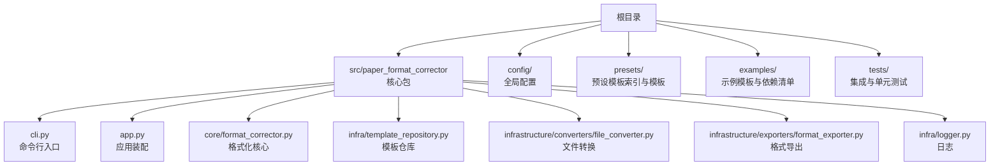
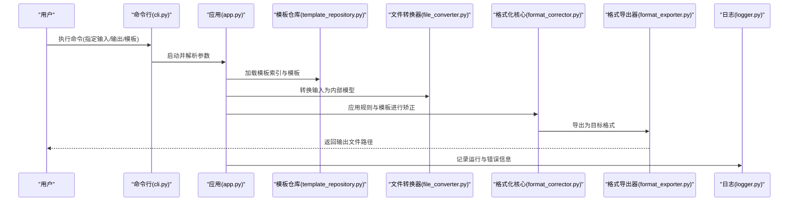
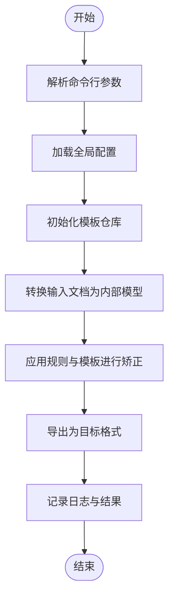
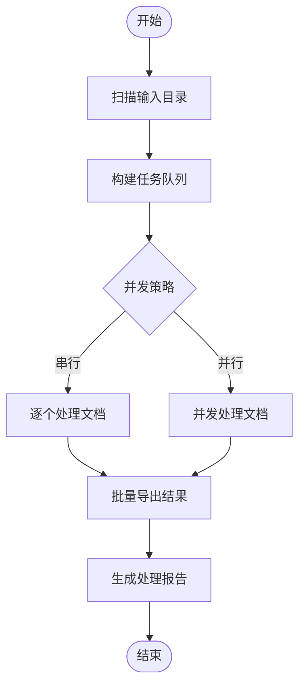
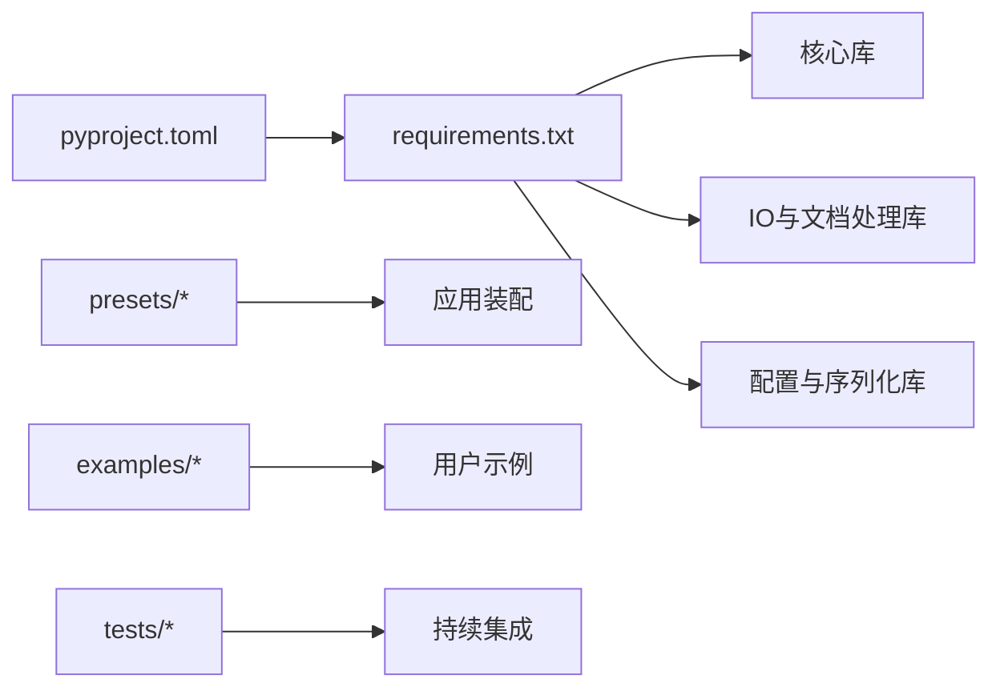

# 快速开始

<cite>
**本文引用的文件**   
- [README.md](file://README.md)
- [pyproject.toml](file://pyproject.toml)
- [requirements.txt](file://requirements.txt)
- [run.py](file://run.py)
- [src/paper_format_corrector/__main__.py](file://src/paper_format_corrector/__main__.py)
- [src/paper_format_corrector/cli.py](file://src/paper_format_corrector/cli.py)
- [src/paper_format_corrector/app.py](file://src/paper_format_corrector/app.py)
- [config/config.yaml](file://config/config.yaml)
- [config/updater.yaml](file://config/updater.yaml)
- [presets/templates_index.yaml](file://presets/templates_index.yaml)
- [examples/sample_template.yaml](file://examples/sample_template.yaml)
- [examples/sample_requirements.txt](file://examples/sample_requirements.txt)
- [src/paper_format_corrector/infra/template_repository.py](file://src/paper_format_corrector/infra/template_repository.py)
- [src/paper_format_corrector/application/services/batch_service.py](file://src/paper_format_corrector/application/services/batch_service.py)
- [src/paper_format_corrector/core/format_corrector.py](file://src/paper_format_corrector/core/format_corrector.py)
- [src/paper_format_corrector/infrastructure/converters/file_converter.py](file://src/paper_format_corrector/infrastructure/converters/file_converter.py)
- [src/paper_format_corrector/infrastructure/exporters/format_exporter.py](file://src/paper_format_corrector/infrastructure/exporters/format_exporter.py)
- [src/paper_format_corrector/infra/logger.py](file://src/paper_format_corrector/infra/logger.py)
- [tests/test_cli_integration.py](file://tests/test_cli_integration.py)
</cite>

## 目录
1. [简介](#简介)
2. [项目结构](#项目结构)
3. [核心组件](#核心组件)
4. [架构总览](#架构总览)
5. [详细组件分析](#详细组件分析)
6. [依赖分析](#依赖分析)
7. [性能考虑](#性能考虑)
8. [故障排除指南](#故障排除指南)
9. [结论](#结论)
10. [附录](#附录)

## 简介
本指南面向初学者，帮助你在30分钟内完成论文格式矫正工具的安装、初始配置与首次使用。你将了解：
- 环境要求（Python版本、系统依赖）
- 多种安装方式（pip安装、源码安装、Docker部署）
- 初始配置步骤（配置文件设置、模板初始化）
- 基本用法（单次文档矫正到批量处理）
- 常见问题与排错建议

## 项目结构
仓库采用分层与模块化组织，核心入口位于 src 下，CLI、应用服务、核心处理逻辑、基础设施与接口分离清晰；预设模板与示例位于 presets 与 examples；配置文件集中于 config。

图表来源
- [src/paper_format_corrector/cli.py](file://src/paper_format_corrector/cli.py)
- [src/paper_format_corrector/app.py](file://src/paper_format_corrector/app.py)
- [src/paper_format_corrector/core/format_corrector.py](file://src/paper_format_corrector/core/format_corrector.py)
- [src/paper_format_corrector/infra/template_repository.py](file://src/paper_format_corrector/infra/template_repository.py)
- [src/paper_format_corrector/infrastructure/converters/file_converter.py](file://src/paper_format_corrector/infrastructure/converters/file_converter.py)
- [src/paper_format_corrector/infrastructure/exporters/format_exporter.py](file://src/paper_format_corrector/infrastructure/exporters/format_exporter.py)
- [src/paper_format_corrector/infra/logger.py](file://src/paper_format_corrector/infra/logger.py)

章节来源
- [README.md](file://README.md)
- [pyproject.toml](file://pyproject.toml)
- [requirements.txt](file://requirements.txt)

## 核心组件
- 命令行入口：提供一键运行、参数解析与子命令（如单次矫正、批量处理、模板管理）。
- 应用装配：负责加载配置、初始化模板仓库、注册处理器与导出器。
- 格式化核心：读取输入文档、应用规则与模板、输出标准化结果。
- 模板仓库：加载本地与远程模板，维护模板索引与版本。
- 文件转换器：统一处理不同输入格式（docx/pdf等）到内部模型。
- 格式导出器：将内部模型导出为目标格式（docx/pdf/latex等）。
- 日志模块：记录运行信息、错误与诊断数据。

章节来源
- [src/paper_format_corrector/cli.py](file://src/paper_format_corrector/cli.py)
- [src/paper_format_corrector/app.py](file://src/paper_format_corrector/app.py)
- [src/paper_format_corrector/core/format_corrector.py](file://src/paper_format_corrector/core/format_corrector.py)
- [src/paper_format_corrector/infra/template_repository.py](file://src/paper_format_corrector/infra/template_repository.py)
- [src/paper_format_corrector/infrastructure/converters/file_converter.py](file://src/paper_format_corrector/infrastructure/converters/file_converter.py)
- [src/paper_format_corrector/infrastructure/exporters/format_exporter.py](file://src/paper_format_corrector/infrastructure/exporters/format_exporter.py)
- [src/paper_format_corrector/infra/logger.py](file://src/paper_format_corrector/infra/logger.py)

## 架构总览
整体流程：用户通过 CLI 或 API 发起任务 → 应用装配加载配置与模板 → 文件转换器解析输入 → 格式化核心应用规则与模板 → 导出器生成目标文件 → 日志记录全过程。

图表来源
- [src/paper_format_corrector/cli.py](file://src/paper_format_corrector/cli.py)
- [src/paper_format_corrector/app.py](file://src/paper_format_corrector/app.py)
- [src/paper_format_corrector/infra/template_repository.py](file://src/paper_format_corrector/infra/template_repository.py)
- [src/paper_format_corrector/infrastructure/converters/file_converter.py](file://src/paper_format_corrector/infrastructure/converters/file_converter.py)
- [src/paper_format_corrector/core/format_corrector.py](file://src/paper_format_corrector/core/format_corrector.py)
- [src/paper_format_corrector/infrastructure/exporters/format_exporter.py](file://src/paper_format_corrector/infrastructure/exporters/format_exporter.py)
- [src/paper_format_corrector/infra/logger.py](file://src/paper_format_corrector/infra/logger.py)

## 详细组件分析

### 安装与环境准备
- Python 版本要求
  - 请查看项目元数据与依赖声明以确认支持的 Python 版本范围。
- 系统依赖
  - 若涉及外部工具（如 LaTeX），请参考 README 的说明进行安装。
- 安装方法
  - pip 安装：从 PyPI 安装稳定版。
  - 源码安装：克隆仓库后在根目录执行安装命令。
  - Docker 部署：使用官方镜像运行容器化服务（如有镜像构建脚本或 Dockerfile，按仓库指引操作）。

章节来源
- [README.md](file://README.md)
- [pyproject.toml](file://pyproject.toml)
- [requirements.txt](file://requirements.txt)

### 初始配置
- 全局配置
  - 编辑 config/config.yaml 中的基础选项（如输入/输出目录、默认模板、日志级别等）。
  - 更新策略可参考 config/updater.yaml（如启用自动更新、检查频率等）。
- 模板初始化
  - 使用内置模板索引 presets/templates_index.yaml 选择预设模板。
  - 自定义模板可参考 examples/sample_template.yaml 的结构与字段。
  - 模板仓库会自动加载本地模板与可选远程模板。

章节来源
- [config/config.yaml](file://config/config.yaml)
- [config/updater.yaml](file://config/updater.yaml)
- [presets/templates_index.yaml](file://presets/templates_index.yaml)
- [examples/sample_template.yaml](file://examples/sample_template.yaml)
- [src/paper_format_corrector/infra/template_repository.py](file://src/paper_format_corrector/infra/template_repository.py)

### 基本使用示例
- 单次文档矫正
  - 通过 CLI 指定输入文档、输出目录与模板名称，执行一次格式化任务。
- 批量处理
  - 使用批量命令或批处理服务对目录下的多个文档进行统一格式化。
- 模板管理与验证
  - 列出可用模板、校验模板语法、导入自定义模板。

章节来源
- [src/paper_format_corrector/cli.py](file://src/paper_format_corrector/cli.py)
- [src/paper_format_corrector/application/services/batch_service.py](file://src/paper_format_corrector/application/services/batch_service.py)
- [tests/test_cli_integration.py](file://tests/test_cli_integration.py)

### 关键流程图：单次矫正

图表来源
- [src/paper_format_corrector/cli.py](file://src/paper_format_corrector/cli.py)
- [src/paper_format_corrector/app.py](file://src/paper_format_corrector/app.py)
- [src/paper_format_corrector/infra/template_repository.py](file://src/paper_format_corrector/infra/template_repository.py)
- [src/paper_format_corrector/infrastructure/converters/file_converter.py](file://src/paper_format_corrector/infrastructure/converters/file_converter.py)
- [src/paper_format_corrector/core/format_corrector.py](file://src/paper_format_corrector/core/format_corrector.py)
- [src/paper_format_corrector/infrastructure/exporters/format_exporter.py](file://src/paper_format_corrector/infrastructure/exporters/format_exporter.py)
- [src/paper_format_corrector/infra/logger.py](file://src/paper_format_corrector/infra/logger.py)

### 关键流程图：批量处理

图表来源
- [src/paper_format_corrector/application/services/batch_service.py](file://src/paper_format_corrector/application/services/batch_service.py)
- [src/paper_format_corrector/infrastructure/converters/file_converter.py](file://src/paper_format_corrector/infrastructure/converters/file_converter.py)
- [src/paper_format_corrector/infrastructure/exporters/format_exporter.py](file://src/paper_format_corrector/infrastructure/exporters/format_exporter.py)

## 依赖分析
- 运行时依赖
  - Python 标准库与第三方库由 requirements.txt 与 pyproject.toml 共同声明。
- 模板与资源
  - 模板索引与示例模板位于 presets 与 examples 目录。
- 测试与集成
  - tests 包含 CLI 集成测试，可用于验证安装与基本功能。

图表来源
- [pyproject.toml](file://pyproject.toml)
- [requirements.txt](file://requirements.txt)
- [presets/templates_index.yaml](file://presets/templates_index.yaml)
- [examples/sample_template.yaml](file://examples/sample_template.yaml)
- [tests/test_cli_integration.py](file://tests/test_cli_integration.py)

章节来源
- [pyproject.toml](file://pyproject.toml)
- [requirements.txt](file://requirements.txt)
- [tests/test_cli_integration.py](file://tests/test_cli_integration.py)

## 性能考虑
- 批量处理时合理设置并发度，避免 I/O 瓶颈。
- 大型文档建议分块处理或限制同时处理的文档数量。
- 使用合适的日志级别以减少磁盘写入开销。
- 模板缓存可减少重复加载成本。

[本节为通用指导，不直接分析具体文件]

## 故障排除指南
- 无法找到模板
  - 检查模板索引与模板路径是否正确，确认模板仓库已初始化。
- 输入格式不支持
  - 确认输入文件类型与转换器支持列表一致。
- 权限问题
  - 确保对输入/输出目录具有读写权限。
- 网络问题（远程模板）
  - 检查网络连接与代理设置，必要时禁用远程模板同步。
- 日志定位
  - 查看日志文件与控制台输出，定位异常堆栈与上下文信息。

章节来源
- [src/paper_format_corrector/infra/template_repository.py](file://src/paper_format_corrector/infra/template_repository.py)
- [src/paper_format_corrector/infrastructure/converters/file_converter.py](file://src/paper_format_corrector/infrastructure/converters/file_converter.py)
- [src/paper_format_corrector/infra/logger.py](file://src/paper_format_corrector/infra/logger.py)

## 结论
通过以上步骤，你可以在短时间内完成安装、配置与首次使用。建议从单次矫正入手，逐步过渡到批量处理与自定义模板，结合日志与测试用例快速定位问题。

[本节为总结性内容，不直接分析具体文件]

## 附录
- 常用命令速查
  - 单次矫正：指定输入、输出与模板名称。
  - 批量处理：指定输入目录、输出目录与模板。
  - 模板管理：列出、校验与导入模板。
- 示例与参考
  - 参考 examples 中的模板与依赖清单，快速搭建你的工作流。
  - 阅读 tests 中的集成用例，理解典型调用方式。

章节来源
- [examples/sample_template.yaml](file://examples/sample_template.yaml)
- [examples/sample_requirements.txt](file://examples/sample_requirements.txt)
- [tests/test_cli_integration.py](file://tests/test_cli_integration.py)