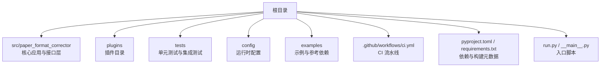
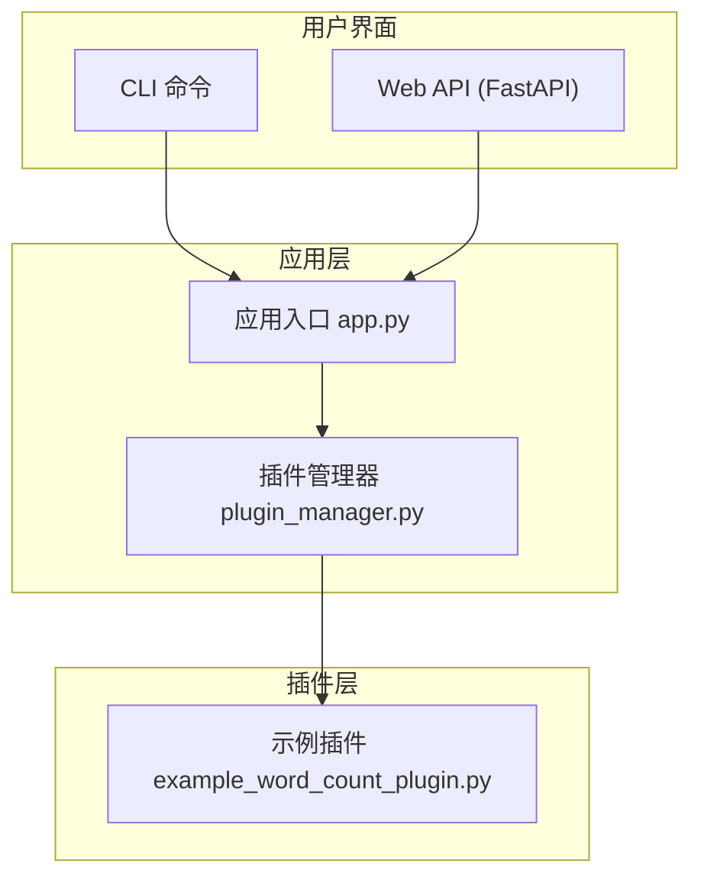
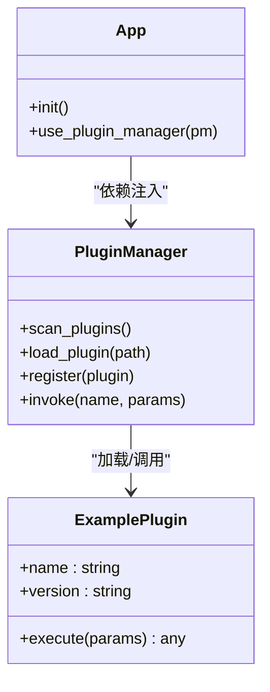
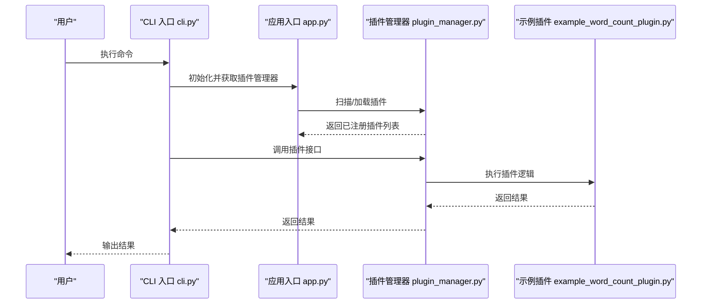
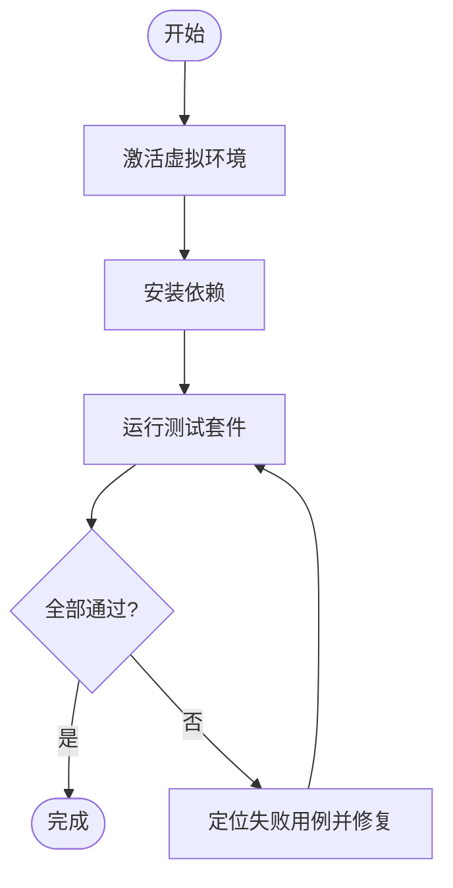
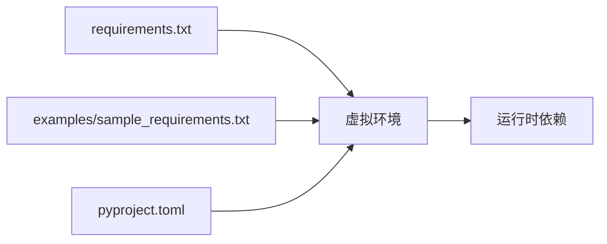
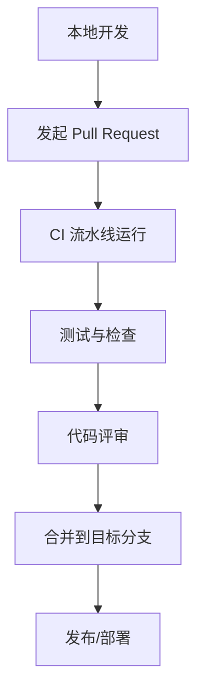

# 开发环境搭建

<cite>
**本文引用的文件**   
- [README.md](file://README.md)
- [pyproject.toml](file://pyproject.toml)
- [requirements.txt](file://requirements.txt)
- [run.py](file://run.py)
- [src/paper_format_corrector/__main__.py](file://src/paper_format_corrector/__main__.py)
- [src/paper_format_corrector/app.py](file://src/paper_format_corrector/app.py)
- [src/paper_format_corrector/cli.py](file://src/paper_format_corrector/cli.py)
- [src/paper_format_corrector/api/app.py](file://src/paper_format_corrector/api/app.py)
- [src/paper_format_corrector/infra/plugin_manager.py](file://src/paper_format_corrector/infra/plugin_manager.py)
- [plugins/example_word_count_plugin.py](file://plugins/example_word_count_plugin.py)
- [.github/workflows/ci.yml](file://.github/workflows/ci.yml)
- [tests/conftest.py](file://tests/conftest.py)
- [examples/sample_requirements.txt](file://examples/sample_requirements.txt)
</cite>

## 目录
1. [简介](#简介)
2. [项目结构](#项目结构)
3. [核心组件](#核心组件)
4. [架构总览](#架构总览)
5. [详细组件分析](#详细组件分析)
6. [依赖分析](#依赖分析)
7. [性能考虑](#性能考虑)
8. [故障排除指南](#故障排除指南)
9. [结论](#结论)
10. [附录](#附录)

## 简介
本指南面向插件开发者，提供从零开始搭建本地开发环境的完整步骤与最佳实践。内容涵盖：
- Python 环境与依赖包安装（虚拟环境、依赖管理）
- IDE 与调试器配置建议
- 代码格式化工具与质量检查
- 项目结构与命名约定
- 开发工作流（提交、分支、协作）
- 环境验证方法与常见问题排查
- 开发环境检查清单

## 项目结构
仓库采用分层与领域驱动相结合的组织方式，核心源码位于 src/paper_format_corrector，插件示例位于 plugins，测试位于 tests，配置文件集中于根目录与 config 目录。

**图表来源** 
- [pyproject.toml](file://pyproject.toml)
- [requirements.txt](file://requirements.txt)
- [run.py](file://run.py)
- [src/paper_format_corrector/__main__.py](file://src/paper_format_corrector/__main__.py)

**章节来源**
- [README.md](file://README.md)
- [pyproject.toml](file://pyproject.toml)
- [requirements.txt](file://requirements.txt)
- [run.py](file://run.py)
- [src/paper_format_corrector/__main__.py](file://src/paper_format_corrector/__main__.py)

## 核心组件
- 应用入口与 CLI
  - 命令行入口：[cli.py](file://src/paper_format_corrector/cli.py)
  - 程序主入口：[__main__.py](file://src/paper_format_corrector/__main__.py)
  - 启动脚本：[run.py](file://run.py)
- Web API 服务
  - FastAPI 应用：[api/app.py](file://src/paper_format_corrector/api/app.py)
- 插件系统
  - 插件管理器：[infra/plugin_manager.py](file://src/paper_format_corrector/infra/plugin_manager.py)
  - 示例插件：[plugins/example_word_count_plugin.py](file://plugins/example_word_count_plugin.py)
- 测试基础设施
  - 测试夹具：[tests/conftest.py](file://tests/conftest.py)
- 依赖与构建
  - 依赖声明：[requirements.txt](file://requirements.txt)、[examples/sample_requirements.txt](file://examples/sample_requirements.txt)
  - 构建与元数据：[pyproject.toml](file://pyproject.toml)

**章节来源**
- [src/paper_format_corrector/cli.py](file://src/paper_format_corrector/cli.py)
- [src/paper_format_corrector/__main__.py](file://src/paper_format_corrector/__main__.py)
- [run.py](file://run.py)
- [src/paper_format_corrector/api/app.py](file://src/paper_format_corrector/api/app.py)
- [src/paper_format_corrector/infra/plugin_manager.py](file://src/paper_format_corrector/infra/plugin_manager.py)
- [plugins/example_word_count_plugin.py](file://plugins/example_word_count_plugin.py)
- [tests/conftest.py](file://tests/conftest.py)
- [requirements.txt](file://requirements.txt)
- [examples/sample_requirements.txt](file://examples/sample_requirements.txt)
- [pyproject.toml](file://pyproject.toml)

## 架构总览
下图展示了插件在系统中的加载与调用路径，以及 CLI/Web API 如何与插件交互。

**图表来源** 
- [src/paper_format_corrector/app.py](file://src/paper_format_corrector/app.py)
- [src/paper_format_corrector/infra/plugin_manager.py](file://src/paper_format_corrector/infra/plugin_manager.py)
- [plugins/example_word_count_plugin.py](file://plugins/example_word_count_plugin.py)
- [src/paper_format_corrector/api/app.py](file://src/paper_format_corrector/api/app.py)

## 详细组件分析

### 插件系统与扩展点
- 插件发现与生命周期
  - 插件管理器负责扫描、加载、注册并调度插件能力。
  - 示例插件演示了最小可用实现，便于快速上手。
- 插件与应用的集成
  - 应用入口通过插件管理器暴露统一能力，供 CLI 与 API 调用。

**图表来源** 
- [src/paper_format_corrector/infra/plugin_manager.py](file://src/paper_format_corrector/infra/plugin_manager.py)
- [plugins/example_word_count_plugin.py](file://plugins/example_word_count_plugin.py)
- [src/paper_format_corrector/app.py](file://src/paper_format_corrector/app.py)

**章节来源**
- [src/paper_format_corrector/infra/plugin_manager.py](file://src/paper_format_corrector/infra/plugin_manager.py)
- [plugins/example_word_count_plugin.py](file://plugins/example_word_count_plugin.py)
- [src/paper_format_corrector/app.py](file://src/paper_format_corrector/app.py)

### CLI 与 Web API 入口
- CLI 入口
  - 通过命令行参数解析与路由到具体功能。
- Web API
  - 基于 FastAPI 的 HTTP 服务，提供 RESTful 接口，内部同样复用插件能力。

**图表来源** 
- [src/paper_format_corrector/cli.py](file://src/paper_format_corrector/cli.py)
- [src/paper_format_corrector/app.py](file://src/paper_format_corrector/app.py)
- [src/paper_format_corrector/infra/plugin_manager.py](file://src/paper_format_corrector/infra/plugin_manager.py)
- [plugins/example_word_count_plugin.py](file://plugins/example_word_count_plugin.py)

**章节来源**
- [src/paper_format_corrector/cli.py](file://src/paper_format_corrector/cli.py)
- [src/paper_format_corrector/api/app.py](file://src/paper_format_corrector/api/app.py)
- [src/paper_format_corrector/app.py](file://src/paper_format_corrector/app.py)
- [src/paper_format_corrector/infra/plugin_manager.py](file://src/paper_format_corrector/infra/plugin_manager.py)
- [plugins/example_word_count_plugin.py](file://plugins/example_word_count_plugin.py)

### 测试与断言
- 测试夹具与共享资源
  - conftest.py 提供全局夹具，便于跨模块复用。
- 运行测试
  - 使用 pytest 执行单测与集成测试。

**图表来源** 
- [tests/conftest.py](file://tests/conftest.py)

**章节来源**
- [tests/conftest.py](file://tests/conftest.py)

## 依赖分析
- 依赖声明位置
  - 项目级依赖：[requirements.txt](file://requirements.txt)
  - 示例依赖：[examples/sample_requirements.txt](file://examples/sample_requirements.txt)
  - 构建与元数据：[pyproject.toml](file://pyproject.toml)
- 关键依赖类别
  - 文档处理与格式化相关库
  - Web 框架（如 FastAPI）
  - 测试与质量工具（pytest、ruff 等）
- 版本锁定与可复现性
  - 建议使用虚拟环境隔离依赖，避免污染全局解释器。

**图表来源** 
- [requirements.txt](file://requirements.txt)
- [examples/sample_requirements.txt](file://examples/sample_requirements.txt)
- [pyproject.toml](file://pyproject.toml)

**章节来源**
- [requirements.txt](file://requirements.txt)
- [examples/sample_requirements.txt](file://examples/sample_requirements.txt)
- [pyproject.toml](file://pyproject.toml)

## 性能考虑
- 插件加载与缓存
  - 对插件进行懒加载与按需实例化，减少启动开销。
- IO 与并发
  - 批量处理时结合任务队列或异步模型提升吞吐。
- 内存占用
  - 大文档处理时注意分块读取与及时释放引用。

## 故障排除指南
- 无法导入模块或找不到命令
  - 确认已激活正确的虚拟环境，且依赖已安装。
  - 检查入口脚本与包名是否一致。
- 插件未生效
  - 核对插件路径与命名规范，确保被插件管理器正确发现。
- 端口冲突或服务无法启动
  - 调整 Web API 监听端口或关闭占用进程。
- 测试失败
  - 查看失败用例日志，优先复现最小用例；必要时清理缓存后重试。

**章节来源**
- [src/paper_format_corrector/infra/plugin_manager.py](file://src/paper_format_corrector/infra/plugin_manager.py)
- [src/paper_format_corrector/api/app.py](file://src/paper_format_corrector/api/app.py)
- [tests/conftest.py](file://tests/conftest.py)

## 结论
按照本指南完成环境搭建、依赖安装、IDE 与调试器配置、代码风格与质量检查设置后，即可高效开展插件开发与联调。遵循统一的目录结构与命名约定，配合 CI 流水线与测试用例，可显著提升协作效率与交付质量。

## 附录

### 一、Python 环境与依赖安装
- 推荐 Python 版本
  - 使用与项目兼容的 Python 3.x（以 pyproject.toml 与 requirements.txt 为准）。
- 创建虚拟环境
  - Windows: python -m venv .venv
  - macOS/Linux: python3 -m venv .venv
- 激活虚拟环境
  - Windows: .venv\Scripts\activate
  - macOS/Linux: source .venv/bin/activate
- 安装依赖
  - pip install -r requirements.txt
  - 如需示例依赖：pip install -r examples/sample_requirements.txt
- 可选：从源码安装
  - pip install -e .

**章节来源**
- [requirements.txt](file://requirements.txt)
- [examples/sample_requirements.txt](file://examples/sample_requirements.txt)
- [pyproject.toml](file://pyproject.toml)

### 二、IDE 与调试器配置
- VS Code
  - 选择解释器：Ctrl+Shift+P → Python: Select Interpreter → 选择 .venv
  - 调试配置（launch.json）
    - 运行入口：run.py 或 src/paper_format_corrector/__main__.py
    - 环境变量：按需要设置（例如日志级别、模板路径）
    - 断点：在插件或核心逻辑处设置断点
- PyCharm
  - 解释器：Settings → Project → Python Interpreter → 选择 .venv
  - 运行配置：添加 Python 运行项，指向 run.py 或 __main__.py
  - 断点：在目标函数或方法上打断点
- 通用建议
  - 启用自动补全与类型提示
  - 配置 LSP 与诊断规则（Ruff/Flake8/Black 等）

**章节来源**
- [run.py](file://run.py)
- [src/paper_format_corrector/__main__.py](file://src/paper_format_corrector/__main__.py)

### 三、代码格式化工具与质量检查
- 推荐工具
  - 格式化工具：Black 或 Ruff format
  - 静态检查：Ruff 或 Flake8
  - 类型检查：mypy（可选）
- 常用命令
  - ruff check .
  - ruff format .
  - black .
- 编辑器集成
  - 保存时自动格式化与错误提示
  - 将 linter 与 formatter 绑定至编辑器快捷键

**章节来源**
- [pyproject.toml](file://pyproject.toml)

### 四、项目结构与命名约定
- 目录组织
  - src/paper_format_corrector：核心包与应用层
  - plugins：第三方或自定义插件
  - tests：测试用例与夹具
  - config：运行时配置
  - examples：示例与参考依赖
- 命名约定
  - 包与模块：小写加下划线（snake_case）
  - 类与类型：大驼峰（PascalCase）
  - 常量：大写加下划线（UPPER_SNAKE_CASE）
  - 插件文件：语义化命名，避免与内置模块冲突

**章节来源**
- [src/paper_format_corrector/__init__.py](file://src/paper_format_corrector/__init__.py)
- [plugins/example_word_count_plugin.py](file://plugins/example_word_count_plugin.py)

### 五、开发工作流与协作规范
- 分支策略
  - main：稳定发布分支
  - develop：日常开发分支
  - feature/*：功能分支
  - fix/*：缺陷修复分支
- 提交规范
  - 使用清晰的主题行，描述变更意图
  - 提交前运行格式化与检查
- 持续集成
  - 参考 .github/workflows/ci.yml 中的流程，确保自动化测试与质量门禁

**图表来源** 
- [.github/workflows/ci.yml](file://.github/workflows/ci.yml)

**章节来源**
- [.github/workflows/ci.yml](file://.github/workflows/ci.yml)

### 六、环境验证与验收清单
- 基础环境
  - Python 版本满足要求
  - 虚拟环境已创建并激活
- 依赖安装
  - requirements.txt 安装成功
  - 示例依赖安装成功（可选）
- 运行验证
  - 通过 CLI 或 Web API 启动应用
  - 插件能被发现并正常调用
- 测试验证
  - 运行测试套件并通过
- 质量检查
  - 格式化与静态检查无报错
- 提交前自检
  - 本地运行 CI 等效命令
  - 更新必要文档与变更说明

**章节来源**
- [requirements.txt](file://requirements.txt)
- [examples/sample_requirements.txt](file://examples/sample_requirements.txt)
- [src/paper_format_corrector/cli.py](file://src/paper_format_corrector/cli.py)
- [src/paper_format_corrector/api/app.py](file://src/paper_format_corrector/api/app.py)
- [src/paper_format_corrector/infra/plugin_manager.py](file://src/paper_format_corrector/infra/plugin_manager.py)
- [tests/conftest.py](file://tests/conftest.py)
- [.github/workflows/ci.yml](file://.github/workflows/ci.yml)