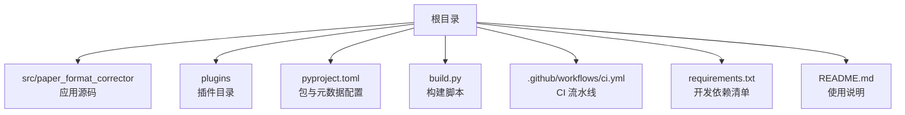
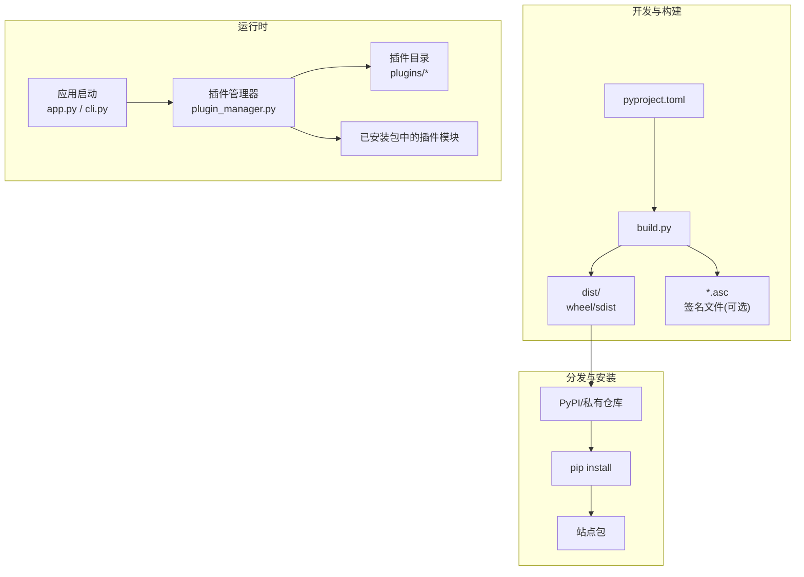
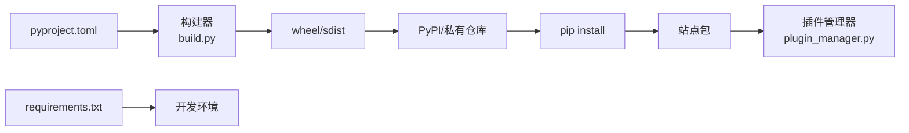

# 打包与分发

<cite>
**本文引用的文件**   
- [pyproject.toml](file://pyproject.toml)
- [build.py](file://build.py)
- [requirements.txt](file://requirements.txt)
- [.github/workflows/ci.yml](file://.github/workflows/ci.yml)
- [src/paper_format_corrector/__init__.py](file://src/paper_format_corrector/__init__.py)
- [src/paper_format_corrector/app.py](file://src/paper_format_corrector/app.py)
- [src/paper_format_corrector/cli.py](file://src/paper_format_corrector/cli.py)
- [src/paper_format_corrector/infra/plugin_manager.py](file://src/paper_format_corrector/infra/plugin_manager.py)
- [plugins/example_word_count_plugin.py](file://plugins/example_word_count_plugin.py)
- [README.md](file://README.md)
</cite>

## 目录
1. [简介](#简介)
2. [项目结构](#项目结构)
3. [核心组件](#核心组件)
4. [架构总览](#架构总览)
5. [详细组件分析](#详细组件分析)
6. [依赖关系分析](#依赖关系分析)
7. [性能考虑](#性能考虑)
8. [故障排查指南](#故障排查指南)
9. [结论](#结论)
10. [附录](#附录)

## 简介
本指南面向插件作者与维护者，提供从构建、打包到分发的完整操作说明。内容覆盖：
- 插件项目的结构与配置文件要求
- Python 包的打包方法与发布流程（含版本号管理与依赖声明）
- 插件安装方式（pip 安装、手动部署、自动发现机制）
- 插件市场或仓库的发布指南
- 版本兼容性与升级策略
- 插件文档编写规范与元数据定义
- 插件签名与安全验证
- 最佳实践与常见问题解决方案

## 项目结构
该仓库采用“应用 + 插件”的分层组织方式。核心应用位于 src 下，插件示例位于 plugins 目录；构建与发布相关配置集中在 pyproject.toml、build.py 与 CI 工作流中。

图表来源
- [pyproject.toml](file://pyproject.toml)
- [build.py](file://build.py)
- [.github/workflows/ci.yml](file://.github/workflows/ci.yml)
- [requirements.txt](file://requirements.txt)
- [README.md](file://README.md)

章节来源
- [pyproject.toml](file://pyproject.toml)
- [build.py](file://build.py)
- [.github/workflows/ci.yml](file://.github/workflows/ci.yml)
- [requirements.txt](file://requirements.txt)
- [README.md](file://README.md)

## 核心组件
- 包元数据与入口点：通过 pyproject.toml 声明包名、版本、描述、作者、许可证、Python 版本约束、依赖与可执行入口等。
- 构建脚本：build.py 用于生成标准 Python 包产物（wheel/sdist），并支持可选的签名步骤。
- 插件管理器：infra.plugin_manager 负责插件的发现、加载与生命周期管理。
- 插件示例：plugins/example_word_count_plugin.py 展示插件的最小实现与约定。
- CI 流水线：.github/workflows/ci.yml 集成测试、构建与发布任务。

章节来源
- [pyproject.toml](file://pyproject.toml)
- [build.py](file://build.py)
- [src/paper_format_corrector/infra/plugin_manager.py](file://src/paper_format_corrector/infra/plugin_manager.py)
- [plugins/example_word_count_plugin.py](file://plugins/example_word_count_plugin.py)
- [.github/workflows/ci.yml](file://.github/workflows/ci.yml)

## 架构总览
下图展示了从源码到可分发包再到运行时加载的关键路径。

图表来源
- [pyproject.toml](file://pyproject.toml)
- [build.py](file://build.py)
- [src/paper_format_corrector/app.py](file://src/paper_format_corrector/app.py)
- [src/paper_format_corrector/cli.py](file://src/paper_format_corrector/cli.py)
- [src/paper_format_corrector/infra/plugin_manager.py](file://src/paper_format_corrector/infra/plugin_manager.py)
- [plugins/example_word_count_plugin.py](file://plugins/example_word_count_plugin.py)

## 详细组件分析

### 包元数据与入口点（pyproject.toml）
- 作用：集中声明包名称、版本、描述、作者、许可证、Python 版本约束、依赖项、可执行入口点以及打包包含的文件范围。
- 建议：
  - 使用语义化版本号（主.次.修订）。
  - 明确指定 Python 最低版本与第三方依赖的版本范围。
  - 为 CLI 工具注册 entry_points，便于用户直接调用。
  - 将 README、LICENSE、requirements 等纳入 sdist。

章节来源
- [pyproject.toml](file://pyproject.toml)

### 构建脚本（build.py）
- 作用：封装标准构建流程，生成 wheel 与 sdist，并可触发签名与上传步骤。
- 关键能力：
  - 清理旧产物，确保构建干净。
  - 调用打包工具生成 dist 目录下的产物。
  - 可选：对产物进行签名，生成 .asc 文件。
  - 可选：将产物上传至 PyPI 或私有索引。

章节来源
- [build.py](file://build.py)

### 插件管理器（plugin_manager.py）
- 职责：
  - 扫描插件目录与已安装包中的插件模块。
  - 校验插件接口契约（如必需函数/类）。
  - 按需加载插件，暴露统一 API 供应用调用。
- 设计要点：
  - 插件发现路径可配置（本地目录与站点包）。
  - 错误隔离：单个插件异常不应影响其他插件。
  - 版本兼容性检查：根据元数据拒绝不兼容版本。

章节来源
- [src/paper_format_corrector/infra/plugin_manager.py](file://src/paper_format_corrector/infra/plugin_manager.py)

### 插件示例（example_word_count_plugin.py）
- 角色：演示最小可用插件的结构与约定。
- 建议约定：
  - 提供统一的元数据字段（名称、版本、描述、作者、许可证、兼容版本等）。
  - 暴露标准化的接口函数（如初始化、处理、销毁）。
  - 遵循命名空间与导入约定，避免与宿主冲突。

章节来源
- [plugins/example_word_count_plugin.py](file://plugins/example_word_count_plugin.py)

### 应用入口（app.py / cli.py）
- app.py：作为应用主程序，负责初始化子系统、加载配置与插件。
- cli.py：提供命令行入口，便于在终端直接运行与调试。
- 与插件的关系：启动时调用插件管理器完成插件发现与加载。

章节来源
- [src/paper_format_corrector/app.py](file://src/paper_format_corrector/app.py)
- [src/paper_format_corrector/cli.py](file://src/paper_format_corrector/cli.py)

### CI 流水线（.github/workflows/ci.yml）
- 作用：自动化测试、构建与发布。
- 典型阶段：
  - 设置 Python 环境，安装依赖。
  - 运行单元测试与集成测试。
  - 构建 wheel/sdist。
  - 可选：签名与上传至仓库。

章节来源
- [.github/workflows/ci.yml](file://.github/workflows/ci.yml)

### 开发依赖（requirements.txt）
- 作用：列出开发期所需的依赖（测试框架、代码质量工具等）。
- 建议：与运行时依赖分离，保持生产包精简。

章节来源
- [requirements.txt](file://requirements.txt)

## 依赖关系分析
- 构建期依赖：由 pyproject.toml 与 requirements.txt 共同决定。
- 运行期依赖：由 pyproject.toml 的依赖声明驱动 pip 解析与安装。
- 插件依赖：建议在插件自身元数据中声明其依赖，并在安装时一并拉取。

图表来源
- [pyproject.toml](file://pyproject.toml)
- [build.py](file://build.py)
- [requirements.txt](file://requirements.txt)
- [src/paper_format_corrector/infra/plugin_manager.py](file://src/paper_format_corrector/infra/plugin_manager.py)

章节来源
- [pyproject.toml](file://pyproject.toml)
- [requirements.txt](file://requirements.txt)

## 性能考虑
- 插件懒加载：仅在需要时加载插件，减少启动开销。
- 资源隔离：插件间共享状态需显式管理，避免内存泄漏。
- 依赖最小化：仅声明必要依赖，缩短安装与冷启动时间。
- 缓存策略：对模板、样式等静态资源进行缓存，提升重复运行效率。

## 故障排查指南
- 构建失败
  - 检查 Python 版本与 pyproject.toml 的约束是否匹配。
  - 确认依赖是否存在且可解析。
  - 查看构建日志定位具体错误。
- 安装失败
  - 核对网络与镜像源配置。
  - 检查权限与虚拟环境隔离。
  - 若启用签名验证，确认证书链有效。
- 插件未加载
  - 确认插件目录是否在扫描路径内。
  - 检查插件元数据与接口是否符合约定。
  - 查看插件管理器日志，定位异常堆栈。

章节来源
- [src/paper_format_corrector/infra/plugin_manager.py](file://src/paper_format_corrector/infra/plugin_manager.py)

## 结论
通过规范的元数据声明、稳定的构建脚本与清晰的插件接口约定，可实现高质量的插件打包与分发。结合 CI 自动化与签名验证，能显著提升交付质量与安全性。

## 附录

### 插件项目结构与配置文件要求
- 推荐结构
  - 插件根目录包含元数据文件（名称、版本、描述、作者、许可证、兼容版本等）。
  - 源代码按功能模块划分，避免全局污染。
  - 提供 README 与变更日志，记录重要更新。
- 配置文件要求
  - 元数据字段应完整且一致，便于自动发现与校验。
  - 依赖声明需精确到最小兼容范围。

章节来源
- [plugins/example_word_count_plugin.py](file://plugins/example_word_count_plugin.py)

### Python 包打包方法与发布流程
- 打包方法
  - 使用标准构建工具生成 wheel 与 sdist。
  - 可选择对产物进行数字签名。
- 发布流程
  - 本地构建与测试通过后，推送到 PyPI 或私有仓库。
  - 在 CI 中集成构建与发布任务，保证一致性。

章节来源
- [build.py](file://build.py)
- [.github/workflows/ci.yml](file://.github/workflows/ci.yml)

### 版本号管理与依赖声明
- 版本号
  - 采用语义化版本（主.次.修订），重大变更递增主版本。
  - 在构建前统一更新版本号，确保产物与标签一致。
- 依赖声明
  - 在包元数据中声明运行期依赖。
  - 插件元数据中声明插件专属依赖，避免宿主污染。

章节来源
- [pyproject.toml](file://pyproject.toml)

### 插件安装方式
- pip 安装
  - 从 PyPI 或私有仓库安装，自动解析依赖。
- 手动部署
  - 将插件目录加入扫描路径，或通过可编辑模式安装。
- 自动发现机制
  - 插件管理器按约定路径扫描本地目录与站点包中的插件模块。

章节来源
- [src/paper_format_corrector/infra/plugin_manager.py](file://src/paper_format_corrector/infra/plugin_manager.py)

### 插件市场或仓库发布指南
- 准备
  - 完善元数据与文档，确保可读性与可维护性。
  - 通过 CI 完成自动化构建与测试。
- 发布
  - 推送至 PyPI 或私有索引，必要时附加签名文件。
  - 在仓库页面发布版本说明与下载链接。

章节来源
- [.github/workflows/ci.yml](file://.github/workflows/ci.yml)

### 版本兼容性与升级策略
- 兼容性矩阵
  - 明确支持的 Python 版本与宿主版本范围。
- 升级策略
  - 小版本增量修复，大版本引入破坏性变更。
  - 提供迁移指南与弃用提示。

章节来源
- [pyproject.toml](file://pyproject.toml)

### 插件文档编写规范与元数据定义
- 文档规范
  - 提供快速开始、API 参考、配置说明与示例。
  - 使用一致的术语与格式，便于检索与维护。
- 元数据定义
  - 至少包含：名称、版本、描述、作者、许可证、兼容版本、依赖列表。

章节来源
- [plugins/example_word_count_plugin.py](file://plugins/example_word_count_plugin.py)

### 插件签名与安全验证
- 签名
  - 使用可信密钥对构建产物进行签名，生成 .asc 文件。
- 验证
  - 安装前校验签名，确保来源可信与完整性。
  - 在 CI 中集成签名与验证步骤。

章节来源
- [build.py](file://build.py)

### 最佳实践与常见问题
- 最佳实践
  - 严格隔离插件命名空间，避免冲突。
  - 使用最小权限原则访问系统资源。
  - 提供详尽的错误信息与日志。
- 常见问题
  - 依赖冲突：通过依赖范围与虚拟环境隔离解决。
  - 插件加载失败：检查元数据与接口约定。
  - 签名验证失败：确认证书链与时间戳有效性。

章节来源
- [src/paper_format_corrector/infra/plugin_manager.py](file://src/paper_format_corrector/infra/plugin_manager.py)
- [build.py](file://build.py)