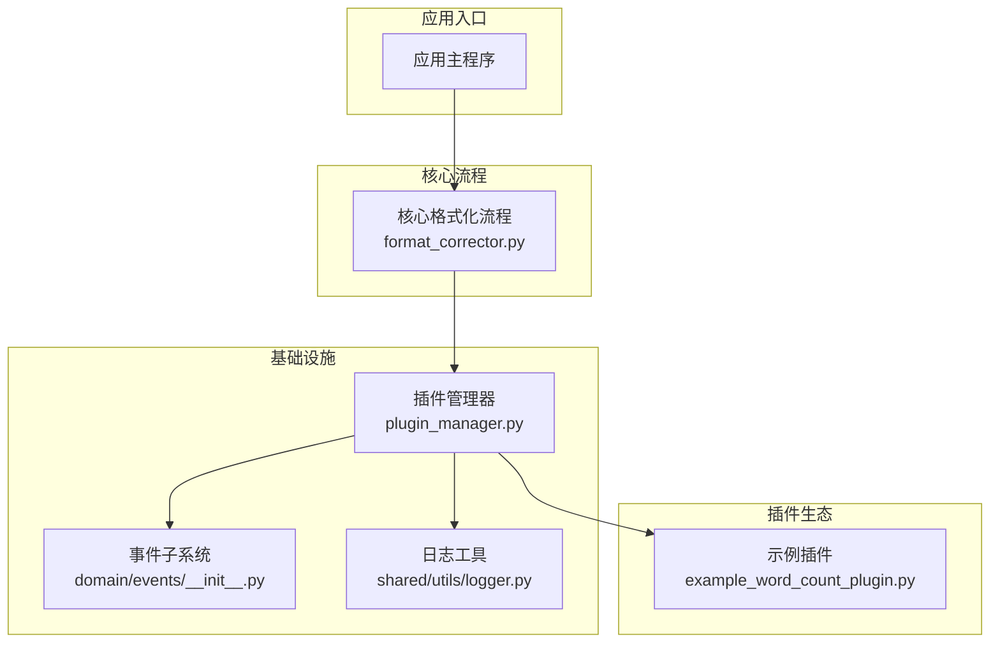
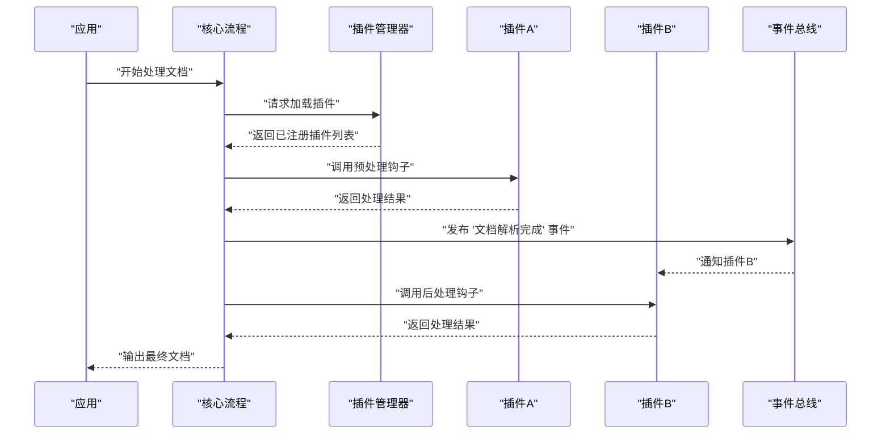
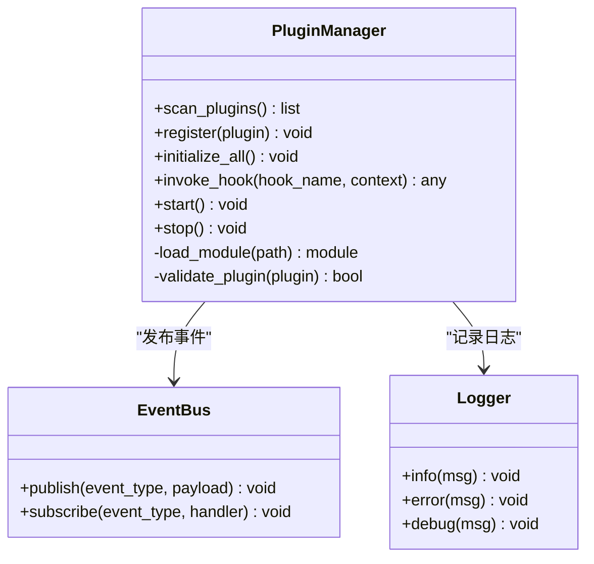
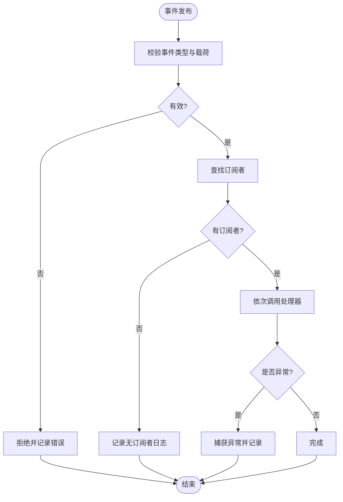
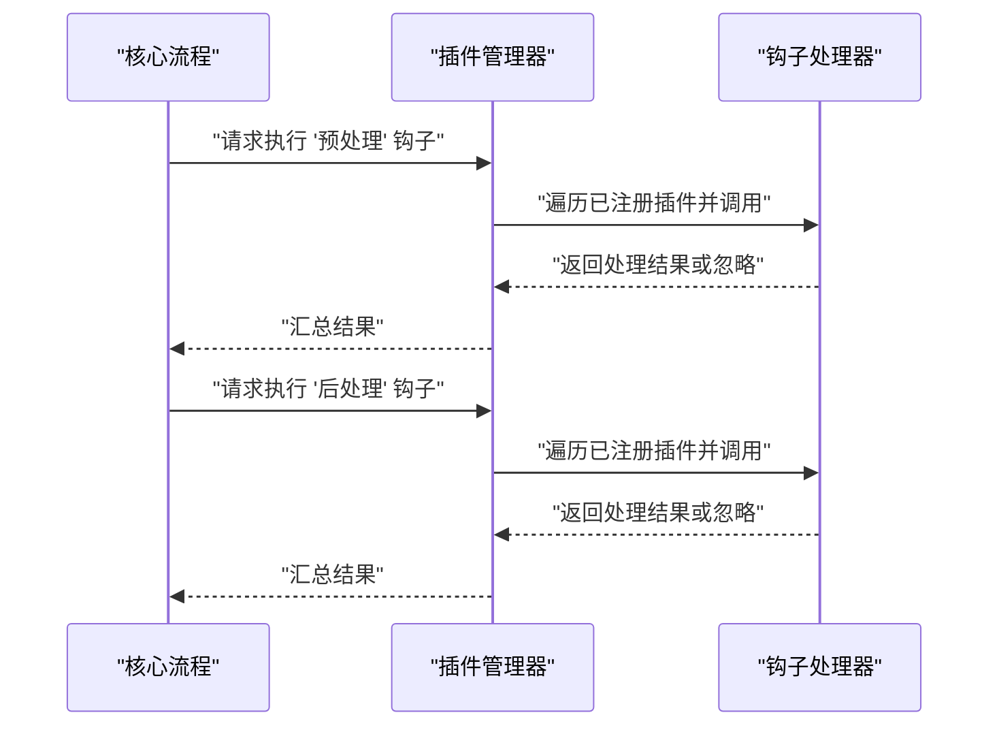
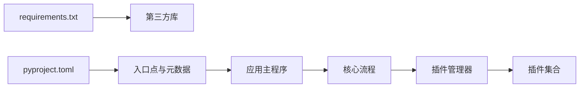

# 插件开发指南

<cite>
**本文引用的文件**   
- [src/paper_format_corrector/infra/plugin_manager.py](file://src/paper_format_corrector/infra/plugin_manager.py)
- [plugins/example_word_count_plugin.py](file://plugins/example_word_count_plugin.py)
- [src/paper_format_corrector/core/format_corrector.py](file://src/paper_format_corrector/core/format_corrector.py)
- [src/paper_format_corrector/domain/events/__init__.py](file://src/paper_format_corrector/domain/events/__init__.py)
- [src/paper_format_corrector/shared/utils/logger.py](file://src/paper_format_corrector/shared/utils/logger.py)
- [tests/test_task_queue.py](file://tests/test_task_queue.py)
- [requirements.txt](file://requirements.txt)
- [pyproject.toml](file://pyproject.toml)
</cite>

## 目录
1. [简介](#简介)
2. [项目结构](#项目结构)
3. [核心组件](#核心组件)
4. [架构总览](#架构总览)
5. [详细组件分析](#详细组件分析)
6. [依赖分析](#依赖分析)
7. [性能考虑](#性能考虑)
8. [故障排查指南](#故障排查指南)
9. [结论](#结论)
10. [附录](#附录)

## 简介
本指南面向希望为“论文格式矫正工具”扩展能力的开发者，系统阐述插件架构的设计原理、扩展点机制与生命周期管理，并提供从环境搭建到打包分发的完整实践路径。文档覆盖：
- 插件注册与发现机制
- 钩子点与事件处理模式
- 插件加载、初始化、执行与卸载流程
- 从简单文本处理到复杂文档分析的插件开发教程
- 测试框架与调试技巧
- 打包、分发与版本管理最佳实践
- 实际示例与代码模板（以仓库现有示例为基础）

## 项目结构
本项目采用分层与领域驱动相结合的组织方式，插件相关能力集中在基础设施层与示例插件目录中：
- 插件管理器位于基础设施层，负责插件的发现、注册、生命周期管理与调度
- 示例插件位于 plugins 目录，展示最小可用实现
- 核心格式化流程在 core 层，插件通过扩展点接入
- 事件子系统在 domain.events 下，用于解耦插件间通信
- 日志工具在 shared.utils.logger 下，便于插件输出诊断信息
- 任务队列与并发模型参考 tests/test_task_queue.py 中的用法

图表来源
- [src/paper_format_corrector/core/format_corrector.py](file://src/paper_format_corrector/core/format_corrector.py)
- [src/paper_format_corrector/infra/plugin_manager.py](file://src/paper_format_corrector/infra/plugin_manager.py)
- [src/paper_format_corrector/domain/events/__init__.py](file://src/paper_format_corrector/domain/events/__init__.py)
- [src/paper_format_corrector/shared/utils/logger.py](file://src/paper_format_corrector/shared/utils/logger.py)
- [plugins/example_word_count_plugin.py](file://plugins/example_word_count_plugin.py)

章节来源
- [src/paper_format_corrector/core/format_corrector.py](file://src/paper_format_corrector/core/format_corrector.py)
- [src/paper_format_corrector/infra/plugin_manager.py](file://src/paper_format_corrector/infra/plugin_manager.py)
- [plugins/example_word_count_plugin.py](file://plugins/example_word_count_plugin.py)

## 核心组件
- 插件管理器：提供插件的扫描、注册、生命周期控制、钩子派发与错误隔离
- 事件子系统：定义事件类型与发布订阅接口，支持插件间异步通信
- 日志工具：统一日志级别与输出目标，便于插件诊断
- 示例插件：演示最小实现，包括元数据声明、钩子注册与处理逻辑

章节来源
- [src/paper_format_corrector/infra/plugin_manager.py](file://src/paper_format_corrector/infra/plugin_manager.py)
- [src/paper_format_corrector/domain/events/__init__.py](file://src/paper_format_corrector/domain/events/__init__.py)
- [src/paper_format_corrector/shared/utils/logger.py](file://src/paper_format_corrector/shared/utils/logger.py)
- [plugins/example_word_count_plugin.py](file://plugins/example_word_count_plugin.py)

## 架构总览
插件体系围绕“可扩展的核心流程 + 可插拔的处理单元”构建。核心流程在关键阶段触发钩子，插件管理器将对应钩子回调派发给已注册的插件实例；事件子系统用于跨模块通知，如统计上报、审计记录等。

图表来源
- [src/paper_format_corrector/core/format_corrector.py](file://src/paper_format_corrector/core/format_corrector.py)
- [src/paper_format_corrector/infra/plugin_manager.py](file://src/paper_format_corrector/infra/plugin_manager.py)
- [src/paper_format_corrector/domain/events/__init__.py](file://src/paper_format_corrector/domain/events/__init__.py)

## 详细组件分析

### 插件管理器（PluginManager）
职责
- 插件发现与加载：按约定路径或配置扫描插件模块并导入
- 插件注册：收集插件元数据、钩子映射与能力声明
- 生命周期管理：启动、初始化、运行、停止与卸载
- 钩子派发：根据事件或阶段名称路由到具体插件回调
- 错误隔离：捕获插件异常，避免影响核心流程

设计要点
- 使用统一的插件接口契约（例如元数据、钩子签名、状态字段）
- 支持并行加载与按需初始化，减少冷启动开销
- 提供健康检查与回滚策略，确保稳定性

图表来源
- [src/paper_format_corrector/infra/plugin_manager.py](file://src/paper_format_corrector/infra/plugin_manager.py)
- [src/paper_format_corrector/domain/events/__init__.py](file://src/paper_format_corrector/domain/events/__init__.py)
- [src/paper_format_corrector/shared/utils/logger.py](file://src/paper_format_corrector/shared/utils/logger.py)

章节来源
- [src/paper_format_corrector/infra/plugin_manager.py](file://src/paper_format_corrector/infra/plugin_manager.py)

### 事件子系统（Event Bus）
职责
- 定义事件类型与载荷结构
- 提供发布/订阅接口，支持同步与异步回调
- 保证事件处理的幂等性与顺序性（可选）

典型事件
- 文档解析完成
- 样式提取完成
- 质量评分生成
- 导出完成

图表来源
- [src/paper_format_corrector/domain/events/__init__.py](file://src/paper_format_corrector/domain/events/__init__.py)

章节来源
- [src/paper_format_corrector/domain/events/__init__.py](file://src/paper_format_corrector/domain/events/__init__.py)

### 示例插件（Word Count Plugin）
说明
- 展示插件的最小实现：元数据声明、钩子注册、处理逻辑
- 可作为文本处理类插件的模板

建议遵循
- 明确插件能力边界，避免侵入核心数据结构
- 使用事件进行跨模块协作
- 输出结构化日志，便于追踪

章节来源
- [plugins/example_word_count_plugin.py](file://plugins/example_word_count_plugin.py)

### 核心流程集成（Format Corrector）
说明
- 核心流程在关键阶段调用插件管理器，触发相应钩子
- 插件可在预处理、后处理、导出前等阶段介入

图表来源
- [src/paper_format_corrector/core/format_corrector.py](file://src/paper_format_corrector/core/format_corrector.py)
- [src/paper_format_corrector/infra/plugin_manager.py](file://src/paper_format_corrector/infra/plugin_manager.py)

章节来源
- [src/paper_format_corrector/core/format_corrector.py](file://src/paper_format_corrector/core/format_corrector.py)
- [src/paper_format_corrector/infra/plugin_manager.py](file://src/paper_format_corrector/infra/plugin_manager.py)

## 依赖分析
- 运行时依赖：参见 requirements.txt
- 包元数据与入口点：参见 pyproject.toml
- 插件与核心模块耦合度低，主要通过插件管理器与事件总线交互

图表来源
- [requirements.txt](file://requirements.txt)
- [pyproject.toml](file://pyproject.toml)

章节来源
- [requirements.txt](file://requirements.txt)
- [pyproject.toml](file://pyproject.toml)

## 性能考虑
- 插件加载：采用延迟加载与缓存，避免重复导入
- 钩子派发：批量合并上下文，减少多次往返
- 事件处理：对耗时操作使用异步队列，避免阻塞主流程
- 资源清理：在插件卸载时释放文件句柄、网络连接与内存占用
- 监控指标：统计各插件执行时间与失败率，辅助优化

[本节为通用指导，不直接分析具体文件]

## 故障排查指南
常见问题与定位方法
- 插件未加载：检查插件路径与命名规范，确认扫描规则
- 钩子未触发：核对钩子名称与注册映射，查看日志
- 事件未消费：确认订阅者是否正确注册，检查事件类型匹配
- 异常导致崩溃：启用插件错误隔离，查看堆栈与上下文日志
- 性能问题：采集插件耗时分布，识别热点路径

实用技巧
- 使用日志工具输出结构化信息，包含插件ID、钩子名、输入摘要与耗时
- 借助任务队列测试框架进行并发与压力测试
- 在本地启用调试模式，逐步断点验证插件行为

章节来源
- [src/paper_format_corrector/shared/utils/logger.py](file://src/paper_format_corrector/shared/utils/logger.py)
- [tests/test_task_queue.py](file://tests/test_task_queue.py)

## 结论
通过清晰的插件接口、完善的生命周期管理与事件驱动机制，本项目的插件体系具备良好的可扩展性与稳定性。开发者可基于现有示例快速上手，并在核心流程的关键阶段安全地注入自定义逻辑。结合日志与测试手段，能够高效定位问题并持续优化性能。

[本节为总结性内容，不直接分析具体文件]

## 附录

### 开发环境搭建
- 安装依赖：使用 requirements.txt 安装运行时依赖
- 配置包元数据：参考 pyproject.toml 设置包名、版本与入口点
- 创建插件目录：在 plugins 下新建插件模块，遵循命名与结构约定
- 启用调试：在日志工具中开启调试级别，输出详细上下文

章节来源
- [requirements.txt](file://requirements.txt)
- [pyproject.toml](file://pyproject.toml)

### 插件生命周期管理
- 加载：扫描插件目录，导入模块并校验元数据
- 初始化：准备资源、建立连接、注册钩子与事件订阅
- 执行：在核心流程各阶段被调用，处理业务逻辑
- 卸载：释放资源、取消订阅、清理临时文件

章节来源
- [src/paper_format_corrector/infra/plugin_manager.py](file://src/paper_format_corrector/infra/plugin_manager.py)

### 插件注册机制与钩子点
- 注册：在插件模块中声明元数据与钩子映射
- 钩子：在核心流程中定义钩子名称与上下文结构
- 派发：插件管理器根据钩子名称路由到对应处理器

章节来源
- [src/paper_format_corrector/infra/plugin_manager.py](file://src/paper_format_corrector/infra/plugin_manager.py)
- [src/paper_format_corrector/core/format_corrector.py](file://src/paper_format_corrector/core/format_corrector.py)

### 事件处理模式
- 发布：在关键节点发布事件，携带必要载荷
- 订阅：插件订阅感兴趣的事件类型
- 处理：在处理器中执行业务逻辑，必要时再次发布下游事件

章节来源
- [src/paper_format_corrector/domain/events/__init__.py](file://src/paper_format_corrector/domain/events/__init__.py)

### 插件开发教程（从简单到复杂）
- 简单文本处理插件：基于示例插件模板，实现文本统计与报告输出
- 复杂文档分析插件：结合事件总线与外部服务，实现深度分析与可视化

章节来源
- [plugins/example_word_count_plugin.py](file://plugins/example_word_count_plugin.py)

### 测试框架与调试技巧
- 单元测试：针对插件钩子与事件处理器编写用例
- 集成测试：模拟核心流程，端到端验证插件行为
- 调试技巧：使用日志与断点，逐步定位问题根因

章节来源
- [tests/test_task_queue.py](file://tests/test_task_queue.py)

### 打包、分发与版本管理
- 打包：使用 pyproject.toml 配置构建脚本与产物
- 分发：生成可安装包或轮子，上传至内部仓库
- 版本管理：遵循语义化版本，记录变更日志与兼容性矩阵

章节来源
- [pyproject.toml](file://pyproject.toml)