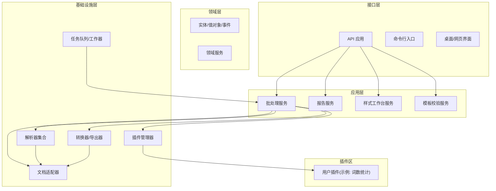
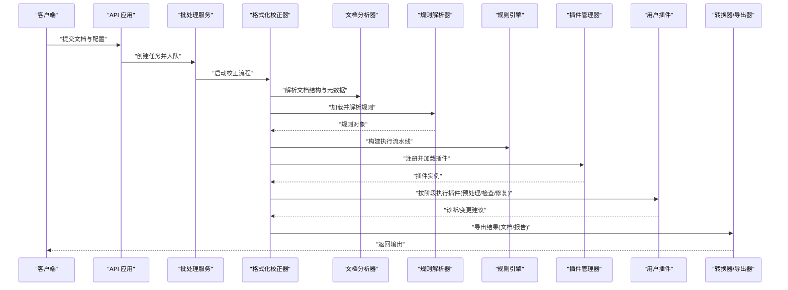
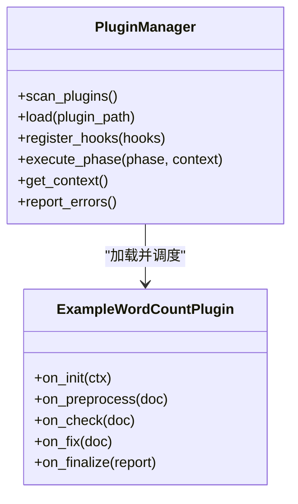
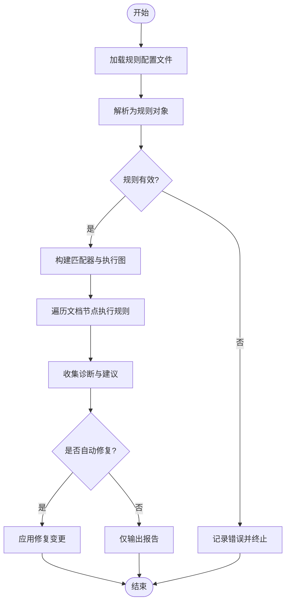
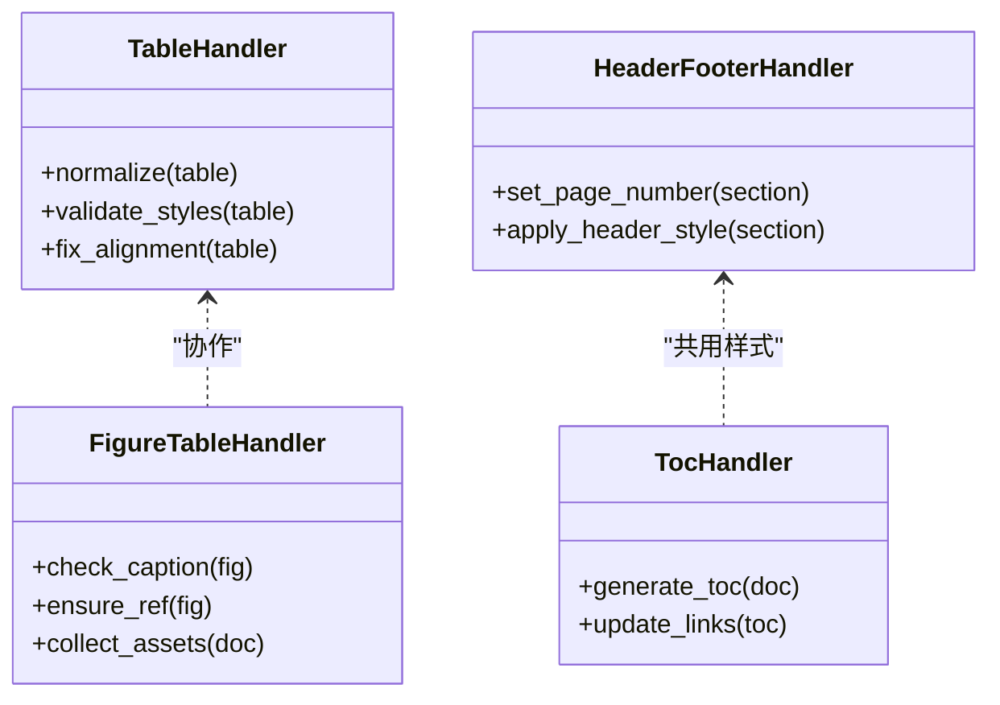
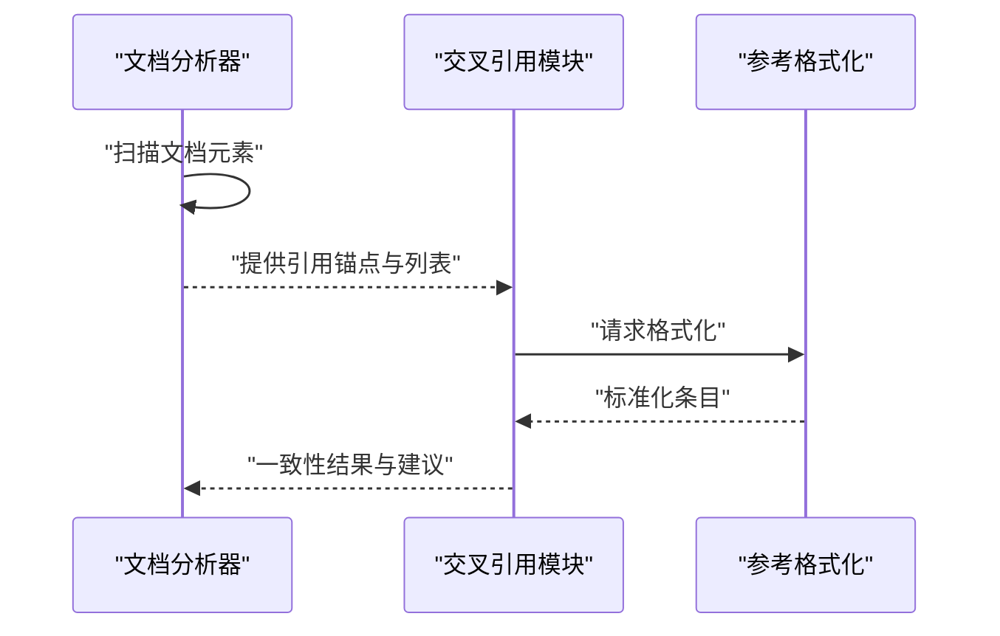
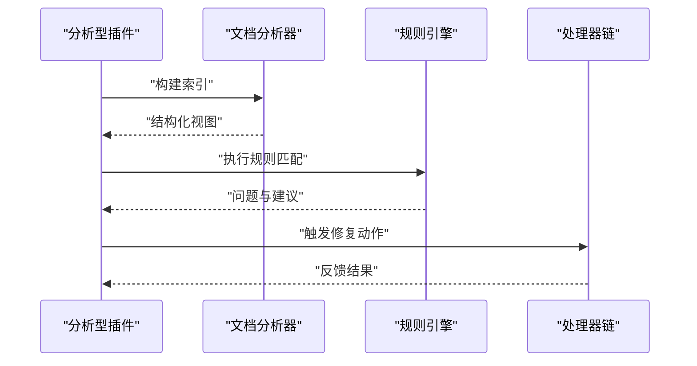
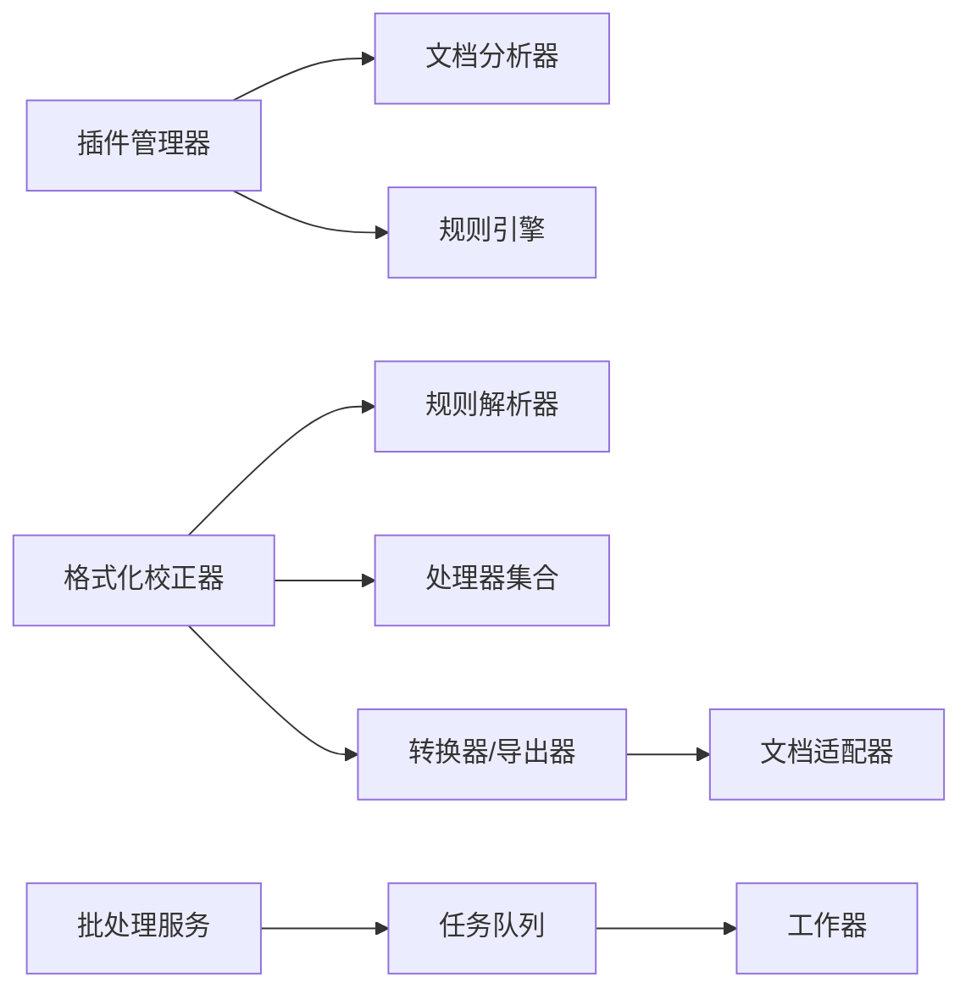

# 实战案例集

<cite>
**本文引用的文件**   
- [README.md](file://README.md)
- [plugins/example_word_count_plugin.py](file://plugins/example_word_count_plugin.py)
- [src/paper_format_corrector/infra/plugin_manager.py](file://src/paper_format_corrector/infra/plugin_manager.py)
- [src/paper_format_corrector/core/format_corrector.py](file://src/paper_format_corrector/core/format_corrector.py)
- [src/paper_format_corrector/infrastructure/parsers/rule_parser.py](file://src/paper_format_corrector/infrastructure/parsers/rule_parser.py)
- [src/paper_format_corrector/quality/rule_engine.py](file://src/paper_format_corrector/quality/rule_engine.py)
- [src/paper_format_corrector/handlers/table_handler.py](file://src/paper_format_corrector/handlers/table_handler.py)
- [src/paper_format_corrector/handlers/figure_table_handler.py](file://src/paper_format_corrector/handlers/figure_table_handler.py)
- [src/paper_format_corrector/handlers/header_footer_handler.py](file://src/paper_format_corrector/handlers/header_footer_handler.py)
- [src/paper_format_corrector/handlers/toc_handler.py](file://src/paper_format_corrector/handlers/toc_handler.py)
- [src/paper_format_corrector/infrastructure/parsers/document_analyzer.py](file://src/paper_format_corrector/infrastructure/parsers/document_analyzer.py)
- [src/paper_format_corrector/infrastructure/parsers/cross_reference.py](file://src/paper_format_corrector/infrastructure/parsers/cross_reference.py)
- [src/paper_format_corrector/infrastructure/parsers/reference_formatter.py](file://src/paper_format_corrector/infrastructure/parsers/reference_formatter.py)
- [src/paper_format_corrector/infrastructure/parsers/section_parser.py](file://src/paper_format_corrector/infrastructure/parsers/section_parser.py)
- [src/paper_format_corrector/infrastructure/parsers/requirement_parser.py](file://src/paper_format_corrector/infrastructure/parsers/requirement_parser.py)
- [src/paper_format_corrector/infrastructure/parsers/model_discovery.py](file://src/paper_format_corrector/infrastructure/parsers/model_discovery.py)
- [src/paper_format_corrector/infrastructure/parsers/pdf_style_extractor.py](file://src/paper_format_corrector/infrastructure/parsers/pdf_style_extractor.py)
- [src/paper_format_corrector/infrastructure/parsers/ref_auto_complete.py](file://src/paper_format_corrector/infrastructure/parsers/ref_auto_complete.py)
- [src/paper_format_corrector/infrastructure/parsers/ai_doc_generator.py](file://src/paper_format_corrector/infrastructure/parsers/ai_doc_generator.py)
- [src/paper_format_corrector/infrastructure/parsers/llm_parser.py](file://src/paper_format_corrector/infrastructure/parsers/llm_parser.py)
- [src/paper_format_corrector/infrastructure/parsers/section_types.py](file://src/paper_format_corrector/infrastructure/parsers/section_types.py)
- [src/paper_format_corrector/infrastructure/parsers/modules/](file://src/paper_format_corrector/infrastructure/parsers/modules/)
- [src/paper_format_corrector/infrastructure/adapters/docx_adapter.py](file://src/paper_format_corrector/infrastructure/adapters/docx_adapter.py)
- [src/paper_format_corrector/infrastructure/converters/file_converter.py](file://src/paper_format_corrector/infrastructure/converters/file_converter.py)
- [src/paper_format_corrector/infrastructure/converters/file_formatter.py](file://src/paper_format_corrector/infrastructure/converters/file_formatter.py)
- [src/paper_format_corrector/infrastructure/converters/latex_exporter.py](file://src/paper_format_corrector/infrastructure/converters/latex_exporter.py)
- [src/paper_format_corrector/infrastructure/exporters/format_exporter.py](file://src/paper_format_corrector/infrastructure/exporters/format_exporter.py)
- [src/paper_format_corrector/infrastructure/generators/cover_generator.py](file://src/paper_format_corrector/infrastructure/generators/cover_generator.py)
- [src/paper_format_corrector/infrastructure/handlers/image_handler.py](file://src/paper_format_corrector/infrastructure/handlers/image_handler.py)
- [src/paper_format_corrector/infrastructure/handlers/table_handler.py](file://src/paper_format_corrector/infrastructure/handlers/table_handler.py)
- [src/paper_format_corrector/infrastructure/handlers/figure_table_handler.py](file://src/paper_format_corrector/infrastructure/handlers/figure_table_handler.py)
- [src/paper_format_corrector/infrastructure/handlers/header_footer_handler.py](file://src/paper_format_corrector/infrastructure/handlers/header_footer_handler.py)
- [src/paper_format_corrector/infrastructure/handlers/toc_handler.py](file://src/paper_format_corrector/infrastructure/handlers/toc_handler.py)
- [src/paper_format_corrector/infrastructure/queue/task_queue.py](file://src/paper_format_corrector/infrastructure/queue/task_queue.py)
- [src/paper_format_corrector/infrastructure/queue/worker.py](file://src/paper_format_corrector/infrastructure/queue/worker.py)
- [src/paper_format_corrector/shared/utils/](file://src/paper_format_corrector/shared/utils/)
- [src/paper_format_corrector/shared/constants/](file://src/paper_format_corrector/shared/constants/)
- [src/paper_format_corrector/domain/entities/](file://src/paper_format_corrector/domain/entities/)
- [src/paper_format_corrector/domain/events/](file://src/paper_format_corrector/domain/events/)
- [src/paper_format_corrector/domain/services/](file://src/paper_format_corrector/domain/services/)
- [src/paper_format_corrector/domain/value_objects/](file://src/paper_format_corrector/domain/value_objects/)
- [src/paper_format_corrector/application/services/batch_service.py](file://src/paper_format_corrector/application/services/batch_service.py)
- [src/paper_format_corrector/application/services/report_service.py](file://src/paper_format_corrector/application/services/report_service.py)
- [src/paper_format_corrector/application/services/style_workbench.py](file://src/paper_format_corrector/application/services/style_workbench.py)
- [src/paper_format_corrector/application/services/template_validation.py](file://src/paper_format_corrector/application/services/template_validation.py)
- [src/paper_format_corrector/application/services/template_validation_service.py](file://src/paper_format_corrector/application/services/template_validation_service.py)
- [src/paper_format_corrector/application/services/university_template_import_service.py](file://src/paper_format_corrector/application/services/university_template_import_service.py)
- [src/paper_format_corrector/api/app.py](file://src/paper_format_corrector/api/app.py)
- [src/paper_format_corrector/api/client.py](file://src/paper_format_corrector/api/client.py)
- [src/paper_format_corrector/cli.py](file://src/paper_format_corrector/cli.py)
- [src/paper_format_corrector/app.py](file://src/paper_format_corrector/app.py)
- [src/paper_format_corrector/__main__.py](file://src/paper_format_corrector/__main__.py)
- [presets/templates_index.yaml](file://presets/templates_index.yaml)
- [examples/sample_template.yaml](file://examples/sample_template.yaml)
- [config/config.yaml](file://config/config.yaml)
</cite>

## 目录
1. [简介](#简介)
2. [项目结构](#项目结构)
3. [核心组件](#核心组件)
4. [架构总览](#架构总览)
5. [详细组件分析](#详细组件分析)
6. [依赖分析](#依赖分析)
7. [性能考虑](#性能考虑)
8. [故障排查指南](#故障排查指南)
9. [结论](#结论)
10. [附录](#附录)

## 简介
本实战案例集面向希望基于“论文格式矫正工具”进行插件开发的工程师与研究者，提供从简单到复杂的完整开发路径。内容涵盖：
- 文本统计类插件（入门）
- 格式检查类插件（进阶）
- 文档分析与规则引擎集成（高级）
- 图表、表格、公式、引用等复杂元素的处理策略
- 自定义规则引擎的实现方法（定义、匹配、执行）
- 常见业务场景模板（学术规范检查、格式一致性验证、内容质量评估）

读者将学会如何编写可插拔的插件，将其接入系统工作流，并通过配置化规则驱动文档处理流程。

## 项目结构
仓库采用分层与领域驱动相结合的组织方式：
- 应用层：服务编排、批处理、报告生成、模板校验
- 领域层：实体、事件、值对象、领域服务
- 基础设施层：解析器、转换器、导出器、适配器、队列、外部工具
- 接口层：API、CLI、桌面端、Web
- 插件扩展点：通过插件管理器加载用户脚本，注入到处理管线

图示来源
- [src/paper_format_corrector/api/app.py](file://src/paper_format_corrector/api/app.py)
- [src/paper_format_corrector/application/services/batch_service.py](file://src/paper_format_corrector/application/services/batch_service.py)
- [src/paper_format_corrector/infra/plugin_manager.py](file://src/paper_format_corrector/infra/plugin_manager.py)
- [src/paper_format_corrector/infrastructure/parsers/document_analyzer.py](file://src/paper_format_corrector/infrastructure/parsers/document_analyzer.py)
- [src/paper_format_corrector/infrastructure/converters/file_converter.py](file://src/paper_format_corrector/infrastructure/converters/file_converter.py)
- [src/paper_format_corrector/infrastructure/adapters/docx_adapter.py](file://src/paper_format_corrector/infrastructure/adapters/docx_adapter.py)

章节来源
- [README.md](file://README.md)
- [src/paper_format_corrector/api/app.py](file://src/paper_format_corrector/api/app.py)
- [src/paper_format_corrector/application/services/batch_service.py](file://src/paper_format_corrector/application/services/batch_service.py)
- [src/paper_format_corrector/infra/plugin_manager.py](file://src/paper_format_corrector/infra/plugin_manager.py)

## 核心组件
- 插件管理器：负责发现、加载、注册和调度用户插件，支持生命周期钩子与上下文注入。
- 格式化校正器：编排文档解析、规则匹配、修改与导出，串联各处理器与转换器。
- 规则解析器与规则引擎：将 YAML/JSON 规则声明转换为可执行规则，并提供匹配算法与执行流水线。
- 文档处理器：针对段落、表格、图表、页眉页脚、目录等元素的专用处理逻辑。
- 文档分析器：抽取文档结构、元数据、交叉引用、模型信息，为规则与插件提供上下文。
- 转换器与导出器：在 docx、PDF、LaTeX 等格式间转换与导出结果。
- 任务队列与工作器：异步执行耗时任务，提升吞吐与稳定性。

章节来源
- [src/paper_format_corrector/infra/plugin_manager.py](file://src/paper_format_corrector/infra/plugin_manager.py)
- [src/paper_format_corrector/core/format_corrector.py](file://src/paper_format_corrector/core/format_corrector.py)
- [src/paper_format_corrector/infrastructure/parsers/rule_parser.py](file://src/paper_format_corrector/infrastructure/parsers/rule_parser.py)
- [src/paper_format_corrector/quality/rule_engine.py](file://src/paper_format_corrector/quality/rule_engine.py)
- [src/paper_format_corrector/handlers/table_handler.py](file://src/paper_format_corrector/handlers/table_handler.py)
- [src/paper_format_corrector/handlers/figure_table_handler.py](file://src/paper_format_corrector/handlers/figure_table_handler.py)
- [src/paper_format_corrector/handlers/header_footer_handler.py](file://src/paper_format_corrector/handlers/header_footer_handler.py)
- [src/paper_format_corrector/handlers/toc_handler.py](file://src/paper_format_corrector/handlers/toc_handler.py)
- [src/paper_format_corrector/infrastructure/parsers/document_analyzer.py](file://src/paper_format_corrector/infrastructure/parsers/document_analyzer.py)
- [src/paper_format_corrector/infrastructure/converters/file_converter.py](file://src/paper_format_corrector/infrastructure/converters/file_converter.py)
- [src/paper_format_corrector/infrastructure/converters/latex_exporter.py](file://src/paper_format_corrector/infrastructure/converters/latex_exporter.py)
- [src/paper_format_corrector/infrastructure/queue/task_queue.py](file://src/paper_format_corrector/infrastructure/queue/task_queue.py)
- [src/paper_format_corrector/infrastructure/queue/worker.py](file://src/paper_format_corrector/infrastructure/queue/worker.py)

## 架构总览
下图展示从 API 调用到插件执行的端到端流程，包括规则解析、文档分析、处理器链与导出。

图示来源
- [src/paper_format_corrector/api/app.py](file://src/paper_format_corrector/api/app.py)
- [src/paper_format_corrector/application/services/batch_service.py](file://src/paper_format_corrector/application/services/batch_service.py)
- [src/paper_format_corrector/core/format_corrector.py](file://src/paper_format_corrector/core/format_corrector.py)
- [src/paper_format_corrector/infrastructure/parsers/document_analyzer.py](file://src/paper_format_corrector/infrastructure/parsers/document_analyzer.py)
- [src/paper_format_corrector/infrastructure/parsers/rule_parser.py](file://src/paper_format_corrector/infrastructure/parsers/rule_parser.py)
- [src/paper_format_corrector/quality/rule_engine.py](file://src/paper_format_corrector/quality/rule_engine.py)
- [src/paper_format_corrector/infra/plugin_manager.py](file://src/paper_format_corrector/infra/plugin_manager.py)
- [src/paper_format_corrector/infrastructure/converters/file_converter.py](file://src/paper_format_corrector/infrastructure/converters/file_converter.py)

## 详细组件分析

### 插件管理器与插件生命周期
- 职责：扫描插件目录、动态导入、注册钩子、维护上下文、错误隔离与重试。
- 关键能力：
  - 插件发现与版本兼容检查
  - 生命周期回调（初始化、预处理、检查、修复、收尾）
  - 上下文注入（文档对象、配置、日志、队列）
  - 插件间通信与事件总线

图示来源
- [src/paper_format_corrector/infra/plugin_manager.py](file://src/paper_format_corrector/infra/plugin_manager.py)
- [plugins/example_word_count_plugin.py](file://plugins/example_word_count_plugin.py)

章节来源
- [src/paper_format_corrector/infra/plugin_manager.py](file://src/paper_format_corrector/infra/plugin_manager.py)
- [plugins/example_word_count_plugin.py](file://plugins/example_word_count_plugin.py)

### 规则解析器与规则引擎
- 规则解析器：读取 YAML/JSON 规则，校验语法，构建 AST 或中间表示。
- 规则引擎：将规则映射为匹配函数，组织执行顺序，支持短路、聚合与副作用。
- 典型规则类型：
  - 文本模式匹配（正则/关键词）
  - 结构约束（标题层级、编号序列）
  - 跨段/跨表一致性（单位、术语）
  - 引用与交叉引用完整性

图示来源
- [src/paper_format_corrector/infrastructure/parsers/rule_parser.py](file://src/paper_format_corrector/infrastructure/parsers/rule_parser.py)
- [src/paper_format_corrector/quality/rule_engine.py](file://src/paper_format_corrector/quality/rule_engine.py)

章节来源
- [src/paper_format_corrector/infrastructure/parsers/rule_parser.py](file://src/paper_format_corrector/infrastructure/parsers/rule_parser.py)
- [src/paper_format_corrector/quality/rule_engine.py](file://src/paper_format_corrector/quality/rule_engine.py)

### 文档处理器（表格、图表、页眉页脚、目录）
- 表格处理器：统一列宽、对齐、标题行样式、合并单元格校验、跨页断行提示。
- 图表处理器：图片分辨率、命名规范、题注位置、引用一致性。
- 页眉页脚处理器：奇偶页差异、页码格式、学校/机构标识。
- 目录处理器：自动生成、更新、超链接有效性。

图示来源
- [src/paper_format_corrector/handlers/table_handler.py](file://src/paper_format_corrector/handlers/table_handler.py)
- [src/paper_format_corrector/handlers/figure_table_handler.py](file://src/paper_format_corrector/handlers/figure_table_handler.py)
- [src/paper_format_corrector/handlers/header_footer_handler.py](file://src/paper_format_corrector/handlers/header_footer_handler.py)
- [src/paper_format_corrector/handlers/toc_handler.py](file://src/paper_format_corrector/handlers/toc_handler.py)

章节来源
- [src/paper_format_corrector/handlers/table_handler.py](file://src/paper_format_corrector/handlers/table_handler.py)
- [src/paper_format_corrector/handlers/figure_table_handler.py](file://src/paper_format_corrector/handlers/figure_table_handler.py)
- [src/paper_format_corrector/handlers/header_footer_handler.py](file://src/paper_format_corrector/handlers/header_footer_handler.py)
- [src/paper_format_corrector/handlers/toc_handler.py](file://src/paper_format_corrector/handlers/toc_handler.py)

### 文档分析器与交叉引用
- 文档分析器：提取段落、标题、列表、表格、图表、脚注、尾注、数学公式等结构化信息。
- 交叉引用：识别内文引用与参考文献列表的一致性，补全缺失项，规范化序号。
- 参考格式化：根据预设模板（APA、GB/T 7714 等）调整引用格式。

图示来源
- [src/paper_format_corrector/infrastructure/parsers/document_analyzer.py](file://src/paper_format_corrector/infrastructure/parsers/document_analyzer.py)
- [src/paper_format_corrector/infrastructure/parsers/cross_reference.py](file://src/paper_format_corrector/infrastructure/parsers/cross_reference.py)
- [src/paper_format_corrector/infrastructure/parsers/reference_formatter.py](file://src/paper_format_corrector/infrastructure/parsers/reference_formatter.py)

章节来源
- [src/paper_format_corrector/infrastructure/parsers/document_analyzer.py](file://src/paper_format_corrector/infrastructure/parsers/document_analyzer.py)
- [src/paper_format_corrector/infrastructure/parsers/cross_reference.py](file://src/paper_format_corrector/infrastructure/parsers/cross_reference.py)
- [src/paper_format_corrector/infrastructure/parsers/reference_formatter.py](file://src/paper_format_corrector/infrastructure/parsers/reference_formatter.py)

### 插件实战案例一：文本统计插件（入门）
目标：统计文档字数、段落数、表格数、图表数，并输出简要报告。
- 实现要点：
  - 在初始化阶段注册统计钩子
  - 预处理阶段收集基础计数
  - 检查阶段汇总指标并写入报告
- 使用方式：
  - 将插件放入 plugins 目录
  - 通过配置启用插件
  - 运行后查看生成的统计报告

章节来源
- [plugins/example_word_count_plugin.py](file://plugins/example_word_count_plugin.py)
- [src/paper_format_corrector/infra/plugin_manager.py](file://src/paper_format_corrector/infra/plugin_manager.py)

### 插件实战案例二：格式一致性检查插件（进阶）
目标：检查标题层级、编号连续性、单位与术语一致性、标点与空格规范。
- 实现要点：
  - 使用规则解析器加载一致性规则
  - 在检查阶段对段落与表格进行模式匹配
  - 输出问题清单与修复建议
- 使用方式：
  - 在 presets 中新增一致性规则集
  - 通过 CLI/API 指定规则集运行

章节来源
- [src/paper_format_corrector/infrastructure/parsers/rule_parser.py](file://src/paper_format_corrector/infrastructure/parsers/rule_parser.py)
- [src/paper_format_corrector/quality/rule_engine.py](file://src/paper_format_corrector/quality/rule_engine.py)
- [src/paper_format_corrector/handlers/table_handler.py](file://src/paper_format_corrector/handlers/table_handler.py)

### 插件实战案例三：文档分析与规则引擎集成（高级）
目标：结合文档分析器与规则引擎，实现跨元素校验（如图表引用、公式编号、参考文献完整性）。
- 实现要点：
  - 在预处理阶段构建文档索引（标题、图表、公式、引用）
  - 在检查阶段执行规则匹配，定位不一致项
  - 在修复阶段尝试自动修正（如重编号、补全引用）
- 使用方式：
  - 配置规则集与分析深度
  - 选择是否开启自动修复
  - 查看诊断报告与变更摘要

图示来源
- [src/paper_format_corrector/infrastructure/parsers/document_analyzer.py](file://src/paper_format_corrector/infrastructure/parsers/document_analyzer.py)
- [src/paper_format_corrector/quality/rule_engine.py](file://src/paper_format_corrector/quality/rule_engine.py)
- [src/paper_format_corrector/handlers/figure_table_handler.py](file://src/paper_format_corrector/handlers/figure_table_handler.py)
- [src/paper_format_corrector/handlers/table_handler.py](file://src/paper_format_corrector/handlers/table_handler.py)

章节来源
- [src/paper_format_corrector/infrastructure/parsers/document_analyzer.py](file://src/paper_format_corrector/infrastructure/parsers/document_analyzer.py)
- [src/paper_format_corrector/quality/rule_engine.py](file://src/paper_format_corrector/quality/rule_engine.py)
- [src/paper_format_corrector/handlers/figure_table_handler.py](file://src/paper_format_corrector/handlers/figure_table_handler.py)
- [src/paper_format_corrector/handlers/table_handler.py](file://src/paper_format_corrector/handlers/table_handler.py)

### 插件实战案例四：学术规范检查模板（模板化方案）
目标：提供一套可复用的学术规范检查模板，覆盖标题、摘要、正文、图表、公式、参考文献等。
- 模板组成：
  - 标题与摘要：语言风格、长度限制、关键词数量
  - 正文：段落首行缩进、行距、字体与字号
  - 图表：题注格式、编号连续性、引用一致性
  - 公式：编号、居中、上下标规范
  - 参考文献：引用格式、去重、排序
- 使用方法：
  - 在 presets 中添加模板 YAML
  - 通过 CLI/API 指定模板名称运行
  - 查看报告并按建议逐项修复

章节来源
- [presets/templates_index.yaml](file://presets/templates_index.yaml)
- [examples/sample_template.yaml](file://examples/sample_template.yaml)
- [src/paper_format_corrector/infrastructure/parsers/rule_parser.py](file://src/paper_format_corrector/infrastructure/parsers/rule_parser.py)
- [src/paper_format_corrector/quality/rule_engine.py](file://src/paper_format_corrector/quality/rule_engine.py)

### 插件实战案例五：格式一致性验证模板（模板化方案）
目标：确保全文格式一致，包括标点、空格、单位、术语、编号体系。
- 关键点：
  - 使用正则与语义规则组合
  - 跨段落与跨表格一致性校验
  - 自动修复开关与人工审核流程
- 使用方法：
  - 配置一致性规则集
  - 批量运行并生成差异报告
  - 结合任务队列异步处理大文档

章节来源
- [src/paper_format_corrector/infrastructure/parsers/rule_parser.py](file://src/paper_format_corrector/infrastructure/parsers/rule_parser.py)
- [src/paper_format_corrector/quality/rule_engine.py](file://src/paper_format_corrector/quality/rule_engine.py)
- [src/paper_format_corrector/infrastructure/queue/task_queue.py](file://src/paper_format_corrector/infrastructure/queue/task_queue.py)
- [src/paper_format_corrector/infrastructure/queue/worker.py](file://src/paper_format_corrector/infrastructure/queue/worker.py)

### 插件实战案例六：内容质量评估模板（模板化方案）
目标：评估文档可读性、重复率、术语密度、图表质量等指标。
- 关键点：
  - 引入质量评分器与差异报告器
  - 结合文档分析器提取特征
  - 输出综合评分与改进建议
- 使用方法：
  - 启用质量评估插件
  - 配置评分权重与阈值
  - 查看质量报告与趋势对比

章节来源
- [src/paper_format_corrector/infrastructure/parsers/document_analyzer.py](file://src/paper_format_corrector/infrastructure/parsers/document_analyzer.py)
- [src/paper_format_corrector/quality/rule_engine.py](file://src/paper_format_corrector/quality/rule_engine.py)

## 依赖分析
- 内部依赖：
  - 插件管理器依赖文档分析器与规则引擎
  - 格式化校正器协调解析器、处理器与转换器
  - 任务队列支撑批处理与服务编排
- 外部依赖：
  - 文档适配层封装 docx/PDF/LaTeX 操作
  - 转换器与导出器对接不同格式

图示来源
- [src/paper_format_corrector/infra/plugin_manager.py](file://src/paper_format_corrector/infra/plugin_manager.py)
- [src/paper_format_corrector/core/format_corrector.py](file://src/paper_format_corrector/core/format_corrector.py)
- [src/paper_format_corrector/infrastructure/parsers/rule_parser.py](file://src/paper_format_corrector/infrastructure/parsers/rule_parser.py)
- [src/paper_format_corrector/quality/rule_engine.py](file://src/paper_format_corrector/quality/rule_engine.py)
- [src/paper_format_corrector/infrastructure/converters/file_converter.py](file://src/paper_format_corrector/infrastructure/converters/file_converter.py)
- [src/paper_format_corrector/infrastructure/adapters/docx_adapter.py](file://src/paper_format_corrector/infrastructure/adapters/docx_adapter.py)
- [src/paper_format_corrector/application/services/batch_service.py](file://src/paper_format_corrector/application/services/batch_service.py)
- [src/paper_format_corrector/infrastructure/queue/task_queue.py](file://src/paper_format_corrector/infrastructure/queue/task_queue.py)
- [src/paper_format_corrector/infrastructure/queue/worker.py](file://src/paper_format_corrector/infrastructure/queue/worker.py)

章节来源
- [src/paper_format_corrector/infra/plugin_manager.py](file://src/paper_format_corrector/infra/plugin_manager.py)
- [src/paper_format_corrector/core/format_corrector.py](file://src/paper_format_corrector/core/format_corrector.py)
- [src/paper_format_corrector/infrastructure/parsers/rule_parser.py](file://src/paper_format_corrector/infrastructure/parsers/rule_parser.py)
- [src/paper_format_corrector/quality/rule_engine.py](file://src/paper_format_corrector/quality/rule_engine.py)
- [src/paper_format_corrector/infrastructure/converters/file_converter.py](file://src/paper_format_corrector/infrastructure/converters/file_converter.py)
- [src/paper_format_corrector/infrastructure/adapters/docx_adapter.py](file://src/paper_format_corrector/infrastructure/adapters/docx_adapter.py)
- [src/paper_format_corrector/application/services/batch_service.py](file://src/paper_format_corrector/application/services/batch_service.py)
- [src/paper_format_corrector/infrastructure/queue/task_queue.py](file://src/paper_format_corrector/infrastructure/queue/task_queue.py)
- [src/paper_format_corrector/infrastructure/queue/worker.py](file://src/paper_format_corrector/infrastructure/queue/worker.py)

## 性能考虑
- 并行与异步：
  - 使用任务队列与工作器并行处理多文档
  - 对大型文档分块解析与增量更新
- 缓存与索引：
  - 文档分析结果缓存，避免重复扫描
  - 规则匹配预编译，减少运行时开销
- I/O 优化：
  - 批量读写与流式处理
  - 临时文件清理与资源释放
- 可扩展性：
  - 插件按需加载，减少内存占用
  - 规则引擎短路策略，提前终止无效分支

[本节为通用指导，不直接分析具体文件]

## 故障排查指南
- 常见问题：
  - 插件加载失败：检查插件路径、依赖版本、钩子签名
  - 规则解析错误：核对 YAML/JSON 语法与字段名
  - 文档适配异常：确认输入格式与适配器支持范围
  - 任务队列阻塞：检查工作器状态与队列容量
- 调试建议：
  - 启用详细日志，定位错误堆栈
  - 使用最小复现用例，逐步缩小范围
  - 借助报告服务输出差异与变更摘要

章节来源
- [src/paper_format_corrector/infra/plugin_manager.py](file://src/paper_format_corrector/infra/plugin_manager.py)
- [src/paper_format_corrector/infrastructure/parsers/rule_parser.py](file://src/paper_format_corrector/infrastructure/parsers/rule_parser.py)
- [src/paper_format_corrector/infrastructure/adapters/docx_adapter.py](file://src/paper_format_corrector/infrastructure/adapters/docx_adapter.py)
- [src/paper_format_corrector/infrastructure/queue/task_queue.py](file://src/paper_format_corrector/infrastructure/queue/task_queue.py)
- [src/paper_format_corrector/infrastructure/queue/worker.py](file://src/paper_format_corrector/infrastructure/queue/worker.py)

## 结论
通过本实战案例集，读者可以：
- 从零开始编写并集成插件，完成文本统计、格式检查与文档分析
- 利用规则解析器与规则引擎实现可配置的自动化校验与修复
- 针对不同业务场景快速搭建模板化解决方案
- 在大规模文档处理中兼顾性能与稳定性

[本节为总结，不直接分析具体文件]

## 附录
- 相关解析器与工具模块：
  - 章节解析与类型定义：[section_parser.py](file://src/paper_format_corrector/infrastructure/parsers/section_parser.py)、[section_types.py](file://src/paper_format_corrector/infrastructure/parsers/section_types.py)
  - 需求解析与模型发现：[requirement_parser.py](file://src/paper_format_corrector/infrastructure/parsers/requirement_parser.py)、[model_discovery.py](file://src/paper_format_corrector/infrastructure/parsers/model_discovery.py)
  - PDF 样式提取与 AI 文档生成：[pdf_style_extractor.py](file://src/paper_format_corrector/infrastructure/parsers/pdf_style_extractor.py)、[ai_doc_generator.py](file://src/paper_format_corrector/infrastructure/parsers/ai_doc_generator.py)、[llm_parser.py](file://src/paper_format_corrector/infrastructure/parsers/llm_parser.py)
  - 引用自动补全：[ref_auto_complete.py](file://src/paper_format_corrector/infrastructure/parsers/ref_auto_complete.py)
  - 解析器模块集合：[modules/](file://src/paper_format_corrector/infrastructure/parsers/modules/)
- 转换器与导出器：
  - 文件转换与格式化：[file_converter.py](file://src/paper_format_corrector/infrastructure/converters/file_converter.py)、[file_formatter.py](file://src/paper_format_corrector/infrastructure/converters/file_formatter.py)
  - LaTeX 导出：[latex_exporter.py](file://src/paper_format_corrector/infrastructure/converters/latex_exporter.py)
  - 格式导出器：[format_exporter.py](file://src/paper_format_corrector/infrastructure/exporters/format_exporter.py)
- 封面生成与图像处理器：
  - 封面生成：[cover_generator.py](file://src/paper_format_corrector/infrastructure/generators/cover_generator.py)
  - 图像处理：[image_handler.py](file://src/paper_format_corrector/infrastructure/handlers/image_handler.py)
- 应用服务与接口：
  - 批处理与报告：[batch_service.py](file://src/paper_format_corrector/application/services/batch_service.py)、[report_service.py](file://src/paper_format_corrector/application/services/report_service.py)
  - 样式工作台与模板校验：[style_workbench.py](file://src/paper_format_corrector/application/services/style_workbench.py)、[template_validation.py](file://src/paper_format_corrector/application/services/template_validation.py)、[template_validation_service.py](file://src/paper_format_corrector/application/services/template_validation_service.py)
  - 大学模板导入：[university_template_import_service.py](file://src/paper_format_corrector/application/services/university_template_import_service.py)
  - API 应用与客户端：[app.py](file://src/paper_format_corrector/api/app.py)、[client.py](file://src/paper_format_corrector/api/client.py)
- 入口与配置：
  - CLI 与主程序：[cli.py](file://src/paper_format_corrector/cli.py)、[app.py](file://src/paper_format_corrector/app.py)、[__main__.py](file://src/paper_format_corrector/__main__.py)
  - 全局配置：[config.yaml](file://config/config.yaml)

章节来源
- [src/paper_format_corrector/infrastructure/parsers/section_parser.py](file://src/paper_format_corrector/infrastructure/parsers/section_parser.py)
- [src/paper_format_corrector/infrastructure/parsers/section_types.py](file://src/paper_format_corrector/infrastructure/parsers/section_types.py)
- [src/paper_format_corrector/infrastructure/parsers/requirement_parser.py](file://src/paper_format_corrector/infrastructure/parsers/requirement_parser.py)
- [src/paper_format_corrector/infrastructure/parsers/model_discovery.py](file://src/paper_format_corrector/infrastructure/parsers/model_discovery.py)
- [src/paper_format_corrector/infrastructure/parsers/pdf_style_extractor.py](file://src/paper_format_corrector/infrastructure/parsers/pdf_style_extractor.py)
- [src/paper_format_corrector/infrastructure/parsers/ai_doc_generator.py](file://src/paper_format_corrector/infrastructure/parsers/ai_doc_generator.py)
- [src/paper_format_corrector/infrastructure/parsers/llm_parser.py](file://src/paper_format_corrector/infrastructure/parsers/llm_parser.py)
- [src/paper_format_corrector/infrastructure/parsers/ref_auto_complete.py](file://src/paper_format_corrector/infrastructure/parsers/ref_auto_complete.py)
- [src/paper_format_corrector/infrastructure/parsers/modules/](file://src/paper_format_corrector/infrastructure/parsers/modules/)
- [src/paper_format_corrector/infrastructure/converters/file_converter.py](file://src/paper_format_corrector/infrastructure/converters/file_converter.py)
- [src/paper_format_corrector/infrastructure/converters/file_formatter.py](file://src/paper_format_corrector/infrastructure/converters/file_formatter.py)
- [src/paper_format_corrector/infrastructure/converters/latex_exporter.py](file://src/paper_format_corrector/infrastructure/converters/latex_exporter.py)
- [src/paper_format_corrector/infrastructure/exporters/format_exporter.py](file://src/paper_format_corrector/infrastructure/exporters/format_exporter.py)
- [src/paper_format_corrector/infrastructure/generators/cover_generator.py](file://src/paper_format_corrector/infrastructure/generators/cover_generator.py)
- [src/paper_format_corrector/infrastructure/handlers/image_handler.py](file://src/paper_format_corrector/infrastructure/handlers/image_handler.py)
- [src/paper_format_corrector/application/services/batch_service.py](file://src/paper_format_corrector/application/services/batch_service.py)
- [src/paper_format_corrector/application/services/report_service.py](file://src/paper_format_corrector/application/services/report_service.py)
- [src/paper_format_corrector/application/services/style_workbench.py](file://src/paper_format_corrector/application/services/style_workbench.py)
- [src/paper_format_corrector/application/services/template_validation.py](file://src/paper_format_corrector/application/services/template_validation.py)
- [src/paper_format_corrector/application/services/template_validation_service.py](file://src/paper_format_corrector/application/services/template_validation_service.py)
- [src/paper_format_corrector/application/services/university_template_import_service.py](file://src/paper_format_corrector/application/services/university_template_import_service.py)
- [src/paper_format_corrector/api/app.py](file://src/paper_format_corrector/api/app.py)
- [src/paper_format_corrector/api/client.py](file://src/paper_format_corrector/api/client.py)
- [src/paper_format_corrector/cli.py](file://src/paper_format_corrector/cli.py)
- [src/paper_format_corrector/app.py](file://src/paper_format_corrector/app.py)
- [src/paper_format_corrector/__main__.py](file://src/paper_format_corrector/__main__.py)
- [config/config.yaml](file://config/config.yaml)