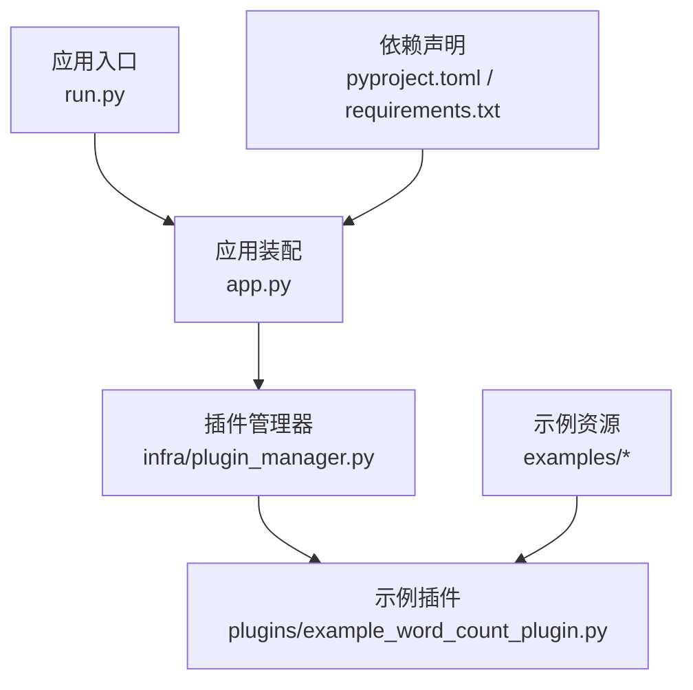
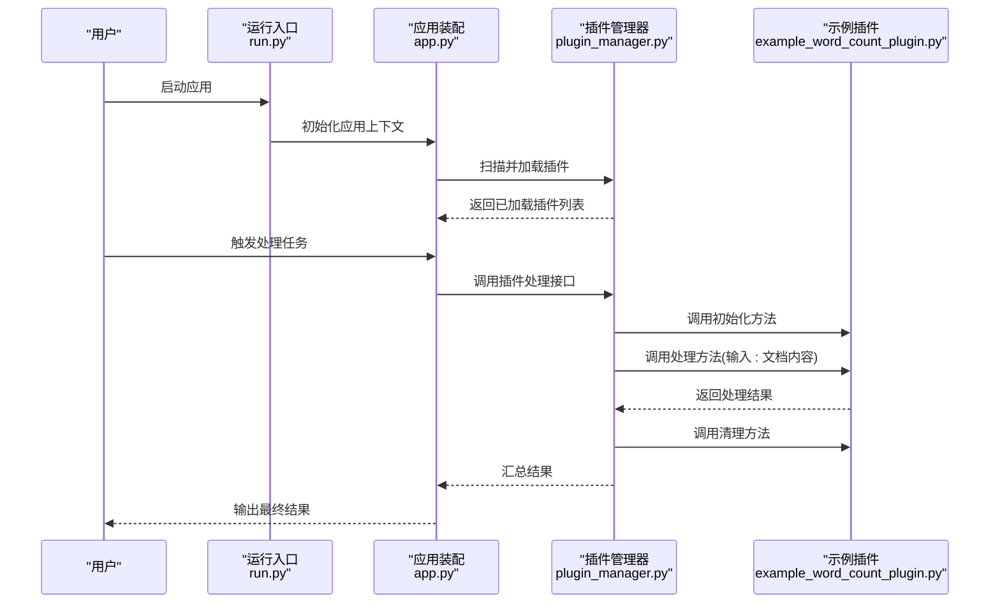
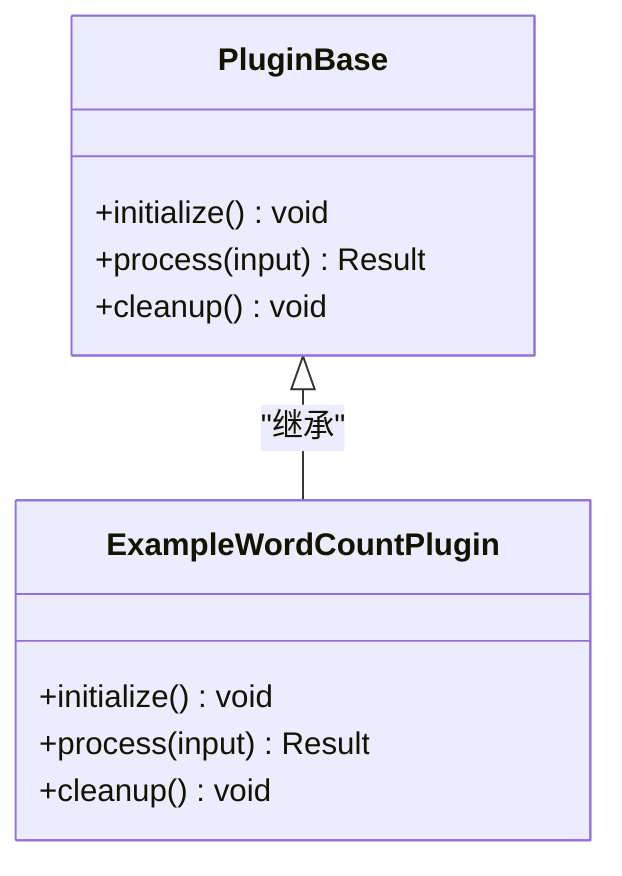
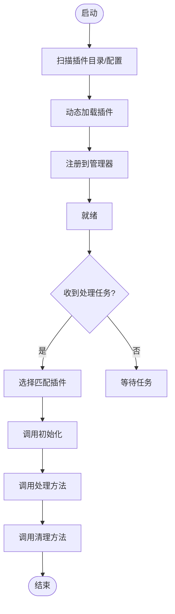
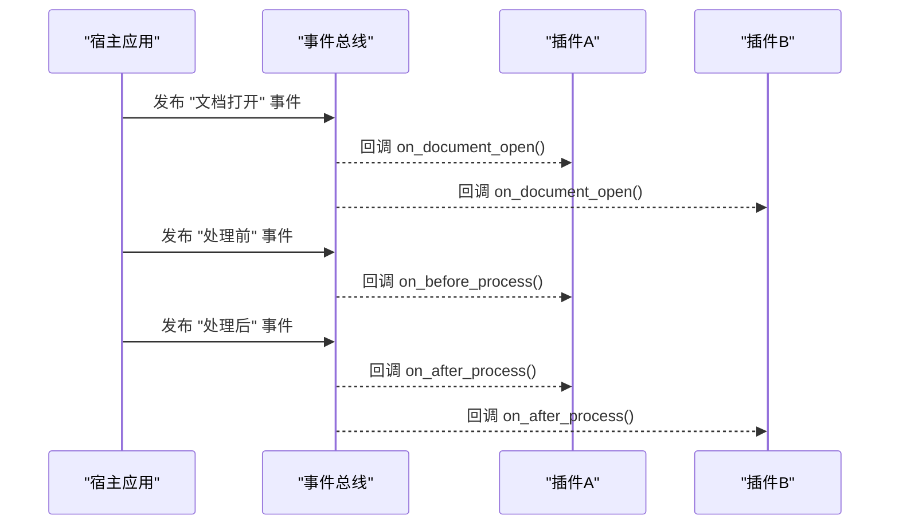
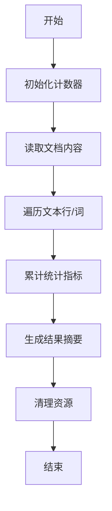
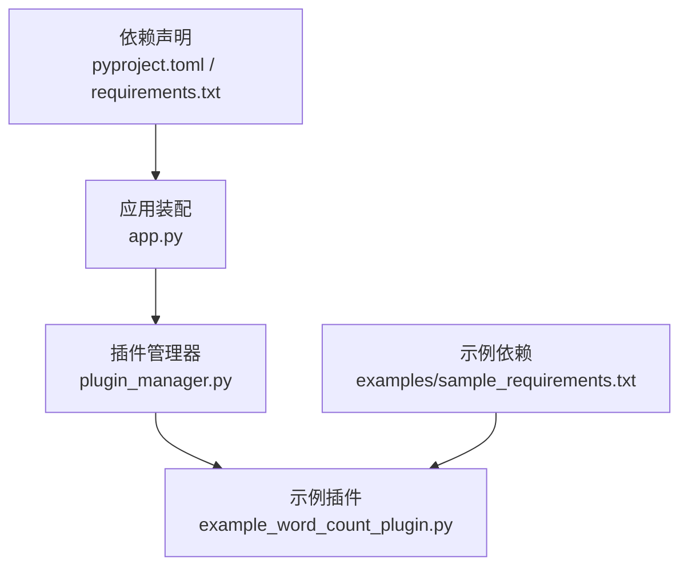

# 插件基础开发

<cite>
**本文引用的文件**   
- [README.md](file://README.md)
- [pyproject.toml](file://pyproject.toml)
- [requirements.txt](file://requirements.txt)
- [run.py](file://run.py)
- [src/paper_format_corrector/app.py](file://src/paper_format_corrector/app.py)
- [src/paper_format_corrector/infra/plugin_manager.py](file://src/paper_format_corrector/infra/plugin_manager.py)
- [plugins/example_word_count_plugin.py](file://plugins/example_word_count_plugin.py)
- [examples/sample_requirements.txt](file://examples/sample_requirements.txt)
- [examples/sample_template.yaml](file://examples/sample_template.yaml)
</cite>

## 目录
1. [简介](#简介)
2. [项目结构](#项目结构)
3. [核心组件](#核心组件)
4. [架构总览](#架构总览)
5. [详细组件分析](#详细组件分析)
6. [依赖关系分析](#依赖关系分析)
7. [性能考虑](#性能考虑)
8. [故障排查指南](#故障排查指南)
9. [结论](#结论)
10. [附录](#附录)

## 简介
本教程面向希望为“论文格式矫正工具”编写插件的开发者，目标是帮助你从零开始理解插件体系、搭建开发环境、实现一个可运行的文本处理插件，并掌握调试与排错技巧。你将了解：
- 插件的基本概念与生命周期
- 插件基类与事件系统的设计要点
- 如何创建第一个插件（项目结构、依赖配置、基础代码框架）
- 必需方法的实现（初始化、处理、清理）
- 一个简单的文本处理插件示例（读取文档内容、执行基本操作、返回结果）
- 调试技巧与常用开发工具

## 项目结构
仓库采用分层与模块化组织方式，插件相关的关键位置如下：
- 插件入口与示例位于 plugins 目录
- 插件管理器位于 infra 层，负责发现、加载、生命周期管理
- 应用启动与装配在 app.py 中完成
- 依赖与构建信息在 pyproject.toml 和 requirements.txt 中声明
- 运行入口在 run.py

图表来源
- [run.py](file://run.py)
- [src/paper_format_corrector/app.py](file://src/paper_format_corrector/app.py)
- [src/paper_format_corrector/infra/plugin_manager.py](file://src/paper_format_corrector/infra/plugin_manager.py)
- [plugins/example_word_count_plugin.py](file://plugins/example_word_count_plugin.py)
- [pyproject.toml](file://pyproject.toml)
- [requirements.txt](file://requirements.txt)
- [examples/sample_requirements.txt](file://examples/sample_requirements.txt)
- [examples/sample_template.yaml](file://examples/sample_template.yaml)

章节来源
- [README.md](file://README.md)
- [pyproject.toml](file://pyproject.toml)
- [requirements.txt](file://requirements.txt)
- [run.py](file://run.py)
- [src/paper_format_corrector/app.py](file://src/paper_format_corrector/app.py)
- [src/paper_format_corrector/infra/plugin_manager.py](file://src/paper_format_corrector/infra/plugin_manager.py)
- [plugins/example_word_count_plugin.py](file://plugins/example_word_count_plugin.py)
- [examples/sample_requirements.txt](file://examples/sample_requirements.txt)
- [examples/sample_template.yaml](file://examples/sample_template.yaml)

## 核心组件
- 插件基类与约定
  - 插件通常继承自统一的基类或遵循约定的接口，提供生命周期钩子方法，如初始化、处理、清理等。
  - 通过约定命名或元数据注册，使插件管理器能够自动发现与实例化。
- 插件管理器
  - 负责插件的发现、加载、生命周期管理与事件分发。
  - 维护插件实例池，协调插件与应用主流程的交互。
- 事件系统
  - 基于发布-订阅模式，允许插件之间以及插件与宿主应用进行解耦通信。
  - 典型事件包括：文档打开、处理前、处理后、错误、关闭等。
- 示例插件
  - 提供一个最小可用的文本处理插件，演示如何读取文档内容、执行简单统计、返回结果。

章节来源
- [src/paper_format_corrector/infra/plugin_manager.py](file://src/paper_format_corrector/infra/plugin_manager.py)
- [plugins/example_word_count_plugin.py](file://plugins/example_word_count_plugin.py)

## 架构总览
下图展示了从应用启动到插件执行的总体流程，包括插件管理器对插件的生命周期控制与事件分发。

图表来源
- [run.py](file://run.py)
- [src/paper_format_corrector/app.py](file://src/paper_format_corrector/app.py)
- [src/paper_format_corrector/infra/plugin_manager.py](file://src/paper_format_corrector/infra/plugin_manager.py)
- [plugins/example_word_count_plugin.py](file://plugins/example_word_count_plugin.py)

## 详细组件分析

### 插件基类与生命周期
- 设计目标
  - 统一插件接口，明确生命周期阶段：初始化、处理、清理。
  - 提供默认实现与扩展点，便于插件快速接入。
- 关键方法
  - 初始化方法：用于准备资源、校验配置、建立连接等。
  - 处理方法：接收输入数据（如文档内容），执行业务逻辑，返回结果。
  - 清理方法：释放资源、关闭连接、记录日志等。
- 生命周期管理
  - 插件管理器在合适时机调用上述方法，确保顺序与异常安全。
  - 支持并行或串行执行策略，视插件能力而定。

图表来源
- [src/paper_format_corrector/infra/plugin_manager.py](file://src/paper_format_corrector/infra/plugin_manager.py)
- [plugins/example_word_count_plugin.py](file://plugins/example_word_count_plugin.py)

章节来源
- [src/paper_format_corrector/infra/plugin_manager.py](file://src/paper_format_corrector/infra/plugin_manager.py)
- [plugins/example_word_count_plugin.py](file://plugins/example_word_count_plugin.py)

### 插件管理器
- 职责
  - 插件发现：根据约定路径或配置文件扫描插件模块。
  - 插件加载：动态导入、实例化、注册到管理器。
  - 生命周期调度：按阶段调用插件方法，捕获并上报异常。
  - 事件分发：将内部事件广播给已注册的插件。
- 关键流程
  - 启动时扫描并加载插件
  - 运行时根据任务类型选择插件并执行
  - 结束时统一清理所有插件资源

图表来源
- [src/paper_format_corrector/infra/plugin_manager.py](file://src/paper_format_corrector/infra/plugin_manager.py)

章节来源
- [src/paper_format_corrector/infra/plugin_manager.py](file://src/paper_format_corrector/infra/plugin_manager.py)

### 事件系统
- 设计理念
  - 松耦合：插件无需直接引用其他插件，通过事件总线通信。
  - 可扩展：新增事件类型与处理器不影响现有插件。
- 常见事件
  - 文档打开、处理前、处理后、错误、关闭等。
- 使用建议
  - 事件名保持语义清晰，避免重复定义。
  - 事件处理器应幂等且健壮，避免副作用。

图表来源
- [src/paper_format_corrector/infra/plugin_manager.py](file://src/paper_format_corrector/infra/plugin_manager.py)

章节来源
- [src/paper_format_corrector/infra/plugin_manager.py](file://src/paper_format_corrector/infra/plugin_manager.py)

### 从零开始创建第一个插件
- 步骤概览
  - 在项目根目录下新建插件文件，例如 plugins/my_first_plugin.py。
  - 继承插件基类，实现初始化、处理、清理三个方法。
  - 在插件管理器配置中注册新插件（若需要）。
  - 运行应用，验证插件是否被正确加载与执行。
- 项目结构与依赖
  - 插件文件放在 plugins 目录，便于扫描发现。
  - 如需第三方库，可在 examples/sample_requirements.txt 中添加依赖，并在本地虚拟环境中安装。
- 基础代码框架
  - 参考示例插件的结构与命名约定，确保方法签名一致。
  - 在处理方法中读取输入数据，执行文本处理逻辑，返回结构化结果。
- 必需方法说明
  - 初始化方法：检查配置、准备缓存、建立外部服务连接等。
  - 处理方法：接收文档内容或片段，执行统计、替换、格式化等操作。
  - 清理方法：关闭连接、释放内存、写入日志等。

章节来源
- [plugins/example_word_count_plugin.py](file://plugins/example_word_count_plugin.py)
- [examples/sample_requirements.txt](file://examples/sample_requirements.txt)
- [examples/sample_template.yaml](file://examples/sample_template.yaml)

### 简单文本处理插件示例
- 功能描述
  - 读取文档内容，执行基本统计（如字数、行数），返回结果摘要。
- 处理流程
  - 初始化：准备计数器与配置。
  - 处理：遍历文本，统计指标，生成报告。
  - 清理：释放临时变量，记录日志。
- 结果返回
  - 以结构化对象或字典形式返回，包含统计项与状态信息。

图表来源
- [plugins/example_word_count_plugin.py](file://plugins/example_word_count_plugin.py)

章节来源
- [plugins/example_word_count_plugin.py](file://plugins/example_word_count_plugin.py)

### 调试技巧与开发工具
- 日志与断点
  - 在插件方法中加入日志输出，定位问题。
  - 使用 IDE 断点调试，逐步跟踪执行路径。
- 单元测试
  - 为插件编写最小用例，覆盖正常与异常分支。
  - 模拟输入数据，验证输出是否符合预期。
- 插件热重载
  - 在开发阶段启用热重载，减少重启成本。
- 常见问题
  - 插件未加载：检查扫描路径与命名约定。
  - 依赖缺失：确认 requirements 与虚拟环境。
  - 事件未触发：核对事件名称与处理器注册。

章节来源
- [src/paper_format_corrector/infra/plugin_manager.py](file://src/paper_format_corrector/infra/plugin_manager.py)
- [plugins/example_word_count_plugin.py](file://plugins/example_word_count_plugin.py)

## 依赖关系分析
- 构建与依赖
  - pyproject.toml 与 requirements.txt 声明了应用与插件所需的依赖。
  - 示例插件可能依赖第三方库，需在示例依赖文件中添加。
- 模块耦合
  - 插件与宿主应用通过插件管理器与事件系统进行解耦。
  - 插件之间不直接依赖，降低耦合度与冲突风险。

图表来源
- [src/paper_format_corrector/app.py](file://src/paper_format_corrector/app.py)
- [src/paper_format_corrector/infra/plugin_manager.py](file://src/paper_format_corrector/infra/plugin_manager.py)
- [plugins/example_word_count_plugin.py](file://plugins/example_word_count_plugin.py)
- [pyproject.toml](file://pyproject.toml)
- [requirements.txt](file://requirements.txt)
- [examples/sample_requirements.txt](file://examples/sample_requirements.txt)

章节来源
- [pyproject.toml](file://pyproject.toml)
- [requirements.txt](file://requirements.txt)
- [examples/sample_requirements.txt](file://examples/sample_requirements.txt)

## 性能考虑
- 插件执行策略
  - 对于 CPU 密集型插件，考虑并行执行；对于 IO 密集型插件，使用异步或队列。
- 资源管理
  - 在清理方法中及时释放资源，避免内存泄漏。
- 事件风暴
  - 控制事件频率，避免过多事件导致性能瓶颈。
- 缓存与复用
  - 在初始化阶段预计算共享数据，减少重复开销。

## 故障排查指南
- 插件未加载
  - 检查插件目录与命名约定是否正确。
  - 查看插件管理器日志，确认扫描与加载过程。
- 依赖缺失
  - 对比示例依赖文件，确保本地环境安装了所需包。
- 事件未触发
  - 核对事件名称与处理器注册是否一致。
- 异常处理
  - 在插件方法中捕获异常并记录堆栈，便于定位问题。
- 调试建议
  - 使用最小复现用例，逐步缩小问题范围。
  - 结合日志与断点，追踪关键路径。

章节来源
- [src/paper_format_corrector/infra/plugin_manager.py](file://src/paper_format_corrector/infra/plugin_manager.py)
- [plugins/example_word_count_plugin.py](file://plugins/example_word_count_plugin.py)

## 结论
通过本教程，你已了解插件体系的核心概念与实现要点，掌握了从环境搭建到第一个插件开发的完整流程。建议在实际项目中：
- 严格遵循插件基类与方法约定
- 合理使用事件系统实现解耦
- 完善日志与测试，提升可维护性与稳定性
- 关注性能与资源管理，保障大规模插件生态的运行效率

## 附录
- 快速上手清单
  - 新建插件文件，继承基类，实现三方法
  - 在示例依赖文件中添加第三方库
  - 运行应用，验证插件加载与执行
  - 编写单元测试，覆盖主要分支
- 参考资源
  - 示例插件与模板文件可作为起点
  - 应用装配与插件管理器源码有助于深入理解