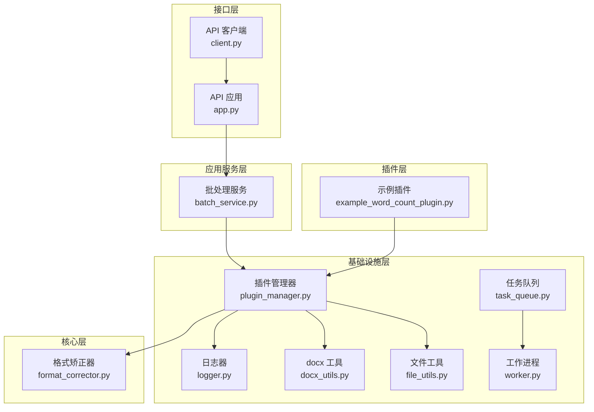
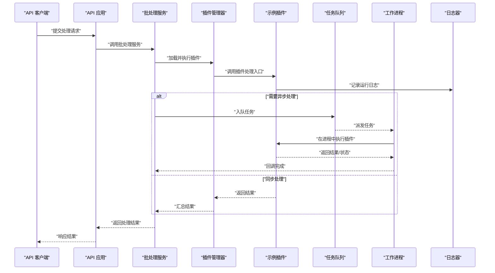
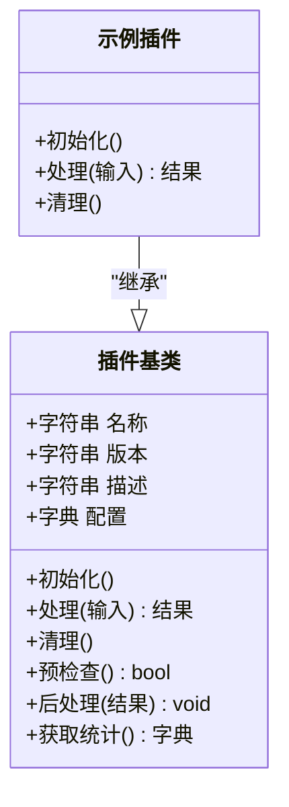
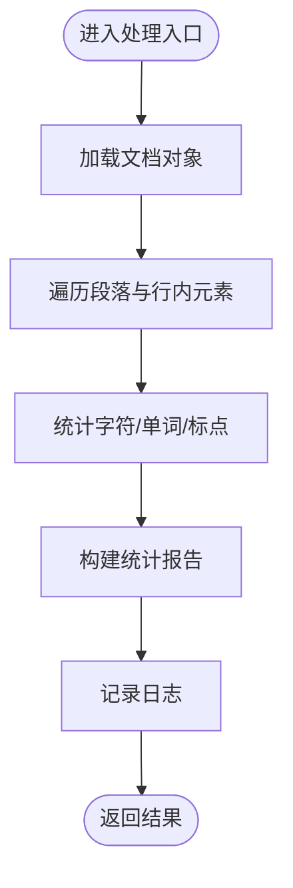
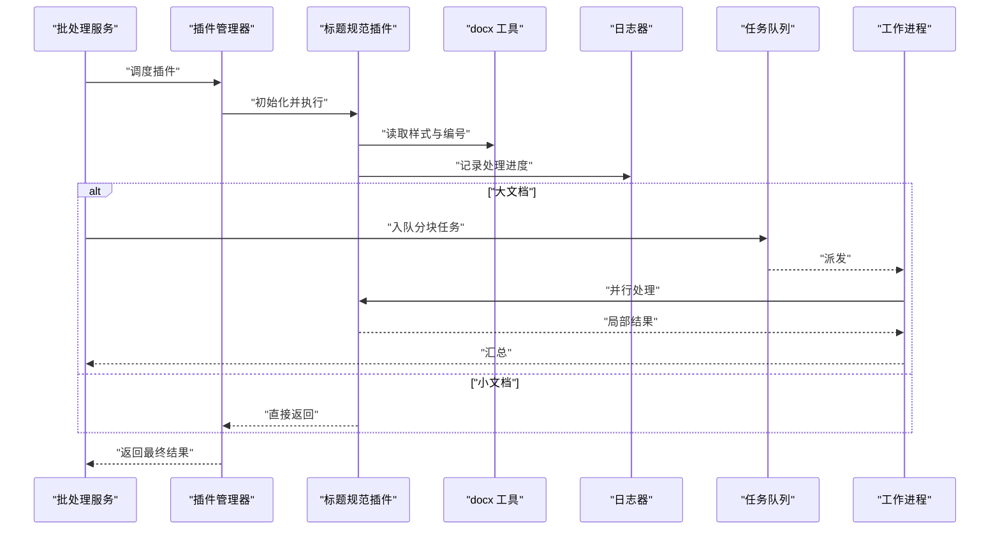
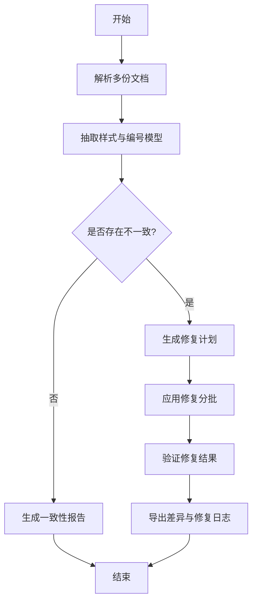
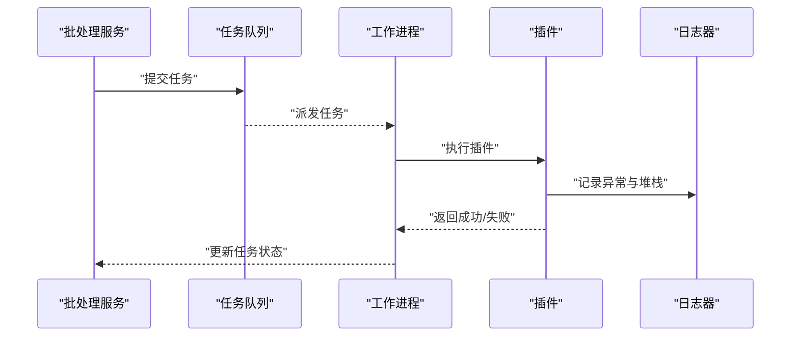
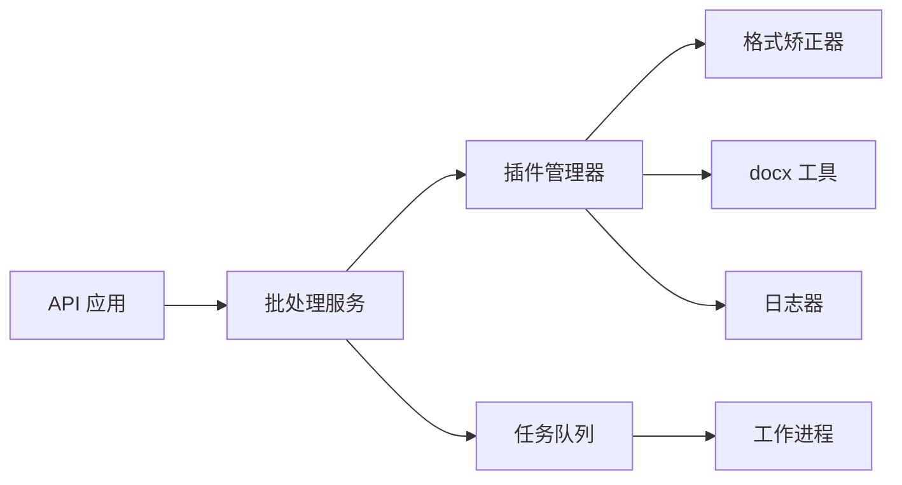

# 插件开发教程

<cite>
**本文引用的文件**   
- [README.md](file://README.md)
- [plugins/example_word_count_plugin.py](file://plugins/example_word_count_plugin.py)
- [src/paper_format_corrector/infra/plugin_manager.py](file://src/paper_format_corrector/infra/plugin_manager.py)
- [src/paper_format_corrector/core/format_corrector.py](file://src/paper_format_corrector/core/format_corrector.py)
- [src/paper_format_corrector/infra/logger.py](file://src/paper_format_corrector/infra/logger.py)
- [src/paper_format_corrector/utils/docx_utils.py](file://src/paper_format_corrector/utils/docx_utils.py)
- [src/paper_format_corrector/shared/utils/file_utils.py](file://src/paper_format_corrector/shared/utils/file_utils.py)
- [src/paper_format_corrector/application/services/batch_service.py](file://src/paper_format_corrector/application/services/batch_service.py)
- [src/paper_format_corrector/interfaces/api/app.py](file://src/paper_format_corrector/interfaces/api/app.py)
- [src/paper_format_corrector/interfaces/api/client.py](file://src/paper_format_corrector/interfaces/api/client.py)
- [src/paper_format_corrector/infrastructure/queue/task_queue.py](file://src/paper_format_corrector/infrastructure/queue/task_queue.py)
- [src/paper_format_corrector/infrastructure/queue/worker.py](file://src/paper_format_corrector/infrastructure/queue/worker.py)
- [examples/sample_template.yaml](file://examples/sample_template.yaml)
- [config/config.yaml](file://config/config.yaml)
</cite>

## 目录
1. [简介](#简介)
2. [项目结构](#项目结构)
3. [核心组件](#核心组件)
4. [架构总览](#架构总览)
5. [详细组件分析](#详细组件分析)
6. [依赖关系分析](#依赖关系分析)
7. [性能考虑](#性能考虑)
8. [故障排查指南](#故障排查指南)
9. [结论](#结论)
10. [附录](#附录)

## 简介
本教程面向希望为论文格式矫正工具扩展功能的开发者，提供循序渐进的实战指导。内容从最简单的文本处理插件开始，逐步过渡到复杂插件的开发方法，涵盖：
- 插件基类的继承与重写（必需方法与可选方法）
- Word 文档操作、文本提取与格式修改
- 共享工具与 API 接口使用（文档操作、文件处理、日志记录）
- 高级特性：异步处理、错误处理、性能优化
- 不同复杂度插件模板与最佳实践
- 常见开发场景的解决方案与代码片段路径

## 项目结构
仓库采用分层与模块化组织方式，插件系统位于基础设施层，通过插件管理器加载并编排执行；应用服务负责业务编排；API 层暴露对外能力；共享工具与日志贯穿各层。

图表来源
- [plugins/example_word_count_plugin.py](file://plugins/example_word_count_plugin.py)
- [src/paper_format_corrector/infra/plugin_manager.py](file://src/paper_format_corrector/infra/plugin_manager.py)
- [src/paper_format_corrector/core/format_corrector.py](file://src/paper_format_corrector/core/format_corrector.py)
- [src/paper_format_corrector/infra/logger.py](file://src/paper_format_corrector/infra/logger.py)
- [src/paper_format_corrector/utils/docx_utils.py](file://src/paper_format_corrector/utils/docx_utils.py)
- [src/paper_format_corrector/shared/utils/file_utils.py](file://src/paper_format_corrector/shared/utils/file_utils.py)
- [src/paper_format_corrector/application/services/batch_service.py](file://src/paper_format_corrector/application/services/batch_service.py)
- [src/paper_format_corrector/interfaces/api/app.py](file://src/paper_format_corrector/interfaces/api/app.py)
- [src/paper_format_corrector/interfaces/api/client.py](file://src/paper_format_corrector/interfaces/api/client.py)
- [src/paper_format_corrector/infrastructure/queue/task_queue.py](file://src/paper_format_corrector/infrastructure/queue/task_queue.py)
- [src/paper_format_corrector/infrastructure/queue/worker.py](file://src/paper_format_corrector/infrastructure/queue/worker.py)

章节来源
- [README.md](file://README.md)

## 核心组件
- 插件管理器：负责发现、加载、注册、生命周期管理与调用分发。
- 示例插件：展示最小可用插件形态，包含元数据、配置项、处理入口等。
- 共享工具：docx 工具封装常用文档操作；文件工具提供路径、IO 辅助；日志器统一输出。
- 应用服务：批处理服务串联多个插件或步骤，支持批量文档处理。
- API 层：REST 接口与应用客户端，便于外部系统集成。
- 任务队列与工作进程：用于异步与并发处理。

章节来源
- [src/paper_format_corrector/infra/plugin_manager.py](file://src/paper_format_corrector/infra/plugin_manager.py)
- [plugins/example_word_count_plugin.py](file://plugins/example_word_count_plugin.py)
- [src/paper_format_corrector/utils/docx_utils.py](file://src/paper_format_corrector/utils/docx_utils.py)
- [src/paper_format_corrector/shared/utils/file_utils.py](file://src/paper_format_corrector/shared/utils/file_utils.py)
- [src/paper_format_corrector/infra/logger.py](file://src/paper_format_corrector/infra/logger.py)
- [src/paper_format_corrector/application/services/batch_service.py](file://src/paper_format_corrector/application/services/batch_service.py)
- [src/paper_format_corrector/interfaces/api/app.py](file://src/paper_format_corrector/interfaces/api/app.py)
- [src/paper_format_corrector/interfaces/api/client.py](file://src/paper_format_corrector/interfaces/api/client.py)
- [src/paper_format_corrector/infrastructure/queue/task_queue.py](file://src/paper_format_corrector/infrastructure/queue/task_queue.py)
- [src/paper_format_corrector/infrastructure/queue/worker.py](file://src/paper_format_corrector/infrastructure/queue/worker.py)

## 架构总览
下图展示了从 API 请求到插件执行的端到端流程，以及异步任务队列的参与方式。

图表来源
- [src/paper_format_corrector/interfaces/api/app.py](file://src/paper_format_corrector/interfaces/api/app.py)
- [src/paper_format_corrector/application/services/batch_service.py](file://src/paper_format_corrector/application/services/batch_service.py)
- [src/paper_format_corrector/infra/plugin_manager.py](file://src/paper_format_corrector/infra/plugin_manager.py)
- [plugins/example_word_count_plugin.py](file://plugins/example_word_count_plugin.py)
- [src/paper_format_corrector/infra/logger.py](file://src/paper_format_corrector/infra/logger.py)
- [src/paper_format_corrector/infrastructure/queue/task_queue.py](file://src/paper_format_corrector/infrastructure/queue/task_queue.py)
- [src/paper_format_corrector/infrastructure/queue/worker.py](file://src/paper_format_corrector/infrastructure/queue/worker.py)

## 详细组件分析

### 插件基类与生命周期（继承与重写）
- 目标：定义插件的最小契约，包括元数据、配置、初始化、处理入口、清理等。
- 建议实现要点：
  - 元数据：名称、版本、描述、作者、许可证等。
  - 配置：必填与可选参数，默认值与校验。
  - 初始化：资源准备（如打开 docx 包、缓存样式）。
  - 处理入口：接收输入文档对象或路径，返回处理结果与变更摘要。
  - 清理：释放资源、关闭句柄、清理临时文件。
  - 可选钩子：预检查、后处理、统计信息收集、指标上报。

图表来源
- [plugins/example_word_count_plugin.py](file://plugins/example_word_count_plugin.py)
- [src/paper_format_corrector/infra/plugin_manager.py](file://src/paper_format_corrector/infra/plugin_manager.py)

章节来源
- [plugins/example_word_count_plugin.py](file://plugins/example_word_count_plugin.py)
- [src/paper_format_corrector/infra/plugin_manager.py](file://src/paper_format_corrector/infra/plugin_manager.py)

### 示例插件：词数统计（入门级）
- 功能：遍历段落与行内元素，统计中文字符、英文单词与标点数量，输出统计报告。
- 关键点：
  - 使用 docx 工具读取文档结构与文本。
  - 使用日志器记录关键步骤与异常。
  - 返回结构化结果（计数、耗时、错误信息）。
- 适用场景：快速验证插件框架、作为后续复杂插件的基础。

图表来源
- [plugins/example_word_count_plugin.py](file://plugins/example_word_count_plugin.py)
- [src/paper_format_corrector/utils/docx_utils.py](file://src/paper_format_corrector/utils/docx_utils.py)
- [src/paper_format_corrector/infra/logger.py](file://src/paper_format_corrector/infra/logger.py)

章节来源
- [plugins/example_word_count_plugin.py](file://plugins/example_word_count_plugin.py)
- [src/paper_format_corrector/utils/docx_utils.py](file://src/paper_format_corrector/utils/docx_utils.py)
- [src/paper_format_corrector/infra/logger.py](file://src/paper_format_corrector/infra/logger.py)

### 中级插件：标题规范化与引用编号修正
- 功能：识别标题层级、统一编号规则；扫描正文中的“图/表/公式”引用，自动修正编号与交叉引用。
- 关键点：
  - 使用 docx 工具访问段落样式与编号定义。
  - 使用文件工具进行备份与差异保存。
  - 使用日志器记录变更明细。
  - 可结合任务队列异步处理大文档。

图表来源
- [src/paper_format_corrector/application/services/batch_service.py](file://src/paper_format_corrector/application/services/batch_service.py)
- [src/paper_format_corrector/infra/plugin_manager.py](file://src/paper_format_corrector/infra/plugin_manager.py)
- [src/paper_format_corrector/utils/docx_utils.py](file://src/paper_format_corrector/utils/docx_utils.py)
- [src/paper_format_corrector/infra/logger.py](file://src/paper_format_corrector/infra/logger.py)
- [src/paper_format_corrector/infrastructure/queue/task_queue.py](file://src/paper_format_corrector/infrastructure/queue/task_queue.py)
- [src/paper_format_corrector/infrastructure/queue/worker.py](file://src/paper_format_corrector/infrastructure/queue/worker.py)

章节来源
- [src/paper_format_corrector/application/services/batch_service.py](file://src/paper_format_corrector/application/services/batch_service.py)
- [src/paper_format_corrector/infra/plugin_manager.py](file://src/paper_format_corrector/infra/plugin_manager.py)
- [src/paper_format_corrector/utils/docx_utils.py](file://src/paper_format_corrector/utils/docx_utils.py)
- [src/paper_format_corrector/infra/logger.py](file://src/paper_format_corrector/infra/logger.py)
- [src/paper_format_corrector/infrastructure/queue/task_queue.py](file://src/paper_format_corrector/infrastructure/queue/task_queue.py)
- [src/paper_format_corrector/infrastructure/queue/worker.py](file://src/paper_format_corrector/infrastructure/queue/worker.py)

### 高级插件：跨文档一致性校验与修复
- 功能：对比多份文档的样式、编号、图表标题、参考文献格式，生成差异报告并自动修复。
- 关键点：
  - 使用批处理服务编排多个插件阶段（解析、比对、修复、导出）。
  - 使用任务队列与工作进程提升吞吐。
  - 使用日志器输出详细审计日志。
  - 使用文件工具进行增量保存与回滚。

图表来源
- [src/paper_format_corrector/application/services/batch_service.py](file://src/paper_format_corrector/application/services/batch_service.py)
- [src/paper_format_corrector/infra/plugin_manager.py](file://src/paper_format_corrector/infra/plugin_manager.py)
- [src/paper_format_corrector/utils/docx_utils.py](file://src/paper_format_corrector/utils/docx_utils.py)
- [src/paper_format_corrector/shared/utils/file_utils.py](file://src/paper_format_corrector/shared/utils/file_utils.py)
- [src/paper_format_corrector/infra/logger.py](file://src/paper_format_corrector/infra/logger.py)
- [src/paper_format_corrector/infrastructure/queue/task_queue.py](file://src/paper_format_corrector/infrastructure/queue/task_queue.py)
- [src/paper_format_corrector/infrastructure/queue/worker.py](file://src/paper_format_corrector/infrastructure/queue/worker.py)

章节来源
- [src/paper_format_corrector/application/services/batch_service.py](file://src/paper_format_corrector/application/services/batch_service.py)
- [src/paper_format_corrector/infra/plugin_manager.py](file://src/paper_format_corrector/infra/plugin_manager.py)
- [src/paper_format_corrector/utils/docx_utils.py](file://src/paper_format_corrector/utils/docx_utils.py)
- [src/paper_format_corrector/shared/utils/file_utils.py](file://src/paper_format_corrector/shared/utils/file_utils.py)
- [src/paper_format_corrector/infra/logger.py](file://src/paper_format_corrector/infra/logger.py)
- [src/paper_format_corrector/infrastructure/queue/task_queue.py](file://src/paper_format_corrector/infrastructure/queue/task_queue.py)
- [src/paper_format_corrector/infrastructure/queue/worker.py](file://src/paper_format_corrector/infrastructure/queue/worker.py)

### 共享工具与 API 接口使用
- 文档操作：通过 docx 工具访问段落、表格、图片、样式与编号定义，避免直接操作底层 XML。
- 文件处理：使用文件工具进行路径安全校验、备份、差异保存与回滚。
- 日志记录：统一日志器输出结构化日志，便于追踪与审计。
- API 集成：通过 API 应用暴露处理接口，使用客户端发起请求与解析响应。

章节来源
- [src/paper_format_corrector/utils/docx_utils.py](file://src/paper_format_corrector/utils/docx_utils.py)
- [src/paper_format_corrector/shared/utils/file_utils.py](file://src/paper_format_corrector/shared/utils/file_utils.py)
- [src/paper_format_corrector/infra/logger.py](file://src/paper_format_corrector/infra/logger.py)
- [src/paper_format_corrector/interfaces/api/app.py](file://src/paper_format_corrector/interfaces/api/app.py)
- [src/paper_format_corrector/interfaces/api/client.py](file://src/paper_format_corrector/interfaces/api/client.py)

### 异步处理与错误处理
- 异步处理：将耗时任务入队，由工作进程并行执行，主线程快速返回任务 ID 与状态查询接口。
- 错误处理：插件内部捕获异常并转换为标准错误对象，记录上下文信息；上层服务聚合错误并决定重试或回滚。
- 幂等性：确保同一任务多次执行不会产生副作用。

图表来源
- [src/paper_format_corrector/application/services/batch_service.py](file://src/paper_format_corrector/application/services/batch_service.py)
- [src/paper_format_corrector/infrastructure/queue/task_queue.py](file://src/paper_format_corrector/infrastructure/queue/task_queue.py)
- [src/paper_format_corrector/infrastructure/queue/worker.py](file://src/paper_format_corrector/infrastructure/queue/worker.py)
- [src/paper_format_corrector/infra/logger.py](file://src/paper_format_corrector/infra/logger.py)

章节来源
- [src/paper_format_corrector/application/services/batch_service.py](file://src/paper_format_corrector/application/services/batch_service.py)
- [src/paper_format_corrector/infrastructure/queue/task_queue.py](file://src/paper_format_corrector/infrastructure/queue/task_queue.py)
- [src/paper_format_corrector/infrastructure/queue/worker.py](file://src/paper_format_corrector/infrastructure/queue/worker.py)
- [src/paper_format_corrector/infra/logger.py](file://src/paper_format_corrector/infra/logger.py)

### 性能优化建议
- 分块处理：对大文档按段落或节分块，减少内存占用。
- 懒加载：按需加载样式与编号定义，避免一次性解析全部 XML。
- 并发控制：限制工作进程数量，避免 CPU/IO 争用。
- 缓存策略：对重复计算的结果（如样式映射）进行缓存。
- 增量保存：仅写入变更部分，缩短 IO 时间。

[本节为通用指导，不直接分析具体文件]

## 依赖关系分析
插件系统与核心层的耦合点集中在插件管理器与共享工具；应用服务通过管理器编排插件；API 层与服务层解耦，便于替换实现。

图表来源
- [src/paper_format_corrector/interfaces/api/app.py](file://src/paper_format_corrector/interfaces/api/app.py)
- [src/paper_format_corrector/application/services/batch_service.py](file://src/paper_format_corrector/application/services/batch_service.py)
- [src/paper_format_corrector/infra/plugin_manager.py](file://src/paper_format_corrector/infra/plugin_manager.py)
- [src/paper_format_corrector/core/format_corrector.py](file://src/paper_format_corrector/core/format_corrector.py)
- [src/paper_format_corrector/utils/docx_utils.py](file://src/paper_format_corrector/utils/docx_utils.py)
- [src/paper_format_corrector/infra/logger.py](file://src/paper_format_corrector/infra/logger.py)
- [src/paper_format_corrector/infrastructure/queue/task_queue.py](file://src/paper_format_corrector/infrastructure/queue/task_queue.py)
- [src/paper_format_corrector/infrastructure/queue/worker.py](file://src/paper_format_corrector/infrastructure/queue/worker.py)

章节来源
- [src/paper_format_corrector/interfaces/api/app.py](file://src/paper_format_corrector/interfaces/api/app.py)
- [src/paper_format_corrector/application/services/batch_service.py](file://src/paper_format_corrector/application/services/batch_service.py)
- [src/paper_format_corrector/infra/plugin_manager.py](file://src/paper_format_corrector/infra/plugin_manager.py)
- [src/paper_format_corrector/core/format_corrector.py](file://src/paper_format_corrector/core/format_corrector.py)
- [src/paper_format_corrector/utils/docx_utils.py](file://src/paper_format_corrector/utils/docx_utils.py)
- [src/paper_format_corrector/infra/logger.py](file://src/paper_format_corrector/infra/logger.py)
- [src/paper_format_corrector/infrastructure/queue/task_queue.py](file://src/paper_format_corrector/infrastructure/queue/task_queue.py)
- [src/paper_format_corrector/infrastructure/queue/worker.py](file://src/paper_format_corrector/infrastructure/queue/worker.py)

## 性能考虑
- 合理设置并发度与队列容量，避免过载。
- 对频繁读写的样式与编号定义建立内存缓存。
- 使用流式处理与惰性迭代降低峰值内存。
- 监控关键指标（处理时长、错误率、队列积压），及时扩容或限流。

[本节为通用指导，不直接分析具体文件]

## 故障排查指南
- 常见问题：
  - 插件未正确注册：检查插件元数据与加载路径。
  - 文档解析失败：确认 docx 工具版本与兼容性。
  - 日志缺失：检查日志器配置与权限。
  - 异步任务卡住：查看队列与工作进程状态。
- 定位手段：
  - 启用详细日志级别，关注异常堆栈与上下文。
  - 使用任务状态查询接口定位失败任务。
  - 对问题文档进行最小化复现，逐步缩小范围。

章节来源
- [src/paper_format_corrector/infra/logger.py](file://src/paper_format_corrector/infra/logger.py)
- [src/paper_format_corrector/infrastructure/queue/task_queue.py](file://src/paper_format_corrector/infrastructure/queue/task_queue.py)
- [src/paper_format_corrector/infrastructure/queue/worker.py](file://src/paper_format_corrector/infrastructure/queue/worker.py)

## 结论
通过本教程，您可以从零开始构建一个简单插件，逐步扩展到具备异步、错误处理与性能优化的复杂插件。建议遵循最小契约、清晰职责与良好日志的原则，利用共享工具与 API 接口提升开发效率与稳定性。

[本节为总结，不直接分析具体文件]

## 附录

### 插件开发模板清单
- 基础模板：元数据、配置、初始化、处理入口、清理。
- 中级模板：增加预检查、后处理、统计信息收集。
- 高级模板：引入任务队列、工作进程、差异保存与回滚。

[本节为概念性说明，不直接分析具体文件]

### 配置文件参考
- 示例模板：用于定义插件行为与默认参数。
- 全局配置：日志级别、队列大小、并发度等。

章节来源
- [examples/sample_template.yaml](file://examples/sample_template.yaml)
- [config/config.yaml](file://config/config.yaml)