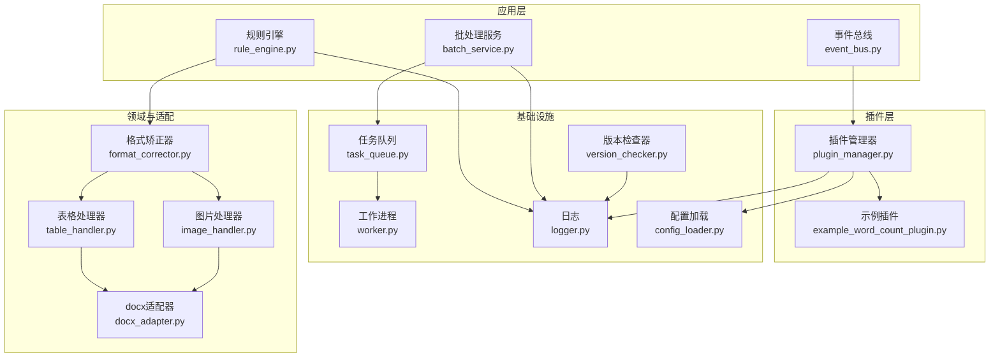
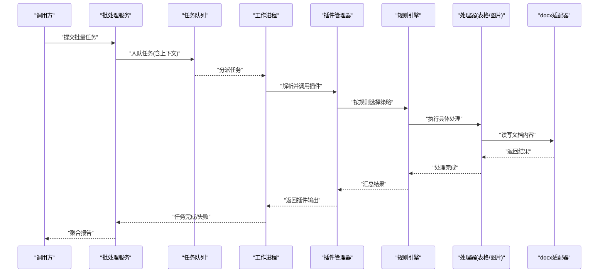
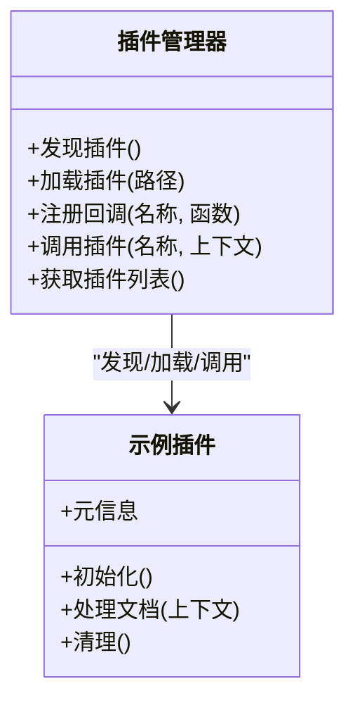
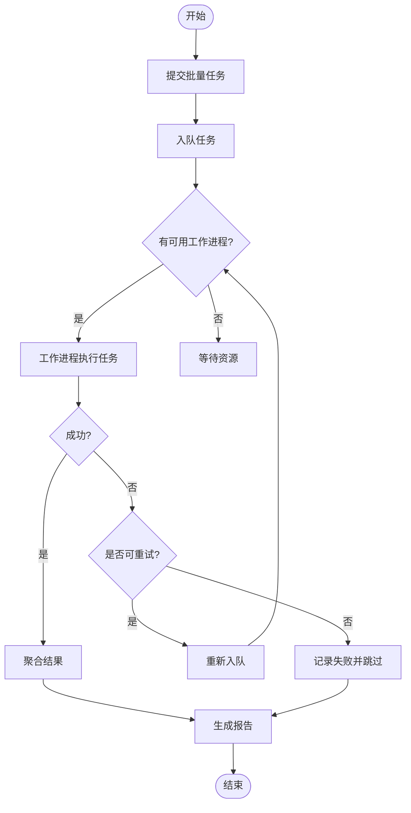
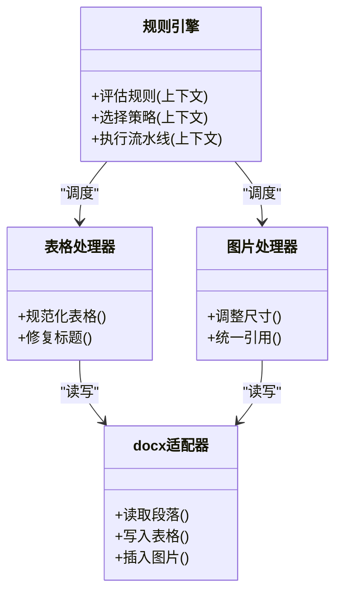
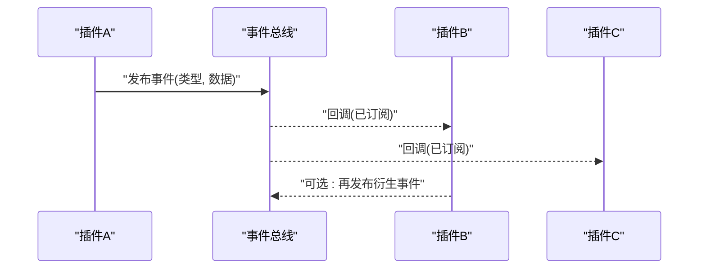
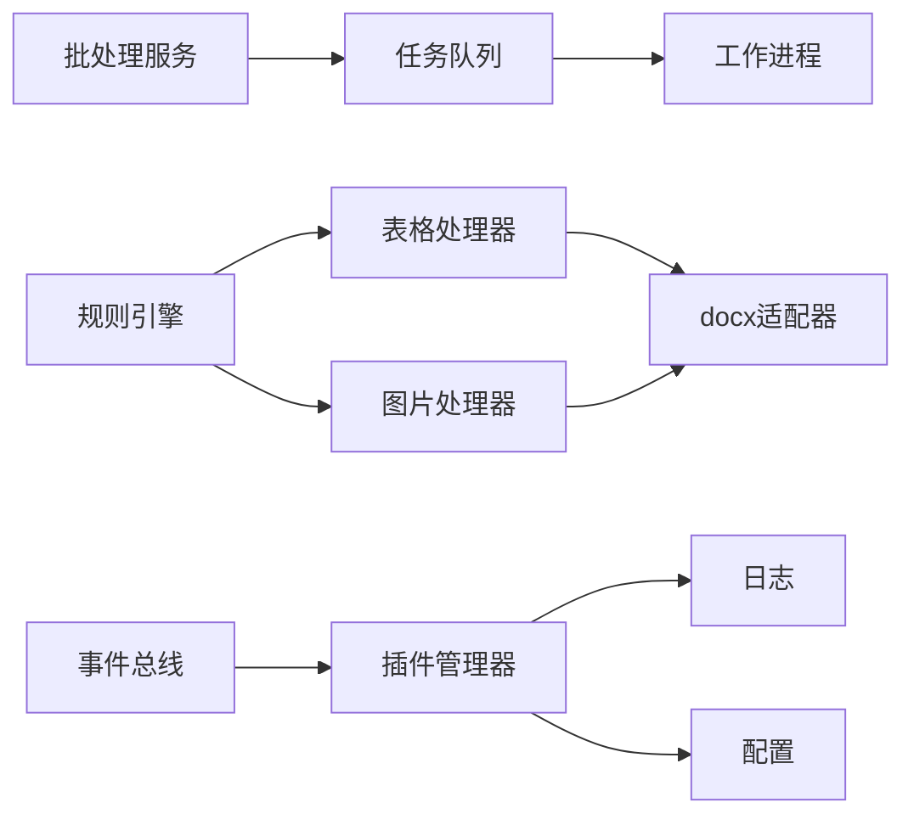

# 高级功能开发

<cite>
**本文引用的文件**   
- [src/paper_format_corrector/infra/plugin_manager.py](file://src/paper_format_corrector/infra/plugin_manager.py)
- [plugins/example_word_count_plugin.py](file://plugins/example_word_count_plugin.py)
- [src/paper_format_corrector/application/services/batch_service.py](file://src/paper_format_corrector/application/services/batch_service.py)
- [src/paper_format_corrector/infrastructure/queue/task_queue.py](file://src/paper_format_corrector/infrastructure/queue/task_queue.py)
- [src/paper_format_corrector/infrastructure/queue/worker.py](file://src/paper_format_corrector/infrastructure/queue/worker.py)
- [src/paper_format_corrector/infra/logger.py](file://src/paper_format_corrector/infra/logger.py)
- [src/paper_format_corrector/shared/utils/config_loader.py](file://src/paper_format_corrector/shared/utils/config_loader.py)
- [src/paper_format_corrector/core/format_corrector.py](file://src/paper_format_corrector/core/format_corrector.py)
- [src/paper_format_corrector/handlers/table_handler.py](file://src/paper_format_corrector/handlers/table_handler.py)
- [src/paper_format_corrector/handlers/image_handler.py](file://src/paper_format_corrector/handlers/image_handler.py)
- [src/paper_format_corrector/infrastructure/adapters/docx_adapter.py](file://src/paper_format_corrector/infrastructure/adapters/docx_adapter.py)
- [src/paper_format_corrector/domain/events/event_bus.py](file://src/paper_format_corrector/domain/events/event_bus.py)
- [src/paper_format_corrector/quality/rule_engine.py](file://src/paper_format_corrector/quality/rule_engine.py)
- [src/paper_format_corrector/infrastructure/updater/version_checker.py](file://src/paper_format_corrector/infrastructure/updater/version_checker.py)
</cite>

## 目录
1. [简介](#简介)
2. [项目结构](#项目结构)
3. [核心组件](#核心组件)
4. [架构总览](#架构总览)
5. [详细组件分析](#详细组件分析)
6. [依赖关系分析](#依赖关系分析)
7. [性能考虑](#性能考虑)
8. [故障排查指南](#故障排查指南)
9. [结论](#结论)
10. [附录](#附录)

## 简介
本章节面向插件开发者，聚焦“高级功能开发”主题：异步处理、错误处理与性能优化；共享工具与API（文档操作、文件处理、日志记录、配置管理）；复杂业务逻辑（批量处理、条件判断、数据转换）；插件间通信与依赖管理；以及策略模式、观察者模式、工厂模式的实践。同时提供性能监控与资源管理的最佳实践建议。

## 项目结构
围绕插件生态与高级能力，仓库中与插件和基础设施相关的关键位置如下：
- 插件管理器与示例插件：负责插件发现、生命周期、注册与调用
- 批处理服务与任务队列：支撑异步与并发执行
- 处理器与适配器：封装文档对象模型与文件格式的读写
- 规则引擎与事件总线：实现可扩展的规则判定与插件间解耦通信
- 日志与配置：统一的日志输出与配置加载机制
- 版本检查器：用于更新与兼容性校验

图表来源
- [src/paper_format_corrector/infra/plugin_manager.py](file://src/paper_format_corrector/infra/plugin_manager.py)
- [plugins/example_word_count_plugin.py](file://plugins/example_word_count_plugin.py)
- [src/paper_format_corrector/application/services/batch_service.py](file://src/paper_format_corrector/application/services/batch_service.py)
- [src/paper_format_corrector/infrastructure/queue/task_queue.py](file://src/paper_format_corrector/infrastructure/queue/task_queue.py)
- [src/paper_format_corrector/infrastructure/queue/worker.py](file://src/paper_format_corrector/infrastructure/queue/worker.py)
- [src/paper_format_corrector/quality/rule_engine.py](file://src/paper_format_corrector/quality/rule_engine.py)
- [src/paper_format_corrector/domain/events/event_bus.py](file://src/paper_format_corrector/domain/events/event_bus.py)
- [src/paper_format_corrector/infra/logger.py](file://src/paper_format_corrector/infra/logger.py)
- [src/paper_format_corrector/shared/utils/config_loader.py](file://src/paper_format_corrector/shared/utils/config_loader.py)
- [src/paper_format_corrector/infrastructure/updater/version_checker.py](file://src/paper_format_corrector/infrastructure/updater/version_checker.py)
- [src/paper_format_corrector/core/format_corrector.py](file://src/paper_format_corrector/core/format_corrector.py)
- [src/paper_format_corrector/handlers/table_handler.py](file://src/paper_format_corrector/handlers/table_handler.py)
- [src/paper_format_corrector/handlers/image_handler.py](file://src/paper_format_corrector/handlers/image_handler.py)
- [src/paper_format_corrector/infrastructure/adapters/docx_adapter.py](file://src/paper_format_corrector/infrastructure/adapters/docx_adapter.py)

章节来源
- [src/paper_format_corrector/infra/plugin_manager.py](file://src/paper_format_corrector/infra/plugin_manager.py)
- [plugins/example_word_count_plugin.py](file://plugins/example_word_count_plugin.py)
- [src/paper_format_corrector/application/services/batch_service.py](file://src/paper_format_corrector/application/services/batch_service.py)
- [src/paper_format_corrector/infrastructure/queue/task_queue.py](file://src/paper_format_corrector/infrastructure/queue/task_queue.py)
- [src/paper_format_corrector/infrastructure/queue/worker.py](file://src/paper_format_corrector/infrastructure/queue/worker.py)
- [src/paper_format_corrector/quality/rule_engine.py](file://src/paper_format_corrector/quality/rule_engine.py)
- [src/paper_format_corrector/domain/events/event_bus.py](file://src/paper_format_corrector/domain/events/event_bus.py)
- [src/paper_format_corrector/infra/logger.py](file://src/paper_format_corrector/infra/logger.py)
- [src/paper_format_corrector/shared/utils/config_loader.py](file://src/paper_format_corrector/shared/utils/config_loader.py)
- [src/paper_format_corrector/infrastructure/updater/version_checker.py](file://src/paper_format_corrector/infrastructure/updater/version_checker.py)
- [src/paper_format_corrector/core/format_corrector.py](file://src/paper_format_corrector/core/format_corrector.py)
- [src/paper_format_corrector/handlers/table_handler.py](file://src/paper_format_corrector/handlers/table_handler.py)
- [src/paper_format_corrector/handlers/image_handler.py](file://src/paper_format_corrector/handlers/image_handler.py)
- [src/paper_format_corrector/infrastructure/adapters/docx_adapter.py](file://src/paper_format_corrector/infrastructure/adapters/docx_adapter.py)

## 核心组件
- 插件管理器：负责插件的发现、加载、注册、生命周期管理与调用分发，是插件生态的核心枢纽。
- 示例插件：展示如何定义插件元信息、注册回调、使用共享工具与API。
- 批处理服务：将任务提交到队列，协调多任务并行执行与结果聚合。
- 任务队列与工作进程：提供异步执行能力，支持任务入队、出队、重试与失败隔离。
- 规则引擎：以可插拔规则驱动文档处理流程，便于扩展新规则与组合策略。
- 事件总线：基于发布/订阅的插件间通信机制，降低耦合度。
- 日志与配置：统一日志接口与配置加载，为插件提供一致的运行时环境。
- 文档处理器与适配器：对表格、图片等元素进行规范化处理，并通过适配器屏蔽底层差异。

章节来源
- [src/paper_format_corrector/infra/plugin_manager.py](file://src/paper_format_corrector/infra/plugin_manager.py)
- [plugins/example_word_count_plugin.py](file://plugins/example_word_count_plugin.py)
- [src/paper_format_corrector/application/services/batch_service.py](file://src/paper_format_corrector/application/services/batch_service.py)
- [src/paper_format_corrector/infrastructure/queue/task_queue.py](file://src/paper_format_corrector/infrastructure/queue/task_queue.py)
- [src/paper_format_corrector/infrastructure/queue/worker.py](file://src/paper_format_corrector/infrastructure/queue/worker.py)
- [src/paper_format_corrector/quality/rule_engine.py](file://src/paper_format_corrector/quality/rule_engine.py)
- [src/paper_format_corrector/domain/events/event_bus.py](file://src/paper_format_corrector/domain/events/event_bus.py)
- [src/paper_format_corrector/infra/logger.py](file://src/paper_format_corrector/infra/logger.py)
- [src/paper_format_corrector/shared/utils/config_loader.py](file://src/paper_format_corrector/shared/utils/config_loader.py)
- [src/paper_format_corrector/core/format_corrector.py](file://src/paper_format_corrector/core/format_corrector.py)
- [src/paper_format_corrector/handlers/table_handler.py](file://src/paper_format_corrector/handlers/table_handler.py)
- [src/paper_format_corrector/handlers/image_handler.py](file://src/paper_format_corrector/handlers/image_handler.py)
- [src/paper_format_corrector/infrastructure/adapters/docx_adapter.py](file://src/paper_format_corrector/infrastructure/adapters/docx_adapter.py)

## 架构总览
下图展示了从批处理入口到插件执行的端到端流程，包括异步队列、规则引擎、处理器与适配器协作。

图表来源
- [src/paper_format_corrector/application/services/batch_service.py](file://src/paper_format_corrector/application/services/batch_service.py)
- [src/paper_format_corrector/infrastructure/queue/task_queue.py](file://src/paper_format_corrector/infrastructure/queue/task_queue.py)
- [src/paper_format_corrector/infrastructure/queue/worker.py](file://src/paper_format_corrector/infrastructure/queue/worker.py)
- [src/paper_format_corrector/infra/plugin_manager.py](file://src/paper_format_corrector/infra/plugin_manager.py)
- [src/paper_format_corrector/quality/rule_engine.py](file://src/paper_format_corrector/quality/rule_engine.py)
- [src/paper_format_corrector/handlers/table_handler.py](file://src/paper_format_corrector/handlers/table_handler.py)
- [src/paper_format_corrector/handlers/image_handler.py](file://src/paper_format_corrector/handlers/image_handler.py)
- [src/paper_format_corrector/infrastructure/adapters/docx_adapter.py](file://src/paper_format_corrector/infrastructure/adapters/docx_adapter.py)

## 详细组件分析

### 插件管理器与示例插件
- 插件管理器职责
  - 扫描与加载插件模块
  - 维护插件元信息与回调映射
  - 提供统一的调用入口与上下文注入
  - 集成日志与配置，确保插件运行一致性
- 示例插件要点
  - 声明插件标识、版本与依赖
  - 注册处理函数或钩子
  - 通过共享工具访问配置与日志
  - 在异常路径上报错误并返回结构化结果

图表来源
- [src/paper_format_corrector/infra/plugin_manager.py](file://src/paper_format_corrector/infra/plugin_manager.py)
- [plugins/example_word_count_plugin.py](file://plugins/example_word_count_plugin.py)

章节来源
- [src/paper_format_corrector/infra/plugin_manager.py](file://src/paper_format_corrector/infra/plugin_manager.py)
- [plugins/example_word_count_plugin.py](file://plugins/example_word_count_plugin.py)

### 异步处理与批处理
- 批处理服务
  - 接收批量任务集合
  - 将任务拆分为可并行单元
  - 聚合结果并生成报告
- 任务队列与工作进程
  - 任务入队/出队
  - 工作进程池控制并发度
  - 失败重试与超时保护
  - 进度与状态回传

图表来源
- [src/paper_format_corrector/application/services/batch_service.py](file://src/paper_format_corrector/application/services/batch_service.py)
- [src/paper_format_corrector/infrastructure/queue/task_queue.py](file://src/paper_format_corrector/infrastructure/queue/task_queue.py)
- [src/paper_format_corrector/infrastructure/queue/worker.py](file://src/paper_format_corrector/infrastructure/queue/worker.py)

章节来源
- [src/paper_format_corrector/application/services/batch_service.py](file://src/paper_format_corrector/application/services/batch_service.py)
- [src/paper_format_corrector/infrastructure/queue/task_queue.py](file://src/paper_format_corrector/infrastructure/queue/task_queue.py)
- [src/paper_format_corrector/infrastructure/queue/worker.py](file://src/paper_format_corrector/infrastructure/queue/worker.py)

### 规则引擎与处理器
- 规则引擎
  - 根据上下文动态选择策略
  - 组合多个规则形成处理流水线
  - 提供条件判断与短路机制
- 处理器
  - 表格处理器：规范表格样式、标题与编号
  - 图片处理器：统一尺寸、分辨率与引用
  - 通过适配器与底层文档库交互

图表来源
- [src/paper_format_corrector/quality/rule_engine.py](file://src/paper_format_corrector/quality/rule_engine.py)
- [src/paper_format_corrector/handlers/table_handler.py](file://src/paper_format_corrector/handlers/table_handler.py)
- [src/paper_format_corrector/handlers/image_handler.py](file://src/paper_format_corrector/handlers/image_handler.py)
- [src/paper_format_corrector/infrastructure/adapters/docx_adapter.py](file://src/paper_format_corrector/infrastructure/adapters/docx_adapter.py)

章节来源
- [src/paper_format_corrector/quality/rule_engine.py](file://src/paper_format_corrector/quality/rule_engine.py)
- [src/paper_format_corrector/handlers/table_handler.py](file://src/paper_format_corrector/handlers/table_handler.py)
- [src/paper_format_corrector/handlers/image_handler.py](file://src/paper_format_corrector/handlers/image_handler.py)
- [src/paper_format_corrector/infrastructure/adapters/docx_adapter.py](file://src/paper_format_corrector/infrastructure/adapters/docx_adapter.py)

### 事件总线与插件通信
- 事件总线提供发布/订阅能力
- 插件可订阅系统事件（如任务开始/结束、规则触发）
- 通过事件携带上下文，避免直接依赖

图表来源
- [src/paper_format_corrector/domain/events/event_bus.py](file://src/paper_format_corrector/domain/events/event_bus.py)
- [src/paper_format_corrector/infra/plugin_manager.py](file://src/paper_format_corrector/infra/plugin_manager.py)

章节来源
- [src/paper_format_corrector/domain/events/event_bus.py](file://src/paper_format_corrector/domain/events/event_bus.py)
- [src/paper_format_corrector/infra/plugin_manager.py](file://src/paper_format_corrector/infra/plugin_manager.py)

### 日志与配置
- 日志
  - 统一接口供插件与核心模块使用
  - 支持分级输出与结构化字段
- 配置
  - 集中加载与合并配置源
  - 提供默认值与覆盖策略
  - 插件按需读取运行参数

章节来源
- [src/paper_format_corrector/infra/logger.py](file://src/paper_format_corrector/infra/logger.py)
- [src/paper_format_corrector/shared/utils/config_loader.py](file://src/paper_format_corrector/shared/utils/config_loader.py)

### 版本检查器与依赖管理
- 版本检查器
  - 检查当前版本与远程最新版本
  - 提示升级或兼容性问题
- 依赖管理
  - 插件声明依赖项与最小版本
  - 启动时校验并阻止不兼容插件加载

章节来源
- [src/paper_format_corrector/infrastructure/updater/version_checker.py](file://src/paper_format_corrector/infrastructure/updater/version_checker.py)
- [src/paper_format_corrector/infra/plugin_manager.py](file://src/paper_format_corrector/infra/plugin_manager.py)

## 依赖关系分析
- 插件管理器依赖日志与配置，作为插件运行的基础环境
- 批处理服务依赖任务队列与工作进程，实现异步与并发
- 规则引擎驱动处理器，处理器通过适配器与文档库交互
- 事件总线贯穿各组件，提供松耦合通信

图表来源
- [src/paper_format_corrector/infra/plugin_manager.py](file://src/paper_format_corrector/infra/plugin_manager.py)
- [src/paper_format_corrector/application/services/batch_service.py](file://src/paper_format_corrector/application/services/batch_service.py)
- [src/paper_format_corrector/infrastructure/queue/task_queue.py](file://src/paper_format_corrector/infrastructure/queue/task_queue.py)
- [src/paper_format_corrector/infrastructure/queue/worker.py](file://src/paper_format_corrector/infrastructure/queue/worker.py)
- [src/paper_format_corrector/quality/rule_engine.py](file://src/paper_format_corrector/quality/rule_engine.py)
- [src/paper_format_corrector/handlers/table_handler.py](file://src/paper_format_corrector/handlers/table_handler.py)
- [src/paper_format_corrector/handlers/image_handler.py](file://src/paper_format_corrector/handlers/image_handler.py)
- [src/paper_format_corrector/infrastructure/adapters/docx_adapter.py](file://src/paper_format_corrector/infrastructure/adapters/docx_adapter.py)
- [src/paper_format_corrector/domain/events/event_bus.py](file://src/paper_format_corrector/domain/events/event_bus.py)
- [src/paper_format_corrector/infra/logger.py](file://src/paper_format_corrector/infra/logger.py)
- [src/paper_format_corrector/shared/utils/config_loader.py](file://src/paper_format_corrector/shared/utils/config_loader.py)

章节来源
- [src/paper_format_corrector/infra/plugin_manager.py](file://src/paper_format_corrector/infra/plugin_manager.py)
- [src/paper_format_corrector/application/services/batch_service.py](file://src/paper_format_corrector/application/services/batch_service.py)
- [src/paper_format_corrector/infrastructure/queue/task_queue.py](file://src/paper_format_corrector/infrastructure/queue/task_queue.py)
- [src/paper_format_corrector/infrastructure/queue/worker.py](file://src/paper_format_corrector/infrastructure/queue/worker.py)
- [src/paper_format_corrector/quality/rule_engine.py](file://src/paper_format_corrector/quality/rule_engine.py)
- [src/paper_format_corrector/handlers/table_handler.py](file://src/paper_format_corrector/handlers/table_handler.py)
- [src/paper_format_corrector/handlers/image_handler.py](file://src/paper_format_corrector/handlers/image_handler.py)
- [src/paper_format_corrector/infrastructure/adapters/docx_adapter.py](file://src/paper_format_corrector/infrastructure/adapters/docx_adapter.py)
- [src/paper_format_corrector/domain/events/event_bus.py](file://src/paper_format_corrector/domain/events/event_bus.py)
- [src/paper_format_corrector/infra/logger.py](file://src/paper_format_corrector/infra/logger.py)
- [src/paper_format_corrector/shared/utils/config_loader.py](file://src/paper_format_corrector/shared/utils/config_loader.py)

## 性能考虑
- 异步与并发
  - 合理设置工作进程数量，避免CPU与I/O争用
  - 使用任务队列缓冲突发流量，削峰填谷
- 内存与资源
  - 大文档分块处理，减少一次性加载
  - 及时释放临时文件与句柄，避免泄漏
- I/O优化
  - 批量写入与合并保存，降低磁盘压力
  - 压缩与缓存热点数据，提升吞吐
- 监控与度量
  - 记录关键指标（任务耗时、成功率、队列长度）
  - 结合日志与告警定位瓶颈

[本节为通用指导，无需特定文件来源]

## 故障排查指南
- 常见问题
  - 插件未加载：检查插件路径、元信息与依赖声明
  - 任务失败：查看工作进程日志与重试次数
  - 规则冲突：审查规则优先级与短路逻辑
  - 配置缺失：确认配置键存在且类型正确
- 诊断步骤
  - 启用调试日志，捕获完整上下文
  - 复现最小用例，隔离问题范围
  - 逐步禁用插件或规则，定位根因
  - 使用版本检查器验证兼容性

章节来源
- [src/paper_format_corrector/infra/logger.py](file://src/paper_format_corrector/infra/logger.py)
- [src/paper_format_corrector/infra/plugin_manager.py](file://src/paper_format_corrector/infra/plugin_manager.py)
- [src/paper_format_corrector/infrastructure/updater/version_checker.py](file://src/paper_format_corrector/infrastructure/updater/version_checker.py)

## 结论
通过插件管理器、规则引擎、事件总线与任务队列的组合，系统实现了高内聚、低耦合的可扩展架构。插件开发者可借助共享工具与API快速实现复杂业务逻辑，并在异步与并发环境下保持稳定的性能与可靠性。遵循本文的最佳实践，可进一步提升系统的可维护性与可观测性。

[本节为总结性内容，无需特定文件来源]

## 附录
- 高级设计模式实践建议
  - 策略模式：在规则引擎中动态选择处理策略，便于扩展新规则
  - 观察者模式：通过事件总线实现插件间的解耦通信
  - 工厂模式：由插件管理器或规则引擎创建处理器实例，隐藏构造细节
- 共享工具与API清单
  - 文档操作：通过处理器与适配器访问段落、表格、图片等元素
  - 文件处理：统一路径与安全校验，避免越权访问
  - 日志记录：使用统一接口输出结构化日志
  - 配置管理：集中加载与覆盖，保证一致的运行环境

[本节为概念性内容，无需特定文件来源]