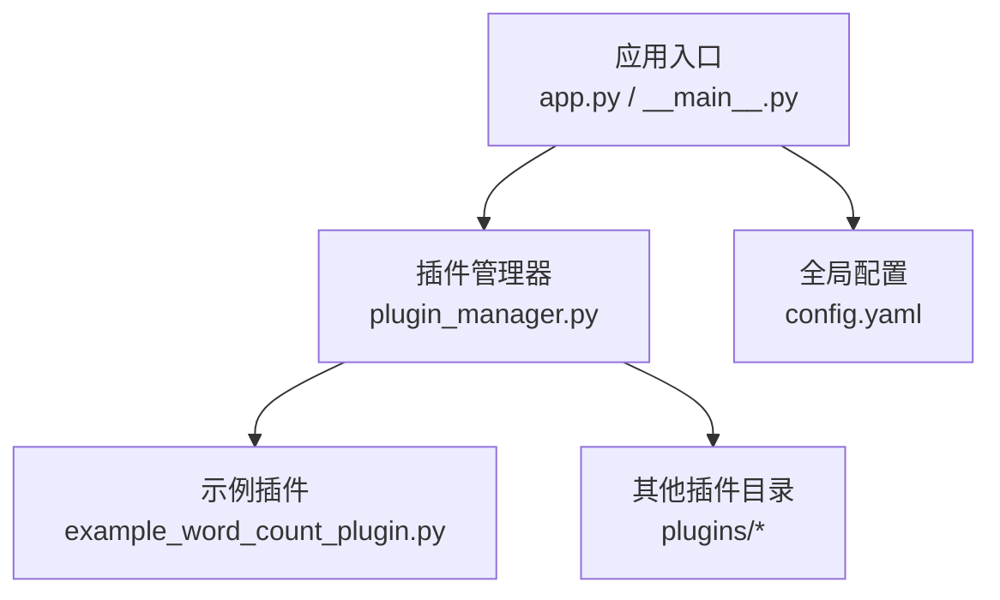
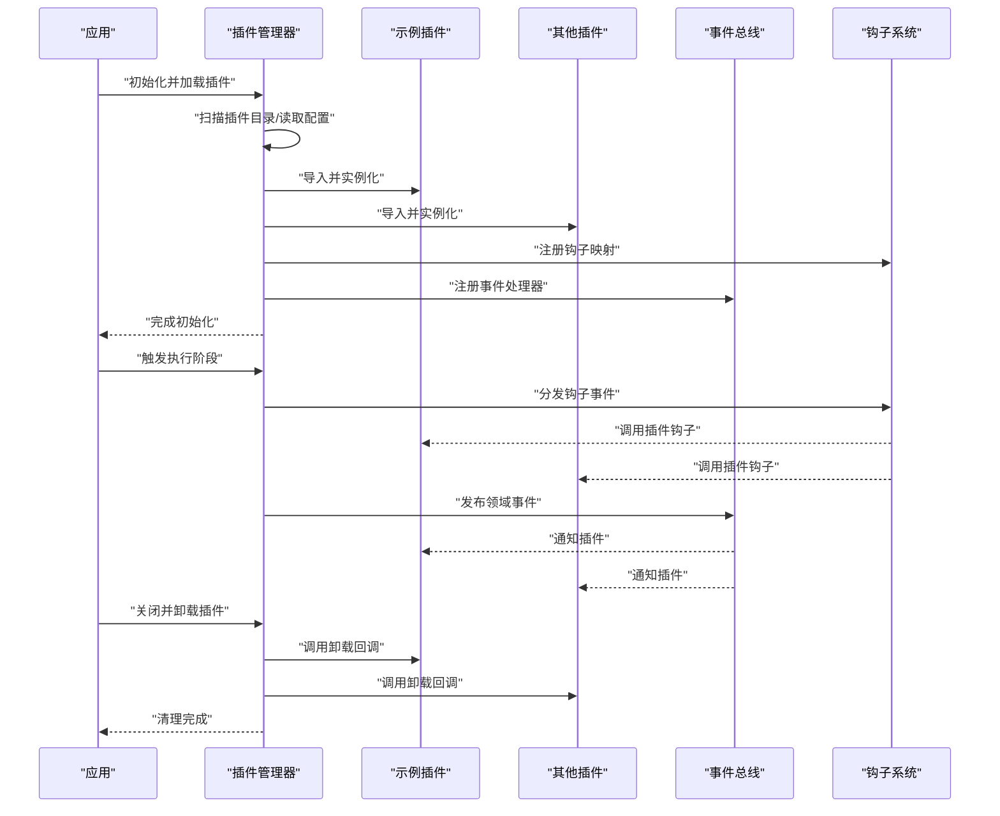
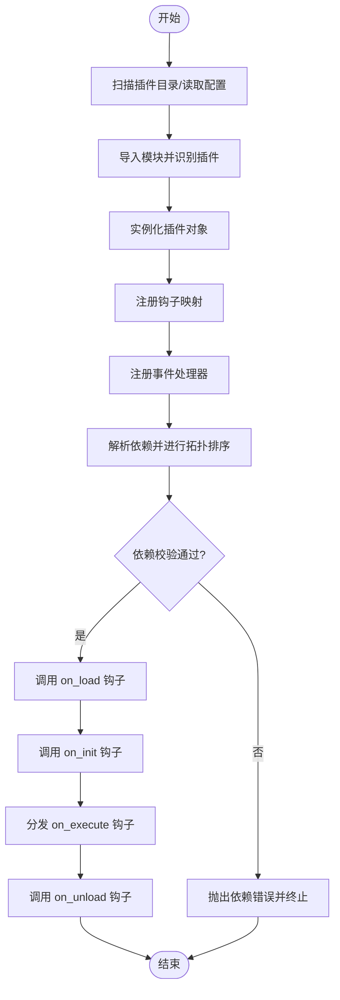
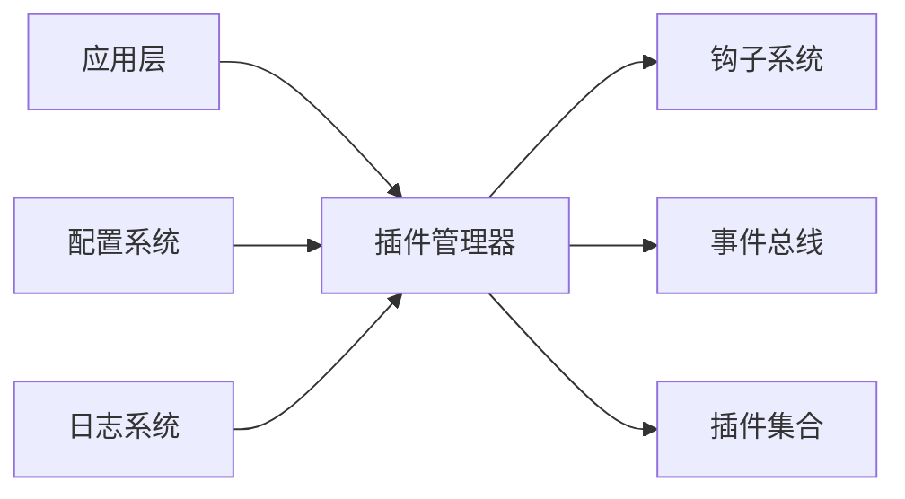

# 插件架构设计

<cite>
**本文引用的文件**   
- [src/paper_format_corrector/infra/plugin_manager.py](file://src/paper_format_corrector/infra/plugin_manager.py)
- [plugins/example_word_count_plugin.py](file://plugins/example_word_count_plugin.py)
- [src/paper_format_corrector/app.py](file://src/paper_format_corrector/app.py)
- [src/paper_format_corrector/__main__.py](file://src/paper_format_corrector/__main__.py)
- [config/config.yaml](file://config/config.yaml)
</cite>

## 目录
1. [简介](#简介)
2. [项目结构](#项目结构)
3. [核心组件](#核心组件)
4. [架构总览](#架构总览)
5. [详细组件分析](#详细组件分析)
6. [依赖分析](#依赖分析)
7. [性能考虑](#性能考虑)
8. [故障排查指南](#故障排查指南)
9. [结论](#结论)
10. [附录](#附录)

## 简介
本技术文档围绕“论文格式矫正工具”的插件架构进行系统化说明，重点覆盖以下方面：
- 插件管理器的工作原理与职责边界
- 插件接口定义与扩展点机制
- 插件生命周期管理（加载、初始化、执行、卸载）
- 插件间通信机制、事件驱动模式与钩子系统
- 插件注册机制的实现原理（动态发现与依赖解析）
- 安全隔离机制与资源管理策略
- 架构图与交互流程图，帮助开发者快速理解并扩展系统

## 项目结构
从仓库结构看，插件相关代码主要位于 infra 层与 plugins 目录：
- infra/plugin_manager.py：插件管理器的实现，负责插件的发现、加载、生命周期管理与调度
- plugins/example_word_count_plugin.py：示例插件，展示插件应遵循的约定与能力
- app.py 与 __main__.py：应用启动入口，负责初始化基础设施（包括插件管理器）
- config/config.yaml：全局配置，可能包含插件扫描路径、启用开关等

图示来源
- [src/paper_format_corrector/app.py](file://src/paper_format_corrector/app.py)
- [src/paper_format_corrector/__main__.py](file://src/paper_format_corrector/__main__.py)
- [src/paper_format_corrector/infra/plugin_manager.py](file://src/paper_format_corrector/infra/plugin_manager.py)
- [plugins/example_word_count_plugin.py](file://plugins/example_word_count_plugin.py)
- [config/config.yaml](file://config/config.yaml)

章节来源
- [src/paper_format_corrector/infra/plugin_manager.py](file://src/paper_format_corrector/infra/plugin_manager.py)
- [plugins/example_word_count_plugin.py](file://plugins/example_word_count_plugin.py)
- [src/paper_format_corrector/app.py](file://src/paper_format_corrector/app.py)
- [src/paper_format_corrector/__main__.py](file://src/paper_format_corrector/__main__.py)
- [config/config.yaml](file://config/config.yaml)

## 核心组件
- 插件管理器（PluginManager）
  - 职责：插件发现、加载、注册、生命周期管理、钩子分发、事件总线协调、依赖解析、错误处理与日志记录
  - 关键能力：
    - 动态发现：按约定目录或配置扫描可加载模块
    - 加载与实例化：导入模块、识别插件类/函数、构造实例
    - 生命周期：提供 on_load、on_init、on_execute、on_unload 等阶段回调
    - 钩子与事件：维护钩子表与事件订阅，支持多插件协作
    - 依赖解析：基于声明式依赖关系进行拓扑排序与校验
    - 安全隔离：限制插件对敏感资源的访问，采用白名单与沙箱策略
    - 资源管理：统一分配与回收临时资源、句柄、缓存等
- 示例插件（WordCountPlugin）
  - 职责：演示如何声明元数据、注册钩子、响应事件、在指定阶段执行逻辑
  - 约定：遵循插件接口契约（如元数据字段、方法签名、异常规范）

章节来源
- [src/paper_format_corrector/infra/plugin_manager.py](file://src/paper_format_corrector/infra/plugin_manager.py)
- [plugins/example_word_count_plugin.py](file://plugins/example_word_count_plugin.py)

## 架构总览
下图展示了插件系统与应用的交互关系以及插件内部的关键流程。

图示来源
- [src/paper_format_corrector/infra/plugin_manager.py](file://src/paper_format_corrector/infra/plugin_manager.py)
- [plugins/example_word_count_plugin.py](file://plugins/example_word_count_plugin.py)
- [src/paper_format_corrector/app.py](file://src/paper_format_corrector/app.py)
- [src/paper_format_corrector/__main__.py](file://src/paper_format_corrector/__main__.py)

## 详细组件分析

### 插件管理器（PluginManager）
- 设计要点
  - 插件发现：支持按目录扫描与配置文件驱动两种模式；可通过配置项控制是否启用某插件
  - 加载与实例化：使用安全的导入机制，捕获导入异常并记录日志；为每个插件创建独立上下文
  - 生命周期管理：
    - on_load：模块级初始化（如读取静态资源）
    - on_init：实例级初始化（如连接外部服务、构建索引）
    - on_execute：业务执行阶段（由管理器按顺序或并行调度）
    - on_unload：资源释放与状态清理
  - 钩子系统：以“钩子名 -> 处理器列表”的形式维护，支持优先级与短路策略
  - 事件总线：基于发布-订阅模型，允许插件之间解耦通信
  - 依赖解析：通过声明依赖图进行拓扑排序，检测循环依赖并报错
  - 安全隔离：限制文件系统、网络、进程等敏感操作；提供白名单与最小权限原则
  - 资源管理：集中管理临时目录、缓存、线程池等资源，确保在卸载时正确释放
- 关键流程（加载与执行）

图示来源
- [src/paper_format_corrector/infra/plugin_manager.py](file://src/paper_format_corrector/infra/plugin_manager.py)

章节来源
- [src/paper_format_corrector/infra/plugin_manager.py](file://src/paper_format_corrector/infra/plugin_manager.py)

### 示例插件（WordCountPlugin）
- 设计要点
  - 元数据声明：插件名称、版本、描述、依赖列表、支持的钩子类型
  - 钩子实现：在特定阶段（如文档预处理、统计输出）插入自定义逻辑
  - 事件订阅：监听系统事件（如文档加载完成、导出完成），执行副作用（如上报指标）
  - 资源使用：按需申请临时资源并在卸载时释放
- 典型用法
  - 在 on_execute 中计算文档字数并写入报告
  - 在 on_init 中建立缓存或索引以提升后续执行效率
  - 在 on_unload 中清理缓存与临时文件

章节来源
- [plugins/example_word_count_plugin.py](file://plugins/example_word_count_plugin.py)

### 应用集成（app.py / __main__.py）
- 启动流程
  - 初始化配置（读取 config.yaml）
  - 初始化插件管理器并加载插件
  - 将插件管理器注入到上层服务（如格式化器、导出器）
  - 在业务流程中触发相应钩子或事件
- 关闭流程
  - 触发插件卸载，确保资源释放
  - 关闭事件总线与钩子系统

章节来源
- [src/paper_format_corrector/app.py](file://src/paper_format_corrector/app.py)
- [src/paper_format_corrector/__main__.py](file://src/paper_format_corrector/__main__.py)
- [config/config.yaml](file://config/config.yaml)

## 依赖分析
- 组件耦合
  - 应用层仅依赖插件管理器接口，不直接感知具体插件实现，符合开闭原则
  - 插件之间通过事件总线与钩子系统间接通信，降低直接耦合
- 外部依赖
  - 配置系统：用于控制插件扫描路径、启用开关、超时与并发参数
  - 日志系统：记录插件加载、执行与错误信息，便于排障
- 潜在风险
  - 循环依赖：需在依赖解析阶段严格检测并给出明确错误提示
  - 资源泄漏：需确保所有打开的文件句柄、网络连接等在卸载阶段释放
  - 性能瓶颈：大量插件串行执行可能导致延迟，建议支持并行与优先级调度

图示来源
- [src/paper_format_corrector/infra/plugin_manager.py](file://src/paper_format_corrector/infra/plugin_manager.py)
- [src/paper_format_corrector/app.py](file://src/paper_format_corrector/app.py)
- [config/config.yaml](file://config/config.yaml)

章节来源
- [src/paper_format_corrector/infra/plugin_manager.py](file://src/paper_format_corrector/infra/plugin_manager.py)
- [src/paper_format_corrector/app.py](file://src/paper_format_corrector/app.py)
- [config/config.yaml](file://config/config.yaml)

## 性能考虑
- 加载优化
  - 懒加载：仅在首次使用时加载插件，减少启动时间
  - 增量发现：变更监控与增量扫描，避免全量重复扫描
- 执行优化
  - 并行执行：对无依赖的插件钩子进行并行调度
  - 优先级与短路：高优先级钩子可提前返回，避免不必要的后续处理
- 资源优化
  - 共享缓存：在插件管理器层面提供跨插件缓存，减少重复计算
  - 资源池：复用 IO 连接、线程池等，降低开销

[本节为通用指导，无需列出具体文件来源]

## 故障排查指南
- 常见问题
  - 插件未加载：检查扫描路径与配置项是否正确；查看日志中的导入异常
  - 依赖解析失败：确认依赖声明是否完整且无循环；根据错误定位缺失依赖
  - 钩子未触发：核对钩子名与注册映射是否一致；检查优先级与短路逻辑
  - 资源泄漏：在 on_unload 中补充释放逻辑；使用资源审计工具验证
- 诊断手段
  - 开启调试日志，记录插件加载、执行与错误堆栈
  - 使用健康检查接口获取插件状态与依赖图
  - 针对长时间运行的任务设置超时与熔断保护

章节来源
- [src/paper_format_corrector/infra/plugin_manager.py](file://src/paper_format_corrector/infra/plugin_manager.py)

## 结论
该插件架构通过清晰的职责划分与解耦机制，实现了可扩展、可维护的系统设计。插件管理器作为中枢，统一管理插件的生命周期、钩子分发、事件通信与依赖解析，同时提供安全隔离与资源管理策略，保障系统的稳定性与安全性。开发者可基于既定接口与约定快速实现新插件，并通过事件与钩子与其他插件协作，形成灵活的业务扩展生态。

[本节为总结性内容，无需列出具体文件来源]

## 附录
- 插件开发最佳实践
  - 明确元数据与依赖声明，避免运行时错误
  - 在 on_init 中准备必要资源，在 on_unload 中彻底释放
  - 使用事件总线进行跨插件通信，避免直接引用
  - 合理设置钩子优先级，避免阻塞主流程
  - 做好异常处理与日志记录，提升可观测性
- 配置参考
  - 插件扫描路径、启用开关、超时与并发参数等可在配置文件中调整

章节来源
- [config/config.yaml](file://config/config.yaml)