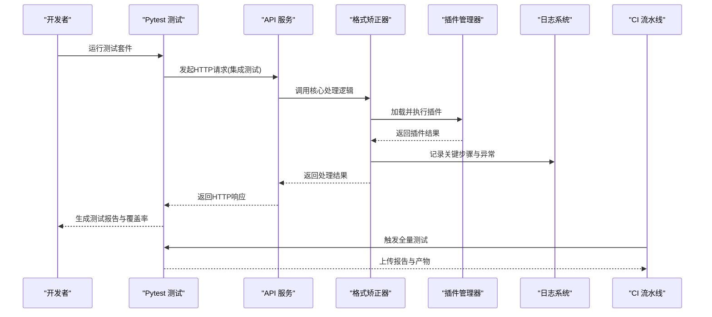
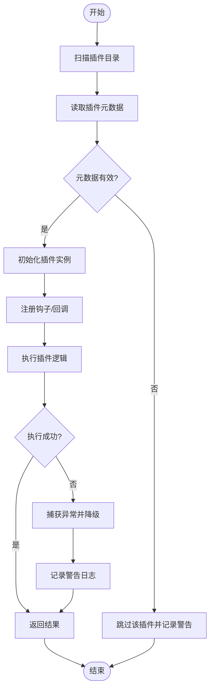
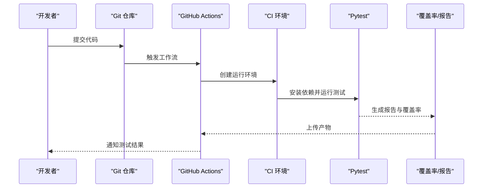
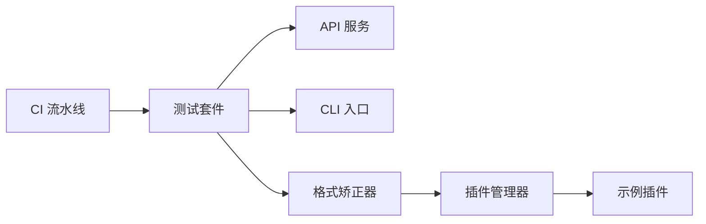

# 测试与调试

<cite>
**本文引用的文件**   
- [README.md](file://README.md)
- [pyproject.toml](file://pyproject.toml)
- [requirements.txt](file://requirements.txt)
- [.github/workflows/ci.yml](file://.github/workflows/ci.yml)
- [tests/conftest.py](file://tests/conftest.py)
- [tests/test_basic.py](file://tests/test_basic.py)
- [tests/test_api_endpoints.py](file://tests/test_api_endpoints.py)
- [tests/test_cli_integration.py](file://tests/test_cli_integration.py)
- [tests/test_corrector.py](file://tests/test_corrector.py)
- [src/paper_format_corrector/infra/logger.py](file://src/paper_format_corrector/infra/logger.py)
- [src/paper_format_corrector/api/app.py](file://src/paper_format_corrector/api/app.py)
- [src/paper_format_corrector/cli.py](file://src/paper_format_corrector/cli.py)
- [src/paper_format_corrector/core/format_corrector.py](file://src/paper_format_corrector/core/format_corrector.py)
- [src/paper_format_corrector/infra/plugin_manager.py](file://src/paper_format_corrector/infra/plugin_manager.py)
- [plugins/example_word_count_plugin.py](file://plugins/example_word_count_plugin.py)
</cite>

## 目录
1. [简介](#简介)
2. [项目结构](#项目结构)
3. [核心组件](#核心组件)
4. [架构总览](#架构总览)
5. [详细组件分析](#详细组件分析)
6. [依赖分析](#依赖分析)
7. [性能考虑](#性能考虑)
8. [故障排查指南](#故障排查指南)
9. [结论](#结论)
10. [附录](#附录)

## 简介
本章节面向插件开发与维护者，提供一套完整的“测试与调试”实践指南。内容覆盖：
- 插件测试框架使用方法与用例编写规范
- 单元测试、集成测试与端到端测试策略
- 调试技巧与工具（日志分析、断点调试、性能监控）
- 测试数据准备与模拟对象使用
- 自动化测试流程与持续集成配置
- 常见问题诊断与解决方案
- 测试覆盖率统计与质量保证最佳实践
- 插件兼容性测试与回归测试方法

## 项目结构
仓库采用分层与按功能组织相结合的结构。测试相关的关键位置如下：
- tests：Pytest 测试套件，包含单元、集成与端到端用例
- src/paper_format_corrector：应用核心与基础设施实现
- plugins：示例插件，用于验证插件加载与运行
- .github/workflows/ci.yml：GitHub Actions 持续集成流水线
- pyproject.toml：构建与测试配置入口
- requirements.txt：运行时与开发依赖清单
- README.md：项目说明与快速上手

```mermaid
graph TB
subgraph "测试"
T_Conf["tests/conftest.py"]
T_Unit["tests/test_basic.py"]
T_API["tests/test_api_endpoints.py"]
T_CLI["tests/test_cli_integration.py"]
T_Core["tests/test_corrector.py"]
end
subgraph "应用"
A_App["src/paper_format_corrector/api/app.py"]
A_Cli["src/paper_format_corrector/cli.py"]
A_Core["src/paper_format_corrector/core/format_corrector.py"]
A_Logger["src/paper_format_corrector/infra/logger.py"]
A_PluginMgr["src/paper_format_corrector/infra/plugin_manager.py"]
end
subgraph "插件"
P_Example["plugins/example_word_count_plugin.py"]
end
subgraph "CI"
CI[".github/workflows/ci.yml"]
end
T_Conf --> T_Unit
T_Conf --> T_API
T_Conf --> T_CLI
T_Conf --> T_Core
T_API --> A_App
T_CLI --> A_Cli
T_Core --> A_Core
T_Core --> A_PluginMgr
A_Core --> A_Logger
A_Core --> A_PluginMgr
A_PluginMgr --> P_Example
CI --> T_Unit
CI --> T_API
CI --> T_CLI
CI --> T_Core
```

图表来源
- [tests/conftest.py](file://tests/conftest.py)
- [tests/test_basic.py](file://tests/test_basic.py)
- [tests/test_api_endpoints.py](file://tests/test_api_endpoints.py)
- [tests/test_cli_integration.py](file://tests/test_cli_integration.py)
- [tests/test_corrector.py](file://tests/test_corrector.py)
- [src/paper_format_corrector/api/app.py](file://src/paper_format_corrector/api/app.py)
- [src/paper_format_corrector/cli.py](file://src/paper_format_corrector/cli.py)
- [src/paper_format_corrector/core/format_corrector.py](file://src/paper_format_corrector/core/format_corrector.py)
- [src/paper_format_corrector/infra/logger.py](file://src/paper_format_corrector/infra/logger.py)
- [src/paper_format_corrector/infra/plugin_manager.py](file://src/paper_format_corrector/infra/plugin_manager.py)
- [plugins/example_word_count_plugin.py](file://plugins/example_word_count_plugin.py)
- [.github/workflows/ci.yml](file://.github/workflows/ci.yml)

章节来源
- [README.md](file://README.md)
- [pyproject.toml](file://pyproject.toml)
- [requirements.txt](file://requirements.txt)
- [.github/workflows/ci.yml](file://.github/workflows/ci.yml)

## 核心组件
本节聚焦于测试与调试相关的核心组件及其职责：
- 测试配置与夹具：conftest.py 集中管理测试环境、共享夹具与全局设置
- API 测试：通过 HTTP 客户端调用接口，校验请求/响应与状态码
- CLI 集成测试：以子进程或命令行方式执行，验证入口行为
- 核心逻辑测试：针对格式矫正器与插件管理器进行单元与集成验证
- 日志系统：统一日志输出，便于定位问题与分析性能
- 插件管理器：负责插件发现、加载与生命周期管理，是插件兼容性与回归测试的重点

章节来源
- [tests/conftest.py](file://tests/conftest.py)
- [tests/test_api_endpoints.py](file://tests/test_api_endpoints.py)
- [tests/test_cli_integration.py](file://tests/test_cli_integration.py)
- [tests/test_corrector.py](file://tests/test_corrector.py)
- [src/paper_format_corrector/infra/logger.py](file://src/paper_format_corrector/infra/logger.py)
- [src/paper_format_corrector/infra/plugin_manager.py](file://src/paper_format_corrector/infra/plugin_manager.py)

## 架构总览
下图展示从测试到应用的交互路径，以及 CI 如何驱动测试与质量门禁。



图表来源
- [tests/test_api_endpoints.py](file://tests/test_api_endpoints.py)
- [src/paper_format_corrector/api/app.py](file://src/paper_format_corrector/api/app.py)
- [src/paper_format_corrector/core/format_corrector.py](file://src/paper_format_corrector/core/format_corrector.py)
- [src/paper_format_corrector/infra/plugin_manager.py](file://src/paper_format_corrector/infra/plugin_manager.py)
- [src/paper_format_corrector/infra/logger.py](file://src/paper_format_corrector/infra/logger.py)
- [.github/workflows/ci.yml](file://.github/workflows/ci.yml)

## 详细组件分析

### 测试框架与用例编写规范
- 测试框架：基于 Pytest，支持参数化、标记与插件扩展
- 命名约定：测试文件以 test_*.py 命名；函数以 test_ 开头
- 夹具组织：在 conftest.py 中定义可复用的夹具，避免重复代码
- 断言风格：优先使用 assert 与第三方库提供的领域断言（如 JSON 结构、文档对象属性）
- 隔离原则：单元测试尽量无外部依赖；集成测试明确标注范围与资源需求

章节来源
- [tests/conftest.py](file://tests/conftest.py)
- [tests/test_basic.py](file://tests/test_basic.py)

### 单元测试策略
- 目标：验证核心模块的输入输出与边界条件
- 重点模块：
  - 格式矫正器：规则解析、样式应用、文档结构变更
  - 插件管理器：插件发现、加载、错误恢复
- 模拟对象：对 I/O、网络、外部工具进行 mock，确保稳定与快速
- 数据准备：使用 fixtures 构造最小可复现的输入样例

章节来源
- [tests/test_corrector.py](file://tests/test_corrector.py)
- [src/paper_format_corrector/core/format_corrector.py](file://src/paper_format_corrector/core/format_corrector.py)
- [src/paper_format_corrector/infra/plugin_manager.py](file://src/paper_format_corrector/infra/plugin_manager.py)

### 集成测试策略
- API 集成：启动轻量服务或使用测试客户端，发送真实请求并校验响应
- CLI 集成：以命令行方式执行，检查退出码、标准输出与文件产出
- 数据库/文件系统：使用临时目录与内存存储，避免污染宿主环境
- 端到端场景：从模板加载、规则应用到导出结果的完整链路

章节来源
- [tests/test_api_endpoints.py](file://tests/test_api_endpoints.py)
- [tests/test_cli_integration.py](file://tests/test_cli_integration.py)
- [src/paper_format_corrector/api/app.py](file://src/paper_format_corrector/api/app.py)
- [src/paper_format_corrector/cli.py](file://src/paper_format_corrector/cli.py)

### 插件测试与兼容性
- 插件发现：验证插件目录扫描与元数据读取
- 加载与执行：确认插件初始化、钩子注册与执行顺序
- 错误恢复：插件抛出异常时，系统应降级并继续运行
- 兼容性矩阵：针对不同 Python 版本、依赖版本与平台进行回归测试
- 示例插件：通过 example_word_count_plugin.py 验证基本能力



图表来源
- [src/paper_format_corrector/infra/plugin_manager.py](file://src/paper_format_corrector/infra/plugin_manager.py)
- [plugins/example_word_count_plugin.py](file://plugins/example_word_count_plugin.py)

章节来源
- [src/paper_format_corrector/infra/plugin_manager.py](file://src/paper_format_corrector/infra/plugin_manager.py)
- [plugins/example_word_count_plugin.py](file://plugins/example_word_count_plugin.py)

### 调试技巧与工具
- 日志分析：
  - 统一日志输出，关注关键步骤、异常堆栈与耗时
  - 结合日志级别过滤，定位问题范围
- 断点调试：
  - 在核心处理链路与插件钩子处设置断点
  - 使用 IDE 远程调试或附加进程的方式
- 性能监控：
  - 记录热点函数耗时与内存占用
  - 对比不同插件组合的执行时间

章节来源
- [src/paper_format_corrector/infra/logger.py](file://src/paper_format_corrector/infra/logger.py)
- [src/paper_format_corrector/core/format_corrector.py](file://src/paper_format_corrector/core/format_corrector.py)

### 测试数据准备与模拟对象
- 数据准备：
  - 使用 fixtures 创建最小输入样本与期望输出
  - 将大文件或复杂结构拆分为片段，提升测试速度
- 模拟对象：
  - 对外部 I/O、网络请求、第三方工具进行 mock
  - 使用上下文管理器清理临时资源，保证测试隔离

章节来源
- [tests/conftest.py](file://tests/conftest.py)
- [tests/test_basic.py](file://tests/test_basic.py)

### 自动化测试流程与持续集成
- 本地运行：
  - 安装依赖后执行测试套件，生成报告与覆盖率
- CI 流水线：
  - 多 Python 版本并行执行
  - 缓存依赖与测试数据，缩短构建时间
  - 上传测试报告与覆盖率结果，设置质量门禁



图表来源
- [.github/workflows/ci.yml](file://.github/workflows/ci.yml)
- [pyproject.toml](file://pyproject.toml)
- [requirements.txt](file://requirements.txt)

章节来源
- [.github/workflows/ci.yml](file://.github/workflows/ci.yml)
- [pyproject.toml](file://pyproject.toml)
- [requirements.txt](file://requirements.txt)

### 常见问题诊断与解决方案
- 插件加载失败：
  - 检查插件元数据与依赖声明
  - 查看日志中的异常堆栈与警告信息
- API 超时或错误：
  - 确认服务启动与端口占用
  - 检查请求体结构与鉴权头
- CLI 执行异常：
  - 验证环境变量与配置文件路径
  - 使用最小输入样例复现问题
- 性能退化：
  - 定位热点函数与插件执行时间
  - 优化 I/O 与算法复杂度

章节来源
- [src/paper_format_corrector/infra/logger.py](file://src/paper_format_corrector/infra/logger.py)
- [src/paper_format_corrector/api/app.py](file://src/paper_format_corrector/api/app.py)
- [src/paper_format_corrector/cli.py](file://src/paper_format_corrector/cli.py)
- [src/paper_format_corrector/infra/plugin_manager.py](file://src/paper_format_corrector/infra/plugin_manager.py)

### 测试覆盖率统计与质量保证
- 覆盖率工具：
  - 使用覆盖率插件收集行覆盖率与分支覆盖率
  - 设定阈值作为合并门禁
- 质量门禁：
  - 静态检查、格式化与类型检查
  - 安全扫描与依赖漏洞检测
- 报告可视化：
  - 生成 HTML 报告并在 CI 中归档

章节来源
- [pyproject.toml](file://pyproject.toml)
- [.github/workflows/ci.yml](file://.github/workflows/ci.yml)

### 插件兼容性测试与回归测试
- 兼容性矩阵：
  - 多 Python 版本、操作系统与依赖版本组合
  - 不同模板与预设配置的交叉验证
- 回归测试：
  - 保留历史用例与基准数据
  - 自动比对输出差异，防止回退

章节来源
- [.github/workflows/ci.yml](file://.github/workflows/ci.yml)
- [tests/test_corrector.py](file://tests/test_corrector.py)

## 依赖分析
测试与调试涉及的依赖关系如下：
- 测试层依赖应用层接口与核心逻辑
- 插件管理器为核心逻辑的扩展点，需纳入测试范围
- CI 依赖构建与测试配置，驱动自动化流程



图表来源
- [tests/test_api_endpoints.py](file://tests/test_api_endpoints.py)
- [tests/test_cli_integration.py](file://tests/test_cli_integration.py)
- [tests/test_corrector.py](file://tests/test_corrector.py)
- [src/paper_format_corrector/api/app.py](file://src/paper_format_corrector/api/app.py)
- [src/paper_format_corrector/cli.py](file://src/paper_format_corrector/cli.py)
- [src/paper_format_corrector/core/format_corrector.py](file://src/paper_format_corrector/core/format_corrector.py)
- [src/paper_format_corrector/infra/plugin_manager.py](file://src/paper_format_corrector/infra/plugin_manager.py)
- [plugins/example_word_count_plugin.py](file://plugins/example_word_count_plugin.py)
- [.github/workflows/ci.yml](file://.github/workflows/ci.yml)

章节来源
- [pyproject.toml](file://pyproject.toml)
- [requirements.txt](file://requirements.txt)

## 性能考虑
- 测试性能：
  - 使用内存存储与临时目录，减少磁盘 I/O
  - 并行执行测试，缩短反馈时间
- 插件性能：
  - 限制插件执行时间与资源占用
  - 对长耗时操作进行异步或批处理
- 监控指标：
  - 记录 CPU、内存与 I/O 指标
  - 建立基线并定期回归

[本节为通用指导，不直接分析具体文件]

## 故障排查指南
- 日志定位：
  - 开启详细日志级别，收集关键上下文
  - 使用结构化日志字段进行检索与聚合
- 断点调试：
  - 在插件钩子与核心处理链设置断点
  - 逐步执行并观察状态变化
- 性能剖析：
  - 使用剖析工具识别热点
  - 对比不同版本的执行时间

章节来源
- [src/paper_format_corrector/infra/logger.py](file://src/paper_format_corrector/infra/logger.py)
- [src/paper_format_corrector/core/format_corrector.py](file://src/paper_format_corrector/core/format_corrector.py)
- [src/paper_format_corrector/infra/plugin_manager.py](file://src/paper_format_corrector/infra/plugin_manager.py)

## 结论
通过系统的测试策略、完善的调试手段与严格的 CI 质量门禁，可有效保障插件的稳定性和兼容性。建议团队遵循本文档的实践，持续提升代码质量与交付效率。

[本节为总结性内容，不直接分析具体文件]

## 附录
- 快速命令参考：
  - 安装依赖：根据 requirements.txt 安装
  - 运行测试：使用测试框架执行全部用例
  - 生成覆盖率：启用覆盖率插件并输出报告
- 常用路径：
  - 测试套件：tests
  - 插件目录：plugins
  - 应用源码：src/paper_format_corrector
  - CI 配置：.github/workflows/ci.yml

章节来源
- [requirements.txt](file://requirements.txt)
- [tests/conftest.py](file://tests/conftest.py)
- [plugins/example_word_count_plugin.py](file://plugins/example_word_count_plugin.py)
- [src/paper_format_corrector/infra/logger.py](file://src/paper_format_corrector/infra/logger.py)
- [.github/workflows/ci.yml](file://.github/workflows/ci.yml)