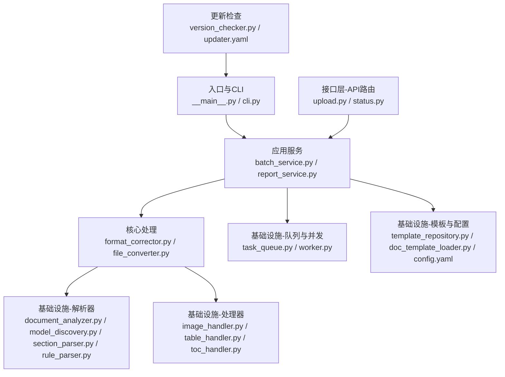
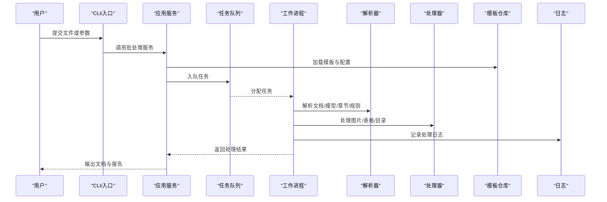
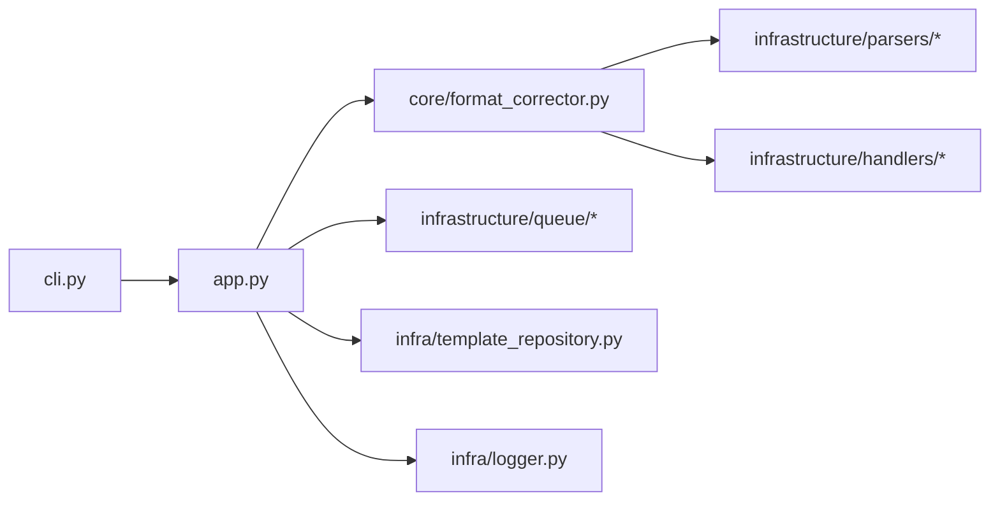

# 故障排除与FAQ

<cite>
**本文引用的文件**   
- [README.md](file://README.md)
- [requirements.txt](file://requirements.txt)
- [pyproject.toml](file://pyproject.toml)
- [run.py](file://run.py)
- [src/paper_format_corrector/__main__.py](file://src/paper_format_corrector/__main__.py)
- [src/paper_format_corrector/app.py](file://src/paper_format_corrector/app.py)
- [src/paper_format_corrector/cli.py](file://src/paper_format_corrector/cli.py)
- [src/paper_format_corrector/infra/logger.py](file://src/paper_format_corrector/infra/logger.py)
- [src/paper_format_corrector/infra/template_repository.py](file://src/paper_format_corrector/infra/template_repository.py)
- [src/paper_format_corrector/infra/doc_template_loader.py](file://src/paper_format_corrector/infra/doc_template_loader.py)
- [src/paper_format_corrector/core/format_corrector.py](file://src/paper_format_corrector/core/format_corrector.py)
- [src/paper_format_corrector/core/file_converter.py](file://src/paper_format_corrector/core/file_converter.py)
- [src/paper_format_corrector/infrastructure/converters/file_converter.py](file://src/paper_format_corrector/infrastructure/converters/file_converter.py)
- [src/paper_format_corrector/infrastructure/converters/file_formatter.py](file://src/paper_format_corrector/infrastructure/converters/file_formatter.py)
- [src/paper_format_corrector/infrastructure/handlers/image_handler.py](file://src/paper_format_corrector/infrastructure/handlers/image_handler.py)
- [src/paper_format_corrector/infrastructure/handlers/table_handler.py](file://src/paper_format_corrector/infrastructure/handlers/table_handler.py)
- [src/paper_format_corrector/infrastructure/handlers/toc_handler.py](file://src/paper_format_corrector/infrastructure/handlers/toc_handler.py)
- [src/paper_format_corrector/infrastructure/parsers/document_analyzer.py](file://src/paper_format_corrector/infrastructure/parsers/document_analyzer.py)
- [src/paper_format_corrector/infrastructure/parsers/model_discovery.py](file://src/paper_format_corrector/infrastructure/parsers/model_discovery.py)
- [src/paper_format_corrector/infrastructure/parsers/section_parser.py](file://src/paper_format_corrector/infrastructure/parsers/section_parser.py)
- [src/paper_format_corrector/infrastructure/parsers/rule_parser.py](file://src/paper_format_corrector/infrastructure/parsers/rule_parser.py)
- [src/paper_format_corrector/infrastructure/queue/task_queue.py](file://src/paper_format_corrector/infrastructure/queue/task_queue.py)
- [src/paper_format_corrector/infrastructure/queue/worker.py](file://src/paper_format_corrector/infrastructure/queue/worker.py)
- [src/paper_format_corrector/application/services/batch_service.py](file://src/paper_format_corrector/application/services/batch_service.py)
- [src/paper_format_corrector/application/services/report_service.py](file://src/paper_format_corrector/application/services/report_service.py)
- [src/paper_format_corrector/application/services/template_validation_service.py](file://src/paper_format_corrector/application/services/template_validation_service.py)
- [src/paper_format_corrector/interfaces/api/routes/upload.py](file://src/paper_format_corrector/interfaces/api/routes/upload.py)
- [src/paper_format_corrector/interfaces/api/routes/status.py](file://src/paper_format_corrector/interfaces/api/routes/status.py)
- [src/paper_format_corrector/infra/updater/version_checker.py](file://src/paper_format_corrector/infra/updater/version_checker.py)
- [config/config.yaml](file://config/config.yaml)
- [config/updater.yaml](file://config/updater.yaml)
- [presets/templates_index.yaml](file://presets/templates_index.yaml)
- [tests/test_cli_integration.py](file://tests/test_cli_integration.py)
- [tests/test_task_queue.py](file://tests/test_task_queue.py)
- [tests/test_template_repository.py](file://tests/test_template_repository.py)
</cite>

## 目录
1. [简介](#简介)
2. [项目结构](#项目结构)
3. [核心组件](#核心组件)
4. [架构总览](#架构总览)
5. [详细组件分析](#详细组件分析)
6. [依赖关系分析](#依赖关系分析)
7. [性能考虑](#性能考虑)
8. [故障排除指南](#故障排除指南)
9. [结论](#结论)
10. [附录](#附录)

## 简介
本指南聚焦于论文格式矫正工具在真实使用中的常见问题与解决方案，覆盖安装、配置、格式识别、性能调优、日志诊断、调试命令、社区支持与版本升级等主题。文档面向不同技术背景的用户，提供从入门到进阶的排障路径，并给出最佳实践建议，帮助用户避免常见陷阱。

## 项目结构
本项目采用分层与模块化组织方式：
- 应用入口与CLI：提供命令行与GUI启动能力
- 核心处理：格式矫正、文件转换、导出
- 基础设施：模板仓库、解析器、处理器、队列与并发、日志与配置
- 接口层：API路由、桌面端、Web端
- 预设模板与配置：模板索引、全局配置、更新配置

图表来源
- [src/paper_format_corrector/__main__.py](file://src/paper_format_corrector/__main__.py)
- [src/paper_format_corrector/cli.py](file://src/paper_format_corrector/cli.py)
- [src/paper_format_corrector/application/services/batch_service.py](file://src/paper_format_corrector/application/services/batch_service.py)
- [src/paper_format_corrector/core/format_corrector.py](file://src/paper_format_corrector/core/format_corrector.py)
- [src/paper_format_corrector/core/file_converter.py](file://src/paper_format_corrector/core/file_converter.py)
- [src/paper_format_corrector/infrastructure/parsers/document_analyzer.py](file://src/paper_format_corrector/infrastructure/parsers/document_analyzer.py)
- [src/paper_format_corrector/infrastructure/parsers/model_discovery.py](file://src/paper_format_corrector/infrastructure/parsers/model_discovery.py)
- [src/paper_format_corrector/infrastructure/parsers/section_parser.py](file://src/paper_format_corrector/infrastructure/parsers/section_parser.py)
- [src/paper_format_corrector/infrastructure/parsers/rule_parser.py](file://src/paper_format_corrector/infrastructure/parsers/rule_parser.py)
- [src/paper_format_corrector/infrastructure/handlers/image_handler.py](file://src/paper_format_corrector/infrastructure/handlers/image_handler.py)
- [src/paper_format_corrector/infrastructure/handlers/table_handler.py](file://src/paper_format_corrector/infrastructure/handlers/table_handler.py)
- [src/paper_format_corrector/infrastructure/handlers/toc_handler.py](file://src/paper_format_corrector/infrastructure/handlers/toc_handler.py)
- [src/paper_format_corrector/infrastructure/queue/task_queue.py](file://src/paper_format_corrector/infrastructure/queue/task_queue.py)
- [src/paper_format_corrector/infrastructure/queue/worker.py](file://src/paper_format_corrector/infrastructure/queue/worker.py)
- [src/paper_format_corrector/infra/template_repository.py](file://src/paper_format_corrector/infra/template_repository.py)
- [src/paper_format_corrector/infra/doc_template_loader.py](file://src/paper_format_corrector/infra/doc_template_loader.py)
- [config/config.yaml](file://config/config.yaml)
- [src/paper_format_corrector/infra/updater/version_checker.py](file://src/paper_format_corrector/infra/updater/version_checker.py)
- [config/updater.yaml](file://config/updater.yaml)

章节来源
- [README.md](file://README.md)
- [requirements.txt](file://requirements.txt)
- [pyproject.toml](file://pyproject.toml)
- [run.py](file://run.py)
- [src/paper_format_corrector/__main__.py](file://src/paper_format_corrector/__main__.py)
- [src/paper_format_corrector/cli.py](file://src/paper_format_corrector/cli.py)

## 核心组件
- 入口与CLI：负责参数解析、环境初始化、日志配置、任务调度与结果输出
- 应用服务：编排批处理、报告生成、模板校验等业务流程
- 核心处理：执行格式矫正、文件转换、导出逻辑
- 基础设施：
  - 模板仓库与加载：管理本地/远程模板索引与加载
  - 解析器：文档结构发现、模型识别、章节解析、规则解析
  - 处理器：图片、表格、目录等元素的处理
  - 队列与并发：任务入队、工作进程、资源隔离
  - 日志与配置：统一日志输出、配置读取与合并
- 接口层：API路由（上传、状态查询）、桌面端、Web端
- 更新检查：版本检测与更新配置

章节来源
- [src/paper_format_corrector/application/services/batch_service.py](file://src/paper_format_corrector/application/services/batch_service.py)
- [src/paper_format_corrector/application/services/report_service.py](file://src/paper_format_corrector/application/services/report_service.py)
- [src/paper_format_corrector/core/format_corrector.py](file://src/paper_format_corrector/core/format_corrector.py)
- [src/paper_format_corrector/core/file_converter.py](file://src/paper_format_corrector/core/file_converter.py)
- [src/paper_format_corrector/infra/template_repository.py](file://src/paper_format_corrector/infra/template_repository.py)
- [src/paper_format_corrector/infra/doc_template_loader.py](file://src/paper_format_corrector/infra/doc_template_loader.py)
- [src/paper_format_corrector/infrastructure/parsers/document_analyzer.py](file://src/paper_format_corrector/infrastructure/parsers/document_analyzer.py)
- [src/paper_format_corrector/infrastructure/parsers/model_discovery.py](file://src/paper_format_corrector/infrastructure/parsers/model_discovery.py)
- [src/paper_format_corrector/infrastructure/parsers/section_parser.py](file://src/paper_format_corrector/infrastructure/parsers/section_parser.py)
- [src/paper_format_corrector/infrastructure/parsers/rule_parser.py](file://src/paper_format_corrector/infrastructure/parsers/rule_parser.py)
- [src/paper_format_corrector/infrastructure/handlers/image_handler.py](file://src/paper_format_corrector/infrastructure/handlers/image_handler.py)
- [src/paper_format_corrector/infrastructure/handlers/table_handler.py](file://src/paper_format_corrector/infrastructure/handlers/table_handler.py)
- [src/paper_format_corrector/infrastructure/handlers/toc_handler.py](file://src/paper_format_corrector/infrastructure/handlers/toc_handler.py)
- [src/paper_format_corrector/infrastructure/queue/task_queue.py](file://src/paper_format_corrector/infrastructure/queue/task_queue.py)
- [src/paper_format_corrector/infrastructure/queue/worker.py](file://src/paper_format_corrector/infrastructure/queue/worker.py)
- [src/paper_format_corrector/infra/logger.py](file://src/paper_format_corrector/infra/logger.py)
- [config/config.yaml](file://config/config.yaml)

## 架构总览
系统以“入口→服务→核心→基础设施”的分层架构运行，支持多入口（CLI、API、桌面）与多后端（本地/远程模板）。关键流程包括：
- 输入接收：CLI参数或API上传
- 模板选择：基于模板索引与用户配置
- 解析与矫正：文档分析、模型发现、规则应用、元素处理
- 输出与报告：生成矫正后文档与质量报告
- 并发与队列：批量任务并行处理，控制资源占用

图表来源
- [src/paper_format_corrector/cli.py](file://src/paper_format_corrector/cli.py)
- [src/paper_format_corrector/application/services/batch_service.py](file://src/paper_format_corrector/application/services/batch_service.py)
- [src/paper_format_corrector/infrastructure/queue/task_queue.py](file://src/paper_format_corrector/infrastructure/queue/task_queue.py)
- [src/paper_format_corrector/infrastructure/queue/worker.py](file://src/paper_format_corrector/infrastructure/queue/worker.py)
- [src/paper_format_corrector/infrastructure/parsers/document_analyzer.py](file://src/paper_format_corrector/infrastructure/parsers/document_analyzer.py)
- [src/paper_format_corrector/infrastructure/parsers/model_discovery.py](file://src/paper_format_corrector/infrastructure/parsers/model_discovery.py)
- [src/paper_format_corrector/infrastructure/parsers/section_parser.py](file://src/paper_format_corrector/infrastructure/parsers/section_parser.py)
- [src/paper_format_corrector/infrastructure/parsers/rule_parser.py](file://src/paper_format_corrector/infrastructure/parsers/rule_parser.py)
- [src/paper_format_corrector/infrastructure/handlers/image_handler.py](file://src/paper_format_corrector/infrastructure/handlers/image_handler.py)
- [src/paper_format_corrector/infrastructure/handlers/table_handler.py](file://src/paper_format_corrector/infrastructure/handlers/table_handler.py)
- [src/paper_format_corrector/infrastructure/handlers/toc_handler.py](file://src/paper_format_corrector/infrastructure/handlers/toc_handler.py)
- [src/paper_format_corrector/infra/template_repository.py](file://src/paper_format_corrector/infra/template_repository.py)
- [src/paper_format_corrector/infra/logger.py](file://src/paper_format_corrector/infra/logger.py)

## 详细组件分析

### 安装与环境问题
- Python版本与依赖不匹配
  - 现象：导入失败、模块缺失、运行时异常
  - 排查：核对Python版本、虚拟环境激活、依赖安装是否成功
  - 参考：依赖清单与包元数据
- 权限与路径问题
  - 现象：无法写入输出目录、模板加载失败
  - 排查：确认目标路径存在且可写；检查配置文件中的路径是否正确
- 网络与代理
  - 现象：模板同步失败、更新检查失败
  - 排查：检查网络连通性、代理设置、证书信任链

章节来源
- [requirements.txt](file://requirements.txt)
- [pyproject.toml](file://pyproject.toml)
- [config/config.yaml](file://config/config.yaml)

### 配置错误与模板加载失败
- 模板索引无效或缺失
  - 现象：找不到模板、默认模板回退异常
  - 排查：验证模板索引文件完整性、路径正确性、权限
- 自定义模板语法错误
  - 现象：模板校验失败、规则解析异常
  - 排查：依据模板校验服务的错误信息修正字段类型与必填项
- 配置项冲突或未生效
  - 现象：行为与预期不一致
  - 排查：检查配置优先级、环境变量覆盖、配置文件位置

章节来源
- [presets/templates_index.yaml](file://presets/templates_index.yaml)
- [src/paper_format_corrector/infra/template_repository.py](file://src/paper_format_corrector/infra/template_repository.py)
- [src/paper_format_corrector/infra/doc_template_loader.py](file://src/paper_format_corrector/infra/doc_template_loader.py)
- [src/paper_format_corrector/application/services/template_validation_service.py](file://src/paper_format_corrector/application/services/template_validation_service.py)
- [config/config.yaml](file://config/config.yaml)

### 格式识别失败与解析异常
- 文档结构识别不准
  - 现象：章节标题未识别、段落样式错乱
  - 排查：启用更严格的解析模式、检查文档中是否存在非标准样式
- 模型发现失败
  - 现象：无法识别特定公式或引用格式
  - 排查：查看模型发现日志，调整正则或规则权重
- 规则解析错误
  - 现象：规则应用失败、部分格式未生效
  - 排查：定位规则文件语法错误、字段映射不正确

章节来源
- [src/paper_format_corrector/infrastructure/parsers/document_analyzer.py](file://src/paper_format_corrector/infrastructure/parsers/document_analyzer.py)
- [src/paper_format_corrector/infrastructure/parsers/model_discovery.py](file://src/paper_format_corrector/infrastructure/parsers/model_discovery.py)
- [src/paper_format_corrector/infrastructure/parsers/section_parser.py](file://src/paper_format_corrector/infrastructure/parsers/section_parser.py)
- [src/paper_format_corrector/infrastructure/parsers/rule_parser.py](file://src/paper_format_corrector/infrastructure/parsers/rule_parser.py)

### 元素处理问题（图片、表格、目录）
- 图片处理失败
  - 现象：图片尺寸异常、嵌入失败、格式不支持
  - 排查：检查图片格式与大小限制、内存不足、临时目录权限
- 表格处理异常
  - 现象：表格样式丢失、合并单元格错位
  - 排查：查看表格处理器日志，确认样式定义与模板兼容
- 目录生成错误
  - 现象：目录层级混乱、页码不正确
  - 排查：检查章节解析结果、目录规则配置

章节来源
- [src/paper_format_corrector/infrastructure/handlers/image_handler.py](file://src/paper_format_corrector/infrastructure/handlers/image_handler.py)
- [src/paper_format_corrector/infrastructure/handlers/table_handler.py](file://src/paper_format_corrector/infrastructure/handlers/table_handler.py)
- [src/paper_format_corrector/infrastructure/handlers/toc_handler.py](file://src/paper_format_corrector/infrastructure/handlers/toc_handler.py)

### 并发与队列问题
- 任务堆积或卡住
  - 现象：队列长度持续增长、处理延迟高
  - 排查：检查工作进程数量、任务超时设置、资源锁竞争
- 工作进程崩溃
  - 现象：进程退出、任务失败
  - 排查：查看工作进程日志、内存与CPU监控、异常堆栈
- 并发导致的数据竞争
  - 现象：输出文件损坏、重复写入
  - 排查：确保任务隔离、输出路径唯一、原子写入

章节来源
- [src/paper_format_corrector/infrastructure/queue/task_queue.py](file://src/paper_format_corrector/infrastructure/queue/task_queue.py)
- [src/paper_format_corrector/infrastructure/queue/worker.py](file://src/paper_format_corrector/infrastructure/queue/worker.py)
- [tests/test_task_queue.py](file://tests/test_task_queue.py)

### API与集成问题
- 上传接口失败
  - 现象：HTTP错误、文件过大被拒绝
  - 排查：检查请求体大小限制、认证头、服务端日志
- 状态查询无响应
  - 现象：任务状态长时间不变
  - 排查：确认任务ID有效、队列健康、工作进程存活

章节来源
- [src/paper_format_corrector/interfaces/api/routes/upload.py](file://src/paper_format_corrector/interfaces/api/routes/upload.py)
- [src/paper_format_corrector/interfaces/api/routes/status.py](file://src/paper_format_corrector/interfaces/api/routes/status.py)

### 更新与兼容性
- 版本检查失败
  - 现象：无法获取最新版本、提示升级失败
  - 排查：检查更新配置文件、网络连通性、代理设置
- 升级后行为变化
  - 现象：模板不兼容、规则失效
  - 排查：对照变更说明、重新校验模板、逐步回滚测试

章节来源
- [src/paper_format_corrector/infra/updater/version_checker.py](file://src/paper_format_corrector/infra/updater/version_checker.py)
- [config/updater.yaml](file://config/updater.yaml)

## 依赖关系分析
- 入口与CLI依赖应用服务与日志配置
- 应用服务依赖核心处理、模板仓库、队列与工作进程
- 核心处理依赖解析器与处理器
- 基础设施之间通过明确接口交互，降低耦合度

图表来源
- [src/paper_format_corrector/cli.py](file://src/paper_format_corrector/cli.py)
- [src/paper_format_corrector/app.py](file://src/paper_format_corrector/app.py)
- [src/paper_format_corrector/core/format_corrector.py](file://src/paper_format_corrector/core/format_corrector.py)
- [src/paper_format_corrector/infrastructure/parsers/document_analyzer.py](file://src/paper_format_corrector/infrastructure/parsers/document_analyzer.py)
- [src/paper_format_corrector/infrastructure/handlers/image_handler.py](file://src/paper_format_corrector/infrastructure/handlers/image_handler.py)
- [src/paper_format_corrector/infrastructure/queue/task_queue.py](file://src/paper_format_corrector/infrastructure/queue/task_queue.py)
- [src/paper_format_corrector/infra/template_repository.py](file://src/paper_format_corrector/infra/template_repository.py)
- [src/paper_format_corrector/infra/logger.py](file://src/paper_format_corrector/infra/logger.py)

章节来源
- [src/paper_format_corrector/cli.py](file://src/paper_format_corrector/cli.py)
- [src/paper_format_corrector/app.py](file://src/paper_format_corrector/app.py)
- [src/paper_format_corrector/core/format_corrector.py](file://src/paper_format_corrector/core/format_corrector.py)
- [src/paper_format_corrector/infra/template_repository.py](file://src/paper_format_corrector/infra/template_repository.py)
- [src/paper_format_corrector/infra/logger.py](file://src/paper_format_corrector/infra/logger.py)

## 性能考虑
- 内存优化
  - 控制图片与表格处理的中间对象生命周期，及时释放
  - 对大文档进行分块处理，避免一次性加载全部内容
- 并发控制
  - 合理设置工作进程数与队列容量，避免过度竞争
  - 为I/O密集型任务与CPU密集型任务分别配置策略
- 资源管理
  - 使用临时目录与原子写入，减少磁盘碎片与锁竞争
  - 监控CPU、内存、磁盘IO，结合日志定位瓶颈

[本节为通用指导，无需具体文件引用]

## 故障排除指南

### 快速自检清单
- 环境与依赖
  - 确认Python版本满足要求，依赖安装完整
  - 检查虚拟环境激活与路径变量
- 配置与模板
  - 验证模板索引与自定义模板语法
  - 检查配置文件路径与权限
- 输入文件
  - 确认文件格式受支持、文件大小在限制内
  - 检查文件编码与特殊字符
- 输出与日志
  - 确认输出目录可写、日志级别合适
  - 收集关键日志片段用于进一步诊断

章节来源
- [requirements.txt](file://requirements.txt)
- [config/config.yaml](file://config/config.yaml)
- [src/paper_format_corrector/infra/logger.py](file://src/paper_format_corrector/infra/logger.py)

### 安装与依赖问题
- 症状：导入错误或模块缺失
  - 步骤：
    - 检查Python版本与依赖清单一致性
    - 重新安装依赖，清理缓存
    - 若使用代理，配置网络访问
- 症状：权限不足
  - 步骤：
    - 以管理员或具备相应权限的用户运行
    - 检查目标目录读写权限

章节来源
- [requirements.txt](file://requirements.txt)
- [pyproject.toml](file://pyproject.toml)

### 配置与模板问题
- 症状：模板加载失败
  - 步骤：
    - 检查模板索引文件完整性与路径
    - 使用模板校验服务验证自定义模板
    - 查看模板仓库日志，定位具体错误
- 症状：规则未生效
  - 步骤：
    - 检查规则解析日志与字段映射
    - 对比模板版本与规则兼容性

章节来源
- [src/paper_format_corrector/infra/template_repository.py](file://src/paper_format_corrector/infra/template_repository.py)
- [src/paper_format_corrector/infra/doc_template_loader.py](file://src/paper_format_corrector/infra/doc_template_loader.py)
- [src/paper_format_corrector/application/services/template_validation_service.py](file://src/paper_format_corrector/application/services/template_validation_service.py)
- [presets/templates_index.yaml](file://presets/templates_index.yaml)

### 格式识别与解析问题
- 症状：章节标题未识别
  - 步骤：
    - 启用更严格解析模式
    - 检查文档样式是否符合规范
- 症状：模型发现失败
  - 步骤：
    - 查看模型发现日志，调整正则或规则
    - 尝试简化输入，逐步定位问题
- 症状：规则解析错误
  - 步骤：
    - 检查规则文件语法与字段类型
    - 使用最小化规则集复现问题

章节来源
- [src/paper_format_corrector/infrastructure/parsers/document_analyzer.py](file://src/paper_format_corrector/infrastructure/parsers/document_analyzer.py)
- [src/paper_format_corrector/infrastructure/parsers/model_discovery.py](file://src/paper_format_corrector/infrastructure/parsers/model_discovery.py)
- [src/paper_format_corrector/infrastructure/parsers/section_parser.py](file://src/paper_format_corrector/infrastructure/parsers/section_parser.py)
- [src/paper_format_corrector/infrastructure/parsers/rule_parser.py](file://src/paper_format_corrector/infrastructure/parsers/rule_parser.py)

### 元素处理问题
- 症状：图片处理失败
  - 步骤：
    - 检查图片格式与大小限制
    - 查看图片处理器日志与内存占用
- 症状：表格样式丢失
  - 步骤：
    - 检查表格处理器日志与模板兼容性
    - 简化表格结构复现问题
- 症状：目录生成错误
  - 步骤：
    - 检查章节解析结果与目录规则
    - 调整目录生成参数

章节来源
- [src/paper_format_corrector/infrastructure/handlers/image_handler.py](file://src/paper_format_corrector/infrastructure/handlers/image_handler.py)
- [src/paper_format_corrector/infrastructure/handlers/table_handler.py](file://src/paper_format_corrector/infrastructure/handlers/table_handler.py)
- [src/paper_format_corrector/infrastructure/handlers/toc_handler.py](file://src/paper_format_corrector/infrastructure/handlers/toc_handler.py)

### 并发与队列问题
- 症状：任务堆积
  - 步骤：
    - 检查工作进程数量与队列容量
    - 调整任务超时与重试策略
- 症状：工作进程崩溃
  - 步骤：
    - 查看工作进程日志与异常堆栈
    - 监控资源使用，定位瓶颈
- 症状：输出文件损坏
  - 步骤：
    - 确保任务隔离与原子写入
    - 检查临时目录权限与空间

章节来源
- [src/paper_format_corrector/infrastructure/queue/task_queue.py](file://src/paper_format_corrector/infrastructure/queue/task_queue.py)
- [src/paper_format_corrector/infrastructure/queue/worker.py](file://src/paper_format_corrector/infrastructure/queue/worker.py)
- [tests/test_task_queue.py](file://tests/test_task_queue.py)

### API与集成问题
- 症状：上传失败
  - 步骤：
    - 检查请求体大小限制与认证头
    - 查看服务端日志与错误码
- 症状：状态查询无响应
  - 步骤：
    - 确认任务ID有效与队列健康
    - 检查工作进程存活与日志

章节来源
- [src/paper_format_corrector/interfaces/api/routes/upload.py](file://src/paper_format_corrector/interfaces/api/routes/upload.py)
- [src/paper_format_corrector/interfaces/api/routes/status.py](file://src/paper_format_corrector/interfaces/api/routes/status.py)

### 更新与兼容性
- 症状：版本检查失败
  - 步骤：
    - 检查更新配置文件与网络连通性
    - 配置代理与证书信任
- 症状：升级后行为变化
  - 步骤：
    - 对照变更说明与模板兼容性
    - 逐步回滚测试并收集日志

章节来源
- [src/paper_format_corrector/infra/updater/version_checker.py](file://src/paper_format_corrector/infra/updater/version_checker.py)
- [config/updater.yaml](file://config/updater.yaml)

### 日志分析与调试技巧
- 日志级别与输出
  - 调整日志级别至DEBUG以捕获更多细节
  - 将日志输出到文件便于离线分析
- 关键日志点
  - 模板加载与校验
  - 解析器与处理器执行过程
  - 队列与工作进程状态
- 调试命令
  - 使用CLI进行最小化复现
  - 通过API上传小样本文件进行定位

章节来源
- [src/paper_format_corrector/infra/logger.py](file://src/paper_format_corrector/infra/logger.py)
- [src/paper_format_corrector/cli.py](file://src/paper_format_corrector/cli.py)
- [tests/test_cli_integration.py](file://tests/test_cli_integration.py)

### 社区支持与反馈流程
- 渠道
  - 项目仓库Issue区提交问题
  - 社区讨论区交流经验
- 反馈信息
  - 提供版本信息、操作系统、Python版本
  - 附上相关日志片段与复现步骤
- 贡献
  - 遵循贡献指南提交PR
  - 补充测试用例与文档

章节来源
- [CONTRIBUTING.md](file://CONTRIBUTING.md)
- [README.md](file://README.md)

### 最佳实践与经验分享
- 输入准备
  - 尽量使用标准样式与结构
  - 控制文件大小与复杂度
- 配置管理
  - 集中管理模板与规则，定期校验
  - 使用环境变量覆盖敏感配置
- 性能调优
  - 根据硬件资源调整并发与队列参数
  - 监控与告警，提前发现瓶颈
- 安全与合规
  - 限制上传文件类型与大小
  - 审计日志与访问控制

[本节为通用指导，无需具体文件引用]

## 结论
通过系统化的排障路径、日志分析与性能调优建议，用户可以更高效地定位与解决问题。建议在日常使用中遵循最佳实践，保持模板与配置的规范性，并结合社区支持持续改进。

## 附录

### 常用命令速查
- 启动CLI并指定模板与输出目录
- 开启详细日志并保存到文件
- 通过API上传文件并查询任务状态

章节来源
- [src/paper_format_corrector/cli.py](file://src/paper_format_corrector/cli.py)
- [src/paper_format_corrector/interfaces/api/routes/upload.py](file://src/paper_format_corrector/interfaces/api/routes/upload.py)
- [src/paper_format_corrector/interfaces/api/routes/status.py](file://src/paper_format_corrector/interfaces/api/routes/status.py)

### 关键文件路径索引
- 入口与CLI：[__main__.py](file://src/paper_format_corrector/__main__.py)、[cli.py](file://src/paper_format_corrector/cli.py)
- 应用服务：[batch_service.py](file://src/paper_format_corrector/application/services/batch_service.py)、[report_service.py](file://src/paper_format_corrector/application/services/report_service.py)
- 核心处理：[format_corrector.py](file://src/paper_format_corrector/core/format_corrector.py)、[file_converter.py](file://src/paper_format_corrector/core/file_converter.py)
- 基础设施：
  - 模板：[template_repository.py](file://src/paper_format_corrector/infra/template_repository.py)、[doc_template_loader.py](file://src/paper_format_corrector/infra/doc_template_loader.py)
  - 解析器：[document_analyzer.py](file://src/paper_format_corrector/infrastructure/parsers/document_analyzer.py)、[model_discovery.py](file://src/paper_format_corrector/infrastructure/parsers/model_discovery.py)、[section_parser.py](file://src/paper_format_corrector/infrastructure/parsers/section_parser.py)、[rule_parser.py](file://src/paper_format_corrector/infrastructure/parsers/rule_parser.py)
  - 处理器：[image_handler.py](file://src/paper_format_corrector/infrastructure/handlers/image_handler.py)、[table_handler.py](file://src/paper_format_corrector/infrastructure/handlers/table_handler.py)、[toc_handler.py](file://src/paper_format_corrector/infrastructure/handlers/toc_handler.py)
  - 队列：[task_queue.py](file://src/paper_format_corrector/infrastructure/queue/task_queue.py)、[worker.py](file://src/paper_format_corrector/infrastructure/queue/worker.py)
  - 日志：[logger.py](file://src/paper_format_corrector/infra/logger.py)
- 接口层：[upload.py](file://src/paper_format_corrector/interfaces/api/routes/upload.py)、[status.py](file://src/paper_format_corrector/interfaces/api/routes/status.py)
- 更新：[version_checker.py](file://src/paper_format_corrector/infra/updater/version_checker.py)
- 配置：[config.yaml](file://config/config.yaml)、[updater.yaml](file://config/updater.yaml)
- 预设模板：[templates_index.yaml](file://presets/templates_index.yaml)
- 测试：[test_cli_integration.py](file://tests/test_cli_integration.py)、[test_task_queue.py](file://tests/test_task_queue.py)、[test_template_repository.py](file://tests/test_template_repository.py)