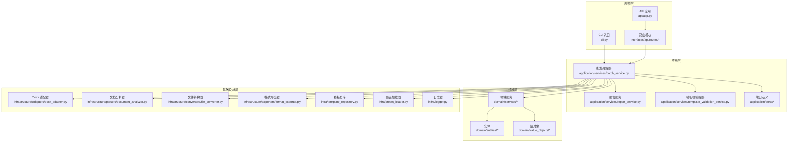
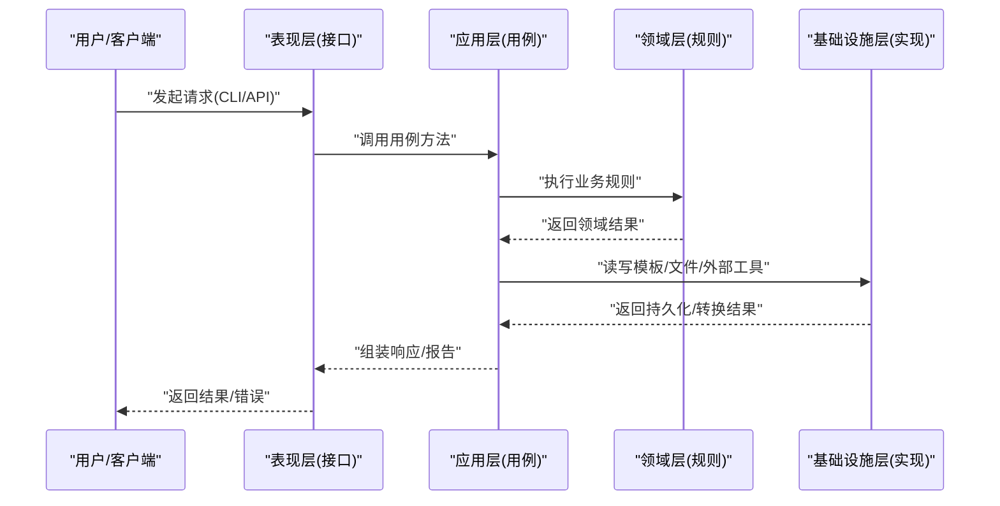
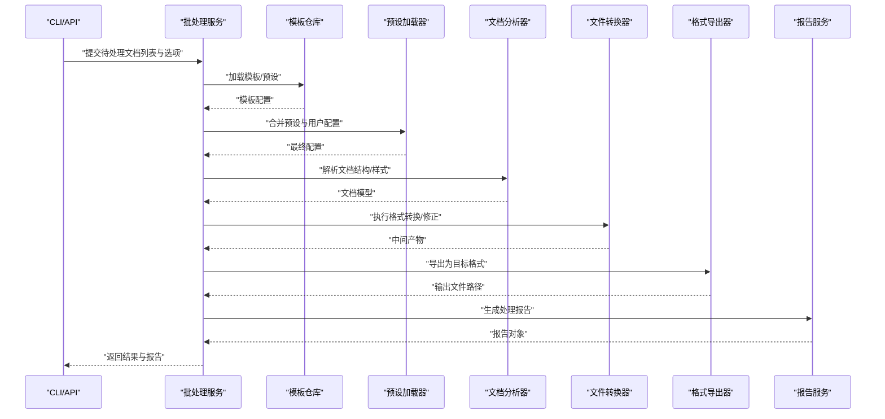
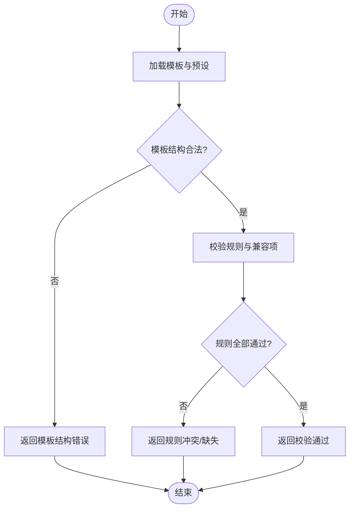
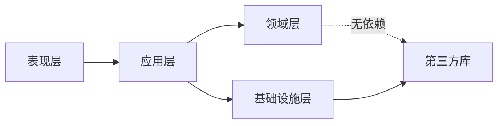

# 分层架构设计

<cite>
**本文引用的文件**   
- [src/paper_format_corrector/app.py](file://src/paper_format_corrector/app.py)
- [src/paper_format_corrector/__main__.py](file://src/paper_format_corrector/__main__.py)
- [src/paper_format_corrector/cli.py](file://src/paper_format_corrector/cli.py)
- [src/paper_format_corrector/api/app.py](file://src/paper_format_corrector/api/app.py)
- [src/paper_format_corrector/application/services/batch_service.py](file://src/paper_format_corrector/application/services/batch_service.py)
- [src/paper_format_corrector/application/services/report_service.py](file://src/paper_format_corrector/application/services/report_service.py)
- [src/paper_format_corrector/application/services/template_validation_service.py](file://src/paper_format_corrector/application/services/template_validation_service.py)
- [src/paper_format_corrector/application/ports/__init__.py](file://src/paper_format_corrector/application/ports/__init__.py)
- [src/paper_format_corrector/core/format_corrector.py](file://src/paper_format_corrector/core/format_corrector.py)
- [src/paper_format_corrector/core/doc_generator.py](file://src/paper_format_corrector/core/doc_generator.py)
- [src/paper_format_corrector/core/file_converter.py](file://src/paper_format_corrector/core/file_converter.py)
- [src/paper_format_corrector/domain/entities/__init__.py](file://src/paper_format_corrector/domain/entities/__init__.py)
- [src/paper_format_corrector/domain/services/__init__.py](file://src/paper_format_corrector/domain/services/__init__.py)
- [src/paper_format_corrector/domain/value_objects/__init__.py](file://src/paper_format_corrector/domain/value_objects/__init__.py)
- [src/paper_format_corrector/infra/logger.py](file://src/paper_format_corrector/infra/logger.py)
- [src/paper_format_corrector/infra/template_repository.py](file://src/paper_format_corrector/infra/template_repository.py)
- [src/paper_format_corrector/infra/preset_loader.py](file://src/paper_format_corrector/infra/preset_loader.py)
- [src/paper_format_corrector/infrastructure/adapters/docx_adapter.py](file://src/paper_format_corrector/infrastructure/adapters/docx_adapter.py)
- [src/paper_format_corrector/infrastructure/parsers/document_analyzer.py](file://src/paper_format_corrector/infrastructure/parsers/document_analyzer.py)
- [src/paper_format_corrector/infrastructure/converters/file_converter.py](file://src/paper_format_corrector/infrastructure/converters/file_converter.py)
- [src/paper_format_corrector/infrastructure/exporters/format_exporter.py](file://src/paper_format_corrector/infrastructure/exporters/format_exporter.py)
- [src/paper_format_corrector/interfaces/api/routes/__init__.py](file://src/paper_format_corrector/interfaces/api/routes/__init__.py)
</cite>

## 目录
1. [简介](#简介)
2. [项目结构](#项目结构)
3. [核心组件](#核心组件)
4. [架构总览](#架构总览)
5. [详细组件分析](#详细组件分析)
6. [依赖关系分析](#依赖关系分析)
7. [性能考虑](#性能考虑)
8. [故障排查指南](#故障排查指南)
9. [结论](#结论)
10. [附录](#附录)

## 简介
本文件面向“论文格式矫正工具”的分层架构设计与实现，聚焦表现层、应用层、领域层与基础设施层的职责划分、边界定义、数据与控制流、依赖解耦策略，以及接口契约、异常处理、日志记录与事务管理在各层的落地方式。文档同时提供层次架构图与关键流程的数据流转图，帮助读者快速理解系统结构与扩展点。

## 项目结构
仓库采用清晰的分层组织：
- 表现层（Interfaces）：API、CLI、桌面端等入口，负责请求解析、参数校验、结果序列化与用户交互。
- 应用层（Application）：编排用例、协调服务、转换DTO、控制跨层调用顺序，不包含业务规则细节。
- 领域层（Domain）：实体、值对象、领域服务与事件，承载核心业务不变量与规则。
- 基础设施层（Infrastructure/Infra）：适配器、转换器、导出器、解析器、模板库、外部工具集成、队列与更新器等具体实现。

图表来源
- [src/paper_format_corrector/cli.py](file://src/paper_format_corrector/cli.py)
- [src/paper_format_corrector/api/app.py](file://src/paper_format_corrector/api/app.py)
- [src/paper_format_corrector/application/services/batch_service.py](file://src/paper_format_corrector/application/services/batch_service.py)
- [src/paper_format_corrector/application/services/report_service.py](file://src/paper_format_corrector/application/services/report_service.py)
- [src/paper_format_corrector/application/services/template_validation_service.py](file://src/paper_format_corrector/application/services/template_validation_service.py)
- [src/paper_format_corrector/infrastructure/adapters/docx_adapter.py](file://src/paper_format_corrector/infrastructure/adapters/docx_adapter.py)
- [src/paper_format_corrector/infrastructure/parsers/document_analyzer.py](file://src/paper_format_corrector/infrastructure/parsers/document_analyzer.py)
- [src/paper_format_corrector/infrastructure/converters/file_converter.py](file://src/paper_format_corrector/infrastructure/converters/file_converter.py)
- [src/paper_format_corrector/infrastructure/exporters/format_exporter.py](file://src/paper_format_corrector/infrastructure/exporters/format_exporter.py)
- [src/paper_format_corrector/infra/template_repository.py](file://src/paper_format_corrector/infra/template_repository.py)
- [src/paper_format_corrector/infra/preset_loader.py](file://src/paper_format_corrector/infra/preset_loader.py)
- [src/paper_format_corrector/infra/logger.py](file://src/paper_format_corrector/infra/logger.py)

章节来源
- [src/paper_format_corrector/app.py](file://src/paper_format_corrector/app.py)
- [src/paper_format_corrector/__main__.py](file://src/paper_format_corrector/__main__.py)
- [src/paper_format_corrector/cli.py](file://src/paper_format_corrector/cli.py)
- [src/paper_format_corrector/api/app.py](file://src/paper_format_corrector/api/app.py)

## 核心组件
- 表现层
  - CLI：解析命令行参数，组装输入上下文，调用应用服务并输出结果或错误信息。
  - API：基于Web框架的HTTP入口，路由到应用服务，统一响应格式与错误码。
- 应用层
  - 批处理服务：编排一次或多份文档的格式化、分析与导出流程；协调模板加载、规则执行、报告生成。
  - 报告服务：汇总处理过程中的问题与建议，生成结构化报告。
  - 模板校验服务：对模板配置进行合法性检查与兼容性验证。
- 领域层
  - 实体与值对象：描述文档、段落、样式、引用等核心概念及其约束。
  - 领域服务：封装跨实体的复杂业务规则（如标题层级一致性、交叉引用完整性）。
- 基础设施层
  - 适配器：对第三方库（如docx）进行适配，屏蔽底层差异。
  - 解析器与分析器：从文档中抽取结构、样式与元数据。
  - 转换器与导出器：在docx、PDF、LaTeX等格式间转换与导出。
  - 模板仓库与预设加载器：读取本地/远程模板与预设，提供配置对象。
  - 日志器：集中化日志输出与分级策略。

章节来源
- [src/paper_format_corrector/application/services/batch_service.py](file://src/paper_format_corrector/application/services/batch_service.py)
- [src/paper_format_corrector/application/services/report_service.py](file://src/paper_format_corrector/application/services/report_service.py)
- [src/paper_format_corrector/application/services/template_validation_service.py](file://src/paper_format_corrector/application/services/template_validation_service.py)
- [src/paper_format_corrector/core/format_corrector.py](file://src/paper_format_corrector/core/format_corrector.py)
- [src/paper_format_corrector/core/doc_generator.py](file://src/paper_format_corrector/core/doc_generator.py)
- [src/paper_format_corrector/core/file_converter.py](file://src/paper_format_corrector/core/file_converter.py)
- [src/paper_format_corrector/domain/entities/__init__.py](file://src/paper_format_corrector/domain/entities/__init__.py)
- [src/paper_format_corrector/domain/services/__init__.py](file://src/paper_format_corrector/domain/services/__init__.py)
- [src/paper_format_corrector/domain/value_objects/__init__.py](file://src/paper_format_corrector/domain/value_objects/__init__.py)
- [src/paper_format_corrector/infra/logger.py](file://src/paper_format_corrector/infra/logger.py)
- [src/paper_format_corrector/infra/template_repository.py](file://src/paper_format_corrector/infra/template_repository.py)
- [src/paper_format_corrector/infra/preset_loader.py](file://src/paper_format_corrector/infra/preset_loader.py)
- [src/paper_format_corrector/infrastructure/adapters/docx_adapter.py](file://src/paper_format_corrector/infrastructure/adapters/docx_adapter.py)
- [src/paper_format_corrector/infrastructure/parsers/document_analyzer.py](file://src/paper_format_corrector/infrastructure/parsers/document_analyzer.py)
- [src/paper_format_corrector/infrastructure/converters/file_converter.py](file://src/paper_format_corrector/infrastructure/converters/file_converter.py)
- [src/paper_format_corrector/infrastructure/exporters/format_exporter.py](file://src/paper_format_corrector/infrastructure/exporters/format_exporter.py)

## 架构总览
分层职责与边界：
- 表现层：仅关注输入输出与协议细节，不持有业务逻辑。通过依赖注入将应用服务暴露给外部。
- 应用层：以用例为中心，组合领域服务与基础设施能力，保证业务流程的可测试性与可替换性。
- 领域层：纯业务模型与规则，不依赖任何外部技术栈。
- 基础设施层：实现所有外部交互（文件系统、网络、第三方库），通过端口/适配器与应用层和领域层解耦。

图表来源
- [src/paper_format_corrector/cli.py](file://src/paper_format_corrector/cli.py)
- [src/paper_format_corrector/api/app.py](file://src/paper_format_corrector/api/app.py)
- [src/paper_format_corrector/application/services/batch_service.py](file://src/paper_format_corrector/application/services/batch_service.py)
- [src/paper_format_corrector/domain/services/__init__.py](file://src/paper_format_corrector/domain/services/__init__.py)
- [src/paper_format_corrector/infra/template_repository.py](file://src/paper_format_corrector/infra/template_repository.py)
- [src/paper_format_corrector/infrastructure/adapters/docx_adapter.py](file://src/paper_format_corrector/infrastructure/adapters/docx_adapter.py)

## 详细组件分析

### 表现层：API 与 CLI
- 职责
  - 解析请求参数、校验输入、设置上下文（如工作目录、日志级别）。
  - 调用应用层用例，捕获异常并转换为统一响应。
  - 输出结构化结果（JSON/文本）或触发下载。
- 边界
  - 不包含业务规则；不直接访问文件系统或第三方库。
- 数据流
  - 输入：请求体/命令行参数 → DTO → 应用层入参。
  - 输出：应用层结果 → 响应体/文件路径。
- 异常处理
  - 统一错误码与消息，记录必要上下文日志。
- 日志记录
  - 使用全局日志器，按请求ID关联链路日志。

章节来源
- [src/paper_format_corrector/api/app.py](file://src/paper_format_corrector/api/app.py)
- [src/paper_format_corrector/interfaces/api/routes/__init__.py](file://src/paper_format_corrector/interfaces/api/routes/__init__.py)
- [src/paper_format_corrector/cli.py](file://src/paper_format_corrector/cli.py)

### 应用层：用例编排与服务协作
- 职责
  - 编排批处理任务：加载模板、解析文档、执行格式化、生成报告、导出目标格式。
  - 协调领域服务与基础设施适配器，确保用例原子性与可回滚。
- 边界
  - 不实现领域规则；不直接耦合第三方库。
- 数据流
  - 接收表现层DTO → 转换为领域模型 → 调用领域服务 → 获取结果 → 转换为输出DTO。
- 事务管理
  - 以“用例事务”为单位，确保模板加载、文档解析、格式化、导出的一致性；失败时回滚中间产物。
- 异常处理
  - 将基础设施异常转换为应用级异常，附带上下文以便上层呈现。
- 日志记录
  - 记录用例开始/结束、关键步骤耗时与错误堆栈。

章节来源
- [src/paper_format_corrector/application/services/batch_service.py](file://src/paper_format_corrector/application/services/batch_service.py)
- [src/paper_format_corrector/application/services/report_service.py](file://src/paper_format_corrector/application/services/report_service.py)
- [src/paper_format_corrector/application/services/template_validation_service.py](file://src/paper_format_corrector/application/services/template_validation_service.py)
- [src/paper_format_corrector/application/ports/__init__.py](file://src/paper_format_corrector/application/ports/__init__.py)

### 领域层：实体、值对象与领域服务
- 职责
  - 定义文档、章节、样式、引用等核心概念与不变式。
  - 封装跨实体的业务规则（如标题层级、编号连续性、交叉引用有效性）。
- 边界
  - 不依赖任何外部技术栈；无IO操作。
- 数据流
  - 接收应用层传入的领域模型，返回新的领域状态或事件。
- 异常处理
  - 抛出领域异常（如无效引用、违反规则），由应用层捕获并处理。
- 日志记录
  - 领域层通常不直接写日志，交由应用层或基础设施层记录。

章节来源
- [src/paper_format_corrector/domain/entities/__init__.py](file://src/paper_format_corrector/domain/entities/__init__.py)
- [src/paper_format_corrector/domain/value_objects/__init__.py](file://src/paper_format_corrector/domain/value_objects/__init__.py)
- [src/paper_format_corrector/domain/services/__init__.py](file://src/paper_format_corrector/domain/services/__init__.py)

### 基础设施层：适配器、解析器、转换器与仓库
- 职责
  - 提供具体的文件读写、模板加载、格式转换、外部工具调用实现。
  - 通过适配器屏蔽第三方库差异（如docx、pdf、latex）。
- 边界
  - 对外暴露稳定的接口（端口），供应用层与领域层依赖。
- 数据流
  - 接收领域/应用层模型，转换为底层表示；或将底层表示映射为领域模型。
- 异常处理
  - 将底层异常包装为基础设施异常，避免泄漏实现细节。
- 日志记录
  - 记录IO、网络、外部工具调用的关键信息与错误。

章节来源
- [src/paper_format_corrector/infrastructure/adapters/docx_adapter.py](file://src/paper_format_corrector/infrastructure/adapters/docx_adapter.py)
- [src/paper_format_corrector/infrastructure/parsers/document_analyzer.py](file://src/paper_format_corrector/infrastructure/parsers/document_analyzer.py)
- [src/paper_format_corrector/infrastructure/converters/file_converter.py](file://src/paper_format_corrector/infrastructure/converters/file_converter.py)
- [src/paper_format_corrector/infrastructure/exporters/format_exporter.py](file://src/paper_format_corrector/infrastructure/exporters/format_exporter.py)
- [src/paper_format_corrector/infra/template_repository.py](file://src/paper_format_corrector/infra/template_repository.py)
- [src/paper_format_corrector/infra/preset_loader.py](file://src/paper_format_corrector/infra/preset_loader.py)
- [src/paper_format_corrector/infra/logger.py](file://src/paper_format_corrector/infra/logger.py)

### 关键流程：批处理格式化（序列图）

图表来源
- [src/paper_format_corrector/application/services/batch_service.py](file://src/paper_format_corrector/application/services/batch_service.py)
- [src/paper_format_corrector/infra/template_repository.py](file://src/paper_format_corrector/infra/template_repository.py)
- [src/paper_format_corrector/infra/preset_loader.py](file://src/paper_format_corrector/infra/preset_loader.py)
- [src/paper_format_corrector/infrastructure/parsers/document_analyzer.py](file://src/paper_format_corrector/infrastructure/parsers/document_analyzer.py)
- [src/paper_format_corrector/infrastructure/converters/file_converter.py](file://src/paper_format_corrector/infrastructure/converters/file_converter.py)
- [src/paper_format_corrector/infrastructure/exporters/format_exporter.py](file://src/paper_format_corrector/infrastructure/exporters/format_exporter.py)
- [src/paper_format_corrector/application/services/report_service.py](file://src/paper_format_corrector/application/services/report_service.py)

### 关键流程：模板校验（流程图）

图表来源
- [src/paper_format_corrector/application/services/template_validation_service.py](file://src/paper_format_corrector/application/services/template_validation_service.py)
- [src/paper_format_corrector/infra/template_repository.py](file://src/paper_format_corrector/infra/template_repository.py)
- [src/paper_format_corrector/infra/preset_loader.py](file://src/paper_format_corrector/infra/preset_loader.py)

## 依赖关系分析
- 依赖方向
  - 表现层 → 应用层
  - 应用层 → 领域层 + 基础设施层（通过端口/适配器）
  - 领域层 → 无外部依赖
  - 基础设施层 → 第三方库与系统资源
- 解耦策略
  - 应用层通过端口定义抽象，基础设施层提供具体实现，便于替换与测试。
  - 领域层保持纯净，不受IO与技术栈影响。
  - 表现层仅依赖应用层接口，避免侵入业务。

图表来源
- [src/paper_format_corrector/application/ports/__init__.py](file://src/paper_format_corrector/application/ports/__init__.py)
- [src/paper_format_corrector/infrastructure/adapters/docx_adapter.py](file://src/paper_format_corrector/infrastructure/adapters/docx_adapter.py)

章节来源
- [src/paper_format_corrector/application/ports/__init__.py](file://src/paper_format_corrector/application/ports/__init__.py)
- [src/paper_format_corrector/infrastructure/adapters/docx_adapter.py](file://src/paper_format_corrector/infrastructure/adapters/docx_adapter.py)

## 性能考虑
- 批处理优化
  - 并行解析与转换：对多文档任务进行并发处理，注意资源上限与锁竞争。
  - 增量处理：仅对变更部分重新解析与格式化，减少重复计算。
- 内存与I/O
  - 大文档分块处理，避免一次性加载整个文档树。
  - 使用流式写入导出，降低峰值内存占用。
- 缓存
  - 模板与预设加载结果缓存，避免重复IO。
  - 常用规则匹配结果缓存，提升二次处理速度。
- 日志与监控
  - 采样高开销操作的耗时指标，定位瓶颈。

[本节为通用指导，无需代码来源]

## 故障排查指南
- 常见问题
  - 模板加载失败：检查模板路径、权限与结构；查看模板仓库与预设加载器的日志。
  - 文档解析异常：确认文件格式与编码；查看文档分析器的错误上下文。
  - 导出失败：检查目标格式支持与环境依赖；查看导出器日志。
- 日志定位
  - 使用全局日志器，开启调试级别，结合请求ID追踪链路。
- 事务回滚
  - 若某阶段失败，确保中间产物清理与状态回滚，避免脏数据。

章节来源
- [src/paper_format_corrector/infra/logger.py](file://src/paper_format_corrector/infra/logger.py)
- [src/paper_format_corrector/infra/template_repository.py](file://src/paper_format_corrector/infra/template_repository.py)
- [src/paper_format_corrector/infrastructure/parsers/document_analyzer.py](file://src/paper_format_corrector/infrastructure/parsers/document_analyzer.py)
- [src/paper_format_corrector/infrastructure/exporters/format_exporter.py](file://src/paper_format_corrector/infrastructure/exporters/format_exporter.py)

## 结论
该分层架构通过清晰的职责划分与严格的依赖方向，实现了良好的可维护性与可扩展性。应用层作为编排中心，结合领域层的稳定规则与基础设施层的灵活实现，使系统在应对不同模板、格式与外部工具时具备高度适应性。建议持续完善端口抽象与单元测试，进一步提升系统的健壮性与可测试性。

[本节为总结，无需代码来源]

## 附录
- 接口契约建议
  - 应用层用例接口：明确输入DTO、输出DTO、异常类型与错误码。
  - 基础设施端口：定义最小必要方法集，避免泄露实现细节。
- 示例参考路径
  - 表现层入口：[src/paper_format_corrector/cli.py](file://src/paper_format_corrector/cli.py)、[src/paper_format_corrector/api/app.py](file://src/paper_format_corrector/api/app.py)
  - 应用层用例：[src/paper_format_corrector/application/services/batch_service.py](file://src/paper_format_corrector/application/services/batch_service.py)
  - 领域层模型与服务：[src/paper_format_corrector/domain/entities/__init__.py](file://src/paper_format_corrector/domain/entities/__init__.py)、[src/paper_format_corrector/domain/services/__init__.py](file://src/paper_format_corrector/domain/services/__init__.py)
  - 基础设施实现：[src/paper_format_corrector/infrastructure/adapters/docx_adapter.py](file://src/paper_format_corrector/infrastructure/adapters/docx_adapter.py)、[src/paper_format_corrector/infra/template_repository.py](file://src/paper_format_corrector/infra/template_repository.py)