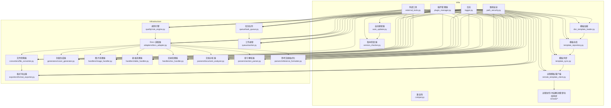
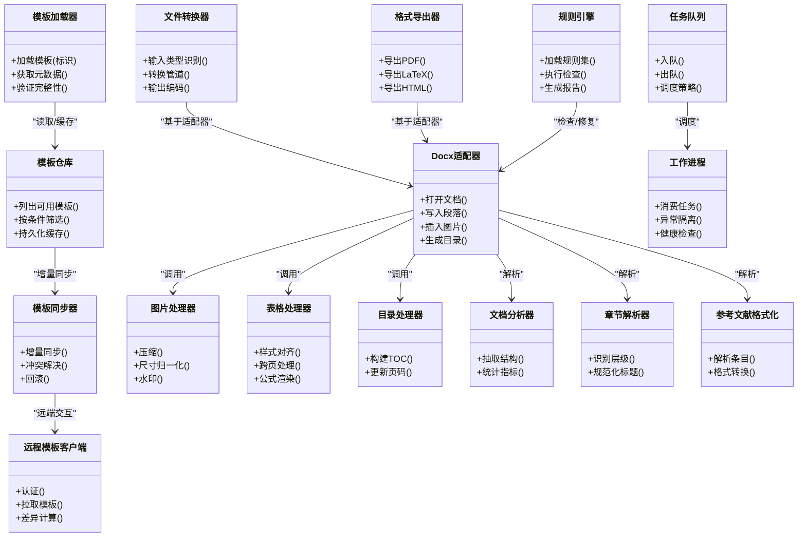
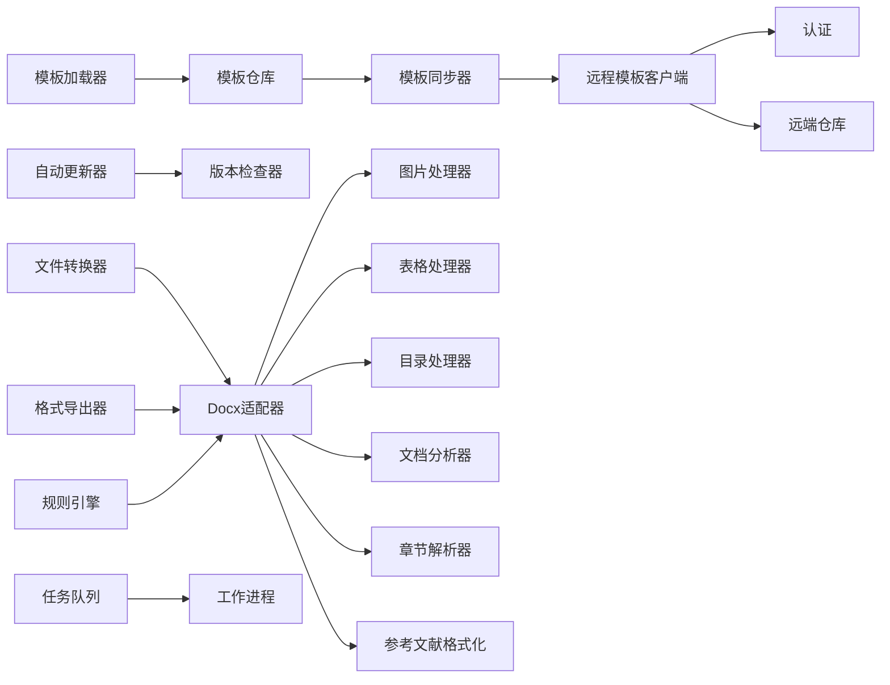

# 基础设施层设计

<cite>
**本文引用的文件**   
- [src/paper_format_corrector/infra/doc_template_loader.py](file://src/paper_format_corrector/infra/doc_template_loader.py)
- [src/paper_format_corrector/infra/template_repository.py](file://src/paper_format_corrector/infra/template_repository.py)
- [src/paper_format_corrector/infra/template_sync.py](file://src/paper_format_corrector/infra/template_sync.py)
- [src/paper_format_corrector/infra/remote_template_client.py](file://src/paper_format_corrector/infra/remote_template_client.py)
- [src/paper_format_corrector/infra/updater/auto_updater.py](file://src/paper_format_corrector/infra/updater/auto_updater.py)
- [src/paper_format_corrector/infra/updater/version_checker.py](file://src/paper_format_corrector/infra/updater/version_checker.py)
- [src/paper_format_corrector/infrastructure/adapters/docx_adapter.py](file://src/paper_format_corrector/infrastructure/adapters/docx_adapter.py)
- [src/paper_format_corrector/infrastructure/converters/file_converter.py](file://src/paper_format_corrector/infrastructure/converters/file_converter.py)
- [src/paper_format_corrector/infrastructure/exporters/format_exporter.py](file://src/paper_format_corrector/infrastructure/exporters/format_exporter.py)
- [src/paper_format_corrector/infrastructure/generators/cover_generator.py](file://src/paper_format_corrector/infrastructure/generators/cover_generator.py)
- [src/paper_format_corrector/infrastructure/handlers/image_handler.py](file://src/paper_format_corrector/infrastructure/handlers/image_handler.py)
- [src/paper_format_corrector/infrastructure/handlers/table_handler.py](file://src/paper_format_corrector/infrastructure/handlers/table_handler.py)
- [src/paper_format_corrector/infrastructure/handlers/toc_handler.py](file://src/paper_format_corrector/infrastructure/handlers/toc_handler.py)
- [src/paper_format_corrector/infrastructure/parsers/document_analyzer.py](file://src/paper_format_corrector/infrastructure/parsers/document_analyzer.py)
- [src/paper_format_corrector/infrastructure/parsers/section_parser.py](file://src/paper_format_corrector/infrastructure/parsers/section_parser.py)
- [src/paper_format_corrector/infrastructure/parsers/reference_formatter.py](file://src/paper_format_corrector/infrastructure/parsers/reference_formatter.py)
- [src/paper_format_corrector/infrastructure/quality/rule_engine.py](file://src/paper_format_corrector/infrastructure/quality/rule_engine.py)
- [src/paper_format_corrector/infrastructure/queue/task_queue.py](file://src/paper_format_corrector/infrastructure/queue/task_queue.py)
- [src/paper_format_corrector/infrastructure/queue/worker.py](file://src/paper_format_corrector/infrastructure/queue/worker.py)
- [src/paper_format_corrector/infra/logger.py](file://src/paper_format_corrector/infra/logger.py)
- [src/paper_format_corrector/infra/path_security.py](file://src/paper_format_corrector/infra/path_security.py)
- [src/paper_format_corrector/infra/plugin_manager.py](file://src/paper_format_corrector/infra/plugin_manager.py)
- [src/paper_format_corrector/infra/external_tools.py](file://src/paper_format_corrector/infra/external_tools.py)
- [src/paper_format_corrector/infra/compat.py](file://src/paper_format_corrector/infra/compat.py)
- [src/paper_format_corrector/infra/remote/auth.py](file://src/paper_format_corrector/infra/remote/auth.py)
- [src/paper_format_corrector/infra/remote/collaboration.py](file://src/paper_format_corrector/infra/remote/collaboration.py)
- [src/paper_format_corrector/infra/remote/conflict_resolver.py](file://src/paper_format_corrector/infra/remote/conflict_resolver.py)
- [src/paper_format_corrector/infra/remote/remote_models.py](file://src/paper_format_corrector/infra/remote/remote_models.py)
- [src/paper_format_corrector/infra/remote/remote_repository.py](file://src/paper_format_corrector/infra/remote/remote_repository.py)
- [src/paper_format_corrector/infra/remote/sync.py](file://src/paper_format_corrector/infra/remote/sync.py)
</cite>

## 目录
1. [引言](#引言)
2. [项目结构](#项目结构)
3. [核心组件](#核心组件)
4. [架构总览](#架构总览)
5. [详细组件分析](#详细组件分析)
6. [依赖关系分析](#依赖关系分析)
7. [性能与资源优化](#性能与资源优化)
8. [故障恢复、重试与监控告警](#故障恢复重试与监控告警)
9. [结论](#结论)
10. [附录：接口契约与示例路径](#附录接口契约与示例路径)

## 引言
本文件聚焦于“论文格式矫正工具”的基础设施层设计，系统性阐述底层能力与技术实现，包括：
- 文件操作与模板管理（本地/远程模板仓库、同步、加载）
- 文档解析与处理（段落、图表、目录、参考文献等）
- 外部工具集成与插件扩展
- 适配器模式抽象（为上层提供统一接口）
- 缓存策略、连接池管理与资源优化
- 错误恢复、重试机制与监控告警

目标是帮助读者快速理解并正确使用基础设施层，同时为二次开发与扩展提供清晰指引。

## 项目结构
基础设施层由两个主要子包构成：
- infra：面向业务能力的通用基础能力（模板、远程、更新器、日志、安全、插件、外部工具等）
- infrastructure：面向具体技术栈的适配与实现（docx 适配、转换/导出、生成器、处理器、解析器、质量规则、队列等）

图示来源
- [src/paper_format_corrector/infra/doc_template_loader.py](file://src/paper_format_corrector/infra/doc_template_loader.py)
- [src/paper_format_corrector/infra/template_repository.py](file://src/paper_format_corrector/infra/template_repository.py)
- [src/paper_format_corrector/infra/template_sync.py](file://src/paper_format_corrector/infra/template_sync.py)
- [src/paper_format_corrector/infra/remote_template_client.py](file://src/paper_format_corrector/infra/remote_template_client.py)
- [src/paper_format_corrector/infra/updater/auto_updater.py](file://src/paper_format_corrector/infra/updater/auto_updater.py)
- [src/paper_format_corrector/infra/updater/version_checker.py](file://src/paper_format_corrector/infra/updater/version_checker.py)
- [src/paper_format_corrector/infra/logger.py](file://src/paper_format_corrector/infra/logger.py)
- [src/paper_format_corrector/infra/path_security.py](file://src/paper_format_corrector/infra/path_security.py)
- [src/paper_format_corrector/infra/plugin_manager.py](file://src/paper_format_corrector/infra/plugin_manager.py)
- [src/paper_format_corrector/infra/external_tools.py](file://src/paper_format_corrector/infra/external_tools.py)
- [src/paper_format_corrector/infra/compat.py](file://src/paper_format_corrector/infra/compat.py)
- [src/paper_format_corrector/infra/remote/auth.py](file://src/paper_format_corrector/infra/remote/auth.py)
- [src/paper_format_corrector/infra/remote/collaboration.py](file://src/paper_format_corrector/infra/remote/collaboration.py)
- [src/paper_format_corrector/infra/remote/conflict_resolver.py](file://src/paper_format_corrector/infra/remote/conflict_resolver.py)
- [src/paper_format_corrector/infra/remote/remote_models.py](file://src/paper_format_corrector/infra/remote/remote_models.py)
- [src/paper_format_corrector/infra/remote/remote_repository.py](file://src/paper_format_corrector/infra/remote/remote_repository.py)
- [src/paper_format_corrector/infra/remote/sync.py](file://src/paper_format_corrector/infra/remote/sync.py)
- [src/paper_format_corrector/infrastructure/adapters/docx_adapter.py](file://src/paper_format_corrector/infrastructure/adapters/docx_adapter.py)
- [src/paper_format_corrector/infrastructure/converters/file_converter.py](file://src/paper_format_corrector/infrastructure/converters/file_converter.py)
- [src/paper_format_corrector/infrastructure/exporters/format_exporter.py](file://src/paper_format_corrector/infrastructure/exporters/format_exporter.py)
- [src/paper_format_corrector/infrastructure/generators/cover_generator.py](file://src/paper_format_corrector/infrastructure/generators/cover_generator.py)
- [src/paper_format_corrector/infrastructure/handlers/image_handler.py](file://src/paper_format_corrector/infrastructure/handlers/image_handler.py)
- [src/paper_format_corrector/infrastructure/handlers/table_handler.py](file://src/paper_format_corrector/infrastructure/handlers/table_handler.py)
- [src/paper_format_corrector/infrastructure/handlers/toc_handler.py](file://src/paper_format_corrector/infrastructure/handlers/toc_handler.py)
- [src/paper_format_corrector/infrastructure/parsers/document_analyzer.py](file://src/paper_format_corrector/infrastructure/parsers/document_analyzer.py)
- [src/paper_format_corrector/infrastructure/parsers/section_parser.py](file://src/paper_format_corrector/infrastructure/parsers/section_parser.py)
- [src/paper_format_corrector/infrastructure/parsers/reference_formatter.py](file://src/paper_format_corrector/infrastructure/parsers/reference_formatter.py)
- [src/paper_format_corrector/infrastructure/quality/rule_engine.py](file://src/paper_format_corrector/infrastructure/quality/rule_engine.py)
- [src/paper_format_corrector/infrastructure/queue/task_queue.py](file://src/paper_format_corrector/infrastructure/queue/task_queue.py)
- [src/paper_format_corrector/infrastructure/queue/worker.py](file://src/paper_format_corrector/infrastructure/queue/worker.py)

章节来源
- [src/paper_format_corrector/infra/doc_template_loader.py](file://src/paper_format_corrector/infra/doc_template_loader.py)
- [src/paper_format_corrector/infra/template_repository.py](file://src/paper_format_corrector/infra/template_repository.py)
- [src/paper_format_corrector/infra/template_sync.py](file://src/paper_format_corrector/infra/template_sync.py)
- [src/paper_format_corrector/infra/remote_template_client.py](file://src/paper_format_corrector/infra/remote_template_client.py)
- [src/paper_format_corrector/infra/updater/auto_updater.py](file://src/paper_format_corrector/infra/updater/auto_updater.py)
- [src/paper_format_corrector/infra/updater/version_checker.py](file://src/paper_format_corrector/infra/updater/version_checker.py)
- [src/paper_format_corrector/infra/logger.py](file://src/paper_format_corrector/infra/logger.py)
- [src/paper_format_corrector/infra/path_security.py](file://src/paper_format_corrector/infra/path_security.py)
- [src/paper_format_corrector/infra/plugin_manager.py](file://src/paper_format_corrector/infra/plugin_manager.py)
- [src/paper_format_corrector/infra/external_tools.py](file://src/paper_format_corrector/infra/external_tools.py)
- [src/paper_format_corrector/infra/compat.py](file://src/paper_format_corrector/infra/compat.py)
- [src/paper_format_corrector/infra/remote/auth.py](file://src/paper_format_corrector/infra/remote/auth.py)
- [src/paper_format_corrector/infra/remote/collaboration.py](file://src/paper_format_corrector/infra/remote/collaboration.py)
- [src/paper_format_corrector/infra/remote/conflict_resolver.py](file://src/paper_format_corrector/infra/remote/conflict_resolver.py)
- [src/paper_format_corrector/infra/remote/remote_models.py](file://src/paper_format_corrector/infra/remote/remote_models.py)
- [src/paper_format_corrector/infra/remote/remote_repository.py](file://src/paper_format_corrector/infra/remote/remote_repository.py)
- [src/paper_format_corrector/infra/remote/sync.py](file://src/paper_format_corrector/infra/remote/sync.py)
- [src/paper_format_corrector/infrastructure/adapters/docx_adapter.py](file://src/paper_format_corrector/infrastructure/adapters/docx_adapter.py)
- [src/paper_format_corrector/infrastructure/converters/file_converter.py](file://src/paper_format_corrector/infrastructure/converters/file_converter.py)
- [src/paper_format_corrector/infrastructure/exporters/format_exporter.py](file://src/paper_format_corrector/infrastructure/exporters/format_exporter.py)
- [src/paper_format_corrector/infrastructure/generators/cover_generator.py](file://src/paper_format_corrector/infrastructure/generators/cover_generator.py)
- [src/paper_format_corrector/infrastructure/handlers/image_handler.py](file://src/paper_format_corrector/infrastructure/handlers/image_handler.py)
- [src/paper_format_corrector/infrastructure/handlers/table_handler.py](file://src/paper_format_corrector/infrastructure/handlers/table_handler.py)
- [src/paper_format_corrector/infrastructure/handlers/toc_handler.py](file://src/paper_format_corrector/infrastructure/handlers/toc_handler.py)
- [src/paper_format_corrector/infrastructure/parsers/document_analyzer.py](file://src/paper_format_corrector/infrastructure/parsers/document_analyzer.py)
- [src/paper_format_corrector/infrastructure/parsers/section_parser.py](file://src/paper_format_corrector/infrastructure/parsers/section_parser.py)
- [src/paper_format_corrector/infrastructure/parsers/reference_formatter.py](file://src/paper_format_corrector/infrastructure/parsers/reference_formatter.py)
- [src/paper_format_corrector/infrastructure/quality/rule_engine.py](file://src/paper_format_corrector/infrastructure/quality/rule_engine.py)
- [src/paper_format_corrector/infrastructure/queue/task_queue.py](file://src/paper_format_corrector/infrastructure/queue/task_queue.py)
- [src/paper_format_corrector/infrastructure/queue/worker.py](file://src/paper_format_corrector/infrastructure/queue/worker.py)

## 核心组件
- 模板加载与仓库
  - 负责从本地或远程位置加载、校验、缓存模板元数据与内容，并提供统一的模板访问接口。
  - 关键职责：模板发现、版本选择、增量同步、一致性校验。
- 远程模板客户端与同步
  - 封装远端模板仓库的认证、拉取、差异对比与合并策略，支持断点续传与冲突解决。
- 自动更新与版本检查
  - 定期检查应用与模板版本，触发下载与安装流程，保证用户始终使用兼容版本。
- Docx 适配器与处理器
  - 将上层文档操作请求转换为对 docx 的具体读写，屏蔽底层细节；提供图片、表格、目录等专项处理器。
- 解析器与规则引擎
  - 解析文档结构与语义（章节、引用、交叉引用），结合规则引擎进行质量评估与修复建议。
- 任务队列与工作进程
  - 异步化重型任务（批量转换、导出、分析），提升吞吐与响应性。
- 日志、路径安全、插件与外部工具
  - 贯穿各模块的可观测性与安全性保障，以及可扩展的外部能力接入。

章节来源
- [src/paper_format_corrector/infra/doc_template_loader.py](file://src/paper_format_corrector/infra/doc_template_loader.py)
- [src/paper_format_corrector/infra/template_repository.py](file://src/paper_format_corrector/infra/template_repository.py)
- [src/paper_format_corrector/infra/template_sync.py](file://src/paper_format_corrector/infra/template_sync.py)
- [src/paper_format_corrector/infra/remote_template_client.py](file://src/paper_format_corrector/infra/remote_template_client.py)
- [src/paper_format_corrector/infra/updater/auto_updater.py](file://src/paper_format_corrector/infra/updater/auto_updater.py)
- [src/paper_format_corrector/infra/updater/version_checker.py](file://src/paper_format_corrector/infra/updater/version_checker.py)
- [src/paper_format_corrector/infrastructure/adapters/docx_adapter.py](file://src/paper_format_corrector/infrastructure/adapters/docx_adapter.py)
- [src/paper_format_corrector/infrastructure/handlers/image_handler.py](file://src/paper_format_corrector/infrastructure/handlers/image_handler.py)
- [src/paper_format_corrector/infrastructure/handlers/table_handler.py](file://src/paper_format_corrector/infrastructure/handlers/table_handler.py)
- [src/paper_format_corrector/infrastructure/handlers/toc_handler.py](file://src/paper_format_corrector/infrastructure/handlers/toc_handler.py)
- [src/paper_format_corrector/infrastructure/parsers/document_analyzer.py](file://src/paper_format_corrector/infrastructure/parsers/document_analyzer.py)
- [src/paper_format_corrector/infrastructure/parsers/section_parser.py](file://src/paper_format_corrector/infrastructure/parsers/section_parser.py)
- [src/paper_format_corrector/infrastructure/parsers/reference_formatter.py](file://src/paper_format_corrector/infrastructure/parsers/reference_formatter.py)
- [src/paper_format_corrector/infrastructure/quality/rule_engine.py](file://src/paper_format_corrector/infrastructure/quality/rule_engine.py)
- [src/paper_format_corrector/infrastructure/queue/task_queue.py](file://src/paper_format_corrector/infrastructure/queue/task_queue.py)
- [src/paper_format_corrector/infrastructure/queue/worker.py](file://src/paper_format_corrector/infrastructure/queue/worker.py)
- [src/paper_format_corrector/infra/logger.py](file://src/paper_format_corrector/infra/logger.py)
- [src/paper_format_corrector/infra/path_security.py](file://src/paper_format_corrector/infra/path_security.py)
- [src/paper_format_corrector/infra/plugin_manager.py](file://src/paper_format_corrector/infra/plugin_manager.py)
- [src/paper_format_corrector/infra/external_tools.py](file://src/paper_format_corrector/infra/external_tools.py)

## 架构总览
基础设施层采用“能力抽象 + 适配器实现”的分层设计：
- 能力抽象（infra）：定义模板、远程、更新、日志、安全、插件、外部工具等能力边界与交互协议。
- 技术实现（infrastructure）：针对具体技术栈（如 docx、HTTP、文件系统、队列）提供可插拔实现。
- 适配器模式：通过适配器将上层稳定的领域接口映射到多变的底层实现，屏蔽差异。

图示来源
- [src/paper_format_corrector/infra/doc_template_loader.py](file://src/paper_format_corrector/infra/doc_template_loader.py)
- [src/paper_format_corrector/infra/template_repository.py](file://src/paper_format_corrector/infra/template_repository.py)
- [src/paper_format_corrector/infra/template_sync.py](file://src/paper_format_corrector/infra/template_sync.py)
- [src/paper_format_corrector/infra/remote_template_client.py](file://src/paper_format_corrector/infra/remote_template_client.py)
- [src/paper_format_corrector/infrastructure/adapters/docx_adapter.py](file://src/paper_format_corrector/infrastructure/adapters/docx_adapter.py)
- [src/paper_format_corrector/infrastructure/converters/file_converter.py](file://src/paper_format_corrector/infrastructure/converters/file_converter.py)
- [src/paper_format_corrector/infrastructure/exporters/format_exporter.py](file://src/paper_format_corrector/infrastructure/exporters/format_exporter.py)
- [src/paper_format_corrector/infrastructure/handlers/image_handler.py](file://src/paper_format_corrector/infrastructure/handlers/image_handler.py)
- [src/paper_format_corrector/infrastructure/handlers/table_handler.py](file://src/paper_format_corrector/infrastructure/handlers/table_handler.py)
- [src/paper_format_corrector/infrastructure/handlers/toc_handler.py](file://src/paper_format_corrector/infrastructure/handlers/toc_handler.py)
- [src/paper_format_corrector/infrastructure/parsers/document_analyzer.py](file://src/paper_format_corrector/infrastructure/parsers/document_analyzer.py)
- [src/paper_format_corrector/infrastructure/parsers/section_parser.py](file://src/paper_format_corrector/infrastructure/parsers/section_parser.py)
- [src/paper_format_corrector/infrastructure/parsers/reference_formatter.py](file://src/paper_format_corrector/infrastructure/parsers/reference_formatter.py)
- [src/paper_format_corrector/infrastructure/quality/rule_engine.py](file://src/paper_format_corrector/infrastructure/quality/rule_engine.py)
- [src/paper_format_corrector/infrastructure/queue/task_queue.py](file://src/paper_format_corrector/infrastructure/queue/task_queue.py)
- [src/paper_format_corrector/infrastructure/queue/worker.py](file://src/paper_format_corrector/infrastructure/queue/worker.py)

## 详细组件分析

### 模板加载与仓库（infra）
- 设计要点
  - 模板加载器负责定位模板源（本地/远程）、解析元数据、返回标准化模板对象。
  - 模板仓库维护索引与缓存，提供按名称、版本、标签的查询能力。
  - 模板同步器在仓库与远端之间做增量同步，支持断点续传与冲突策略。
- 关键流程
  - 启动时预加载常用模板元数据，命中缓存则跳过网络请求。
  - 首次访问某模板时触发拉取与校验，失败时回退到本地旧版本并记录告警。
- 代码示例路径
  - [模板加载入口](file://src/paper_format_corrector/infra/doc_template_loader.py)
  - [仓库索引与缓存](file://src/paper_format_corrector/infra/template_repository.py)
  - [增量同步与冲突](file://src/paper_format_corrector/infra/template_sync.py)

章节来源
- [src/paper_format_corrector/infra/doc_template_loader.py](file://src/paper_format_corrector/infra/doc_template_loader.py)
- [src/paper_format_corrector/infra/template_repository.py](file://src/paper_format_corrector/infra/template_repository.py)
- [src/paper_format_corrector/infra/template_sync.py](file://src/paper_format_corrector/infra/template_sync.py)

### 远程模板客户端与认证（infra/remote）
- 设计要点
  - 封装认证、令牌刷新、签名校验、限流与重试。
  - 提供拉取、差异计算、合并策略，支持并发分块下载。
- 关键流程
  - 认证 -> 列表 -> 差异 -> 下载 -> 校验 -> 落盘。
- 代码示例路径
  - [认证模块](file://src/paper_format_corrector/infra/remote/auth.py)
  - [协作与冲突解决](file://src/paper_format_corrector/infra/remote/collaboration.py)
  - [冲突解决器](file://src/paper_format_corrector/infra/remote/conflict_resolver.py)
  - [远端模型定义](file://src/paper_format_corrector/infra/remote/remote_models.py)
  - [远端仓库接口](file://src/paper_format_corrector/infra/remote/remote_repository.py)
  - [同步流程](file://src/paper_format_corrector/infra/remote/sync.py)
  - [远程模板客户端](file://src/paper_format_corrector/infra/remote_template_client.py)

章节来源
- [src/paper_format_corrector/infra/remote/auth.py](file://src/paper_format_corrector/infra/remote/auth.py)
- [src/paper_format_corrector/infra/remote/collaboration.py](file://src/paper_format_corrector/infra/remote/collaboration.py)
- [src/paper_format_corrector/infra/remote/conflict_resolver.py](file://src/paper_format_corrector/infra/remote/conflict_resolver.py)
- [src/paper_format_corrector/infra/remote/remote_models.py](file://src/paper_format_corrector/infra/remote/remote_models.py)
- [src/paper_format_corrector/infra/remote/remote_repository.py](file://src/paper_format_corrector/infra/remote/remote_repository.py)
- [src/paper_format_corrector/infra/remote/sync.py](file://src/paper_format_corrector/infra/remote/sync.py)
- [src/paper_format_corrector/infra/remote_template_client.py](file://src/paper_format_corrector/infra/remote_template_client.py)

### 自动更新与版本检查（infra/updater）
- 设计要点
  - 定期检查应用与模板版本，比较远端发布说明与兼容性矩阵。
  - 支持灰度发布、回滚与安装后自检。
- 关键流程
  - 检查版本 -> 下载补丁/模板 -> 校验签名 -> 热替换/重启。
- 代码示例路径
  - [自动更新器](file://src/paper_format_corrector/infra/updater/auto_updater.py)
  - [版本检查器](file://src/paper_format_corrector/infra/updater/version_checker.py)

章节来源
- [src/paper_format_corrector/infra/updater/auto_updater.py](file://src/paper_format_corrector/infra/updater/auto_updater.py)
- [src/paper_format_corrector/infra/updater/version_checker.py](file://src/paper_format_corrector/infra/updater/version_checker.py)

### Docx 适配器与处理器（infrastructure）
- 设计要点
  - 适配器统一暴露打开、写入、插入、导出等接口，屏蔽 docx 内部差异。
  - 处理器专注特定元素（图片、表格、目录）的格式规范与质量约束。
- 关键流程
  - 打开文档 -> 解析结构 -> 应用规则 -> 插入/修改元素 -> 保存/导出。
- 代码示例路径
  - [Docx 适配器](file://src/paper_format_corrector/infrastructure/adapters/docx_adapter.py)
  - [图片处理器](file://src/paper_format_corrector/infrastructure/handlers/image_handler.py)
  - [表格处理器](file://src/paper_format_corrector/infrastructure/handlers/table_handler.py)
  - [目录处理器](file://src/paper_format_corrector/infrastructure/handlers/toc_handler.py)

章节来源
- [src/paper_format_corrector/infrastructure/adapters/docx_adapter.py](file://src/paper_format_corrector/infrastructure/adapters/docx_adapter.py)
- [src/paper_format_corrector/infrastructure/handlers/image_handler.py](file://src/paper_format_corrector/infrastructure/handlers/image_handler.py)
- [src/paper_format_corrector/infrastructure/handlers/table_handler.py](file://src/paper_format_corrector/infrastructure/handlers/table_handler.py)
- [src/paper_format_corrector/infrastructure/handlers/toc_handler.py](file://src/paper_format_corrector/infrastructure/handlers/toc_handler.py)

### 解析器与规则引擎（infrastructure/parsers & quality）
- 设计要点
  - 解析器抽取文档结构（章节、引用、交叉引用），形成中间表示。
  - 规则引擎加载规则集，遍历中间表示进行检查与修复建议。
- 关键流程
  - 解析文档 -> 构建 AST/IR -> 匹配规则 -> 生成报告/修复计划。
- 代码示例路径
  - [文档分析器](file://src/paper_format_corrector/infrastructure/parsers/document_analyzer.py)
  - [章节解析器](file://src/paper_format_corrector/infrastructure/parsers/section_parser.py)
  - [参考文献格式化](file://src/paper_format_corrector/infrastructure/parsers/reference_formatter.py)
  - [规则引擎](file://src/paper_format_corrector/infrastructure/quality/rule_engine.py)

章节来源
- [src/paper_format_corrector/infrastructure/parsers/document_analyzer.py](file://src/paper_format_corrector/infrastructure/parsers/document_analyzer.py)
- [src/paper_format_corrector/infrastructure/parsers/section_parser.py](file://src/paper_format_corrector/infrastructure/parsers/section_parser.py)
- [src/paper_format_corrector/infrastructure/parsers/reference_formatter.py](file://src/paper_format_corrector/infrastructure/parsers/reference_formatter.py)
- [src/paper_format_corrector/infrastructure/quality/rule_engine.py](file://src/paper_format_corrector/infrastructure/quality/rule_engine.py)

### 转换与导出（infrastructure/converters & exporters）
- 设计要点
  - 转换器根据输入类型选择合适管线，复用 Docx 适配器完成读写。
  - 导出器将文档转换为 PDF/LaTeX/HTML 等目标格式。
- 关键流程
  - 识别输入 -> 构建转换图 -> 执行节点 -> 输出目标。
- 代码示例路径
  - [文件转换器](file://src/paper_format_corrector/infrastructure/converters/file_converter.py)
  - [格式导出器](file://src/paper_format_corrector/infrastructure/exporters/format_exporter.py)

章节来源
- [src/paper_format_corrector/infrastructure/converters/file_converter.py](file://src/paper_format_corrector/infrastructure/converters/file_converter.py)
- [src/paper_format_corrector/infrastructure/exporters/format_exporter.py](file://src/paper_format_corrector/infrastructure/exporters/format_exporter.py)

### 封面生成器（infrastructure/generators）
- 设计要点
  - 根据模板与元数据自动生成封面页，包含标题、作者、单位等信息。
- 代码示例路径
  - [封面生成器](file://src/paper_format_corrector/infrastructure/generators/cover_generator.py)

章节来源
- [src/paper_format_corrector/infrastructure/generators/cover_generator.py](file://src/paper_format_corrector/infrastructure/generators/cover_generator.py)

### 任务队列与工作进程（infrastructure/queue）
- 设计要点
  - 队列负责任务序列化、优先级与去重；工作进程负责执行与异常隔离。
  - 支持水平扩展与优雅退出。
- 关键流程
  - 生产者入队 -> 调度器分配 -> 消费者执行 -> 结果持久化。
- 代码示例路径
  - [任务队列](file://src/paper_format_corrector/infrastructure/queue/task_queue.py)
  - [工作进程](file://src/paper_format_corrector/infrastructure/queue/worker.py)

章节来源
- [src/paper_format_corrector/infrastructure/queue/task_queue.py](file://src/paper_format_corrector/infrastructure/queue/task_queue.py)
- [src/paper_format_corrector/infrastructure/queue/worker.py](file://src/paper_format_corrector/infrastructure/queue/worker.py)

### 日志、路径安全、插件与外部工具（infra）
- 设计要点
  - 日志：结构化输出、分级控制、采样与轮转。
  - 路径安全：白名单校验、符号链接检测、权限最小化。
  - 插件：动态发现、生命周期管理、沙箱隔离。
  - 外部工具：命令封装、超时控制、错误码映射。
- 代码示例路径
  - [日志](file://src/paper_format_corrector/infra/logger.py)
  - [路径安全](file://src/paper_format_corrector/infra/path_security.py)
  - [插件管理器](file://src/paper_format_corrector/infra/plugin_manager.py)
  - [外部工具](file://src/paper_format_corrector/infra/external_tools.py)
  - [兼容性](file://src/paper_format_corrector/infra/compat.py)

章节来源
- [src/paper_format_corrector/infra/logger.py](file://src/paper_format_corrector/infra/logger.py)
- [src/paper_format_corrector/infra/path_security.py](file://src/paper_format_corrector/infra/path_security.py)
- [src/paper_format_corrector/infra/plugin_manager.py](file://src/paper_format_corrector/infra/plugin_manager.py)
- [src/paper_format_corrector/infra/external_tools.py](file://src/paper_format_corrector/infra/external_tools.py)
- [src/paper_format_corrector/infra/compat.py](file://src/paper_format_corrector/infra/compat.py)

## 依赖关系分析
- 耦合与内聚
  - infra 层保持低耦合，仅依赖抽象接口；infrastructure 层实现具体技术细节。
  - 处理器与解析器围绕 Docx 适配器组织，内聚度高。
- 直接/间接依赖
  - 模板相关模块依赖远程客户端与同步器；更新器依赖版本检查器。
  - 队列与工作进程解耦生产/消费，降低主流程阻塞风险。
- 外部依赖
  - HTTP 客户端、文件系统、第三方库（docx、PDF/LaTeX 导出器等）。
- 循环依赖
  - 通过接口与事件解耦，避免循环导入。

图示来源
- [src/paper_format_corrector/infra/doc_template_loader.py](file://src/paper_format_corrector/infra/doc_template_loader.py)
- [src/paper_format_corrector/infra/template_repository.py](file://src/paper_format_corrector/infra/template_repository.py)
- [src/paper_format_corrector/infra/template_sync.py](file://src/paper_format_corrector/infra/template_sync.py)
- [src/paper_format_corrector/infra/remote_template_client.py](file://src/paper_format_corrector/infra/remote_template_client.py)
- [src/paper_format_corrector/infra/remote/auth.py](file://src/paper_format_corrector/infra/remote/auth.py)
- [src/paper_format_corrector/infra/remote/remote_repository.py](file://src/paper_format_corrector/infra/remote/remote_repository.py)
- [src/paper_format_corrector/infra/updater/auto_updater.py](file://src/paper_format_corrector/infra/updater/auto_updater.py)
- [src/paper_format_corrector/infra/updater/version_checker.py](file://src/paper_format_corrector/infra/updater/version_checker.py)
- [src/paper_format_corrector/infrastructure/adapters/docx_adapter.py](file://src/paper_format_corrector/infrastructure/adapters/docx_adapter.py)
- [src/paper_format_corrector/infrastructure/converters/file_converter.py](file://src/paper_format_corrector/infrastructure/converters/file_converter.py)
- [src/paper_format_corrector/infrastructure/exporters/format_exporter.py](file://src/paper_format_corrector/infrastructure/exporters/format_exporter.py)
- [src/paper_format_corrector/infrastructure/handlers/image_handler.py](file://src/paper_format_corrector/infrastructure/handlers/image_handler.py)
- [src/paper_format_corrector/infrastructure/handlers/table_handler.py](file://src/paper_format_corrector/infrastructure/handlers/table_handler.py)
- [src/paper_format_corrector/infrastructure/handlers/toc_handler.py](file://src/paper_format_corrector/infrastructure/handlers/toc_handler.py)
- [src/paper_format_corrector/infrastructure/parsers/document_analyzer.py](file://src/paper_format_corrector/infrastructure/parsers/document_analyzer.py)
- [src/paper_format_corrector/infrastructure/parsers/section_parser.py](file://src/paper_format_corrector/infrastructure/parsers/section_parser.py)
- [src/paper_format_corrector/infrastructure/parsers/reference_formatter.py](file://src/paper_format_corrector/infrastructure/parsers/reference_formatter.py)
- [src/paper_format_corrector/infrastructure/quality/rule_engine.py](file://src/paper_format_corrector/infrastructure/quality/rule_engine.py)
- [src/paper_format_corrector/infrastructure/queue/task_queue.py](file://src/paper_format_corrector/infrastructure/queue/task_queue.py)
- [src/paper_format_corrector/infrastructure/queue/worker.py](file://src/paper_format_corrector/infrastructure/queue/worker.py)

## 性能与资源优化
- 缓存策略
  - 模板元数据与已解析文档片段缓存，减少重复 IO 与解析开销。
  - 远程差异结果缓存，避免频繁全量拉取。
- 连接池管理
  - HTTP 连接复用、分块并发下载、限速与退避。
  - 文件句柄与临时目录的生命周期管理，及时释放。
- 资源优化
  - 大文档分块处理、惰性加载、按需渲染。
  - 任务队列削峰填谷，限制并发度防止系统过载。
- 监控指标
  - 成功率、延迟分布、内存/CPU 占用、队列积压、磁盘 IO。

[本节为通用指导，不直接分析具体文件]

## 故障恢复、重试与监控告警
- 错误分类与恢复
  - 可重试错误（网络抖动、临时锁）：指数退避重试，带最大次数与熔断。
  - 不可重试错误（权限不足、格式损坏）：快速失败，记录上下文与快照。
- 重试机制
  - 幂等性保障：下载/写入前校验哈希，失败可安全重试。
  - 事务性更新：原子替换模板文件，失败回滚。
- 监控与告警
  - 结构化日志：时间戳、级别、TraceId、模块、耗时、状态码。
  - 告警阈值：失败率、延迟、队列长度、磁盘空间不足。
- 代码示例路径
  - [日志模块](file://src/paper_format_corrector/infra/logger.py)
  - [自动更新器（含重试/回滚）](file://src/paper_format_corrector/infra/updater/auto_updater.py)
  - [版本检查器（含限流/重试）](file://src/paper_format_corrector/infra/updater/version_checker.py)
  - [远程客户端（含认证/重试）](file://src/paper_format_corrector/infra/remote_template_client.py)
  - [任务队列与工作进程（异常隔离）](file://src/paper_format_corrector/infrastructure/queue/task_queue.py)
  - [工作进程](file://src/paper_format_corrector/infrastructure/queue/worker.py)

章节来源
- [src/paper_format_corrector/infra/logger.py](file://src/paper_format_corrector/infra/logger.py)
- [src/paper_format_corrector/infra/updater/auto_updater.py](file://src/paper_format_corrector/infra/updater/auto_updater.py)
- [src/paper_format_corrector/infra/updater/version_checker.py](file://src/paper_format_corrector/infra/updater/version_checker.py)
- [src/paper_format_corrector/infra/remote_template_client.py](file://src/paper_format_corrector/infra/remote_template_client.py)
- [src/paper_format_corrector/infrastructure/queue/task_queue.py](file://src/paper_format_corrector/infrastructure/queue/task_queue.py)
- [src/paper_format_corrector/infrastructure/queue/worker.py](file://src/paper_format_corrector/infrastructure/queue/worker.py)

## 结论
基础设施层通过清晰的抽象与适配器模式，将模板管理、文档处理、解析与导出、任务调度等复杂能力封装为稳定接口，既保证了上层的简洁易用，又为扩展与演进提供了良好支点。配合缓存、连接池、队列与完善的错误恢复与监控体系，系统在稳定性、性能与可维护性方面具备坚实基础。

[本节为总结性内容，不直接分析具体文件]

## 附录：接口契约与示例路径
- 模板加载接口
  - 方法：加载模板、获取元数据、验证完整性
  - 示例路径：[模板加载入口](file://src/paper_format_corrector/infra/doc_template_loader.py)
- 模板仓库接口
  - 方法：列出可用模板、按条件筛选、持久化缓存
  - 示例路径：[仓库索引与缓存](file://src/paper_format_corrector/infra/template_repository.py)
- 远程模板客户端接口
  - 方法：认证、拉取模板、差异计算
  - 示例路径：[远程模板客户端](file://src/paper_format_corrector/infra/remote_template_client.py)
- Docx 适配器接口
  - 方法：打开文档、写入段落、插入图片、生成目录
  - 示例路径：[Docx 适配器](file://src/paper_format_corrector/infrastructure/adapters/docx_adapter.py)
- 文件转换器接口
  - 方法：输入类型识别、转换管道、输出编码
  - 示例路径：[文件转换器](file://src/paper_format_corrector/infrastructure/converters/file_converter.py)
- 格式导出器接口
  - 方法：导出 PDF/LaTeX/HTML
  - 示例路径：[格式导出器](file://src/paper_format_corrector/infrastructure/exporters/format_exporter.py)
- 任务队列接口
  - 方法：入队、出队、调度策略
  - 示例路径：[任务队列](file://src/paper_format_corrector/infrastructure/queue/task_queue.py)
- 工作进程接口
  - 方法：消费任务、异常隔离、健康检查
  - 示例路径：[工作进程](file://src/paper_format_corrector/infrastructure/queue/worker.py)

章节来源
- [src/paper_format_corrector/infra/doc_template_loader.py](file://src/paper_format_corrector/infra/doc_template_loader.py)
- [src/paper_format_corrector/infra/template_repository.py](file://src/paper_format_corrector/infra/template_repository.py)
- [src/paper_format_corrector/infra/remote_template_client.py](file://src/paper_format_corrector/infra/remote_template_client.py)
- [src/paper_format_corrector/infrastructure/adapters/docx_adapter.py](file://src/paper_format_corrector/infrastructure/adapters/docx_adapter.py)
- [src/paper_format_corrector/infrastructure/converters/file_converter.py](file://src/paper_format_corrector/infrastructure/converters/file_converter.py)
- [src/paper_format_corrector/infrastructure/exporters/format_exporter.py](file://src/paper_format_corrector/infrastructure/exporters/format_exporter.py)
- [src/paper_format_corrector/infrastructure/queue/task_queue.py](file://src/paper_format_corrector/infrastructure/queue/task_queue.py)
- [src/paper_format_corrector/infrastructure/queue/worker.py](file://src/paper_format_corrector/infrastructure/queue/worker.py)