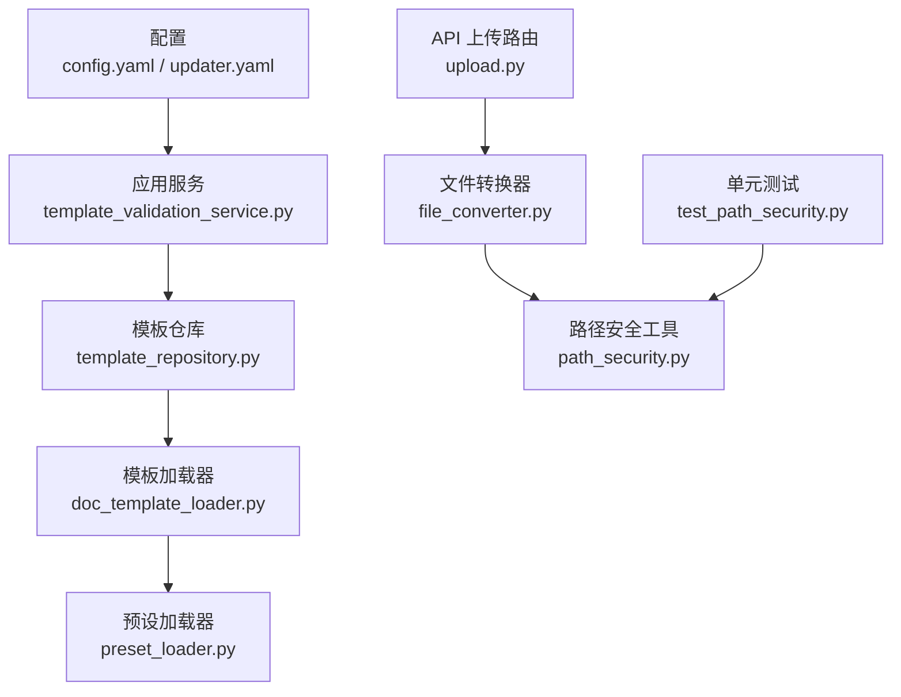
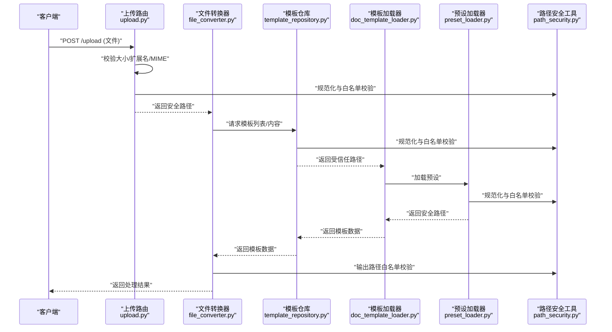
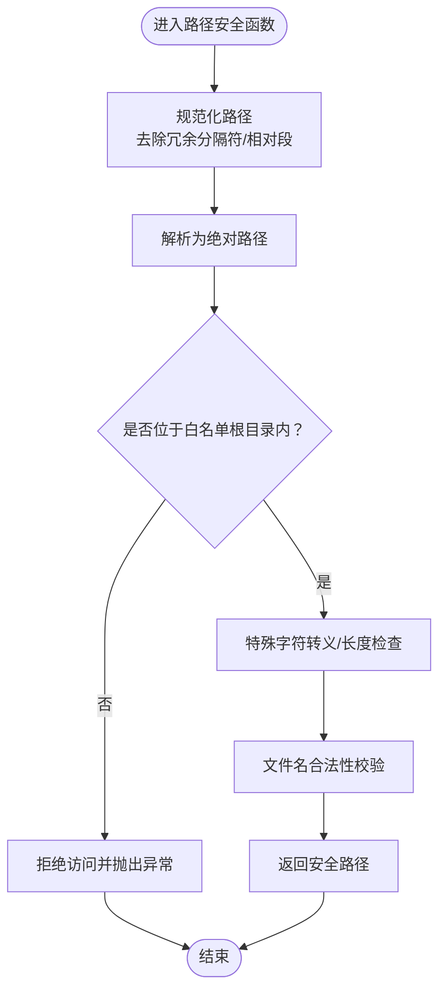
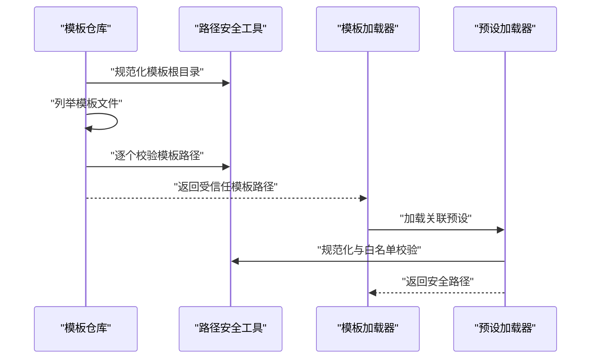
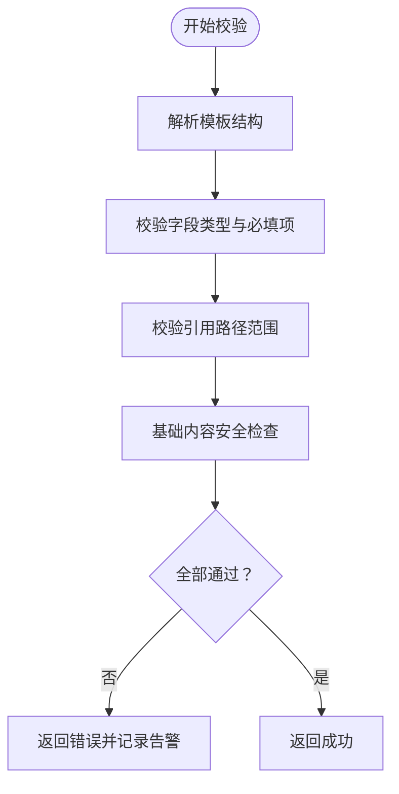
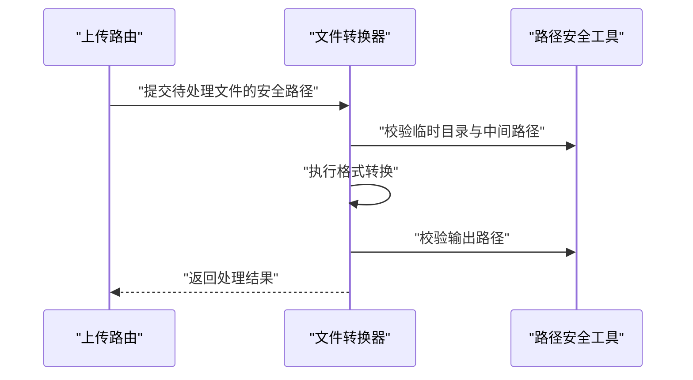
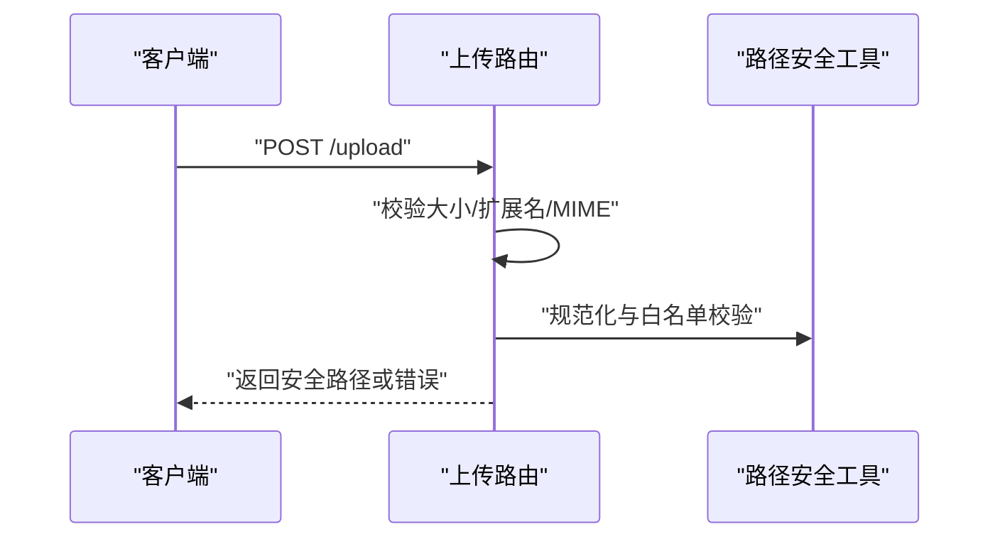
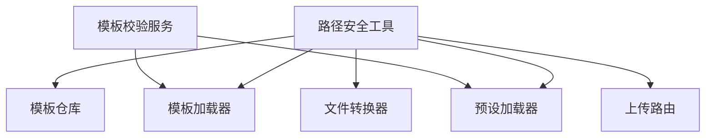

# 安全与路径管理

<cite>
**本文引用的文件**   
- [src/paper_format_corrector/infra/path_security.py](file://src/paper_format_corrector/infra/path_security.py)
- [tests/test_path_security.py](file://tests/test_path_security.py)
- [src/paper_format_corrector/infra/template_repository.py](file://src/paper_format_corrector/infra/template_repository.py)
- [src/paper_format_corrector/infra/doc_template_loader.py](file://src/paper_format_corrector/infra/doc_template_loader.py)
- [src/paper_format_corrector/infra/preset_loader.py](file://src/paper_format_corrector/infra/preset_loader.py)
- [src/paper_format_corrector/application/services/template_validation_service.py](file://src/paper_format_corrector/application/services/template_validation_service.py)
- [src/paper_format_corrector/core/file_converter.py](file://src/paper_format_corrector/core/file_converter.py)
- [src/paper_format_corrector/interfaces/api/routes/upload.py](file://src/paper_format_corrector/interfaces/api/routes/upload.py)
- [config/config.yaml](file://config/config.yaml)
- [config/updater.yaml](file://config/updater.yaml)
</cite>

## 目录
1. [简介](#简介)
2. [项目结构](#项目结构)
3. [核心组件](#核心组件)
4. [架构总览](#架构总览)
5. [详细组件分析](#详细组件分析)
6. [依赖关系分析](#依赖关系分析)
7. [性能考虑](#性能考虑)
8. [故障排查指南](#故障排查指南)
9. [结论](#结论)
10. [附录](#附录)

## 简介
本文件聚焦于“安全与路径管理”，围绕以下目标展开：文件系统访问控制、路径遍历防护、权限验证机制、跨平台兼容性与路径标准化、特殊字符转义、沙箱隔离与资源限制、恶意内容检测、敏感信息保护、环境变量管理与配置安全，以及安全审计与漏洞防护最佳实践。文档同时提供可落地的代码示例路径，便于读者快速定位实现细节。

## 项目结构
与安全与路径管理直接相关的模块主要位于 infra 层与应用服务层，辅以测试用例与配置文件：
- 路径安全与校验：path_security.py
- 模板仓库与加载：template_repository.py、doc_template_loader.py、preset_loader.py
- 模板校验服务：template_validation_service.py
- 文件转换入口：file_converter.py
- API 上传路由（外部输入）：interfaces/api/routes/upload.py
- 配置与环境：config/config.yaml、config/updater.yaml
- 单元测试：tests/test_path_security.py

图表来源
- [src/paper_format_corrector/application/services/template_validation_service.py](file://src/paper_format_corrector/application/services/template_validation_service.py)
- [src/paper_format_corrector/infra/template_repository.py](file://src/paper_format_corrector/infra/template_repository.py)
- [src/paper_format_corrector/infra/doc_template_loader.py](file://src/paper_format_corrector/infra/doc_template_loader.py)
- [src/paper_format_corrector/infra/preset_loader.py](file://src/paper_format_corrector/infra/preset_loader.py)
- [src/paper_format_corrector/interfaces/api/routes/upload.py](file://src/paper_format_corrector/interfaces/api/routes/upload.py)
- [src/paper_format_corrector/core/file_converter.py](file://src/paper_format_corrector/core/file_converter.py)
- [src/paper_format_corrector/infra/path_security.py](file://src/paper_format_corrector/infra/path_security.py)
- [config/config.yaml](file://config/config.yaml)
- [config/updater.yaml](file://config/updater.yaml)
- [tests/test_path_security.py](file://tests/test_path_security.py)

章节来源
- [src/paper_format_corrector/infra/path_security.py](file://src/paper_format_corrector/infra/path_security.py)
- [tests/test_path_security.py](file://tests/test_path_security.py)
- [src/paper_format_corrector/infra/template_repository.py](file://src/paper_format_corrector/infra/template_repository.py)
- [src/paper_format_corrector/infra/doc_template_loader.py](file://src/paper_format_corrector/infra/doc_template_loader.py)
- [src/paper_format_corrector/infra/preset_loader.py](file://src/paper_format_corrector/infra/preset_loader.py)
- [src/paper_format_corrector/application/services/template_validation_service.py](file://src/paper_format_corrector/application/services/template_validation_service.py)
- [src/paper_format_corrector/core/file_converter.py](file://src/paper_format_corrector/core/file_converter.py)
- [src/paper_format_corrector/interfaces/api/routes/upload.py](file://src/paper_format_corrector/interfaces/api/routes/upload.py)
- [config/config.yaml](file://config/config.yaml)
- [config/updater.yaml](file://config/updater.yaml)

## 核心组件
- 路径安全工具（path_security.py）
  - 职责：统一进行路径规范化、白名单根目录校验、路径穿越攻击防护、跨平台兼容性处理、特殊字符转义与长度限制等。
  - 关键能力：
    - 路径标准化：使用操作系统相关的路径解析函数，确保相对路径、绝对路径、符号链接等在不同平台下行为一致。
    - 白名单根目录校验：所有用户可控路径必须落在允许的根目录下，拒绝越界访问。
    - 路径穿越防护：对包含“..”、“\”、“/”等组合的输入进行严格过滤或拒绝。
    - 特殊字符转义：对文件名中的危险字符进行转义或替换，避免注入或误解析。
    - 长度与命名规范：限制最大路径长度与非法字符集，防止系统异常。
- 模板仓库与加载（template_repository.py、doc_template_loader.py、preset_loader.py）
  - 职责：从受信任位置加载模板与预设，结合路径安全工具进行访问控制。
  - 关键点：
    - 仅允许从配置的模板根目录读取。
    - 在解析引用路径时再次执行路径规范化与白名单校验。
    - 对远程模板下载后的落盘路径进行二次校验。
- 模板校验服务（template_validation_service.py）
  - 职责：在加载前对模板结构与内容进行合法性校验，降低恶意模板风险。
  - 关键点：
    - 校验模板字段类型、枚举值、必填项。
    - 限制模板中可引用的外部资源路径范围。
    - 记录校验结果与告警日志，便于审计。
- 文件转换器（file_converter.py）
  - 职责：作为文件处理的统一入口，负责输入文件的接收、临时存储、格式转换与输出。
  - 关键点：
    - 输入文件写入到受限的临时目录，并设置严格的读写权限。
    - 转换过程中对所有中间路径调用路径安全工具进行校验。
    - 输出文件落盘前再次进行路径白名单校验。
- API 上传路由（upload.py）
  - 职责：暴露上传接口，接收用户上传的文件并进行初步校验。
  - 关键点：
    - 限制文件大小、扩展名与 MIME 类型。
    - 将上传文件保存到受限目录，并生成唯一文件名以避免覆盖。
    - 触发后续转换流程时，传入已校验的安全路径。
- 配置与环境（config.yaml、updater.yaml）
  - 职责：集中管理模板根目录、临时目录、大小限制、白名单等安全相关配置。
  - 关键点：
    - 通过环境变量注入敏感配置（如密钥），避免硬编码。
    - 提供默认安全值，并在启动时校验必要配置存在且合法。

章节来源
- [src/paper_format_corrector/infra/path_security.py](file://src/paper_format_corrector/infra/path_security.py)
- [src/paper_format_corrector/infra/template_repository.py](file://src/paper_format_corrector/infra/template_repository.py)
- [src/paper_format_corrector/infra/doc_template_loader.py](file://src/paper_format_corrector/infra/doc_template_loader.py)
- [src/paper_format_corrector/infra/preset_loader.py](file://src/paper_format_corrector/infra/preset_loader.py)
- [src/paper_format_corrector/application/services/template_validation_service.py](file://src/paper_format_corrector/application/services/template_validation_service.py)
- [src/paper_format_corrector/core/file_converter.py](file://src/paper_format_corrector/core/file_converter.py)
- [src/paper_format_corrector/interfaces/api/routes/upload.py](file://src/paper_format_corrector/interfaces/api/routes/upload.py)
- [config/config.yaml](file://config/config.yaml)
- [config/updater.yaml](file://config/updater.yaml)

## 架构总览
下图展示了从 API 接收到最终输出的完整安全路径流转过程，强调每一处路径操作均经过标准化与白名单校验。

图表来源
- [src/paper_format_corrector/interfaces/api/routes/upload.py](file://src/paper_format_corrector/interfaces/api/routes/upload.py)
- [src/paper_format_corrector/core/file_converter.py](file://src/paper_format_corrector/core/file_converter.py)
- [src/paper_format_corrector/infra/template_repository.py](file://src/paper_format_corrector/infra/template_repository.py)
- [src/paper_format_corrector/infra/doc_template_loader.py](file://src/paper_format_corrector/infra/doc_template_loader.py)
- [src/paper_format_corrector/infra/preset_loader.py](file://src/paper_format_corrector/infra/preset_loader.py)
- [src/paper_format_corrector/infra/path_security.py](file://src/paper_format_corrector/infra/path_security.py)

## 详细组件分析

### 路径安全工具（path_security.py）
- 设计要点
  - 统一入口：所有涉及路径的操作都应通过该模块提供的函数完成，避免散落的路径拼接逻辑。
  - 跨平台兼容：基于操作系统原生路径解析，避免手动拼接导致的差异。
  - 白名单策略：以“最小权限”为原则，只允许访问配置的根目录及其子树。
  - 防御纵深：在多个层级重复校验（上传、加载、转换、输出），降低单点失效风险。
- 关键流程（路径规范化与白名单校验）

图表来源
- [src/paper_format_corrector/infra/path_security.py](file://src/paper_format_corrector/infra/path_security.py)

章节来源
- [src/paper_format_corrector/infra/path_security.py](file://src/paper_format_corrector/infra/path_security.py)

### 模板仓库与加载（template_repository.py、doc_template_loader.py、preset_loader.py）
- 设计要点
  - 模板根目录由配置指定，仓库在列举与读取时强制使用路径安全工具进行校验。
  - 模板内部可能引用其他资源（样式、图片、脚本等），所有引用路径均需再次规范化与白名单校验。
  - 预设加载遵循相同策略，确保预设与模板的组合不会引入越界访问。
- 典型调用链

图表来源
- [src/paper_format_corrector/infra/template_repository.py](file://src/paper_format_corrector/infra/template_repository.py)
- [src/paper_format_corrector/infra/doc_template_loader.py](file://src/paper_format_corrector/infra/doc_template_loader.py)
- [src/paper_format_corrector/infra/preset_loader.py](file://src/paper_format_corrector/infra/preset_loader.py)
- [src/paper_format_corrector/infra/path_security.py](file://src/paper_format_corrector/infra/path_security.py)

章节来源
- [src/paper_format_corrector/infra/template_repository.py](file://src/paper_format_corrector/infra/template_repository.py)
- [src/paper_format_corrector/infra/doc_template_loader.py](file://src/paper_format_corrector/infra/doc_template_loader.py)
- [src/paper_format_corrector/infra/preset_loader.py](file://src/paper_format_corrector/infra/preset_loader.py)

### 模板校验服务（template_validation_service.py）
- 设计要点
  - 在模板加载前进行结构与内容校验，包括字段类型、枚举值、必填项、引用路径范围等。
  - 对模板中可能的动态表达式或外部资源引用进行白名单限制。
  - 记录校验结果与告警，便于审计与回溯。
- 校验流程（概念性）

章节来源
- [src/paper_format_corrector/application/services/template_validation_service.py](file://src/paper_format_corrector/application/services/template_validation_service.py)

### 文件转换器（file_converter.py）
- 设计要点
  - 作为文件处理统一入口，负责输入文件的接收、临时存储、格式转换与输出。
  - 所有中间路径与输出路径均需通过路径安全工具进行白名单校验。
  - 对临时目录设置严格的读写权限，避免被其他进程篡改。
- 处理序列（概念性）

章节来源
- [src/paper_format_corrector/core/file_converter.py](file://src/paper_format_corrector/core/file_converter.py)
- [src/paper_format_corrector/infra/path_security.py](file://src/paper_format_corrector/infra/path_security.py)

### API 上传路由（upload.py）
- 设计要点
  - 对外暴露上传接口，需进行严格的输入校验（大小、扩展名、MIME）。
  - 将上传文件保存到受限目录，并生成唯一文件名以避免覆盖。
  - 触发后续转换流程时，传入已校验的安全路径。
- 上传序列（概念性）

章节来源
- [src/paper_format_corrector/interfaces/api/routes/upload.py](file://src/paper_format_corrector/interfaces/api/routes/upload.py)
- [src/paper_format_corrector/infra/path_security.py](file://src/paper_format_corrector/infra/path_security.py)

### 配置与环境（config.yaml、updater.yaml）
- 设计要点
  - 集中管理模板根目录、临时目录、大小限制、白名单等安全相关配置。
  - 通过环境变量注入敏感配置（如密钥），避免硬编码。
  - 提供默认安全值，并在启动时校验必要配置存在且合法。
- 建议的配置项（概念性）
  - 模板根目录：用于限定模板加载范围。
  - 临时目录：用于存放上传与中间文件，需具备严格权限。
  - 最大文件大小：防止资源耗尽攻击。
  - 白名单扩展名：限制可接受的文件类型。
  - 日志级别与审计开关：便于安全审计与问题追踪。

章节来源
- [config/config.yaml](file://config/config.yaml)
- [config/updater.yaml](file://config/updater.yaml)

## 依赖关系分析
- 组件耦合
  - 模板仓库与加载器强依赖路径安全工具，以确保所有路径操作符合白名单策略。
  - 模板校验服务在加载前进行内容校验，减少恶意模板带来的风险。
  - 文件转换器与 API 上传路由在输入与输出阶段均调用路径安全工具，形成多重防线。
- 潜在循环依赖
  - 当前结构未发现明显循环依赖；若未来引入更多加载器或服务，需注意保持单向依赖（上层依赖下层工具）。
- 外部依赖与集成点
  - 操作系统路径解析库（跨平台兼容）。
  - 配置加载库（支持 YAML 与环境变量注入）。
  - 日志与审计框架（记录安全事件与告警）。

图表来源
- [src/paper_format_corrector/infra/path_security.py](file://src/paper_format_corrector/infra/path_security.py)
- [src/paper_format_corrector/infra/template_repository.py](file://src/paper_format_corrector/infra/template_repository.py)
- [src/paper_format_corrector/infra/doc_template_loader.py](file://src/paper_format_corrector/infra/doc_template_loader.py)
- [src/paper_format_corrector/infra/preset_loader.py](file://src/paper_format_corrector/infra/preset_loader.py)
- [src/paper_format_corrector/core/file_converter.py](file://src/paper_format_corrector/core/file_converter.py)
- [src/paper_format_corrector/interfaces/api/routes/upload.py](file://src/paper_format_corrector/interfaces/api/routes/upload.py)
- [src/paper_format_corrector/application/services/template_validation_service.py](file://src/paper_format_corrector/application/services/template_validation_service.py)

章节来源
- [src/paper_format_corrector/infra/path_security.py](file://src/paper_format_corrector/infra/path_security.py)
- [src/paper_format_corrector/infra/template_repository.py](file://src/paper_format_corrector/infra/template_repository.py)
- [src/paper_format_corrector/infra/doc_template_loader.py](file://src/paper_format_corrector/infra/doc_template_loader.py)
- [src/paper_format_corrector/infra/preset_loader.py](file://src/paper_format_corrector/infra/preset_loader.py)
- [src/paper_format_corrector/core/file_converter.py](file://src/paper_format_corrector/core/file_converter.py)
- [src/paper_format_corrector/interfaces/api/routes/upload.py](file://src/paper_format_corrector/interfaces/api/routes/upload.py)
- [src/paper_format_corrector/application/services/template_validation_service.py](file://src/paper_format_corrector/application/services/template_validation_service.py)

## 性能考虑
- 路径规范化与白名单校验应在关键路径上复用，避免重复计算。
- 对大量模板或预设的加载可采用缓存策略，但缓存键需包含路径哈希与校验结果，防止缓存污染。
- 上传与转换过程中的临时文件应尽快清理，避免磁盘占用过高。
- 日志与审计记录应分级输出，避免在高并发场景下造成 IO 瓶颈。

## 故障排查指南
- 常见问题
  - 路径穿越报错：检查输入路径是否包含“..”或非法组合，确认白名单根目录配置是否正确。
  - 权限不足：确认临时目录与输出目录的权限设置，确保运行用户具备读写权限。
  - 模板加载失败：检查模板根目录与引用路径是否在白名单范围内，查看模板校验服务的告警日志。
  - 上传失败：检查文件大小、扩展名与 MIME 类型是否符合配置要求。
- 调试建议
  - 启用更详细的日志级别，关注路径规范化与白名单校验的中间结果。
  - 使用单元测试覆盖边界情况（空路径、超长路径、特殊字符、符号链接等）。
  - 对生产环境进行渗透测试，模拟路径穿越与恶意模板注入。

章节来源
- [tests/test_path_security.py](file://tests/test_path_security.py)
- [src/paper_format_corrector/infra/path_security.py](file://src/paper_format_corrector/infra/path_security.py)
- [src/paper_format_corrector/application/services/template_validation_service.py](file://src/paper_format_corrector/application/services/template_validation_service.py)

## 结论
本项目在路径安全方面采用了“统一工具 + 多层校验 + 白名单策略”的设计，覆盖了从输入到输出的全链路。通过路径规范化、白名单校验、特殊字符转义与长度限制等手段，有效降低了路径穿越与越权访问的风险。配合模板校验服务与严格的配置管理，进一步提升了整体安全性。建议在持续迭代中加强自动化安全测试与审计日志，确保在复杂环境下仍能保持稳定与安全。

## 附录
- 安全最佳实践清单
  - 始终使用路径安全工具进行路径操作，禁止直接拼接字符串。
  - 所有用户可控输入在进入系统前进行严格校验与净化。
  - 采用最小权限原则，限制进程与目录访问范围。
  - 对敏感配置使用环境变量注入，避免硬编码。
  - 开启审计日志，记录关键安全事件与告警。
  - 定期进行安全扫描与渗透测试，及时修复漏洞。
- 参考实现路径
  - 路径安全工具：[src/paper_format_corrector/infra/path_security.py](file://src/paper_format_corrector/infra/path_security.py)
  - 模板仓库与加载：[src/paper_format_corrector/infra/template_repository.py](file://src/paper_format_corrector/infra/template_repository.py)、[src/paper_format_corrector/infra/doc_template_loader.py](file://src/paper_format_corrector/infra/doc_template_loader.py)、[src/paper_format_corrector/infra/preset_loader.py](file://src/paper_format_corrector/infra/preset_loader.py)
  - 模板校验服务：[src/paper_format_corrector/application/services/template_validation_service.py](file://src/paper_format_corrector/application/services/template_validation_service.py)
  - 文件转换器：[src/paper_format_corrector/core/file_converter.py](file://src/paper_format_corrector/core/file_converter.py)
  - API 上传路由：[src/paper_format_corrector/interfaces/api/routes/upload.py](file://src/paper_format_corrector/interfaces/api/routes/upload.py)
  - 配置与环境：[config/config.yaml](file://config/config.yaml)、[config/updater.yaml](file://config/updater.yaml)
  - 单元测试：[tests/test_path_security.py](file://tests/test_path_security.py)