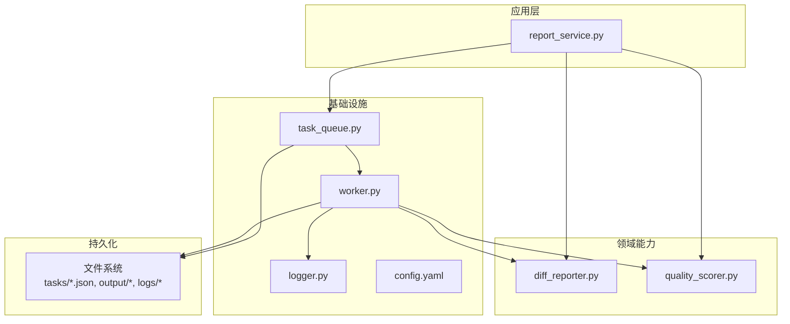
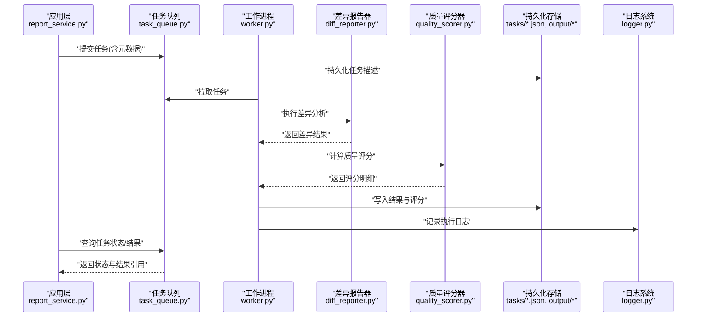
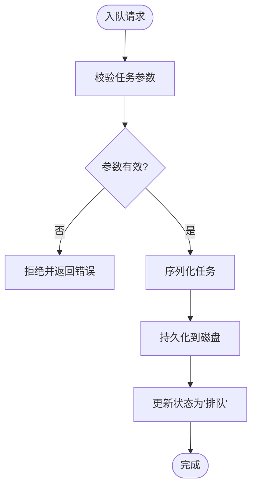
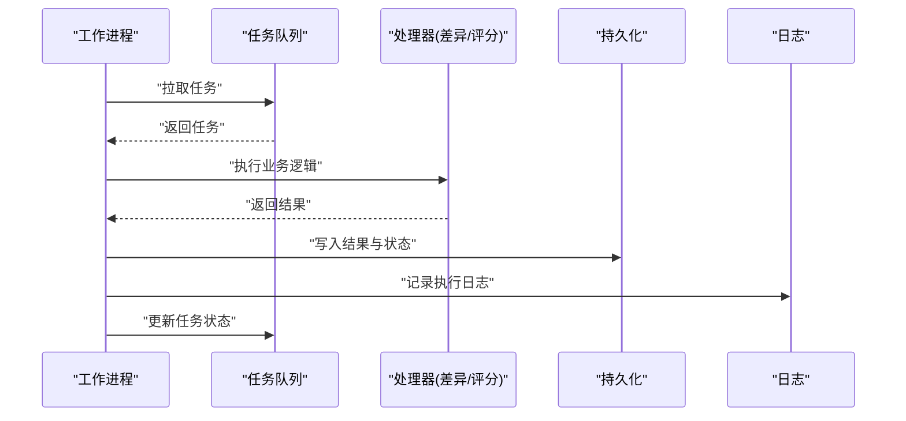
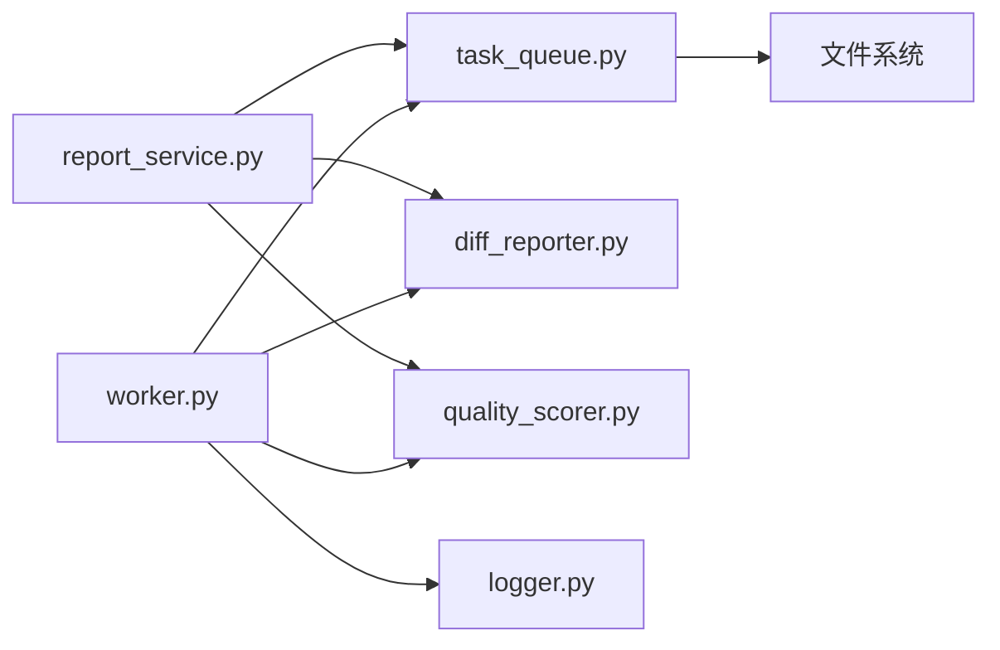

# 数据存储与缓存

<cite>
**本文引用的文件**   
- [src/paper_format_corrector/infrastructure/queue/task_queue.py](file://src/paper_format_corrector/infrastructure/queue/task_queue.py)
- [src/paper_format_corrector/infrastructure/queue/worker.py](file://src/paper_format_corrector/infrastructure/queue/worker.py)
- [src/paper_format_corrector/application/services/report_service.py](file://src/paper_format_corrector/application/services/report_service.py)
- [src/paper_format_corrector/quality/diff_reporter.py](file://src/paper_format_corrector/quality/diff_reporter.py)
- [src/paper_format_corrector/quality/quality_scorer.py](file://src/paper_format_corrector/quality/quality_scorer.py)
- [src/paper_format_corrector/infra/logger.py](file://src/paper_format_corrector/infra/logger.py)
- [config/config.yaml](file://config/config.yaml)
- [tests/test_task_queue.py](file://tests/test_task_queue.py)
</cite>

## 目录
1. [简介](#简介)
2. [项目结构](#项目结构)
3. [核心组件](#核心组件)
4. [架构总览](#架构总览)
5. [详细组件分析](#详细组件分析)
6. [依赖关系分析](#依赖关系分析)
7. [性能考虑](#性能考虑)
8. [故障排查指南](#故障排查指南)
9. [结论](#结论)
10. [附录：数据操作示例路径](#附录数据操作示例路径)

## 简介
本章节聚焦于“数据存储与缓存”主题，围绕任务队列系统、数据持久化与缓存策略、异步任务处理与工作进程管理、任务状态跟踪机制、差异报告生成与质量评分的数据存储方案、日志记录与监控指标收集、以及一致性保证、事务处理与备份恢复策略进行系统化说明。文档以仓库中实际实现为依据，提供可视化架构图与流程图，并给出可定位的代码片段路径，便于读者快速上手与深入理解。

## 项目结构
与数据存储和缓存相关的代码主要分布在以下位置：
- 任务队列与工作进程：infrastructure/queue 目录
- 报告服务与应用层编排：application/services 目录
- 质量评估与差异报告：quality 目录
- 日志基础设施：infra/logger.py
- 配置中心：config/config.yaml
- 测试用例（验证行为）：tests/test_task_queue.py

图表来源
- [src/paper_format_corrector/application/services/report_service.py](file://src/paper_format_corrector/application/services/report_service.py)
- [src/paper_format_corrector/quality/diff_reporter.py](file://src/paper_format_corrector/quality/diff_reporter.py)
- [src/paper_format_corrector/quality/quality_scorer.py](file://src/paper_format_corrector/quality/quality_scorer.py)
- [src/paper_format_corrector/infrastructure/queue/task_queue.py](file://src/paper_format_corrector/infrastructure/queue/task_queue.py)
- [src/paper_format_corrector/infrastructure/queue/worker.py](file://src/paper_format_corrector/infrastructure/queue/worker.py)
- [src/paper_format_corrector/infra/logger.py](file://src/paper_format_corrector/infra/logger.py)
- [config/config.yaml](file://config/config.yaml)

章节来源
- [src/paper_format_corrector/infrastructure/queue/task_queue.py](file://src/paper_format_corrector/infrastructure/queue/task_queue.py)
- [src/paper_format_corrector/infrastructure/queue/worker.py](file://src/paper_format_corrector/infrastructure/queue/worker.py)
- [src/paper_format_corrector/application/services/report_service.py](file://src/paper_format_corrector/application/services/report_service.py)
- [src/paper_format_corrector/quality/diff_reporter.py](file://src/paper_format_corrector/quality/diff_reporter.py)
- [src/paper_format_corrector/quality/quality_scorer.py](file://src/paper_format_corrector/quality/quality_scorer.py)
- [src/paper_format_corrector/infra/logger.py](file://src/paper_format_corrector/infra/logger.py)
- [config/config.yaml](file://config/config.yaml)

## 核心组件
- 任务队列（TaskQueue）：负责任务的入队、出队、状态更新与持久化到磁盘；为工作进程提供并发消费能力。
- 工作进程（Worker）：从队列拉取任务，执行具体业务逻辑（如差异报告生成、质量评分计算），并将结果写回持久化存储。
- 报告服务（ReportService）：应用层编排器，协调任务创建、提交至队列、等待完成与结果聚合。
- 差异报告器（DiffReporter）：对输入输出或前后版本进行对比，产出结构化差异结果。
- 质量评分器（QualityScorer）：基于规则与分析结果计算质量分数，并持久化评分明细。
- 日志系统（Logger）：统一采集运行期日志，支持按级别与模块输出，便于问题追踪与审计。
- 配置（config.yaml）：集中管理队列容量、重试次数、超时、持久化路径等关键参数。

章节来源
- [src/paper_format_corrector/infrastructure/queue/task_queue.py](file://src/paper_format_corrector/infrastructure/queue/task_queue.py)
- [src/paper_format_corrector/infrastructure/queue/worker.py](file://src/paper_format_corrector/infrastructure/queue/worker.py)
- [src/paper_format_corrector/application/services/report_service.py](file://src/paper_format_corrector/application/services/report_service.py)
- [src/paper_format_corrector/quality/diff_reporter.py](file://src/paper_format_corrector/quality/diff_reporter.py)
- [src/paper_format_corrector/quality/quality_scorer.py](file://src/paper_format_corrector/quality/quality_scorer.py)
- [src/paper_format_corrector/infra/logger.py](file://src/paper_format_corrector/infra/logger.py)
- [config/config.yaml](file://config/config.yaml)

## 架构总览
下图展示了从应用层发起任务到工作进程执行、再到结果落盘与日志记录的端到端流程。

图表来源
- [src/paper_format_corrector/application/services/report_service.py](file://src/paper_format_corrector/application/services/report_service.py)
- [src/paper_format_corrector/infrastructure/queue/task_queue.py](file://src/paper_format_corrector/infrastructure/queue/task_queue.py)
- [src/paper_format_corrector/infrastructure/queue/worker.py](file://src/paper_format_corrector/infrastructure/queue/worker.py)
- [src/paper_format_corrector/quality/diff_reporter.py](file://src/paper_format_corrector/quality/diff_reporter.py)
- [src/paper_format_corrector/quality/quality_scorer.py](file://src/paper_format_corrector/quality/quality_scorer.py)
- [src/paper_format_corrector/infra/logger.py](file://src/paper_format_corrector/infra/logger.py)

## 详细组件分析

### 任务队列与持久化（TaskQueue）
- 职责
  - 任务入队：接收任务定义（类型、参数、优先级、超时、重试策略等）。
  - 任务出队：供工作进程安全地拉取下一个待处理任务。
  - 状态机：维护任务生命周期（排队、进行中、成功、失败、重试等）。
  - 持久化：将任务与结果序列化到磁盘，确保崩溃恢复后可继续处理。
- 数据结构与复杂度
  - 任务对象包含唯一标识、元数据、状态、错误信息、时间戳等字段。
  - 典型操作（入队/出队/更新状态）在内存中为 O(1)，持久化写入为 I/O 开销，受磁盘与序列化影响。
- 并发与一致性
  - 通过锁或原子写入避免多进程竞争导致的状态不一致。
  - 建议采用幂等写入与校验和，防止重复消费与损坏。
- 错误处理与重试
  - 捕获异常并记录错误堆栈，根据策略进行重试或标记失败。
  - 支持死信队列或失败任务归档，便于人工干预。
- 配置项
  - 队列容量、最大重试次数、任务超时、持久化目录等由配置文件驱动。

图表来源
- [src/paper_format_corrector/infrastructure/queue/task_queue.py](file://src/paper_format_corrector/infrastructure/queue/task_queue.py)
- [config/config.yaml](file://config/config.yaml)

章节来源
- [src/paper_format_corrector/infrastructure/queue/task_queue.py](file://src/paper_format_corrector/infrastructure/queue/task_queue.py)
- [config/config.yaml](file://config/config.yaml)

### 工作进程与任务执行（Worker）
- 职责
  - 循环拉取任务，分配给处理器执行。
  - 管理执行上下文（超时、重试、资源清理）。
  - 将执行结果与中间产物落盘，并更新任务状态。
- 执行流程
  - 拉取任务 -> 解析参数 -> 调用业务处理器（差异报告、质量评分）-> 合并结果 -> 持久化 -> 记录日志 -> 更新状态。
- 健壮性
  - 异常隔离：单个任务失败不影响其他任务。
  - 优雅退出：信号处理与资源释放。
  - 健康检查：暴露心跳或就绪探针以便外部监控。

图表来源
- [src/paper_format_corrector/infrastructure/queue/worker.py](file://src/paper_format_corrector/infrastructure/queue/worker.py)
- [src/paper_format_corrector/quality/diff_reporter.py](file://src/paper_format_corrector/quality/diff_reporter.py)
- [src/paper_format_corrector/quality/quality_scorer.py](file://src/paper_format_corrector/quality/quality_scorer.py)
- [src/paper_format_corrector/infra/logger.py](file://src/paper_format_corrector/infra/logger.py)

章节来源
- [src/paper_format_corrector/infrastructure/queue/worker.py](file://src/paper_format_corrector/infrastructure/queue/worker.py)
- [src/paper_format_corrector/quality/diff_reporter.py](file://src/paper_format_corrector/quality/diff_reporter.py)
- [src/paper_format_corrector/quality/quality_scorer.py](file://src/paper_format_corrector/quality/quality_scorer.py)
- [src/paper_format_corrector/infra/logger.py](file://src/paper_format_corrector/infra/logger.py)

### 报告服务（ReportService）
- 职责
  - 编排任务创建与提交，封装业务语义（如“生成差异报告”、“计算质量评分”）。
  - 提供查询接口，获取任务状态与结果摘要。
  - 与队列交互，屏蔽底层细节。
- 设计要点
  - 面向接口编程：上层仅依赖服务抽象，不关心队列实现。
  - 结果聚合：组合多个子任务的结果形成最终报告。

章节来源
- [src/paper_format_corrector/application/services/report_service.py](file://src/paper_format_corrector/application/services/report_service.py)

### 差异报告器（DiffReporter）
- 职责
  - 比较两个文档或同一文档的两次处理结果，提取变更点（新增、删除、修改）。
  - 输出结构化差异数据，便于后续分析与展示。
- 数据流
  - 输入：源文档与目标文档（或中间态）。
  - 输出：差异清单与统计摘要。
- 存储
  - 差异结果通常以 JSON 或专用格式落盘，附带时间戳与任务 ID。

章节来源
- [src/paper_format_corrector/quality/diff_reporter.py](file://src/paper_format_corrector/quality/diff_reporter.py)

### 质量评分器（QualityScorer）
- 职责
  - 基于规则引擎与分析结果计算质量分数。
  - 输出评分明细（维度分、扣分原因、改进建议）。
- 计算流程
  - 读取分析结果与差异数据 -> 应用规则 -> 汇总得分 -> 持久化评分。
- 扩展性
  - 规则可配置化，支持插件式扩展。

章节来源
- [src/paper_format_corrector/quality/quality_scorer.py](file://src/paper_format_corrector/quality/quality_scorer.py)

### 日志系统（Logger）
- 职责
  - 统一日志入口，支持不同级别（DEBUG/INFO/WARN/ERROR）。
  - 按模块与任务上下文组织日志，便于检索。
- 使用建议
  - 在关键路径埋点（入队、出队、执行开始/结束、异常）。
  - 避免打印敏感信息，注意日志轮转与大小限制。

章节来源
- [src/paper_format_corrector/infra/logger.py](file://src/paper_format_corrector/infra/logger.py)

### 配置管理（config.yaml）
- 作用
  - 集中管理队列容量、重试策略、超时、持久化路径、日志级别等。
- 最佳实践
  - 区分环境配置（开发/测试/生产）。
  - 提供默认值与校验，启动时加载并热更新可选。

章节来源
- [config/config.yaml](file://config/config.yaml)

## 依赖关系分析
- 耦合度
  - ReportService 与 TaskQueue 松耦合，通过接口交互。
  - Worker 依赖 DiffReporter 与 QualityScorer，但可通过注入替换实现。
- 外部依赖
  - 文件系统用于持久化任务与结果。
  - 日志框架用于记录运行期信息。
- 潜在循环依赖
  - 当前分层清晰，未见直接循环依赖；需保持应用层不反向依赖基础设施。

图表来源
- [src/paper_format_corrector/application/services/report_service.py](file://src/paper_format_corrector/application/services/report_service.py)
- [src/paper_format_corrector/infrastructure/queue/task_queue.py](file://src/paper_format_corrector/infrastructure/queue/task_queue.py)
- [src/paper_format_corrector/infrastructure/queue/worker.py](file://src/paper_format_corrector/infrastructure/queue/worker.py)
- [src/paper_format_corrector/quality/diff_reporter.py](file://src/paper_format_corrector/quality/diff_reporter.py)
- [src/paper_format_corrector/quality/quality_scorer.py](file://src/paper_format_corrector/quality/quality_scorer.py)
- [src/paper_format_corrector/infra/logger.py](file://src/paper_format_corrector/infra/logger.py)

章节来源
- [src/paper_format_corrector/application/services/report_service.py](file://src/paper_format_corrector/application/services/report_service.py)
- [src/paper_format_corrector/infrastructure/queue/task_queue.py](file://src/paper_format_corrector/infrastructure/queue/task_queue.py)
- [src/paper_format_corrector/infrastructure/queue/worker.py](file://src/paper_format_corrector/infrastructure/queue/worker.py)
- [src/paper_format_corrector/quality/diff_reporter.py](file://src/paper_format_corrector/quality/diff_reporter.py)
- [src/paper_format_corrector/quality/quality_scorer.py](file://src/paper_format_corrector/quality/quality_scorer.py)
- [src/paper_format_corrector/infra/logger.py](file://src/paper_format_corrector/infra/logger.py)

## 性能考虑
- 队列吞吐
  - 合理设置队列容量与工作进程数，避免背压与内存膨胀。
  - 批量拉取与批处理可降低 I/O 频率。
- 持久化优化
  - 使用追加写入与压缩减少磁盘占用。
  - 定期归档旧任务与结果，控制目录规模。
- 计算密集型任务
  - 拆分大任务为子任务并行处理。
  - 引入缓存（如最近差异结果、评分规则命中缓存）以减少重复计算。
- 监控与告警
  - 暴露队列长度、任务耗时、失败率等指标。
  - 结合日志与指标进行根因分析。

[本节为通用指导，无需特定文件来源]

## 故障排查指南
- 常见问题
  - 任务堆积：检查工作进程是否存活、队列容量与拉取速率是否匹配。
  - 任务失败：查看任务错误信息与日志堆栈，确认参数与依赖资源。
  - 结果不一致：核对幂等性与写入顺序，检查并发锁是否正确。
- 定位方法
  - 通过任务 ID 检索对应日志与结果文件。
  - 使用配置调整日志级别，复现问题后收集诊断信息。
- 恢复策略
  - 重启工作进程后自动续跑未完成任务。
  - 对失败任务进行重放或人工修正后重新提交。

章节来源
- [tests/test_task_queue.py](file://tests/test_task_queue.py)
- [src/paper_format_corrector/infra/logger.py](file://src/paper_format_corrector/infra/logger.py)

## 结论
本系统通过任务队列与工作进程实现了异步、可扩展的处理管线；以文件系统作为持久化介质，配合日志与配置管理，形成了稳定可靠的数据存储与缓存基础。差异报告与质量评分作为核心业务能力，被良好地解耦与编排。建议在后续迭代中引入更完善的监控指标、缓存层与备份恢复机制，进一步提升系统的可观测性与韧性。

[本节为总结性内容，无需特定文件来源]

## 附录：数据操作示例路径
以下为常用数据操作的代码片段路径，便于快速查阅与复用：
- 提交任务到队列
  - [提交任务示例路径](file://src/paper_format_corrector/application/services/report_service.py)
- 拉取并执行任务
  - [拉取任务示例路径](file://src/paper_format_corrector/infrastructure/queue/worker.py)
- 更新任务状态
  - [更新状态示例路径](file://src/paper_format_corrector/infrastructure/queue/task_queue.py)
- 生成差异报告
  - [差异报告示例路径](file://src/paper_format_corrector/quality/diff_reporter.py)
- 计算质量评分
  - [质量评分示例路径](file://src/paper_format_corrector/quality/quality_scorer.py)
- 记录日志
  - [日志记录示例路径](file://src/paper_format_corrector/infra/logger.py)
- 读取配置
  - [配置读取示例路径](file://config/config.yaml)

章节来源
- [src/paper_format_corrector/application/services/report_service.py](file://src/paper_format_corrector/application/services/report_service.py)
- [src/paper_format_corrector/infrastructure/queue/worker.py](file://src/paper_format_corrector/infrastructure/queue/worker.py)
- [src/paper_format_corrector/infrastructure/queue/task_queue.py](file://src/paper_format_corrector/infrastructure/queue/task_queue.py)
- [src/paper_format_corrector/quality/diff_reporter.py](file://src/paper_format_corrector/quality/diff_reporter.py)
- [src/paper_format_corrector/quality/quality_scorer.py](file://src/paper_format_corrector/quality/quality_scorer.py)
- [src/paper_format_corrector/infra/logger.py](file://src/paper_format_corrector/infra/logger.py)
- [config/config.yaml](file://config/config.yaml)