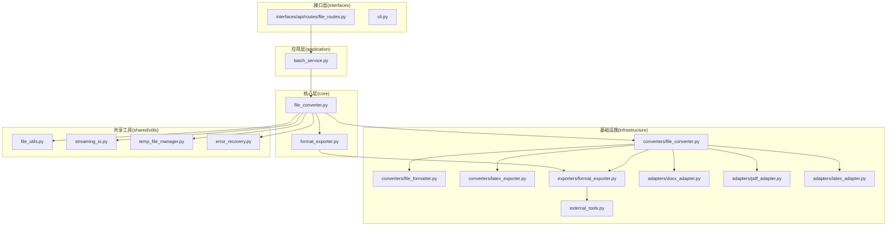
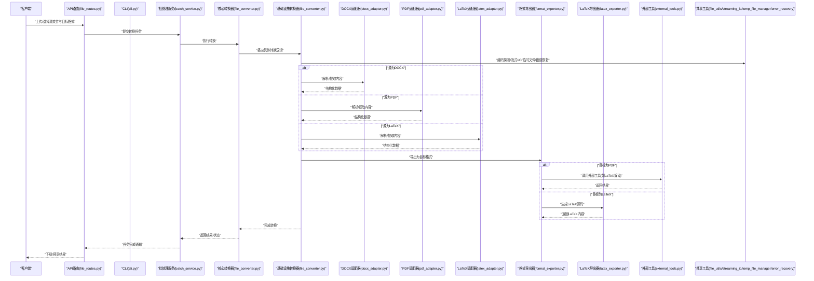
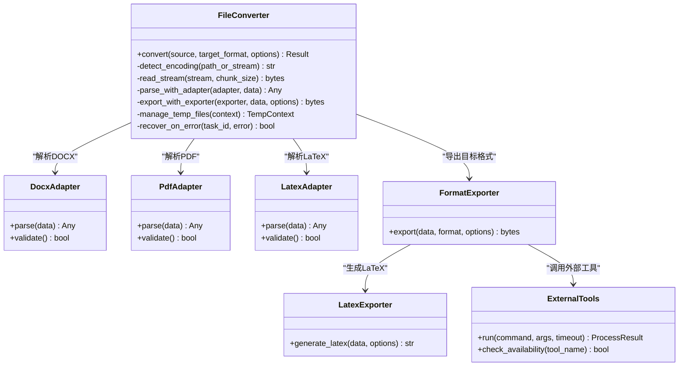
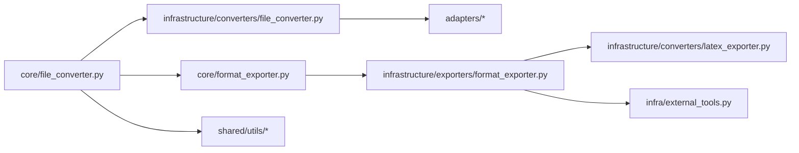

# 文件操作与转换

<cite>
**本文引用的文件**   
- [src/paper_format_corrector/core/file_converter.py](file://src/paper_format_corrector/core/file_converter.py)
- [src/paper_format_corrector/infrastructure/converters/file_converter.py](file://src/paper_format_corrector/infrastructure/converters/file_converter.py)
- [src/paper_format_corrector/infrastructure/converters/file_formatter.py](file://src/paper_format_corrector/infrastructure/converters/file_formatter.py)
- [src/paper_format_corrector/infrastructure/converters/latex_exporter.py](file://src/paper_format_corrector/infrastructure/converters/latex_exporter.py)
- [src/paper_format_corrector/core/format_exporter.py](file://src/paper_format_corrector/core/format_exporter.py)
- [src/paper_format_corrector/infrastructure/exporters/format_exporter.py](file://src/paper_format_corrector/infrastructure/exporters/format_exporter.py)
- [src/paper_format_corrector/infra/external_tools.py](file://src/paper_format_corrector/infra/external_tools.py)
- [src/paper_format_corrector/shared/utils/file_utils.py](file://src/paper_format_corrector/shared/utils/file_utils.py)
- [src/paper_format_corrector/shared/utils/streaming_io.py](file://src/paper_format_corrector/shared/utils/streaming_io.py)
- [src/paper_format_corrector/shared/utils/temp_file_manager.py](file://src/paper_format_corrector/shared/utils/temp_file_manager.py)
- [src/paper_format_corrector/shared/utils/error_recovery.py](file://src/paper_format_corrector/shared/utils/error_recovery.py)
- [src/paper_format_corrector/infrastructure/adapters/docx_adapter.py](file://src/paper_format_corrector/infrastructure/adapters/docx_adapter.py)
- [src/paper_format_corrector/infrastructure/adapters/pdf_adapter.py](file://src/paper_format_corrector/infrastructure/adapters/pdf_adapter.py)
- [src/paper_format_corrector/infrastructure/adapters/latex_adapter.py](file://src/paper_format_corrector/infrastructure/adapters/latex_adapter.py)
- [src/paper_format_corrector/application/services/batch_service.py](file://src/paper_format_corrector/application/services/batch_service.py)
- [src/paper_format_corrector/interfaces/api/routes/file_routes.py](file://src/paper_format_corrector/interfaces/api/routes/file_routes.py)
- [src/paper_format_corrector/cli.py](file://src/paper_format_corrector/cli.py)
</cite>

## 目录
1. [简介](#简介)
2. [项目结构](#项目结构)
3. [核心组件](#核心组件)
4. [架构总览](#架构总览)
5. [详细组件分析](#详细组件分析)
6. [依赖关系分析](#依赖关系分析)
7. [性能考虑](#性能考虑)
8. [故障排查指南](#故障排查指南)
9. [结论](#结论)
10. [附录](#附录)

## 简介
本文件聚焦于“文件操作与转换”子系统，覆盖文件格式检测、格式转换与文件处理的核心实现。文档面向不同技术背景的读者，既提供高层架构说明，也深入到关键模块的实现细节，包括：
- 支持的输入输出格式（DOCX、PDF、LaTeX 等）
- 格式转换算法与兼容性处理
- 文件编码处理、大文件流式处理、临时文件管理
- 错误恢复机制与资源管理最佳实践
- 使用示例与配置选项（以路径引用方式给出）

## 项目结构
围绕文件操作与转换的目录组织采用分层与职责分离策略：
- core 层定义领域能力与编排流程（如文件转换器、导出器）
- infrastructure 层提供具体适配器与转换器实现（docx/pdf/latex 适配、格式导出、外部工具调用）
- shared/utils 提供通用工具（文件工具、流式 I/O、临时文件管理、错误恢复）
- application 层编排业务服务（批量任务、报告生成等）
- interfaces 层暴露 API 与 CLI 入口

图表来源
- [src/paper_format_corrector/core/file_converter.py](file://src/paper_format_corrector/core/file_converter.py)
- [src/paper_format_corrector/infrastructure/converters/file_converter.py](file://src/paper_format_corrector/infrastructure/converters/file_converter.py)
- [src/paper_format_corrector/infrastructure/converters/file_formatter.py](file://src/paper_format_corrector/infrastructure/converters/file_formatter.py)
- [src/paper_format_corrector/infrastructure/converters/latex_exporter.py](file://src/paper_format_corrector/infrastructure/converters/latex_exporter.py)
- [src/paper_format_corrector/core/format_exporter.py](file://src/paper_format_corrector/core/format_exporter.py)
- [src/paper_format_corrector/infrastructure/exporters/format_exporter.py](file://src/paper_format_corrector/infrastructure/exporters/format_exporter.py)
- [src/paper_format_corrector/infra/external_tools.py](file://src/paper_format_corrector/infra/external_tools.py)
- [src/paper_format_corrector/shared/utils/file_utils.py](file://src/paper_format_corrector/shared/utils/file_utils.py)
- [src/paper_format_corrector/shared/utils/streaming_io.py](file://src/paper_format_corrector/shared/utils/streaming_io.py)
- [src/paper_format_corrector/shared/utils/temp_file_manager.py](file://src/paper_format_corrector/shared/utils/temp_file_manager.py)
- [src/paper_format_corrector/shared/utils/error_recovery.py](file://src/paper_format_corrector/shared/utils/error_recovery.py)
- [src/paper_format_corrector/infrastructure/adapters/docx_adapter.py](file://src/paper_format_corrector/infrastructure/adapters/docx_adapter.py)
- [src/paper_format_corrector/infrastructure/adapters/pdf_adapter.py](file://src/paper_format_corrector/infrastructure/adapters/pdf_adapter.py)
- [src/paper_format_corrector/infrastructure/adapters/latex_adapter.py](file://src/paper_format_corrector/infrastructure/adapters/latex_adapter.py)
- [src/paper_format_corrector/application/services/batch_service.py](file://src/paper_format_corrector/application/services/batch_service.py)
- [src/paper_format_corrector/interfaces/api/routes/file_routes.py](file://src/paper_format_corrector/interfaces/api/routes/file_routes.py)
- [src/paper_format_corrector/cli.py](file://src/paper_format_corrector/cli.py)

章节来源
- [src/paper_format_corrector/core/file_converter.py](file://src/paper_format_corrector/core/file_converter.py)
- [src/paper_format_corrector/infrastructure/converters/file_converter.py](file://src/paper_format_corrector/infrastructure/converters/file_converter.py)
- [src/paper_format_corrector/infrastructure/converters/file_formatter.py](file://src/paper_format_corrector/infrastructure/converters/file_formatter.py)
- [src/paper_format_corrector/infrastructure/converters/latex_exporter.py](file://src/paper_format_corrector/infrastructure/converters/latex_exporter.py)
- [src/paper_format_corrector/core/format_exporter.py](file://src/paper_format_corrector/core/format_exporter.py)
- [src/paper_format_corrector/infrastructure/exporters/format_exporter.py](file://src/paper_format_corrector/infrastructure/exporters/format_exporter.py)
- [src/paper_format_corrector/infra/external_tools.py](file://src/paper_format_corrector/infra/external_tools.py)
- [src/paper_format_corrector/shared/utils/file_utils.py](file://src/paper_format_corrector/shared/utils/file_utils.py)
- [src/paper_format_corrector/shared/utils/streaming_io.py](file://src/paper_format_corrector/shared/utils/streaming_io.py)
- [src/paper_format_corrector/shared/utils/temp_file_manager.py](file://src/paper_format_corrector/shared/utils/temp_file_manager.py)
- [src/paper_format_corrector/shared/utils/error_recovery.py](file://src/paper_format_corrector/shared/utils/error_recovery.py)
- [src/paper_format_corrector/infrastructure/adapters/docx_adapter.py](file://src/paper_format_corrector/infrastructure/adapters/docx_adapter.py)
- [src/paper_format_corrector/infrastructure/adapters/pdf_adapter.py](file://src/paper_format_corrector/infrastructure/adapters/pdf_adapter.py)
- [src/paper_format_corrector/infrastructure/adapters/latex_adapter.py](file://src/paper_format_corrector/infrastructure/adapters/latex_adapter.py)
- [src/paper_format_corrector/application/services/batch_service.py](file://src/paper_format_corrector/application/services/batch_service.py)
- [src/paper_format_corrector/interfaces/api/routes/file_routes.py](file://src/paper_format_corrector/interfaces/api/routes/file_routes.py)
- [src/paper_format_corrector/cli.py](file://src/paper_format_corrector/cli.py)

## 核心组件
- 文件转换器（core + infrastructure）
  - 负责从源文件读取、解析、转换到目标格式，协调适配器与导出器。
  - 支持 DOCX、PDF、LaTeX 等格式的读写与转换。
- 格式导出器（core + infrastructure）
  - 将中间表示或结构化数据导出为目标格式（如 PDF/LaTeX）。
- 外部工具集成
  - 通过命令行工具或系统命令完成特定格式转换（例如 LaTeX 编译为 PDF）。
- 共享工具
  - 文件工具：编码探测、类型识别、路径安全校验。
  - 流式 I/O：分块读写，降低内存占用。
  - 临时文件管理：生命周期管理与清理。
  - 错误恢复：重试、回滚、断点续转。

章节来源
- [src/paper_format_corrector/core/file_converter.py](file://src/paper_format_corrector/core/file_converter.py)
- [src/paper_format_corrector/infrastructure/converters/file_converter.py](file://src/paper_format_corrector/infrastructure/converters/file_converter.py)
- [src/paper_format_corrector/core/format_exporter.py](file://src/paper_format_corrector/core/format_exporter.py)
- [src/paper_format_corrector/infrastructure/exporters/format_exporter.py](file://src/paper_format_corrector/infrastructure/exporters/format_exporter.py)
- [src/paper_format_corrector/infra/external_tools.py](file://src/paper_format_corrector/infra/external_tools.py)
- [src/paper_format_corrector/shared/utils/file_utils.py](file://src/paper_format_corrector/shared/utils/file_utils.py)
- [src/paper_format_corrector/shared/utils/streaming_io.py](file://src/paper_format_corrector/shared/utils/streaming_io.py)
- [src/paper_format_corrector/shared/utils/temp_file_manager.py](file://src/paper_format_corrector/shared/utils/temp_file_manager.py)
- [src/paper_format_corrector/shared/utils/error_recovery.py](file://src/paper_format_corrector/shared/utils/error_recovery.py)

## 架构总览
下图展示了从请求入口到具体转换执行的端到端流程，涵盖 API/CLI、批处理服务、核心转换器、适配器与导出器、外部工具以及共享工具。

图表来源
- [src/paper_format_corrector/interfaces/api/routes/file_routes.py](file://src/paper_format_corrector/interfaces/api/routes/file_routes.py)
- [src/paper_format_corrector/cli.py](file://src/paper_format_corrector/cli.py)
- [src/paper_format_corrector/application/services/batch_service.py](file://src/paper_format_corrector/application/services/batch_service.py)
- [src/paper_format_corrector/core/file_converter.py](file://src/paper_format_corrector/core/file_converter.py)
- [src/paper_format_corrector/infrastructure/converters/file_converter.py](file://src/paper_format_corrector/infrastructure/converters/file_converter.py)
- [src/paper_format_corrector/infrastructure/adapters/docx_adapter.py](file://src/paper_format_corrector/infrastructure/adapters/docx_adapter.py)
- [src/paper_format_corrector/infrastructure/adapters/pdf_adapter.py](file://src/paper_format_corrector/infrastructure/adapters/pdf_adapter.py)
- [src/paper_format_corrector/infrastructure/adapters/latex_adapter.py](file://src/paper_format_corrector/infrastructure/adapters/latex_adapter.py)
- [src/paper_format_corrector/core/format_exporter.py](file://src/paper_format_corrector/core/format_exporter.py)
- [src/paper_format_corrector/infrastructure/exporters/format_exporter.py](file://src/paper_format_corrector/infrastructure/exporters/format_exporter.py)
- [src/paper_format_corrector/infrastructure/converters/latex_exporter.py](file://src/paper_format_corrector/infrastructure/converters/latex_exporter.py)
- [src/paper_format_corrector/infra/external_tools.py](file://src/paper_format_corrector/infra/external_tools.py)
- [src/paper_format_corrector/shared/utils/file_utils.py](file://src/paper_format_corrector/shared/utils/file_utils.py)
- [src/paper_format_corrector/shared/utils/streaming_io.py](file://src/paper_format_corrector/shared/utils/streaming_io.py)
- [src/paper_format_corrector/shared/utils/temp_file_manager.py](file://src/paper_format_corrector/shared/utils/temp_file_manager.py)
- [src/paper_format_corrector/shared/utils/error_recovery.py](file://src/paper_format_corrector/shared/utils/error_recovery.py)

## 详细组件分析

### 文件转换器（核心与基础设施）
- 职责
  - 统一入口：接收源文件路径/字节流与目标格式参数。
  - 流程编排：编码探测、流式读取、解析、转换、导出、清理。
  - 兼容处理：针对不同格式采用相应适配器；对缺失的外部依赖进行降级或提示。
- 关键点
  - 使用共享工具进行编码检测与流式 I/O，避免一次性加载大文件。
  - 临时文件用于中间产物（如 LaTeX 中间文件），确保异常时自动清理。
  - 错误恢复支持重试与部分回滚，保证任务可继续。

图表来源
- [src/paper_format_corrector/core/file_converter.py](file://src/paper_format_corrector/core/file_converter.py)
- [src/paper_format_corrector/infrastructure/converters/file_converter.py](file://src/paper_format_corrector/infrastructure/converters/file_converter.py)
- [src/paper_format_corrector/infrastructure/adapters/docx_adapter.py](file://src/paper_format_corrector/infrastructure/adapters/docx_adapter.py)
- [src/paper_format_corrector/infrastructure/adapters/pdf_adapter.py](file://src/paper_format_corrector/infrastructure/adapters/pdf_adapter.py)
- [src/paper_format_corrector/infrastructure/adapters/latex_adapter.py](file://src/paper_format_corrector/infrastructure/adapters/latex_adapter.py)
- [src/paper_format_corrector/core/format_exporter.py](file://src/paper_format_corrector/core/format_exporter.py)
- [src/paper_format_corrector/infrastructure/exporters/format_exporter.py](file://src/paper_format_corrector/infrastructure/exporters/format_exporter.py)
- [src/paper_format_corrector/infrastructure/converters/latex_exporter.py](file://src/paper_format_corrector/infrastructure/converters/latex_exporter.py)
- [src/paper_format_corrector/infra/external_tools.py](file://src/paper_format_corrector/infra/external_tools.py)

章节来源
- [src/paper_format_corrector/core/file_converter.py](file://src/paper_format_corrector/core/file_converter.py)
- [src/paper_format_corrector/infrastructure/converters/file_converter.py](file://src/paper_format_corrector/infrastructure/converters/file_converter.py)
- [src/paper_format_corrector/infrastructure/adapters/docx_adapter.py](file://src/paper_format_corrector/infrastructure/adapters/docx_adapter.py)
- [src/paper_format_corrector/infrastructure/adapters/pdf_adapter.py](file://src/paper_format_corrector/infrastructure/adapters/pdf_adapter.py)
- [src/paper_format_corrector/infrastructure/adapters/latex_adapter.py](file://src/paper_format_corrector/infrastructure/adapters/latex_adapter.py)
- [src/paper_format_corrector/core/format_exporter.py](file://src/paper_format_corrector/core/format_exporter.py)
- [src/paper_format_corrector/infrastructure/exporters/format_exporter.py](file://src/paper_format_corrector/infrastructure/exporters/format_exporter.py)
- [src/paper_format_corrector/infrastructure/converters/latex_exporter.py](file://src/paper_format_corrector/infrastructure/converters/latex_exporter.py)
- [src/paper_format_corrector/infra/external_tools.py](file://src/paper_format_corrector/infra/external_tools.py)

### 格式导出器与LaTeX导出器
- 职责
  - 将结构化数据转换为指定格式（PDF/LaTeX/其他）。
  - LaTeX 导出器负责生成符合模板与样式的 LaTeX 源码。
- 关键点
  - 导出前进行数据校验与样式注入。
  - 对于需要外部工具链的场景（如 LaTeX→PDF），通过外部工具模块调用并处理超时与错误码。

章节来源
- [src/paper_format_corrector/core/format_exporter.py](file://src/paper_format_corrector/core/format_exporter.py)
- [src/paper_format_corrector/infrastructure/exporters/format_exporter.py](file://src/paper_format_corrector/infrastructure/exporters/format_exporter.py)
- [src/paper_format_corrector/infrastructure/converters/latex_exporter.py](file://src/paper_format_corrector/infrastructure/converters/latex_exporter.py)
- [src/paper_format_corrector/infra/external_tools.py](file://src/paper_format_corrector/infra/external_tools.py)

### 外部工具集成
- 职责
  - 封装系统命令调用（如 latexmk、pdflatex、xelatex 等）。
  - 检查工具可用性、设置环境变量、捕获输出与错误。
- 关键点
  - 超时控制与进程退出码处理。
  - 失败时的降级策略（如仅生成 LaTeX 而不编译 PDF）。

章节来源
- [src/paper_format_corrector/infra/external_tools.py](file://src/paper_format_corrector/infra/external_tools.py)

### 共享工具（编码、流式I/O、临时文件、错误恢复）
- 文件工具
  - 编码探测：基于 BOM 与启发式规则推断文本编码。
  - 类型识别：根据扩展名与魔数判断文件类型。
- 流式 I/O
  - 分块读取与写入，避免大文件导致内存峰值过高。
- 临时文件管理
  - 上下文管理器模式，确保异常时自动清理中间文件。
- 错误恢复
  - 重试策略（指数退避）、断点续转、事务性回滚。

章节来源
- [src/paper_format_corrector/shared/utils/file_utils.py](file://src/paper_format_corrector/shared/utils/file_utils.py)
- [src/paper_format_corrector/shared/utils/streaming_io.py](file://src/paper_format_corrector/shared/utils/streaming_io.py)
- [src/paper_format_corrector/shared/utils/temp_file_manager.py](file://src/paper_format_corrector/shared/utils/temp_file_manager.py)
- [src/paper_format_corrector/shared/utils/error_recovery.py](file://src/paper_format_corrector/shared/utils/error_recovery.py)

### 适配器（DOCX/PDF/LaTeX）
- 职责
  - 解析对应格式的结构化内容，输出统一的中间表示。
  - 验证内容与元数据完整性。
- 关键点
  - 针对复杂元素（表格、图片、公式）进行规范化。
  - 对不兼容特性进行映射或降级处理。

章节来源
- [src/paper_format_corrector/infrastructure/adapters/docx_adapter.py](file://src/paper_format_corrector/infrastructure/adapters/docx_adapter.py)
- [src/paper_format_corrector/infrastructure/adapters/pdf_adapter.py](file://src/paper_format_corrector/infrastructure/adapters/pdf_adapter.py)
- [src/paper_format_corrector/infrastructure/adapters/latex_adapter.py](file://src/paper_format_corrector/infrastructure/adapters/latex_adapter.py)

### 批处理服务与接口入口
- 批处理服务
  - 队列化任务、并发控制、进度上报、失败重试。
- API 路由
  - 提供文件上传、转换任务提交、结果查询与下载的 HTTP 接口。
- CLI
  - 提供命令行参数与交互流程，便于脚本化与自动化。

章节来源
- [src/paper_format_corrector/application/services/batch_service.py](file://src/paper_format_corrector/application/services/batch_service.py)
- [src/paper_format_corrector/interfaces/api/routes/file_routes.py](file://src/paper_format_corrector/interfaces/api/routes/file_routes.py)
- [src/paper_format_corrector/cli.py](file://src/paper_format_corrector/cli.py)

## 依赖关系分析
- 组件耦合
  - 核心转换器依赖基础设施转换器与导出器；导出器可能依赖外部工具。
  - 适配器与导出器解耦，通过中间表示交换数据，提升可扩展性。
- 外部依赖
  - LaTeX 工具链（可选）：仅在目标为 PDF 且需要编译时启用。
  - 第三方库：各适配器内部依赖各自解析库（由包管理声明）。
- 潜在循环依赖
  - 通过明确分层与接口隔离避免循环导入。

图表来源
- [src/paper_format_corrector/core/file_converter.py](file://src/paper_format_corrector/core/file_converter.py)
- [src/paper_format_corrector/infrastructure/converters/file_converter.py](file://src/paper_format_corrector/infrastructure/converters/file_converter.py)
- [src/paper_format_corrector/core/format_exporter.py](file://src/paper_format_corrector/core/format_exporter.py)
- [src/paper_format_corrector/infrastructure/exporters/format_exporter.py](file://src/paper_format_corrector/infrastructure/exporters/format_exporter.py)
- [src/paper_format_corrector/infrastructure/converters/latex_exporter.py](file://src/paper_format_corrector/infrastructure/converters/latex_exporter.py)
- [src/paper_format_corrector/infra/external_tools.py](file://src/paper_format_corrector/infra/external_tools.py)
- [src/paper_format_corrector/shared/utils/file_utils.py](file://src/paper_format_corrector/shared/utils/file_utils.py)
- [src/paper_format_corrector/shared/utils/streaming_io.py](file://src/paper_format_corrector/shared/utils/streaming_io.py)
- [src/paper_format_corrector/shared/utils/temp_file_manager.py](file://src/paper_format_corrector/shared/utils/temp_file_manager.py)
- [src/paper_format_corrector/shared/utils/error_recovery.py](file://src/paper_format_corrector/shared/utils/error_recovery.py)

章节来源
- [src/paper_format_corrector/core/file_converter.py](file://src/paper_format_corrector/core/file_converter.py)
- [src/paper_format_corrector/infrastructure/converters/file_converter.py](file://src/paper_format_corrector/infrastructure/converters/file_converter.py)
- [src/paper_format_corrector/core/format_exporter.py](file://src/paper_format_corrector/core/format_exporter.py)
- [src/paper_format_corrector/infrastructure/exporters/format_exporter.py](file://src/paper_format_corrector/infrastructure/exporters/format_exporter.py)
- [src/paper_format_corrector/infrastructure/converters/latex_exporter.py](file://src/paper_format_corrector/infrastructure/converters/latex_exporter.py)
- [src/paper_format_corrector/infra/external_tools.py](file://src/paper_format_corrector/infra/external_tools.py)
- [src/paper_format_corrector/shared/utils/file_utils.py](file://src/paper_format_corrector/shared/utils/file_utils.py)
- [src/paper_format_corrector/shared/utils/streaming_io.py](file://src/paper_format_corrector/shared/utils/streaming_io.py)
- [src/paper_format_corrector/shared/utils/temp_file_manager.py](file://src/paper_format_corrector/shared/utils/temp_file_manager.py)
- [src/paper_format_corrector/shared/utils/error_recovery.py](file://src/paper_format_corrector/shared/utils/error_recovery.py)

## 性能考虑
- 流式处理
  - 使用分块 I/O 减少内存占用，适合大文档与高并发场景。
- 并行与队列
  - 批处理服务结合任务队列与并发限制，提高吞吐。
- 外部工具优化
  - 缓存工具链版本与环境变量，避免重复初始化开销。
- 临时文件策略
  - 合理设置临时目录与清理策略，防止磁盘空间耗尽。
- 编码与解析优化
  - 优先使用增量解析与懒加载，避免全量构建 DOM。

[本节为通用指导，无需列出具体文件来源]

## 故障排查指南
- 常见问题
  - 编码错误：确认编码探测结果，必要时手动指定编码。
  - 外部工具不可用：检查 LaTeX 工具链安装与环境变量。
  - 大文件 OOM：调整分块大小与并发度，启用流式处理。
  - 临时文件残留：检查临时文件管理器的清理逻辑与权限。
- 定位方法
  - 查看批处理服务日志与任务状态。
  - 启用调试模式，记录转换阶段与中间产物路径。
  - 使用错误恢复模块的重试与回滚信息辅助定位。

章节来源
- [src/paper_format_corrector/shared/utils/error_recovery.py](file://src/paper_format_corrector/shared/utils/error_recovery.py)
- [src/paper_format_corrector/shared/utils/temp_file_manager.py](file://src/paper_format_corrector/shared/utils/temp_file_manager.py)
- [src/paper_format_corrector/application/services/batch_service.py](file://src/paper_format_corrector/application/services/batch_service.py)

## 结论
该文件操作与转换子系统通过清晰的分层设计与模块化实现，提供了稳定的格式检测、转换与导出能力。借助流式 I/O、临时文件管理与错误恢复机制，系统在可靠性与性能方面具备良好表现。对外部工具的解耦使得平台具备较强的可扩展性与兼容性。

[本节为总结性内容，无需列出具体文件来源]

## 附录

### 支持的输入输出格式
- 输入格式
  - DOCX：通过 DOCX 适配器解析文档结构与样式。
  - PDF：通过 PDF 适配器提取文本与元数据（视具体实现而定）。
  - LaTeX：通过 LaTeX 适配器解析源码结构与命令。
- 输出格式
  - DOCX：通过导出器生成标准 Word 文档。
  - PDF：通过 LaTeX 导出器生成 LaTeX 源码，再经外部工具编译为 PDF。
  - LaTeX：直接生成 LaTeX 源码，便于后续编译与定制。

章节来源
- [src/paper_format_corrector/infrastructure/adapters/docx_adapter.py](file://src/paper_format_corrector/infrastructure/adapters/docx_adapter.py)
- [src/paper_format_corrector/infrastructure/adapters/pdf_adapter.py](file://src/paper_format_corrector/infrastructure/adapters/pdf_adapter.py)
- [src/paper_format_corrector/infrastructure/adapters/latex_adapter.py](file://src/paper_format_corrector/infrastructure/adapters/latex_adapter.py)
- [src/paper_format_corrector/infrastructure/converters/latex_exporter.py](file://src/paper_format_corrector/infrastructure/converters/latex_exporter.py)
- [src/paper_format_corrector/infra/external_tools.py](file://src/paper_format_corrector/infra/external_tools.py)

### 使用示例与配置选项（路径引用）
- API 调用示例
  - 参考：[src/paper_format_corrector/interfaces/api/routes/file_routes.py](file://src/paper_format_corrector/interfaces/api/routes/file_routes.py)
- CLI 使用示例
  - 参考：[src/paper_format_corrector/cli.py](file://src/paper_format_corrector/cli.py)
- 批处理任务示例
  - 参考：[src/paper_format_corrector/application/services/batch_service.py](file://src/paper_format_corrector/application/services/batch_service.py)
- 转换核心用法
  - 参考：[src/paper_format_corrector/core/file_converter.py](file://src/paper_format_corrector/core/file_converter.py)
  - 参考：[src/paper_format_corrector/infrastructure/converters/file_converter.py](file://src/paper_format_corrector/infrastructure/converters/file_converter.py)
- 导出与外部工具
  - 参考：[src/paper_format_corrector/core/format_exporter.py](file://src/paper_format_corrector/core/format_exporter.py)
  - 参考：[src/paper_format_corrector/infrastructure/exporters/format_exporter.py](file://src/paper_format_corrector/infrastructure/exporters/format_exporter.py)
  - 参考：[src/paper_format_corrector/infra/external_tools.py](file://src/paper_format_corrector/infra/external_tools.py)

### 算法与兼容性要点
- 编码检测
  - 基于 BOM 与启发式规则，兼顾常见中文与西文编码。
- 流式解析
  - 分块读取与增量构建，降低内存峰值。
- 兼容性处理
  - 对不兼容特性进行映射或降级，确保输出稳定。
- 外部工具链
  - 提供可用性与版本检查，失败时回退至仅生成 LaTeX。

章节来源
- [src/paper_format_corrector/shared/utils/file_utils.py](file://src/paper_format_corrector/shared/utils/file_utils.py)
- [src/paper_format_corrector/shared/utils/streaming_io.py](file://src/paper_format_corrector/shared/utils/streaming_io.py)
- [src/paper_format_corrector/infra/external_tools.py](file://src/paper_format_corrector/infra/external_tools.py)