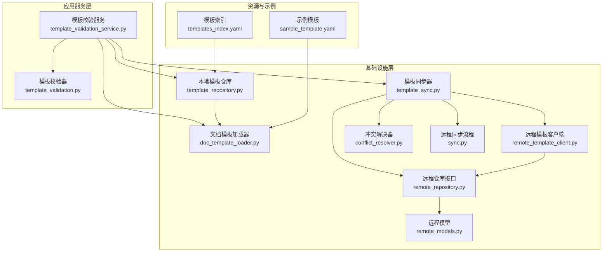
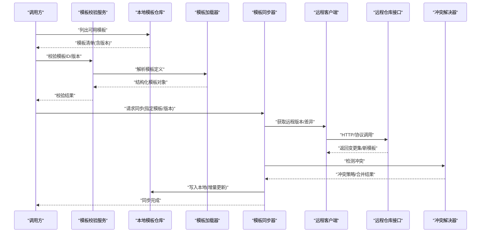
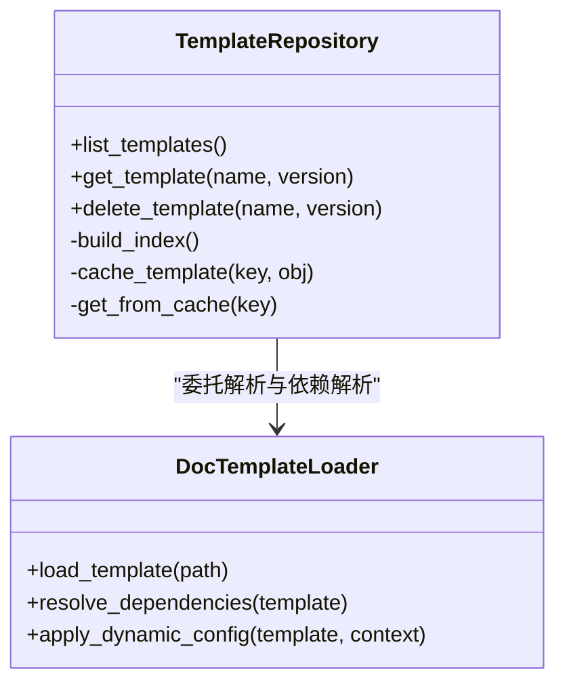
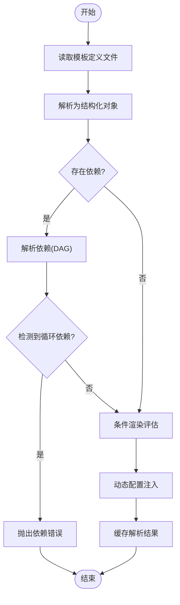
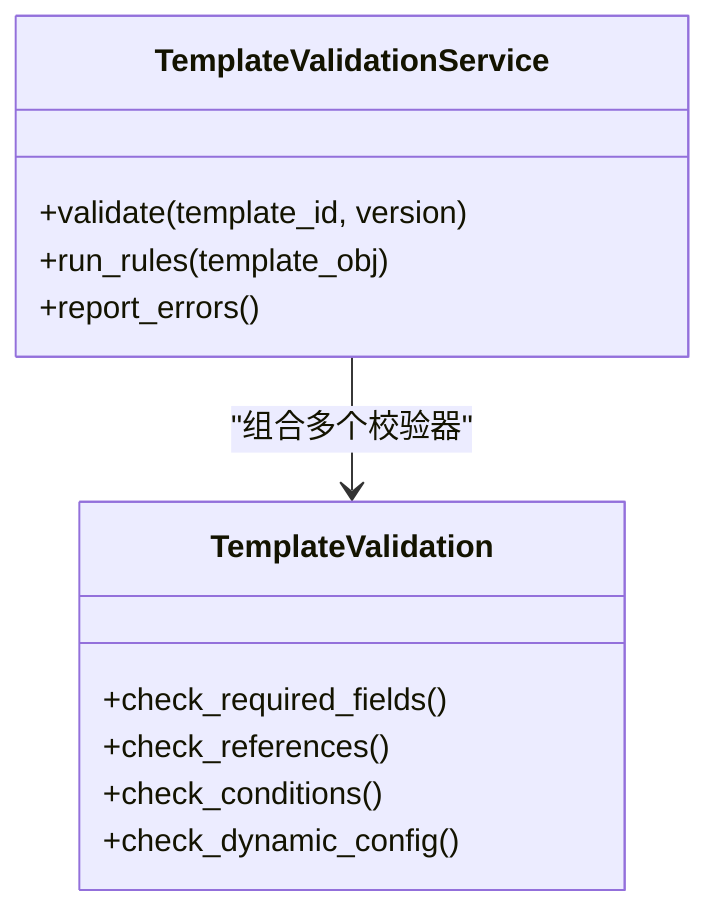
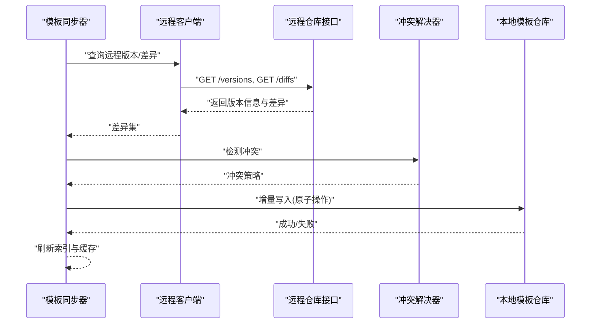
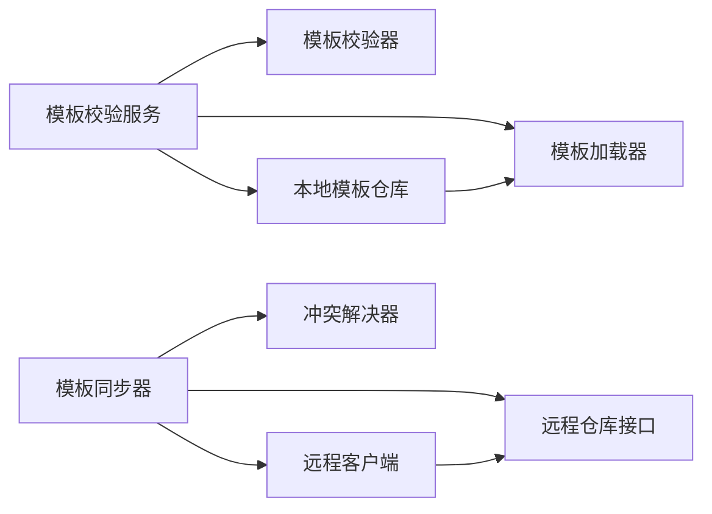

# 模板管理系统

<cite>
**本文引用的文件**   
- [src/paper_format_corrector/infra/template_repository.py](file://src/paper_format_corrector/infra/template_repository.py)
- [src/paper_format_corrector/infra/doc_template_loader.py](file://src/paper_format_corrector/infra/doc_template_loader.py)
- [src/paper_format_corrector/infra/template_sync.py](file://src/paper_format_corrector/infra/template_sync.py)
- [src/paper_format_corrector/infra/remote_template_client.py](file://src/paper_format_corrector/infra/remote_template_client.py)
- [src/paper_format_corrector/application/services/template_validation_service.py](file://src/paper_format_corrector/application/services/template_validation_service.py)
- [src/paper_format_corrector/application/services/template_validation.py](file://src/paper_format_corrector/application/services/template_validation.py)
- [src/paper_format_corrector/infra/remote/conflict_resolver.py](file://src/paper_format_corrector/infra/remote/conflict_resolver.py)
- [src/paper_format_corrector/infra/remote/sync.py](file://src/paper_format_corrector/infra/remote/sync.py)
- [src/paper_format_corrector/infra/remote/remote_repository.py](file://src/paper_format_corrector/infra/remote/remote_repository.py)
- [src/paper_format_corrector/infra/remote/remote_models.py](file://src/paper_format_corrector/infra/remote/remote_models.py)
- [presets/templates_index.yaml](file://presets/templates_index.yaml)
- [examples/sample_template.yaml](file://examples/sample_template.yaml)
- [tests/test_template_repository.py](file://tests/test_template_repository.py)
- [tests/test_template_sync.py](file://tests/test_template_sync.py)
- [tests/test_template_validation_and_import.py](file://tests/test_template_validation_and_import.py)
</cite>

## 目录
1. [简介](#简介)
2. [项目结构](#项目结构)
3. [核心组件](#核心组件)
4. [架构总览](#架构总览)
5. [详细组件分析](#详细组件分析)
6. [依赖关系分析](#依赖关系分析)
7. [性能与缓存策略](#性能与缓存策略)
8. [故障排查指南](#故障排查指南)
9. [结论](#结论)
10. [附录：使用示例与扩展点](#附录使用示例与扩展点)

## 简介
本文件面向“模板管理系统”的设计与实现，聚焦以下目标：
- 模板的加载、缓存、验证与同步机制
- 本地模板仓库与远程模板仓库的实现原理（版本管理、冲突解决、增量更新）
- 模板验证规则引擎，确保模板配置的完整性与正确性
- 模板依赖解析、条件渲染与动态配置加载
- 模板创建、使用与自定义扩展方法的具体示例路径
- 模板性能优化与缓存策略

## 项目结构
模板管理相关代码主要分布在 infra、application/services、infra/remote 以及 presets 与 examples 等目录中。整体采用分层设计：
- 应用服务层：负责模板校验、导入编排等业务流程
- 基础设施层：提供本地仓库、远程客户端、同步器、冲突解决器等能力
- 数据与资源：预置模板索引与示例模板定义

图表来源
- [src/paper_format_corrector/application/services/template_validation_service.py](file://src/paper_format_corrector/application/services/template_validation_service.py)
- [src/paper_format_corrector/application/services/template_validation.py](file://src/paper_format_corrector/application/services/template_validation.py)
- [src/paper_format_corrector/infra/template_repository.py](file://src/paper_format_corrector/infra/template_repository.py)
- [src/paper_format_corrector/infra/doc_template_loader.py](file://src/paper_format_corrector/infra/doc_template_loader.py)
- [src/paper_format_corrector/infra/template_sync.py](file://src/paper_format_corrector/infra/template_sync.py)
- [src/paper_format_corrector/infra/remote_template_client.py](file://src/paper_format_corrector/infra/remote_template_client.py)
- [src/paper_format_corrector/infra/remote/remote_repository.py](file://src/paper_format_corrector/infra/remote/remote_repository.py)
- [src/paper_format_corrector/infra/remote/conflict_resolver.py](file://src/paper_format_corrector/infra/remote/conflict_resolver.py)
- [src/paper_format_corrector/infra/remote/sync.py](file://src/paper_format_corrector/infra/remote/sync.py)
- [src/paper_format_corrector/infra/remote/remote_models.py](file://src/paper_format_corrector/infra/remote/remote_models.py)
- [presets/templates_index.yaml](file://presets/templates_index.yaml)
- [examples/sample_template.yaml](file://examples/sample_template.yaml)

章节来源
- [src/paper_format_corrector/infra/template_repository.py](file://src/paper_format_corrector/infra/template_repository.py)
- [src/paper_format_corrector/infra/doc_template_loader.py](file://src/paper_format_corrector/infra/doc_template_loader.py)
- [src/paper_format_corrector/infra/template_sync.py](file://src/paper_format_corrector/infra/template_sync.py)
- [src/paper_format_corrector/infra/remote_template_client.py](file://src/paper_format_corrector/infra/remote_template_client.py)
- [src/paper_format_corrector/infra/remote/remote_repository.py](file://src/paper_format_corrector/infra/remote/remote_repository.py)
- [src/paper_format_corrector/infra/remote/conflict_resolver.py](file://src/paper_format_corrector/infra/remote/conflict_resolver.py)
- [src/paper_format_corrector/infra/remote/sync.py](file://src/paper_format_corrector/infra/remote/sync.py)
- [src/paper_format_corrector/infra/remote/remote_models.py](file://src/paper_format_corrector/infra/remote/remote_models.py)
- [presets/templates_index.yaml](file://presets/templates_index.yaml)
- [examples/sample_template.yaml](file://examples/sample_template.yaml)

## 核心组件
- 本地模板仓库：负责模板文件的发现、读取、版本元数据管理与缓存
- 文档模板加载器：将模板定义解析为运行时可用的结构化对象，支持依赖解析与动态配置
- 模板校验服务与校验器：基于规则引擎对模板进行完整性与正确性校验
- 模板同步器：协调本地与远程仓库的增量同步、冲突检测与合并
- 远程模板客户端与远程仓库接口：封装网络访问、认证、版本查询与差异拉取
- 冲突解决器：在并发或多人协作场景下提供冲突检测与解决策略
- 远程模型：统一远程侧的版本、变更集、标签等数据结构

章节来源
- [src/paper_format_corrector/infra/template_repository.py](file://src/paper_format_corrector/infra/template_repository.py)
- [src/paper_format_corrector/infra/doc_template_loader.py](file://src/paper_format_corrector/infra/doc_template_loader.py)
- [src/paper_format_corrector/application/services/template_validation_service.py](file://src/paper_format_corrector/application/services/template_validation_service.py)
- [src/paper_format_corrector/application/services/template_validation.py](file://src/paper_format_corrector/application/services/template_validation.py)
- [src/paper_format_corrector/infra/template_sync.py](file://src/paper_format_corrector/infra/template_sync.py)
- [src/paper_format_corrector/infra/remote_template_client.py](file://src/paper_format_corrector/infra/remote_template_client.py)
- [src/paper_format_corrector/infra/remote/remote_repository.py](file://src/paper_format_corrector/infra/remote/remote_repository.py)
- [src/paper_format_corrector/infra/remote/conflict_resolver.py](file://src/paper_format_corrector/infra/remote/conflict_resolver.py)
- [src/paper_format_corrector/infra/remote/sync.py](file://src/paper_format_corrector/infra/remote/sync.py)
- [src/paper_format_corrector/infra/remote/remote_models.py](file://src/paper_format_corrector/infra/remote/remote_models.py)

## 架构总览
模板管理的端到端流程包括：
- 启动时或按需加载本地模板索引与模板定义
- 通过校验服务执行规则校验，阻止非法模板进入运行态
- 根据业务需要触发同步任务，从远程仓库增量拉取变更并合并到本地
- 在冲突发生时由冲突解决器给出策略（保留本地、覆盖、三方合并等）
- 加载器完成依赖解析、条件渲染与动态配置注入后，供上层生成器使用

图表来源
- [src/paper_format_corrector/application/services/template_validation_service.py](file://src/paper_format_corrector/application/services/template_validation_service.py)
- [src/paper_format_corrector/infra/template_repository.py](file://src/paper_format_corrector/infra/template_repository.py)
- [src/paper_format_corrector/infra/doc_template_loader.py](file://src/paper_format_corrector/infra/doc_template_loader.py)
- [src/paper_format_corrector/infra/template_sync.py](file://src/paper_format_corrector/infra/template_sync.py)
- [src/paper_format_corrector/infra/remote_template_client.py](file://src/paper_format_corrector/infra/remote_template_client.py)
- [src/paper_format_corrector/infra/remote/remote_repository.py](file://src/paper_format_corrector/infra/remote/remote_repository.py)
- [src/paper_format_corrector/infra/remote/conflict_resolver.py](file://src/paper_format_corrector/infra/remote/conflict_resolver.py)

## 详细组件分析

### 本地模板仓库（TemplateRepository）
职责
- 维护本地模板目录结构与索引
- 提供按名称/版本查询、列表、删除等操作
- 与加载器协作，完成模板对象的构建与缓存

关键行为
- 扫描与索引：遍历本地模板目录，建立名称到路径及版本信息的映射
- 版本管理：以版本号或标签标识模板，支持多版本并存
- 缓存策略：对已解析的模板对象进行内存缓存，避免重复IO与解析

图表来源
- [src/paper_format_corrector/infra/template_repository.py](file://src/paper_format_corrector/infra/template_repository.py)
- [src/paper_format_corrector/infra/doc_template_loader.py](file://src/paper_format_corrector/infra/doc_template_loader.py)

章节来源
- [src/paper_format_corrector/infra/template_repository.py](file://src/paper_format_corrector/infra/template_repository.py)
- [src/paper_format_corrector/infra/doc_template_loader.py](file://src/paper_format_corrector/infra/doc_template_loader.py)

### 文档模板加载器（DocTemplateLoader）
职责
- 将模板定义文件解析为内部对象图
- 解析模板间的依赖关系，构建有向无环图（DAG）
- 支持条件渲染与动态配置注入

处理流程
- 读取模板文件，解析字段与引用
- 递归解析依赖项，校验循环依赖
- 根据上下文环境（如平台、用户偏好）进行条件渲染
- 注入动态配置（环境变量、运行时参数）

图表来源
- [src/paper_format_corrector/infra/doc_template_loader.py](file://src/paper_format_corrector/infra/doc_template_loader.py)

章节来源
- [src/paper_format_corrector/infra/doc_template_loader.py](file://src/paper_format_corrector/infra/doc_template_loader.py)

### 模板校验服务与规则引擎（TemplateValidationService / TemplateValidation）
职责
- 提供统一的模板校验入口
- 组合多个校验器，执行完整性与正确性检查
- 输出结构化校验报告，便于前端展示与自动化阻断

校验维度
- 必填字段与类型校验
- 引用完整性（依赖是否存在、版本是否满足）
- 条件表达式合法性
- 动态配置键集合与默认值一致性

图表来源
- [src/paper_format_corrector/application/services/template_validation_service.py](file://src/paper_format_corrector/application/services/template_validation_service.py)
- [src/paper_format_corrector/application/services/template_validation.py](file://src/paper_format_corrector/application/services/template_validation.py)

章节来源
- [src/paper_format_corrector/application/services/template_validation_service.py](file://src/paper_format_corrector/application/services/template_validation_service.py)
- [src/paper_format_corrector/application/services/template_validation.py](file://src/paper_format_corrector/application/services/template_validation.py)

### 模板同步器与远程仓库（TemplateSync / RemoteTemplateClient / RemoteRepository）
职责
- 协调本地与远程仓库的增量同步
- 通过远程客户端发起版本查询与差异拉取
- 使用冲突解决器处理合并冲突

同步流程
- 比较本地与远程版本，计算差异集
- 下载新增/更新的模板文件
- 检测冲突（同文件不同修改），选择策略（本地优先、远程优先、三方合并）
- 原子写入本地仓库，更新索引与缓存

图表来源
- [src/paper_format_corrector/infra/template_sync.py](file://src/paper_format_corrector/infra/template_sync.py)
- [src/paper_format_corrector/infra/remote_template_client.py](file://src/paper_format_corrector/infra/remote_template_client.py)
- [src/paper_format_corrector/infra/remote/remote_repository.py](file://src/paper_format_corrector/infra/remote/remote_repository.py)
- [src/paper_format_corrector/infra/remote/conflict_resolver.py](file://src/paper_format_corrector/infra/remote/conflict_resolver.py)

章节来源
- [src/paper_format_corrector/infra/template_sync.py](file://src/paper_format_corrector/infra/template_sync.py)
- [src/paper_format_corrector/infra/remote_template_client.py](file://src/paper_format_corrector/infra/remote_template_client.py)
- [src/paper_format_corrector/infra/remote/remote_repository.py](file://src/paper_format_corrector/infra/remote/remote_repository.py)
- [src/paper_format_corrector/infra/remote/conflict_resolver.py](file://src/paper_format_corrector/infra/remote/conflict_resolver.py)
- [src/paper_format_corrector/infra/remote/sync.py](file://src/paper_format_corrector/infra/remote/sync.py)
- [src/paper_format_corrector/infra/remote/remote_models.py](file://src/paper_format_corrector/infra/remote/remote_models.py)

### 远程模型与版本管理（RemoteModels）
职责
- 定义远程侧的版本、标签、变更集等数据结构
- 为客户端与服务器交互提供一致的契约

要点
- 版本标识：语义化版本或哈希
- 变更集：包含新增、修改、删除的文件清单
- 标签：用于稳定发布标记

章节来源
- [src/paper_format_corrector/infra/remote/remote_models.py](file://src/paper_format_corrector/infra/remote/remote_models.py)

### 预置模板索引与示例模板
- 预置模板索引：集中描述可用模板的名称、版本、适用领域等信息，供本地仓库快速发现
- 示例模板：提供最小可运行的模板定义，便于开发者参考与扩展

章节来源
- [presets/templates_index.yaml](file://presets/templates_index.yaml)
- [examples/sample_template.yaml](file://examples/sample_template.yaml)

## 依赖关系分析
- 模块内聚与耦合
  - 模板校验服务与校验器高内聚，对外暴露统一校验接口
  - 本地仓库与加载器解耦，通过接口传递结构化模板对象
  - 同步器聚合远程客户端、冲突解决器与本地仓库，形成清晰的分层
- 外部依赖
  - 远程仓库接口抽象了具体通信协议，便于替换后端实现
  - 文件系统与缓存作为底层存储，被仓库与加载器复用

图表来源
- [src/paper_format_corrector/application/services/template_validation_service.py](file://src/paper_format_corrector/application/services/template_validation_service.py)
- [src/paper_format_corrector/infra/template_repository.py](file://src/paper_format_corrector/infra/template_repository.py)
- [src/paper_format_corrector/infra/doc_template_loader.py](file://src/paper_format_corrector/infra/doc_template_loader.py)
- [src/paper_format_corrector/infra/template_sync.py](file://src/paper_format_corrector/infra/template_sync.py)
- [src/paper_format_corrector/infra/remote_template_client.py](file://src/paper_format_corrector/infra/remote_template_client.py)
- [src/paper_format_corrector/infra/remote/remote_repository.py](file://src/paper_format_corrector/infra/remote/remote_repository.py)
- [src/paper_format_corrector/infra/remote/conflict_resolver.py](file://src/paper_format_corrector/infra/remote/conflict_resolver.py)

章节来源
- [src/paper_format_corrector/application/services/template_validation_service.py](file://src/paper_format_corrector/application/services/template_validation_service.py)
- [src/paper_format_corrector/infra/template_repository.py](file://src/paper_format_corrector/infra/template_repository.py)
- [src/paper_format_corrector/infra/doc_template_loader.py](file://src/paper_format_corrector/infra/doc_template_loader.py)
- [src/paper_format_corrector/infra/template_sync.py](file://src/paper_format_corrector/infra/template_sync.py)
- [src/paper_format_corrector/infra/remote_template_client.py](file://src/paper_format_corrector/infra/remote_template_client.py)
- [src/paper_format_corrector/infra/remote/remote_repository.py](file://src/paper_format_corrector/infra/remote/remote_repository.py)
- [src/paper_format_corrector/infra/remote/conflict_resolver.py](file://src/paper_format_corrector/infra/remote/conflict_resolver.py)

## 性能与缓存策略
- 解析缓存
  - 模板加载器对解析后的对象进行内存缓存，减少重复IO与解析开销
  - 缓存键建议包含模板ID与版本，保证版本隔离
- 索引缓存
  - 本地仓库维护模板索引，避免每次全量扫描目录
  - 当模板文件发生变更时，增量更新索引
- 同步优化
  - 仅拉取差异集，减少网络传输
  - 批量写入与事务式更新，降低中间状态风险
- 条件渲染与动态配置
  - 仅在需要时评估条件表达式，避免不必要的计算
  - 动态配置键集合预编译，提升匹配效率

[本节为通用性能指导，不直接分析具体文件]

## 故障排查指南
常见问题与定位思路
- 模板校验失败
  - 检查必填字段与类型是否正确
  - 确认依赖模板是否存在且版本兼容
  - 查看校验服务输出的错误报告
- 依赖解析异常
  - 检查是否存在循环依赖
  - 确认依赖路径与命名空间一致
- 同步失败
  - 检查远程仓库连通性与认证
  - 查看冲突解决策略是否合理
  - 确认本地写入权限与磁盘空间
- 条件渲染未生效
  - 检查上下文变量是否注入
  - 确认条件表达式语法合法

章节来源
- [src/paper_format_corrector/application/services/template_validation_service.py](file://src/paper_format_corrector/application/services/template_validation_service.py)
- [src/paper_format_corrector/infra/template_sync.py](file://src/paper_format_corrector/infra/template_sync.py)
- [src/paper_format_corrector/infra/remote/conflict_resolver.py](file://src/paper_format_corrector/infra/remote/conflict_resolver.py)

## 结论
模板管理系统通过清晰的层次划分与模块化设计，实现了模板的可靠加载、严格校验与高效同步。本地仓库与远程仓库协同工作，结合冲突解决与增量更新策略，保障了在多环境与多人协作场景下的稳定性与一致性。配合完善的缓存与性能优化手段，系统能够在大规模模板生态中保持良好响应与吞吐。

[本节为总结性内容，不直接分析具体文件]

## 附录：使用示例与扩展点
- 创建模板
  - 参考示例模板定义的结构与字段，编写新的模板文件
  - 将模板放入本地仓库目录，并确保索引更新
- 使用模板
  - 通过本地仓库列出可用模板，选择名称与版本
  - 调用模板加载器解析模板对象，传入上下文进行条件渲染与动态配置
- 自定义扩展
  - 扩展校验器：在模板校验服务中注册新的校验规则
  - 扩展同步策略：在冲突解决器中实现新的合并策略
  - 扩展远程仓库：实现远程仓库接口，适配不同的后端服务

示例与测试参考路径
- 示例模板定义：[examples/sample_template.yaml](file://examples/sample_template.yaml)
- 预置模板索引：[presets/templates_index.yaml](file://presets/templates_index.yaml)
- 单元测试（仓库）：[tests/test_template_repository.py](file://tests/test_template_repository.py)
- 单元测试（同步）：[tests/test_template_sync.py](file://tests/test_template_sync.py)
- 单元测试（校验与导入）：[tests/test_template_validation_and_import.py](file://tests/test_template_validation_and_import.py)

章节来源
- [examples/sample_template.yaml](file://examples/sample_template.yaml)
- [presets/templates_index.yaml](file://presets/templates_index.yaml)
- [tests/test_template_repository.py](file://tests/test_template_repository.py)
- [tests/test_template_sync.py](file://tests/test_template_sync.py)
- [tests/test_template_validation_and_import.py](file://tests/test_template_validation_and_import.py)