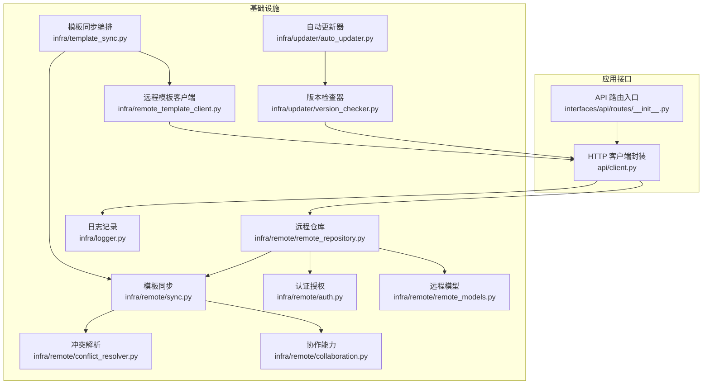
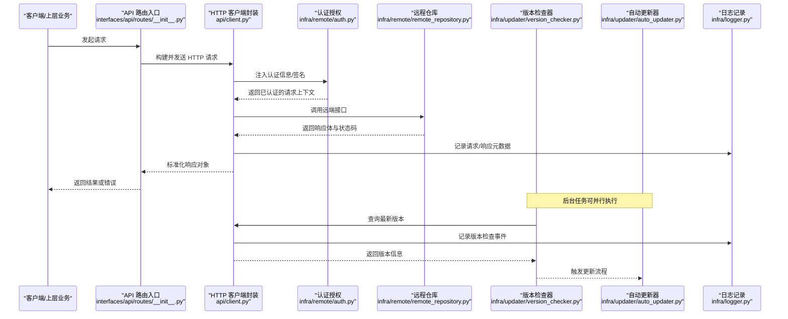
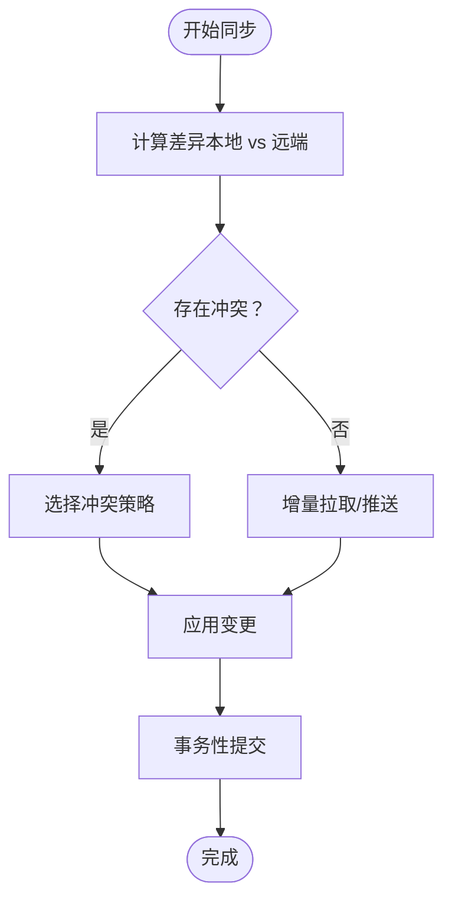
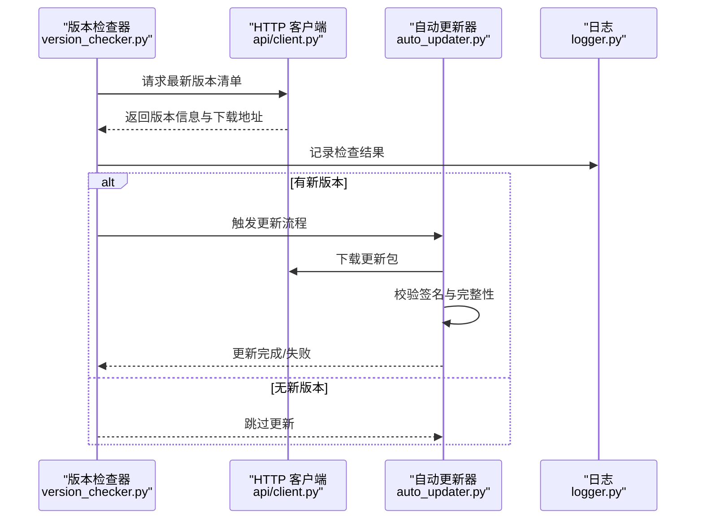
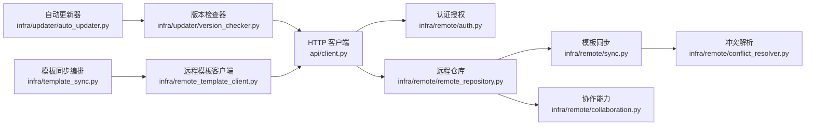

# 网络通信与远程服务

<cite>
**本文引用的文件**   
- [src/paper_format_corrector/infra/remote/auth.py](file://src/paper_format_corrector/infra/remote/auth.py)
- [src/paper_format_corrector/infra/remote/collaboration.py](file://src/paper_format_corrector/infra/remote/collaboration.py)
- [src/paper_format_corrector/infra/remote/conflict_resolver.py](file://src/paper_format_corrector/infra/remote/conflict_resolver.py)
- [src/paper_format_corrector/infra/remote/remote_models.py](file://src/paper_format_corrector/infra/remote/remote_models.py)
- [src/paper_format_corrector/infra/remote/remote_repository.py](file://src/paper_format_corrector/infra/remote/remote_repository.py)
- [src/paper_format_corrector/infra/remote/sync.py](file://src/paper_format_corrector/infra/remote/sync.py)
- [src/paper_format_corrector/infra/updater/auto_updater.py](file://src/paper_format_corrector/infra/updater/auto_updater.py)
- [src/paper_format_corrector/infra/updater/version_checker.py](file://src/paper_format_corrector/infra/updater/version_checker.py)
- [src/paper_format_corrector/infra/remote_template_client.py](file://src/paper_format_corrector/infra/remote_template_client.py)
- [src/paper_format_corrector/infra/template_sync.py](file://src/paper_format_corrector/infra/template_sync.py)
- [src/paper_format_corrector/infra/logger.py](file://src/paper_format_corrector/infra/logger.py)
- [config/config.yaml](file://config/config.yaml)
- [config/updater.yaml](file://config/updater.yaml)
- [src/paper_format_corrector/api/client.py](file://src/paper_format_corrector/api/client.py)
- [src/paper_format_corrector/interfaces/api/routes/__init__.py](file://src/paper_format_corrector/interfaces/api/routes/__init__.py)
</cite>

## 目录
1. [简介](#简介)
2. [项目结构](#项目结构)
3. [核心组件](#核心组件)
4. [架构总览](#架构总览)
5. [详细组件分析](#详细组件分析)
6. [依赖关系分析](#依赖关系分析)
7. [性能考虑](#性能考虑)
8. [故障排查指南](#故障排查指南)
9. [结论](#结论)
10. [附录](#附录)

## 简介
本文件聚焦于“网络通信与远程服务”的实现与使用，覆盖以下主题：
- HTTP 客户端实现、API 调用封装与响应处理机制
- 远程模板同步、自动更新检查与外部工具集成
- 连接池管理、请求重试、超时处理与错误恢复策略
- 认证授权机制、安全传输与数据加密
- 监控、日志记录与性能调优最佳实践
- 具体调用方式与配置选项（以路径引用形式提供）

## 项目结构
与网络通信和远程服务相关的代码主要分布在 infra 层与 updater 模块中，同时包含 API 客户端与路由入口。整体组织遵循分层与职责分离原则：
- infra/remote：远程仓库、协作、冲突解决、模型定义、同步流程等
- infra/updater：版本检查与自动更新
- infra：远程模板客户端、模板同步、日志等通用基础设施
- api/client：HTTP 客户端封装
- interfaces/api/routes：API 路由聚合入口

图示来源
- [src/paper_format_corrector/interfaces/api/routes/__init__.py](file://src/paper_format_corrector/interfaces/api/routes/__init__.py)
- [src/paper_format_corrector/api/client.py](file://src/paper_format_corrector/api/client.py)
- [src/paper_format_corrector/infra/remote/remote_repository.py](file://src/paper_format_corrector/infra/remote/remote_repository.py)
- [src/paper_format_corrector/infra/remote/auth.py](file://src/paper_format_corrector/infra/remote/auth.py)
- [src/paper_format_corrector/infra/remote/remote_models.py](file://src/paper_format_corrector/infra/remote/remote_models.py)
- [src/paper_format_corrector/infra/remote/sync.py](file://src/paper_format_corrector/infra/remote/sync.py)
- [src/paper_format_corrector/infra/remote/conflict_resolver.py](file://src/paper_format_corrector/infra/remote/conflict_resolver.py)
- [src/paper_format_corrector/infra/remote/collaboration.py](file://src/paper_format_corrector/infra/remote/collaboration.py)
- [src/paper_format_corrector/infra/updater/version_checker.py](file://src/paper_format_corrector/infra/updater/version_checker.py)
- [src/paper_format_corrector/infra/updater/auto_updater.py](file://src/paper_format_corrector/infra/updater/auto_updater.py)
- [src/paper_format_corrector/infra/remote_template_client.py](file://src/paper_format_corrector/infra/remote_template_client.py)
- [src/paper_format_corrector/infra/template_sync.py](file://src/paper_format_corrector/infra/template_sync.py)
- [src/paper_format_corrector/infra/logger.py](file://src/paper_format_corrector/infra/logger.py)

章节来源
- [src/paper_format_corrector/interfaces/api/routes/__init__.py](file://src/paper_format_corrector/interfaces/api/routes/__init__.py)
- [src/paper_format_corrector/api/client.py](file://src/paper_format_corrector/api/client.py)
- [src/paper_format_corrector/infra/remote/remote_repository.py](file://src/paper_format_corrector/infra/remote/remote_repository.py)
- [src/paper_format_corrector/infra/remote/auth.py](file://src/paper_format_corrector/infra/remote/auth.py)
- [src/paper_format_corrector/infra/remote/remote_models.py](file://src/paper_format_corrector/infra/remote/remote_models.py)
- [src/paper_format_corrector/infra/remote/sync.py](file://src/paper_format_corrector/infra/remote/sync.py)
- [src/paper_format_corrector/infra/remote/conflict_resolver.py](file://src/paper_format_corrector/infra/remote/conflict_resolver.py)
- [src/paper_format_corrector/infra/remote/collaboration.py](file://src/paper_format_corrector/infra/remote/collaboration.py)
- [src/paper_format_corrector/infra/updater/version_checker.py](file://src/paper_format_corrector/infra/updater/version_checker.py)
- [src/paper_format_corrector/infra/updater/auto_updater.py](file://src/paper_format_corrector/infra/updater/auto_updater.py)
- [src/paper_format_corrector/infra/remote_template_client.py](file://src/paper_format_corrector/infra/remote_template_client.py)
- [src/paper_format_corrector/infra/template_sync.py](file://src/paper_format_corrector/infra/template_sync.py)
- [src/paper_format_corrector/infra/logger.py](file://src/paper_format_corrector/infra/logger.py)

## 核心组件
- HTTP 客户端封装：统一发起 HTTP 请求、处理响应、注入认证头、设置超时与重试策略。
- 远程仓库抽象：对远端资源进行增删改查、版本对比、拉取/推送等操作。
- 认证授权：令牌获取、刷新、签名或摘要校验、安全传输参数装配。
- 模板同步：本地与远端模板差异检测、增量同步、冲突解析与合并。
- 版本检查与自动更新：查询最新版本、比较语义化版本、触发下载与安装流程。
- 日志与监控：结构化日志、指标采集、关键链路埋点。

章节来源
- [src/paper_format_corrector/api/client.py](file://src/paper_format_corrector/api/client.py)
- [src/paper_format_corrector/infra/remote/remote_repository.py](file://src/paper_format_corrector/infra/remote/remote_repository.py)
- [src/paper_format_corrector/infra/remote/auth.py](file://src/paper_format_corrector/infra/remote/auth.py)
- [src/paper_format_corrector/infra/remote/sync.py](file://src/paper_format_corrector/infra/remote/sync.py)
- [src/paper_format_corrector/infra/updater/version_checker.py](file://src/paper_format_corrector/infra/updater/version_checker.py)
- [src/paper_format_corrector/infra/updater/auto_updater.py](file://src/paper_format_corrector/infra/updater/auto_updater.py)
- [src/paper_format_corrector/infra/logger.py](file://src/paper_format_corrector/infra/logger.py)

## 架构总览
下图展示了从 API 路由到远程服务的端到端调用链路与关键交互点。

图示来源
- [src/paper_format_corrector/interfaces/api/routes/__init__.py](file://src/paper_format_corrector/interfaces/api/routes/__init__.py)
- [src/paper_format_corrector/api/client.py](file://src/paper_format_corrector/api/client.py)
- [src/paper_format_corrector/infra/remote/auth.py](file://src/paper_format_corrector/infra/remote/auth.py)
- [src/paper_format_corrector/infra/remote/remote_repository.py](file://src/paper_format_corrector/infra/remote/remote_repository.py)
- [src/paper_format_corrector/infra/updater/version_checker.py](file://src/paper_format_corrector/infra/updater/version_checker.py)
- [src/paper_format_corrector/infra/updater/auto_updater.py](file://src/paper_format_corrector/infra/updater/auto_updater.py)
- [src/paper_format_corrector/infra/logger.py](file://src/paper_format_corrector/infra/logger.py)

## 详细组件分析

### HTTP 客户端封装与 API 调用
- 职责
  - 统一创建会话、管理连接池、设置默认超时与重试策略
  - 组装请求头（含认证令牌、内容类型、追踪 ID 等）
  - 序列化/反序列化 JSON、处理常见异常并重试
  - 将底层响应转换为领域友好的响应对象
- 关键特性
  - 连接池：复用 TCP 连接，降低握手开销
  - 重试：针对瞬态错误（如网络抖动、限流）指数退避重试
  - 超时：连接超时与读取超时分离，避免长尾阻塞
  - 错误恢复：区分可重试与不可重试错误，记录诊断信息
- 典型用法（路径引用）
  - 发起 GET/POST/PUT/DELETE 请求
  - 上传/下载大文件（分块、进度回调）
  - 携带认证头与自定义中间件

章节来源
- [src/paper_format_corrector/api/client.py](file://src/paper_format_corrector/api/client.py)

### 认证授权与安全传输
- 职责
  - 获取与刷新访问令牌
  - 为请求附加签名或摘要，确保完整性
  - 强制 HTTPS、证书校验与可选双向 TLS
  - 敏感信息脱敏与最小权限原则
- 关键特性
  - 令牌缓存与会话续期
  - 失败快速回退与降级策略
  - 审计日志（不含敏感字段）
- 典型用法（路径引用）
  - 登录/注册后获取令牌
  - 在每次请求前自动注入认证头
  - 处理 401/403 的自动刷新与重试

章节来源
- [src/paper_format_corrector/infra/remote/auth.py](file://src/paper_format_corrector/infra/remote/auth.py)

### 远程仓库与模型
- 职责
  - 定义远端资源的统一模型（版本、标签、变更集等）
  - 提供 CRUD、列表、搜索、批量操作
  - 与认证模块、客户端封装解耦
- 关键特性
  - 分页与游标
  - 条件请求（ETag/If-None-Match）
  - 幂等性保证（基于请求 ID 或资源版本）
- 典型用法（路径引用）
  - 列出模板、拉取指定版本、提交变更

章节来源
- [src/paper_format_corrector/infra/remote/remote_repository.py](file://src/paper_format_corrector/infra/remote/remote_repository.py)
- [src/paper_format_corrector/infra/remote/remote_models.py](file://src/paper_format_corrector/infra/remote/remote_models.py)

### 模板同步与冲突解析
- 职责
  - 计算本地与远端模板的差异（按文件粒度）
  - 增量拉取/推送，支持断点续传
  - 冲突检测与合并策略（保留本地、保留远端、三方合并）
- 关键特性
  - 并发同步与限速
  - 事务性提交与回滚
  - 冲突报告与人工介入入口
- 典型用法（路径引用）
  - 启动同步任务、查看进度、处理冲突

图示来源
- [src/paper_format_corrector/infra/remote/sync.py](file://src/paper_format_corrector/infra/remote/sync.py)
- [src/paper_format_corrector/infra/remote/conflict_resolver.py](file://src/paper_format_corrector/infra/remote/conflict_resolver.py)

章节来源
- [src/paper_format_corrector/infra/remote/sync.py](file://src/paper_format_corrector/infra/remote/sync.py)
- [src/paper_format_corrector/infra/remote/conflict_resolver.py](file://src/paper_format_corrector/infra/remote/conflict_resolver.py)

### 协作能力
- 职责
  - 多用户场景下的在线编辑、锁机制、变更通知
  - 与同步流程协同，保证一致性
- 关键特性
  - 乐观锁与版本号控制
  - 事件驱动的消息广播
- 典型用法（路径引用）
  - 开启协作会话、订阅变更事件

章节来源
- [src/paper_format_corrector/infra/remote/collaboration.py](file://src/paper_format_corrector/infra/remote/collaboration.py)

### 远程模板客户端与模板同步编排
- 职责
  - 对外暴露统一的模板同步 API
  - 组合远程仓库、认证、同步与冲突解析
  - 提供进度、统计与错误上报
- 典型用法（路径引用）
  - 初始化客户端、配置源地址与凭据
  - 执行全量/增量同步、导出报告

章节来源
- [src/paper_format_corrector/infra/remote_template_client.py](file://src/paper_format_corrector/infra/remote_template_client.py)
- [src/paper_format_corrector/infra/template_sync.py](file://src/paper_format_corrector/infra/template_sync.py)

### 版本检查与自动更新
- 职责
  - 定时或按需检查最新版本
  - 比较当前版本与远端版本，决定是否更新
  - 触发下载、校验与安装流程
- 关键特性
  - 语义化版本比较
  - 更新包签名校验与回滚
  - 静默更新与用户确认模式
- 典型用法（路径引用）
  - 启动时检查更新、后台周期性检查

图示来源
- [src/paper_format_corrector/infra/updater/version_checker.py](file://src/paper_format_corrector/infra/updater/version_checker.py)
- [src/paper_format_corrector/infra/updater/auto_updater.py](file://src/paper_format_corrector/infra/updater/auto_updater.py)
- [src/paper_format_corrector/api/client.py](file://src/paper_format_corrector/api/client.py)
- [src/paper_format_corrector/infra/logger.py](file://src/paper_format_corrector/infra/logger.py)

章节来源
- [src/paper_format_corrector/infra/updater/version_checker.py](file://src/paper_format_corrector/infra/updater/version_checker.py)
- [src/paper_format_corrector/infra/updater/auto_updater.py](file://src/paper_format_corrector/infra/updater/auto_updater.py)

### 外部工具集成
- 职责
  - 通过 HTTP 或进程间调用与外部工具（如格式检查器、转换器）交互
  - 统一错误处理与超时控制
- 典型用法（路径引用）
  - 调用外部服务进行文档预处理或后处理

章节来源
- [src/paper_format_corrector/infra/external_tools.py](file://src/paper_format_corrector/infra/external_tools.py)

## 依赖关系分析
- 耦合与内聚
  - HTTP 客户端作为基础依赖被认证、仓库、同步、更新等模块复用
  - 认证模块独立于业务逻辑，仅关注安全相关横切关注点
  - 同步与冲突解析高内聚，便于扩展新的合并策略
- 外部依赖
  - 标准库与第三方 HTTP 客户端（由 client 封装）
  - 配置文件（用于服务端地址、超时、重试等）

图示来源
- [src/paper_format_corrector/api/client.py](file://src/paper_format_corrector/api/client.py)
- [src/paper_format_corrector/infra/remote/auth.py](file://src/paper_format_corrector/infra/remote/auth.py)
- [src/paper_format_corrector/infra/remote/remote_repository.py](file://src/paper_format_corrector/infra/remote/remote_repository.py)
- [src/paper_format_corrector/infra/remote/sync.py](file://src/paper_format_corrector/infra/remote/sync.py)
- [src/paper_format_corrector/infra/remote/conflict_resolver.py](file://src/paper_format_corrector/infra/remote/conflict_resolver.py)
- [src/paper_format_corrector/infra/remote/collaboration.py](file://src/paper_format_corrector/infra/remote/collaboration.py)
- [src/paper_format_corrector/infra/updater/version_checker.py](file://src/paper_format_corrector/infra/updater/version_checker.py)
- [src/paper_format_corrector/infra/updater/auto_updater.py](file://src/paper_format_corrector/infra/updater/auto_updater.py)
- [src/paper_format_corrector/infra/remote_template_client.py](file://src/paper_format_corrector/infra/remote_template_client.py)
- [src/paper_format_corrector/infra/template_sync.py](file://src/paper_format_corrector/infra/template_sync.py)

章节来源
- [src/paper_format_corrector/api/client.py](file://src/paper_format_corrector/api/client.py)
- [src/paper_format_corrector/infra/remote/remote_repository.py](file://src/paper_format_corrector/infra/remote/remote_repository.py)
- [src/paper_format_corrector/infra/remote/auth.py](file://src/paper_format_corrector/infra/remote/auth.py)
- [src/paper_format_corrector/infra/remote/sync.py](file://src/paper_format_corrector/infra/remote/sync.py)
- [src/paper_format_corrector/infra/remote/conflict_resolver.py](file://src/paper_format_corrector/infra/remote/conflict_resolver.py)
- [src/paper_format_corrector/infra/remote/collaboration.py](file://src/paper_format_corrector/infra/remote/collaboration.py)
- [src/paper_format_corrector/infra/updater/version_checker.py](file://src/paper_format_corrector/infra/updater/version_checker.py)
- [src/paper_format_corrector/infra/updater/auto_updater.py](file://src/paper_format_corrector/infra/updater/auto_updater.py)
- [src/paper_format_corrector/infra/remote_template_client.py](file://src/paper_format_corrector/infra/remote_template_client.py)
- [src/paper_format_corrector/infra/template_sync.py](file://src/paper_format_corrector/infra/template_sync.py)

## 性能考虑
- 连接池
  - 合理设置最大连接数与空闲回收时间，避免连接泄漏
  - 根据并发度与服务端容量调整池大小
- 超时与重试
  - 连接超时短、读取超时适中；对幂等请求启用指数退避重试
  - 限制最大重试次数与总耗时，防止雪崩
- 并发与限速
  - 同步任务采用并发但带全局速率限制，避免压垮远端
  - 大文件分块传输，支持断点续传
- 缓存与条件请求
  - 利用 ETag/Last-Modified 减少带宽与 CPU 消耗
  - 本地缓存常用元数据（版本索引、模板清单）
- 监控与度量
  - 记录 QPS、延迟分布、错误率、重试次数、连接池利用率
  - 关键路径埋点（认证、拉取、合并、提交）

[本节为通用指导，不直接分析具体文件]

## 故障排查指南
- 常见问题定位
  - 认证失败：检查令牌有效期、刷新流程、签名算法
  - 超时/限流：观察重试策略是否生效，适当放宽或增加退避间隔
  - 同步冲突：查看冲突报告，选择合适合并策略
  - 更新失败：验证更新包签名、磁盘空间与权限
- 日志与诊断
  - 使用结构化日志记录请求 ID、状态码、耗时、错误堆栈
  - 开启调试级别输出，收集完整链路上下文
- 参考路径
  - 日志记录实现：[src/paper_format_corrector/infra/logger.py](file://src/paper_format_corrector/infra/logger.py)
  - 认证流程：[src/paper_format_corrector/infra/remote/auth.py](file://src/paper_format_corrector/infra/remote/auth.py)
  - 同步与冲突：[src/paper_format_corrector/infra/remote/sync.py](file://src/paper_format_corrector/infra/remote/sync.py)、[src/paper_format_corrector/infra/remote/conflict_resolver.py](file://src/paper_format_corrector/infra/remote/conflict_resolver.py)
  - 版本检查与更新：[src/paper_format_corrector/infra/updater/version_checker.py](file://src/paper_format_corrector/infra/updater/version_checker.py)、[src/paper_format_corrector/infra/updater/auto_updater.py](file://src/paper_format_corrector/infra/updater/auto_updater.py)

章节来源
- [src/paper_format_corrector/infra/logger.py](file://src/paper_format_corrector/infra/logger.py)
- [src/paper_format_corrector/infra/remote/auth.py](file://src/paper_format_corrector/infra/remote/auth.py)
- [src/paper_format_corrector/infra/remote/sync.py](file://src/paper_format_corrector/infra/remote/sync.py)
- [src/paper_format_corrector/infra/remote/conflict_resolver.py](file://src/paper_format_corrector/infra/remote/conflict_resolver.py)
- [src/paper_format_corrector/infra/updater/version_checker.py](file://src/paper_format_corrector/infra/updater/version_checker.py)
- [src/paper_format_corrector/infra/updater/auto_updater.py](file://src/paper_format_corrector/infra/updater/auto_updater.py)

## 结论
本项目在网络通信与远程服务方面形成了清晰的层次与职责划分：HTTP 客户端统一封装网络细节，认证模块保障安全，仓库与同步负责数据一致性，版本检查与自动更新提升可维护性。通过合理的连接池、重试、超时与监控策略，系统在稳定性与性能之间取得平衡。建议在生产环境结合业务特征持续优化超时与重试参数，完善指标与告警，确保端到端可观测性与可恢复性。

[本节为总结性内容，不直接分析具体文件]

## 附录

### 配置项参考
- 通用配置（服务端地址、超时、重试、代理等）
  - [config/config.yaml](file://config/config.yaml)
- 更新器配置（检查周期、版本源、更新策略）
  - [config/updater.yaml](file://config/updater.yaml)

章节来源
- [config/config.yaml](file://config/config.yaml)
- [config/updater.yaml](file://config/updater.yaml)

### 示例：常见网络操作调用方式（路径引用）
- 发起 HTTP 请求
  - [src/paper_format_corrector/api/client.py](file://src/paper_format_corrector/api/client.py)
- 认证与令牌管理
  - [src/paper_format_corrector/infra/remote/auth.py](file://src/paper_format_corrector/infra/remote/auth.py)
- 远程模板同步
  - [src/paper_format_corrector/infra/remote_template_client.py](file://src/paper_format_corrector/infra/remote_template_client.py)
  - [src/paper_format_corrector/infra/template_sync.py](file://src/paper_format_corrector/infra/template_sync.py)
- 版本检查与自动更新
  - [src/paper_format_corrector/infra/updater/version_checker.py](file://src/paper_format_corrector/infra/updater/version_checker.py)
  - [src/paper_format_corrector/infra/updater/auto_updater.py](file://src/paper_format_corrector/infra/updater/auto_updater.py)
- API 路由入口
  - [src/paper_format_corrector/interfaces/api/routes/__init__.py](file://src/paper_format_corrector/interfaces/api/routes/__init__.py)