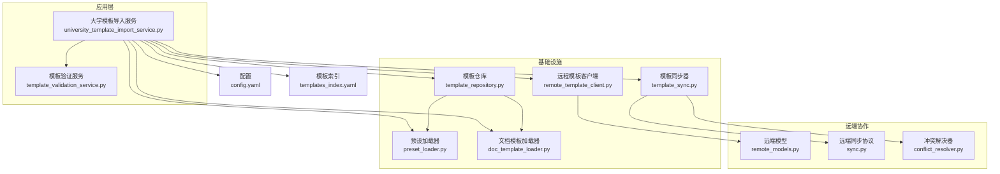
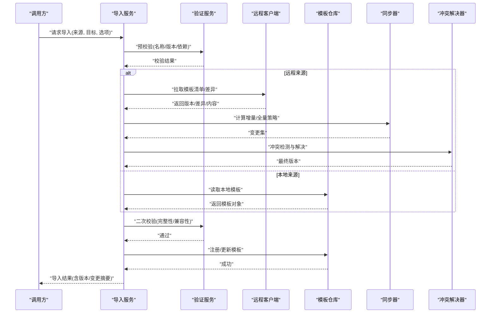
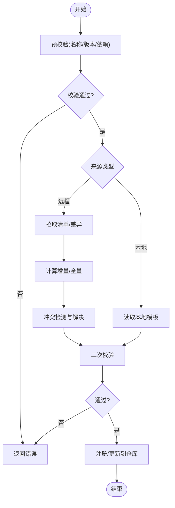
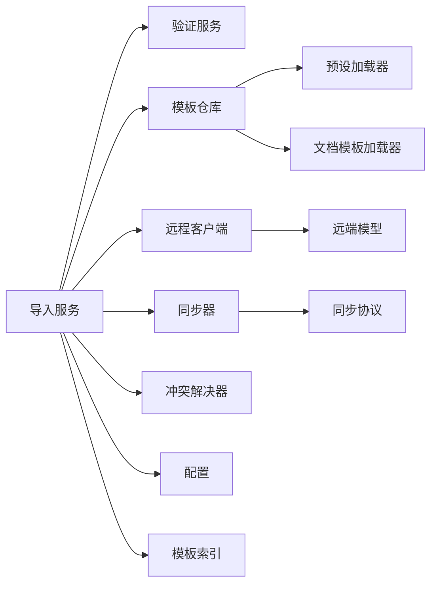

# 大学模板导入服务

<cite>
**本文引用的文件**   
- [university_template_import_service.py](file://src/paper_format_corrector/application/services/university_template_import_service.py)
- [template_repository.py](file://src/paper_format_corrector/infra/template_repository.py)
- [remote_template_client.py](file://src/paper_format_corrector/infra/remote_template_client.py)
- [template_sync.py](file://src/paper_format_corrector/infra/template_sync.py)
- [conflict_resolver.py](file://src/paper_format_corrector/infra/remote/conflict_resolver.py)
- [sync.py](file://src/paper_format_corrector/infra/remote/sync.py)
- [remote_models.py](file://src/paper_format_corrector/infra/remote/remote_models.py)
- [template_validation_service.py](file://src/paper_format_corrector/application/services/template_validation_service.py)
- [preset_loader.py](file://src/paper_format_corrector/infra/preset_loader.py)
- [doc_template_loader.py](file://src/paper_format_corrector/infra/doc_template_loader.py)
- [templates_index.yaml](file://presets/templates_index.yaml)
- [config.yaml](file://config/config.yaml)
- [test_template_validation_and_import.py](file://tests/test_template_validation_and_import.py)
- [test_template_sync.py](file://tests/test_template_sync.py)
</cite>

## 目录
1. [简介](#简介)
2. [项目结构](#项目结构)
3. [核心组件](#核心组件)
4. [架构总览](#架构总览)
5. [详细组件分析](#详细组件分析)
6. [依赖关系分析](#依赖关系分析)
7. [性能考虑](#性能考虑)
8. [故障排查指南](#故障排查指南)
9. [结论](#结论)
10. [附录](#附录)

## 简介
本文件面向“大学模板导入服务”，系统化说明从远程仓库或本地源导入大学特定格式模板的业务逻辑，包括下载、解析、验证与注册流程；解释版本管理、依赖关系与冲突解决策略；并提供自动化流程与错误处理机制的示例路径。同时涵盖模板同步策略与增量更新实现细节，帮助读者快速理解并正确使用该服务。

## 项目结构
围绕模板导入的核心代码分布在应用层服务、基础设施适配器与远端协作模块中：
- 应用层服务：负责编排导入流程、调用验证与存储接口
- 基础设施：提供模板仓库访问、远程客户端、同步与冲突解决能力
- 远端协作：封装模型、同步协议与冲突策略
- 配置与索引：定义模板元数据、来源与默认行为

图表来源
- [university_template_import_service.py](file://src/paper_format_corrector/application/services/university_template_import_service.py)
- [template_repository.py](file://src/paper_format_corrector/infra/template_repository.py)
- [remote_template_client.py](file://src/paper_format_corrector/infra/remote_template_client.py)
- [template_sync.py](file://src/paper_format_corrector/infra/template_sync.py)
- [conflict_resolver.py](file://src/paper_format_corrector/infra/remote/conflict_resolver.py)
- [sync.py](file://src/paper_format_corrector/infra/remote/sync.py)
- [remote_models.py](file://src/paper_format_corrector/infra/remote/remote_models.py)
- [template_validation_service.py](file://src/paper_format_corrector/application/services/template_validation_service.py)
- [preset_loader.py](file://src/paper_format_corrector/infra/preset_loader.py)
- [doc_template_loader.py](file://src/paper_format_corrector/infra/doc_template_loader.py)
- [templates_index.yaml](file://presets/templates_index.yaml)
- [config.yaml](file://config/config.yaml)

章节来源
- [university_template_import_service.py](file://src/paper_format_corrector/application/services/university_template_import_service.py)
- [template_repository.py](file://src/paper_format_corrector/infra/template_repository.py)
- [remote_template_client.py](file://src/paper_format_corrector/infra/remote_template_client.py)
- [template_sync.py](file://src/paper_format_corrector/infra/template_sync.py)
- [conflict_resolver.py](file://src/paper_format_corrector/infra/remote/conflict_resolver.py)
- [sync.py](file://src/paper_format_corrector/infra/remote/sync.py)
- [remote_models.py](file://src/paper_format_corrector/infra/remote/remote_models.py)
- [template_validation_service.py](file://src/paper_format_corrector/application/services/template_validation_service.py)
- [preset_loader.py](file://src/paper_format_corrector/infra/preset_loader.py)
- [doc_template_loader.py](file://src/paper_format_corrector/infra/doc_template_loader.py)
- [templates_index.yaml](file://presets/templates_index.yaml)
- [config.yaml](file://config/config.yaml)

## 核心组件
- 大学模板导入服务：编排从远程或本地导入模板的全流程，协调下载、解析、校验、依赖检查、冲突解决与注册入库。
- 模板仓库：抽象模板的持久化与查询，统一本地与远程模板的访问语义。
- 远程模板客户端：封装远端仓库的认证、拉取、差异获取与版本信息读取。
- 模板同步器：实现全量与增量同步策略，驱动冲突检测与合并。
- 冲突解决器：基于策略（如“保留本地”、“采用远端”、“手动合并”）处理命名空间与内容冲突。
- 模板验证服务：对模板结构与字段进行规则校验，确保可安全注册。
- 预设加载器与文档模板加载器：负责模板清单与具体模板文件的加载与映射。
- 远端模型与同步协议：定义远端交互的数据结构与同步消息语义。

章节来源
- [university_template_import_service.py](file://src/paper_format_corrector/application/services/university_template_import_service.py)
- [template_repository.py](file://src/paper_format_corrector/infra/template_repository.py)
- [remote_template_client.py](file://src/paper_format_corrector/infra/remote_template_client.py)
- [template_sync.py](file://src/paper_format_corrector/infra/template_sync.py)
- [conflict_resolver.py](file://src/paper_format_corrector/infra/remote/conflict_resolver.py)
- [template_validation_service.py](file://src/paper_format_corrector/application/services/template_validation_service.py)
- [preset_loader.py](file://src/paper_format_corrector/infra/preset_loader.py)
- [doc_template_loader.py](file://src/paper_format_corrector/infra/doc_template_loader.py)
- [remote_models.py](file://src/paper_format_corrector/infra/remote/remote_models.py)
- [sync.py](file://src/paper_format_corrector/infra/remote/sync.py)

## 架构总览
导入服务作为编排者，向上暴露统一的导入接口，向下通过仓库与客户端对接不同来源。同步器在需要时触发增量更新，冲突解决器保障一致性。

图表来源
- [university_template_import_service.py](file://src/paper_format_corrector/application/services/university_template_import_service.py)
- [template_validation_service.py](file://src/paper_format_corrector/application/services/template_validation_service.py)
- [remote_template_client.py](file://src/paper_format_corrector/infra/remote_template_client.py)
- [template_repository.py](file://src/paper_format_corrector/infra/template_repository.py)
- [template_sync.py](file://src/paper_format_corrector/infra/template_sync.py)
- [conflict_resolver.py](file://src/paper_format_corrector/infra/remote/conflict_resolver.py)

## 详细组件分析

### 大学模板导入服务
职责与流程
- 入口方法接收来源类型（远程/本地）、模板标识与导入选项（是否强制覆盖、是否启用增量等）。
- 预校验阶段调用验证服务，检查模板名称唯一性、版本号合法性与依赖满足情况。
- 根据来源分支：
  - 远程：通过远程客户端获取清单与差异，交由同步器生成变更集，再经冲突解决器确定最终版本。
  - 本地：直接从本地仓库读取模板对象。
- 二次校验通过后，写入模板仓库完成注册或更新。
- 返回包含版本、变更摘要与错误信息的结构化结果。

关键设计点
- 幂等导入：相同版本重复导入不产生副作用。
- 事务性注册：失败回滚，保证仓库一致性。
- 可扩展来源：通过策略模式扩展新的远程源。

图表来源
- [university_template_import_service.py](file://src/paper_format_corrector/application/services/university_template_import_service.py)
- [template_validation_service.py](file://src/paper_format_corrector/application/services/template_validation_service.py)
- [remote_template_client.py](file://src/paper_format_corrector/infra/remote_template_client.py)
- [template_repository.py](file://src/paper_format_corrector/infra/template_repository.py)
- [template_sync.py](file://src/paper_format_corrector/infra/template_sync.py)
- [conflict_resolver.py](file://src/paper_format_corrector/infra/remote/conflict_resolver.py)

章节来源
- [university_template_import_service.py](file://src/paper_format_corrector/application/services/university_template_import_service.py)

### 模板仓库
职责
- 提供模板的增删改查、版本管理与快照能力。
- 统一本地与远程模板的访问语义，屏蔽底层差异。
- 维护模板索引与元数据，支持按学校/学院/学科维度检索。

关键点
- 版本约束：遵循语义化版本，支持范围匹配与最小版本要求。
- 原子写入：使用临时文件+原子替换，避免部分写入导致损坏。
- 并发控制：读写锁保护热点模板的并发访问。

章节来源
- [template_repository.py](file://src/paper_format_corrector/infra/template_repository.py)

### 远程模板客户端
职责
- 封装远端仓库的认证、列表、拉取、差异与版本信息查询。
- 支持多种传输协议（HTTP/Git/私有仓库），通过配置切换。
- 缓存最近一次清单与差异，减少网络开销。

关键点
- 重试与退避：对网络异常自动重试，指数退避。
- 断点续传：大文件分块下载与校验和验证。
- 鉴权：支持令牌、证书与代理配置。

章节来源
- [remote_template_client.py](file://src/paper_format_corrector/infra/remote_template_client.py)
- [remote_models.py](file://src/paper_format_corrector/infra/remote/remote_models.py)

### 模板同步器
职责
- 对比本地与远端版本，生成增量变更集。
- 执行全量或增量同步策略，记录操作日志与审计信息。
- 与冲突解决器协作，输出无冲突的最终版本集合。

关键点
- 增量策略：基于差异树与时间戳，仅拉取变更部分。
- 幂等执行：同一变更集多次执行不会产生额外影响。
- 可回滚：保存变更前快照，失败时可恢复。

章节来源
- [template_sync.py](file://src/paper_format_corrector/infra/template_sync.py)
- [sync.py](file://src/paper_format_corrector/infra/remote/sync.py)

### 冲突解决器
职责
- 检测命名冲突（同名模板在不同来源）与内容冲突（同版本不同内容）。
- 依据策略选择解决方案：保留本地、采用远端、标记待人工处理。
- 输出冲突报告与修复建议，便于审计与追溯。

关键点
- 策略可配置：通过配置文件指定默认策略与例外规则。
- 细粒度合并：支持字段级合并与选择性覆盖。
- 可插拔：允许自定义冲突解决算法。

章节来源
- [conflict_resolver.py](file://src/paper_format_corrector/infra/remote/conflict_resolver.py)

### 模板验证服务
职责
- 校验模板结构、必填字段、依赖声明与版本约束。
- 检查兼容性与安全性（如禁止危险宏、白名单资源）。
- 生成详细的校验报告，定位问题位置与建议修复方案。

关键点
- 规则引擎：基于规则集动态校验，支持热更新。
- 批量校验：对多模板并行校验，提升吞吐。
- 沙箱执行：对模板脚本在受限环境中运行。

章节来源
- [template_validation_service.py](file://src/paper_format_corrector/application/services/template_validation_service.py)

### 预设加载器与文档模板加载器
职责
- 加载模板索引与具体模板文件，建立映射关系。
- 提供按学校/学院/学科维度的模板发现能力。
- 支持离线模式下的本地模板加载。

关键点
- 懒加载：按需加载模板内容，降低内存占用。
- 缓存：对频繁访问的模板进行内存缓存。
- 容错：缺失文件或损坏文件不影响其他模板加载。

章节来源
- [preset_loader.py](file://src/paper_format_corrector/infra/preset_loader.py)
- [doc_template_loader.py](file://src/paper_format_corrector/infra/doc_template_loader.py)
- [templates_index.yaml](file://presets/templates_index.yaml)

## 依赖关系分析
导入服务依赖多个子系统，形成清晰的层次与边界：
- 上层：导入服务编排流程
- 中层：验证、仓库、客户端、同步、冲突解决
- 下层：远端模型、同步协议、配置与索引

图表来源
- [university_template_import_service.py](file://src/paper_format_corrector/application/services/university_template_import_service.py)
- [template_validation_service.py](file://src/paper_format_corrector/application/services/template_validation_service.py)
- [template_repository.py](file://src/paper_format_corrector/infra/template_repository.py)
- [remote_template_client.py](file://src/paper_format_corrector/infra/remote_template_client.py)
- [template_sync.py](file://src/paper_format_corrector/infra/template_sync.py)
- [conflict_resolver.py](file://src/paper_format_corrector/infra/remote/conflict_resolver.py)
- [remote_models.py](file://src/paper_format_corrector/infra/remote/remote_models.py)
- [sync.py](file://src/paper_format_corrector/infra/remote/sync.py)
- [preset_loader.py](file://src/paper_format_corrector/infra/preset_loader.py)
- [doc_template_loader.py](file://src/paper_format_corrector/infra/doc_template_loader.py)
- [templates_index.yaml](file://presets/templates_index.yaml)
- [config.yaml](file://config/config.yaml)

章节来源
- [university_template_import_service.py](file://src/paper_format_corrector/application/services/university_template_import_service.py)
- [template_repository.py](file://src/paper_format_corrector/infra/template_repository.py)
- [remote_template_client.py](file://src/paper_format_corrector/infra/remote_template_client.py)
- [template_sync.py](file://src/paper_format_corrector/infra/template_sync.py)
- [conflict_resolver.py](file://src/paper_format_corrector/infra/remote/conflict_resolver.py)
- [template_validation_service.py](file://src/paper_format_corrector/application/services/template_validation_service.py)
- [preset_loader.py](file://src/paper_format_corrector/infra/preset_loader.py)
- [doc_template_loader.py](file://src/paper_format_corrector/infra/doc_template_loader.py)
- [remote_models.py](file://src/paper_format_corrector/infra/remote/remote_models.py)
- [sync.py](file://src/paper_format_corrector/infra/remote/sync.py)
- [templates_index.yaml](file://presets/templates_index.yaml)
- [config.yaml](file://config/config.yaml)

## 性能考虑
- 增量同步优先：利用差异与时间戳，仅拉取变更，显著降低带宽与I/O。
- 并发校验：对多模板并行执行验证，提高吞吐。
- 缓存策略：对清单、差异与常用模板进行多级缓存（内存/磁盘）。
- 断点续传与分块下载：提升大文件稳定性与速度。
- 原子写入与快照：避免部分写入导致的回滚成本过高。

[本节为通用指导，无需源码引用]

## 故障排查指南
常见问题与定位步骤
- 网络异常：检查远程客户端的重试与退避配置，查看日志中的错误码与堆栈。
- 版本冲突：查看冲突解决器的报告，确认策略是否合理，必要时手动合并。
- 校验失败：根据验证服务的报告逐项修复字段与依赖。
- 权限不足：核对认证配置与仓库访问权限。
- 增量不一致：清理缓存后重试，或回退至全量同步。

参考测试用例路径
- 模板验证与导入流程测试：[test_template_validation_and_import.py](file://tests/test_template_validation_and_import.py)
- 模板同步功能测试：[test_template_sync.py](file://tests/test_template_sync.py)

章节来源
- [test_template_validation_and_import.py](file://tests/test_template_validation_and_import.py)
- [test_template_sync.py](file://tests/test_template_sync.py)

## 结论
大学模板导入服务通过分层设计与清晰职责划分，实现了从远程或本地源的安全、稳定、高效的模板导入与同步。其版本管理、依赖校验与冲突解决机制保障了模板生态的一致性与可演进性。结合增量同步与完善的错误处理，可在大规模部署场景下保持高可用与低延迟。

[本节为总结，无需源码引用]

## 附录
- 配置项建议
  - 远程源地址、认证方式与代理设置
  - 同步策略（增量/全量）、重试次数与退避参数
  - 冲突解决默认策略与例外规则
  - 缓存大小与过期时间
- 最佳实践
  - 使用语义化版本管理模板
  - 在CI中集成模板校验与冲突检测
  - 定期审计模板变更与依赖更新
  - 对重要模板开启快照与回滚能力

[本节为补充信息，无需源码引用]