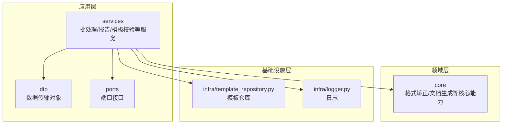
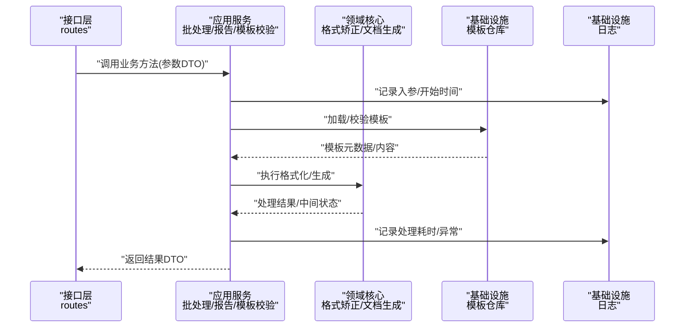
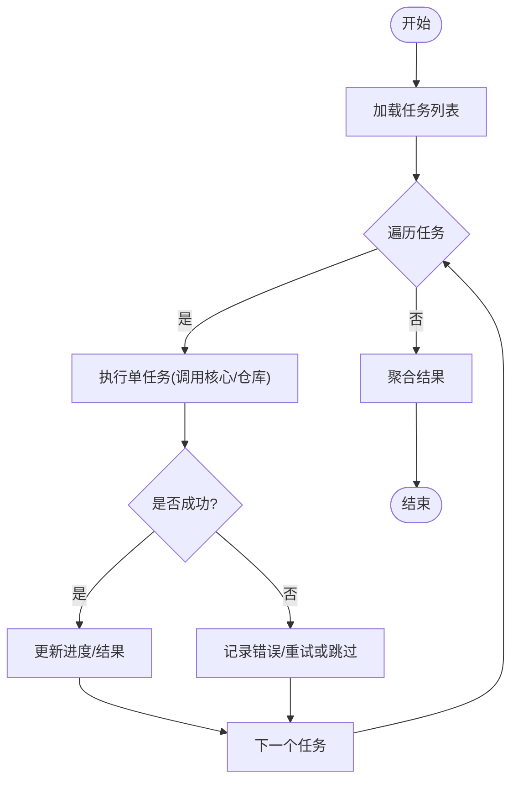
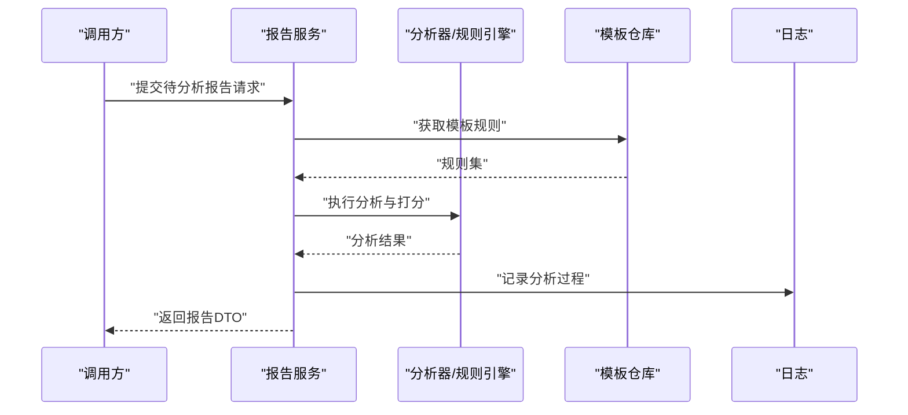
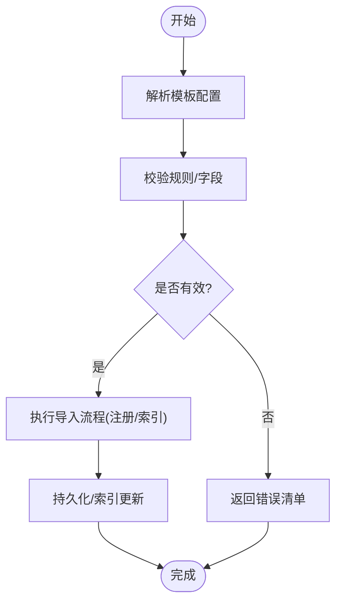
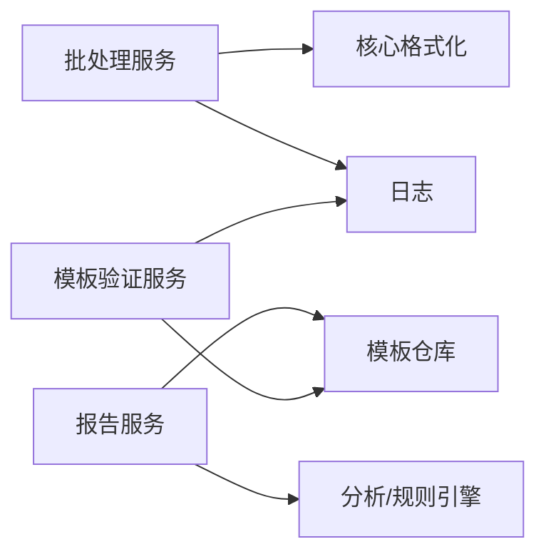

# 应用层设计

<cite>
**本文引用的文件**   
- [src/paper_format_corrector/application/services/batch_service.py](file://src/paper_format_corrector/application/services/batch_service.py)
- [src/paper_format_corrector/application/services/report_service.py](file://src/paper_format_corrector/application/services/report_service.py)
- [src/paper_format_corrector/application/services/template_validation.py](file://src/paper_format_corrector/application/services/template_validation.py)
- [src/paper_format_corrector/application/services/template_validation_service.py](file://src/paper_format_corrector/application/services/template_validation_service.py)
- [src/paper_format_corrector/application/dto](file://src/paper_format_corrector/application/dto)
- [src/paper_format_corrector/application/ports](file://src/paper_format_corrector/application/ports)
- [src/paper_format_corrector/core/format_corrector.py](file://src/paper_format_corrector/core/format_corrector.py)
- [src/paper_format_corrector/core/doc_generator.py](file://src/paper_format_corrector/core/doc_generator.py)
- [src/paper_format_corrector/infra/template_repository.py](file://src/paper_format_corrector/infra/template_repository.py)
- [src/paper_format_corrector/infra/logger.py](file://src/paper_format_corrector/infra/logger.py)
- [src/paper_format_corrector/interfaces/api/routes](file://src/paper_format_corrector/interfaces/api/routes)
</cite>

## 目录
1. [简介](#简介)
2. [项目结构](#项目结构)
3. [核心组件](#核心组件)
4. [架构总览](#架构总览)
5. [详细组件分析](#详细组件分析)
6. [依赖分析](#依赖分析)
7. [性能考虑](#性能考虑)
8. [故障排查指南](#故障排查指南)
9. [结论](#结论)
10. [附录](#附录)

## 简介
本文件聚焦于应用层设计，围绕业务服务层的职责与实现展开，重点覆盖批处理服务、报告服务、模板验证服务等核心业务逻辑。文档同时说明数据传输对象（DTO）的设计与端口（Ports）接口定义，解释应用层如何协调领域层与基础设施层的工作流程，并提供事务管理、异常处理与日志记录的应用层策略。为便于理解，文中包含面向代码的架构图、序列图与流程图，并给出关键实现路径引用。

## 项目结构
应用层位于 src/paper_format_corrector/application 下，采用分层与按功能域组织相结合的结构：
- services：业务服务编排与用例实现（批处理、报告、模板校验等）
- dto：跨层传输的数据结构
- ports：对外暴露的抽象接口，用于解耦领域与基础设施

图表来源
- [src/paper_format_corrector/application/services/batch_service.py](file://src/paper_format_corrector/application/services/batch_service.py)
- [src/paper_format_corrector/application/services/report_service.py](file://src/paper_format_corrector/application/services/report_service.py)
- [src/paper_format_corrector/application/services/template_validation.py](file://src/paper_format_corrector/application/services/template_validation.py)
- [src/paper_format_corrector/application/services/template_validation_service.py](file://src/paper_format_corrector/application/services/template_validation_service.py)
- [src/paper_format_corrector/core/format_corrector.py](file://src/paper_format_corrector/core/format_corrector.py)
- [src/paper_format_corrector/core/doc_generator.py](file://src/paper_format_corrector/core/doc_generator.py)
- [src/paper_format_corrector/infra/template_repository.py](file://src/paper_format_corrector/infra/template_repository.py)
- [src/paper_format_corrector/infra/logger.py](file://src/paper_format_corrector/infra/logger.py)

章节来源
- [src/paper_format_corrector/application/services/batch_service.py](file://src/paper_format_corrector/application/services/batch_service.py)
- [src/paper_format_corrector/application/services/report_service.py](file://src/paper_format_corrector/application/services/report_service.py)
- [src/paper_format_corrector/application/services/template_validation.py](file://src/paper_format_corrector/application/services/template_validation.py)
- [src/paper_format_corrector/application/services/template_validation_service.py](file://src/paper_format_corrector/application/services/template_validation_service.py)
- [src/paper_format_corrector/core/format_corrector.py](file://src/paper_format_corrector/core/format_corrector.py)
- [src/paper_format_corrector/core/doc_generator.py](file://src/paper_format_corrector/core/doc_generator.py)
- [src/paper_format_corrector/infra/template_repository.py](file://src/paper_format_corrector/infra/template_repository.py)
- [src/paper_format_corrector/infra/logger.py](file://src/paper_format_corrector/infra/logger.py)

## 核心组件
本节概述应用层三大核心服务的职责与协作关系：
- 批处理服务：负责批量任务编排、进度跟踪、错误隔离与结果聚合
- 报告服务：负责质量评估、差异对比与报告生成
- 模板验证服务：负责模板规则解析、校验与导入流程编排

这些服务通过 DTO 传递数据，通过 Ports 调用领域与基础设施能力，并通过日志进行可观测性保障。

章节来源
- [src/paper_format_corrector/application/services/batch_service.py](file://src/paper_format_corrector/application/services/batch_service.py)
- [src/paper_format_corrector/application/services/report_service.py](file://src/paper_format_corrector/application/services/report_service.py)
- [src/paper_format_corrector/application/services/template_validation.py](file://src/paper_format_corrector/application/services/template_validation.py)
- [src/paper_format_corrector/application/services/template_validation_service.py](file://src/paper_format_corrector/application/services/template_validation_service.py)

## 架构总览
应用层作为“编排者”，将来自接口的请求转换为领域操作，并协调基础设施完成持久化与外部交互。下图展示典型端到端流程：API 路由接收请求，应用服务编排核心能力与模板仓库，最终返回结构化响应。

图表来源
- [src/paper_format_corrector/interfaces/api/routes](file://src/paper_format_corrector/interfaces/api/routes)
- [src/paper_format_corrector/application/services/batch_service.py](file://src/paper_format_corrector/application/services/batch_service.py)
- [src/paper_format_corrector/application/services/report_service.py](file://src/paper_format_corrector/application/services/report_service.py)
- [src/paper_format_corrector/application/services/template_validation.py](file://src/paper_format_corrector/application/services/template_validation.py)
- [src/paper_format_corrector/core/format_corrector.py](file://src/paper_format_corrector/core/format_corrector.py)
- [src/paper_format_corrector/core/doc_generator.py](file://src/paper_format_corrector/core/doc_generator.py)
- [src/paper_format_corrector/infra/template_repository.py](file://src/paper_format_corrector/infra/template_repository.py)
- [src/paper_format_corrector/infra/logger.py](file://src/paper_format_corrector/infra/logger.py)

## 详细组件分析

### 批处理服务（Batch Service）
职责
- 接收批量任务列表，逐项或并行执行
- 维护任务状态与进度，支持失败重试与跳过策略
- 聚合各子任务结果，输出统一的结果 DTO

关键流程

图表来源
- [src/paper_format_corrector/application/services/batch_service.py](file://src/paper_format_corrector/application/services/batch_service.py)
- [src/paper_format_corrector/infra/logger.py](file://src/paper_format_corrector/infra/logger.py)

章节来源
- [src/paper_format_corrector/application/services/batch_service.py](file://src/paper_format_corrector/application/services/batch_service.py)

### 报告服务（Report Service）
职责
- 基于文档分析与规则引擎生成质量报告
- 汇总差异与评分，输出可读的报告 DTO
- 与模板验证服务协作，确保报告依据最新模板规则

关键流程

图表来源
- [src/paper_format_corrector/application/services/report_service.py](file://src/paper_format_corrector/application/services/report_service.py)
- [src/paper_format_corrector/infra/template_repository.py](file://src/paper_format_corrector/infra/template_repository.py)
- [src/paper_format_corrector/infra/logger.py](file://src/paper_format_corrector/infra/logger.py)

章节来源
- [src/paper_format_corrector/application/services/report_service.py](file://src/paper_format_corrector/application/services/report_service.py)

### 模板验证服务（Template Validation Services）
职责
- 解析模板配置，校验必填字段、类型与约束
- 提供模板导入流程编排，确保一致性
- 与模板仓库协作，完成模板注册与版本管理

关键流程

图表来源
- [src/paper_format_corrector/application/services/template_validation.py](file://src/paper_format_corrector/application/services/template_validation.py)
- [src/paper_format_corrector/application/services/template_validation_service.py](file://src/paper_format_corrector/application/services/template_validation_service.py)
- [src/paper_format_corrector/infra/template_repository.py](file://src/paper_format_corrector/infra/template_repository.py)

章节来源
- [src/paper_format_corrector/application/services/template_validation.py](file://src/paper_format_corrector/application/services/template_validation.py)
- [src/paper_format_corrector/application/services/template_validation_service.py](file://src/paper_format_corrector/application/services/template_validation_service.py)

### DTO 设计与使用
- 目的：在应用层与接口层之间传递稳定的数据结构，屏蔽底层变化
- 设计要点：
  - 明确输入 DTO（如任务列表、模板上传参数）与输出 DTO（如报告、任务结果）
  - 字段命名清晰、类型稳定，必要时包含枚举值与可选字段
  - 避免直接暴露领域实体或基础设施模型
- 使用建议：
  - 在服务入口对 DTO 做基础校验
  - 在服务出口构造统一的响应结构，便于前端/客户端消费

章节来源
- [src/paper_format_corrector/application/dto](file://src/paper_format_corrector/application/dto)

### Ports 端口接口定义
- 目的：以抽象接口隔离领域与基础设施，提升可测试性与替换性
- 常见端口：
  - 模板仓库端口：提供模板加载、校验、注册与查询
  - 日志端口：提供结构化日志写入
  - 核心能力端口：封装格式矫正与文档生成的调用契约
- 使用方式：
  - 应用服务依赖端口而非具体实现
  - 在测试中注入模拟实现，保证服务编排的可测性

章节来源
- [src/paper_format_corrector/application/ports](file://src/paper_format_corrector/application/ports)

### 应用层与领域/基础设施的协作
- 应用服务作为编排中心，组合多个核心能力与仓库操作
- 通过 DTO 承载输入输出，通过 Ports 访问外部能力
- 在关键节点记录日志，捕获异常并转化为用户友好的错误信息

章节来源
- [src/paper_format_corrector/core/format_corrector.py](file://src/paper_format_corrector/core/format_corrector.py)
- [src/paper_format_corrector/core/doc_generator.py](file://src/paper_format_corrector/core/doc_generator.py)
- [src/paper_format_corrector/infra/template_repository.py](file://src/paper_format_corrector/infra/template_repository.py)
- [src/paper_format_corrector/infra/logger.py](file://src/paper_format_corrector/infra/logger.py)

## 依赖分析
应用层对领域与基础设施的依赖如下：
- 批处理服务依赖核心格式化能力与日志
- 报告服务依赖模板仓库与分析能力
- 模板验证服务依赖模板仓库与校验逻辑

图表来源
- [src/paper_format_corrector/application/services/batch_service.py](file://src/paper_format_corrector/application/services/batch_service.py)
- [src/paper_format_corrector/application/services/report_service.py](file://src/paper_format_corrector/application/services/report_service.py)
- [src/paper_format_corrector/application/services/template_validation.py](file://src/paper_format_corrector/application/services/template_validation.py)
- [src/paper_format_corrector/core/format_corrector.py](file://src/paper_format_corrector/core/format_corrector.py)
- [src/paper_format_corrector/core/doc_generator.py](file://src/paper_format_corrector/core/doc_generator.py)
- [src/paper_format_corrector/infra/template_repository.py](file://src/paper_format_corrector/infra/template_repository.py)
- [src/paper_format_corrector/infra/logger.py](file://src/paper_format_corrector/infra/logger.py)

章节来源
- [src/paper_format_corrector/application/services/batch_service.py](file://src/paper_format_corrector/application/services/batch_service.py)
- [src/paper_format_corrector/application/services/report_service.py](file://src/paper_format_corrector/application/services/report_service.py)
- [src/paper_format_corrector/application/services/template_validation.py](file://src/paper_format_corrector/application/services/template_validation.py)
- [src/paper_format_corrector/core/format_corrector.py](file://src/paper_format_corrector/core/format_corrector.py)
- [src/paper_format_corrector/core/doc_generator.py](file://src/paper_format_corrector/core/doc_generator.py)
- [src/paper_format_corrector/infra/template_repository.py](file://src/paper_format_corrector/infra/template_repository.py)
- [src/paper_format_corrector/infra/logger.py](file://src/paper_format_corrector/infra/logger.py)

## 性能考虑
- 批处理并发控制：根据资源限制设置最大并发度，避免过载
- 惰性加载与缓存：模板与规则按需加载，减少重复 IO
- 增量处理：仅对变更部分进行分析与格式化，降低整体耗时
- 异步与队列：将耗时任务放入队列，提高吞吐与稳定性
- 日志采样：在高吞吐场景下对日志进行采样，避免 I/O 瓶颈

[本节为通用指导，不直接分析具体文件]

## 故障排查指南
- 常见问题定位
  - 模板校验失败：检查模板字段完整性与类型约束
  - 批处理中断：查看任务级错误日志与重试计数
  - 报告不一致：确认模板版本与分析规则是否匹配
- 日志与追踪
  - 在关键步骤记录入参、耗时与异常堆栈
  - 为每个任务分配唯一标识，便于链路追踪
- 回滚与恢复
  - 对长事务进行分阶段提交，失败时回滚到最近一致点
  - 保留中间产物以便复现问题

章节来源
- [src/paper_format_corrector/infra/logger.py](file://src/paper_format_corrector/infra/logger.py)
- [src/paper_format_corrector/application/services/batch_service.py](file://src/paper_format_corrector/application/services/batch_service.py)
- [src/paper_format_corrector/application/services/report_service.py](file://src/paper_format_corrector/application/services/report_service.py)
- [src/paper_format_corrector/application/services/template_validation.py](file://src/paper_format_corrector/application/services/template_validation.py)

## 结论
应用层通过清晰的职责划分与端口抽象，实现了批处理、报告与模板校验等核心业务的稳定编排。借助 DTO 与日志策略，系统在可扩展性、可测试性与可观测性方面具备良好基础。后续可在并发控制、缓存与异步化方面进一步优化，以提升整体性能与用户体验。

[本节为总结性内容，不直接分析具体文件]

## 附录
- 示例参考路径（不包含代码片段）
  - 批处理服务编排：[batch_service.py](file://src/paper_format_corrector/application/services/batch_service.py)
  - 报告服务流程：[report_service.py](file://src/paper_format_corrector/application/services/report_service.py)
  - 模板验证与导入：[template_validation.py](file://src/paper_format_corrector/application/services/template_validation.py)、[template_validation_service.py](file://src/paper_format_corrector/application/services/template_validation_service.py)
  - 核心能力调用：[format_corrector.py](file://src/paper_format_corrector/core/format_corrector.py)、[doc_generator.py](file://src/paper_format_corrector/core/doc_generator.py)
  - 模板仓库与日志：[template_repository.py](file://src/paper_format_corrector/infra/template_repository.py)、[logger.py](file://src/paper_format_corrector/infra/logger.py)
  - 接口层入口：[interfaces/api/routes](file://src/paper_format_corrector/interfaces/api/routes)