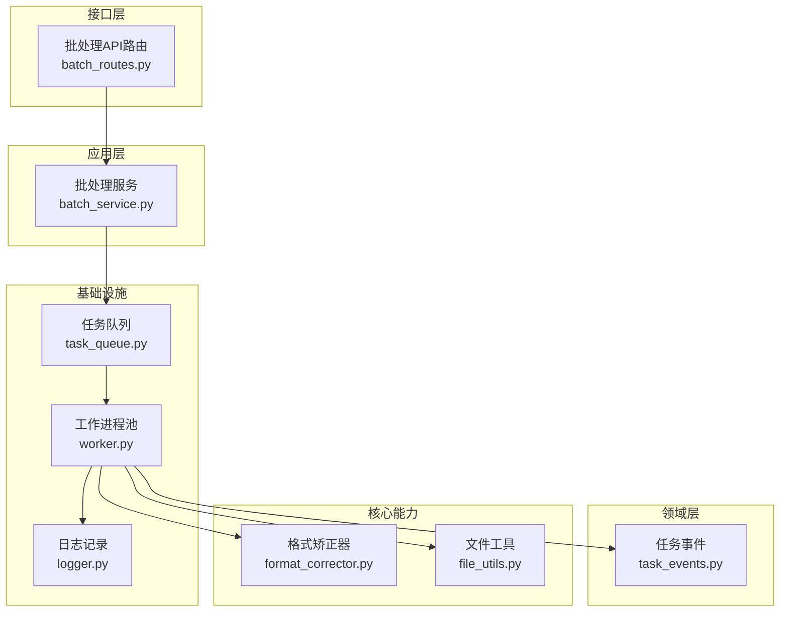
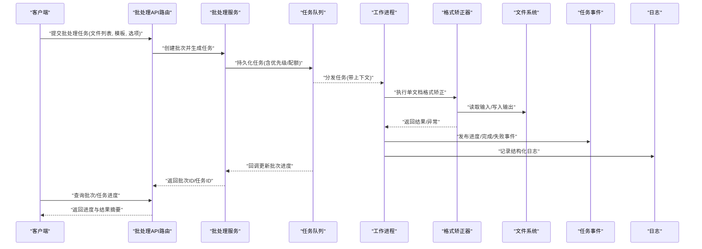
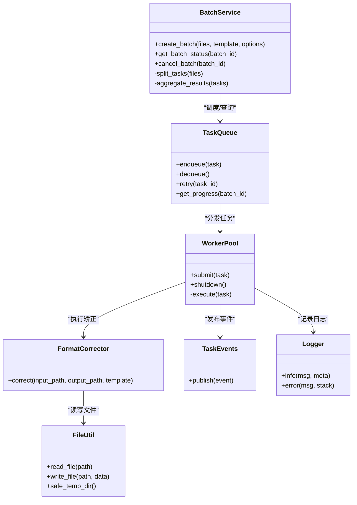

# 批处理服务

<cite>
**本文引用的文件**   
- [src/paper_format_corrector/application/services/batch_service.py](file://src/paper_format_corrector/application/services/batch_service.py)
- [src/paper_format_corrector/infrastructure/queue/task_queue.py](file://src/paper_format_corrector/infrastructure/queue/task_queue.py)
- [src/paper_format_corrector/infrastructure/queue/worker.py](file://src/paper_format_corrector/infrastructure/queue/worker.py)
- [src/paper_format_corrector/core/format_corrector.py](file://src/paper_format_corrector/core/format_corrector.py)
- [src/paper_format_corrector/interfaces/api/routes/batch_routes.py](file://src/paper_format_corrector/interfaces/api/routes/batch_routes.py)
- [src/paper_format_corrector/domain/events/task_events.py](file://src/paper_format_corrector/domain/events/task_events.py)
- [src/paper_format_corrector/shared/utils/file_utils.py](file://src/paper_format_corrector/shared/utils/file_utils.py)
- [src/paper_format_corrector/infra/logger.py](file://src/paper_format_corrector/infra/logger.py)
- [tests/test_task_queue.py](file://tests/test_task_queue.py)
</cite>

## 目录
1. [简介](#简介)
2. [项目结构](#项目结构)
3. [核心组件](#核心组件)
4. [架构总览](#架构总览)
5. [详细组件分析](#详细组件分析)
6. [依赖关系分析](#依赖关系分析)
7. [性能考虑](#性能考虑)
8. [故障排查指南](#故障排查指南)
9. [结论](#结论)
10. [附录](#附录)

## 简介
本文件面向“论文格式矫正工具”的批处理服务，系统性阐述批量文档处理的业务逻辑与实现要点，包括任务队列管理、并发策略、进度跟踪、错误恢复、优先级与资源分配、以及监控与管理接口。文档同时提供可操作的示例路径，帮助读者快速创建、监控和管理批处理任务，并给出性能优化、内存管理与异常处理的最佳实践建议。

## 项目结构
批处理相关代码主要分布在应用层服务、基础设施队列、领域事件、API路由与核心格式化器之间，形成清晰的分层与职责边界：
- 应用层服务：编排批量任务生命周期（创建、调度、监控、取消）
- 基础设施队列：持久化任务、工作进程池、并发控制
- 领域事件：任务状态变更与进度上报
- API路由：对外暴露批处理接口
- 核心格式化器：执行具体文档格式矫正逻辑

图表来源
- [src/paper_format_corrector/application/services/batch_service.py](file://src/paper_format_corrector/application/services/batch_service.py)
- [src/paper_format_corrector/infrastructure/queue/task_queue.py](file://src/paper_format_corrector/infrastructure/queue/task_queue.py)
- [src/paper_format_corrector/infrastructure/queue/worker.py](file://src/paper_format_corrector/infrastructure/queue/worker.py)
- [src/paper_format_corrector/core/format_corrector.py](file://src/paper_format_corrector/core/format_corrector.py)
- [src/paper_format_corrector/interfaces/api/routes/batch_routes.py](file://src/paper_format_corrector/interfaces/api/routes/batch_routes.py)
- [src/paper_format_corrector/domain/events/task_events.py](file://src/paper_format_corrector/domain/events/task_events.py)
- [src/paper_format_corrector/shared/utils/file_utils.py](file://src/paper_format_corrector/shared/utils/file_utils.py)
- [src/paper_format_corrector/infra/logger.py](file://src/paper_format_corrector/infra/logger.py)

章节来源
- [src/paper_format_corrector/application/services/batch_service.py](file://src/paper_format_corrector/application/services/batch_service.py)
- [src/paper_format_corrector/infrastructure/queue/task_queue.py](file://src/paper_format_corrector/infrastructure/queue/task_queue.py)
- [src/paper_format_corrector/infrastructure/queue/worker.py](file://src/paper_format_corrector/infrastructure/queue/worker.py)
- [src/paper_format_corrector/core/format_corrector.py](file://src/paper_format_corrector/core/format_corrector.py)
- [src/paper_format_corrector/interfaces/api/routes/batch_routes.py](file://src/paper_format_corrector/interfaces/api/routes/batch_routes.py)
- [src/paper_format_corrector/domain/events/task_events.py](file://src/paper_format_corrector/domain/events/task_events.py)
- [src/paper_format_corrector/shared/utils/file_utils.py](file://src/paper_format_corrector/shared/utils/file_utils.py)
- [src/paper_format_corrector/infra/logger.py](file://src/paper_format_corrector/infra/logger.py)

## 核心组件
- 批处理服务：负责批量任务的创建、拆分、调度、监控与结果聚合；维护任务元数据与进度快照。
- 任务队列：提供任务持久化、优先级排序、重试与幂等保障；支持按批次隔离与资源配额。
- 工作进程池：基于并发模型（线程或进程）执行具体任务；限制并发度、隔离资源、回收上下文。
- 格式矫正器：封装单文档格式矫正的核心算法与步骤，保证无副作用与可重入。
- 任务事件：定义任务生命周期事件（创建、开始、进度更新、完成、失败），用于追踪与告警。
- API路由：暴露REST接口，供外部系统提交批处理任务、查询进度、取消任务、获取报告。
- 文件工具：统一文件读写、路径安全校验、临时目录清理与磁盘空间检查。
- 日志记录：结构化日志输出，包含任务ID、批次ID、阶段、耗时与错误堆栈。

章节来源
- [src/paper_format_corrector/application/services/batch_service.py](file://src/paper_format_corrector/application/services/batch_service.py)
- [src/paper_format_corrector/infrastructure/queue/task_queue.py](file://src/paper_format_corrector/infrastructure/queue/task_queue.py)
- [src/paper_format_corrector/infrastructure/queue/worker.py](file://src/paper_format_corrector/infrastructure/queue/worker.py)
- [src/paper_format_corrector/core/format_corrector.py](file://src/paper_format_corrector/core/format_corrector.py)
- [src/paper_format_corrector/domain/events/task_events.py](file://src/paper_format_corrector/domain/events/task_events.py)
- [src/paper_format_corrector/interfaces/api/routes/batch_routes.py](file://src/paper_format_corrector/interfaces/api/routes/batch_routes.py)
- [src/paper_format_corrector/shared/utils/file_utils.py](file://src/paper_format_corrector/shared/utils/file_utils.py)
- [src/paper_format_corrector/infra/logger.py](file://src/paper_format_corrector/infra/logger.py)

## 架构总览
下图展示从API到队列、工作进程、核心矫正器的完整调用链，以及事件与日志的交互。

图表来源
- [src/paper_format_corrector/interfaces/api/routes/batch_routes.py](file://src/paper_format_corrector/interfaces/api/routes/batch_routes.py)
- [src/paper_format_corrector/application/services/batch_service.py](file://src/paper_format_corrector/application/services/batch_service.py)
- [src/paper_format_corrector/infrastructure/queue/task_queue.py](file://src/paper_format_corrector/infrastructure/queue/task_queue.py)
- [src/paper_format_corrector/infrastructure/queue/worker.py](file://src/paper_format_corrector/infrastructure/queue/worker.py)
- [src/paper_format_corrector/core/format_corrector.py](file://src/paper_format_corrector/core/format_corrector.py)
- [src/paper_format_corrector/domain/events/task_events.py](file://src/paper_format_corrector/domain/events/task_events.py)
- [src/paper_format_corrector/infra/logger.py](file://src/paper_format_corrector/infra/logger.py)

## 详细组件分析

### 批处理服务（BatchService）
- 职责
  - 接收批量任务请求，进行参数校验与模板解析
  - 将大任务拆分为子任务，设置优先级与资源配额
  - 维护批次状态机（待处理、进行中、部分成功、全部完成、失败）
  - 聚合子任务结果，生成批次报告
- 关键流程
  - 创建批次：生成批次ID，初始化任务集合与进度计数器
  - 任务拆分：按文件大小、复杂度估算权重，计算优先级
  - 调度：调用任务队列提交任务，绑定回调以更新进度
  - 监控：定时拉取或事件驱动更新批次进度
  - 收尾：清理临时文件，归档输出，发布完成事件
- 并发与资源
  - 通过队列配置限制最大并发数
  - 为每个批次设置资源配额（CPU/IO上限）
- 错误恢复
  - 对单个任务失败进行重试（指数退避）
  - 批次级补偿：失败任务标记并重试，不影响其他任务
- 进度跟踪
  - 子任务维度：开始、处理中、完成、失败
  - 批次维度：累计完成数、成功率、预计剩余时间
- 示例参考
  - 创建批处理任务：[src/paper_format_corrector/application/services/batch_service.py](file://src/paper_format_corrector/application/services/batch_service.py)
  - 查询批次进度：同上
  - 取消批次任务：同上

章节来源
- [src/paper_format_corrector/application/services/batch_service.py](file://src/paper_format_corrector/application/services/batch_service.py)

### 任务队列（TaskQueue）
- 职责
  - 持久化任务（JSON/数据库），支持按批次隔离
  - 优先级队列：高优先级优先出队，同优先级按到达顺序
  - 重试与幂等：去重键、失败重试次数上限、退避策略
  - 资源配额：按批次/用户维度限制并发与吞吐
- 数据结构
  - 任务对象：包含任务ID、批次ID、优先级、输入路径、输出路径、重试计数、超时、标签
  - 批次对象：包含批次ID、任务集合、状态、进度、统计信息
- 并发控制
  - 使用有界队列与工作进程池配合，避免过载
  - 背压机制：当队列长度超过阈值时拒绝新任务或降级
- 示例参考
  - 任务入队/出队：[src/paper_format_corrector/infrastructure/queue/task_queue.py](file://src/paper_format_corrector/infrastructure/queue/task_queue.py)
  - 重试与幂等：同上
  - 单元测试：[tests/test_task_queue.py](file://tests/test_task_queue.py)

章节来源
- [src/paper_format_corrector/infrastructure/queue/task_queue.py](file://src/paper_format_corrector/infrastructure/queue/task_queue.py)
- [tests/test_task_queue.py](file://tests/test_task_queue.py)

### 工作进程池（WorkerPool）
- 职责
  - 消费队列中的任务，执行具体格式矫正逻辑
  - 隔离运行环境，防止任务间相互污染
  - 捕获异常、记录日志、发布事件
- 并发模型
  - 线程池：适合IO密集型任务
  - 进程池：适合CPU密集型任务，需序列化输入输出
- 资源管理
  - 限制每进程/线程的资源使用（内存、句柄、临时文件）
  - 定期健康检查与自动重启异常进程
- 示例参考
  - 进程/线程池管理：[src/paper_format_corrector/infrastructure/queue/worker.py](file://src/paper_format_corrector/infrastructure/queue/worker.py)
  - 任务执行与异常处理：同上

章节来源
- [src/paper_format_corrector/infrastructure/queue/worker.py](file://src/paper_format_corrector/infrastructure/queue/worker.py)

### 格式矫正器（FormatCorrector）
- 职责
  - 加载文档、应用模板规则、执行格式矫正步骤
  - 输出标准化文档与中间产物（如样式提取、差异报告）
- 设计原则
  - 无副作用：不修改原文件，仅写入目标路径
  - 可重入：相同输入产生相同输出，便于重试与幂等
- 示例参考
  - 核心矫正流程：[src/paper_format_corrector/core/format_corrector.py](file://src/paper_format_corrector/core/format_corrector.py)

章节来源
- [src/paper_format_corrector/core/format_corrector.py](file://src/paper_format_corrector/core/format_corrector.py)

### 任务事件（TaskEvents）
- 职责
  - 定义任务生命周期事件类型与载荷
  - 提供事件发布/订阅接口，供监控与告警使用
- 事件类型
  - 任务创建、开始、进度更新、完成、失败、重试
- 示例参考
  - 事件定义与发布：[src/paper_format_corrector/domain/events/task_events.py](file://src/paper_format_corrector/domain/events/task_events.py)

章节来源
- [src/paper_format_corrector/domain/events/task_events.py](file://src/paper_format_corrector/domain/events/task_events.py)

### API路由（BatchRoutes）
- 职责
  - 暴露REST接口：创建批次、查询进度、取消任务、下载报告
  - 参数校验、权限控制、限流与审计
- 示例参考
  - 批处理接口定义：[src/paper_format_corrector/interfaces/api/routes/batch_routes.py](file://src/paper_format_corrector/interfaces/api/routes/batch_routes.py)

章节来源
- [src/paper_format_corrector/interfaces/api/routes/batch_routes.py](file://src/paper_format_corrector/interfaces/api/routes/batch_routes.py)

### 文件工具（FileUtils）
- 职责
  - 统一文件读写、路径安全校验、临时目录管理
  - 磁盘空间检查与清理策略
- 示例参考
  - 文件操作与安全：[src/paper_format_corrector/shared/utils/file_utils.py](file://src/paper_format_corrector/shared/utils/file_utils.py)

章节来源
- [src/paper_format_corrector/shared/utils/file_utils.py](file://src/paper_format_corrector/shared/utils/file_utils.py)

### 日志记录（Logger）
- 职责
  - 结构化日志输出，包含任务ID、批次ID、阶段、耗时、错误堆栈
  - 分级日志与采样策略，避免日志风暴
- 示例参考
  - 日志配置与使用：[src/paper_format_corrector/infra/logger.py](file://src/paper_format_corrector/infra/logger.py)

章节来源
- [src/paper_format_corrector/infra/logger.py](file://src/paper_format_corrector/infra/logger.py)

## 依赖关系分析
- 耦合与内聚
  - 批处理服务与队列强耦合（调度与状态同步）
  - 工作进程与矫正器松耦合（通过函数/接口调用）
  - 事件与日志作为横切关注点，被多模块复用
- 外部依赖
  - 文件系统：输入/输出与临时目录
  - 可选持久化：任务与批次状态可落盘
- 潜在循环依赖
  - 确保事件与日志不反向依赖业务服务，避免环

图表来源
- [src/paper_format_corrector/application/services/batch_service.py](file://src/paper_format_corrector/application/services/batch_service.py)
- [src/paper_format_corrector/infrastructure/queue/task_queue.py](file://src/paper_format_corrector/infrastructure/queue/task_queue.py)
- [src/paper_format_corrector/infrastructure/queue/worker.py](file://src/paper_format_corrector/infrastructure/queue/worker.py)
- [src/paper_format_corrector/core/format_corrector.py](file://src/paper_format_corrector/core/format_corrector.py)
- [src/paper_format_corrector/domain/events/task_events.py](file://src/paper_format_corrector/domain/events/task_events.py)
- [src/paper_format_corrector/shared/utils/file_utils.py](file://src/paper_format_corrector/shared/utils/file_utils.py)
- [src/paper_format_corrector/infra/logger.py](file://src/paper_format_corrector/infra/logger.py)

章节来源
- [src/paper_format_corrector/application/services/batch_service.py](file://src/paper_format_corrector/application/services/batch_service.py)
- [src/paper_format_corrector/infrastructure/queue/task_queue.py](file://src/paper_format_corrector/infrastructure/queue/task_queue.py)
- [src/paper_format_corrector/infrastructure/queue/worker.py](file://src/paper_format_corrector/infrastructure/queue/worker.py)
- [src/paper_format_corrector/core/format_corrector.py](file://src/paper_format_corrector/core/format_corrector.py)
- [src/paper_format_corrector/domain/events/task_events.py](file://src/paper_format_corrector/domain/events/task_events.py)
- [src/paper_format_corrector/shared/utils/file_utils.py](file://src/paper_format_corrector/shared/utils/file_utils.py)
- [src/paper_format_corrector/infra/logger.py](file://src/paper_format_corrector/infra/logger.py)

## 性能考虑
- 并发策略
  - IO密集型：使用线程池，提高I/O吞吐
  - CPU密集型：使用进程池，避免GIL限制
  - 动态调整：根据系统负载与队列深度自适应调节并发度
- 内存管理
  - 分块读取大文档，避免一次性加载
  - 及时释放临时文件与缓存，减少内存峰值
  - 为每个工作单元设置内存上限，超限则优雅终止并标记失败
- I/O优化
  - 并行读写不同文件，但限制同一磁盘的并发写
  - 使用缓冲与异步写入，降低阻塞
- 重试与退避
  - 指数退避+抖动，避免雪崩
  - 最大重试次数与死信队列，便于人工干预
- 监控与指标
  - 记录任务耗时分布、队列长度、失败率、重试率
  - 设置告警阈值，及时发现瓶颈

## 故障排查指南
- 常见问题
  - 任务卡住：检查队列是否堆积、工作进程是否崩溃、是否有死锁
  - 内存溢出：确认是否一次性加载大文档、是否存在未释放的引用
  - 权限问题：确认输出目录权限、临时目录可写
  - 模板错误：验证模板语法与字段映射
- 定位方法
  - 查看结构化日志，过滤任务ID与批次ID
  - 检查任务事件流，定位失败阶段
  - 复现最小用例，逐步缩小范围
- 恢复策略
  - 重试失败任务，必要时重置状态
  - 清理临时文件与僵尸进程
  - 回滚部分成功的批次，保持一致性

章节来源
- [src/paper_format_corrector/infra/logger.py](file://src/paper_format_corrector/infra/logger.py)
- [src/paper_format_corrector/domain/events/task_events.py](file://src/paper_format_corrector/domain/events/task_events.py)
- [tests/test_task_queue.py](file://tests/test_task_queue.py)

## 结论
批处理服务通过分层设计与清晰的职责划分，实现了高可靠、可扩展的批量文档格式矫正能力。借助任务队列与工作进程池，系统在并发、资源与错误恢复方面具备良好表现。结合事件与日志，可实现端到端的可观测性。建议在部署时根据实际负载调优并发与资源配额，并建立完善的监控与告警体系。

## 附录
- 示例路径
  - 创建批处理任务：[src/paper_format_corrector/application/services/batch_service.py](file://src/paper_format_corrector/application/services/batch_service.py)
  - 查询批次进度：[src/paper_format_corrector/interfaces/api/routes/batch_routes.py](file://src/paper_format_corrector/interfaces/api/routes/batch_routes.py)
  - 取消批次任务：[src/paper_format_corrector/application/services/batch_service.py](file://src/paper_format_corrector/application/services/batch_service.py)
  - 任务队列测试：[tests/test_task_queue.py](file://tests/test_task_queue.py)
- 最佳实践清单
  - 始终使用幂等键与去重逻辑
  - 为每个任务设置超时与重试上限
  - 使用结构化日志与事件追踪
  - 限制并发与资源配额，避免系统过载
  - 定期清理临时文件与归档输出