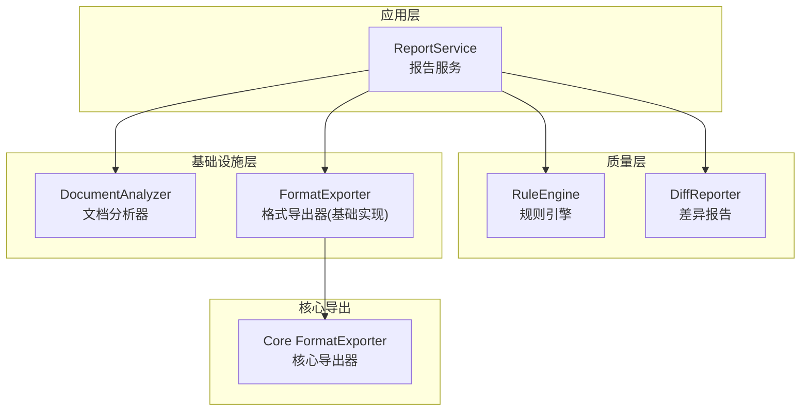
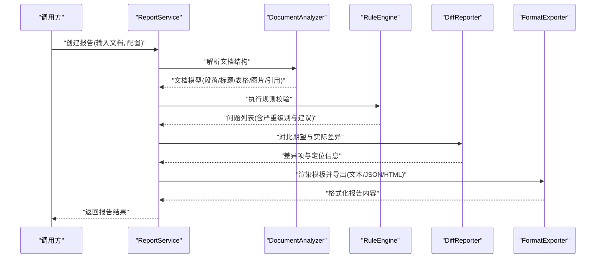
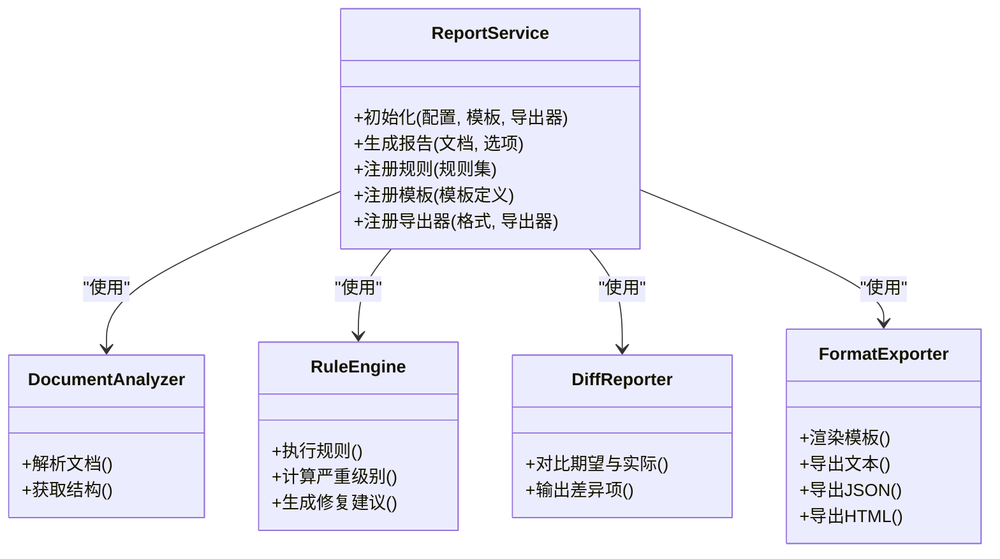
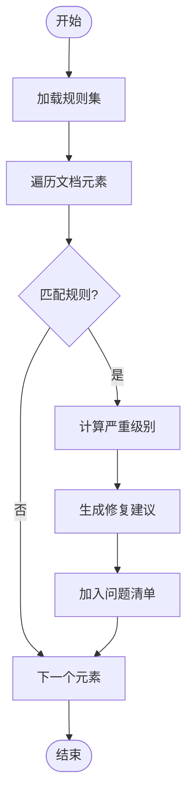
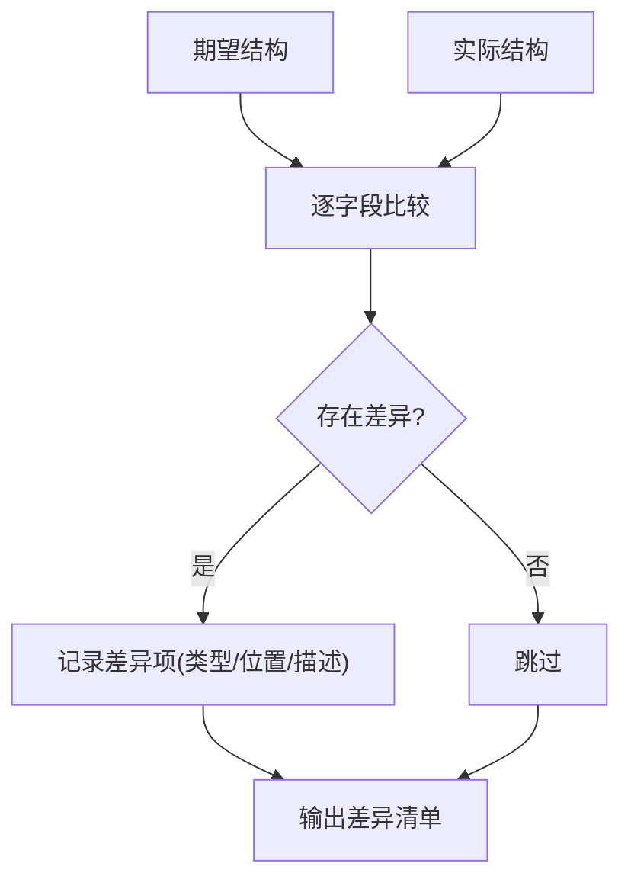
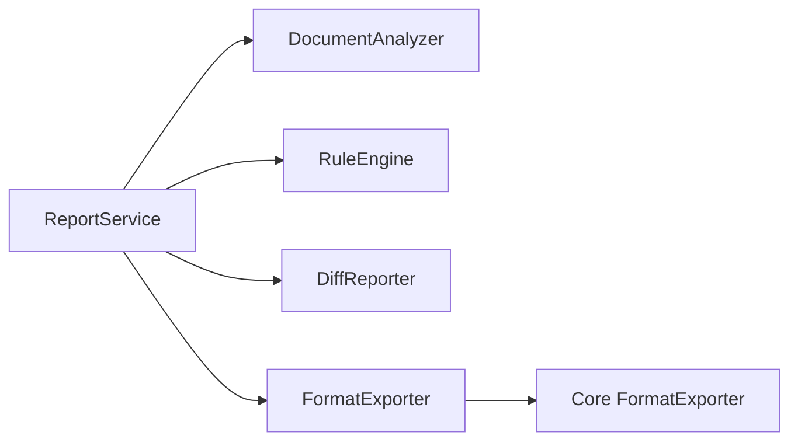

# 报告服务

<cite>
**本文引用的文件**   
- [src/paper_format_corrector/application/services/report_service.py](file://src/paper_format_corrector/application/services/report_service.py)
- [src/paper_format_corrector/quality/diff_reporter.py](file://src/paper_format_corrector/quality/diff_reporter.py)
- [src/paper_format_corrector/quality/rule_engine.py](file://src/paper_format_corrector/quality/rule_engine.py)
- [src/paper_format_corrector/core/format_exporter.py](file://src/paper_format_corrector/core/format_exporter.py)
- [src/paper_format_corrector/infrastructure/exporters/format_exporter.py](file://src/paper_format_corrector/infrastructure/exporters/format_exporter.py)
- [src/paper_format_corrector/infrastructure/parsers/document_analyzer.py](file://src/paper_format_corrector/infrastructure/parsers/document_analyzer.py)
- [src/paper_format_corrector/parsers/document_analyzer.py](file://src/paper_format_corrector/parsers/document_analyzer.py)
- [tests/test_report_service.py](file://tests/test_report_service.py)
</cite>

## 目录
1. [简介](#简介)
2. [项目结构](#项目结构)
3. [核心组件](#核心组件)
4. [架构总览](#架构总览)
5. [详细组件分析](#详细组件分析)
6. [依赖关系分析](#依赖关系分析)
7. [性能考虑](#性能考虑)
8. [故障排查指南](#故障排查指南)
9. [结论](#结论)
10. [附录](#附录)

## 简介
本报告服务聚焦于“文档格式检查报告”的生成与输出，覆盖从问题检测、严重程度分类、修复建议生成到多格式报告导出的完整链路。其目标是：
- 收集并分析文档中的格式问题（如段落样式、标题层级、图表编号、页眉页脚等）
- 将问题结构化，标注严重级别并提供可操作的修复建议
- 以多种格式（文本、JSON、HTML 等）导出报告，便于人类阅读与机器消费
- 提供可扩展的模板渲染与规则引擎机制，支持定制化与二次开发

## 项目结构
围绕报告服务的代码主要分布在应用层、质量层、基础设施层与核心导出模块中：
- 应用层服务：编排报告生成流程，协调解析器、规则引擎与导出器
- 质量层：负责规则匹配、差异对比与评分
- 基础设施层：文档解析、格式导出、模板渲染等能力
- 核心导出：统一导出接口与通用逻辑

图示来源
- [src/paper_format_corrector/application/services/report_service.py](file://src/paper_format_corrector/application/services/report_service.py)
- [src/paper_format_corrector/quality/rule_engine.py](file://src/paper_format_corrector/quality/rule_engine.py)
- [src/paper_format_corrector/quality/diff_reporter.py](file://src/paper_format_corrector/quality/diff_reporter.py)
- [src/paper_format_corrector/infrastructure/parsers/document_analyzer.py](file://src/paper_format_corrector/infrastructure/parsers/document_analyzer.py)
- [src/paper_format_corrector/infrastructure/exporters/format_exporter.py](file://src/paper_format_corrector/infrastructure/exporters/format_exporter.py)
- [src/paper_format_corrector/core/format_exporter.py](file://src/paper_format_corrector/core/format_exporter.py)

章节来源
- [src/paper_format_corrector/application/services/report_service.py](file://src/paper_format_corrector/application/services/report_service.py)
- [src/paper_format_corrector/quality/rule_engine.py](file://src/paper_format_corrector/quality/rule_engine.py)
- [src/paper_format_corrector/quality/diff_reporter.py](file://src/paper_format_corrector/quality/diff_reporter.py)
- [src/paper_format_corrector/infrastructure/parsers/document_analyzer.py](file://src/paper_format_corrector/infrastructure/parsers/document_analyzer.py)
- [src/paper_format_corrector/infrastructure/exporters/format_exporter.py](file://src/paper_format_corrector/infrastructure/exporters/format_exporter.py)
- [src/paper_format_corrector/core/format_exporter.py](file://src/paper_format_corrector/core/format_exporter.py)

## 核心组件
- 报告服务 ReportService
  - 职责：编排文档分析、规则校验、差异对比与报告导出；管理模板渲染与多格式输出
  - 关键流程：加载文档 → 解析结构 → 运行规则 → 生成问题清单 → 渲染模板 → 导出报告
- 规则引擎 RuleEngine
  - 职责：加载规则集、执行匹配、计算严重级别、生成修复建议
- 差异报告 DiffReporter
  - 职责：对比期望结构与实际结构，产出差异项与定位信息
- 文档分析器 DocumentAnalyzer
  - 职责：解析文档对象模型，提取段落、标题、表格、图片、引用等元素及其属性
- 格式导出器 FormatExporter
  - 职责：基于模板渲染与序列化策略，输出文本、JSON、HTML 等格式

章节来源
- [src/paper_format_corrector/application/services/report_service.py](file://src/paper_format_corrector/application/services/report_service.py)
- [src/paper_format_corrector/quality/rule_engine.py](file://src/paper_format_corrector/quality/rule_engine.py)
- [src/paper_format_corrector/quality/diff_reporter.py](file://src/paper_format_corrector/quality/diff_reporter.py)
- [src/paper_format_corrector/infrastructure/parsers/document_analyzer.py](file://src/paper_format_corrector/infrastructure/parsers/document_analyzer.py)
- [src/paper_format_corrector/infrastructure/exporters/format_exporter.py](file://src/paper_format_corrector/infrastructure/exporters/format_exporter.py)
- [src/paper_format_corrector/core/format_exporter.py](file://src/paper_format_corrector/core/format_exporter.py)

## 架构总览
报告生成的端到端时序如下：

图示来源
- [src/paper_format_corrector/application/services/report_service.py](file://src/paper_format_corrector/application/services/report_service.py)
- [src/paper_format_corrector/infrastructure/parsers/document_analyzer.py](file://src/paper_format_corrector/infrastructure/parsers/document_analyzer.py)
- [src/paper_format_corrector/quality/rule_engine.py](file://src/paper_format_corrector/quality/rule_engine.py)
- [src/paper_format_corrector/quality/diff_reporter.py](file://src/paper_format_corrector/quality/diff_reporter.py)
- [src/paper_format_corrector/infrastructure/exporters/format_exporter.py](file://src/paper_format_corrector/infrastructure/exporters/format_exporter.py)

## 详细组件分析

### 报告服务 ReportService
- 功能要点
  - 接收文档路径或文档对象，结合配置进行解析与校验
  - 聚合规则引擎与差异报告的输出，形成结构化问题清单
  - 通过模板渲染与导出器生成多格式报告
- 关键方法（概念性说明）
  - 初始化：加载配置、模板与导出器实例
  - 生成报告：解析文档、运行规则、对比差异、渲染模板、导出结果
  - 自定义扩展：注册新的规则、模板与导出格式
- 数据流
  - 输入：文档对象/路径、规则配置、模板配置、导出选项
  - 中间产物：文档模型、问题清单、差异项
  - 输出：文本/JSON/HTML 报告

图示来源
- [src/paper_format_corrector/application/services/report_service.py](file://src/paper_format_corrector/application/services/report_service.py)
- [src/paper_format_corrector/infrastructure/parsers/document_analyzer.py](file://src/paper_format_corrector/infrastructure/parsers/document_analyzer.py)
- [src/paper_format_corrector/quality/rule_engine.py](file://src/paper_format_corrector/quality/rule_engine.py)
- [src/paper_format_corrector/quality/diff_reporter.py](file://src/paper_format_corrector/quality/diff_reporter.py)
- [src/paper_format_corrector/infrastructure/exporters/format_exporter.py](file://src/paper_format_corrector/infrastructure/exporters/format_exporter.py)

章节来源
- [src/paper_format_corrector/application/services/report_service.py](file://src/paper_format_corrector/application/services/report_service.py)

### 规则引擎 RuleEngine
- 功能要点
  - 加载规则集（如段落样式、标题层级、图表编号、引用格式等）
  - 对文档模型逐项匹配，产生问题条目
  - 为每个问题计算严重级别（例如：错误、警告、提示）
  - 生成修复建议（具体操作步骤或自动修复脚本）
- 复杂度与优化
  - 规则匹配通常为线性扫描，可通过索引与缓存提升性能
  - 批量处理与并行化可减少总体耗时
- 错误处理
  - 规则缺失或异常时记录日志并跳过，保证整体流程稳定

图示来源
- [src/paper_format_corrector/quality/rule_engine.py](file://src/paper_format_corrector/quality/rule_engine.py)

章节来源
- [src/paper_format_corrector/quality/rule_engine.py](file://src/paper_format_corrector/quality/rule_engine.py)

### 差异报告 DiffReporter
- 功能要点
  - 对比“期望结构”与“实际结构”，定位差异位置
  - 输出差异项（类型、位置、描述），辅助报告可读性与自动化修复
- 典型差异场景
  - 标题层级不一致、段落缩进不合规、图表编号断号或重复、引用格式不符

图示来源
- [src/paper_format_corrector/quality/diff_reporter.py](file://src/paper_format_corrector/quality/diff_reporter.py)

章节来源
- [src/paper_format_corrector/quality/diff_reporter.py](file://src/paper_format_corrector/quality/diff_reporter.py)

### 文档分析器 DocumentAnalyzer
- 功能要点
  - 解析文档对象模型，提取段落、标题、表格、图片、引用等元素
  - 提供统一的访问接口供规则引擎与差异报告使用
- 注意
  - 不同文档格式需适配不同的解析策略（如 docx、pdf 等）

章节来源
- [src/paper_format_corrector/infrastructure/parsers/document_analyzer.py](file://src/paper_format_corrector/infrastructure/parsers/document_analyzer.py)
- [src/paper_format_corrector/parsers/document_analyzer.py](file://src/paper_format_corrector/parsers/document_analyzer.py)

### 格式导出器 FormatExporter
- 功能要点
  - 基于模板渲染引擎，将结构化问题清单转换为可读报告
  - 支持多格式导出：文本、JSON、HTML 等
  - 提供统一接口与默认实现，便于扩展新格式
- 模板渲染
  - 模板定义包含报告头部、问题列表、统计摘要、修复建议等区块
  - 渲染过程注入上下文数据（问题清单、统计信息、元数据）

章节来源
- [src/paper_format_corrector/infrastructure/exporters/format_exporter.py](file://src/paper_format_corrector/infrastructure/exporters/format_exporter.py)
- [src/paper_format_corrector/core/format_exporter.py](file://src/paper_format_corrector/core/format_exporter.py)

## 依赖关系分析
- 组件耦合
  - ReportService 作为编排者，依赖 DocumentAnalyzer、RuleEngine、DiffReporter、FormatExporter
  - RuleEngine 与 DiffReporter 相对独立，便于替换与扩展
  - FormatExporter 提供统一导出接口，内部可组合多个具体导出器
- 外部依赖
  - 文档解析可能依赖第三方库（如 python-docx）
  - 模板渲染可能依赖模板引擎（如 Jinja2）
- 潜在循环依赖
  - 当前设计分层清晰，未见直接循环依赖；若新增跨层回调需谨慎

图示来源
- [src/paper_format_corrector/application/services/report_service.py](file://src/paper_format_corrector/application/services/report_service.py)
- [src/paper_format_corrector/infrastructure/parsers/document_analyzer.py](file://src/paper_format_corrector/infrastructure/parsers/document_analyzer.py)
- [src/paper_format_corrector/quality/rule_engine.py](file://src/paper_format_corrector/quality/rule_engine.py)
- [src/paper_format_corrector/quality/diff_reporter.py](file://src/paper_format_corrector/quality/diff_reporter.py)
- [src/paper_format_corrector/infrastructure/exporters/format_exporter.py](file://src/paper_format_corrector/infrastructure/exporters/format_exporter.py)
- [src/paper_format_corrector/core/format_exporter.py](file://src/paper_format_corrector/core/format_exporter.py)

章节来源
- [src/paper_format_corrector/application/services/report_service.py](file://src/paper_format_corrector/application/services/report_service.py)
- [src/paper_format_corrector/infrastructure/exporters/format_exporter.py](file://src/paper_format_corrector/infrastructure/exporters/format_exporter.py)
- [src/paper_format_corrector/core/format_exporter.py](file://src/paper_format_corrector/core/format_exporter.py)

## 性能考虑
- 规则匹配优化
  - 对高频规则建立索引（按元素类型、属性键）
  - 使用增量更新与缓存避免重复计算
- 并行处理
  - 对大文档分块并行解析与规则匹配
  - 导出阶段可并发渲染多个模板片段
- I/O 优化
  - 批量写入报告文件，减少频繁磁盘操作
  - 使用流式输出降低内存占用

[本节为通用指导，无需特定文件来源]

## 故障排查指南
- 常见问题
  - 规则未生效：检查规则集是否加载成功、规则条件是否与文档模型匹配
  - 报告为空：确认文档解析是否成功、是否存在过滤条件导致无问题
  - 导出失败：检查模板变量是否齐全、目标格式导出器是否正确注册
- 调试建议
  - 启用详细日志，查看解析与规则匹配过程
  - 输出中间产物（文档模型、问题清单、差异项）进行比对
  - 使用最小复现用例验证规则与模板

章节来源
- [tests/test_report_service.py](file://tests/test_report_service.py)

## 结论
报告服务通过清晰的层次设计与可扩展的组件机制，实现了从文档解析、规则校验、差异对比到多格式导出的完整闭环。借助规则引擎与模板渲染，系统能够灵活定制检查维度与报告样式，满足多样化业务需求。建议在后续迭代中持续完善规则库、优化性能与增强错误诊断能力。

[本节为总结性内容，无需特定文件来源]

## 附录
- 使用示例（概念性步骤）
  - 初始化报告服务并传入配置与模板
  - 调用生成报告接口，传入文档路径或文档对象
  - 选择导出格式（文本/JSON/HTML），保存或返回结果
- 扩展机制
  - 新增规则：在规则集中添加新规则定义，确保与文档模型字段对应
  - 新增模板：编写模板文件并在服务中注册，渲染时注入上下文数据
  - 新增导出格式：实现导出器接口并注册到服务，支持新的序列化策略

[本节为概念性说明，无需特定文件来源]