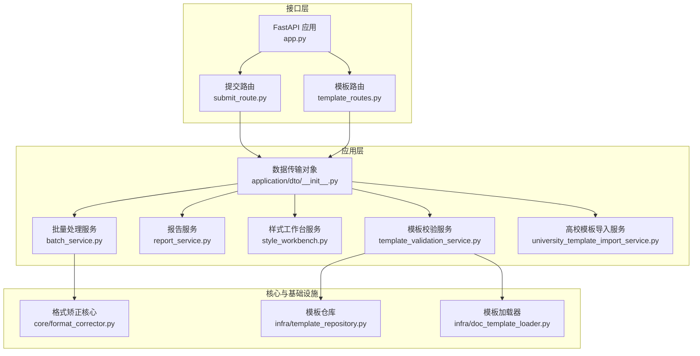
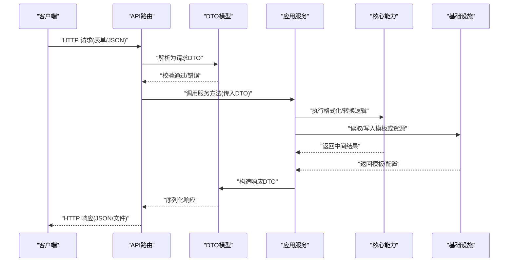
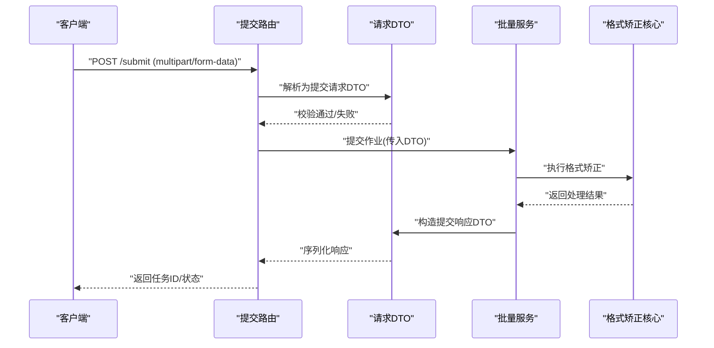
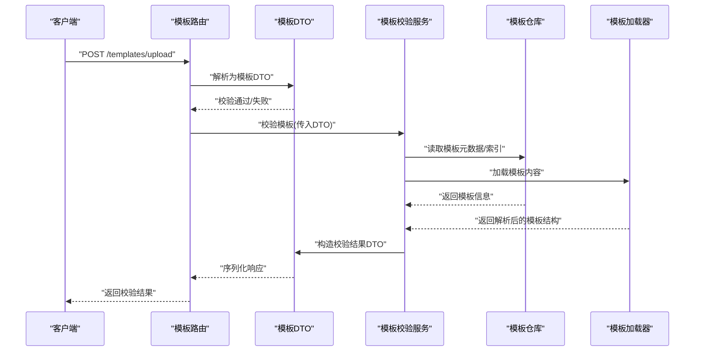
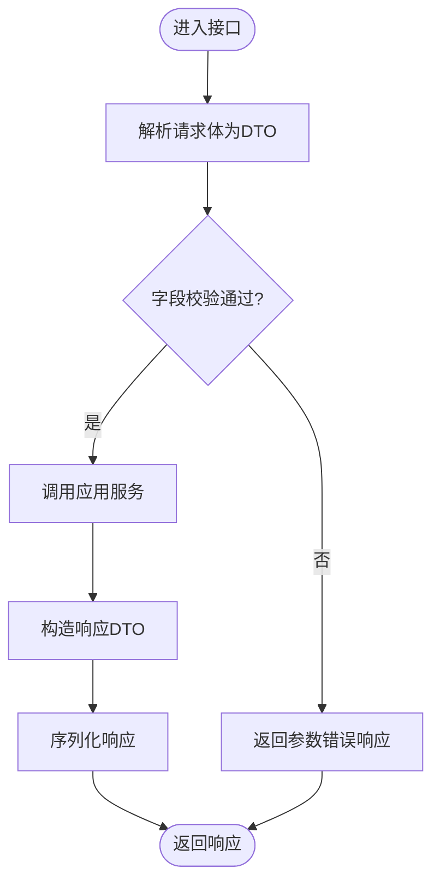
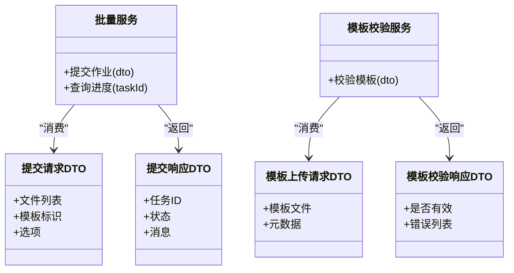
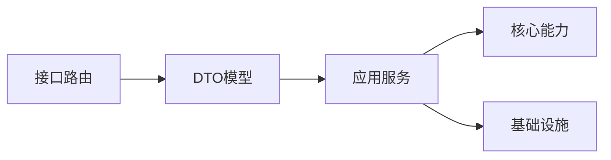

# 数据传输对象设计

<cite>
**本文引用的文件**   
- [src/paper_format_corrector/application/dto/__init__.py](file://src/paper_format_corrector/application/dto/__init__.py)
- [src/paper_format_corrector/application/services/batch_service.py](file://src/paper_format_corrector/application/services/batch_service.py)
- [src/paper_format_corrector/application/services/report_service.py](file://src/paper_format_corrector/application/services/report_service.py)
- [src/paper_format_corrector/application/services/style_workbench.py](file://src/paper_format_corrector/application/services/style_workbench.py)
- [src/paper_format_corrector/application/services/template_validation.py](file://src/paper_format_corrector/application/services/template_validation.py)
- [src/paper_format_corrector/application/services/template_validation_service.py](file://src/paper_format_corrector/application/services/template_validation_service.py)
- [src/paper_format_corrector/application/services/university_template_import_service.py](file://src/paper_format_corrector/application/services/university_template_import_service.py)
- [src/paper_format_corrector/interfaces/api/routes/submit_route.py](file://src/paper_format_corrector/interfaces/api/routes/submit_route.py)
- [src/paper_format_corrector/interfaces/api/routes/template_routes.py](file://src/paper_format_corrector/interfaces/api/routes/template_routes.py)
- [src/paper_format_corrector/interfaces/api/app.py](file://src/paper_format_corrector/interfaces/api/app.py)
- [src/paper_format_corrector/core/format_corrector.py](file://src/paper_format_corrector/core/format_corrector.py)
- [src/paper_format_corrector/infra/template_repository.py](file://src/paper_format_corrector/infra/template_repository.py)
- [src/paper_format_corrector/infra/doc_template_loader.py](file://src/paper_format_corrector/infra/doc_template_loader.py)
- [src/paper_format_corrector/shared/utils/validation.py](file://src/paper_format_corrector/shared/utils/validation.py)
</cite>

## 目录
1. [简介](#简介)
2. [项目结构](#项目结构)
3. [核心组件](#核心组件)
4. [架构总览](#架构总览)
5. [详细组件分析](#详细组件分析)
6. [依赖关系分析](#依赖关系分析)
7. [性能考虑](#性能考虑)
8. [故障排查指南](#故障排查指南)
9. [结论](#结论)
10. [附录](#附录)

## 简介
本文件聚焦于应用层的数据传输对象（DTO）设计，围绕请求与响应模型、参数验证规则与序列化策略展开，说明如何通过DTO实现服务间的松耦合通信，保证数据一致性与安全性。文档同时给出基于仓库实际代码的示例路径，帮助读者快速定位并理解DTO在系统中的使用方式。

## 项目结构
本项目采用分层架构：接口层负责HTTP路由与入参解析；应用层通过DTO承载跨层数据；领域与基础设施层处理具体业务与持久化。DTO主要集中于应用层的dto包中，并在服务与API路由之间作为契约载体。

图表来源
- [src/paper_format_corrector/interfaces/api/app.py](file://src/paper_format_corrector/interfaces/api/app.py)
- [src/paper_format_corrector/interfaces/api/routes/submit_route.py](file://src/paper_format_corrector/interfaces/api/routes/submit_route.py)
- [src/paper_format_corrector/interfaces/api/routes/template_routes.py](file://src/paper_format_corrector/interfaces/api/routes/template_routes.py)
- [src/paper_format_corrector/application/dto/__init__.py](file://src/paper_format_corrector/application/dto/__init__.py)
- [src/paper_format_corrector/application/services/batch_service.py](file://src/paper_format_corrector/application/services/batch_service.py)
- [src/paper_format_corrector/application/services/report_service.py](file://src/paper_format_corrector/application/services/report_service.py)
- [src/paper_format_corrector/application/services/style_workbench.py](file://src/paper_format_corrector/application/services/style_workbench.py)
- [src/paper_format_corrector/application/services/template_validation_service.py](file://src/paper_format_corrector/application/services/template_validation_service.py)
- [src/paper_format_corrector/application/services/university_template_import_service.py](file://src/paper_format_corrector/application/services/university_template_import_service.py)
- [src/paper_format_corrector/core/format_corrector.py](file://src/paper_format_corrector/core/format_corrector.py)
- [src/paper_format_corrector/infra/template_repository.py](file://src/paper_format_corrector/infra/template_repository.py)
- [src/paper_format_corrector/infra/doc_template_loader.py](file://src/paper_format_corrector/infra/doc_template_loader.py)

章节来源
- [src/paper_format_corrector/interfaces/api/app.py](file://src/paper_format_corrector/interfaces/api/app.py)
- [src/paper_format_corrector/interfaces/api/routes/submit_route.py](file://src/paper_format_corrector/interfaces/api/routes/submit_route.py)
- [src/paper_format_corrector/interfaces/api/routes/template_routes.py](file://src/paper_format_corrector/interfaces/api/routes/template_routes.py)
- [src/paper_format_corrector/application/dto/__init__.py](file://src/paper_format_corrector/application/dto/__init__.py)

## 核心组件
- 数据传输对象（DTO）
  - 职责：定义应用层对外暴露的请求与响应结构，统一字段命名、类型与约束，屏蔽底层实现细节。
  - 位置：application/dto 包集中管理，便于复用与版本演进。
- 应用服务
  - 职责：消费DTO进行编排与协调，调用核心能力与基础设施，返回结果DTO。
  - 关键服务：批量处理、报告生成、样式工作台、模板校验与导入等。
- 接口路由
  - 职责：将HTTP请求转换为DTO，调用应用服务，再将结果DTO序列化为HTTP响应。

章节来源
- [src/paper_format_corrector/application/dto/__init__.py](file://src/paper_format_corrector/application/dto/__init__.py)
- [src/paper_format_corrector/application/services/batch_service.py](file://src/paper_format_corrector/application/services/batch_service.py)
- [src/paper_format_corrector/application/services/report_service.py](file://src/paper_format_corrector/application/services/report_service.py)
- [src/paper_format_corrector/application/services/style_workbench.py](file://src/paper_format_corrector/application/services/style_workbench.py)
- [src/paper_format_corrector/application/services/template_validation_service.py](file://src/paper_format_corrector/application/services/template_validation_service.py)
- [src/paper_format_corrector/application/services/university_template_import_service.py](file://src/paper_format_corrector/application/services/university_template_import_service.py)

## 架构总览
下图展示了从HTTP入口到应用服务再到核心与基础设施的完整数据流，强调DTO在各层之间的传递与转换。

图表来源
- [src/paper_format_corrector/interfaces/api/routes/submit_route.py](file://src/paper_format_corrector/interfaces/api/routes/submit_route.py)
- [src/paper_format_corrector/interfaces/api/routes/template_routes.py](file://src/paper_format_corrector/interfaces/api/routes/template_routes.py)
- [src/paper_format_corrector/application/dto/__init__.py](file://src/paper_format_corrector/application/dto/__init__.py)
- [src/paper_format_corrector/application/services/batch_service.py](file://src/paper_format_corrector/application/services/batch_service.py)
- [src/paper_format_corrector/application/services/template_validation_service.py](file://src/paper_format_corrector/application/services/template_validation_service.py)
- [src/paper_format_corrector/core/format_corrector.py](file://src/paper_format_corrector/core/format_corrector.py)
- [src/paper_format_corrector/infra/template_repository.py](file://src/paper_format_corrector/infra/template_repository.py)
- [src/paper_format_corrector/infra/doc_template_loader.py](file://src/paper_format_corrector/infra/doc_template_loader.py)

## 详细组件分析

### 提交作业流程（提交路由 → 应用服务 → 核心）
该流程演示了“提交作业”的典型链路：路由接收请求，转换为DTO，交由应用服务编排，最终由核心完成格式矫正并返回结果。

图表来源
- [src/paper_format_corrector/interfaces/api/routes/submit_route.py](file://src/paper_format_corrector/interfaces/api/routes/submit_route.py)
- [src/paper_format_corrector/application/dto/__init__.py](file://src/paper_format_corrector/application/dto/__init__.py)
- [src/paper_format_corrector/application/services/batch_service.py](file://src/paper_format_corrector/application/services/batch_service.py)
- [src/paper_format_corrector/core/format_corrector.py](file://src/paper_format_corrector/core/format_corrector.py)

章节来源
- [src/paper_format_corrector/interfaces/api/routes/submit_route.py](file://src/paper_format_corrector/interfaces/api/routes/submit_route.py)
- [src/paper_format_corrector/application/services/batch_service.py](file://src/paper_format_corrector/application/services/batch_service.py)
- [src/paper_format_corrector/core/format_corrector.py](file://src/paper_format_corrector/core/format_corrector.py)

### 模板校验流程（模板路由 → 模板校验服务 → 模板仓库/加载器）
该流程展示模板上传与校验的端到端过程，强调DTO在路由与服务之间的契约作用。

图表来源
- [src/paper_format_corrector/interfaces/api/routes/template_routes.py](file://src/paper_format_corrector/interfaces/api/routes/template_routes.py)
- [src/paper_format_corrector/application/dto/__init__.py](file://src/paper_format_corrector/application/dto/__init__.py)
- [src/paper_format_corrector/application/services/template_validation_service.py](file://src/paper_format_corrector/application/services/template_validation_service.py)
- [src/paper_format_corrector/infra/template_repository.py](file://src/paper_format_corrector/infra/template_repository.py)
- [src/paper_format_corrector/infra/doc_template_loader.py](file://src/paper_format_corrector/infra/doc_template_loader.py)

章节来源
- [src/paper_format_corrector/interfaces/api/routes/template_routes.py](file://src/paper_format_corrector/interfaces/api/routes/template_routes.py)
- [src/paper_format_corrector/application/services/template_validation_service.py](file://src/paper_format_corrector/application/services/template_validation_service.py)
- [src/paper_format_corrector/infra/template_repository.py](file://src/paper_format_corrector/infra/template_repository.py)
- [src/paper_format_corrector/infra/doc_template_loader.py](file://src/paper_format_corrector/infra/doc_template_loader.py)

### 数据验证流程图（通用）
以下流程图总结了DTO层面的输入校验与错误返回策略，适用于大多数接口场景。

章节来源
- [src/paper_format_corrector/shared/utils/validation.py](file://src/paper_format_corrector/shared/utils/validation.py)

### 面向对象视角：DTO与服务类关系
下图以类图形式展示DTO与服务类的协作关系，体现“服务消费DTO、返回DTO”的松耦合模式。

图表来源
- [src/paper_format_corrector/application/dto/__init__.py](file://src/paper_format_corrector/application/dto/__init__.py)
- [src/paper_format_corrector/application/services/batch_service.py](file://src/paper_format_corrector/application/services/batch_service.py)
- [src/paper_format_corrector/application/services/template_validation_service.py](file://src/paper_format_corrector/application/services/template_validation_service.py)

章节来源
- [src/paper_format_corrector/application/dto/__init__.py](file://src/paper_format_corrector/application/dto/__init__.py)
- [src/paper_format_corrector/application/services/batch_service.py](file://src/paper_format_corrector/application/services/batch_service.py)
- [src/paper_format_corrector/application/services/template_validation_service.py](file://src/paper_format_corrector/application/services/template_validation_service.py)

## 依赖关系分析
- 接口层依赖应用层DTO，避免直接访问领域实体或基础设施类型。
- 应用服务依赖DTO与核心/基础设施，保持高内聚低耦合。
- 基础设施提供模板仓库与加载器，被应用服务按需调用。

图表来源
- [src/paper_format_corrector/interfaces/api/app.py](file://src/paper_format_corrector/interfaces/api/app.py)
- [src/paper_format_corrector/application/dto/__init__.py](file://src/paper_format_corrector/application/dto/__init__.py)
- [src/paper_format_corrector/core/format_corrector.py](file://src/paper_format_corrector/core/format_corrector.py)
- [src/paper_format_corrector/infra/template_repository.py](file://src/paper_format_corrector/infra/template_repository.py)

章节来源
- [src/paper_format_corrector/interfaces/api/app.py](file://src/paper_format_corrector/interfaces/api/app.py)
- [src/paper_format_corrector/application/dto/__init__.py](file://src/paper_format_corrector/application/dto/__init__.py)
- [src/paper_format_corrector/core/format_corrector.py](file://src/paper_format_corrector/core/format_corrector.py)
- [src/paper_format_corrector/infra/template_repository.py](file://src/paper_format_corrector/infra/template_repository.py)

## 性能考虑
- 大文件上传：建议分块上传与异步处理，减少阻塞时间。
- 模板缓存：对常用模板进行内存或磁盘缓存，降低重复加载开销。
- 批量处理：采用队列与并发控制，避免一次性创建过多任务导致资源耗尽。
- 序列化优化：仅返回必要字段，避免冗余数据在网络中传输。

[本节为通用指导，不直接分析具体文件]

## 故障排查指南
- 参数校验失败
  - 现象：接口返回参数错误。
  - 排查：检查DTO字段必填性、类型与范围约束；确认前端传参与后端DTO定义一致。
  - 参考：shared/utils/validation 中的校验工具。
- 模板校验异常
  - 现象：模板上传后校验失败。
  - 排查：核对模板结构与schema；查看模板仓库索引与加载器日志。
- 提交作业无响应
  - 现象：提交后长时间无结果。
  - 排查：检查任务队列与worker状态；确认核心处理逻辑未抛出异常。

章节来源
- [src/paper_format_corrector/shared/utils/validation.py](file://src/paper_format_corrector/shared/utils/validation.py)
- [src/paper_format_corrector/application/services/template_validation_service.py](file://src/paper_format_corrector/application/services/template_validation_service.py)
- [src/paper_format_corrector/infra/template_repository.py](file://src/paper_format_corrector/infra/template_repository.py)
- [src/paper_format_corrector/infra/doc_template_loader.py](file://src/paper_format_corrector/infra/doc_template_loader.py)

## 结论
通过统一的DTO设计与严格的参数校验，系统在接口层与应用层之间建立了清晰的契约，实现了服务间的松耦合通信。结合合理的序列化策略与错误处理机制，保证了数据的一致性与安全性。建议在后续迭代中持续完善DTO版本管理与兼容性策略，确保API稳定演进。

[本节为总结性内容，不直接分析具体文件]

## 附录
- 示例路径（用于快速定位代码）
  - 提交作业DTO与使用：参见提交路由与批量服务
    - [提交路由](file://src/paper_format_corrector/interfaces/api/routes/submit_route.py)
    - [批量服务](file://src/paper_format_corrector/application/services/batch_service.py)
  - 模板校验DTO与使用：参见模板路由与模板校验服务
    - [模板路由](file://src/paper_format_corrector/interfaces/api/routes/template_routes.py)
    - [模板校验服务](file://src/paper_format_corrector/application/services/template_validation_service.py)
  - DTO集中定义：参见应用层DTO包
    - [DTO定义](file://src/paper_format_corrector/application/dto/__init__.py)
  - 核心能力与基础设施：参见核心与模板相关模块
    - [格式矫正核心](file://src/paper_format_corrector/core/format_corrector.py)
    - [模板仓库](file://src/paper_format_corrector/infra/template_repository.py)
    - [模板加载器](file://src/paper_format_corrector/infra/doc_template_loader.py)
  - 通用校验工具：参见共享工具
    - [校验工具](file://src/paper_format_corrector/shared/utils/validation.py)