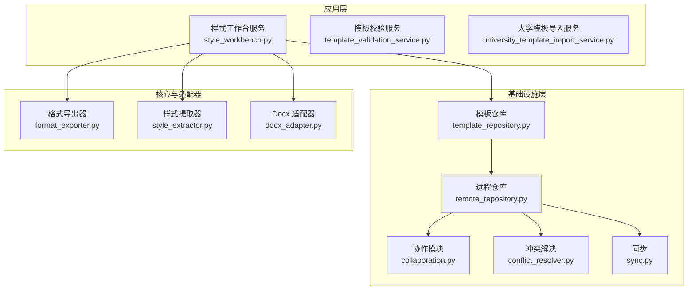
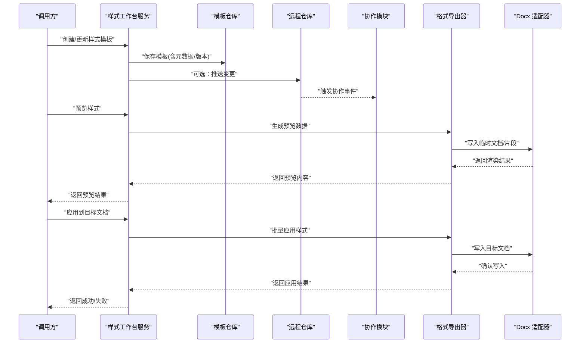
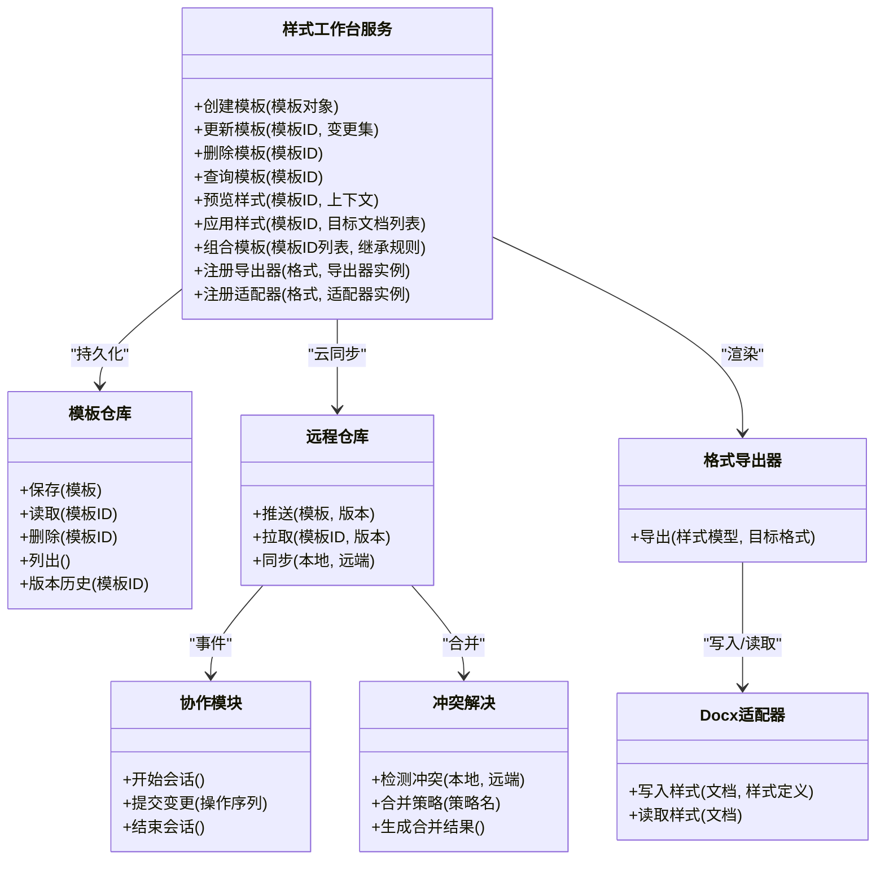
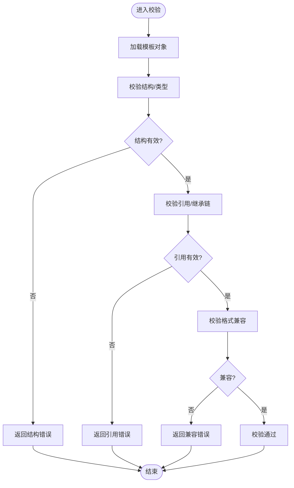
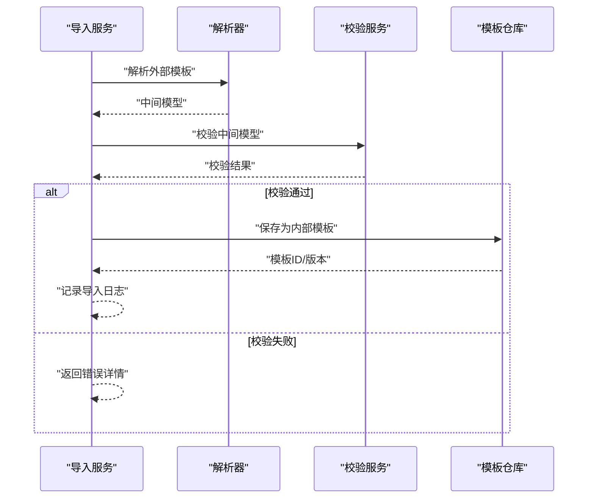
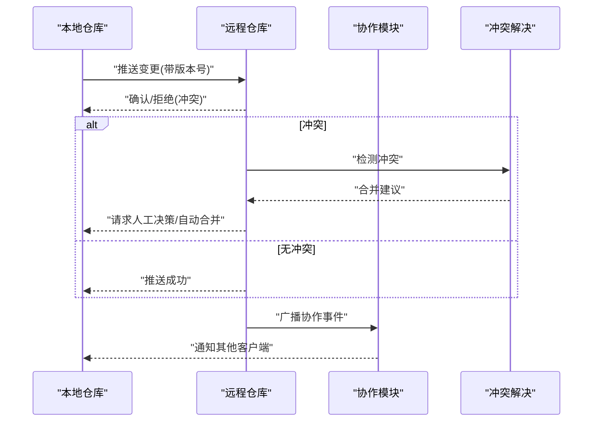
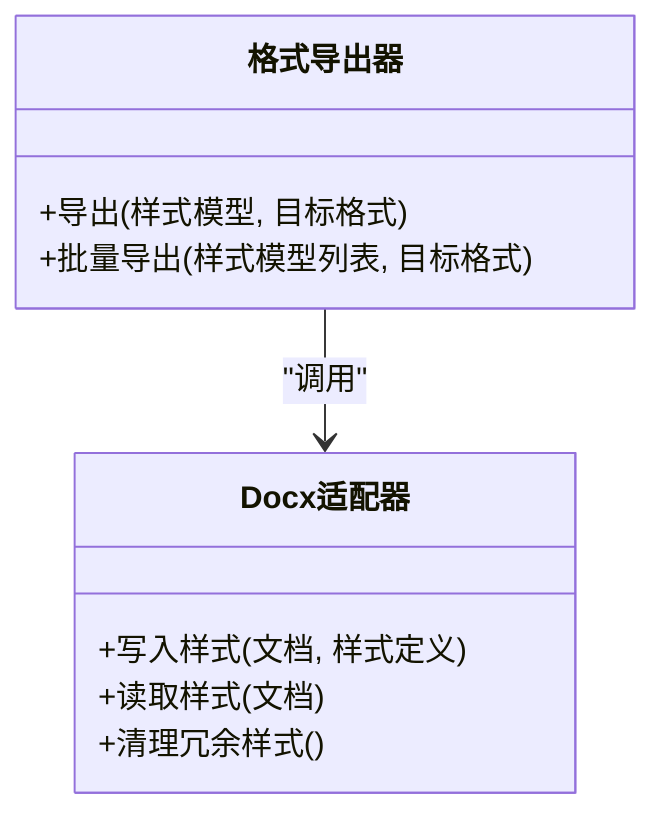
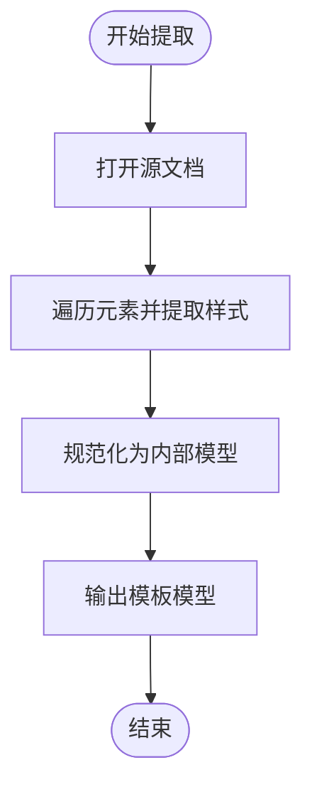
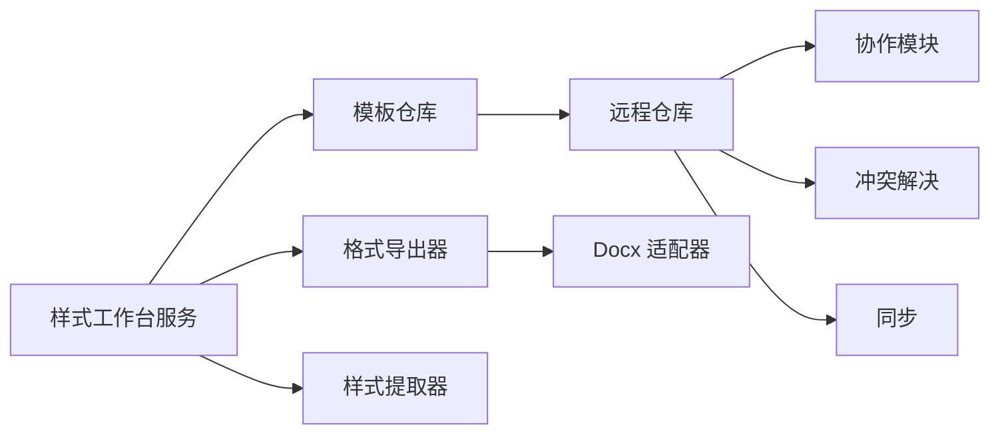

# 样式工作台服务

<cite>
**本文引用的文件**   
- [style_workbench.py](file://src/paper_format_corrector/application/services/style_workbench.py)
- [template_validation_service.py](file://src/paper_format_corrector/application/services/template_validation_service.py)
- [university_template_import_service.py](file://src/paper_format_corrector/application/services/university_template_import_service.py)
- [template_repository.py](file://src/paper_format_corrector/infra/template_repository.py)
- [remote_repository.py](file://src/paper_format_corrector/infra/remote/remote_repository.py)
- [collaboration.py](file://src/paper_format_corrector/infra/remote/collaboration.py)
- [conflict_resolver.py](file://src/paper_format_corrector/infra/remote/conflict_resolver.py)
- [sync.py](file://src/paper_format_corrector/infra/remote/sync.py)
- [docx_adapter.py](file://src/paper_format_corrector/infrastructure/adapters/docx_adapter.py)
- [format_exporter.py](file://src/paper_format_corrector/core/format_exporter.py)
- [style_extractor.py](file://src/paper_format_corrector/core/style_extractor.py)
- [test_style_workbench.py](file://tests/test_style_workbench.py)
- [test_collaborative_templates.py](file://tests/test_collaborative_templates.py)
</cite>

## 目录
1. [简介](#简介)
2. [项目结构](#项目结构)
3. [核心组件](#核心组件)
4. [架构总览](#架构总览)
5. [详细组件分析](#详细组件分析)
6. [依赖关系分析](#依赖关系分析)
7. [性能考虑](#性能考虑)
8. [故障排查指南](#故障排查指南)
9. [结论](#结论)
10. [附录](#附录)

## 简介
本文件面向“样式工作台服务”，聚焦于样式编辑与管理的业务逻辑，覆盖以下能力：
- 样式模板的创建、修改、预览与应用
- 用户自定义格式样式的扩展机制
- 样式组合与继承机制
- 动态加载、实时预览与批量应用
- 样式版本控制与协作编辑

该服务位于应用层，向上暴露统一接口，向下通过基础设施适配不同文档格式（如 docx）与远程仓库，实现跨平台、可扩展的样式工作流。

## 项目结构
样式工作台服务在应用层集中管理样式生命周期，并通过基础设施层对接持久化与远端协作。关键路径如下：
- 应用服务：样式工作台、模板校验、大学模板导入等
- 基础设施：模板仓库、远程仓库、协作与冲突解决、同步
- 核心工具：导出器、样式提取器
- 适配器：docx 适配器用于读写具体文档格式中的样式定义

图表来源
- [style_workbench.py](file://src/paper_format_corrector/application/services/style_workbench.py)
- [template_repository.py](file://src/paper_format_corrector/infra/template_repository.py)
- [remote_repository.py](file://src/paper_format_corrector/infra/remote/remote_repository.py)
- [collaboration.py](file://src/paper_format_corrector/infra/remote/collaboration.py)
- [conflict_resolver.py](file://src/paper_format_corrector/infra/remote/conflict_resolver.py)
- [sync.py](file://src/paper_format_corrector/infra/remote/sync.py)
- [format_exporter.py](file://src/paper_format_corrector/core/format_exporter.py)
- [style_extractor.py](file://src/paper_format_corrector/core/style_extractor.py)
- [docx_adapter.py](file://src/paper_format_corrector/infrastructure/adapters/docx_adapter.py)

章节来源
- [style_workbench.py](file://src/paper_format_corrector/application/services/style_workbench.py)
- [template_repository.py](file://src/paper_format_corrector/infra/template_repository.py)
- [remote_repository.py](file://src/paper_format_corrector/infra/remote/remote_repository.py)
- [collaboration.py](file://src/paper_format_corrector/infra/remote/collaboration.py)
- [conflict_resolver.py](file://src/paper_format_corrector/infra/remote/conflict_resolver.py)
- [sync.py](file://src/paper_format_corrector/infra/remote/sync.py)
- [format_exporter.py](file://src/paper_format_corrector/core/format_exporter.py)
- [style_extractor.py](file://src/paper_format_corrector/core/style_extractor.py)
- [docx_adapter.py](file://src/paper_format_corrector/infrastructure/adapters/docx_adapter.py)

## 核心组件
- 样式工作台服务：提供样式模板的创建、更新、预览、应用、组合与继承的统一入口；协调导出器、提取器与适配器完成渲染与落盘。
- 模板校验服务：对样式模板进行结构与语义校验，确保可安全应用。
- 大学模板导入服务：将外部模板（例如高校规范）转换为内部样式模型并入库。
- 模板仓库：本地持久化样式模板，支持查询、保存、删除与版本记录。
- 远程仓库与协作：提供云端存储、变更推送、拉取与合并；协作模块负责会话与操作事件；冲突解决模块处理并发修改冲突。
- 格式导出器与样式提取器：将样式模型导出为具体格式（如 docx），或从现有文档中提取样式以生成模板。
- Docx 适配器：封装对 docx 文档中样式定义的读写细节，屏蔽底层差异。

章节来源
- [style_workbench.py](file://src/paper_format_corrector/application/services/style_workbench.py)
- [template_validation_service.py](file://src/paper_format_corrector/application/services/template_validation_service.py)
- [university_template_import_service.py](file://src/paper_format_corrector/application/services/university_template_import_service.py)
- [template_repository.py](file://src/paper_format_corrector/infra/template_repository.py)
- [remote_repository.py](file://src/paper_format_corrector/infra/remote/remote_repository.py)
- [collaboration.py](file://src/paper_format_corrector/infra/remote/collaboration.py)
- [conflict_resolver.py](file://src/paper_format_corrector/infra/remote/conflict_resolver.py)
- [sync.py](file://src/paper_format_corrector/infra/remote/sync.py)
- [format_exporter.py](file://src/paper_format_corrector/core/format_exporter.py)
- [style_extractor.py](file://src/paper_format_corrector/core/style_extractor.py)
- [docx_adapter.py](file://src/paper_format_corrector/infrastructure/adapters/docx_adapter.py)

## 架构总览
样式工作台采用分层架构：应用层编排业务流程，基础设施层提供数据与协作能力，核心与适配器层负责格式转换与具体实现。

图表来源
- [style_workbench.py](file://src/paper_format_corrector/application/services/style_workbench.py)
- [template_repository.py](file://src/paper_format_corrector/infra/template_repository.py)
- [remote_repository.py](file://src/paper_format_corrector/infra/remote/remote_repository.py)
- [collaboration.py](file://src/paper_format_corrector/infra/remote/collaboration.py)
- [format_exporter.py](file://src/paper_format_corrector/core/format_exporter.py)
- [docx_adapter.py](file://src/paper_format_corrector/infrastructure/adapters/docx_adapter.py)

## 详细组件分析

### 样式工作台服务
职责与流程
- 模板生命周期管理：创建、更新、删除、查询、版本切换
- 预览：基于当前样式模型生成预览输出（文本/片段/缩略图）
- 应用：将样式应用到目标文档，支持批量应用
- 组合与继承：支持多模板组合与继承链解析，最终合并为单一应用视图
- 自定义格式扩展：通过注册新的导出器/适配器，支持新格式
- 协作与版本：与远程仓库和协作模块交互，记录变更与冲突

图表来源
- [style_workbench.py](file://src/paper_format_corrector/application/services/style_workbench.py)
- [template_repository.py](file://src/paper_format_corrector/infra/template_repository.py)
- [remote_repository.py](file://src/paper_format_corrector/infra/remote/remote_repository.py)
- [collaboration.py](file://src/paper_format_corrector/infra/remote/collaboration.py)
- [conflict_resolver.py](file://src/paper_format_corrector/infra/remote/conflict_resolver.py)
- [format_exporter.py](file://src/paper_format_corrector/core/format_exporter.py)
- [docx_adapter.py](file://src/paper_format_corrector/infrastructure/adapters/docx_adapter.py)

章节来源
- [style_workbench.py](file://src/paper_format_corrector/application/services/style_workbench.py)

### 模板校验服务
职责
- 校验模板结构完整性（必填字段、类型约束）
- 校验样式引用一致性（避免循环引用、未定义基类）
- 校验兼容性（目标格式支持度）
- 返回结构化错误信息，便于前端提示

图表来源
- [template_validation_service.py](file://src/paper_format_corrector/application/services/template_validation_service.py)

章节来源
- [template_validation_service.py](file://src/paper_format_corrector/application/services/template_validation_service.py)

### 大学模板导入服务
职责
- 解析外部模板（例如高校规范）
- 映射到内部样式模型
- 执行校验与入库
- 提供增量导入与回滚能力

图表来源
- [university_template_import_service.py](file://src/paper_format_corrector/application/services/university_template_import_service.py)
- [template_validation_service.py](file://src/paper_format_corrector/application/services/template_validation_service.py)
- [template_repository.py](file://src/paper_format_corrector/infra/template_repository.py)

章节来源
- [university_template_import_service.py](file://src/paper_format_corrector/application/services/university_template_import_service.py)

### 远程仓库与协作
职责
- 模板的云端存储与版本管理
- 协作会话与变更事件广播
- 冲突检测与合并策略执行
- 增量同步与断点续传

图表来源
- [remote_repository.py](file://src/paper_format_corrector/infra/remote/remote_repository.py)
- [collaboration.py](file://src/paper_format_corrector/infra/remote/collaboration.py)
- [conflict_resolver.py](file://src/paper_format_corrector/infra/remote/conflict_resolver.py)
- [sync.py](file://src/paper_format_corrector/infra/remote/sync.py)

章节来源
- [remote_repository.py](file://src/paper_format_corrector/infra/remote/remote_repository.py)
- [collaboration.py](file://src/paper_format_corrector/infra/remote/collaboration.py)
- [conflict_resolver.py](file://src/paper_format_corrector/infra/remote/conflict_resolver.py)
- [sync.py](file://src/paper_format_corrector/infra/remote/sync.py)

### 格式导出器与 Docx 适配器
职责
- 导出器：将样式模型转换为具体格式的中间表示或直接写入目标格式
- Docx 适配器：封装对 docx 文档中样式定义的读写，包括段落、字符、表格等样式属性

图表来源
- [format_exporter.py](file://src/paper_format_corrector/core/format_exporter.py)
- [docx_adapter.py](file://src/paper_format_corrector/infrastructure/adapters/docx_adapter.py)

章节来源
- [format_exporter.py](file://src/paper_format_corrector/core/format_exporter.py)
- [docx_adapter.py](file://src/paper_format_corrector/infrastructure/adapters/docx_adapter.py)

### 样式提取器
职责
- 从现有文档中提取样式定义，生成可复用的样式模板
- 支持选择性提取（仅段落/字符/表格等）
- 输出标准化模型供导入服务使用

图表来源
- [style_extractor.py](file://src/paper_format_corrector/core/style_extractor.py)

章节来源
- [style_extractor.py](file://src/paper_format_corrector/core/style_extractor.py)

## 依赖关系分析
- 内聚性：样式工作台服务聚合了模板管理、预览、应用、组合与协作的高层流程，职责清晰
- 耦合性：通过接口与适配器降低与具体格式实现的耦合；通过仓库抽象降低与存储后端的耦合
- 外部依赖：远程仓库、协作与冲突解决模块提供分布式能力；Docx 适配器依赖具体文档库

图表来源
- [style_workbench.py](file://src/paper_format_corrector/application/services/style_workbench.py)
- [template_repository.py](file://src/paper_format_corrector/infra/template_repository.py)
- [remote_repository.py](file://src/paper_format_corrector/infra/remote/remote_repository.py)
- [collaboration.py](file://src/paper_format_corrector/infra/remote/collaboration.py)
- [conflict_resolver.py](file://src/paper_format_corrector/infra/remote/conflict_resolver.py)
- [sync.py](file://src/paper_format_corrector/infra/remote/sync.py)
- [format_exporter.py](file://src/paper_format_corrector/core/format_exporter.py)
- [style_extractor.py](file://src/paper_format_corrector/core/style_extractor.py)
- [docx_adapter.py](file://src/paper_format_corrector/infrastructure/adapters/docx_adapter.py)

章节来源
- [style_workbench.py](file://src/paper_format_corrector/application/services/style_workbench.py)
- [template_repository.py](file://src/paper_format_corrector/infra/template_repository.py)
- [remote_repository.py](file://src/paper_format_corrector/infra/remote/remote_repository.py)
- [collaboration.py](file://src/paper_format_corrector/infra/remote/collaboration.py)
- [conflict_resolver.py](file://src/paper_format_corrector/infra/remote/conflict_resolver.py)
- [sync.py](file://src/paper_format_corrector/infra/remote/sync.py)
- [format_exporter.py](file://src/paper_format_corrector/core/format_exporter.py)
- [style_extractor.py](file://src/paper_format_corrector/core/style_extractor.py)
- [docx_adapter.py](file://src/paper_format_corrector/infrastructure/adapters/docx_adapter.py)

## 性能考虑
- 批量应用优化：优先使用批量导出与写入接口，减少重复 I/O
- 预览缓存：对相同样式与上下文的预览结果进行缓存，提升响应速度
- 增量同步：利用远程仓库的版本与差异能力，仅传输变更
- 资源清理：在导出完成后及时释放临时文档与内存占用
- 并行处理：对独立文档的应用任务进行并发处理，注意线程安全与锁粒度

[本节为通用指导，不直接分析具体文件]

## 故障排查指南
常见问题与定位要点
- 模板校验失败：检查必填字段、类型约束与引用链是否完整
- 样式应用异常：确认目标格式适配器是否正确注册，目标文档是否受保护
- 远程同步失败：检查网络连通性与权限，查看冲突解决日志
- 协作冲突：根据冲突报告选择合适合并策略，必要时人工介入
- 预览不一致：核对导出器配置与目标格式特性差异

章节来源
- [test_style_workbench.py](file://tests/test_style_workbench.py)
- [test_collaborative_templates.py](file://tests/test_collaborative_templates.py)

## 结论
样式工作台服务通过分层架构与清晰的职责划分，实现了样式模板的全生命周期管理与跨格式应用。借助模板校验、导入、远程协作与冲突解决，系统具备高可用与可扩展能力。未来可在预览渲染、批量应用与协作体验方面进一步优化性能与用户体验。

[本节为总结性内容，不直接分析具体文件]

## 附录
- 示例参考（代码片段路径）
  - 动态加载样式：参见 [样式工作台服务](file://src/paper_format_corrector/application/services/style_workbench.py)
  - 实时预览流程：参见 [样式工作台服务](file://src/paper_format_corrector/application/services/style_workbench.py)、[格式导出器](file://src/paper_format_corrector/core/format_exporter.py)、[Docx 适配器](file://src/paper_format_corrector/infrastructure/adapters/docx_adapter.py)
  - 批量应用样式：参见 [样式工作台服务](file://src/paper_format_corrector/application/services/style_workbench.py)、[格式导出器](file://src/paper_format_corrector/core/format_exporter.py)
  - 版本控制与协作：参见 [远程仓库](file://src/paper_format_corrector/infra/remote/remote_repository.py)、[协作模块](file://src/paper_format_corrector/infra/remote/collaboration.py)、[冲突解决](file://src/paper_format_corrector/infra/remote/conflict_resolver.py)、[同步](file://src/paper_format_corrector/infra/remote/sync.py)