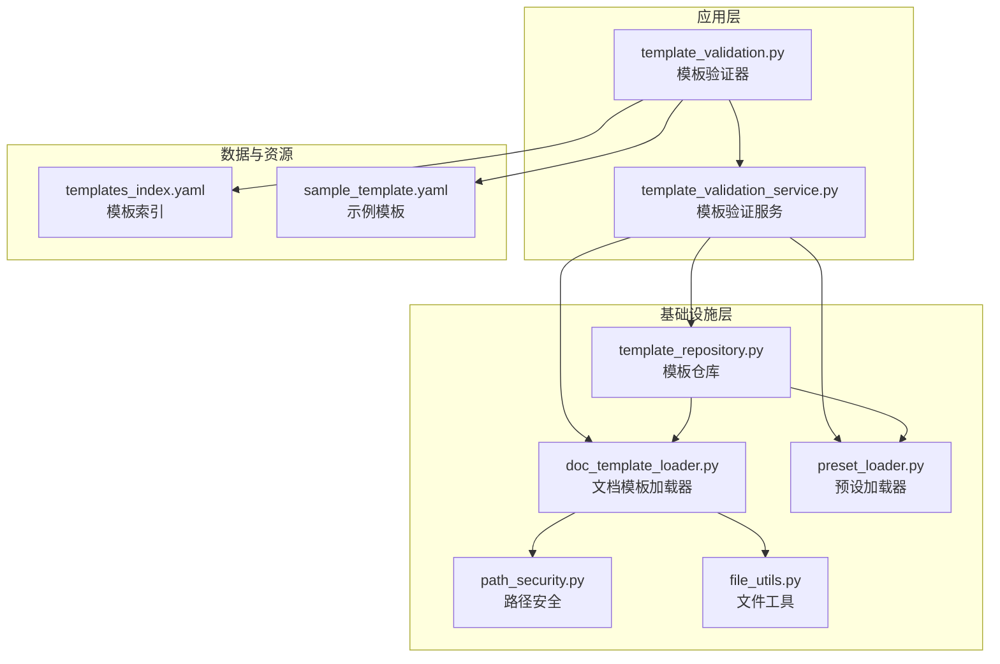
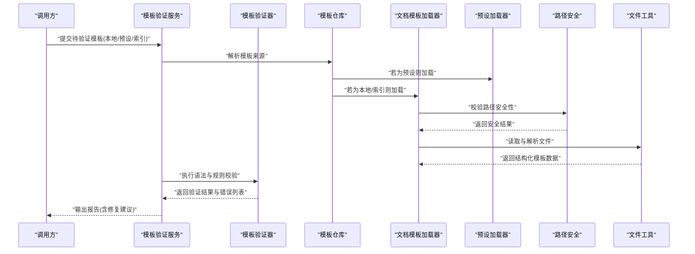
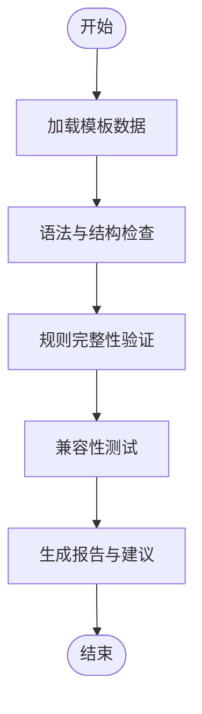
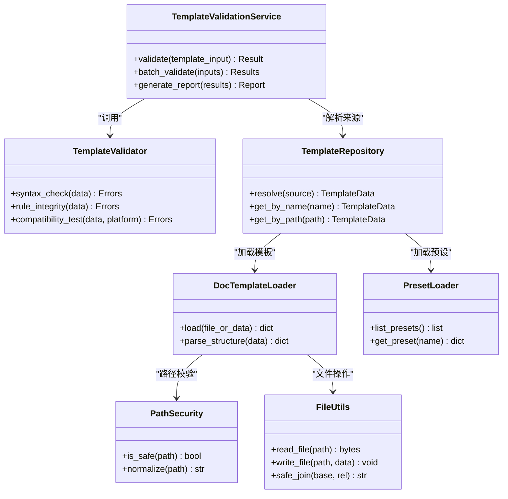
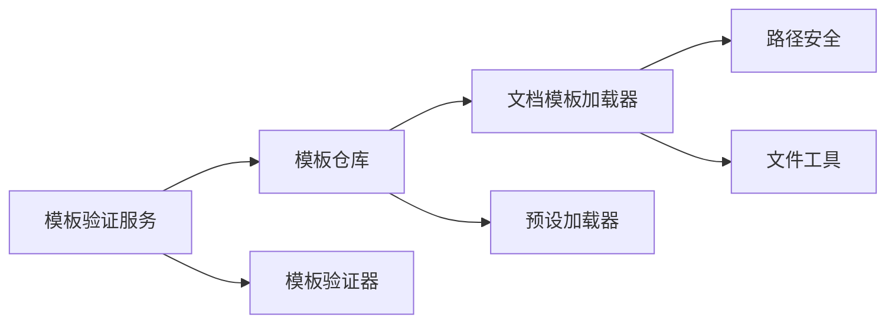

# 模板验证服务

<cite>
**本文引用的文件**   
- [src/paper_format_corrector/application/services/template_validation.py](file://src/paper_format_corrector/application/services/template_validation.py)
- [src/paper_format_corrector/application/services/template_validation_service.py](file://src/paper_format_corrector/application/services/template_validation_service.py)
- [src/paper_format_corrector/infra/template_repository.py](file://src/paper_format_corrector/infra/template_repository.py)
- [src/paper_format_corrector/infra/doc_template_loader.py](file://src/paper_format_corrector/infra/doc_template_loader.py)
- [src/paper_format_corrector/infra/preset_loader.py](file://src/paper_format_corrector/infra/preset_loader.py)
- [src/paper_format_corrector/infra/path_security.py](file://src/paper_format_corrector/infra/path_security.py)
- [src/paper_format_corrector/shared/utils/file_utils.py](file://src/paper_format_corrector/shared/utils/file_utils.py)
- [presets/templates_index.yaml](file://presets/templates_index.yaml)
- [examples/sample_template.yaml](file://examples/sample_template.yaml)
- [tests/test_template_validation_and_import.py](file://tests/test_template_validation_and_import.py)
</cite>

## 目录
1. [简介](#简介)
2. [项目结构](#项目结构)
3. [核心组件](#核心组件)
4. [架构总览](#架构总览)
5. [详细组件分析](#详细组件分析)
6. [依赖关系分析](#依赖关系分析)
7. [性能考虑](#性能考虑)
8. [故障排查指南](#故障排查指南)
9. [结论](#结论)
10. [附录](#附录)

## 简介
本文件面向“模板验证服务”，系统化说明模板配置文件的验证逻辑，包括语法检查、规则完整性验证与兼容性测试；解释如何对预设模板与自定义模板进行有效性校验，检测配置错误与潜在冲突；提供流程示例、错误报告生成与修复建议；并给出验证规则的扩展机制与自定义验证器的实现方法。文档力求在保持技术深度的同时，便于非专业读者理解。

## 项目结构
围绕模板验证的核心代码位于应用层服务与基础设施层之间：
- 应用层服务负责编排验证流程、聚合结果与错误报告
- 基础设施层负责模板加载、索引解析、路径安全与工具函数
- 预设模板与示例模板用于驱动验证与回归测试

图表来源
- [src/paper_format_corrector/application/services/template_validation.py](file://src/paper_format_corrector/application/services/template_validation.py)
- [src/paper_format_corrector/application/services/template_validation_service.py](file://src/paper_format_corrector/application/services/template_validation_service.py)
- [src/paper_format_corrector/infra/template_repository.py](file://src/paper_format_corrector/infra/template_repository.py)
- [src/paper_format_corrector/infra/doc_template_loader.py](file://src/paper_format_corrector/infra/doc_template_loader.py)
- [src/paper_format_corrector/infra/preset_loader.py](file://src/paper_format_corrector/infra/preset_loader.py)
- [src/paper_format_corrector/infra/path_security.py](file://src/paper_format_corrector/infra/path_security.py)
- [src/paper_format_corrector/shared/utils/file_utils.py](file://src/paper_format_corrector/shared/utils/file_utils.py)
- [presets/templates_index.yaml](file://presets/templates_index.yaml)
- [examples/sample_template.yaml](file://examples/sample_template.yaml)

章节来源
- [src/paper_format_corrector/application/services/template_validation.py](file://src/paper_format_corrector/application/services/template_validation.py)
- [src/paper_format_corrector/application/services/template_validation_service.py](file://src/paper_format_corrector/application/services/template_validation_service.py)
- [src/paper_format_corrector/infra/template_repository.py](file://src/paper_format_corrector/infra/template_repository.py)
- [src/paper_format_corrector/infra/doc_template_loader.py](file://src/paper_format_corrector/infra/doc_template_loader.py)
- [src/paper_format_corrector/infra/preset_loader.py](file://src/paper_format_corrector/infra/preset_loader.py)
- [src/paper_format_corrector/infra/path_security.py](file://src/paper_format_corrector/infra/path_security.py)
- [src/paper_format_corrector/shared/utils/file_utils.py](file://src/paper_format_corrector/shared/utils/file_utils.py)
- [presets/templates_index.yaml](file://presets/templates_index.yaml)
- [examples/sample_template.yaml](file://examples/sample_template.yaml)

## 核心组件
- 模板验证器（TemplateValidator）
  - 职责：执行单份模板配置的语法与结构校验、规则完整性检查、字段类型与取值范围校验、引用一致性检查等。
  - 输出：结构化验证结果（通过/失败）、错误列表、警告与建议。
- 模板验证服务（TemplateValidationService）
  - 职责：编排验证流程，支持批量验证、组合多源模板（本地、预设、远程），汇总错误与修复建议，生成可读报告。
  - 能力：兼容性与回归测试（基于索引与示例模板）、冲突检测（命名、样式、编号等）。
- 模板仓库（TemplateRepository）
  - 职责：统一访问模板来源（本地路径、预设集合、索引表），提供按名称或路径的模板解析与缓存。
- 文档模板加载器（DocTemplateLoader）
  - 职责：从YAML/JSON等格式加载模板，解析嵌套结构，进行基础类型校验与默认值填充。
- 预设加载器（PresetLoader）
  - 职责：读取内置预设模板与索引，提供快速定位与版本信息。
- 路径安全（PathSecurity）
  - 职责：防止路径遍历与非法访问，确保模板来源可信。
- 文件工具（FileUtils）
  - 职责：通用文件读写、编码处理、相对路径规范化等。

章节来源
- [src/paper_format_corrector/application/services/template_validation.py](file://src/paper_format_corrector/application/services/template_validation.py)
- [src/paper_format_corrector/application/services/template_validation_service.py](file://src/paper_format_corrector/application/services/template_validation_service.py)
- [src/paper_format_corrector/infra/template_repository.py](file://src/paper_format_corrector/infra/template_repository.py)
- [src/paper_format_corrector/infra/doc_template_loader.py](file://src/paper_format_corrector/infra/doc_template_loader.py)
- [src/paper_format_corrector/infra/preset_loader.py](file://src/paper_format_corrector/infra/preset_loader.py)
- [src/paper_format_corrector/infra/path_security.py](file://src/paper_format_corrector/infra/path_security.py)
- [src/paper_format_corrector/shared/utils/file_utils.py](file://src/paper_format_corrector/shared/utils/file_utils.py)

## 架构总览
模板验证服务采用分层设计：上层服务编排流程，下层提供数据与工具支撑。验证过程分为“语法检查”、“规则完整性验证”和“兼容性测试”三个阶段，最终产出标准化报告。

图表来源
- [src/paper_format_corrector/application/services/template_validation_service.py](file://src/paper_format_corrector/application/services/template_validation_service.py)
- [src/paper_format_corrector/application/services/template_validation.py](file://src/paper_format_corrector/application/services/template_validation.py)
- [src/paper_format_corrector/infra/template_repository.py](file://src/paper_format_corrector/infra/template_repository.py)
- [src/paper_format_corrector/infra/doc_template_loader.py](file://src/paper_format_corrector/infra/doc_template_loader.py)
- [src/paper_format_corrector/infra/preset_loader.py](file://src/paper_format_corrector/infra/preset_loader.py)
- [src/paper_format_corrector/infra/path_security.py](file://src/paper_format_corrector/infra/path_security.py)
- [src/paper_format_corrector/shared/utils/file_utils.py](file://src/paper_format_corrector/shared/utils/file_utils.py)

## 详细组件分析

### 模板验证器（TemplateValidator）
- 语法检查
  - 校验模板根节点与必需字段存在性
  - 校验字段类型（字符串、数值、布尔、数组、对象）与枚举取值
  - 校验必填项与可选项的组合约束
- 规则完整性验证
  - 检查段落、标题、页眉页脚、表格、图片、编号、样式等规则是否完整且互不矛盾
  - 检查跨段落的引用一致性（如编号前缀、样式名、占位符）
- 兼容性测试
  - 对比目标平台/版本的能力集，标记不可用特性
  - 基于索引与示例模板进行回归验证，确保行为稳定

图表来源
- [src/paper_format_corrector/application/services/template_validation.py](file://src/paper_format_corrector/application/services/template_validation.py)

章节来源
- [src/paper_format_corrector/application/services/template_validation.py](file://src/paper_format_corrector/application/services/template_validation.py)

### 模板验证服务（TemplateValidationService）
- 编排验证流程
  - 接收多种输入（本地文件、预设名称、索引条目）
  - 调用模板仓库获取模板数据
  - 触发验证器执行三阶段校验
- 错误聚合与修复建议
  - 将各阶段错误合并去重，标注严重级别
  - 根据错误类型生成修复建议（例如修正字段名、补充缺失规则、调整取值范围）
- 批量与并发
  - 支持批量模板验证，必要时并发执行以提升吞吐
- 报告输出
  - 结构化报告（JSON/文本），包含通过/失败状态、错误清单、警告与建议

图表来源
- [src/paper_format_corrector/application/services/template_validation_service.py](file://src/paper_format_corrector/application/services/template_validation_service.py)
- [src/paper_format_corrector/application/services/template_validation.py](file://src/paper_format_corrector/application/services/template_validation.py)
- [src/paper_format_corrector/infra/template_repository.py](file://src/paper_format_corrector/infra/template_repository.py)
- [src/paper_format_corrector/infra/doc_template_loader.py](file://src/paper_format_corrector/infra/doc_template_loader.py)
- [src/paper_format_corrector/infra/preset_loader.py](file://src/paper_format_corrector/infra/preset_loader.py)
- [src/paper_format_corrector/infra/path_security.py](file://src/paper_format_corrector/infra/path_security.py)
- [src/paper_format_corrector/shared/utils/file_utils.py](file://src/paper_format_corrector/shared/utils/file_utils.py)

章节来源
- [src/paper_format_corrector/application/services/template_validation_service.py](file://src/paper_format_corrector/application/services/template_validation_service.py)

### 模板仓库（TemplateRepository）
- 统一入口
  - 支持按名称（预设）、路径（本地文件）、索引（templates_index.yaml）解析模板
- 缓存策略
  - 对已加载的模板数据进行缓存，避免重复IO
- 冲突检测
  - 当多个来源定义相同键时，记录冲突并提供优先级策略（例如预设覆盖、用户覆盖）

章节来源
- [src/paper_format_corrector/infra/template_repository.py](file://src/paper_format_corrector/infra/template_repository.py)

### 文档模板加载器（DocTemplateLoader）
- 加载与解析
  - 支持YAML/JSON等格式，解析嵌套结构与默认值
- 基础校验
  - 类型检查、空值处理、路径规范化
- 安全控制
  - 结合路径安全模块，拒绝不安全路径

章节来源
- [src/paper_format_corrector/infra/doc_template_loader.py](file://src/paper_format_corrector/infra/doc_template_loader.py)
- [src/paper_format_corrector/infra/path_security.py](file://src/paper_format_corrector/infra/path_security.py)
- [src/paper_format_corrector/shared/utils/file_utils.py](file://src/paper_format_corrector/shared/utils/file_utils.py)

### 预设加载器（PresetLoader）
- 预设发现
  - 扫描内置预设目录，构建可用预设列表
- 索引集成
  - 读取模板索引，提供元数据（名称、版本、描述）
- 快速加载
  - 按名称直接加载对应预设模板

章节来源
- [src/paper_format_corrector/infra/preset_loader.py](file://src/paper_format_corrector/infra/preset_loader.py)
- [presets/templates_index.yaml](file://presets/templates_index.yaml)

### 示例模板与索引
- 示例模板
  - 提供最小可运行模板结构，便于验证流程演示与回归测试
- 模板索引
  - 集中管理预设模板的元数据与版本信息，便于批量验证与兼容性测试

章节来源
- [examples/sample_template.yaml](file://examples/sample_template.yaml)
- [presets/templates_index.yaml](file://presets/templates_index.yaml)

## 依赖关系分析
- 组件耦合
  - 服务层依赖仓库与加载器，验证器依赖数据结构与工具函数
  - 加载器依赖路径安全与文件工具，保证安全与健壮性
- 外部依赖
  - YAML/JSON解析库、文件系统API、日志与错误上报
- 循环依赖
  - 当前设计无循环依赖，服务层仅单向调用基础设施层

图表来源
- [src/paper_format_corrector/application/services/template_validation_service.py](file://src/paper_format_corrector/application/services/template_validation_service.py)
- [src/paper_format_corrector/application/services/template_validation.py](file://src/paper_format_corrector/application/services/template_validation.py)
- [src/paper_format_corrector/infra/template_repository.py](file://src/paper_format_corrector/infra/template_repository.py)
- [src/paper_format_corrector/infra/doc_template_loader.py](file://src/paper_format_corrector/infra/doc_template_loader.py)
- [src/paper_format_corrector/infra/preset_loader.py](file://src/paper_format_corrector/infra/preset_loader.py)
- [src/paper_format_corrector/infra/path_security.py](file://src/paper_format_corrector/infra/path_security.py)
- [src/paper_format_corrector/shared/utils/file_utils.py](file://src/paper_format_corrector/shared/utils/file_utils.py)

章节来源
- [src/paper_format_corrector/application/services/template_validation_service.py](file://src/paper_format_corrector/application/services/template_validation_service.py)
- [src/paper_format_corrector/infra/template_repository.py](file://src/paper_format_corrector/infra/template_repository.py)

## 性能考虑
- 缓存与复用
  - 模板数据与解析结果缓存，减少重复IO与解析开销
- 批量与并发
  - 批量验证时采用任务队列或线程池，提升吞吐
- I/O优化
  - 预读与流式解析大文件，避免一次性加载到内存
- 错误快速失败
  - 早期校验失败即停止后续昂贵步骤，降低整体耗时

[本节为通用指导，无需特定文件来源]

## 故障排查指南
- 常见错误类型
  - 语法错误：字段缺失、类型不符、枚举值无效
  - 规则冲突：同名样式/编号冲突、引用不一致
  - 路径问题：非法路径、权限不足、符号链接绕过
- 诊断步骤
  - 使用示例模板进行最小化复现
  - 查看验证报告中的错误清单与严重级别
  - 依据修复建议逐项修正，重新运行验证
- 参考用例
  - 单元测试覆盖典型错误场景与修复路径，便于对照排查

章节来源
- [tests/test_template_validation_and_import.py](file://tests/test_template_validation_and_import.py)

## 结论
模板验证服务通过分层设计与清晰的职责划分，实现了模板配置的全面校验与可操作的错误报告。其扩展机制允许新增验证规则与自定义验证器，满足多样化模板生态的需求。建议在持续集成中引入批量验证与回归测试，保障模板质量与兼容性。

[本节为总结性内容，无需特定文件来源]

## 附录

### 验证流程示例（以示例模板为例）
- 输入：示例模板文件
- 步骤：
  - 通过模板仓库解析模板来源
  - 文档模板加载器读取并解析结构
  - 模板验证器执行语法、规则完整性与兼容性测试
  - 模板验证服务聚合结果并生成报告
- 输出：结构化报告（通过/失败、错误清单、修复建议）

章节来源
- [examples/sample_template.yaml](file://examples/sample_template.yaml)
- [src/paper_format_corrector/application/services/template_validation_service.py](file://src/paper_format_corrector/application/services/template_validation_service.py)
- [src/paper_format_corrector/application/services/template_validation.py](file://src/paper_format_corrector/application/services/template_validation.py)

### 错误报告与修复建议
- 错误分类
  - 致命错误：阻止模板生效（如必填字段缺失）
  - 警告：可能影响效果（如样式名未使用）
- 修复建议
  - 针对每个错误提供具体修改指引（字段名、取值范围、引用修正）
  - 提供自动修复脚本或一键修复选项（可选）

章节来源
- [src/paper_format_corrector/application/services/template_validation_service.py](file://src/paper_format_corrector/application/services/template_validation_service.py)

### 验证规则扩展机制与自定义验证器
- 扩展点
  - 在验证器中注册新的规则检查函数
  - 在报告中增加新错误类型的映射与建议
- 自定义验证器
  - 实现统一的接口（输入模板数据，输出错误与建议）
  - 集成到服务层的验证流水线中
- 测试与回归
  - 为新规则编写用例，确保向后兼容

章节来源
- [src/paper_format_corrector/application/services/template_validation.py](file://src/paper_format_corrector/application/services/template_validation.py)
- [src/paper_format_corrector/application/services/template_validation_service.py](file://src/paper_format_corrector/application/services/template_validation_service.py)