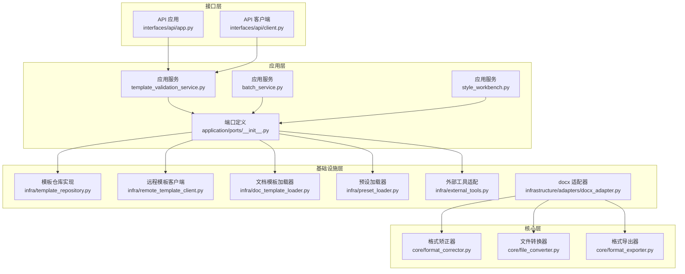
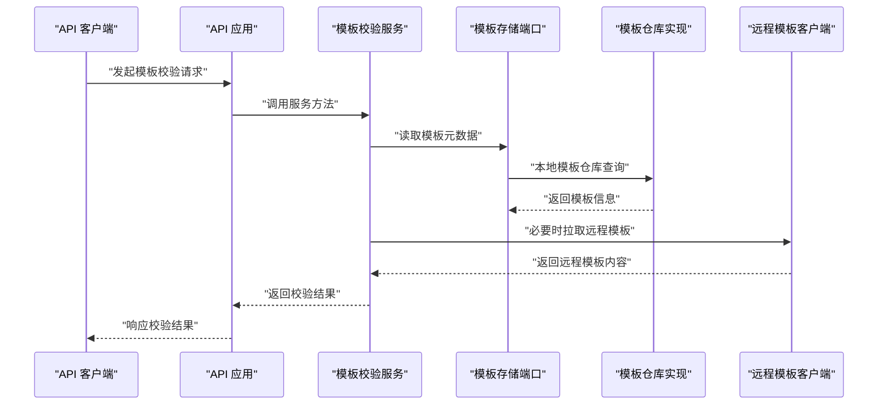
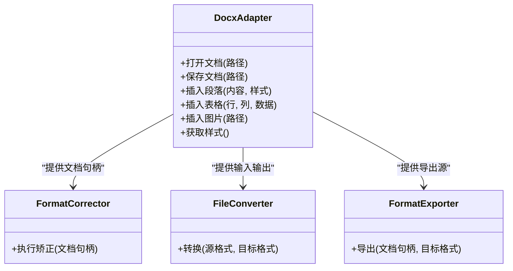
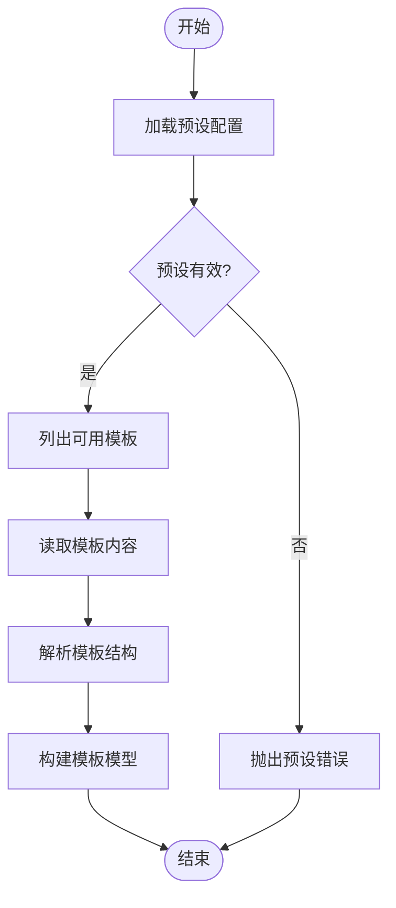
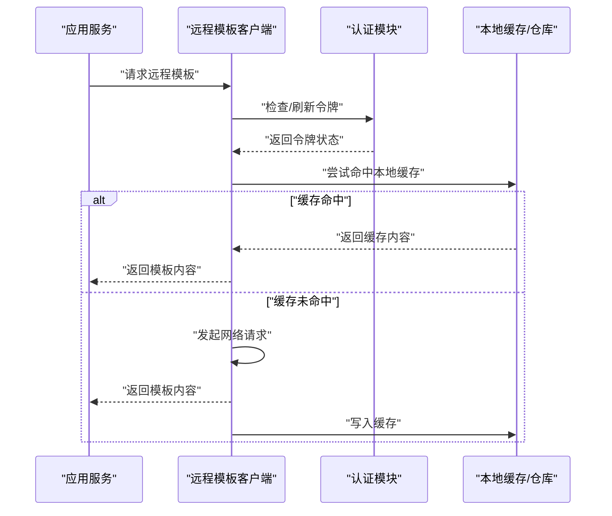
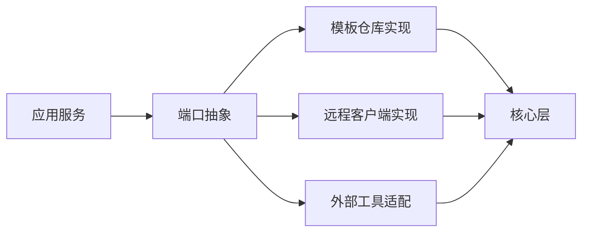

# 端口接口设计

<cite>
**本文引用的文件**   
- [src/paper_format_corrector/application/ports/__init__.py](file://src/paper_format_corrector/application/ports/__init__.py)
- [src/paper_format_corrector/application/services/template_validation_service.py](file://src/paper_format_corrector/application/services/template_validation_service.py)
- [src/paper_format_corrector/application/services/batch_service.py](file://src/paper_format_corrector/application/services/batch_service.py)
- [src/paper_format_corrector/application/services/style_workbench.py](file://src/paper_format_corrector/application/services/style_workbench.py)
- [src/paper_format_corrector/infra/template_repository.py](file://src/paper_format_corrector/infra/template_repository.py)
- [src/paper_format_corrector/infra/remote_template_client.py](file://src/paper_format_corrector/infra/remote_template_client.py)
- [src/paper_format_corrector/infra/doc_template_loader.py](file://src/paper_format_corrector/infra/doc_template_loader.py)
- [src/paper_format_corrector/infra/preset_loader.py](file://src/paper_format_corrector/infra/preset_loader.py)
- [src/paper_format_corrector/infra/external_tools.py](file://src/paper_format_corrector/infra/external_tools.py)
- [src/paper_format_corrector/core/format_corrector.py](file://src/paper_format_corrector/core/format_corrector.py)
- [src/paper_format_corrector/core/file_converter.py](file://src/paper_format_corrector/core/file_converter.py)
- [src/paper_format_corrector/core/format_exporter.py](file://src/paper_format_corrector/core/format_exporter.py)
- [src/paper_format_corrector/infrastructure/adapters/docx_adapter.py](file://src/paper_format_corrector/infrastructure/adapters/docx_adapter.py)
- [src/paper_format_corrector/infrastructure/converters/file_converter.py](file://src/paper_format_corrector/infrastructure/converters/file_converter.py)
- [src/paper_format_corrector/infrastructure/exporters/format_exporter.py](file://src/paper_format_corrector/infrastructure/exporters/format_exporter.py)
- [src/paper_format_corrector/interfaces/api/app.py](file://src/paper_format_corrector/interfaces/api/app.py)
- [src/paper_format_corrector/interfaces/api/client.py](file://src/paper_format_corrector/interfaces/api/client.py)
- [src/paper_format_corrector/shared/utils/logger.py](file://src/paper_format_corrector/shared/utils/logger.py)
</cite>

## 目录
1. [简介](#简介)
2. [项目结构](#项目结构)
3. [核心组件](#核心组件)
4. [架构总览](#架构总览)
5. [详细组件分析](#详细组件分析)
6. [依赖分析](#依赖分析)
7. [性能考虑](#性能考虑)
8. [故障排查指南](#故障排查指南)
9. [结论](#结论)
10. [附录](#附录)

## 简介
本文件围绕“端口接口设计”展开，聚焦应用层对基础设施与外部系统的抽象（即“端口”），并通过适配器模式实现解耦。文档将：
- 定义并解释三类关键端口：外部系统适配器接口、存储接口、第三方服务接口
- 说明如何通过依赖注入与测试替身提升可测试性与可替换性
- 给出端口的定义、实现与集成示例路径
- 提供接口版本管理、向后兼容性与错误处理策略

## 项目结构
本项目采用分层与领域驱动思想组织代码，应用层通过“端口”抽象依赖，基础设施层提供具体实现。关键目录与职责如下：
- application/ports：应用层端口定义（对外部能力进行抽象）
- application/services：应用服务编排，按端口调用完成用例流程
- infra/*：基础设施实现（模板仓库、远程客户端、工具等）
- infrastructure/adapters/*：具体适配器（如 docx 适配器）
- core/*：核心处理逻辑（格式矫正、转换、导出）
- interfaces/api/*：API 入口与客户端封装

图表来源
- [src/paper_format_corrector/application/services/template_validation_service.py](file://src/paper_format_corrector/application/services/template_validation_service.py)
- [src/paper_format_corrector/application/services/batch_service.py](file://src/paper_format_corrector/application/services/batch_service.py)
- [src/paper_format_corrector/application/services/style_workbench.py](file://src/paper_format_corrector/application/services/style_workbench.py)
- [src/paper_format_corrector/application/ports/__init__.py](file://src/paper_format_corrector/application/ports/__init__.py)
- [src/paper_format_corrector/infra/template_repository.py](file://src/paper_format_corrector/infra/template_repository.py)
- [src/paper_format_corrector/infra/remote_template_client.py](file://src/paper_format_corrector/infra/remote_template_client.py)
- [src/paper_format_corrector/infra/doc_template_loader.py](file://src/paper_format_corrector/infra/doc_template_loader.py)
- [src/paper_format_corrector/infra/preset_loader.py](file://src/paper_format_corrector/infra/preset_loader.py)
- [src/paper_format_corrector/infra/external_tools.py](file://src/paper_format_corrector/infra/external_tools.py)
- [src/paper_format_corrector/infrastructure/adapters/docx_adapter.py](file://src/paper_format_corrector/infrastructure/adapters/docx_adapter.py)
- [src/paper_format_corrector/core/format_corrector.py](file://src/paper_format_corrector/core/format_corrector.py)
- [src/paper_format_corrector/core/file_converter.py](file://src/paper_format_corrector/core/file_converter.py)
- [src/paper_format_corrector/core/format_exporter.py](file://src/paper_format_corrector/core/format_exporter.py)
- [src/paper_format_corrector/interfaces/api/app.py](file://src/paper_format_corrector/interfaces/api/app.py)
- [src/paper_format_corrector/interfaces/api/client.py](file://src/paper_format_corrector/interfaces/api/client.py)

章节来源
- [src/paper_format_corrector/application/ports/__init__.py](file://src/paper_format_corrector/application/ports/__init__.py)
- [src/paper_format_corrector/application/services/template_validation_service.py](file://src/paper_format_corrector/application/services/template_validation_service.py)
- [src/paper_format_corrector/application/services/batch_service.py](file://src/paper_format_corrector/application/services/batch_service.py)
- [src/paper_format_corrector/application/services/style_workbench.py](file://src/paper_format_corrector/application/services/style_workbench.py)
- [src/paper_format_corrector/infra/template_repository.py](file://src/paper_format_corrector/infra/template_repository.py)
- [src/paper_format_corrector/infra/remote_template_client.py](file://src/paper_format_corrector/infra/remote_template_client.py)
- [src/paper_format_corrector/infra/doc_template_loader.py](file://src/paper_format_corrector/infra/doc_template_loader.py)
- [src/paper_format_corrector/infra/preset_loader.py](file://src/paper_format_corrector/infra/preset_loader.py)
- [src/paper_format_corrector/infra/external_tools.py](file://src/paper_format_corrector/infra/external_tools.py)
- [src/paper_format_corrector/infrastructure/adapters/docx_adapter.py](file://src/paper_format_corrector/infrastructure/adapters/docx_adapter.py)
- [src/paper_format_corrector/core/format_corrector.py](file://src/paper_format_corrector/core/format_corrector.py)
- [src/paper_format_corrector/core/file_converter.py](file://src/paper_format_corrector/core/file_converter.py)
- [src/paper_format_corrector/core/format_exporter.py](file://src/paper_format_corrector/core/format_exporter.py)
- [src/paper_format_corrector/interfaces/api/app.py](file://src/paper_format_corrector/interfaces/api/app.py)
- [src/paper_format_corrector/interfaces/api/client.py](file://src/paper_format_corrector/interfaces/api/client.py)

## 核心组件
本节从“端口”视角梳理三类关键抽象及其在应用服务中的使用方式。

- 外部系统适配器接口
  - 目标：屏蔽外部系统差异（如 Word 文档读写、外部工具调用）
  - 典型实现：docx 适配器、外部工具适配
  - 应用服务通过端口调用，不感知底层是本地库还是网络服务

- 存储接口
  - 目标：统一模板、预设、配置等数据的存取语义
  - 典型实现：模板仓库、预设加载器、文档模板加载器
  - 支持本地文件系统、远程仓库等多种后端

- 第三方服务接口
  - 目标：抽象远程能力（如远程模板同步、认证、协作）
  - 典型实现：远程模板客户端
  - 便于切换不同供应商或启用缓存/重试策略

依赖注入与测试替身
- 应用服务构造时接收端口实例（而非直接 import 实现）
- 单元测试中用内存实现或 Mock 对象替换真实实现
- 降低耦合，提高可测试性与可替换性

章节来源
- [src/paper_format_corrector/application/ports/__init__.py](file://src/paper_format_corrector/application/ports/__init__.py)
- [src/paper_format_corrector/application/services/template_validation_service.py](file://src/paper_format_corrector/application/services/template_validation_service.py)
- [src/paper_format_corrector/application/services/batch_service.py](file://src/paper_format_corrector/application/services/batch_service.py)
- [src/paper_format_corrector/application/services/style_workbench.py](file://src/paper_format_corrector/application/services/style_workbench.py)
- [src/paper_format_corrector/infra/template_repository.py](file://src/paper_format_corrector/infra/template_repository.py)
- [src/paper_format_corrector/infra/remote_template_client.py](file://src/paper_format_corrector/infra/remote_template_client.py)
- [src/paper_format_corrector/infra/doc_template_loader.py](file://src/paper_format_corrector/infra/doc_template_loader.py)
- [src/paper_format_corrector/infra/preset_loader.py](file://src/paper_format_corrector/infra/preset_loader.py)
- [src/paper_format_corrector/infra/external_tools.py](file://src/paper_format_corrector/infra/external_tools.py)
- [src/paper_format_corrector/infrastructure/adapters/docx_adapter.py](file://src/paper_format_corrector/infrastructure/adapters/docx_adapter.py)

## 架构总览
下图展示应用层通过端口访问基础设施的依赖方向，以及 API 层如何编排应用服务。

图表来源
- [src/paper_format_corrector/interfaces/api/app.py](file://src/paper_format_corrector/interfaces/api/app.py)
- [src/paper_format_corrector/application/services/template_validation_service.py](file://src/paper_format_corrector/application/services/template_validation_service.py)
- [src/paper_format_corrector/infra/template_repository.py](file://src/paper_format_corrector/infra/template_repository.py)
- [src/paper_format_corrector/infra/remote_template_client.py](file://src/paper_format_corrector/infra/remote_template_client.py)

## 详细组件分析

### 外部系统适配器接口（以 docx 为例）
- 角色定位
  - 作为“外部系统适配器端口”，为上层提供统一的文档操作语义
  - 隐藏具体文件格式细节（如 docx 内部结构）
- 关键职责
  - 打开/关闭文档
  - 插入/更新段落、表格、图片等元素
  - 保存/导出文档
- 与核心层的协作
  - 核心层负责业务规则与算法；适配器负责 IO 与格式细节
- 测试替身
  - 可用内存文档或轻量 stub 替代真实 docx 写入，加速单测

图表来源
- [src/paper_format_corrector/infrastructure/adapters/docx_adapter.py](file://src/paper_format_corrector/infrastructure/adapters/docx_adapter.py)
- [src/paper_format_corrector/core/format_corrector.py](file://src/paper_format_corrector/core/format_corrector.py)
- [src/paper_format_corrector/core/file_converter.py](file://src/paper_format_corrector/core/file_converter.py)
- [src/paper_format_corrector/core/format_exporter.py](file://src/paper_format_corrector/core/format_exporter.py)

章节来源
- [src/paper_format_corrector/infrastructure/adapters/docx_adapter.py](file://src/paper_format_corrector/infrastructure/adapters/docx_adapter.py)
- [src/paper_format_corrector/core/format_corrector.py](file://src/paper_format_corrector/core/format_corrector.py)
- [src/paper_format_corrector/core/file_converter.py](file://src/paper_format_corrector/core/file_converter.py)
- [src/paper_format_corrector/core/format_exporter.py](file://src/paper_format_corrector/core/format_exporter.py)

### 存储接口（模板与预设）
- 角色定位
  - 抽象模板与预设的存储与检索语义
  - 屏蔽本地/远程、文件系统/数据库等差异
- 关键职责
  - 列出模板、读取模板内容、验证模板结构
  - 加载预设配置、合并默认值
- 典型实现
  - 模板仓库：集中管理模板清单与内容
  - 远程模板客户端：从远端仓库拉取模板
  - 文档模板加载器：解析模板结构并生成运行时模型
  - 预设加载器：加载 YAML/JSON 预设并做基础校验

图表来源
- [src/paper_format_corrector/infra/template_repository.py](file://src/paper_format_corrector/infra/template_repository.py)
- [src/paper_format_corrector/infra/remote_template_client.py](file://src/paper_format_corrector/infra/remote_template_client.py)
- [src/paper_format_corrector/infra/doc_template_loader.py](file://src/paper_format_corrector/infra/doc_template_loader.py)
- [src/paper_format_corrector/infra/preset_loader.py](file://src/paper_format_corrector/infra/preset_loader.py)

章节来源
- [src/paper_format_corrector/infra/template_repository.py](file://src/paper_format_corrector/infra/template_repository.py)
- [src/paper_format_corrector/infra/remote_template_client.py](file://src/paper_format_corrector/infra/remote_template_client.py)
- [src/paper_format_corrector/infra/doc_template_loader.py](file://src/paper_format_corrector/infra/doc_template_loader.py)
- [src/paper_format_corrector/infra/preset_loader.py](file://src/paper_format_corrector/infra/preset_loader.py)

### 第三方服务接口（远程模板与协作）
- 角色定位
  - 抽象远程能力（认证、拉取、同步、冲突解决等）
- 关键职责
  - 鉴权与会话管理
  - 模板列表/下载/上传
  - 增量同步与冲突检测
- 集成点
  - 应用服务按需调用，失败时回退到本地缓存或提示用户

图表来源
- [src/paper_format_corrector/infra/remote_template_client.py](file://src/paper_format_corrector/infra/remote_template_client.py)
- [src/paper_format_corrector/infra/template_repository.py](file://src/paper_format_corrector/infra/template_repository.py)

章节来源
- [src/paper_format_corrector/infra/remote_template_client.py](file://src/paper_format_corrector/infra/remote_template_client.py)
- [src/paper_format_corrector/infra/template_repository.py](file://src/paper_format_corrector/infra/template_repository.py)

### 应用服务与端口集成（示例路径）
- 模板校验服务
  - 通过模板存储端口读取模板与预设，结合外部工具进行校验
  - 参考路径：[模板校验服务](file://src/paper_format_corrector/application/services/template_validation_service.py)
- 批量处理服务
  - 通过文件转换端口与导出端口编排批量任务
  - 参考路径：[批量服务](file://src/paper_format_corrector/application/services/batch_service.py)
- 样式工作台服务
  - 通过外部工具端口与文档适配器端口组合完成样式提取与修正
  - 参考路径：[样式工作台](file://src/paper_format_corrector/application/services/style_workbench.py)

章节来源
- [src/paper_format_corrector/application/services/template_validation_service.py](file://src/paper_format_corrector/application/services/template_validation_service.py)
- [src/paper_format_corrector/application/services/batch_service.py](file://src/paper_format_corrector/application/services/batch_service.py)
- [src/paper_format_corrector/application/services/style_workbench.py](file://src/paper_format_corrector/application/services/style_workbench.py)

### 接口层与端口集成（API 与客户端）
- API 应用
  - 接收 HTTP 请求，委派给应用服务，再返回结构化响应
  - 参考路径：[API 应用](file://src/paper_format_corrector/interfaces/api/app.py)
- API 客户端
  - 封装 HTTP 调用，提供类型化方法与错误映射
  - 参考路径：[API 客户端](file://src/paper_format_corrector/interfaces/api/client.py)

章节来源
- [src/paper_format_corrector/interfaces/api/app.py](file://src/paper_format_corrector/interfaces/api/app.py)
- [src/paper_format_corrector/interfaces/api/client.py](file://src/paper_format_corrector/interfaces/api/client.py)

## 依赖分析
- 松耦合原则
  - 应用服务仅依赖端口（抽象），不依赖具体实现
  - 基础设施实现通过适配器/仓库/客户端暴露稳定接口
- 可能的循环依赖
  - 避免应用服务反向依赖基础设施实现
  - 若存在间接依赖，应通过工厂或装配器在启动阶段组装
- 外部依赖
  - 外部工具（如 LaTeX、PDF 工具）通过外部工具适配隔离
  - 网络依赖通过远程客户端抽象，便于超时、重试、降级

图表来源
- [src/paper_format_corrector/application/services/template_validation_service.py](file://src/paper_format_corrector/application/services/template_validation_service.py)
- [src/paper_format_corrector/infra/template_repository.py](file://src/paper_format_corrector/infra/template_repository.py)
- [src/paper_format_corrector/infra/remote_template_client.py](file://src/paper_format_corrector/infra/remote_template_client.py)
- [src/paper_format_corrector/infra/external_tools.py](file://src/paper_format_corrector/infra/external_tools.py)
- [src/paper_format_corrector/core/format_corrector.py](file://src/paper_format_corrector/core/format_corrector.py)

章节来源
- [src/paper_format_corrector/application/services/template_validation_service.py](file://src/paper_format_corrector/application/services/template_validation_service.py)
- [src/paper_format_corrector/infra/template_repository.py](file://src/paper_format_corrector/infra/template_repository.py)
- [src/paper_format_corrector/infra/remote_template_client.py](file://src/paper_format_corrector/infra/remote_template_client.py)
- [src/paper_format_corrector/infra/external_tools.py](file://src/paper_format_corrector/infra/external_tools.py)
- [src/paper_format_corrector/core/format_corrector.py](file://src/paper_format_corrector/core/format_corrector.py)

## 性能考虑
- 缓存策略
  - 远程模板客户端增加本地缓存，减少重复网络请求
  - 模板解析结果缓存，避免重复解析
- 并发与批处理
  - 批量服务支持并行处理，注意资源上限与队列限流
- I/O 优化
  - 大文档分块处理，避免一次性加载导致内存峰值
- 外部工具
  - 复用进程/连接池，减少启动开销

## 故障排查指南
- 日志与追踪
  - 使用统一日志模块记录关键步骤与异常上下文
  - 参考路径：[日志工具](file://src/paper_format_corrector/shared/utils/logger.py)
- 常见错误
  - 模板缺失/损坏：检查模板仓库与远程同步状态
  - 外部工具不可用：确认安装与环境变量
  - 网络超时/鉴权失败：检查令牌有效期与代理设置
- 快速定位
  - 开启调试日志，关注端口调用链路与返回值
  - 使用最小复现用例隔离问题域

章节来源
- [src/paper_format_corrector/shared/utils/logger.py](file://src/paper_format_corrector/shared/utils/logger.py)

## 结论
通过将外部系统、存储与第三方服务抽象为“端口”，并以适配器与仓库模式实现，应用层得以保持高内聚、低耦合。配合依赖注入与测试替身，系统在可测试性、可替换性与演进性方面获得显著提升。建议持续完善端口契约、强化错误语义与版本治理，确保长期稳定性。

## 附录

### 端口定义与实现示例路径
- 端口定义（抽象）
  - [端口定义入口](file://src/paper_format_corrector/application/ports/__init__.py)
- 外部系统适配器实现
  - [docx 适配器](file://src/paper_format_corrector/infrastructure/adapters/docx_adapter.py)
- 存储接口实现
  - [模板仓库](file://src/paper_format_corrector/infra/template_repository.py)
  - [远程模板客户端](file://src/paper_format_corrector/infra/remote_template_client.py)
  - [文档模板加载器](file://src/paper_format_corrector/infra/doc_template_loader.py)
  - [预设加载器](file://src/paper_format_corrector/infra/preset_loader.py)
- 第三方服务接口实现
  - [远程模板客户端（含认证/同步）](file://src/paper_format_corrector/infra/remote_template_client.py)
- 应用服务集成示例
  - [模板校验服务](file://src/paper_format_corrector/application/services/template_validation_service.py)
  - [批量服务](file://src/paper_format_corrector/application/services/batch_service.py)
  - [样式工作台](file://src/paper_format_corrector/application/services/style_workbench.py)
- 核心层与基础设施对接
  - [格式矫正器](file://src/paper_format_corrector/core/format_corrector.py)
  - [文件转换器](file://src/paper_format_corrector/core/file_converter.py)
  - [格式导出器](file://src/paper_format_corrector/core/format_exporter.py)
  - [基础设施文件转换器](file://src/paper_format_corrector/infrastructure/converters/file_converter.py)
  - [基础设施格式导出器](file://src/paper_format_corrector/infrastructure/exporters/format_exporter.py)

### 接口版本管理与向后兼容性策略
- 版本标识
  - 为每个端口定义版本号（如 v1/v2），并在调用方显式选择
- 兼容层
  - 新增字段采用可选参数与默认值，旧实现仍可工作
- 弃用策略
  - 标记废弃方法并提供迁移指引，保留至少一个主版本周期
- 变更控制
  - 通过变更日志与契约测试保障向后兼容

### 错误处理设计策略
- 错误分类
  - 业务错误（如模板无效）、系统错误（如 IO 失败）、网络错误（如超时）
- 错误传播
  - 在端口边界统一包装为领域错误，避免泄露底层细节
- 重试与降级
  - 对幂等操作实施指数退避重试；网络失败时回退到本地缓存
- 可观测性
  - 记录错误码、上下文与堆栈，便于定位与告警