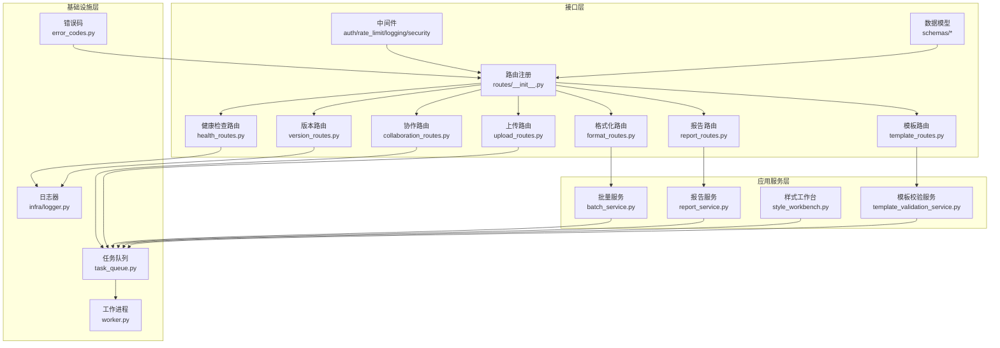
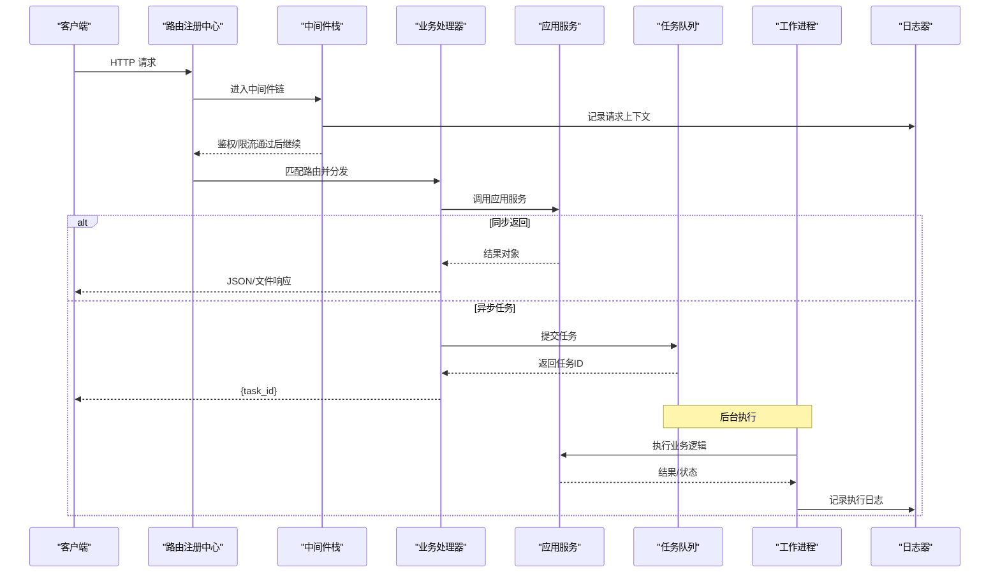
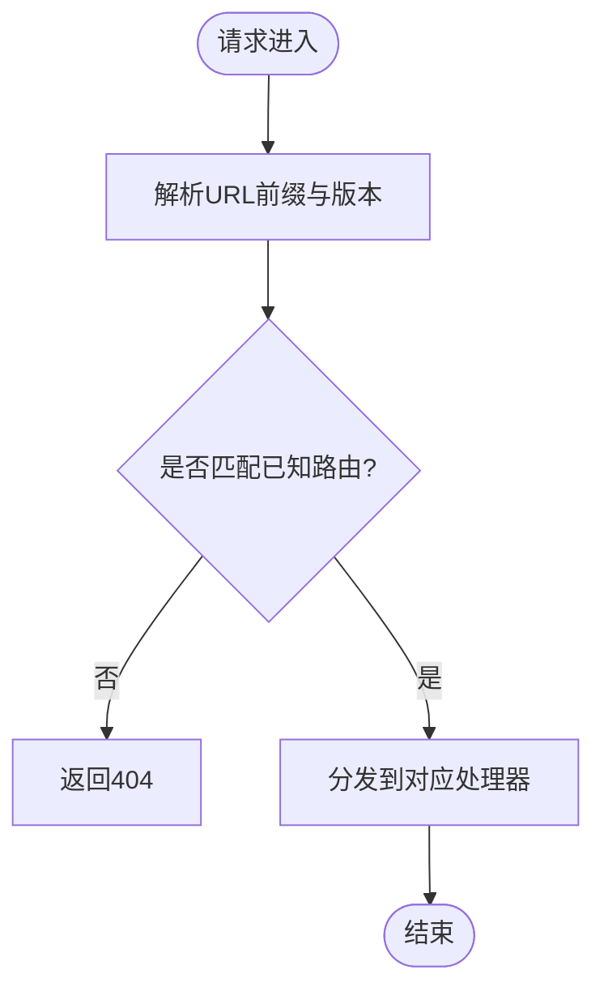
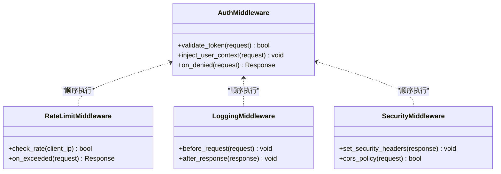
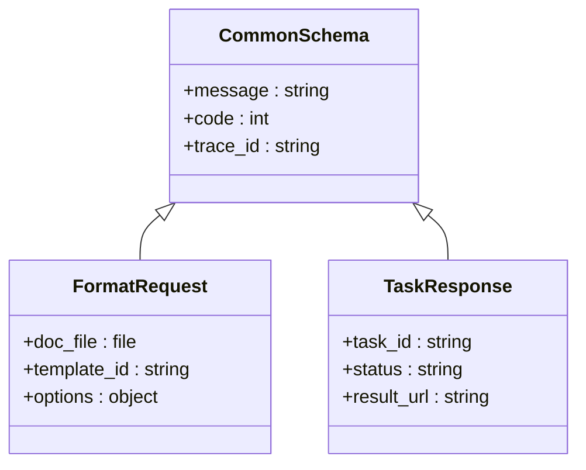
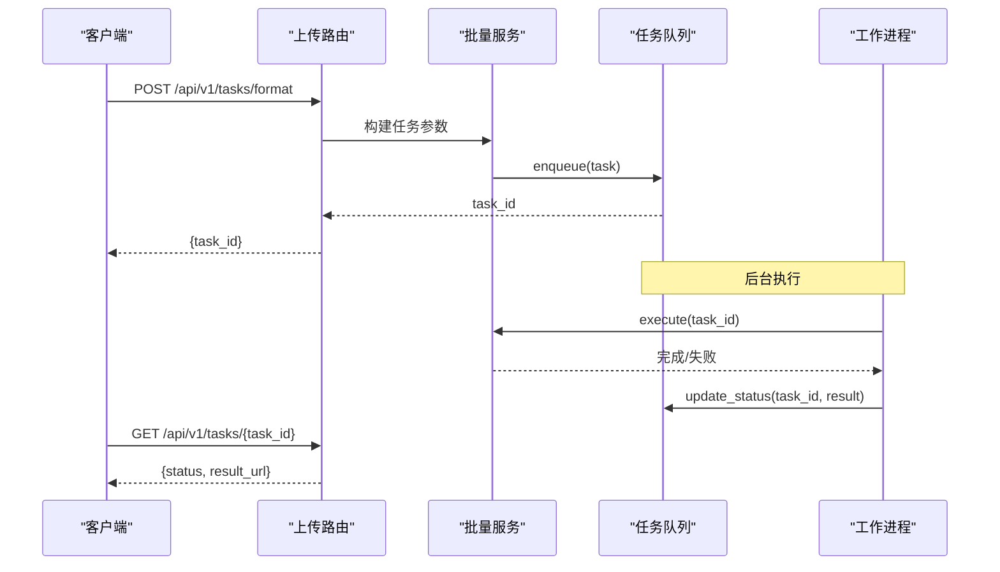
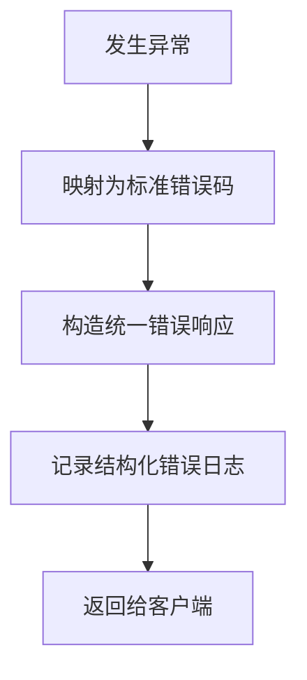
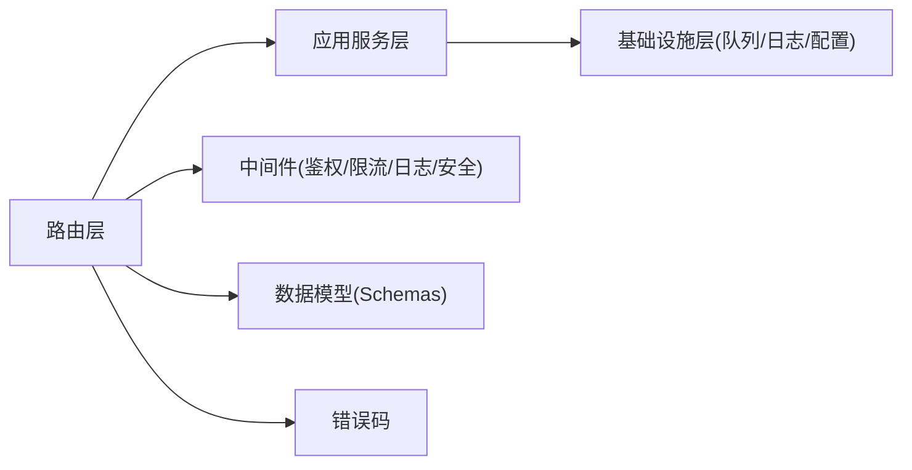

# Web API接口设计

<cite>
**本文引用的文件**   
- [src/paper_format_corrector/api/app.py](file://src/paper_format_corrector/api/app.py)
- [src/paper_format_corrector/interfaces/api/routes/__init__.py](file://src/paper_format_corrector/interfaces/api/routes/__init__.py)
- [src/paper_format_corrector/interfaces/api/routes/format_routes.py](file://src/paper_format_corrector/interfaces/api/routes/format_routes.py)
- [src/paper_format_corrector/interfaces/api/routes/template_routes.py](file://src/paper_format_corrector/interfaces/api/routes/template_routes.py)
- [src/paper_format_corrector/interfaces/api/routes/report_routes.py](file://src/paper_format_corrector/interfaces/api/routes/report_routes.py)
- [src/paper_format_corrector/interfaces/api/routes/health_routes.py](file://src/paper_format_corrector/interfaces/api/routes/health_routes.py)
- [src/paper_format_corrector/interfaces/api/routes/collaboration_routes.py](file://src/paper_format_corrector/interfaces/api/routes/collaboration_routes.py)
- [src/paper_format_corrector/interfaces/api/routes/version_routes.py](file://src/paper_format_corrector/interfaces/api/routes/version_routes.py)
- [src/paper_format_corrector/interfaces/api/routes/upload_routes.py](file://src/paper_format_corrector/interfaces/api/routes/upload_routes.py)
- [src/paper_format_corrector/interfaces/api/middlewares/auth_middleware.py](file://src/paper_format_corrector/interfaces/api/middlewares/auth_middleware.py)
- [src/paper_format_corrector/interfaces/api/middlewares/rate_limit_middleware.py](file://src/paper_format_corrector/interfaces/api/middlewares/rate_limit_middleware.py)
- [src/paper_format_corrector/interfaces/api/middlewares/logging_middleware.py](file://src/paper_format_corrector/interfaces/api/middlewares/logging_middleware.py)
- [src/paper_format_corrector/interfaces/api/middlewares/security_middleware.py](file://src/paper_format_corrector/interfaces/api/middlewares/security_middleware.py)
- [src/paper_format_corrector/interfaces/api/schemas/common_schemas.py](file://src/paper_format_corrector/interfaces/api/schemas/common_schemas.py)
- [src/paper_format_corrector/interfaces/api/schemas/format_schemas.py](file://src/paper_format_corrector/interfaces/api/schemas/format_schemas.py)
- [src/paper_format_corrector/interfaces/api/schemas/template_schemas.py](file://src/paper_format_corrector/interfaces/api/schemas/template_schemas.py)
- [src/paper_format_corrector/interfaces/api/schemas/report_schemas.py](file://src/paper_format_corrector/interfaces/api/schemas/report_schemas.py)
- [src/paper_format_corrector/interfaces/api/schemas/task_schemas.py](file://src/paper_format_corrector/interfaces/api/schemas/task_schemas.py)
- [src/paper_format_corrector/application/services/batch_service.py](file://src/paper_format_corrector/application/services/batch_service.py)
- [src/paper_format_corrector/application/services/report_service.py](file://src/paper_format_corrector/application/services/report_service.py)
- [src/paper_format_corrector/application/services/style_workbench.py](file://src/paper_format_corrector/application/services/style_workbench.py)
- [src/paper_format_corrector/application/services/template_validation_service.py](file://src/paper_format_corrector/application/services/template_validation_service.py)
- [src/paper_format_corrector/infrastructure/queue/task_queue.py](file://src/paper_format_corrector/infrastructure/queue/task_queue.py)
- [src/paper_format_corrector/infrastructure/queue/worker.py](file://src/paper_format_corrector/infrastructure/queue/worker.py)
- [src/paper_format_corrector/infra/logger.py](file://src/paper_format_corrector/infra/logger.py)
- [src/paper_format_corrector/shared/constants/error_codes.py](file://src/paper_format_corrector/shared/constants/error_codes.py)
- [tests/test_api_endpoints.py](file://tests/test_api_endpoints.py)
</cite>

## 目录
1. [简介](#简介)
2. [项目结构](#项目结构)
3. [核心组件](#核心组件)
4. [架构总览](#架构总览)
5. [详细组件分析](#详细组件分析)
6. [依赖关系分析](#依赖关系分析)
7. [性能考虑](#性能考虑)
8. [故障排查指南](#故障排查指南)
9. [结论](#结论)
10. [附录：API端点文档](#附录api端点文档)

## 简介
本文件面向Web API接口设计与集成，聚焦RESTful架构、路由与请求响应处理机制，涵盖版本控制、认证授权与安全策略、异步任务处理、错误码定义与日志记录策略。同时提供完整的API端点说明（请求参数、响应格式、错误处理）以及测试方法与集成示例路径，帮助开发者快速对接与扩展。

## 项目结构
本项目采用分层与模块化组织方式：
- 接口层（interfaces/api）：负责HTTP路由、中间件、请求校验与响应封装。
- 应用服务层（application/services）：编排业务用例，协调领域与基础设施。
- 基础设施层（infrastructure/queue等）：提供队列、工作进程、持久化等能力。
- 共享常量与工具（shared/constants, infra）：统一错误码、日志等横切关注点。

图示来源
- [src/paper_format_corrector/interfaces/api/routes/__init__.py](file://src/paper_format_corrector/interfaces/api/routes/__init__.py)
- [src/paper_format_corrector/interfaces/api/routes/format_routes.py](file://src/paper_format_corrector/interfaces/api/routes/format_routes.py)
- [src/paper_format_corrector/interfaces/api/routes/template_routes.py](file://src/paper_format_corrector/interfaces/api/routes/template_routes.py)
- [src/paper_format_corrector/interfaces/api/routes/report_routes.py](file://src/paper_format_corrector/interfaces/api/routes/report_routes.py)
- [src/paper_format_corrector/interfaces/api/routes/health_routes.py](file://src/paper_format_corrector/interfaces/api/routes/health_routes.py)
- [src/paper_format_corrector/interfaces/api/routes/collaboration_routes.py](file://src/paper_format_corrector/interfaces/api/routes/collaboration_routes.py)
- [src/paper_format_corrector/interfaces/api/routes/version_routes.py](file://src/paper_format_corrector/interfaces/api/routes/version_routes.py)
- [src/paper_format_corrector/interfaces/api/routes/upload_routes.py](file://src/paper_format_corrector/interfaces/api/routes/upload_routes.py)
- [src/paper_format_corrector/interfaces/api/middlewares/auth_middleware.py](file://src/paper_format_corrector/interfaces/api/middlewares/auth_middleware.py)
- [src/paper_format_corrector/interfaces/api/middlewares/rate_limit_middleware.py](file://src/paper_format_corrector/interfaces/api/middlewares/rate_limit_middleware.py)
- [src/paper_format_corrector/interfaces/api/middlewares/logging_middleware.py](file://src/paper_format_corrector/interfaces/api/middlewares/logging_middleware.py)
- [src/paper_format_corrector/interfaces/api/middlewares/security_middleware.py](file://src/paper_format_corrector/interfaces/api/middlewares/security_middleware.py)
- [src/paper_format_corrector/interfaces/api/schemas/common_schemas.py](file://src/paper_format_corrector/interfaces/api/schemas/common_schemas.py)
- [src/paper_format_corrector/interfaces/api/schemas/format_schemas.py](file://src/paper_format_corrector/interfaces/api/schemas/format_schemas.py)
- [src/paper_format_corrector/interfaces/api/schemas/template_schemas.py](file://src/paper_format_corrector/interfaces/api/schemas/template_schemas.py)
- [src/paper_format_corrector/interfaces/api/schemas/report_schemas.py](file://src/paper_format_corrector/interfaces/api/schemas/report_schemas.py)
- [src/paper_format_corrector/interfaces/api/schemas/task_schemas.py](file://src/paper_format_corrector/interfaces/api/schemas/task_schemas.py)
- [src/paper_format_corrector/application/services/batch_service.py](file://src/paper_format_corrector/application/services/batch_service.py)
- [src/paper_format_corrector/application/services/report_service.py](file://src/paper_format_corrector/application/services/report_service.py)
- [src/paper_format_corrector/application/services/style_workbench.py](file://src/paper_format_corrector/application/services/style_workbench.py)
- [src/paper_format_corrector/application/services/template_validation_service.py](file://src/paper_format_corrector/application/services/template_validation_service.py)
- [src/paper_format_corrector/infrastructure/queue/task_queue.py](file://src/paper_format_corrector/infrastructure/queue/task_queue.py)
- [src/paper_format_corrector/infrastructure/queue/worker.py](file://src/paper_format_corrector/infrastructure/queue/worker.py)
- [src/paper_format_corrector/infra/logger.py](file://src/paper_format_corrector/infra/logger.py)
- [src/paper_format_corrector/shared/constants/error_codes.py](file://src/paper_format_corrector/shared/constants/error_codes.py)

章节来源
- [src/paper_format_corrector/interfaces/api/routes/__init__.py](file://src/paper_format_corrector/interfaces/api/routes/__init__.py)
- [src/paper_format_corrector/interfaces/api/middlewares/auth_middleware.py](file://src/paper_format_corrector/interfaces/api/middlewares/auth_middleware.py)
- [src/paper_format_corrector/interfaces/api/middlewares/rate_limit_middleware.py](file://src/paper_format_corrector/interfaces/api/middlewares/rate_limit_middleware.py)
- [src/paper_format_corrector/interfaces/api/middlewares/logging_middleware.py](file://src/paper_format_corrector/interfaces/api/middlewares/logging_middleware.py)
- [src/paper_format_corrector/interfaces/api/middlewares/security_middleware.py](file://src/paper_format_corrector/interfaces/api/middlewares/security_middleware.py)
- [src/paper_format_corrector/interfaces/api/schemas/common_schemas.py](file://src/paper_format_corrector/interfaces/api/schemas/common_schemas.py)
- [src/paper_format_corrector/shared/constants/error_codes.py](file://src/paper_format_corrector/shared/constants/error_codes.py)

## 核心组件
- 路由注册中心：集中挂载各功能模块路由，统一前缀与版本管理。
- 中间件栈：鉴权、限流、日志、安全头与CORS等横切逻辑。
- 数据模型（Schemas）：基于Pydantic的请求/响应校验与序列化。
- 应用服务：编排业务用例，调用领域与基础设施。
- 任务队列与工作进程：异步执行耗时任务（如批量格式化、导出）。
- 错误码与日志：统一的错误码体系与结构化日志输出。

章节来源
- [src/paper_format_corrector/interfaces/api/routes/__init__.py](file://src/paper_format_corrector/interfaces/api/routes/__init__.py)
- [src/paper_format_corrector/interfaces/api/schemas/common_schemas.py](file://src/paper_format_corrector/interfaces/api/schemas/common_schemas.py)
- [src/paper_format_corrector/infrastructure/queue/task_queue.py](file://src/paper_format_corrector/infrastructure/queue/task_queue.py)
- [src/paper_format_corrector/infrastructure/queue/worker.py](file://src/paper_format_corrector/infrastructure/queue/worker.py)
- [src/paper_format_corrector/shared/constants/error_codes.py](file://src/paper_format_corrector/shared/constants/error_codes.py)
- [src/paper_format_corrector/infra/logger.py](file://src/paper_format_corrector/infra/logger.py)

## 架构总览
整体遵循“接口层 -> 应用服务层 -> 基础设施层”的分层架构，结合中间件实现鉴权、限流、日志与安全；通过任务队列解耦耗时操作，提升吞吐与稳定性。

图示来源
- [src/paper_format_corrector/interfaces/api/routes/__init__.py](file://src/paper_format_corrector/interfaces/api/routes/__init__.py)
- [src/paper_format_corrector/interfaces/api/middlewares/auth_middleware.py](file://src/paper_format_corrector/interfaces/api/middlewares/auth_middleware.py)
- [src/paper_format_corrector/interfaces/api/middlewares/rate_limit_middleware.py](file://src/paper_format_corrector/interfaces/api/middlewares/rate_limit_middleware.py)
- [src/paper_format_corrector/interfaces/api/middlewares/logging_middleware.py](file://src/paper_format_corrector/interfaces/api/middlewares/logging_middleware.py)
- [src/paper_format_corrector/interfaces/api/middlewares/security_middleware.py](file://src/paper_format_corrector/interfaces/api/middlewares/security_middleware.py)
- [src/paper_format_corrector/infrastructure/queue/task_queue.py](file://src/paper_format_corrector/infrastructure/queue/task_queue.py)
- [src/paper_format_corrector/infrastructure/queue/worker.py](file://src/paper_format_corrector/infrastructure/queue/worker.py)
- [src/paper_format_corrector/infra/logger.py](file://src/paper_format_corrector/infra/logger.py)

## 详细组件分析

### 路由与版本控制
- 路由注册：在路由初始化文件中集中挂载各子路由，支持统一前缀与版本段（例如 /api/v1）。
- 版本策略：建议采用URL路径版本（/v1、/v2），并在响应头中携带版本信息以便客户端兼容。
- 健康检查与版本查询：提供轻量级健康检查与版本信息接口，便于监控与自动化部署。

图示来源
- [src/paper_format_corrector/interfaces/api/routes/__init__.py](file://src/paper_format_corrector/interfaces/api/routes/__init__.py)
- [src/paper_format_corrector/interfaces/api/routes/health_routes.py](file://src/paper_format_corrector/interfaces/api/routes/health_routes.py)
- [src/paper_format_corrector/interfaces/api/routes/version_routes.py](file://src/paper_format_corrector/interfaces/api/routes/version_routes.py)

章节来源
- [src/paper_format_corrector/interfaces/api/routes/__init__.py](file://src/paper_format_corrector/interfaces/api/routes/__init__.py)
- [src/paper_format_corrector/interfaces/api/routes/health_routes.py](file://src/paper_format_corrector/interfaces/api/routes/health_routes.py)
- [src/paper_format_corrector/interfaces/api/routes/version_routes.py](file://src/paper_format_corrector/interfaces/api/routes/version_routes.py)

### 认证与授权
- 鉴权中间件：对受保护路由进行令牌校验（如JWT），从请求头提取凭据并注入用户上下文。
- 授权策略：基于角色或权限的访问控制，可在路由装饰器或中间件中组合使用。
- 会话与刷新：可结合刷新令牌机制延长用户体验，注意令牌存储与传输安全。

图示来源
- [src/paper_format_corrector/interfaces/api/middlewares/auth_middleware.py](file://src/paper_format_corrector/interfaces/api/middlewares/auth_middleware.py)
- [src/paper_format_corrector/interfaces/api/middlewares/rate_limit_middleware.py](file://src/paper_format_corrector/interfaces/api/middlewares/rate_limit_middleware.py)
- [src/paper_format_corrector/interfaces/api/middlewares/logging_middleware.py](file://src/paper_format_corrector/interfaces/api/middlewares/logging_middleware.py)
- [src/paper_format_corrector/interfaces/api/middlewares/security_middleware.py](file://src/paper_format_corrector/interfaces/api/middlewares/security_middleware.py)

章节来源
- [src/paper_format_corrector/interfaces/api/middlewares/auth_middleware.py](file://src/paper_format_corrector/interfaces/api/middlewares/auth_middleware.py)
- [src/paper_format_corrector/interfaces/api/middlewares/rate_limit_middleware.py](file://src/paper_format_corrector/interfaces/api/middlewares/rate_limit_middleware.py)
- [src/paper_format_corrector/interfaces/api/middlewares/logging_middleware.py](file://src/paper_format_corrector/interfaces/api/middlewares/logging_middleware.py)
- [src/paper_format_corrector/interfaces/api/middlewares/security_middleware.py](file://src/paper_format_corrector/interfaces/api/middlewares/security_middleware.py)

### 请求校验与响应封装
- 请求校验：使用Pydantic模型对JSON表单、查询参数、路径参数与文件上传进行强类型校验与默认值处理。
- 响应封装：统一成功/失败响应结构，包含状态码、消息、数据体与追踪ID，便于前端一致处理。
- 错误映射：将内部异常转换为标准错误码与友好消息，避免泄露敏感信息。

图示来源
- [src/paper_format_corrector/interfaces/api/schemas/common_schemas.py](file://src/paper_format_corrector/interfaces/api/schemas/common_schemas.py)
- [src/paper_format_corrector/interfaces/api/schemas/format_schemas.py](file://src/paper_format_corrector/interfaces/api/schemas/format_schemas.py)
- [src/paper_format_corrector/interfaces/api/schemas/task_schemas.py](file://src/paper_format_corrector/interfaces/api/schemas/task_schemas.py)

章节来源
- [src/paper_format_corrector/interfaces/api/schemas/common_schemas.py](file://src/paper_format_corrector/interfaces/api/schemas/common_schemas.py)
- [src/paper_format_corrector/interfaces/api/schemas/format_schemas.py](file://src/paper_format_corrector/interfaces/api/schemas/format_schemas.py)
- [src/paper_format_corrector/interfaces/api/schemas/task_schemas.py](file://src/paper_format_corrector/interfaces/api/schemas/task_schemas.py)

### 异步任务处理
- 任务提交流程：处理器接收请求后，将任务入队并立即返回任务ID，客户端轮询或通过回调获取结果。
- 工作进程：独立进程消费队列任务，执行业务逻辑并更新任务状态与结果。
- 幂等与重试：为任务分配唯一ID，支持失败重试与去重策略，保障最终一致性。

图示来源
- [src/paper_format_corrector/interfaces/api/routes/upload_routes.py](file://src/paper_format_corrector/interfaces/api/routes/upload_routes.py)
- [src/paper_format_corrector/application/services/batch_service.py](file://src/paper_format_corrector/application/services/batch_service.py)
- [src/paper_format_corrector/infrastructure/queue/task_queue.py](file://src/paper_format_corrector/infrastructure/queue/task_queue.py)
- [src/paper_format_corrector/infrastructure/queue/worker.py](file://src/paper_format_corrector/infrastructure/queue/worker.py)

章节来源
- [src/paper_format_corrector/interfaces/api/routes/upload_routes.py](file://src/paper_format_corrector/interfaces/api/routes/upload_routes.py)
- [src/paper_format_corrector/application/services/batch_service.py](file://src/paper_format_corrector/application/services/batch_service.py)
- [src/paper_format_corrector/infrastructure/queue/task_queue.py](file://src/paper_format_corrector/infrastructure/queue/task_queue.py)
- [src/paper_format_corrector/infrastructure/queue/worker.py](file://src/paper_format_corrector/infrastructure/queue/worker.py)

### 错误码定义与日志记录
- 错误码：按模块划分，区分客户端错误与服务端错误，附带可读消息与调试追踪ID。
- 日志策略：结构化日志（JSON），包含请求ID、用户标识、耗时与关键指标；分级输出（INFO/WARN/ERROR）。
- 安全提示：避免在日志中记录敏感信息（密码、令牌、完整文件内容）。

图示来源
- [src/paper_format_corrector/shared/constants/error_codes.py](file://src/paper_format_corrector/shared/constants/error_codes.py)
- [src/paper_format_corrector/infra/logger.py](file://src/paper_format_corrector/infra/logger.py)

章节来源
- [src/paper_format_corrector/shared/constants/error_codes.py](file://src/paper_format_corrector/shared/constants/error_codes.py)
- [src/paper_format_corrector/infra/logger.py](file://src/paper_format_corrector/infra/logger.py)

## 依赖关系分析
- 低耦合高内聚：路由仅负责分发与校验，业务逻辑下沉至应用服务；基础设施通过抽象接口被服务层调用。
- 外部依赖：任务队列与工作进程解耦，支持水平扩展；日志与错误码作为横切能力被广泛复用。
- 潜在风险：需避免循环依赖；确保中间件顺序正确（鉴权在前，限流紧随其后）。

图示来源
- [src/paper_format_corrector/interfaces/api/routes/__init__.py](file://src/paper_format_corrector/interfaces/api/routes/__init__.py)
- [src/paper_format_corrector/application/services/batch_service.py](file://src/paper_format_corrector/application/services/batch_service.py)
- [src/paper_format_corrector/infrastructure/queue/task_queue.py](file://src/paper_format_corrector/infrastructure/queue/task_queue.py)
- [src/paper_format_corrector/infra/logger.py](file://src/paper_format_corrector/infra/logger.py)
- [src/paper_format_corrector/shared/constants/error_codes.py](file://src/paper_format_corrector/shared/constants/error_codes.py)

章节来源
- [src/paper_format_corrector/interfaces/api/routes/__init__.py](file://src/paper_format_corrector/interfaces/api/routes/__init__.py)
- [src/paper_format_corrector/application/services/batch_service.py](file://src/paper_format_corrector/application/services/batch_service.py)
- [src/paper_format_corrector/infrastructure/queue/task_queue.py](file://src/paper_format_corrector/infrastructure/queue/task_queue.py)
- [src/paper_format_corrector/infra/logger.py](file://src/paper_format_corrector/infra/logger.py)
- [src/paper_format_corrector/shared/constants/error_codes.py](file://src/paper_format_corrector/shared/constants/error_codes.py)

## 性能考虑
- 异步优先：对耗时操作（格式化、导出、批量处理）一律走任务队列，避免阻塞请求线程。
- 连接与资源：合理设置文件上传大小限制、超时时间与并发度；对大文件采用分块与流式处理。
- 缓存与幂等：对只读接口引入缓存；为任务提供幂等键，减少重复计算。
- 监控与告警：结合日志与指标暴露，建立QPS、延迟、错误率与队列积压的监控看板。

[本节为通用指导，不直接分析具体文件]

## 故障排查指南
- 常见问题定位：
  - 鉴权失败：检查令牌格式、过期时间与作用域；确认中间件顺序与注入字段。
  - 限流触发：观察限流计数与阈值；必要时调整配额或扩容实例。
  - 任务失败：查看任务状态与错误日志；核对输入参数与依赖服务可用性。
- 日志检索：
  - 使用trace_id关联一次请求的全链路日志。
  - 过滤ERROR级别日志，结合错误码快速定位根因。
- 恢复策略：
  - 对可重试任务启用退避重试；对不可恢复错误返回明确错误码与修复建议。

章节来源
- [src/paper_format_corrector/interfaces/api/middlewares/auth_middleware.py](file://src/paper_format_corrector/interfaces/api/middlewares/auth_middleware.py)
- [src/paper_format_corrector/interfaces/api/middlewares/rate_limit_middleware.py](file://src/paper_format_corrector/interfaces/api/middlewares/rate_limit_middleware.py)
- [src/paper_format_corrector/infra/logger.py](file://src/paper_format_corrector/infra/logger.py)
- [src/paper_format_corrector/shared/constants/error_codes.py](file://src/paper_format_corrector/shared/constants/error_codes.py)

## 结论
本API设计以分层架构为基础，结合中间件、统一数据模型与异步任务队列，实现了可扩展、可观测且安全的Web服务。通过明确的版本控制、错误码与日志策略，提升了可维护性与可排障性。建议在后续迭代中持续完善监控指标、灰度发布与契约测试，进一步提升质量与交付效率。

[本节为总结性内容，不直接分析具体文件]

## 附录：API端点文档

### 通用约定
- 基础路径：/api/v1
- 认证：受保护接口需在请求头携带令牌（例如 Authorization: Bearer <token>）。
- 统一响应结构：包含状态码、消息、数据体与追踪ID。
- 错误码：参考错误码常量文件，客户端据此做差异化处理。

章节来源
- [src/paper_format_corrector/interfaces/api/routes/__init__.py](file://src/paper_format_corrector/interfaces/api/routes/__init__.py)
- [src/paper_format_corrector/interfaces/api/schemas/common_schemas.py](file://src/paper_format_corrector/interfaces/api/schemas/common_schemas.py)
- [src/paper_format_corrector/shared/constants/error_codes.py](file://src/paper_format_corrector/shared/constants/error_codes.py)

### 健康检查
- 方法：GET
- 路径：/api/v1/health
- 描述：服务存活与健康状态探测。
- 请求参数：无
- 响应：
  - 成功：{ status: "ok", version: "x.y.z" }
  - 失败：{ code, message, trace_id }
- 错误码：见错误码定义

章节来源
- [src/paper_format_corrector/interfaces/api/routes/health_routes.py](file://src/paper_format_corrector/interfaces/api/routes/health_routes.py)

### 版本信息
- 方法：GET
- 路径：/api/v1/version
- 描述：返回当前服务版本与特性开关。
- 请求参数：无
- 响应：{ version, features[] }
- 错误码：见错误码定义

章节来源
- [src/paper_format_corrector/interfaces/api/routes/version_routes.py](file://src/paper_format_corrector/interfaces/api/routes/version_routes.py)

### 文档格式化（同步）
- 方法：POST
- 路径：/api/v1/format
- 描述：根据模板对文档进行格式化，返回处理后的文档或下载链接。
- 请求参数：
  - doc_file: 文件（必填）
  - template_id: 字符串（必填）
  - options: 对象（可选）
- 响应：
  - 成功：{ data: { download_url | file_bytes }, message }
  - 失败：{ code, message, trace_id }
- 错误码：见错误码定义

章节来源
- [src/paper_format_corrector/interfaces/api/routes/format_routes.py](file://src/paper_format_corrector/interfaces/api/routes/format_routes.py)
- [src/paper_format_corrector/interfaces/api/schemas/format_schemas.py](file://src/paper_format_corrector/interfaces/api/schemas/format_schemas.py)

### 模板管理
- 方法：GET/POST/PUT/DELETE
- 路径：/api/v1/templates
- 描述：模板列表、创建、更新与删除。
- 请求参数：
  - 列表：分页与筛选参数（可选）
  - 创建/更新：模板元数据与规则定义（必填）
- 响应：
  - 成功：模板对象或操作结果
  - 失败：{ code, message, trace_id }
- 错误码：见错误码定义

章节来源
- [src/paper_format_corrector/interfaces/api/routes/template_routes.py](file://src/paper_format_corrector/interfaces/api/routes/template_routes.py)
- [src/paper_format_corrector/interfaces/api/schemas/template_schemas.py](file://src/paper_format_corrector/interfaces/api/schemas/template_schemas.py)

### 报告生成
- 方法：POST
- 路径：/api/v1/reports
- 描述：生成格式化质量报告或差异对比报告。
- 请求参数：
  - doc_file: 文件（必填）
  - report_type: 枚举（必填）
  - options: 对象（可选）
- 响应：
  - 成功：{ data: { report_url | report_content }, message }
  - 失败：{ code, message, trace_id }
- 错误码：见错误码定义

章节来源
- [src/paper_format_corrector/interfaces/api/routes/report_routes.py](file://src/paper_format_corrector/interfaces/api/routes/report_routes.py)
- [src/paper_format_corrector/interfaces/api/schemas/report_schemas.py](file://src/paper_format_corrector/interfaces/api/schemas/report_schemas.py)

### 协作相关
- 方法：GET/POST/PUT/DELETE
- 路径：/api/v1/collaboration/*
- 描述：协作编辑、冲突解决与变更同步。
- 请求参数：依据具体子路由定义。
- 响应：统一响应结构。
- 错误码：见错误码定义

章节来源
- [src/paper_format_corrector/interfaces/api/routes/collaboration_routes.py](file://src/paper_format_corrector/interfaces/api/routes/collaboration_routes.py)

### 任务管理（异步）
- 方法：POST/GET
- 路径：/api/v1/tasks
- 描述：提交异步任务与查询任务状态。
- 请求参数：
  - 提交：任务类型与参数（必填）
  - 查询：task_id（必填）
- 响应：
  - 提交：{ task_id }
  - 查询：{ status, result_url, error? }
- 错误码：见错误码定义

章节来源
- [src/paper_format_corrector/interfaces/api/routes/upload_routes.py](file://src/paper_format_corrector/interfaces/api/routes/upload_routes.py)
- [src/paper_format_corrector/interfaces/api/schemas/task_schemas.py](file://src/paper_format_corrector/interfaces/api/schemas/task_schemas.py)

### 认证与授权
- 方法：POST
- 路径：/api/v1/auth/login
- 描述：登录获取访问令牌。
- 请求参数：用户名/邮箱与密码（必填）。
- 响应：{ access_token, refresh_token?, expires_in }
- 错误码：见错误码定义

章节来源
- [src/paper_format_corrector/interfaces/api/middlewares/auth_middleware.py](file://src/paper_format_corrector/interfaces/api/middlewares/auth_middleware.py)

### 安全与限流
- 全局安全头：由安全中间件自动添加（如X-Content-Type-Options、X-Frame-Options等）。
- 限流策略：按IP或用户维度限制请求频率，超限返回特定错误码。

章节来源
- [src/paper_format_corrector/interfaces/api/middlewares/security_middleware.py](file://src/paper_format_corrector/interfaces/api/middlewares/security_middleware.py)
- [src/paper_format_corrector/interfaces/api/middlewares/rate_limit_middleware.py](file://src/paper_format_corrector/interfaces/api/middlewares/rate_limit_middleware.py)

### 日志与追踪
- 请求日志：记录方法、路径、状态码、耗时与trace_id。
- 错误日志：记录堆栈摘要与上下文，避免敏感信息泄露。

章节来源
- [src/paper_format_corrector/interfaces/api/middlewares/logging_middleware.py](file://src/paper_format_corrector/interfaces/api/middlewares/logging_middleware.py)
- [src/paper_format_corrector/infra/logger.py](file://src/paper_format_corrector/infra/logger.py)

### 测试方法与集成示例
- 单元测试与集成测试：
  - 端到端API测试：覆盖主要端点的正常与异常路径。
  - 任务队列测试：验证任务入队、执行与状态更新。
- 参考测试文件：
  - [tests/test_api_endpoints.py](file://tests/test_api_endpoints.py)
  - [tests/test_task_queue.py](file://tests/test_task_queue.py)
- 集成示例（概念流程）：
  - 登录获取令牌 -> 提交格式化任务 -> 轮询任务状态 -> 下载结果文件。

章节来源
- [tests/test_api_endpoints.py](file://tests/test_api_endpoints.py)
- [tests/test_task_queue.py](file://tests/test_task_queue.py)