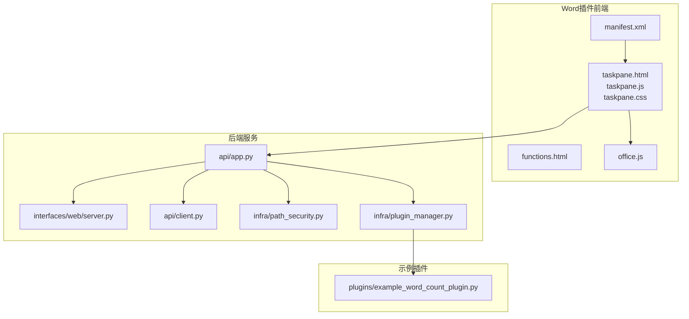
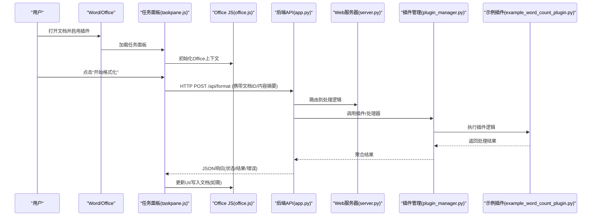
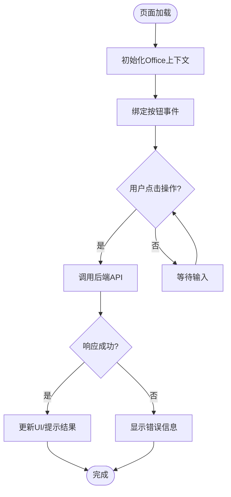
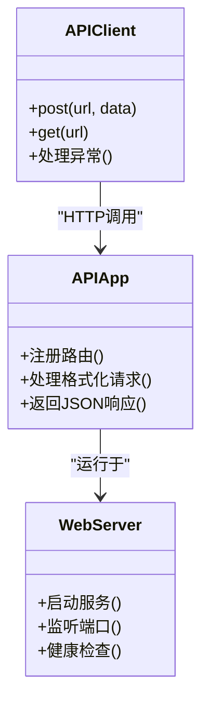
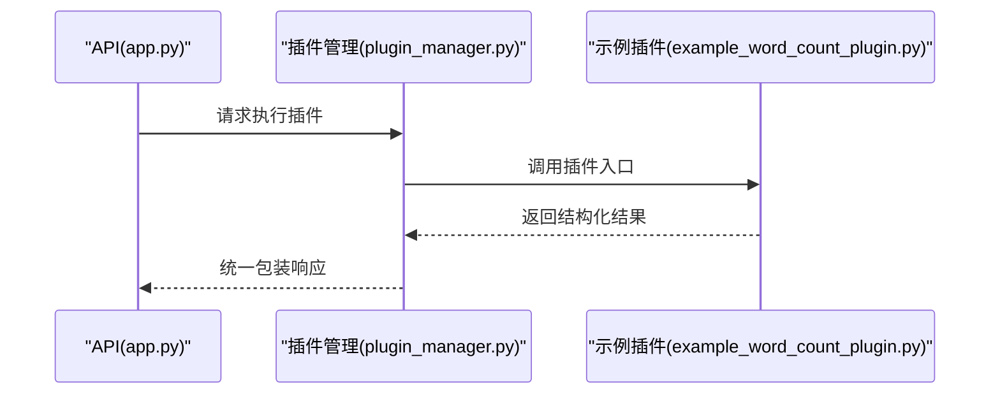
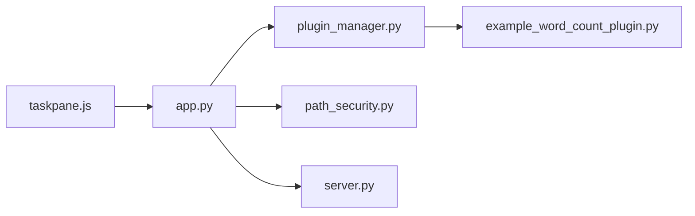

# Word插件界面设计

<cite>
**本文引用的文件**   
- [interfaces/word_addin/manifest.xml](file://interfaces/word_addin/manifest.xml)
- [interfaces/word_addin/src/taskpane.html](file://interfaces/word_addin/src/taskpane.html)
- [interfaces/word_addin/src/taskpane.js](file://interfaces/word_addin/src/taskpane.js)
- [interfaces/word_addin/src/taskpane.css](file://interfaces/word_addin/src/taskpane.css)
- [interfaces/word_addin/src/functions.html](file://interfaces/word_addin/src/functions.html)
- [interfaces/word_addin/src/office.js](file://interfaces/word_addin/src/office.js)
- [src/paper_format_corrector/api/app.py](file://src/paper_format_corrector/api/app.py)
- [src/paper_format_corrector/api/client.py](file://src/paper_format_corrector/api/client.py)
- [src/paper_format_corrector/interfaces/web/server.py](file://src/paper_format_corrector/interfaces/web/server.py)
- [src/paper_format_corrector/infra/path_security.py](file://src/paper_format_corrector/infra/path_security.py)
- [src/paper_format_corrector/infra/plugin_manager.py](file://src/paper_format_corrector/infra/plugin_manager.py)
- [plugins/example_word_count_plugin.py](file://plugins/example_word_count_plugin.py)
- [README.md](file://README.md)
</cite>

## 目录
1. [简介](#简介)
2. [项目结构](#项目结构)
3. [核心组件](#核心组件)
4. [架构总览](#架构总览)
5. [详细组件分析](#详细组件分析)
6. [依赖关系分析](#依赖关系分析)
7. [性能考虑](#性能考虑)
8. [故障排查指南](#故障排查指南)
9. [结论](#结论)
10. [附录](#附录)

## 简介
本文件面向Word插件的界面设计与集成，聚焦以下目标：
- Office插件架构与任务面板设计
- JavaScript前端与Python后端的通信机制
- 部署配置、权限管理与安全沙箱限制
- 文档操作API的使用方法与数据交换格式
- 开发指南与调试技巧
- Office Web Apps兼容性与移动端支持情况

## 项目结构
本项目在 interfaces/word_addin 下提供Office插件的前端资源与清单，后端服务位于 src/paper_format_corrector 中。关键目录与职责如下：
- interfaces/word_addin：插件清单与任务面板HTML/CSS/JS资源
- src/paper_format_corrector/api：Web API应用与客户端封装
- src/paper_format_corrector/interfaces/web：Web服务器入口（用于本地或内网服务）
- src/paper_format_corrector/infra：路径安全、插件管理等基础设施
- plugins：示例插件（扩展点）

图表来源
- [interfaces/word_addin/manifest.xml](file://interfaces/word_addin/manifest.xml)
- [interfaces/word_addin/src/taskpane.html](file://interfaces/word_addin/src/taskpane.html)
- [interfaces/word_addin/src/taskpane.js](file://interfaces/word_addin/src/taskpane.js)
- [interfaces/word_addin/src/taskpane.css](file://interfaces/word_addin/src/taskpane.css)
- [interfaces/word_addin/src/functions.html](file://interfaces/word_addin/src/functions.html)
- [interfaces/word_addin/src/office.js](file://interfaces/word_addin/src/office.js)
- [src/paper_format_corrector/api/app.py](file://src/paper_format_corrector/api/app.py)
- [src/paper_format_corrector/interfaces/web/server.py](file://src/paper_format_corrector/interfaces/web/server.py)
- [src/paper_format_corrector/api/client.py](file://src/paper_format_corrector/api/client.py)
- [src/paper_format_corrector/infra/path_security.py](file://src/paper_format_corrector/infra/path_security.py)
- [src/paper_format_corrector/infra/plugin_manager.py](file://src/paper_format_corrector/infra/plugin_manager.py)
- [plugins/example_word_count_plugin.py](file://plugins/example_word_count_plugin.py)

章节来源
- [README.md](file://README.md)

## 核心组件
- 插件清单 manifest.xml：定义插件元数据、任务面板URL、函数调用映射、权限范围等。
- 任务面板 taskpane.html/js/css：UI布局、交互逻辑与样式。
- 函数页面 functions.html：供插件调用的函数宿主页（可选）。
- office.js：Office JS运行时加载与初始化。
- 后端API app.py：HTTP接口，接收来自前端的请求并调度处理。
- Web服务器 server.py：启动本地/内网服务，暴露API。
- 客户端 client.py：封装对后端的调用（可用于测试或内部工具）。
- 路径安全 path_security.py：校验访问路径，防止越权读取。
- 插件管理器 plugin_manager.py：发现、加载与执行外部插件。
- 示例插件 example_word_count_plugin.py：演示如何以Python实现可插拔功能。

章节来源
- [interfaces/word_addin/manifest.xml](file://interfaces/word_addin/manifest.xml)
- [interfaces/word_addin/src/taskpane.html](file://interfaces/word_addin/src/taskpane.html)
- [interfaces/word_addin/src/taskpane.js](file://interfaces/word_addin/src/taskpane.js)
- [interfaces/word_addin/src/taskpane.css](file://interfaces/word_addin/src/taskpane.css)
- [interfaces/word_addin/src/functions.html](file://interfaces/word_addin/src/functions.html)
- [interfaces/word_addin/src/office.js](file://interfaces/word_addin/src/office.js)
- [src/paper_format_corrector/api/app.py](file://src/paper_format_corrector/api/app.py)
- [src/paper_format_corrector/interfaces/web/server.py](file://src/paper_format_corrector/interfaces/web/server.py)
- [src/paper_format_corrector/api/client.py](file://src/paper_format_corrector/api/client.py)
- [src/paper_format_corrector/infra/path_security.py](file://src/paper_format_corrector/infra/path_security.py)
- [src/paper_format_corrector/infra/plugin_manager.py](file://src/paper_format_corrector/infra/plugin_manager.py)
- [plugins/example_word_count_plugin.py](file://plugins/example_word_count_plugin.py)

## 架构总览
整体采用“前端任务面板 + 本地/内网后端服务”的架构。前端通过Office JS与任务面板交互，并通过HTTP调用后端API；后端负责文档处理、模板渲染、规则校验与结果回写。

图表来源
- [interfaces/word_addin/src/taskpane.js](file://interfaces/word_addin/src/taskpane.js)
- [interfaces/word_addin/src/office.js](file://interfaces/word_addin/src/office.js)
- [src/paper_format_corrector/api/app.py](file://src/paper_format_corrector/api/app.py)
- [src/paper_format_corrector/interfaces/web/server.py](file://src/paper_format_corrector/interfaces/web/server.py)
- [src/paper_format_corrector/infra/plugin_manager.py](file://src/paper_format_corrector/infra/plugin_manager.py)
- [plugins/example_word_count_plugin.py](file://plugins/example_word_count_plugin.py)

## 详细组件分析

### 插件清单与权限
- 清单作用：声明插件名称、版本、默认语言、任务面板URL、函数调用映射、所需权限范围等。
- 权限范围：根据需求最小化授权，例如仅允许访问当前文档与必要设置。
- 函数映射：将前端自定义函数映射到后端API或宿主函数。

章节来源
- [interfaces/word_addin/manifest.xml](file://interfaces/word_addin/manifest.xml)

### 任务面板UI与交互
- HTML结构：包含标题、操作按钮、进度指示、结果展示区域等。
- CSS样式：适配不同屏幕尺寸，保证可读性与一致性。
- JS逻辑：
  - 初始化Office上下文
  - 监听用户事件
  - 调用后端API
  - 更新UI与文档内容（如需要）

图表来源
- [interfaces/word_addin/src/taskpane.html](file://interfaces/word_addin/src/taskpane.html)
- [interfaces/word_addin/src/taskpane.js](file://interfaces/word_addin/src/taskpane.js)
- [interfaces/word_addin/src/taskpane.css](file://interfaces/word_addin/src/taskpane.css)

章节来源
- [interfaces/word_addin/src/taskpane.html](file://interfaces/word_addin/src/taskpane.html)
- [interfaces/word_addin/src/taskpane.js](file://interfaces/word_addin/src/taskpane.js)
- [interfaces/word_addin/src/taskpane.css](file://interfaces/word_addin/src/taskpane.css)

### 函数页面与Office JS
- functions.html：作为函数宿主页，承载由插件清单映射的函数调用。
- office.js：加载Office JS运行时，提供与Word/Excel等应用的桥接能力。

章节来源
- [interfaces/word_addin/src/functions.html](file://interfaces/word_addin/src/functions.html)
- [interfaces/word_addin/src/office.js](file://interfaces/word_addin/src/office.js)

### 后端API与服务
- app.py：定义REST接口，解析请求参数，执行业务逻辑，返回JSON。
- server.py：启动HTTP服务，绑定端口，提供健康检查与日志。
- client.py：封装HTTP调用，便于测试与脚本使用。

图表来源
- [src/paper_format_corrector/api/app.py](file://src/paper_format_corrector/api/app.py)
- [src/paper_format_corrector/interfaces/web/server.py](file://src/paper_format_corrector/interfaces/web/server.py)
- [src/paper_format_corrector/api/client.py](file://src/paper_format_corrector/api/client.py)

章节来源
- [src/paper_format_corrector/api/app.py](file://src/paper_format_corrector/api/app.py)
- [src/paper_format_corrector/interfaces/web/server.py](file://src/paper_format_corrector/interfaces/web/server.py)
- [src/paper_format_corrector/api/client.py](file://src/paper_format_corrector/api/client.py)

### 路径安全与权限控制
- path_security.py：校验文件路径是否属于白名单目录，防止越权访问。
- 建议策略：
  - 严格白名单
  - 规范化路径并去重
  - 拒绝符号链接与相对路径逃逸

章节来源
- [src/paper_format_corrector/infra/path_security.py](file://src/paper_format_corrector/infra/path_security.py)

### 插件管理与扩展点
- plugin_manager.py：扫描、加载与执行外部插件。
- 示例插件 example_word_count_plugin.py：演示插件接口约定与返回值格式。

图表来源
- [src/paper_format_corrector/infra/plugin_manager.py](file://src/paper_format_corrector/infra/plugin_manager.py)
- [plugins/example_word_count_plugin.py](file://plugins/example_word_count_plugin.py)

章节来源
- [src/paper_format_corrector/infra/plugin_manager.py](file://src/paper_format_corrector/infra/plugin_manager.py)
- [plugins/example_word_count_plugin.py](file://plugins/example_word_count_plugin.py)

### 数据交换格式
- 推荐JSON结构：
  - 请求体：包含文档标识、操作类型、参数对象、回调地址（可选）
  - 响应体：包含状态码、消息、数据对象、错误详情
- 字段命名：统一小驼峰，避免歧义
- 错误码：区分网络层、业务层、系统层错误

章节来源
- [src/paper_format_corrector/api/app.py](file://src/paper_format_corrector/api/app.py)
- [src/paper_format_corrector/api/client.py](file://src/paper_format_corrector/api/client.py)

### 文档操作API使用方法
- 读取文档：通过API获取文档内容或元数据
- 修改文档：提交变更集（增量或全量），后端校验并应用
- 保存与导出：触发保存流程或导出为其他格式
- 注意事项：
  - 大文档分块传输
  - 幂等性设计
  - 事务与回滚

章节来源
- [src/paper_format_corrector/api/app.py](file://src/paper_format_corrector/api/app.py)

### 部署配置
- 清单配置：
  - 指定任务面板URL（HTTPS优先）
  - 配置函数映射与权限范围
- 服务部署：
  - 本地开发：启动server.py，确保端口开放
  - 生产环境：反向代理+HTTPS证书
- 环境变量：
  - 服务端口、日志级别、白名单目录等

章节来源
- [interfaces/word_addin/manifest.xml](file://interfaces/word_addin/manifest.xml)
- [src/paper_format_corrector/interfaces/web/server.py](file://src/paper_format_corrector/interfaces/web/server.py)

### 权限管理与安全沙箱限制
- Office插件沙箱：
  - 无直接文件系统访问
  - 需通过HTTP与后端通信
  - 跨域与安全策略受浏览器/Office限制
- 后端权限：
  - 路径白名单
  - 最小权限原则
  - 审计日志

章节来源
- [src/paper_format_corrector/infra/path_security.py](file://src/paper_format_corrector/infra/path_security.py)

### 开发指南与调试技巧
- 开发步骤：
  - 编写任务面板HTML/CSS/JS
  - 配置manifest.xml指向本地服务
  - 启动后端服务并验证API
- 调试技巧：
  - 使用浏览器开发者工具查看网络请求
  - 在后端增加详细日志
  - 使用client.py进行接口自动化测试

章节来源
- [interfaces/word_addin/src/taskpane.js](file://interfaces/word_addin/src/taskpane.js)
- [src/paper_format_corrector/api/client.py](file://src/paper_format_corrector/api/client.py)

### Office Web Apps兼容性与移动端支持
- Office Web Apps：
  - 部分Office JS API受限
  - 建议使用通用API与降级策略
- 移动端：
  - UI需自适应
  - 避免复杂交互
  - 关注触摸事件与键盘行为

章节来源
- [interfaces/word_addin/src/taskpane.css](file://interfaces/word_addin/src/taskpane.css)
- [interfaces/word_addin/src/taskpane.js](file://interfaces/word_addin/src/taskpane.js)

## 依赖关系分析
前端与后端通过HTTP解耦，插件通过管理器注入，形成清晰的分层与低耦合。

图表来源
- [interfaces/word_addin/src/taskpane.js](file://interfaces/word_addin/src/taskpane.js)
- [src/paper_format_corrector/api/app.py](file://src/paper_format_corrector/api/app.py)
- [src/paper_format_corrector/infra/plugin_manager.py](file://src/paper_format_corrector/infra/plugin_manager.py)
- [plugins/example_word_count_plugin.py](file://plugins/example_word_count_plugin.py)
- [src/paper_format_corrector/infra/path_security.py](file://src/paper_format_corrector/infra/path_security.py)
- [src/paper_format_corrector/interfaces/web/server.py](file://src/paper_format_corrector/interfaces/web/server.py)

章节来源
- [interfaces/word_addin/src/taskpane.js](file://interfaces/word_addin/src/taskpane.js)
- [src/paper_format_corrector/api/app.py](file://src/paper_format_corrector/api/app.py)
- [src/paper_format_corrector/infra/plugin_manager.py](file://src/paper_format_corrector/infra/plugin_manager.py)
- [plugins/example_word_count_plugin.py](file://plugins/example_word_count_plugin.py)
- [src/paper_format_corrector/infra/path_security.py](file://src/paper_format_corrector/infra/path_security.py)
- [src/paper_format_corrector/interfaces/web/server.py](file://src/paper_format_corrector/interfaces/web/server.py)

## 性能考虑
- 前端：
  - 减少DOM操作频率
  - 合并网络请求
  - 使用节流/防抖
- 后端：
  - 异步处理耗时任务
  - 分页与流式传输
  - 缓存热点数据
- 网络：
  - 压缩响应体
  - 合理超时与重试

[本节为通用指导，不直接分析具体文件]

## 故障排查指南
- 常见问题：
  - 任务面板无法加载：检查manifest.xml中的URL与HTTPS证书
  - API调用失败：确认后端服务已启动且端口可达
  - 路径访问被拒：核对白名单配置
- 定位方法：
  - 浏览器控制台查看错误栈
  - 后端日志输出关键节点
  - 使用client.py复现问题

章节来源
- [interfaces/word_addin/manifest.xml](file://interfaces/word_addin/manifest.xml)
- [src/paper_format_corrector/interfaces/web/server.py](file://src/paper_format_corrector/interfaces/web/server.py)
- [src/paper_format_corrector/infra/path_security.py](file://src/paper_format_corrector/infra/path_security.py)

## 结论
本插件采用前后端分离架构，前端通过任务面板与Office JS交互，后端提供稳定API与可扩展插件机制。通过严格的权限与路径安全策略，保障安全性与稳定性。建议在开发过程中遵循最小权限原则与渐进增强策略，以提升兼容性与用户体验。

[本节为总结，不直接分析具体文件]

## 附录
- 术语表：
  - 任务面板：Office插件侧边栏UI
  - 函数映射：将前端函数与后端逻辑关联
  - 白名单：允许访问的路径集合
- 参考链接：
  - Office JS文档
  - REST API设计规范

[本节为补充说明，不直接分析具体文件]