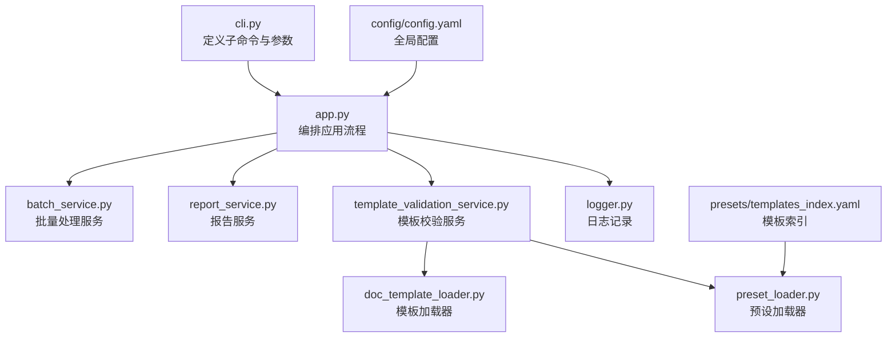
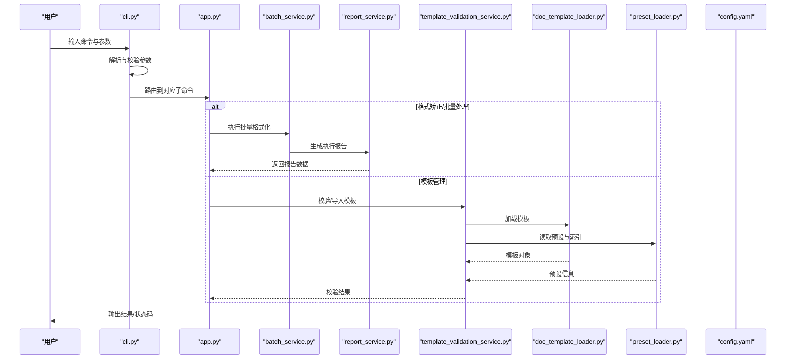
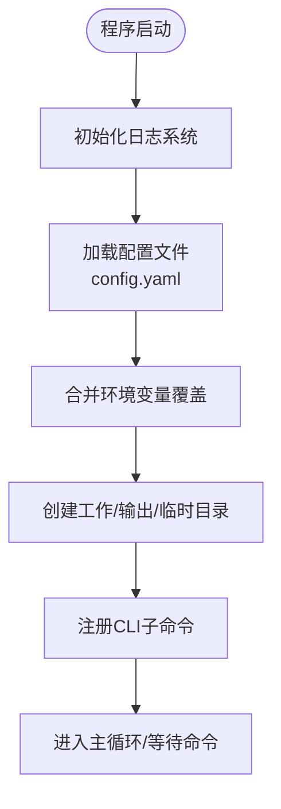
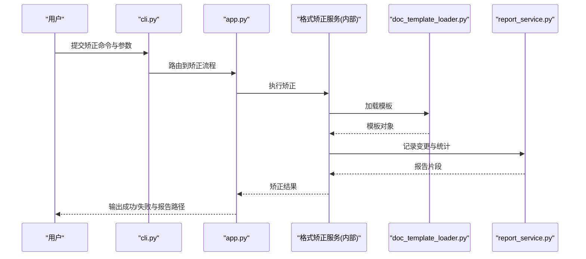
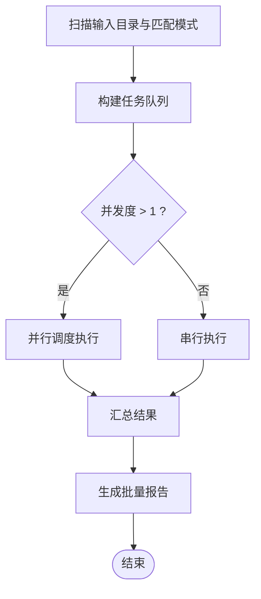
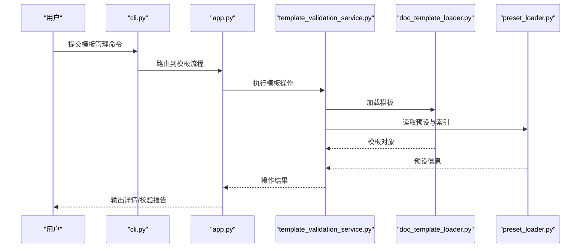
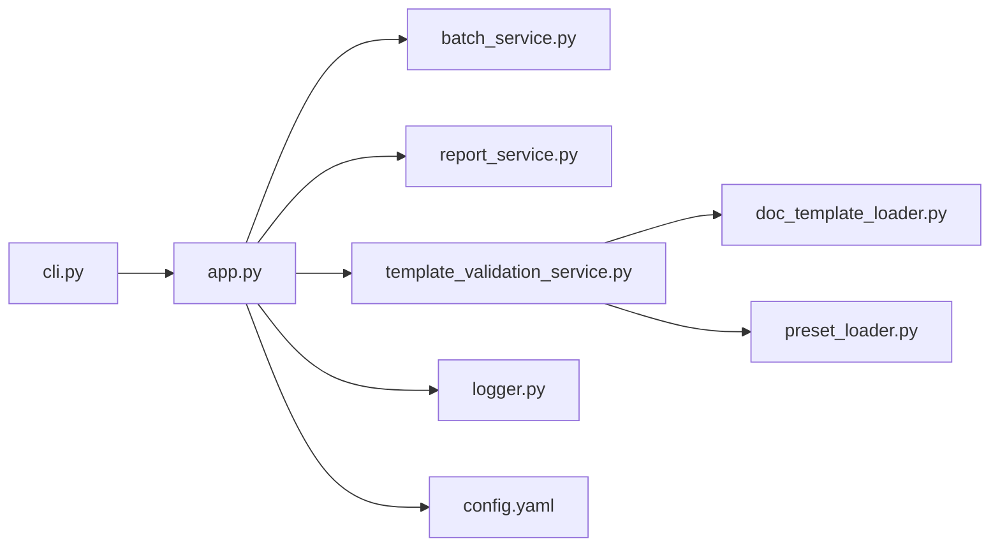

# 命令行界面设计

<cite>
**本文引用的文件**   
- [src/paper_format_corrector/cli.py](file://src/paper_format_corrector/cli.py)
- [src/paper_format_corrector/__main__.py](file://src/paper_format_corrector/__main__.py)
- [src/paper_format_corrector/app.py](file://src/paper_format_corrector/app.py)
- [src/paper_format_corrector/application/services/batch_service.py](file://src/paper_format_corrector/application/services/batch_service.py)
- [src/paper_format_corrector/application/services/report_service.py](file://src/paper_format_corrector/application/services/report_service.py)
- [src/paper_format_corrector/application/services/template_validation_service.py](file://src/paper_format_corrector/application/services/template_validation_service.py)
- [src/paper_format_corrector/infra/doc_template_loader.py](file://src/paper_format_corrector/infra/doc_template_loader.py)
- [src/paper_format_corrector/infra/preset_loader.py](file://src/paper_format_corrector/infra/preset_loader.py)
- [src/paper_format_corrector/infra/logger.py](file://src/paper_format_corrector/infra/logger.py)
- [config/config.yaml](file://config/config.yaml)
- [presets/templates_index.yaml](file://presets/templates_index.yaml)
</cite>

## 目录
1. [简介](#简介)
2. [项目结构](#项目结构)
3. [核心组件](#核心组件)
4. [架构总览](#架构总览)
5. [详细组件分析](#详细组件分析)
6. [依赖关系分析](#依赖关系分析)
7. [性能考虑](#性能考虑)
8. [故障排查指南](#故障排查指南)
9. [结论](#结论)
10. [附录](#附录)

## 简介
本文件面向命令行工具的用户与开发者，系统化阐述论文格式矫正工具的 CLI 设计：命令架构、参数解析机制、用户交互流程、子命令实现逻辑（格式矫正、批量处理、模板管理等）、参数验证规则、错误处理与反馈机制，并提供使用示例与最佳实践。同时覆盖启动流程、配置加载与执行环境设置。

## 项目结构
CLI 入口位于包根目录的 __main__ 与 cli 模块；应用服务层提供格式化、批量处理、报告生成与模板校验等能力；基础设施层负责模板与预设加载、日志记录等。

图表来源
- [src/paper_format_corrector/cli.py](file://src/paper_format_corrector/cli.py)
- [src/paper_format_corrector/app.py](file://src/paper_format_corrector/app.py)
- [src/paper_format_corrector/application/services/batch_service.py](file://src/paper_format_corrector/application/services/batch_service.py)
- [src/paper_format_corrector/application/services/report_service.py](file://src/paper_format_corrector/application/services/report_service.py)
- [src/paper_format_corrector/application/services/template_validation_service.py](file://src/paper_format_corrector/application/services/template_validation_service.py)
- [src/paper_format_corrector/infra/doc_template_loader.py](file://src/paper_format_corrector/infra/doc_template_loader.py)
- [src/paper_format_corrector/infra/preset_loader.py](file://src/paper_format_corrector/infra/preset_loader.py)
- [src/paper_format_corrector/infra/logger.py](file://src/paper_format_corrector/infra/logger.py)
- [config/config.yaml](file://config/config.yaml)
- [presets/templates_index.yaml](file://presets/templates_index.yaml)

章节来源
- [src/paper_format_corrector/__main__.py](file://src/paper_format_corrector/__main__.py)
- [src/paper_format_corrector/cli.py](file://src/paper_format_corrector/cli.py)
- [src/paper_format_corrector/app.py](file://src/paper_format_corrector/app.py)

## 核心组件
- 命令行入口与路由
  - 通过 __main__ 启动并调用 cli 模块中的顶层命令注册与分发逻辑，统一处理 --help、--version 及子命令路由。
- 参数解析与验证
  - 为每个子命令定义参数组与必填项，进行类型转换、范围检查、路径存在性校验、互斥选项校验等。
- 应用编排
  - app 层根据解析后的参数选择对应服务（格式化、批量、模板管理），组装上下文并驱动执行。
- 业务服务
  - 批量处理服务：遍历输入集合，按策略顺序执行格式化任务，支持并发控制与失败重试。
  - 报告服务：汇总执行结果，输出结构化报告（JSON/文本）。
  - 模板校验服务：基于模板索引与预设，校验模板完整性与兼容性。
- 基础设施
  - 模板加载器：从本地或远程仓库加载模板，解析 YAML 元数据。
  - 预设加载器：读取 presets 目录下的模板索引与预设文件。
  - 日志记录：统一日志级别、输出目标与轮转策略。

章节来源
- [src/paper_format_corrector/cli.py](file://src/paper_format_corrector/cli.py)
- [src/paper_format_corrector/app.py](file://src/paper_format_corrector/app.py)
- [src/paper_format_corrector/application/services/batch_service.py](file://src/paper_format_corrector/application/services/batch_service.py)
- [src/paper_format_corrector/application/services/report_service.py](file://src/paper_format_corrector/application/services/report_service.py)
- [src/paper_format_corrector/application/services/template_validation_service.py](file://src/paper_format_corrector/application/services/template_validation_service.py)
- [src/paper_format_corrector/infra/doc_template_loader.py](file://src/paper_format_corrector/infra/doc_template_loader.py)
- [src/paper_format_corrector/infra/preset_loader.py](file://src/paper_format_corrector/infra/preset_loader.py)
- [src/paper_format_corrector/infra/logger.py](file://src/paper_format_corrector/infra/logger.py)

## 架构总览
下图展示从命令行到服务层的调用链路与关键依赖。

图表来源
- [src/paper_format_corrector/cli.py](file://src/paper_format_corrector/cli.py)
- [src/paper_format_corrector/app.py](file://src/paper_format_corrector/app.py)
- [src/paper_format_corrector/application/services/batch_service.py](file://src/paper_format_corrector/application/services/batch_service.py)
- [src/paper_format_corrector/application/services/report_service.py](file://src/paper_format_corrector/application/services/report_service.py)
- [src/paper_format_corrector/application/services/template_validation_service.py](file://src/paper_format_corrector/application/services/template_validation_service.py)
- [src/paper_format_corrector/infra/doc_template_loader.py](file://src/paper_format_corrector/infra/doc_template_loader.py)
- [src/paper_format_corrector/infra/preset_loader.py](file://src/paper_format_corrector/infra/preset_loader.py)
- [config/config.yaml](file://config/config.yaml)

## 详细组件分析

### 启动流程与环境设置
- 启动入口
  - 通过包的 __main__ 触发 CLI 初始化，完成日志系统、配置加载与命令注册。
- 配置加载
  - 优先读取 config/config.yaml，合并环境变量覆盖，形成最终运行配置。
- 执行环境
  - 初始化工作目录、输出目录、临时目录与权限检查；必要时创建缺失目录。

图表来源
- [src/paper_format_corrector/__main__.py](file://src/paper_format_corrector/__main__.py)
- [src/paper_format_corrector/cli.py](file://src/paper_format_corrector/cli.py)
- [src/paper_format_corrector/infra/logger.py](file://src/paper_format_corrector/infra/logger.py)
- [config/config.yaml](file://config/config.yaml)

章节来源
- [src/paper_format_corrector/__main__.py](file://src/paper_format_corrector/__main__.py)
- [src/paper_format_corrector/cli.py](file://src/paper_format_corrector/cli.py)
- [src/paper_format_corrector/infra/logger.py](file://src/paper_format_corrector/infra/logger.py)
- [config/config.yaml](file://config/config.yaml)

### 参数解析与验证规则
- 通用参数
  - 版本与帮助：--version、--help
  - 日志级别：--log-level（默认 INFO）
  - 配置路径：--config（可选，覆盖默认位置）
- 子命令参数
  - 格式矫正：输入路径、输出路径、模板名、是否覆盖、是否只读模式、并行度等
  - 批量处理：输入目录、输出目录、匹配模式、并发数、失败策略（跳过/继续/中止）
  - 模板管理：操作类型（list/show/validate/import）、模板标识、源路径、目标路径等
- 验证规则
  - 类型校验：路径、布尔、枚举值
  - 存在性校验：输入文件/目录、模板文件、配置文件
  - 互斥校验：如“只读模式”与“覆盖写入”互斥
  - 范围校验：并行度为正整数、日志级别合法取值
  - 安全校验：路径规范化与白名单检查，防止越权访问

章节来源
- [src/paper_format_corrector/cli.py](file://src/paper_format_corrector/cli.py)

### 子命令：格式矫正
- 功能概述
  - 对单个文档执行样式与内容规范化的格式矫正，支持指定模板与输出策略。
- 处理流程
  - 参数校验 → 加载模板 → 打开文档 → 应用规则 → 写出结果 → 生成变更摘要
- 关键交互
  - 模板加载器负责解析模板元数据与样式映射；报告服务记录变更点与统计信息。

图表来源
- [src/paper_format_corrector/cli.py](file://src/paper_format_corrector/cli.py)
- [src/paper_format_corrector/app.py](file://src/paper_format_corrector/app.py)
- [src/paper_format_corrector/infra/doc_template_loader.py](file://src/paper_format_corrector/infra/doc_template_loader.py)
- [src/paper_format_corrector/application/services/report_service.py](file://src/paper_format_corrector/application/services/report_service.py)

章节来源
- [src/paper_format_corrector/cli.py](file://src/paper_format_corrector/cli.py)
- [src/paper_format_corrector/app.py](file://src/paper_format_corrector/app.py)
- [src/paper_format_corrector/infra/doc_template_loader.py](file://src/paper_format_corrector/infra/doc_template_loader.py)
- [src/paper_format_corrector/application/services/report_service.py](file://src/paper_format_corrector/application/services/report_service.py)

### 子命令：批量处理
- 功能概述
  - 对目录内多个文档执行统一的格式矫正，支持过滤模式、并发控制与失败策略。
- 处理流程
  - 扫描输入 → 构建任务队列 → 按并发度调度 → 逐个执行矫正 → 汇总报告
- 关键交互
  - 批量服务协调任务调度与重试；报告服务聚合各任务结果。

图表来源
- [src/paper_format_corrector/application/services/batch_service.py](file://src/paper_format_corrector/application/services/batch_service.py)
- [src/paper_format_corrector/application/services/report_service.py](file://src/paper_format_corrector/application/services/report_service.py)

章节来源
- [src/paper_format_corrector/application/services/batch_service.py](file://src/paper_format_corrector/application/services/batch_service.py)
- [src/paper_format_corrector/application/services/report_service.py](file://src/paper_format_corrector/application/services/report_service.py)

### 子命令：模板管理
- 功能概述
  - 提供模板列表、详情查看、有效性校验与导入等功能，确保模板可用性与一致性。
- 处理流程
  - 解析操作类型 → 定位模板源 → 加载模板与预设 → 执行校验/导出 → 输出结果
- 关键交互
  - 模板校验服务依赖模板加载器与预设加载器，结合模板索引进行完整性与兼容性检查。

图表来源
- [src/paper_format_corrector/cli.py](file://src/paper_format_corrector/cli.py)
- [src/paper_format_corrector/app.py](file://src/paper_format_corrector/app.py)
- [src/paper_format_corrector/application/services/template_validation_service.py](file://src/paper_format_corrector/application/services/template_validation_service.py)
- [src/paper_format_corrector/infra/doc_template_loader.py](file://src/paper_format_corrector/infra/doc_template_loader.py)
- [src/paper_format_corrector/infra/preset_loader.py](file://src/paper_format_corrector/infra/preset_loader.py)
- [presets/templates_index.yaml](file://presets/templates_index.yaml)

章节来源
- [src/paper_format_corrector/application/services/template_validation_service.py](file://src/paper_format_corrector/application/services/template_validation_service.py)
- [src/paper_format_corrector/infra/doc_template_loader.py](file://src/paper_format_corrector/infra/doc_template_loader.py)
- [src/paper_format_corrector/infra/preset_loader.py](file://src/paper_format_corrector/infra/preset_loader.py)
- [presets/templates_index.yaml](file://presets/templates_index.yaml)

### 错误处理与用户反馈
- 错误分类
  - 参数错误：缺失必填项、类型不匹配、范围非法、互斥冲突
  - 资源错误：文件/目录不存在、无读写权限、模板缺失或损坏
  - 运行时错误：解析失败、转换异常、IO 错误
- 处理策略
  - 参数错误立即终止并给出清晰提示
  - 资源错误建议修复路径或权限后重试
  - 运行时错误记录堆栈与上下文，输出可诊断信息
- 用户反馈
  - 标准输出用于结果与进度，错误输出用于诊断信息
  - 报告服务生成结构化报告，便于自动化集成

章节来源
- [src/paper_format_corrector/cli.py](file://src/paper_format_corrector/cli.py)
- [src/paper_format_corrector/application/services/report_service.py](file://src/paper_format_corrector/application/services/report_service.py)
- [src/paper_format_corrector/infra/logger.py](file://src/paper_format_corrector/infra/logger.py)

### 使用示例与最佳实践
- 基本用法
  - 显示帮助与版本：使用 --help 与 --version
  - 指定日志级别：--log-level=DEBUG 便于调试
  - 指定配置：--config=/path/to/config.yaml
- 格式矫正
  - 单文件矫正：指定输入与输出路径，选择模板名，按需启用只读模式
  - 批量矫正：指定输入目录与输出目录，设置匹配模式与并发度
- 模板管理
  - 列出可用模板：查看模板索引
  - 查看模板详情：获取模板元数据与依赖
  - 校验模板：检查完整性与兼容性
  - 导入模板：将自定义模板加入本地仓库
- 最佳实践
  - 先校验模板再批量处理，避免大规模失败
  - 使用只读模式进行预览，确认无误后再覆盖写入
  - 合理设置并发度，平衡吞吐与稳定性
  - 保留原始文件备份，开启增量报告以便审计

[本节为概念性指导，无需代码来源]

## 依赖关系分析
CLI 与服务的依赖关系如下：

图表来源
- [src/paper_format_corrector/cli.py](file://src/paper_format_corrector/cli.py)
- [src/paper_format_corrector/app.py](file://src/paper_format_corrector/app.py)
- [src/paper_format_corrector/application/services/batch_service.py](file://src/paper_format_corrector/application/services/batch_service.py)
- [src/paper_format_corrector/application/services/report_service.py](file://src/paper_format_corrector/application/services/report_service.py)
- [src/paper_format_corrector/application/services/template_validation_service.py](file://src/paper_format_corrector/application/services/template_validation_service.py)
- [src/paper_format_corrector/infra/doc_template_loader.py](file://src/paper_format_corrector/infra/doc_template_loader.py)
- [src/paper_format_corrector/infra/preset_loader.py](file://src/paper_format_corrector/infra/preset_loader.py)
- [src/paper_format_corrector/infra/logger.py](file://src/paper_format_corrector/infra/logger.py)
- [config/config.yaml](file://config/config.yaml)

章节来源
- [src/paper_format_corrector/cli.py](file://src/paper_format_corrector/cli.py)
- [src/paper_format_corrector/app.py](file://src/paper_format_corrector/app.py)

## 性能考虑
- 并发控制
  - 批量处理时根据 CPU 核数与 IO 特性调整并发度，避免过度竞争导致抖动
- 缓存策略
  - 模板与预设加载结果可缓存，减少重复 IO 开销
- 流式处理
  - 大文档处理采用分块与惰性读取，降低内存峰值
- 报告生成
  - 增量报告与异步落盘，避免阻塞主流程

[本节为一般性指导，无需代码来源]

## 故障排查指南
- 常见问题
  - 参数错误：检查必填项、类型与互斥组合
  - 路径问题：确认输入/输出路径存在且具备读写权限
  - 模板问题：校验模板完整性，核对模板索引与预设
  - 日志不足：提升日志级别至 DEBUG，收集完整上下文
- 诊断步骤
  - 使用 --log-level=DEBUG 重新执行
  - 查看报告服务生成的结构化报告，定位失败任务
  - 检查配置文件与模板索引的一致性
  - 隔离最小复现场景，逐步缩小问题范围

章节来源
- [src/paper_format_corrector/infra/logger.py](file://src/paper_format_corrector/infra/logger.py)
- [src/paper_format_corrector/application/services/report_service.py](file://src/paper_format_corrector/application/services/report_service.py)
- [config/config.yaml](file://config/config.yaml)

## 结论
本 CLI 以清晰的命令分层与严格的参数校验为基础，通过服务化编排实现格式矫正、批量处理与模板管理的核心能力。配合完善的错误处理与报告机制，既满足交互式使用，也便于自动化集成。遵循本文的最佳实践与排障指引，可有效提升使用体验与稳定性。

[本节为总结性内容，无需代码来源]

## 附录
- 术语
  - 模板：描述文档样式与规则的 YAML 配置
  - 预设：预置的模板集合与索引，便于快速选择
  - 报告：结构化记录执行过程与结果的产物
- 参考文件
  - 配置文件：config/config.yaml
  - 模板索引：presets/templates_index.yaml

[本节为补充说明，无需代码来源]