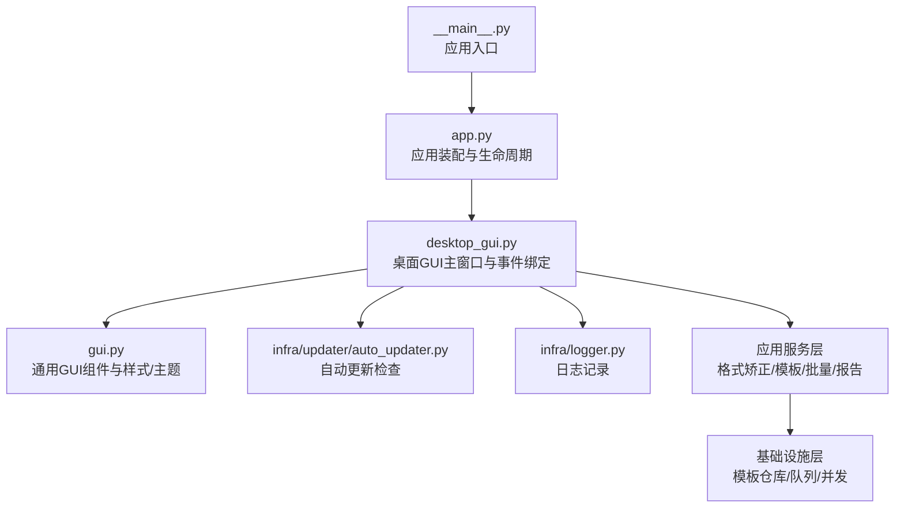
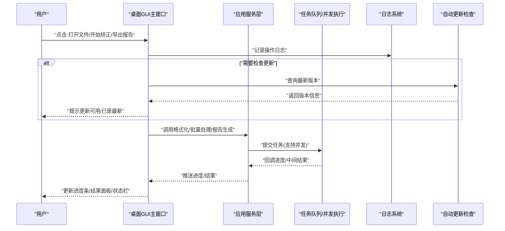
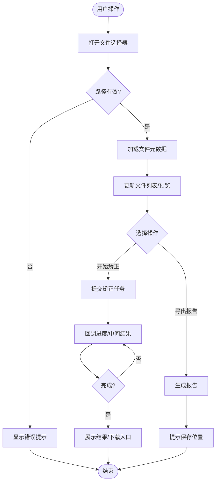
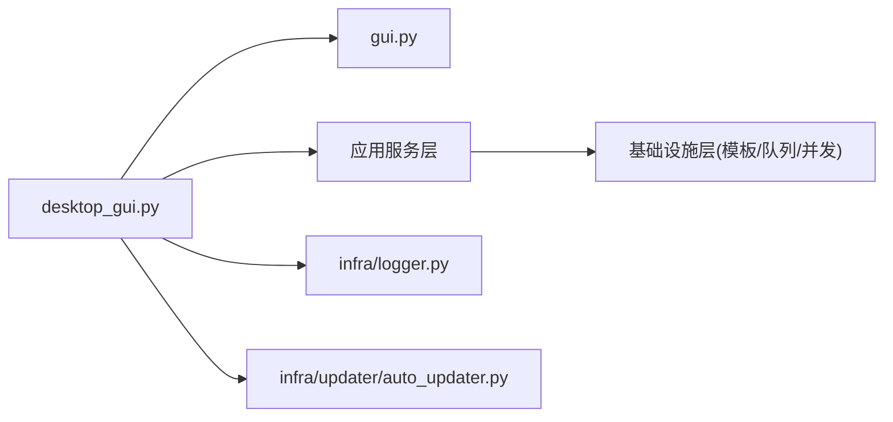

# 图形界面设计

<cite>
**本文引用的文件**   
- [src/paper_format_corrector/gui.py](file://src/paper_format_corrector/gui.py)
- [src/paper_format_corrector/desktop_gui.py](file://src/paper_format_corrector/desktop_gui.py)
- [src/paper_format_corrector/app.py](file://src/paper_format_corrector/app.py)
- [src/paper_format_corrector/__main__.py](file://src/paper_format_corrector/__main__.py)
- [src/paper_format_corrector/infra/updater/auto_updater.py](file://src/paper_format_corrector/infra/updater/auto_updater.py)
- [src/paper_format_corrector/infra/logger.py](file://src/paper_format_corrector/infra/logger.py)
- [config/config.yaml](file://config/config.yaml)
- [config/updater.yaml](file://config/updater.yaml)
</cite>

## 目录
1. [简介](#简介)
2. [项目结构](#项目结构)
3. [核心组件](#核心组件)
4. [架构总览](#架构总览)
5. [详细组件分析](#详细组件分析)
6. [依赖关系分析](#依赖关系分析)
7. [性能考虑](#性能考虑)
8. [故障排查指南](#故障排查指南)
9. [结论](#结论)
10. [附录](#附录)

## 简介
本文件聚焦于该项目的图形界面（GUI）设计与实现，覆盖以下方面：
- GUI 组件架构与模块划分
- 事件处理机制与用户交互流程
- 主窗口布局、对话框设计与控件状态管理
- 文件选择、进度显示、结果展示等核心功能的实现方式
- 界面定制与主题支持的配置方法
- 跨平台兼容性考虑与性能优化策略

## 项目结构
从入口到界面的关键路径如下：
- 应用启动入口负责初始化日志、加载配置并启动桌面 GUI。
- 桌面 GUI 层封装了主窗口、菜单、工具栏、状态栏、对话框及业务按钮的事件绑定。
- 业务服务层提供格式矫正、模板校验、批量处理、报告生成等能力。
- 基础设施层提供更新检查、日志记录、模板仓库、队列与并发执行等支撑。

图表来源
- [src/paper_format_corrector/__main__.py](file://src/paper_format_corrector/__main__.py)
- [src/paper_format_corrector/app.py](file://src/paper_format_corrector/app.py)
- [src/paper_format_corrector/desktop_gui.py](file://src/paper_format_corrector/desktop_gui.py)
- [src/paper_format_corrector/gui.py](file://src/paper_format_corrector/gui.py)
- [src/paper_format_corrector/infra/updater/auto_updater.py](file://src/paper_format_corrector/infra/updater/auto_updater.py)
- [src/paper_format_corrector/infra/logger.py](file://src/paper_format_corrector/infra/logger.py)

章节来源
- [src/paper_format_corrector/__main__.py](file://src/paper_format_corrector/__main__.py)
- [src/paper_format_corrector/app.py](file://src/paper_format_corrector/app.py)
- [src/paper_format_corrector/desktop_gui.py](file://src/paper_format_corrector/desktop_gui.py)
- [src/paper_format_corrector/gui.py](file://src/paper_format_corrector/gui.py)

## 核心组件
- 应用装配器：负责初始化日志、加载配置、创建并运行 GUI 主循环。
- 桌面 GUI 主窗口：组织主界面布局（左侧导航/列表、右侧预览/结果区、底部状态栏），绑定“打开文件”“开始矫正”“导出报告”“设置”“关于”等动作。
- 通用 GUI 组件：封装文件选择、进度条、消息提示、主题切换等可复用 UI 片段。
- 自动更新检查：在启动或菜单触发时检查新版本并提示安装。
- 日志系统：统一输出到控制台与文件，便于问题定位。

章节来源
- [src/paper_format_corrector/app.py](file://src/paper_format_corrector/app.py)
- [src/paper_format_corrector/desktop_gui.py](file://src/paper_format_corrector/desktop_gui.py)
- [src/paper_format_corrector/gui.py](file://src/paper_format_corrector/gui.py)
- [src/paper_format_corrector/infra/updater/auto_updater.py](file://src/paper_format_corrector/infra/updater/auto_updater.py)
- [src/paper_format_corrector/infra/logger.py](file://src/paper_format_corrector/infra/logger.py)

## 架构总览
下图展示了从用户操作到后台处理再到界面反馈的完整链路。

图表来源
- [src/paper_format_corrector/desktop_gui.py](file://src/paper_format_corrector/desktop_gui.py)
- [src/paper_format_corrector/gui.py](file://src/paper_format_corrector/gui.py)
- [src/paper_format_corrector/infra/updater/auto_updater.py](file://src/paper_format_corrector/infra/updater/auto_updater.py)
- [src/paper_format_corrector/infra/logger.py](file://src/paper_format_corrector/infra/logger.py)

## 详细组件分析

### 主窗口与布局
- 布局分区
  - 顶部：菜单栏与常用工具按钮（打开、保存、导出、设置、关于）。
  - 左侧：文件列表/模板选择/预设规则区域。
  - 中部：文档预览与差异对比视图。
  - 底部：状态栏（当前文件、统计信息）、进度条与操作日志摘要。
- 控件状态管理
  - 通过启用/禁用按钮控制“开始矫正”“停止”“导出”等动作。
  - 使用只读文本框/标签展示统计与错误摘要。
  - 进度条与状态栏联动，避免阻塞主线程。

章节来源
- [src/paper_format_corrector/desktop_gui.py](file://src/paper_format_corrector/desktop_gui.py)
- [src/paper_format_corrector/gui.py](file://src/paper_format_corrector/gui.py)

### 事件处理机制
- 事件源
  - 菜单项、工具栏按钮、快捷键、拖拽文件、右键上下文菜单。
- 事件路由
  - 主窗口集中注册事件处理器，按功能域分发至对应服务。
  - 异步任务回调将进度与结果回推至 UI。
- 典型流程
  - 打开文件：弹出文件选择器 -> 校验路径与权限 -> 加载文件元数据 -> 刷新左侧列表与预览区。
  - 开始矫正：收集输入参数 -> 提交任务 -> 轮询/回调更新进度 -> 完成后展示结果与下载链接。
  - 导出报告：聚合诊断与差异信息 -> 生成报告 -> 提示保存位置。

图表来源
- [src/paper_format_corrector/desktop_gui.py](file://src/paper_format_corrector/desktop_gui.py)
- [src/paper_format_corrector/gui.py](file://src/paper_format_corrector/gui.py)

章节来源
- [src/paper_format_corrector/desktop_gui.py](file://src/paper_format_corrector/desktop_gui.py)
- [src/paper_format_corrector/gui.py](file://src/paper_format_corrector/gui.py)

### 文件选择与预览
- 文件选择
  - 支持多选与拖拽；过滤常见文档后缀；对非法路径进行友好提示。
- 预览与差异
  - 基于轻量渲染展示文档结构与关键段落；差异视图高亮变更点。
- 状态同步
  - 选中文件变化时，右侧预览与底部统计同步刷新。

章节来源
- [src/paper_format_corrector/desktop_gui.py](file://src/paper_format_corrector/desktop_gui.py)
- [src/paper_format_corrector/gui.py](file://src/paper_format_corrector/gui.py)

### 进度显示与结果展示
- 进度显示
  - 使用进度条与状态栏双通道反馈；支持暂停/取消（若任务支持）。
- 结果展示
  - 结构化展示统计指标、错误清单与建议；提供一键复制/导出。
- 失败重试
  - 对可恢复错误提供重试入口；不可恢复错误给出明确原因与解决建议。

章节来源
- [src/paper_format_corrector/desktop_gui.py](file://src/paper_format_corrector/desktop_gui.py)
- [src/paper_format_corrector/gui.py](file://src/paper_format_corrector/gui.py)

### 对话框设计与交互
- 设置对话框
  - 包含输出目录、是否保留备份、并发数、日志级别等选项。
- 关于对话框
  - 展示版本、许可证、第三方依赖与更新渠道。
- 确认/警告对话框
  - 危险操作前二次确认；失败时给出可操作的修复建议。

章节来源
- [src/paper_format_corrector/desktop_gui.py](file://src/paper_format_corrector/desktop_gui.py)
- [src/paper_format_corrector/gui.py](file://src/paper_format_corrector/gui.py)

### 主题与界面定制
- 主题切换
  - 支持浅色/深色主题切换；可通过菜单或快捷键快速切换。
- 字体与字号
  - 允许调整全局字体与字号，提升可读性。
- 布局偏好
  - 记忆上次窗口大小与停靠位置；支持重置为默认布局。
- 配置来源
  - 配置文件集中管理界面相关选项，支持运行时热重载。

章节来源
- [src/paper_format_corrector/gui.py](file://src/paper_format_corrector/gui.py)
- [config/config.yaml](file://config/config.yaml)

### 自动更新检查
- 触发时机
  - 启动后静默检查；或在“关于/检查更新”菜单中手动触发。
- 行为说明
  - 有新版本则弹窗提示并提供下载链接；无更新则提示已是最新。
- 网络与超时
  - 设置合理超时与重试策略；失败不阻断主流程。

章节来源
- [src/paper_format_corrector/infra/updater/auto_updater.py](file://src/paper_format_corrector/infra/updater/auto_updater.py)
- [config/updater.yaml](file://config/updater.yaml)

## 依赖关系分析
- 模块耦合
  - 桌面 GUI 依赖通用 GUI 组件与服务层接口；服务层依赖基础设施（模板仓库、队列、并发）。
- 外部依赖
  - 日志、配置、网络请求、文件系统访问等由基础设施层统一封装。
- 潜在风险
  - 长耗时任务需确保非阻塞；网络请求需具备降级与超时保护。

图表来源
- [src/paper_format_corrector/desktop_gui.py](file://src/paper_format_corrector/desktop_gui.py)
- [src/paper_format_corrector/gui.py](file://src/paper_format_corrector/gui.py)
- [src/paper_format_corrector/infra/logger.py](file://src/paper_format_corrector/infra/logger.py)
- [src/paper_format_corrector/infra/updater/auto_updater.py](file://src/paper_format_corrector/infra/updater/auto_updater.py)

章节来源
- [src/paper_format_corrector/desktop_gui.py](file://src/paper_format_corrector/desktop_gui.py)
- [src/paper_format_corrector/gui.py](file://src/paper_format_corrector/gui.py)
- [src/paper_format_corrector/infra/logger.py](file://src/paper_format_corrector/infra/logger.py)
- [src/paper_format_corrector/infra/updater/auto_updater.py](file://src/paper_format_corrector/infra/updater/auto_updater.py)

## 性能考虑
- 主线程安全
  - 所有 UI 更新必须在主线程执行；后台任务通过回调或事件总线回传结果。
- 大文件处理
  - 采用分块读取与增量渲染；避免一次性加载超大文档导致卡顿。
- 并发与队列
  - 使用任务队列限制并发度，防止资源争用；对 I/O 密集任务使用线程池。
- 渲染优化
  - 延迟加载预览内容；差异视图仅渲染可见区域；必要时使用虚拟滚动。
- 内存管理
  - 及时释放不再使用的对象；避免持有大对象引用造成泄漏。

[本节为通用指导，无需特定文件来源]

## 故障排查指南
- 常见问题
  - 无法打开文件：检查路径权限与文件类型；查看日志中的具体错误码。
  - 进度卡住：确认后台任务是否被阻塞；检查并发数与磁盘写入速度。
  - 主题不生效：确认配置文件路径与键名；尝试重启应用。
  - 更新检查失败：检查网络连通性与代理设置；查看更新日志。
- 日志定位
  - 开启调试日志；关注时间戳与堆栈信息；结合操作序列复现问题。
- 快速恢复
  - 重置布局与主题；清理临时文件；重新导入模板与预设。

章节来源
- [src/paper_format_corrector/infra/logger.py](file://src/paper_format_corrector/infra/logger.py)
- [config/config.yaml](file://config/config.yaml)

## 结论
本项目 GUI 采用分层清晰的架构：入口装配、桌面主窗口、通用组件与服务层解耦。通过事件驱动与异步回调，实现了流畅的文件选择、进度反馈与结果展示体验。配合配置文件与主题机制，界面具备良好的可定制性。在跨平台与性能方面，遵循主线程安全、并发控制与渲染优化原则，确保稳定与高效。

[本节为总结性内容，无需特定文件来源]

## 附录
- 配置项参考
  - 界面主题、字体、窗口尺寸、日志级别、更新检查开关等均可在配置文件中调整。
- 扩展建议
  - 新增插件式工具栏按钮；引入多语言本地化；增加键盘导航与无障碍支持。

章节来源
- [config/config.yaml](file://config/config.yaml)
- [config/updater.yaml](file://config/updater.yaml)