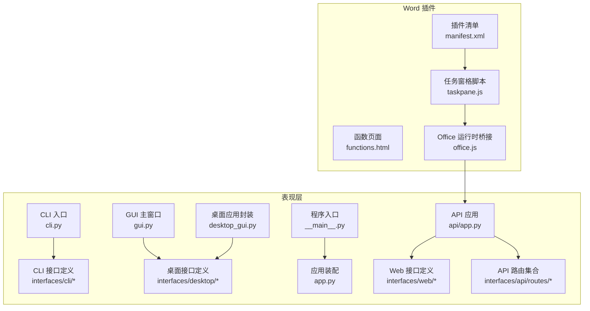
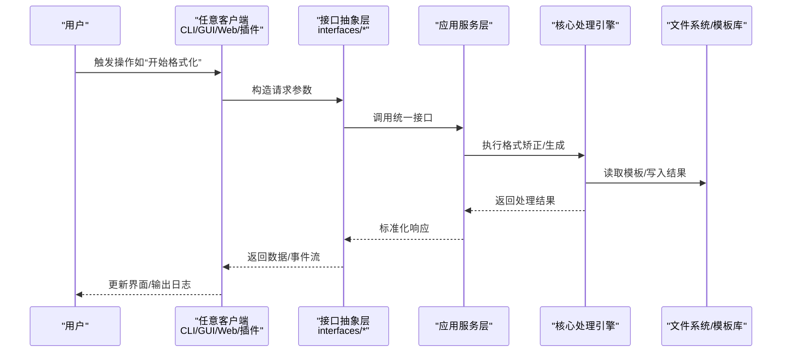
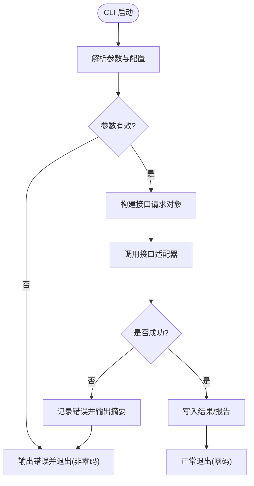
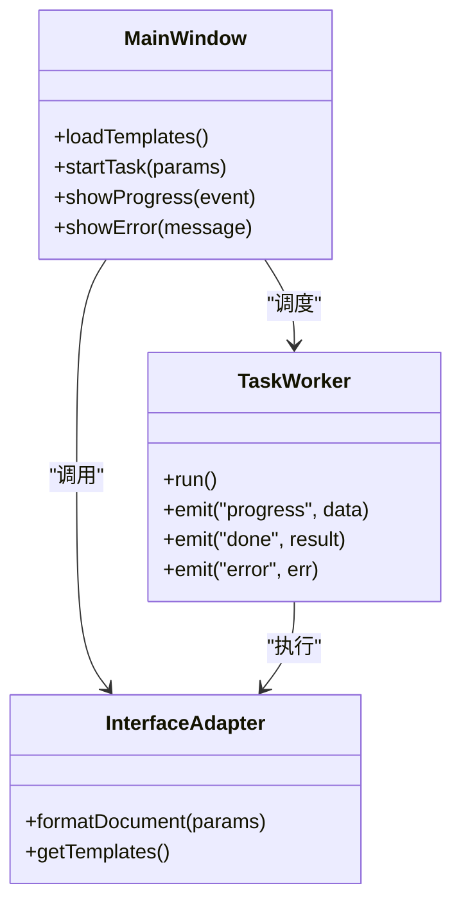
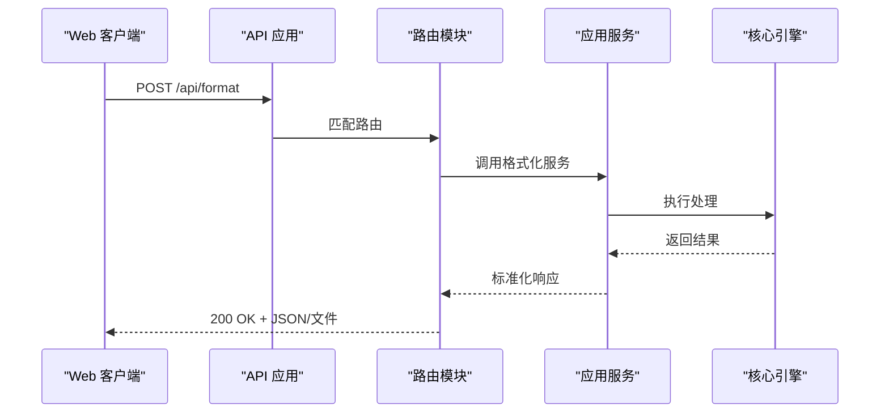
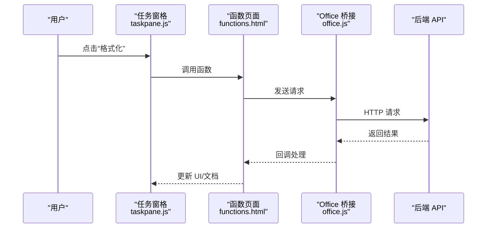
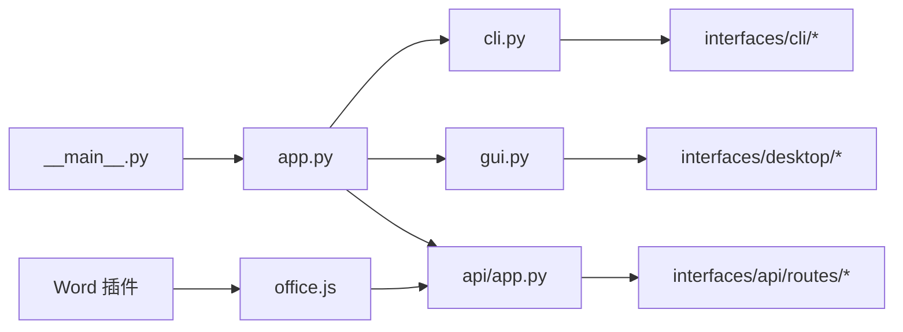

# 表现层设计

<cite>
**本文引用的文件**   
- [src/paper_format_corrector/cli.py](file://src/paper_format_corrector/cli.py)
- [src/paper_format_corrector/gui.py](file://src/paper_format_corrector/gui.py)
- [src/paper_format_corrector/desktop_gui.py](file://src/paper_format_corrector/desktop_gui.py)
- [src/paper_format_corrector/app.py](file://src/paper_format_corrector/app.py)
- [src/paper_format_corrector/__main__.py](file://src/paper_format_corrector/__main__.py)
- [src/paper_format_corrector/api/app.py](file://src/paper_format_corrector/api/app.py)
- [src/paper_format_corrector/interfaces/api/routes/](file://src/paper_format_corrector/interfaces/api/routes/)
- [src/paper_format_corrector/interfaces/cli/](file://src/paper_format_corrector/interfaces/cli/)
- [src/paper_format_corrector/interfaces/web/](file://src/paper_format_corrector/interfaces/web/)
- [src/paper_format_corrector/interfaces/desktop/](file://src/paper_format_corrector/interfaces/desktop/)
- [interfaces/word_addin/src/taskpane.js](file://interfaces/word_addin/src/taskpane.js)
- [interfaces/word_addin/src/functions.html](file://interfaces/word_addin/src/functions.html)
- [interfaces/word_addin/src/office.js](file://interfaces/word_addin/src/office.js)
- [interfaces/word_addin/manifest.xml](file://interfaces/word_addin/manifest.xml)
</cite>

## 目录
1. [简介](#简介)
2. [项目结构](#项目结构)
3. [核心组件](#核心组件)
4. [架构总览](#架构总览)
5. [详细组件分析](#详细组件分析)
6. [依赖关系分析](#依赖关系分析)
7. [性能考虑](#性能考虑)
8. [故障排查指南](#故障排查指南)
9. [结论](#结论)
10. [附录](#附录)

## 简介
本文件聚焦于表现层的整体设计与实现，覆盖命令行界面（CLI）、桌面图形界面（GUI）、Web API 以及 Word 插件等用户交互入口。文档将说明各界面的职责划分、用户交互流程与数据处理逻辑，解释接口抽象层如何统一不同界面的调用方式，并提供错误处理、用户反馈与状态管理的最佳实践建议。

## 项目结构
表现层位于 src/paper_format_corrector 下，按“应用服务 + 多端接口”的方式组织：
- CLI 入口与命令解析
- GUI 与桌面应用封装
- Web API 路由与应用装配
- interfaces 子包提供面向不同前端的接口定义与适配
- Word 插件位于独立的 interfaces/word_addin 目录，通过 Office JS 与后端通信

图表来源
- [src/paper_format_corrector/cli.py](file://src/paper_format_corrector/cli.py)
- [src/paper_format_corrector/gui.py](file://src/paper_format_corrector/gui.py)
- [src/paper_format_corrector/desktop_gui.py](file://src/paper_format_corrector/desktop_gui.py)
- [src/paper_format_corrector/app.py](file://src/paper_format_corrector/app.py)
- [src/paper_format_corrector/__main__.py](file://src/paper_format_corrector/__main__.py)
- [src/paper_format_corrector/api/app.py](file://src/paper_format_corrector/api/app.py)
- [interfaces/word_addin/src/taskpane.js](file://interfaces/word_addin/src/taskpane.js)
- [interfaces/word_addin/src/functions.html](file://interfaces/word_addin/src/functions.html)
- [interfaces/word_addin/src/office.js](file://interfaces/word_addin/src/office.js)
- [interfaces/word_addin/manifest.xml](file://interfaces/word_addin/manifest.xml)

章节来源
- [src/paper_format_corrector/cli.py](file://src/paper_format_corrector/cli.py)
- [src/paper_format_corrector/gui.py](file://src/paper_format_corrector/gui.py)
- [src/paper_format_corrector/desktop_gui.py](file://src/paper_format_corrector/desktop_gui.py)
- [src/paper_format_corrector/app.py](file://src/paper_format_corrector/app.py)
- [src/paper_format_corrector/__main__.py](file://src/paper_format_corrector/__main__.py)
- [src/paper_format_corrector/api/app.py](file://src/paper_format_corrector/api/app.py)
- [interfaces/word_addin/src/taskpane.js](file://interfaces/word_addin/src/taskpane.js)
- [interfaces/word_addin/src/functions.html](file://interfaces/word_addin/src/functions.html)
- [interfaces/word_addin/src/office.js](file://interfaces/word_addin/src/office.js)
- [interfaces/word_addin/manifest.xml](file://interfaces/word_addin/manifest.xml)

## 核心组件
- CLI 入口：负责参数解析、命令分发、进度输出与错误提示，直接调用应用服务或接口适配器。
- GUI 主窗口：基于桌面框架构建，承载任务选择、参数配置、结果展示与日志输出。
- 桌面应用封装：对 GUI 进行启动、生命周期管理与跨平台差异屏蔽。
- API 应用：HTTP 服务器装配、中间件注册、路由挂载与全局异常处理。
- 接口抽象层：在 interfaces 子包中定义统一的输入输出契约，供 CLI/GUI/API/插件复用。
- Word 插件：通过 Office JS 与任务窗格交互，调用后端 API 完成格式化任务并回写结果。

章节来源
- [src/paper_format_corrector/cli.py](file://src/paper_format_corrector/cli.py)
- [src/paper_format_corrector/gui.py](file://src/paper_format_corrector/gui.py)
- [src/paper_format_corrector/desktop_gui.py](file://src/paper_format_corrector/desktop_gui.py)
- [src/paper_format_corrector/app.py](file://src/paper_format_corrector/app.py)
- [src/paper_format_corrector/api/app.py](file://src/paper_format_corrector/api/app.py)
- [interfaces/word_addin/src/taskpane.js](file://interfaces/word_addin/src/taskpane.js)

## 架构总览
表现层采用“前端多端 + 统一接口抽象 + 后端服务”的分层模式。所有客户端（CLI/GUI/Web/插件）均通过接口抽象层访问业务功能，避免重复实现；Web API 作为集中式服务暴露 REST 能力，供浏览器与插件调用。

图表来源
- [src/paper_format_corrector/interfaces/cli/](file://src/paper_format_corrector/interfaces/cli/)
- [src/paper_format_corrector/interfaces/web/](file://src/paper_format_corrector/interfaces/web/)
- [src/paper_format_corrector/interfaces/desktop/](file://src/paper_format_corrector/interfaces/desktop/)
- [src/paper_format_corrector/api/app.py](file://src/paper_format_corrector/api/app.py)

## 详细组件分析

### CLI 组件分析
- 职责
  - 解析命令行参数与配置文件
  - 根据命令类型分发到对应处理流程
  - 输出进度与错误信息，支持静默模式
- 交互流程
  - 启动后加载配置与上下文
  - 校验输入路径与权限
  - 调用接口适配器执行任务
  - 输出结果文件或报告
- 数据处理
  - 将 CLI 参数映射为接口 DTO
  - 接收结构化响应并转换为人类可读文本
- 错误处理与反馈
  - 捕获 IO 异常、参数校验失败、模板缺失等
  - 使用退出码区分错误类别，便于自动化集成

图表来源
- [src/paper_format_corrector/cli.py](file://src/paper_format_corrector/cli.py)
- [src/paper_format_corrector/interfaces/cli/](file://src/paper_format_corrector/interfaces/cli/)

章节来源
- [src/paper_format_corrector/cli.py](file://src/paper_format_corrector/cli.py)
- [src/paper_format_corrector/interfaces/cli/](file://src/paper_format_corrector/interfaces/cli/)

### GUI 组件分析
- 职责
  - 提供可视化任务选择、参数配置、预览与导出
  - 管理线程与异步任务，避免阻塞 UI
  - 实时显示进度、日志与错误提示
- 交互流程
  - 用户选择模板与输入文件
  - 点击“开始”触发后台任务
  - 任务完成后弹出结果或自动保存
- 数据处理
  - 将表单值序列化为接口 DTO
  - 订阅任务事件，增量更新 UI
- 错误处理与反馈
  - 捕获网络/IO 异常，弹窗提示并引导重试
  - 提供“查看日志”入口，定位问题

图表来源
- [src/paper_format_corrector/gui.py](file://src/paper_format_corrector/gui.py)
- [src/paper_format_corrector/interfaces/desktop/](file://src/paper_format_corrector/interfaces/desktop/)

章节来源
- [src/paper_format_corrector/gui.py](file://src/paper_format_corrector/gui.py)
- [src/paper_format_corrector/interfaces/desktop/](file://src/paper_format_corrector/interfaces/desktop/)

### 桌面应用封装分析
- 职责
  - 初始化 GUI 应用实例
  - 处理系统事件与退出信号
  - 跨平台差异适配（如 DPI、字体、路径分隔符）
- 关键点
  - 单例应用对象管理
  - 资源清理与崩溃恢复

章节来源
- [src/paper_format_corrector/desktop_gui.py](file://src/paper_format_corrector/desktop_gui.py)

### Web API 组件分析
- 职责
  - 启动 HTTP 服务，注册中间件（CORS、鉴权、限流等）
  - 挂载路由模块，统一异常与日志
  - 提供批量任务、模板管理、结果查询等接口
- 交互流程
  - 客户端发起 REST 请求
  - 路由解析参数并调用应用服务
  - 返回 JSON 响应或文件下载流
- 错误处理与反馈
  - 全局异常处理器捕获未处理异常，返回标准错误体
  - 针对业务错误返回明确的状态码与消息

图表来源
- [src/paper_format_corrector/api/app.py](file://src/paper_format_corrector/api/app.py)
- [src/paper_format_corrector/interfaces/api/routes/](file://src/paper_format_corrector/interfaces/api/routes/)

章节来源
- [src/paper_format_corrector/api/app.py](file://src/paper_format_corrector/api/app.py)
- [src/paper_format_corrector/interfaces/api/routes/](file://src/paper_format_corrector/interfaces/api/routes/)

### Word 插件组件分析
- 职责
  - 在 Word 任务窗格中提供操作面板
  - 通过 Office JS 调用后端 API 完成格式化
  - 将结果回写到当前文档或提示用户保存
- 交互流程
  - 打开插件 -> 加载任务窗格 -> 选择模板与参数
  - 调用 functions.html 中的函数 -> office.js 桥接到后端
  - 接收响应并更新文档内容或提示
- 错误处理与反馈
  - 捕获 Office 运行时错误与网络异常
  - 在任务窗格内显示友好提示与重试按钮

图表来源
- [interfaces/word_addin/src/taskpane.js](file://interfaces/word_addin/src/taskpane.js)
- [interfaces/word_addin/src/functions.html](file://interfaces/word_addin/src/functions.html)
- [interfaces/word_addin/src/office.js](file://interfaces/word_addin/src/office.js)
- [interfaces/word_addin/manifest.xml](file://interfaces/word_addin/manifest.xml)

章节来源
- [interfaces/word_addin/src/taskpane.js](file://interfaces/word_addin/src/taskpane.js)
- [interfaces/word_addin/src/functions.html](file://interfaces/word_addin/src/functions.html)
- [interfaces/word_addin/src/office.js](file://interfaces/word_addin/src/office.js)
- [interfaces/word_addin/manifest.xml](file://interfaces/word_addin/manifest.xml)

### 接口抽象层设计
- 目标
  - 统一 CLI/GUI/Web/插件的调用方式，屏蔽底层差异
  - 定义一致的输入输出契约（DTO），便于测试与替换实现
- 设计要点
  - 每个前端类型在 interfaces 下拥有独立子包，声明其接口方法
  - 上层仅依赖接口，不关心具体实现（CLI 直调、GUI 异步、Web 通过 HTTP）
  - 错误模型与状态码在各端保持一致，便于统一处理
- 示例（以路径表示）
  - CLI 接口定义：[interfaces/cli/](file://src/paper_format_corrector/interfaces/cli/)
  - Web 接口定义：[interfaces/web/](file://src/paper_format_corrector/interfaces/web/)
  - 桌面接口定义：[interfaces/desktop/](file://src/paper_format_corrector/interfaces/desktop/)

章节来源
- [src/paper_format_corrector/interfaces/cli/](file://src/paper_format_corrector/interfaces/cli/)
- [src/paper_format_corrector/interfaces/web/](file://src/paper_format_corrector/interfaces/web/)
- [src/paper_format_corrector/interfaces/desktop/](file://src/paper_format_corrector/interfaces/desktop/)

## 依赖关系分析
表现层内部依赖关系如下：
- __main__.py 负责装配 app.py，再根据运行环境启动 CLI/GUI/API
- CLI/GUI 分别依赖各自接口抽象层
- API 依赖路由模块与服务层
- Word 插件依赖 Office JS 与后端 API

图表来源
- [src/paper_format_corrector/__main__.py](file://src/paper_format_corrector/__main__.py)
- [src/paper_format_corrector/app.py](file://src/paper_format_corrector/app.py)
- [src/paper_format_corrector/cli.py](file://src/paper_format_corrector/cli.py)
- [src/paper_format_corrector/gui.py](file://src/paper_format_corrector/gui.py)
- [src/paper_format_corrector/api/app.py](file://src/paper_format_corrector/api/app.py)
- [interfaces/word_addin/src/office.js](file://interfaces/word_addin/src/office.js)

章节来源
- [src/paper_format_corrector/__main__.py](file://src/paper_format_corrector/__main__.py)
- [src/paper_format_corrector/app.py](file://src/paper_format_corrector/app.py)
- [src/paper_format_corrector/cli.py](file://src/paper_format_corrector/cli.py)
- [src/paper_format_corrector/gui.py](file://src/paper_format_corrector/gui.py)
- [src/paper_format_corrector/api/app.py](file://src/paper_format_corrector/api/app.py)
- [interfaces/word_addin/src/office.js](file://interfaces/word_addin/src/office.js)

## 性能考虑
- 异步与并发
  - GUI 使用工作线程/事件循环避免阻塞 UI
  - API 支持并发请求，结合连接池与缓存减少 I/O 开销
- 大文件处理
  - 分块读取与流式处理，降低内存峰值
  - 任务队列与进度上报，提升用户体验
- 模板与资源
  - 预加载常用模板，按需懒加载大型资源
  - 静态资源压缩与 CDN 加速（Web）

## 故障排查指南
- 常见问题
  - 参数校验失败：检查输入路径、模板名称与必填字段
  - 模板缺失或损坏：确认模板仓库可用性与版本一致性
  - 权限不足：确保对输入/输出目录有读写权限
  - 网络异常（Web/插件）：检查代理、证书与后端可达性
- 诊断手段
  - 启用调试日志，定位错误堆栈
  - 使用最小复现用例与隔离测试
  - 对比前后端错误码与消息，快速对齐问题域

章节来源
- [src/paper_format_corrector/cli.py](file://src/paper_format_corrector/cli.py)
- [src/paper_format_corrector/gui.py](file://src/paper_format_corrector/gui.py)
- [src/paper_format_corrector/api/app.py](file://src/paper_format_corrector/api/app.py)

## 结论
表现层通过清晰的职责划分与接口抽象，实现了 CLI、GUI、Web API 与 Word 插件的统一接入。该设计提升了可维护性与可扩展性，同时为错误处理、用户反馈与状态管理提供了良好基础。后续可在接口契约完善、性能监控与可观测性方面持续优化。

## 附录
- 参考入口
  - 程序入口：[src/paper_format_corrector/__main__.py](file://src/paper_format_corrector/__main__.py)
  - 应用装配：[src/paper_format_corrector/app.py](file://src/paper_format_corrector/app.py)
  - CLI 入口：[src/paper_format_corrector/cli.py](file://src/paper_format_corrector/cli.py)
  - GUI 主窗口：[src/paper_format_corrector/gui.py](file://src/paper_format_corrector/gui.py)
  - 桌面封装：[src/paper_format_corrector/desktop_gui.py](file://src/paper_format_corrector/desktop_gui.py)
  - API 应用：[src/paper_format_corrector/api/app.py](file://src/paper_format_corrector/api/app.py)
  - Word 插件：
    - 任务窗格：[interfaces/word_addin/src/taskpane.js](file://interfaces/word_addin/src/taskpane.js)
    - 函数页面：[interfaces/word_addin/src/functions.html](file://interfaces/word_addin/src/functions.html)
    - Office 桥接：[interfaces/word_addin/src/office.js](file://interfaces/word_addin/src/office.js)
    - 插件清单：[interfaces/word_addin/manifest.xml](file://interfaces/word_addin/manifest.xml)