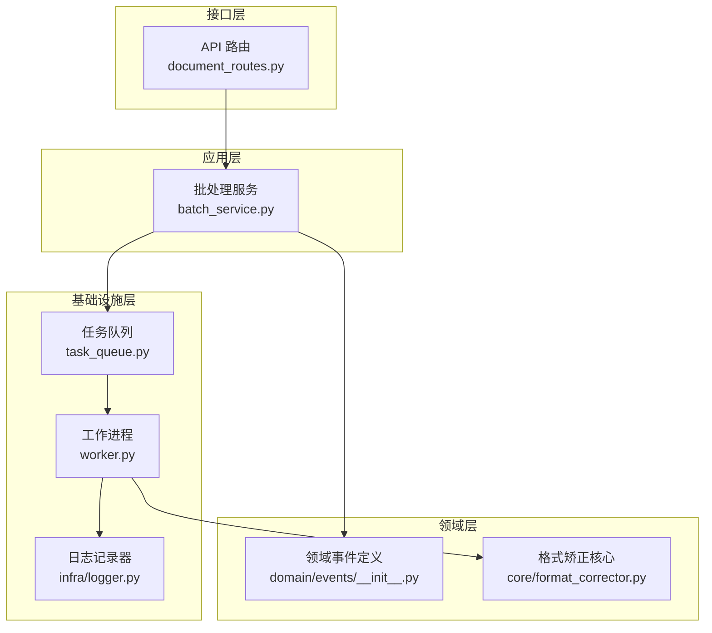
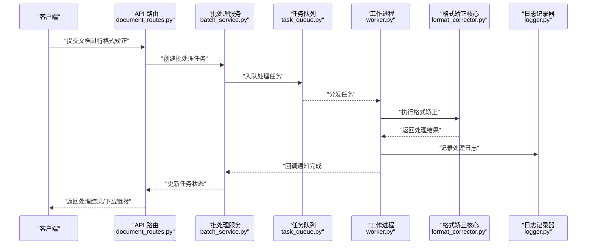
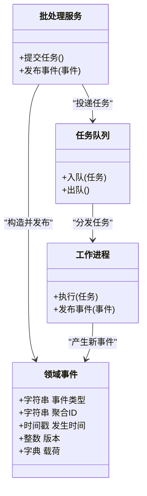

# 领域事件设计

<cite>
**本文引用的文件**   
- [src/paper_format_corrector/domain/events/__init__.py](file://src/paper_format_corrector/domain/events/__init__.py)
- [src/paper_format_corrector/infrastructure/queue/task_queue.py](file://src/paper_format_corrector/infrastructure/queue/task_queue.py)
- [src/paper_format_corrector/infrastructure/queue/worker.py](file://src/paper_format_corrector/infrastructure/queue/worker.py)
- [src/paper_format_corrector/application/services/batch_service.py](file://src/paper_format_corrector/application/services/batch_service.py)
- [src/paper_format_corrector/core/format_corrector.py](file://src/paper_format_corrector/core/format_corrector.py)
- [src/paper_format_corrector/interfaces/api/routes/document_routes.py](file://src/paper_format_corrector/interfaces/api/routes/document_routes.py)
- [src/paper_format_corrector/infra/logger.py](file://src/paper_format_corrector/infra/logger.py)
</cite>

## 目录
1. [简介](#简介)
2. [项目结构](#项目结构)
3. [核心组件](#核心组件)
4. [架构总览](#架构总览)
5. [详细组件分析](#详细组件分析)
6. [依赖关系分析](#依赖关系分析)
7. [性能考量](#性能考量)
8. [故障排查指南](#故障排查指南)
9. [结论](#结论)
10. [附录](#附录)

## 简介
本文件围绕“论文格式矫正”场景，系统化阐述领域事件的设计与落地方案。重点包括：
- 发布订阅模式与事件驱动架构在文档处理流水线中的应用
- 事件命名规范、事件载荷设计与版本兼容性策略
- 事件溯源与事件风暴在该领域的适用性与实践建议
- 事件定义、发布与订阅处理的示例路径
- 一致性保证与异常处理机制
- 事件存储与查询的最佳实践

## 项目结构
本项目采用分层与模块化组织方式，领域层负责抽象业务概念（实体、值对象、领域服务、领域事件），应用层编排用例，基础设施层提供队列、持久化、外部工具等能力。当前仓库尚未实现完整的领域事件总线，但已具备可落地的基础构件（任务队列、工作进程）以及若干服务入口，可作为事件驱动改造的起点。

图表来源
- [src/paper_format_corrector/interfaces/api/routes/document_routes.py](file://src/paper_format_corrector/interfaces/api/routes/document_routes.py)
- [src/paper_format_corrector/application/services/batch_service.py](file://src/paper_format_corrector/application/services/batch_service.py)
- [src/paper_format_corrector/domain/events/__init__.py](file://src/paper_format_corrector/domain/events/__init__.py)
- [src/paper_format_corrector/core/format_corrector.py](file://src/paper_format_corrector/core/format_corrector.py)
- [src/paper_format_corrector/infrastructure/queue/task_queue.py](file://src/paper_format_corrector/infrastructure/queue/task_queue.py)
- [src/paper_format_corrector/infrastructure/queue/worker.py](file://src/paper_format_corrector/infrastructure/queue/worker.py)
- [src/paper_format_corrector/infra/logger.py](file://src/paper_format_corrector/infra/logger.py)

章节来源
- [src/paper_format_corrector/domain/events/__init__.py](file://src/paper_format_corrector/domain/events/__init__.py)
- [src/paper_format_corrector/infrastructure/queue/task_queue.py](file://src/paper_format_corrector/infrastructure/queue/task_queue.py)
- [src/paper_format_corrector/infrastructure/queue/worker.py](file://src/paper_format_corrector/infrastructure/queue/worker.py)
- [src/paper_format_corrector/application/services/batch_service.py](file://src/paper_format_corrector/application/services/batch_service.py)
- [src/paper_format_corrector/core/format_corrector.py](file://src/paper_format_corrector/core/format_corrector.py)
- [src/paper_format_corrector/interfaces/api/routes/document_routes.py](file://src/paper_format_corrector/interfaces/api/routes/document_routes.py)
- [src/paper_format_corrector/infra/logger.py](file://src/paper_format_corrector/infra/logger.py)

## 核心组件
- 领域事件定义模块：用于集中声明领域事件类型与载荷结构，作为后续发布订阅的基础契约。
- 任务队列与工作进程：提供异步任务调度与执行能力，是构建事件驱动流水线的关键基础设施。
- 批处理服务：编排文档批量处理流程，适合作为事件发布者或协调者。
- 格式矫正核心：承载具体格式化规则与转换逻辑，适合被事件处理器调用。
- API 路由：暴露对外接口，触发处理流程并返回结果。
- 日志记录器：贯穿各层的可观测性支撑。

章节来源
- [src/paper_format_corrector/domain/events/__init__.py](file://src/paper_format_corrector/domain/events/__init__.py)
- [src/paper_format_corrector/infrastructure/queue/task_queue.py](file://src/paper_format_corrector/infrastructure/queue/task_queue.py)
- [src/paper_format_corrector/infrastructure/queue/worker.py](file://src/paper_format_corrector/infrastructure/queue/worker.py)
- [src/paper_format_corrector/application/services/batch_service.py](file://src/paper_format_corrector/application/services/batch_service.py)
- [src/paper_format_corrector/core/format_corrector.py](file://src/paper_format_corrector/core/format_corrector.py)
- [src/paper_format_corrector/interfaces/api/routes/document_routes.py](file://src/paper_format_corrector/interfaces/api/routes/document_routes.py)
- [src/paper_format_corrector/infra/logger.py](file://src/paper_format_corrector/infra/logger.py)

## 架构总览
下图展示从 API 请求到后台处理、再到结果回传的端到端流程，强调以事件为纽带解耦各阶段职责。

图表来源
- [src/paper_format_corrector/interfaces/api/routes/document_routes.py](file://src/paper_format_corrector/interfaces/api/routes/document_routes.py)
- [src/paper_format_corrector/application/services/batch_service.py](file://src/paper_format_corrector/application/services/batch_service.py)
- [src/paper_format_corrector/infrastructure/queue/task_queue.py](file://src/paper_format_corrector/infrastructure/queue/task_queue.py)
- [src/paper_format_corrector/infrastructure/queue/worker.py](file://src/paper_format_corrector/infrastructure/queue/worker.py)
- [src/paper_format_corrector/core/format_corrector.py](file://src/paper_format_corrector/core/format_corrector.py)
- [src/paper_format_corrector/infra/logger.py](file://src/paper_format_corrector/infra/logger.py)

## 详细组件分析

### 领域事件定义与命名规范
- 命名规范
  - 使用“动词+名词+后缀”的形式表达已发生的事实，例如“文档已提交”“格式矫正已完成”。
  - 统一使用小写下划线分隔，避免歧义；按聚合根划分命名空间，如“文档.”前缀。
  - 事件名应反映业务语义而非技术细节，便于跨团队理解。
- 载荷设计
  - 包含最小必要上下文：聚合标识、时间戳、版本、操作人/来源、相关资源引用。
  - 将可变字段与稳定字段分离，便于向后兼容。
  - 对大对象（如全文内容）不直接放入事件载荷，改为引用唯一资源 ID。
- 版本兼容性策略
  - 事件模型引入版本号字段，消费者根据版本选择解析策略。
  - 新增字段默认可选且带默认值；删除字段需保留一段时间并提供迁移脚本。
  - 通过“事件适配器”在消费端做版本桥接，避免破坏式变更。

章节来源
- [src/paper_format_corrector/domain/events/__init__.py](file://src/paper_format_corrector/domain/events/__init__.py)

### 事件发布与订阅（基于现有队列）
- 发布侧
  - 在批处理服务中，当进入关键阶段（如开始矫正、完成导出）时，构造领域事件并写入持久化事件流。
  - 同时向任务队列投递下游处理任务，形成“事件 + 任务”的双通道。
- 订阅侧
  - 工作进程从队列拉取任务，执行业务逻辑后，再产出新的领域事件（如“导出完成”）。
  - 事件处理器可根据事件类型分派到不同处理函数，实现松耦合扩展。
- 示例路径（定义、发布、订阅）
  - 事件定义位置：[src/paper_format_corrector/domain/events/__init__.py](file://src/paper_format_corrector/domain/events/__init__.py)
  - 发布入口参考：[src/paper_format_corrector/application/services/batch_service.py](file://src/paper_format_corrector/application/services/batch_service.py)
  - 订阅执行参考：[src/paper_format_corrector/infrastructure/queue/worker.py](file://src/paper_format_corrector/infrastructure/queue/worker.py)

图表来源
- [src/paper_format_corrector/domain/events/__init__.py](file://src/paper_format_corrector/domain/events/__init__.py)
- [src/paper_format_corrector/application/services/batch_service.py](file://src/paper_format_corrector/application/services/batch_service.py)
- [src/paper_format_corrector/infrastructure/queue/task_queue.py](file://src/paper_format_corrector/infrastructure/queue/task_queue.py)
- [src/paper_format_corrector/infrastructure/queue/worker.py](file://src/paper_format_corrector/infrastructure/queue/worker.py)

章节来源
- [src/paper_format_corrector/application/services/batch_service.py](file://src/paper_format_corrector/application/services/batch_service.py)
- [src/paper_format_corrector/infrastructure/queue/worker.py](file://src/paper_format_corrector/infrastructure/queue/worker.py)
- [src/paper_format_corrector/domain/events/__init__.py](file://src/paper_format_corrector/domain/events/__init__.py)

### 事件一致性保证与异常处理
- 幂等性
  - 所有事件处理器必须幂等，依据事件唯一 ID 去重，防止重复消费导致副作用。
- 事务边界
  - 优先采用“先写事件流，再投递任务”的顺序；若失败则补偿回滚。
  - 对于强一致需求，可在同一事务内持久化事件与状态快照。
- 重试与死信
  - 对瞬时错误采用指数退避重试；超过阈值转入死信队列以便人工干预。
- 补偿与回滚
  - 针对不可逆副作用，设计反向事件或补偿动作，确保最终一致性。
- 监控与审计
  - 记录事件生命周期（生产、投递、消费、失败、重试）全链路日志。

章节来源
- [src/paper_format_corrector/infra/logger.py](file://src/paper_format_corrector/infra/logger.py)

### 事件存储与查询最佳实践
- 存储选型
  - 使用追加型事件流数据库或对象存储（按聚合 ID 分区），保证顺序与不可变性。
- 索引与查询
  - 建立聚合 ID、时间范围、事件类型索引；按需维护投影表加速读查询。
- 回放与重建
  - 支持按聚合或全局范围回放事件，重建快照或衍生视图。
- 压缩与归档
  - 对冷数据定期压缩归档，保持热数据规模可控。

章节来源
- [src/paper_format_corrector/infra/logger.py](file://src/paper_format_corrector/infra/logger.py)

### 事件风暴与事件溯源在论文格式矫正中的应用
- 事件风暴
  - 通过工作坊梳理“文档提交—解析—规则校验—修正—导出—归档”的关键事件，识别聚合边界与命令。
  - 输出领域模型草图，指导后续事件定义与服务拆分。
- 事件溯源
  - 将文档处理过程以事件序列持久化，支持任意时间点回溯与差异对比。
  - 结合快照减少长历史回放成本，提升查询性能。
- 典型事件清单（示例）
  - 文档已提交、解析完成、规则校验完成、格式已修正、导出完成、归档完成、导出失败等。

章节来源
- [src/paper_format_corrector/domain/events/__init__.py](file://src/paper_format_corrector/domain/events/__init__.py)

### 代码级示例路径（定义、发布、订阅）
- 事件定义
  - 参考：[src/paper_format_corrector/domain/events/__init__.py](file://src/paper_format_corrector/domain/events/__init__.py)
- 事件发布
  - 参考：[src/paper_format_corrector/application/services/batch_service.py](file://src/paper_format_corrector/application/services/batch_service.py)
- 事件订阅与处理
  - 参考：[src/paper_format_corrector/infrastructure/queue/worker.py](file://src/paper_format_corrector/infrastructure/queue/worker.py)
- 触发入口
  - 参考：[src/paper_format_corrector/interfaces/api/routes/document_routes.py](file://src/paper_format_corrector/interfaces/api/routes/document_routes.py)
- 核心处理
  - 参考：[src/paper_format_corrector/core/format_corrector.py](file://src/paper_format_corrector/core/format_corrector.py)

章节来源
- [src/paper_format_corrector/domain/events/__init__.py](file://src/paper_format_corrector/domain/events/__init__.py)
- [src/paper_format_corrector/application/services/batch_service.py](file://src/paper_format_corrector/application/services/batch_service.py)
- [src/paper_format_corrector/infrastructure/queue/worker.py](file://src/paper_format_corrector/infrastructure/queue/worker.py)
- [src/paper_format_corrector/interfaces/api/routes/document_routes.py](file://src/paper_format_corrector/interfaces/api/routes/document_routes.py)
- [src/paper_format_corrector/core/format_corrector.py](file://src/paper_format_corrector/core/format_corrector.py)

## 依赖关系分析
- 低耦合高内聚
  - 领域事件作为契约，隔离了生产者与消费者，降低模块间耦合度。
- 关键依赖链
  - API 路由 → 批处理服务 → 任务队列 → 工作进程 → 格式矫正核心
- 潜在风险
  - 队列积压导致延迟放大；需关注背压与限流。
  - 事件版本升级需兼顾旧消费者，避免中断。

图表来源
- [src/paper_format_corrector/interfaces/api/routes/document_routes.py](file://src/paper_format_corrector/interfaces/api/routes/document_routes.py)
- [src/paper_format_corrector/application/services/batch_service.py](file://src/paper_format_corrector/application/services/batch_service.py)
- [src/paper_format_corrector/infrastructure/queue/task_queue.py](file://src/paper_format_corrector/infrastructure/queue/task_queue.py)
- [src/paper_format_corrector/infrastructure/queue/worker.py](file://src/paper_format_corrector/infrastructure/queue/worker.py)
- [src/paper_format_corrector/core/format_corrector.py](file://src/paper_format_corrector/core/format_corrector.py)

章节来源
- [src/paper_format_corrector/interfaces/api/routes/document_routes.py](file://src/paper_format_corrector/interfaces/api/routes/document_routes.py)
- [src/paper_format_corrector/application/services/batch_service.py](file://src/paper_format_corrector/application/services/batch_service.py)
- [src/paper_format_corrector/infrastructure/queue/task_queue.py](file://src/paper_format_corrector/infrastructure/queue/task_queue.py)
- [src/paper_format_corrector/infrastructure/queue/worker.py](file://src/paper_format_corrector/infrastructure/queue/worker.py)
- [src/paper_format_corrector/core/format_corrector.py](file://src/paper_format_corrector/core/format_corrector.py)

## 性能考量
- 批处理与并行
  - 合理设置队列并发度，避免 I/O 热点；对 CPU 密集型步骤启用进程池。
- 事件大小控制
  - 仅传递必要上下文，大对象走对象存储并以 ID 引用。
- 背压与限流
  - 在队列层实现限速与降级策略，保护下游系统。
- 缓存与快照
  - 对频繁读取的聚合状态维护快照，缩短回放路径。

## 故障排查指南
- 常见问题定位
  - 事件未消费：检查队列堆积、消费者健康状态与重试次数。
  - 重复处理：确认事件 ID 幂等键是否生效。
  - 版本不兼容：核对事件版本与消费者适配逻辑。
- 可观测性
  - 利用日志记录器记录关键节点耗时与错误堆栈，配合指标面板快速定位瓶颈。
- 恢复策略
  - 对失败事件进行死信归档，提供离线修复与回放工具。

章节来源
- [src/paper_format_corrector/infra/logger.py](file://src/paper_format_corrector/infra/logger.py)

## 结论
通过引入领域事件与事件驱动架构，可将论文格式矫正流程中的多阶段处理解耦，提升可扩展性与可维护性。结合事件风暴明确领域边界，借助事件溯源增强可追溯性与可回放能力，并在一致性、异常处理、存储与查询方面遵循最佳实践，能够构建稳健、高性能的文档处理平台。

## 附录
- 术语
  - 领域事件：描述业务领域中已发生事实的不可变记录。
  - 事件溯源：以事件序列作为系统状态的权威来源。
  - 事件风暴：通过可视化工作坊识别领域事件与聚合的方法。
- 参考路径
  - 事件定义：[src/paper_format_corrector/domain/events/__init__.py](file://src/paper_format_corrector/domain/events/__init__.py)
  - 批处理服务：[src/paper_format_corrector/application/services/batch_service.py](file://src/paper_format_corrector/application/services/batch_service.py)
  - 任务队列：[src/paper_format_corrector/infrastructure/queue/task_queue.py](file://src/paper_format_corrector/infrastructure/queue/task_queue.py)
  - 工作进程：[src/paper_format_corrector/infrastructure/queue/worker.py](file://src/paper_format_corrector/infrastructure/queue/worker.py)
  - 格式矫正核心：[src/paper_format_corrector/core/format_corrector.py](file://src/paper_format_corrector/core/format_corrector.py)
  - API 路由：[src/paper_format_corrector/interfaces/api/routes/document_routes.py](file://src/paper_format_corrector/interfaces/api/routes/document_routes.py)
  - 日志记录器：[src/paper_format_corrector/infra/logger.py](file://src/paper_format_corrector/infra/logger.py)