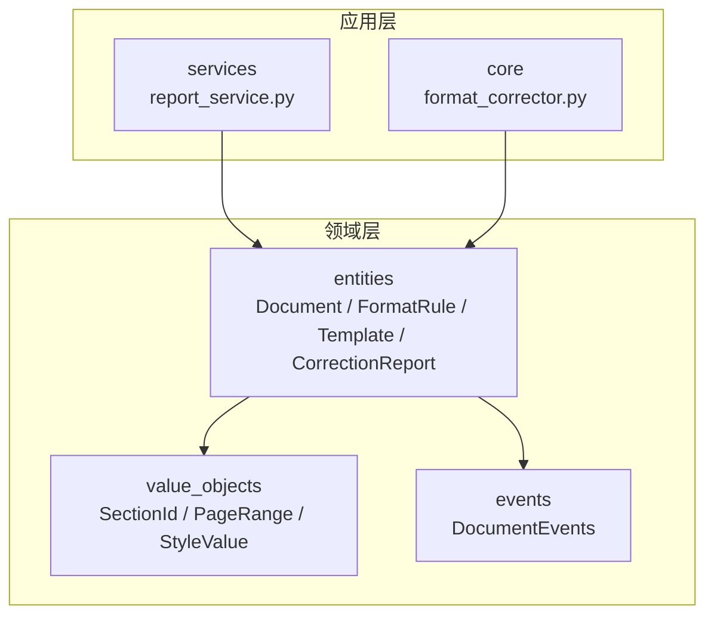
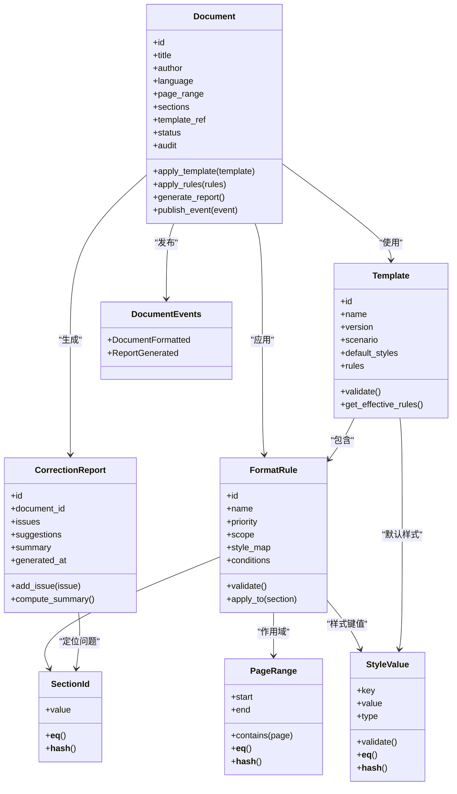
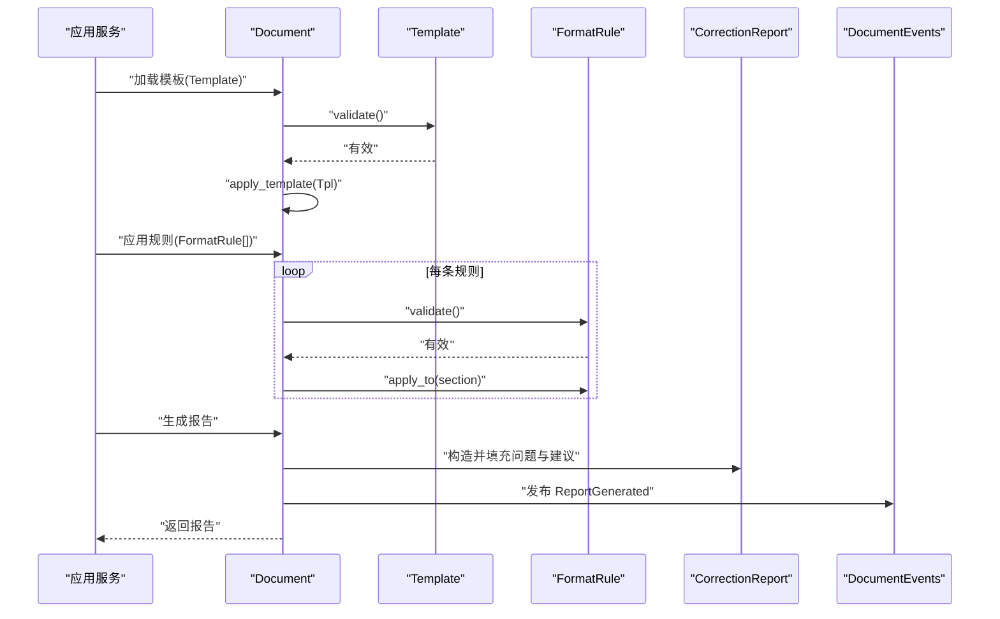
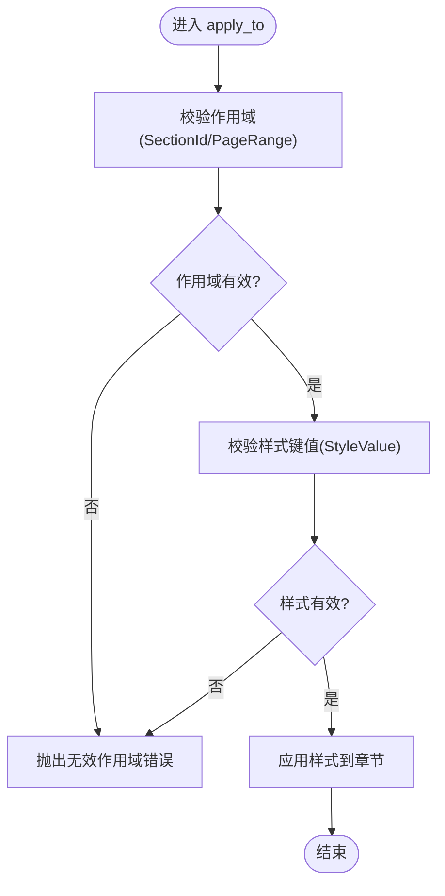
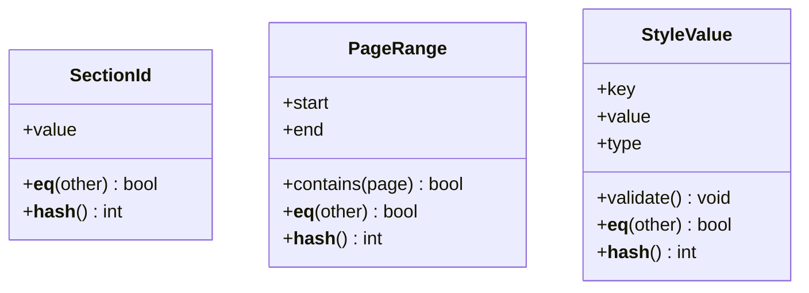
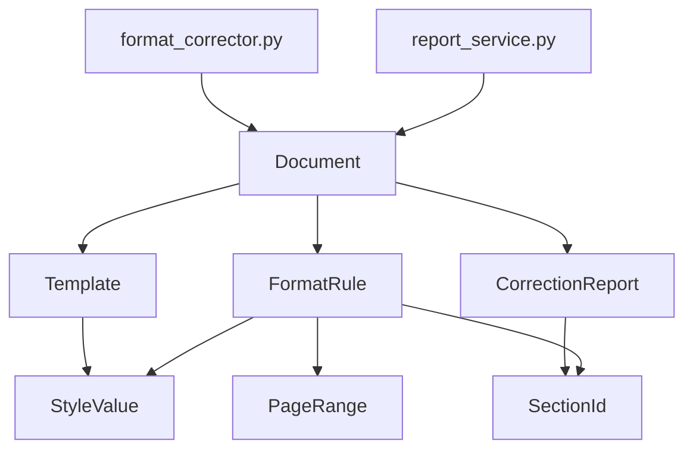

# 领域实体设计

<cite>
**本文引用的文件**   
- [src/paper_format_corrector/domain/entities/document.py](file://src/paper_format_corrector/domain/entities/document.py)
- [src/paper_format_corrector/domain/entities/format_rule.py](file://src/paper_format_corrector/domain/entities/format_rule.py)
- [src/paper_format_corrector/domain/entities/template.py](file://src/paper_format_corrector/domain/entities/template.py)
- [src/paper_format_corrector/domain/entities/correction_report.py](file://src/paper_format_corrector/domain/entities/correction_report.py)
- [src/paper_format_corrector/domain/value_objects/section_id.py](file://src/paper_format_corrector/domain/value_objects/section_id.py)
- [src/paper_format_corrector/domain/value_objects/page_range.py](file://src/paper_format_corrector/domain/value_objects/page_range.py)
- [src/paper_format_corrector/domain/value_objects/style_value.py](file://src/paper_format_corrector/domain/value_objects/style_value.py)
- [src/paper_format_corrector/domain/events/document_events.py](file://src/paper_format_corrector/domain/events/document_events.py)
- [src/paper_format_corrector/application/services/report_service.py](file://src/paper_format_corrector/application/services/report_service.py)
- [src/paper_format_corrector/core/format_corrector.py](file://src/paper_format_corrector/core/format_corrector.py)
</cite>

## 目录
1. [引言](#引言)
2. [项目结构](#项目结构)
3. [核心组件](#核心组件)
4. [架构总览](#架构总览)
5. [详细组件分析](#详细组件分析)
6. [依赖关系分析](#依赖关系分析)
7. [性能考量](#性能考量)
8. [故障排查指南](#故障排查指南)
9. [结论](#结论)
10. [附录](#附录)

## 引言
本文件聚焦“论文格式矫正”领域的领域实体设计，围绕 Document、FormatRule、Template、CorrectionReport 等核心实体展开，阐述其定义、业务属性、生命周期与状态转换、不变量约束、聚合边界与关联关系，并给出值对象设计与不可变性原则的应用说明。文档同时提供面向代码的可视化图示（类图、时序图、流程图），帮助读者从高层到细节逐步理解系统。

## 项目结构
领域层位于 domain 子包下，包含 entities、value_objects、events 三个层次：
- entities：聚合根与核心实体（Document、FormatRule、Template、CorrectionReport）
- value_objects：不可变值对象（SectionId、PageRange、StyleValue 等）
- events：领域事件（如文档格式化完成、报告生成等）

应用层 services 与 core 层通过端口/适配器或命令式编排调用领域模型，确保领域逻辑内聚于领域层。

图表来源
- [src/paper_format_corrector/domain/entities/document.py](file://src/paper_format_corrector/domain/entities/document.py)
- [src/paper_format_corrector/domain/entities/format_rule.py](file://src/paper_format_corrector/domain/entities/format_rule.py)
- [src/paper_format_corrector/domain/entities/template.py](file://src/paper_format_corrector/domain/entities/template.py)
- [src/paper_format_corrector/domain/entities/correction_report.py](file://src/paper_format_corrector/domain/entities/correction_report.py)
- [src/paper_format_corrector/domain/value_objects/section_id.py](file://src/paper_format_corrector/domain/value_objects/section_id.py)
- [src/paper_format_corrector/domain/value_objects/page_range.py](file://src/paper_format_corrector/domain/value_objects/page_range.py)
- [src/paper_format_corrector/domain/value_objects/style_value.py](file://src/paper_format_corrector/domain/value_objects/style_value.py)
- [src/paper_format_corrector/domain/events/document_events.py](file://src/paper_format_corrector/domain/events/document_events.py)
- [src/paper_format_corrector/application/services/report_service.py](file://src/paper_format_corrector/application/services/report_service.py)
- [src/paper_format_corrector/core/format_corrector.py](file://src/paper_format_corrector/core/format_corrector.py)

章节来源
- [src/paper_format_corrector/domain/entities/document.py](file://src/paper_format_corrector/domain/entities/document.py)
- [src/paper_format_corrector/domain/entities/format_rule.py](file://src/paper_format_corrector/domain/entities/format_rule.py)
- [src/paper_format_corrector/domain/entities/template.py](file://src/paper_format_corrector/domain/entities/template.py)
- [src/paper_format_corrector/domain/entities/correction_report.py](file://src/paper_format_corrector/domain/entities/correction_report.py)
- [src/paper_format_corrector/domain/value_objects/section_id.py](file://src/paper_format_corrector/domain/value_objects/section_id.py)
- [src/paper_format_corrector/domain/value_objects/page_range.py](file://src/paper_format_corrector/domain/value_objects/page_range.py)
- [src/paper_format_corrector/domain/value_objects/style_value.py](file://src/paper_format_corrector/domain/value_objects/style_value.py)
- [src/paper_format_corrector/domain/events/document_events.py](file://src/paper_format_corrector/domain/events/document_events.py)
- [src/paper_format_corrector/application/services/report_service.py](file://src/paper_format_corrector/application/services/report_service.py)
- [src/paper_format_corrector/core/format_corrector.py](file://src/paper_format_corrector/core/format_corrector.py)

## 核心组件
本节概述四个核心实体的职责与关键属性，以及它们之间的聚合关系与不变量约束。

- Document（聚合根）
  - 职责：承载论文文档的领域状态，协调模板与规则执行，维护章节集合与格式化上下文，发布领域事件。
  - 关键属性：标识、标题、作者、语言、页码范围、章节集合、当前模板引用、格式化状态、审计信息。
  - 不变量：至少包含一个有效章节；模板与规则集必须一致；格式化完成后禁止再次修改内容。
  - 生命周期：新建 -> 加载模板 -> 应用规则 -> 生成报告 -> 归档。

- FormatRule（实体）
  - 职责：描述一条格式规范（如字体、行距、缩进、编号、段落样式等），支持作用域限定（章节/页面）。
  - 关键属性：唯一标识、名称、优先级、作用域（SectionId/PageRange）、样式键值对、生效条件。
  - 不变量：优先级非负；作用域非空且合法；样式键值对符合 Schema。

- Template（实体）
  - 职责：封装一套可复用的格式策略，包括默认样式、规则集合、元数据（名称、版本、适用场景）。
  - 关键属性：唯一标识、名称、版本、适用场景、默认样式、规则列表、创建/更新时间。
  - 不变量：版本语义遵循语义化版本；规则列表非空；默认样式与规则不冲突。

- CorrectionReport（实体）
  - 职责：记录一次格式化过程的问题清单与建议修复项，支持按严重级别分类与统计。
  - 关键属性：唯一标识、文档ID、问题列表、建议修复、统计摘要、生成时间。
  - 不变量：问题列表与统计摘要保持一致；严重级别枚举取值受控。

章节来源
- [src/paper_format_corrector/domain/entities/document.py](file://src/paper_format_corrector/domain/entities/document.py)
- [src/paper_format_corrector/domain/entities/format_rule.py](file://src/paper_format_corrector/domain/entities/format_rule.py)
- [src/paper_format_corrector/domain/entities/template.py](file://src/paper_format_corrector/domain/entities/template.py)
- [src/paper_format_corrector/domain/entities/correction_report.py](file://src/paper_format_corrector/domain/entities/correction_report.py)

## 架构总览
下图展示领域实体与相关值对象、事件的类级关系，以及应用层如何驱动领域行为。

图表来源
- [src/paper_format_corrector/domain/entities/document.py](file://src/paper_format_corrector/domain/entities/document.py)
- [src/paper_format_corrector/domain/entities/format_rule.py](file://src/paper_format_corrector/domain/entities/format_rule.py)
- [src/paper_format_corrector/domain/entities/template.py](file://src/paper_format_corrector/domain/entities/template.py)
- [src/paper_format_corrector/domain/entities/correction_report.py](file://src/paper_format_corrector/domain/entities/correction_report.py)
- [src/paper_format_corrector/domain/value_objects/section_id.py](file://src/paper_format_corrector/domain/value_objects/section_id.py)
- [src/paper_format_corrector/domain/value_objects/page_range.py](file://src/paper_format_corrector/domain/value_objects/page_range.py)
- [src/paper_format_corrector/domain/value_objects/style_value.py](file://src/paper_format_corrector/domain/value_objects/style_value.py)
- [src/paper_format_corrector/domain/events/document_events.py](file://src/paper_format_corrector/domain/events/document_events.py)

## 详细组件分析

### Document 实体
- 角色与边界
  - 作为聚合根，Document 负责协调 Template 与 FormatRule 的执行，维护 sections 集合与格式化状态，并在关键阶段发布领域事件。
- 生命周期与状态转换
  - 新建 -> 加载模板 -> 应用规则 -> 生成报告 -> 归档
  - 状态转换由内部方法驱动，例如 apply_template、apply_rules、generate_report。
- 不变量约束
  - 至少包含一个有效章节；模板与规则集一致；格式化完成后禁止再修改内容。
- 典型操作
  - 应用模板：校验模板有效性，合并默认样式与规则，更新状态。
  - 应用规则：按优先级与作用域筛选规则，逐条应用到对应章节。
  - 生成报告：遍历问题点，构建 CorrectionReport，并发布 ReportGenerated 事件。

图表来源
- [src/paper_format_corrector/domain/entities/document.py](file://src/paper_format_corrector/domain/entities/document.py)
- [src/paper_format_corrector/domain/entities/template.py](file://src/paper_format_corrector/domain/entities/template.py)
- [src/paper_format_corrector/domain/entities/format_rule.py](file://src/paper_format_corrector/domain/entities/format_rule.py)
- [src/paper_format_corrector/domain/entities/correction_report.py](file://src/paper_format_corrector/domain/entities/correction_report.py)
- [src/paper_format_corrector/domain/events/document_events.py](file://src/paper_format_corrector/domain/events/document_events.py)

章节来源
- [src/paper_format_corrector/domain/entities/document.py](file://src/paper_format_corrector/domain/entities/document.py)
- [src/paper_format_corrector/domain/events/document_events.py](file://src/paper_format_corrector/domain/events/document_events.py)

### FormatRule 实体
- 角色与边界
  - 描述单条格式规范，具备作用域（SectionId/PageRange）与样式键值（StyleValue），在验证通过后应用于目标章节。
- 关键不变量
  - 优先级非负；作用域非空且合法；样式键值对符合类型约束。
- 典型操作
  - validate：检查作用域与样式键值合法性。
  - apply_to：将样式映射应用到指定章节，必要时触发变更事件。

图表来源
- [src/paper_format_corrector/domain/entities/format_rule.py](file://src/paper_format_corrector/domain/entities/format_rule.py)
- [src/paper_format_corrector/domain/value_objects/section_id.py](file://src/paper_format_corrector/domain/value_objects/section_id.py)
- [src/paper_format_corrector/domain/value_objects/page_range.py](file://src/paper_format_corrector/domain/value_objects/page_range.py)
- [src/paper_format_corrector/domain/value_objects/style_value.py](file://src/paper_format_corrector/domain/value_objects/style_value.py)

章节来源
- [src/paper_format_corrector/domain/entities/format_rule.py](file://src/paper_format_corrector/domain/entities/format_rule.py)
- [src/paper_format_corrector/domain/value_objects/section_id.py](file://src/paper_format_corrector/domain/value_objects/section_id.py)
- [src/paper_format_corrector/domain/value_objects/page_range.py](file://src/paper_format_corrector/domain/value_objects/page_range.py)
- [src/paper_format_corrector/domain/value_objects/style_value.py](file://src/paper_format_corrector/domain/value_objects/style_value.py)

### Template 实体
- 角色与边界
  - 封装一组默认样式与规则集合，提供 get_effective_rules 以计算最终生效的规则集。
- 关键不变量
  - 版本语义合规；规则列表非空；默认样式与规则无冲突。
- 典型操作
  - validate：校验元数据与规则一致性。
  - get_effective_rules：基于场景与优先级过滤规则。

章节来源
- [src/paper_format_corrector/domain/entities/template.py](file://src/paper_format_corrector/domain/entities/template.py)

### CorrectionReport 实体
- 角色与边界
  - 记录格式化过程中的问题与建议修复项，并提供 compute_summary 生成统计摘要。
- 关键不变量
  - 问题列表与统计摘要保持一致；严重级别取值受控。
- 典型操作
  - add_issue：添加问题条目并更新摘要。
  - compute_summary：汇总各严重级别数量与影响范围。

章节来源
- [src/paper_format_corrector/domain/entities/correction_report.py](file://src/paper_format_corrector/domain/entities/correction_report.py)

### 值对象设计模式与不可变性
- SectionId
  - 表示章节的唯一标识，提供相等性与哈希实现，用于字典键与集合成员。
- PageRange
  - 表示页码区间，提供 contains 判断与区间比较，保证区间合法性。
- StyleValue
  - 表示样式键值对，提供类型校验与不可变访问器，避免外部篡改。

图表来源
- [src/paper_format_corrector/domain/value_objects/section_id.py](file://src/paper_format_corrector/domain/value_objects/section_id.py)
- [src/paper_format_corrector/domain/value_objects/page_range.py](file://src/paper_format_corrector/domain/value_objects/page_range.py)
- [src/paper_format_corrector/domain/value_objects/style_value.py](file://src/paper_format_corrector/domain/value_objects/style_value.py)

章节来源
- [src/paper_format_corrector/domain/value_objects/section_id.py](file://src/paper_format_corrector/domain/value_objects/section_id.py)
- [src/paper_format_corrector/domain/value_objects/page_range.py](file://src/paper_format_corrector/domain/value_objects/page_range.py)
- [src/paper_format_corrector/domain/value_objects/style_value.py](file://src/paper_format_corrector/domain/value_objects/style_value.py)

## 依赖关系分析
- 耦合与内聚
  - Document 聚合了 Template 与 FormatRule 的使用，但通过值对象隔离作用域与样式细节，保持高内聚低耦合。
  - CorrectionReport 仅依赖值对象进行定位与统计，避免直接侵入 Document 内部结构。
- 外部依赖与集成点
  - 应用层 report_service 与 core format_corrector 通过领域接口调用 Document 的行为，不直接操作内部集合。
- 潜在循环依赖
  - 领域层内部无循环依赖；应用层与领域层单向依赖。

图表来源
- [src/paper_format_corrector/application/services/report_service.py](file://src/paper_format_corrector/application/services/report_service.py)
- [src/paper_format_corrector/core/format_corrector.py](file://src/paper_format_corrector/core/format_corrector.py)
- [src/paper_format_corrector/domain/entities/document.py](file://src/paper_format_corrector/domain/entities/document.py)
- [src/paper_format_corrector/domain/entities/template.py](file://src/paper_format_corrector/domain/entities/template.py)
- [src/paper_format_corrector/domain/entities/format_rule.py](file://src/paper_format_corrector/domain/entities/format_rule.py)
- [src/paper_format_corrector/domain/entities/correction_report.py](file://src/paper_format_corrector/domain/entities/correction_report.py)
- [src/paper_format_corrector/domain/value_objects/section_id.py](file://src/paper_format_corrector/domain/value_objects/section_id.py)
- [src/paper_format_corrector/domain/value_objects/page_range.py](file://src/paper_format_corrector/domain/value_objects/page_range.py)
- [src/paper_format_corrector/domain/value_objects/style_value.py](file://src/paper_format_corrector/domain/value_objects/style_value.py)

章节来源
- [src/paper_format_corrector/application/services/report_service.py](file://src/paper_format_corrector/application/services/report_service.py)
- [src/paper_format_corrector/core/format_corrector.py](file://src/paper_format_corrector/core/format_corrector.py)

## 性能考量
- 规则应用顺序
  - 按优先级排序可减少重复扫描与冲突处理成本。
- 作用域裁剪
  - 利用 PageRange.contains 快速排除无关页面，降低 O(n) 遍历开销。
- 值对象缓存
  - 对频繁使用的 SectionId 与 StyleValue 进行不可变缓存，减少重复校验。
- 报告生成批量化
  - 批量收集问题后再统一 compute_summary，避免多次全表统计。

[本节为通用指导，无需具体文件分析]

## 故障排查指南
- 常见错误
  - 无效作用域：SectionId 不存在或 PageRange 越界。
  - 样式键值非法：StyleValue 类型不匹配或缺少必要字段。
  - 模板版本不一致：Template 版本语义不符合预期。
- 定位步骤
  - 检查 Template.validate 与 FormatRule.validate 的返回值。
  - 查看 CorrectionReport 中的问题列表与统计摘要是否一致。
  - 确认 Document 的状态转换是否符合预期（未处于已归档状态）。
- 日志与事件
  - 监听 DocumentEvents 中的 DocumentFormatted 与 ReportGenerated，辅助定位流程断点。

章节来源
- [src/paper_format_corrector/domain/entities/template.py](file://src/paper_format_corrector/domain/entities/template.py)
- [src/paper_format_corrector/domain/entities/format_rule.py](file://src/paper_format_corrector/domain/entities/format_rule.py)
- [src/paper_format_corrector/domain/entities/correction_report.py](file://src/paper_format_corrector/domain/entities/correction_report.py)
- [src/paper_format_corrector/domain/events/document_events.py](file://src/paper_format_corrector/domain/events/document_events.py)

## 结论
通过将 Document、FormatRule、Template、CorrectionReport 明确划分为领域实体，并以值对象承载不可变细节，系统在表达力、可测试性与可维护性上得到显著提升。应用层通过清晰的服务编排驱动领域行为，结合领域事件实现解耦与可观测性。建议在后续迭代中持续完善不变量校验与性能优化，确保大规模文档处理的稳定性与效率。

[本节为总结性内容，无需具体文件分析]

## 附录
- 示例路径参考（不包含代码片段）
  - 创建与验证 Template：参见 [src/paper_format_corrector/domain/entities/template.py](file://src/paper_format_corrector/domain/entities/template.py)
  - 创建与验证 FormatRule：参见 [src/paper_format_corrector/domain/entities/format_rule.py](file://src/paper_format_corrector/domain/entities/format_rule.py)
  - 创建与验证值对象 SectionId/PageRange/StyleValue：参见 [src/paper_format_corrector/domain/value_objects/section_id.py](file://src/paper_format_corrector/domain/value_objects/section_id.py)、[src/paper_format_corrector/domain/value_objects/page_range.py](file://src/paper_format_corrector/domain/value_objects/page_range.py)、[src/paper_format_corrector/domain/value_objects/style_value.py](file://src/paper_format_corrector/domain/value_objects/style_value.py)
  - 应用模板与规则、生成报告：参见 [src/paper_format_corrector/domain/entities/document.py](file://src/paper_format_corrector/domain/entities/document.py)
  - 应用层编排：参见 [src/paper_format_corrector/application/services/report_service.py](file://src/paper_format_corrector/application/services/report_service.py)、[src/paper_format_corrector/core/format_corrector.py](file://src/paper_format_corrector/core/format_corrector.py)