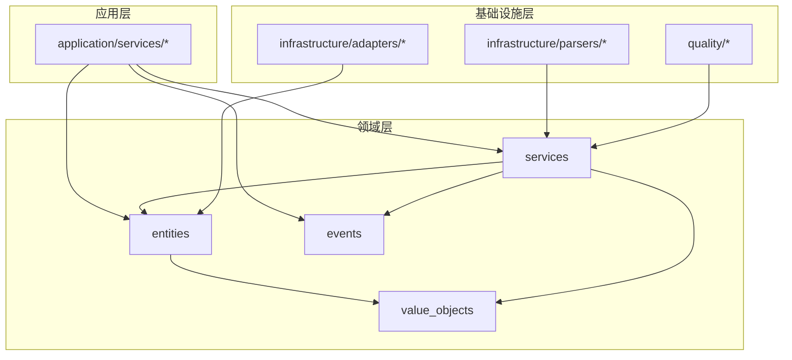
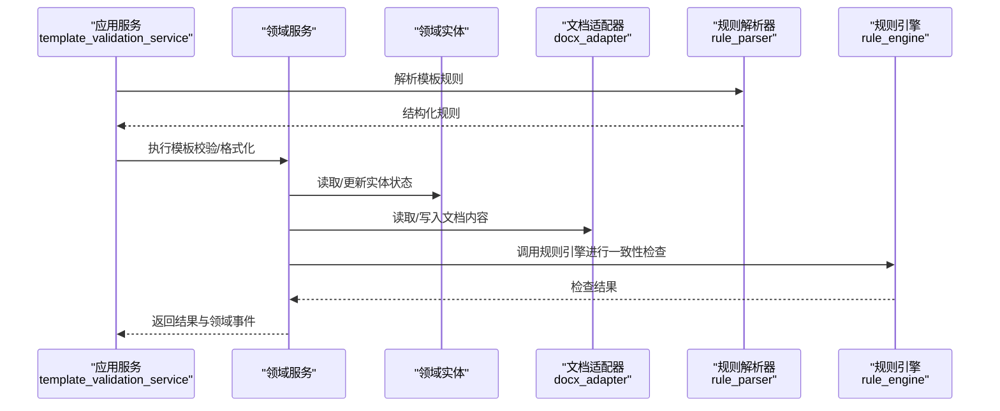
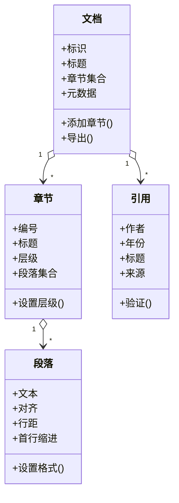
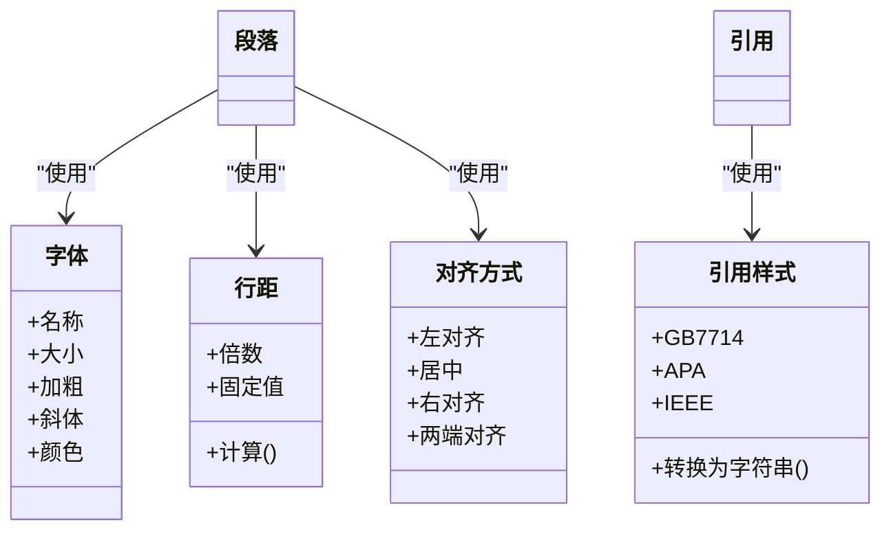
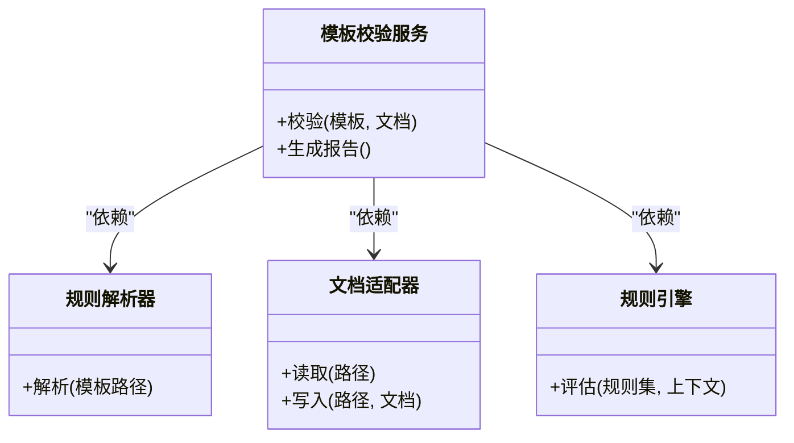
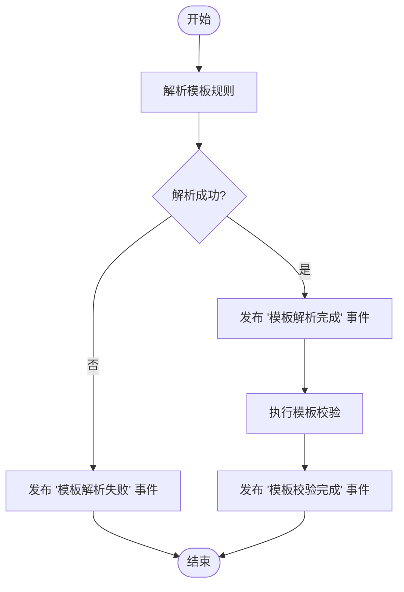
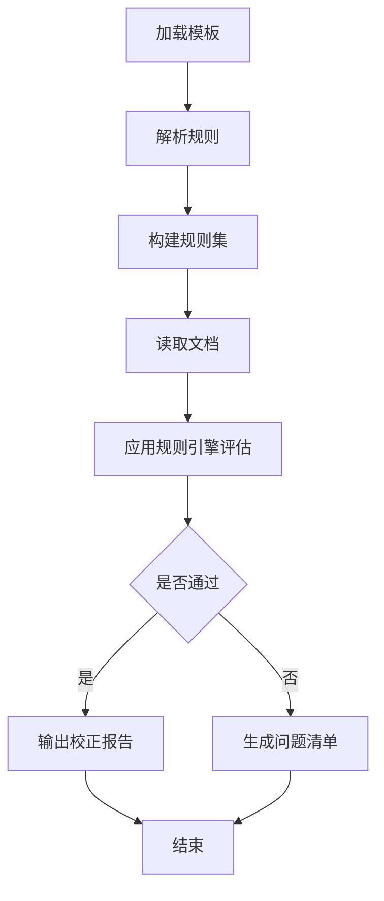
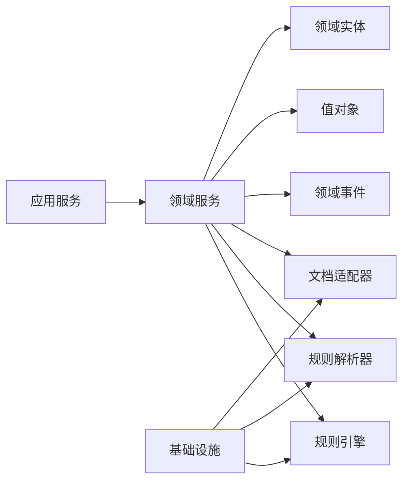

# 领域层设计

<cite>
**本文引用的文件**   
- [src/paper_format_corrector/domain/entities/__init__.py](file://src/paper_format_corrector/domain/entities/__init__.py)
- [src/paper_format_corrector/domain/events/__init__.py](file://src/paper_format_corrector/domain/events/__init__.py)
- [src/paper_format_corrector/domain/services/__init__.py](file://src/paper_format_corrector/domain/services/__init__.py)
- [src/paper_format_corrector/domain/value_objects/__init__.py](file://src/paper_format_corrector/domain/value_objects/__init__.py)
- [src/paper_format_corrector/core/format_corrector.py](file://src/paper_format_corrector/core/format_corrector.py)
- [src/paper_format_corrector/infrastructure/adapters/docx_adapter.py](file://src/paper_format_corrector/infrastructure/adapters/docx_adapter.py)
- [src/paper_format_corrector/application/services/template_validation_service.py](file://src/paper_format_corrector/application/services/template_validation_service.py)
- [src/paper_format_corrector/infrastructure/parsers/rule_parser.py](file://src/paper_format_corrector/infrastructure/parsers/rule_parser.py)
- [src/paper_format_corrector/quality/rule_engine.py](file://src/paper_format_corrector/quality/rule_engine.py)
</cite>

## 目录
1. [引言](#引言)
2. [项目结构](#项目结构)
3. [核心组件](#核心组件)
4. [架构总览](#架构总览)
5. [详细组件分析](#详细组件分析)
6. [依赖分析](#依赖分析)
7. [性能考虑](#性能考虑)
8. [故障排查指南](#故障排查指南)
9. [结论](#结论)
10. [附录](#附录)

## 引言
本文件聚焦于“论文格式矫正”领域的领域层设计，围绕领域实体、值对象、领域服务与领域事件展开，阐述DDD概念在该领域的应用方式、业务规则与不变量约束，并给出发布订阅模式与无状态领域服务的设计要点。文档同时提供架构图与流程图，帮助读者从高层到代码级理解领域模型的组织与协作关系。

## 项目结构
领域层位于 src/paper_format_corrector/domain 下，按 DDD 分层组织为 entities、value_objects、services、events 四个子包。应用层通过端口/适配器与领域交互，基础设施负责解析模板规则、读写文档等具体实现。

图表来源
- [src/paper_format_corrector/domain/entities/__init__.py](file://src/paper_format_corrector/domain/entities/__init__.py)
- [src/paper_format_corrector/domain/value_objects/__init__.py](file://src/paper_format_corrector/domain/value_objects/__init__.py)
- [src/paper_format_corrector/domain/services/__init__.py](file://src/paper_format_corrector/domain/services/__init__.py)
- [src/paper_format_corrector/domain/events/__init__.py](file://src/paper_format_corrector/domain/events/__init__.py)
- [src/paper_format_corrector/application/services/template_validation_service.py](file://src/paper_format_corrector/application/services/template_validation_service.py)
- [src/paper_format_corrector/infrastructure/adapters/docx_adapter.py](file://src/paper_format_corrector/infrastructure/adapters/docx_adapter.py)
- [src/paper_format_corrector/infrastructure/parsers/rule_parser.py](file://src/paper_format_corrector/infrastructure/parsers/rule_parser.py)
- [src/paper_format_corrector/quality/rule_engine.py](file://src/paper_format_corrector/quality/rule_engine.py)

章节来源
- [src/paper_format_corrector/domain/entities/__init__.py](file://src/paper_format_corrector/domain/entities/__init__.py)
- [src/paper_format_corrector/domain/value_objects/__init__.py](file://src/paper_format_corrector/domain/value_objects/__init__.py)
- [src/paper_format_corrector/domain/services/__init__.py](file://src/paper_format_corrector/domain/services/__init__.py)
- [src/paper_format_corrector/domain/events/__init__.py](file://src/paper_format_corrector/domain/events/__init__.py)

## 核心组件
- 领域实体：承载论文格式矫正的核心业务身份与生命周期，如文档、章节、段落、引用等。实体的不变量由构造与变更方法共同保证。
- 值对象：描述不可变且以相等性比较为核心的概念，如字体、字号、行距、对齐方式、页边距、引用样式等。
- 领域服务：封装跨实体的复杂业务逻辑，保持无状态；协调多个实体与值对象完成一次格式化任务或校验流程。
- 领域事件：记录领域内发生的有意义变化（如模板加载成功、规则解析完成、格式修正完成），供其他子系统异步消费。

章节来源
- [src/paper_format_corrector/domain/entities/__init__.py](file://src/paper_format_corrector/domain/entities/__init__.py)
- [src/paper_format_corrector/domain/value_objects/__init__.py](file://src/paper_format_corrector/domain/value_objects/__init__.py)
- [src/paper_format_corrector/domain/services/__init__.py](file://src/paper_format_corrector/domain/services/__init__.py)
- [src/paper_format_corrector/domain/events/__init__.py](file://src/paper_format_corrector/domain/events/__init__.py)

## 架构总览
领域层与应用层、基础设施层的协作如下：应用服务编排流程，调用领域服务与实体；基础设施提供文档适配与规则解析能力；质量模块提供规则引擎支撑。

图表来源
- [src/paper_format_corrector/application/services/template_validation_service.py](file://src/paper_format_corrector/application/services/template_validation_service.py)
- [src/paper_format_corrector/infrastructure/adapters/docx_adapter.py](file://src/paper_format_corrector/infrastructure/adapters/docx_adapter.py)
- [src/paper_format_corrector/infrastructure/parsers/rule_parser.py](file://src/paper_format_corrector/infrastructure/parsers/rule_parser.py)
- [src/paper_format_corrector/quality/rule_engine.py](file://src/paper_format_corrector/quality/rule_engine.py)

## 详细组件分析

### 领域实体设计
- 职责边界：每个实体对应一个具有明确业务身份的聚合根或子实体，例如“文档”、“章节”、“段落”、“引用”。
- 不变量约束：在构造时校验必填字段与取值范围；在变更方法中维护内部一致性（如章节编号与标题层级一致）。
- 行为封装：将与其相关的业务操作封装在实体方法中，避免外部直接修改内部状态。

图表来源
- [src/paper_format_corrector/domain/entities/__init__.py](file://src/paper_format_corrector/domain/entities/__init__.py)

章节来源
- [src/paper_format_corrector/domain/entities/__init__.py](file://src/paper_format_corrector/domain/entities/__init__.py)

### 值对象设计
- 不可变性：值对象一旦创建不应被修改，任何变更都返回新实例。
- 相等性与哈希：基于业务语义定义相等性，便于在集合中进行去重与查找。
- 典型示例：字体、字号、行距、对齐方式、页边距、引用样式等。

图表来源
- [src/paper_format_corrector/domain/value_objects/__init__.py](file://src/paper_format_corrector/domain/value_objects/__init__.py)

章节来源
- [src/paper_format_corrector/domain/value_objects/__init__.py](file://src/paper_format_corrector/domain/value_objects/__init__.py)

### 领域服务设计（无状态）
- 无状态原则：不持有持久化状态，仅接收输入参数与领域对象，返回结果或触发事件。
- 编排职责：协调多个实体与值对象，处理跨实体的复杂业务逻辑（如模板校验、批量格式化）。
- 可测试性：由于无状态，易于注入模拟依赖并进行单元测试。

图表来源
- [src/paper_format_corrector/domain/services/__init__.py](file://src/paper_format_corrector/domain/services/__init__.py)
- [src/paper_format_corrector/infrastructure/parsers/rule_parser.py](file://src/paper_format_corrector/infrastructure/parsers/rule_parser.py)
- [src/paper_format_corrector/infrastructure/adapters/docx_adapter.py](file://src/paper_format_corrector/infrastructure/adapters/docx_adapter.py)
- [src/paper_format_corrector/quality/rule_engine.py](file://src/paper_format_corrector/quality/rule_engine.py)

章节来源
- [src/paper_format_corrector/domain/services/__init__.py](file://src/paper_format_corrector/domain/services/__init__.py)

### 领域事件设计（发布订阅）
- 事件类型：模板加载成功、规则解析完成、格式修正完成、校验失败等。
- 发布订阅：领域服务在完成关键步骤后发布事件，应用层或基础设施层订阅并执行副作用（如日志、通知、持久化）。
- 解耦与扩展：新增消费者无需修改领域服务，只需注册新的订阅者。

图表来源
- [src/paper_format_corrector/domain/events/__init__.py](file://src/paper_format_corrector/domain/events/__init__.py)
- [src/paper_format_corrector/application/services/template_validation_service.py](file://src/paper_format_corrector/application/services/template_validation_service.py)

章节来源
- [src/paper_format_corrector/domain/events/__init__.py](file://src/paper_format_corrector/domain/events/__init__.py)
- [src/paper_format_corrector/application/services/template_validation_service.py](file://src/paper_format_corrector/application/services/template_validation_service.py)

### 业务规则与不变量约束
- 模板规则：来自 YAML/JSON 的排版规范（字体、字号、行距、对齐、页边距、章节编号等），由规则解析器转换为领域可用的数据结构。
- 一致性检查：通过规则引擎对文档当前状态进行评估，确保满足模板要求。
- 文档适配：通过文档适配器读写 docx 内容，屏蔽底层库差异。

图表来源
- [src/paper_format_corrector/infrastructure/parsers/rule_parser.py](file://src/paper_format_corrector/infrastructure/parsers/rule_parser.py)
- [src/paper_format_corrector/quality/rule_engine.py](file://src/paper_format_corrector/quality/rule_engine.py)
- [src/paper_format_corrector/infrastructure/adapters/docx_adapter.py](file://src/paper_format_corrector/infrastructure/adapters/docx_adapter.py)

章节来源
- [src/paper_format_corrector/infrastructure/parsers/rule_parser.py](file://src/paper_format_corrector/infrastructure/parsers/rule_parser.py)
- [src/paper_format_corrector/quality/rule_engine.py](file://src/paper_format_corrector/quality/rule_engine.py)
- [src/paper_format_corrector/infrastructure/adapters/docx_adapter.py](file://src/paper_format_corrector/infrastructure/adapters/docx_adapter.py)

### 领域模型在论文格式矫正中的应用
- 实体映射：文档、章节、段落、引用分别对应论文的结构单元，承载各自的格式属性与行为。
- 值对象抽象：字体、行距、对齐方式等作为值对象，保证格式配置的可组合与可复用。
- 服务编排：模板校验服务协调解析器、适配器与规则引擎，完成端到端的校验与矫正流程。
- 事件驱动：通过领域事件记录关键步骤，支持后续审计、通知与可视化展示。

章节来源
- [src/paper_format_corrector/domain/entities/__init__.py](file://src/paper_format_corrector/domain/entities/__init__.py)
- [src/paper_format_corrector/domain/value_objects/__init__.py](file://src/paper_format_corrector/domain/value_objects/__init__.py)
- [src/paper_format_corrector/domain/services/__init__.py](file://src/paper_format_corrector/domain/services/__init__.py)
- [src/paper_format_corrector/domain/events/__init__.py](file://src/paper_format_corrector/domain/events/__init__.py)

## 依赖分析
- 耦合关系：应用服务依赖领域服务与领域实体；领域服务依赖值对象与领域事件；基础设施提供解析与文档适配能力。
- 外部依赖：docx 库通过适配器隔离；规则解析器依赖配置文件；规则引擎依赖质量模块。

图表来源
- [src/paper_format_corrector/application/services/template_validation_service.py](file://src/paper_format_corrector/application/services/template_validation_service.py)
- [src/paper_format_corrector/domain/services/__init__.py](file://src/paper_format_corrector/domain/services/__init__.py)
- [src/paper_format_corrector/infrastructure/adapters/docx_adapter.py](file://src/paper_format_corrector/infrastructure/adapters/docx_adapter.py)
- [src/paper_format_corrector/infrastructure/parsers/rule_parser.py](file://src/paper_format_corrector/infrastructure/parsers/rule_parser.py)
- [src/paper_format_corrector/quality/rule_engine.py](file://src/paper_format_corrector/quality/rule_engine.py)

章节来源
- [src/paper_format_corrector/application/services/template_validation_service.py](file://src/paper_format_corrector/application/services/template_validation_service.py)
- [src/paper_format_corrector/domain/services/__init__.py](file://src/paper_format_corrector/domain/services/__init__.py)
- [src/paper_format_corrector/infrastructure/adapters/docx_adapter.py](file://src/paper_format_corrector/infrastructure/adapters/docx_adapter.py)
- [src/paper_format_corrector/infrastructure/parsers/rule_parser.py](file://src/paper_format_corrector/infrastructure/parsers/rule_parser.py)
- [src/paper_format_corrector/quality/rule_engine.py](file://src/paper_format_corrector/quality/rule_engine.py)

## 性能考虑
- 规则解析缓存：对常用模板的规则解析结果进行缓存，减少重复 IO 与解析开销。
- 增量评估：对文档局部变更只重新评估相关规则，避免全量扫描。
- 并行处理：对独立章节或段落的格式调整采用并发策略，提升批处理效率。
- 内存管理：值对象不可变特性有助于共享与复用，降低内存占用。

## 故障排查指南
- 模板解析失败：检查模板文件格式与字段完整性，确认规则解析器的容错与错误信息输出。
- 文档读写异常：确认文档适配器对 docx 库版本的兼容性与权限控制。
- 规则评估不一致：核对规则引擎的评估上下文与阈值配置，必要时输出中间状态用于定位。
- 事件未消费：检查事件总线注册与订阅者存活状态，确认事件序列化与反序列化正确。

章节来源
- [src/paper_format_corrector/infrastructure/parsers/rule_parser.py](file://src/paper_format_corrector/infrastructure/parsers/rule_parser.py)
- [src/paper_format_corrector/infrastructure/adapters/docx_adapter.py](file://src/paper_format_corrector/infrastructure/adapters/docx_adapter.py)
- [src/paper_format_corrector/quality/rule_engine.py](file://src/paper_format_corrector/quality/rule_engine.py)

## 结论
通过将论文格式矫正的核心概念建模为实体、值对象、服务与事件，领域层实现了高内聚、低耦合的业务表达。无状态领域服务与发布订阅机制提升了系统的可测试性与可扩展性。结合规则解析与规则引擎，系统能够灵活应对不同模板与规范要求，保障文档的一致性与高质量。

## 附录
- 术语说明：
  - 领域实体：具有唯一标识与生命周期的业务对象。
  - 值对象：以相等性为核心、不可变的业务概念。
  - 领域服务：封装跨实体的复杂业务逻辑，保持无状态。
  - 领域事件：记录领域内重要变化的不可变消息。
- 参考入口：
  - 核心格式化流程入口参见 core/format_corrector.py。

章节来源
- [src/paper_format_corrector/core/format_corrector.py](file://src/paper_format_corrector/core/format_corrector.py)