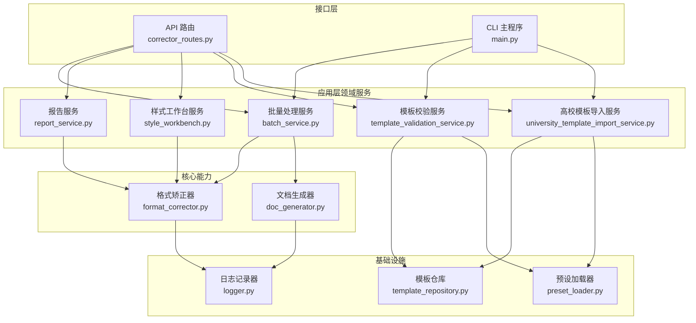
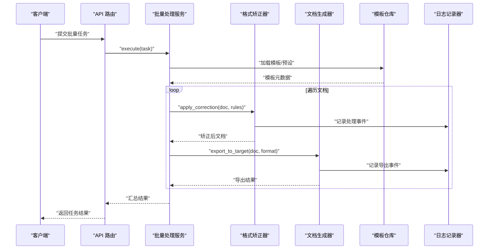
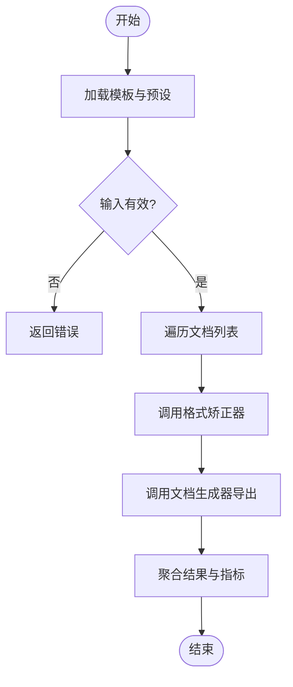
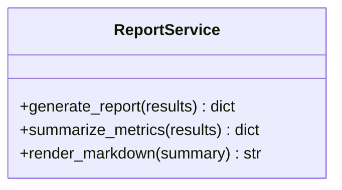
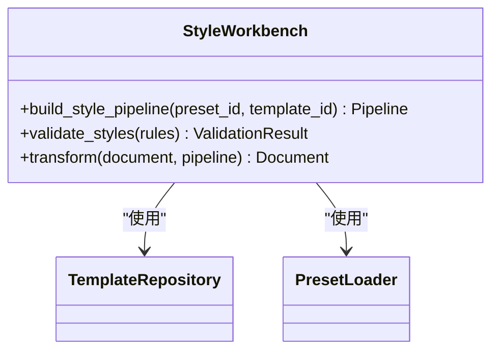
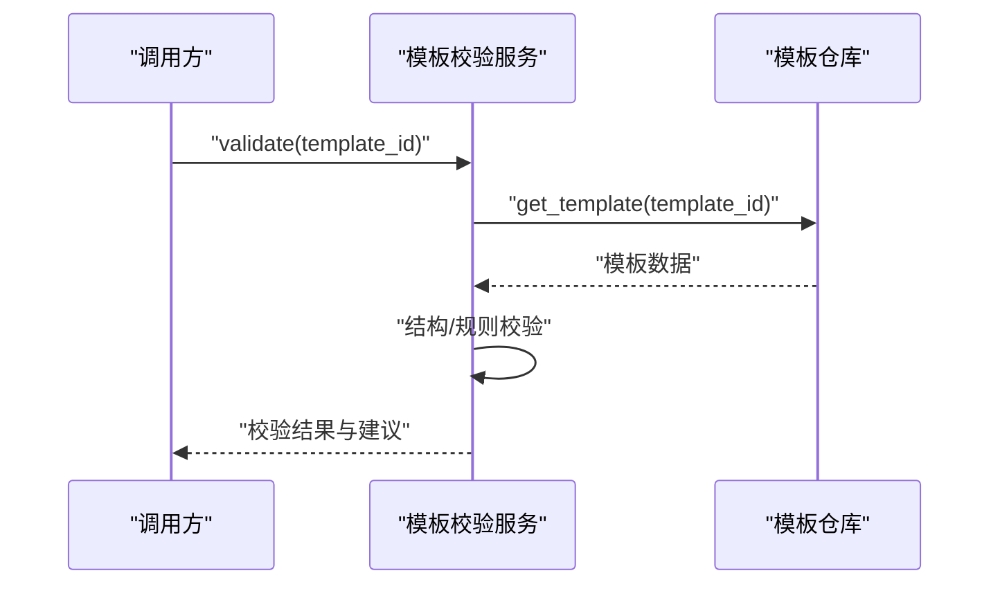
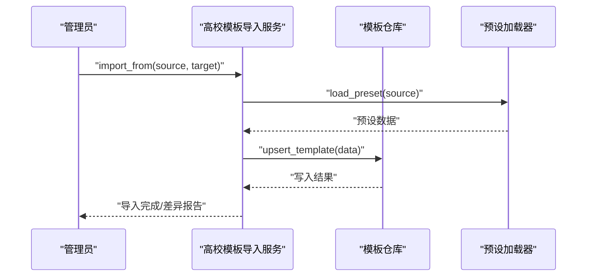
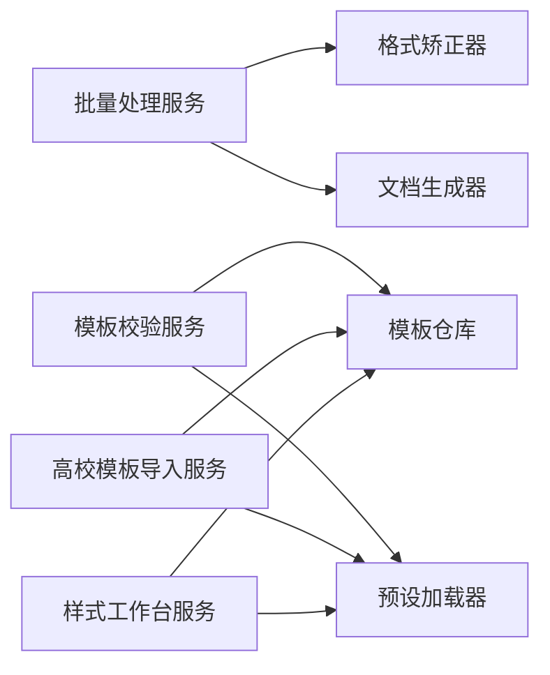

# 领域服务设计

<cite>
**本文引用的文件**   
- [src/paper_format_corrector/application/services/batch_service.py](file://src/paper_format_corrector/application/services/batch_service.py)
- [src/paper_format_corrector/application/services/report_service.py](file://src/paper_format_corrector/application/services/report_service.py)
- [src/paper_format_corrector/application/services/style_workbench.py](file://src/paper_format_corrector/application/services/style_workbench.py)
- [src/paper_format_corrector/application/services/template_validation_service.py](file://src/paper_format_corrector/application/services/template_validation_service.py)
- [src/paper_format_corrector/application/services/university_template_import_service.py](file://src/paper_format_corrector/application/services/university_template_import_service.py)
- [src/paper_format_corrector/core/format_corrector.py](file://src/paper_format_corrector/core/format_corrector.py)
- [src/paper_format_corrector/core/doc_generator.py](file://src/paper_format_corrector/core/doc_generator.py)
- [src/paper_format_corrector/infra/template_repository.py](file://src/paper_format_corrector/infra/template_repository.py)
- [src/paper_format_corrector/infra/preset_loader.py](file://src/paper_format_corrector/infra/preset_loader.py)
- [src/paper_format_corrector/infra/logger.py](file://src/paper_format_corrector/infra/logger.py)
- [src/paper_format_corrector/interfaces/api/routes/corrector_routes.py](file://src/paper_format_corrector/interfaces/api/routes/corrector_routes.py)
- [src/paper_format_corrector/interfaces/cli/main.py](file://src/paper_format_corrector/interfaces/cli/main.py)
</cite>

## 目录
1. [引言](#引言)
2. [项目结构](#项目结构)
3. [核心组件](#核心组件)
4. [架构总览](#架构总览)
5. [详细组件分析](#详细组件分析)
6. [依赖关系分析](#依赖关系分析)
7. [性能考量](#性能考量)
8. [故障排查指南](#故障排查指南)
9. [结论](#结论)
10. [附录](#附录)

## 引言
本文件聚焦于“无状态领域服务”的设计与实现，围绕职责划分、复杂业务编排、服务间协作、事务边界与错误处理、以及与基础设施层的解耦策略展开。结合论文格式矫正工具的实际代码组织，文档以应用层服务为切入点，说明如何协调多个实体与处理器完成端到端的业务流程，并通过接口设计与调用序列展示最佳实践。

## 项目结构
本项目采用分层与模块化组织方式：
- 应用层（application）：定义面向用例的领域服务，负责流程编排与跨模块协作。
- 核心能力（core）：提供格式化、生成等通用能力。
- 基础设施（infra）：模板仓库、预设加载、日志等外部依赖适配。
- 接口层（interfaces）：API、CLI 等入口，将请求委派给应用服务。

图表来源
- [src/paper_format_corrector/interfaces/api/routes/corrector_routes.py](file://src/paper_format_corrector/interfaces/api/routes/corrector_routes.py)
- [src/paper_format_corrector/interfaces/cli/main.py](file://src/paper_format_corrector/interfaces/cli/main.py)
- [src/paper_format_corrector/application/services/batch_service.py](file://src/paper_format_corrector/application/services/batch_service.py)
- [src/paper_format_corrector/application/services/report_service.py](file://src/paper_format_corrector/application/services/report_service.py)
- [src/paper_format_corrector/application/services/style_workbench.py](file://src/paper_format_corrector/application/services/style_workbench.py)
- [src/paper_format_corrector/application/services/template_validation_service.py](file://src/paper_format_corrector/application/services/template_validation_service.py)
- [src/paper_format_corrector/application/services/university_template_import_service.py](file://src/paper_format_corrector/application/services/university_template_import_service.py)
- [src/paper_format_corrector/core/format_corrector.py](file://src/paper_format_corrector/core/format_corrector.py)
- [src/paper_format_corrector/core/doc_generator.py](file://src/paper_format_corrector/core/doc_generator.py)
- [src/paper_format_corrector/infra/template_repository.py](file://src/paper_format_corrector/infra/template_repository.py)
- [src/paper_format_corrector/infra/preset_loader.py](file://src/paper_format_corrector/infra/preset_loader.py)
- [src/paper_format_corrector/infra/logger.py](file://src/paper_format_corrector/infra/logger.py)

章节来源
- [src/paper_format_corrector/interfaces/api/routes/corrector_routes.py](file://src/paper_format_corrector/interfaces/api/routes/corrector_routes.py)
- [src/paper_format_corrector/interfaces/cli/main.py](file://src/paper_format_corrector/interfaces/cli/main.py)
- [src/paper_format_corrector/application/services/batch_service.py](file://src/paper_format_corrector/application/services/batch_service.py)
- [src/paper_format_corrector/application/services/report_service.py](file://src/paper_format_corrector/application/services/report_service.py)
- [src/paper_format_corrector/application/services/style_workbench.py](file://src/paper_format_corrector/application/services/style_workbench.py)
- [src/paper_format_corrector/application/services/template_validation_service.py](file://src/paper_format_corrector/application/services/template_validation_service.py)
- [src/paper_format_corrector/application/services/university_template_import_service.py](file://src/paper_format_corrector/application/services/university_template_import_service.py)
- [src/paper_format_corrector/core/format_corrector.py](file://src/paper_format_corrector/core/format_corrector.py)
- [src/paper_format_corrector/core/doc_generator.py](file://src/paper_format_corrector/core/doc_generator.py)
- [src/paper_format_corrector/infra/template_repository.py](file://src/paper_format_corrector/infra/template_repository.py)
- [src/paper_format_corrector/infra/preset_loader.py](file://src/paper_format_corrector/infra/preset_loader.py)
- [src/paper_format_corrector/infra/logger.py](file://src/paper_format_corrector/infra/logger.py)

## 核心组件
本节聚焦应用层无状态领域服务的职责与协作模式：
- 批量处理服务：编排多文档的读取、矫正、导出与报告生成，保证幂等与可重试。
- 报告服务：汇总处理结果、统计指标与问题清单，输出结构化报告。
- 样式工作台服务：基于预设与模板进行样式解析、校验与转换。
- 模板校验服务：对模板结构与规则进行一致性检查，并返回诊断信息。
- 高校模板导入服务：从外部源拉取模板、解析与入库，支持增量更新。

这些服务均为无状态：不持有持久化上下文，所有输入通过参数传入，所有副作用通过基础设施端口完成。

章节来源
- [src/paper_format_corrector/application/services/batch_service.py](file://src/paper_format_corrector/application/services/batch_service.py)
- [src/paper_format_corrector/application/services/report_service.py](file://src/paper_format_corrector/application/services/report_service.py)
- [src/paper_format_corrector/application/services/style_workbench.py](file://src/paper_format_corrector/application/services/style_workbench.py)
- [src/paper_format_corrector/application/services/template_validation_service.py](file://src/paper_format_corrector/application/services/template_validation_service.py)
- [src/paper_format_corrector/application/services/university_template_import_service.py](file://src/paper_format_corrector/application/services/university_template_import_service.py)

## 架构总览
领域服务位于应用层，作为编排者协调核心能力与基础设施。其关键特征：
- 无状态：服务实例不保存会话或中间态，便于水平扩展与并发执行。
- 明确边界：每个服务对应一个用例或子流程，避免“上帝服务”。
- 依赖倒置：通过接口与适配器与基础设施交互，降低耦合度。
- 可观测性：统一日志与度量，便于追踪与排障。

图表来源
- [src/paper_format_corrector/interfaces/api/routes/corrector_routes.py](file://src/paper_format_corrector/interfaces/api/routes/corrector_routes.py)
- [src/paper_format_corrector/application/services/batch_service.py](file://src/paper_format_corrector/application/services/batch_service.py)
- [src/paper_format_corrector/core/format_corrector.py](file://src/paper_format_corrector/core/format_corrector.py)
- [src/paper_format_corrector/core/doc_generator.py](file://src/paper_format_corrector/core/doc_generator.py)
- [src/paper_format_corrector/infra/template_repository.py](file://src/paper_format_corrector/infra/template_repository.py)
- [src/paper_format_corrector/infra/logger.py](file://src/paper_format_corrector/infra/logger.py)

## 详细组件分析

### 批量处理服务（BatchService）
职责与原则
- 编排多文档的读取、矫正、导出与报告聚合。
- 保证幂等：相同输入产生相同输出；失败可重试。
- 控制事务边界：以“批次”为单位，内部步骤异常时回滚已写出的中间产物。
- 错误隔离：单个文档失败不影响其他文档处理。

图表来源
- [src/paper_format_corrector/application/services/batch_service.py](file://src/paper_format_corrector/application/services/batch_service.py)
- [src/paper_format_corrector/core/format_corrector.py](file://src/paper_format_corrector/core/format_corrector.py)
- [src/paper_format_corrector/core/doc_generator.py](file://src/paper_format_corrector/core/doc_generator.py)

章节来源
- [src/paper_format_corrector/application/services/batch_service.py](file://src/paper_format_corrector/application/services/batch_service.py)

### 报告服务（ReportService）
职责与原则
- 汇总各阶段处理结果、错误与警告。
- 生成可读的结构化报告（如 JSON/Markdown）。
- 保持无状态：仅消费输入数据，不修改外部系统。

图表来源
- [src/paper_format_corrector/application/services/report_service.py](file://src/paper_format_corrector/application/services/report_service.py)

章节来源
- [src/paper_format_corrector/application/services/report_service.py](file://src/paper_format_corrector/application/services/report_service.py)

### 样式工作台服务（StyleWorkbench）
职责与原则
- 组合预设与模板，构建样式工作流。
- 提供样式解析、校验与转换的统一入口。
- 与模板仓库和预设加载器解耦，通过接口访问资源。

图表来源
- [src/paper_format_corrector/application/services/style_workbench.py](file://src/paper_format_corrector/application/services/style_workbench.py)
- [src/paper_format_corrector/infra/template_repository.py](file://src/paper_format_corrector/infra/template_repository.py)
- [src/paper_format_corrector/infra/preset_loader.py](file://src/paper_format_corrector/infra/preset_loader.py)

章节来源
- [src/paper_format_corrector/application/services/style_workbench.py](file://src/paper_format_corrector/application/services/style_workbench.py)
- [src/paper_format_corrector/infra/template_repository.py](file://src/paper_format_corrector/infra/template_repository.py)
- [src/paper_format_corrector/infra/preset_loader.py](file://src/paper_format_corrector/infra/preset_loader.py)

### 模板校验服务（TemplateValidationService）
职责与原则
- 校验模板结构、字段完整性与规则一致性。
- 返回详细的诊断信息与修复建议。
- 与模板仓库解耦，仅依赖只读接口。

图表来源
- [src/paper_format_corrector/application/services/template_validation_service.py](file://src/paper_format_corrector/application/services/template_validation_service.py)
- [src/paper_format_corrector/infra/template_repository.py](file://src/paper_format_corrector/infra/template_repository.py)

章节来源
- [src/paper_format_corrector/application/services/template_validation_service.py](file://src/paper_format_corrector/application/services/template_validation_service.py)
- [src/paper_format_corrector/infra/template_repository.py](file://src/paper_format_corrector/infra/template_repository.py)

### 高校模板导入服务（UniversityTemplateImportService）
职责与原则
- 从远程或本地源拉取模板，解析并入库。
- 支持增量更新与冲突解决。
- 与模板仓库和预设加载器协作，确保数据一致性。

图表来源
- [src/paper_format_corrector/application/services/university_template_import_service.py](file://src/paper_format_corrector/application/services/university_template_import_service.py)
- [src/paper_format_corrector/infra/template_repository.py](file://src/paper_format_corrector/infra/template_repository.py)
- [src/paper_format_corrector/infra/preset_loader.py](file://src/paper_format_corrector/infra/preset_loader.py)

章节来源
- [src/paper_format_corrector/application/services/university_template_import_service.py](file://src/paper_format_corrector/application/services/university_template_import_service.py)
- [src/paper_format_corrector/infra/template_repository.py](file://src/paper_format_corrector/infra/template_repository.py)
- [src/paper_format_corrector/infra/preset_loader.py](file://src/paper_format_corrector/infra/preset_loader.py)

## 依赖关系分析
- 低耦合：应用服务仅依赖基础设施的抽象接口，具体实现由 infra 层提供。
- 单一职责：每个服务聚焦一个用例，避免跨域逻辑堆积。
- 可测试性：通过注入模拟的基础设施实现，便于单元测试与集成测试。

图表来源
- [src/paper_format_corrector/application/services/batch_service.py](file://src/paper_format_corrector/application/services/batch_service.py)
- [src/paper_format_corrector/application/services/template_validation_service.py](file://src/paper_format_corrector/application/services/template_validation_service.py)
- [src/paper_format_corrector/application/services/university_template_import_service.py](file://src/paper_format_corrector/application/services/university_template_import_service.py)
- [src/paper_format_corrector/application/services/style_workbench.py](file://src/paper_format_corrector/application/services/style_workbench.py)
- [src/paper_format_corrector/core/format_corrector.py](file://src/paper_format_corrector/core/format_corrector.py)
- [src/paper_format_corrector/core/doc_generator.py](file://src/paper_format_corrector/core/doc_generator.py)
- [src/paper_format_corrector/infra/template_repository.py](file://src/paper_format_corrector/infra/template_repository.py)
- [src/paper_format_corrector/infra/preset_loader.py](file://src/paper_format_corrector/infra/preset_loader.py)

章节来源
- [src/paper_format_corrector/application/services/batch_service.py](file://src/paper_format_corrector/application/services/batch_service.py)
- [src/paper_format_corrector/application/services/template_validation_service.py](file://src/paper_format_corrector/application/services/template_validation_service.py)
- [src/paper_format_corrector/application/services/university_template_import_service.py](file://src/paper_format_corrector/application/services/university_template_import_service.py)
- [src/paper_format_corrector/application/services/style_workbench.py](file://src/paper_format_corrector/application/services/style_workbench.py)
- [src/paper_format_corrector/core/format_corrector.py](file://src/paper_format_corrector/core/format_corrector.py)
- [src/paper_format_corrector/core/doc_generator.py](file://src/paper_format_corrector/core/doc_generator.py)
- [src/paper_format_corrector/infra/template_repository.py](file://src/paper_format_corrector/infra/template_repository.py)
- [src/paper_format_corrector/infra/preset_loader.py](file://src/paper_format_corrector/infra/preset_loader.py)

## 性能考量
- 批处理并行：在 I/O 密集场景下，可对文档级任务进行并发处理，注意限流与背压。
- 缓存复用：模板与预设应缓存热点数据，减少重复加载。
- 流式导出：大文档导出采用分块写入，降低内存峰值。
- 日志采样：高频路径启用采样日志，避免 IO 瓶颈。

[本节为通用指导，无需特定文件引用]

## 故障排查指南
- 统一日志：在关键路径记录入参、出参与耗时，便于定位问题。
- 错误分类：区分输入校验错误、模板缺失、运行时异常，分别返回不同语义的错误码。
- 重试与补偿：网络与外部依赖失败时实施指数退避重试；对部分成功的情况提供补偿操作。
- 可观测性：暴露处理指标（成功率、P95/P99 延迟），配合告警快速发现退化。

章节来源
- [src/paper_format_corrector/infra/logger.py](file://src/paper_format_corrector/infra/logger.py)

## 结论
通过无状态领域服务进行用例编排，能够清晰界定职责、提升可维护性与可扩展性。结合明确的接口契约、事务边界与错误处理策略，系统在复杂业务场景下仍保持稳定与可观测。与基础设施层的解耦设计使得替换实现与横向扩展成为可能。

[本节为总结性内容，无需特定文件引用]

## 附录

### 接口设计与实现模式示例（路径指引）
- 批量处理入口与调用链
  - [接口层路由](file://src/paper_format_corrector/interfaces/api/routes/corrector_routes.py)
  - [批量处理服务](file://src/paper_format_corrector/application/services/batch_service.py)
  - [格式矫正器](file://src/paper_format_corrector/core/format_corrector.py)
  - [文档生成器](file://src/paper_format_corrector/core/doc_generator.py)
- 模板校验与导入
  - [模板校验服务](file://src/paper_format_corrector/application/services/template_validation_service.py)
  - [高校模板导入服务](file://src/paper_format_corrector/application/services/university_template_import_service.py)
  - [模板仓库](file://src/paper_format_corrector/infra/template_repository.py)
  - [预设加载器](file://src/paper_format_corrector/infra/preset_loader.py)
- CLI 入口
  - [CLI 主程序](file://src/paper_format_corrector/interfaces/cli/main.py)

章节来源
- [src/paper_format_corrector/interfaces/api/routes/corrector_routes.py](file://src/paper_format_corrector/interfaces/api/routes/corrector_routes.py)
- [src/paper_format_corrector/application/services/batch_service.py](file://src/paper_format_corrector/application/services/batch_service.py)
- [src/paper_format_corrector/core/format_corrector.py](file://src/paper_format_corrector/core/format_corrector.py)
- [src/paper_format_corrector/core/doc_generator.py](file://src/paper_format_corrector/core/doc_generator.py)
- [src/paper_format_corrector/application/services/template_validation_service.py](file://src/paper_format_corrector/application/services/template_validation_service.py)
- [src/paper_format_corrector/application/services/university_template_import_service.py](file://src/paper_format_corrector/application/services/university_template_import_service.py)
- [src/paper_format_corrector/infra/template_repository.py](file://src/paper_format_corrector/infra/template_repository.py)
- [src/paper_format_corrector/infra/preset_loader.py](file://src/paper_format_corrector/infra/preset_loader.py)
- [src/paper_format_corrector/interfaces/cli/main.py](file://src/paper_format_corrector/interfaces/cli/main.py)