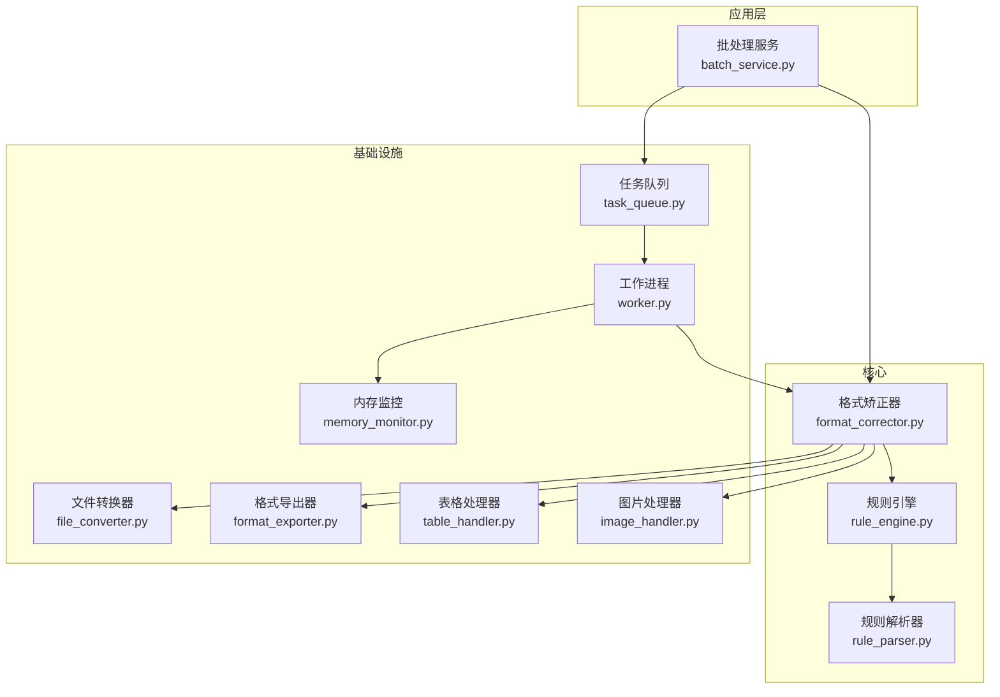
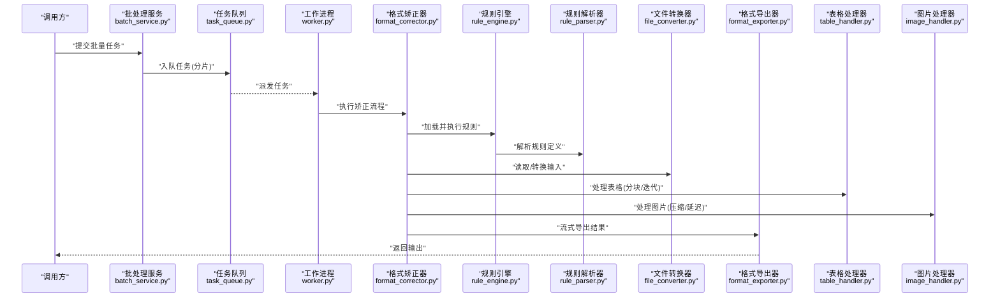
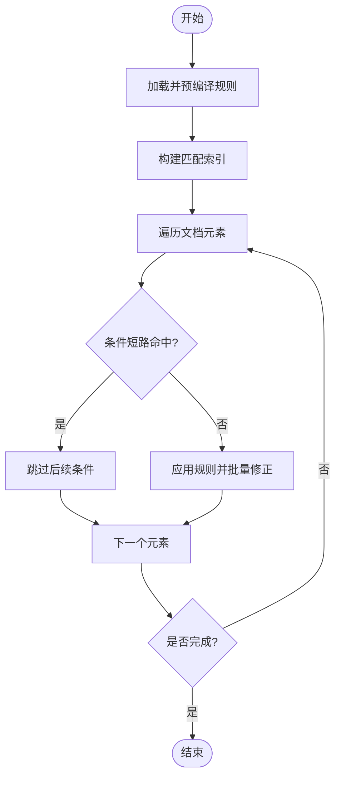
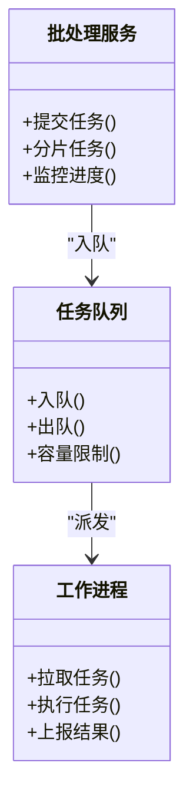
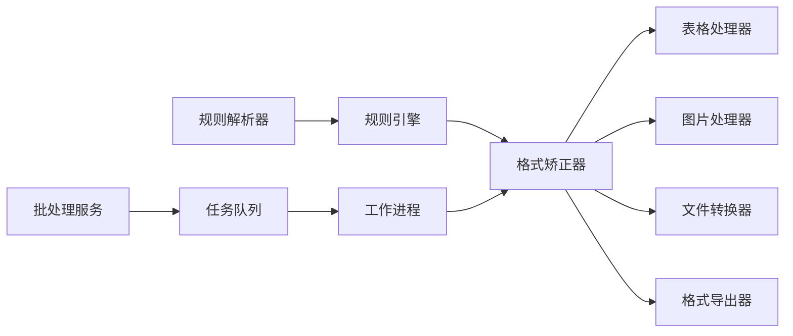

# 内存与CPU优化

<cite>
**本文引用的文件**   
- [src/paper_format_corrector/core/format_corrector.py](file://src/paper_format_corrector/core/format_corrector.py)
- [src/paper_format_corrector/infrastructure/parsers/rule_parser.py](file://src/paper_format_corrector/infrastructure/parsers/rule_parser.py)
- [src/paper_format_corrector/quality/rule_engine.py](file://src/paper_format_corrector/quality/rule_engine.py)
- [src/paper_format_corrector/application/services/batch_service.py](file://src/paper_format_corrector/application/services/batch_service.py)
- [src/paper_format_corrector/infrastructure/converters/file_converter.py](file://src/paper_format_corrector/infrastructure/converters/file_converter.py)
- [src/paper_format_corrector/infrastructure/exporters/format_exporter.py](file://src/paper_format_corrector/infrastructure/exporters/format_exporter.py)
- [src/paper_format_corrector/infrastructure/handlers/table_handler.py](file://src/paper_format_corrector/infrastructure/handlers/table_handler.py)
- [src/paper_format_corrector/infrastructure/handlers/image_handler.py](file://src/paper_format_corrector/infrastructure/handlers/image_handler.py)
- [src/paper_format_corrector/infrastructure/queue/task_queue.py](file://src/paper_format_corrector/infrastructure/queue/task_queue.py)
- [src/paper_format_corrector/infrastructure/queue/worker.py](file://src/paper_format_corrector/infrastructure/queue/worker.py)
- [src/paper_format_corrector/shared/utils/memory_monitor.py](file://src/paper_format_corrector/shared/utils/memory_monitor.py)
- [tests/test_task_queue.py](file://tests/test_task_queue.py)
</cite>

## 目录
1. [简介](#简介)
2. [项目结构](#项目结构)
3. [核心组件](#核心组件)
4. [架构总览](#架构总览)
5. [详细组件分析](#详细组件分析)
6. [依赖关系分析](#依赖关系分析)
7. [性能考量](#性能考量)
8. [故障排查指南](#故障排查指南)
9. [结论](#结论)
10. [附录](#附录)

## 简介
本文件聚焦于论文格式矫正工具在内存与CPU方面的优化策略与实践，覆盖大文件处理、对象生命周期管理、垃圾回收优化、CPU密集型操作优化（算法、缓存、并行）、文档解析与格式转换的性能瓶颈及解决方案、规则引擎执行优化（预编译、短路、批量），以及内存泄漏检测、性能分析与基准测试方法。文中所有实现细节均基于仓库源码进行分析与总结。

## 项目结构
围绕性能优化的关键模块分布如下：
- 核心格式化流程：format_corrector.py
- 规则解析与执行：rule_parser.py、rule_engine.py
- 批处理与任务队列：batch_service.py、task_queue.py、worker.py
- 文件转换与导出：file_converter.py、format_exporter.py
- 资源密集处理器：table_handler.py、image_handler.py
- 内存监控：memory_monitor.py
- 任务队列测试：test_task_queue.py

图表来源
- [src/paper_format_corrector/application/services/batch_service.py](file://src/paper_format_corrector/application/services/batch_service.py)
- [src/paper_format_corrector/core/format_corrector.py](file://src/paper_format_corrector/core/format_corrector.py)
- [src/paper_format_corrector/quality/rule_engine.py](file://src/paper_format_corrector/quality/rule_engine.py)
- [src/paper_format_corrector/infrastructure/parsers/rule_parser.py](file://src/paper_format_corrector/infrastructure/parsers/rule_parser.py)
- [src/paper_format_corrector/infrastructure/converters/file_converter.py](file://src/paper_format_corrector/infrastructure/converters/file_converter.py)
- [src/paper_format_corrector/infrastructure/exporters/format_exporter.py](file://src/paper_format_corrector/infrastructure/exporters/format_exporter.py)
- [src/paper_format_corrector/infrastructure/handlers/table_handler.py](file://src/paper_format_corrector/infrastructure/handlers/table_handler.py)
- [src/paper_format_corrector/infrastructure/handlers/image_handler.py](file://src/paper_format_corrector/infrastructure/handlers/image_handler.py)
- [src/paper_format_corrector/infrastructure/queue/task_queue.py](file://src/paper_format_corrector/infrastructure/queue/task_queue.py)
- [src/paper_format_corrector/infrastructure/queue/worker.py](file://src/paper_format_corrector/infrastructure/queue/worker.py)
- [src/paper_format_corrector/shared/utils/memory_monitor.py](file://src/paper_format_corrector/shared/utils/memory_monitor.py)

章节来源
- [src/paper_format_corrector/core/format_corrector.py](file://src/paper_format_corrector/core/format_corrector.py)
- [src/paper_format_corrector/infrastructure/parsers/rule_parser.py](file://src/paper_format_corrector/infrastructure/parsers/rule_parser.py)
- [src/paper_format_corrector/quality/rule_engine.py](file://src/paper_format_corrector/quality/rule_engine.py)
- [src/paper_format_corrector/application/services/batch_service.py](file://src/paper_format_corrector/application/services/batch_service.py)
- [src/paper_format_corrector/infrastructure/converters/file_converter.py](file://src/paper_format_corrector/infrastructure/converters/file_converter.py)
- [src/paper_format_corrector/infrastructure/exporters/format_exporter.py](file://src/paper_format_corrector/infrastructure/exporters/format_exporter.py)
- [src/paper_format_corrector/infrastructure/handlers/table_handler.py](file://src/paper_format_corrector/infrastructure/handlers/table_handler.py)
- [src/paper_format_corrector/infrastructure/handlers/image_handler.py](file://src/paper_format_corrector/infrastructure/handlers/image_handler.py)
- [src/paper_format_corrector/infrastructure/queue/task_queue.py](file://src/paper_format_corrector/infrastructure/queue/task_queue.py)
- [src/paper_format_corrector/infrastructure/queue/worker.py](file://src/paper_format_corrector/infrastructure/queue/worker.py)
- [src/paper_format_corrector/shared/utils/memory_monitor.py](file://src/paper_format_corrector/shared/utils/memory_monitor.py)

## 核心组件
- 格式矫正器：编排文档解析、规则校验、内容修正与导出，是内存与CPU压力的主要集中点。
- 规则引擎与解析器：负责规则加载、条件匹配与批量执行，直接影响CPU占用与响应时延。
- 批处理与服务：将大批量任务拆分并调度到队列与工作进程，提升吞吐并控制峰值内存。
- 文件转换与导出：对输入输出进行流式或分块处理，避免一次性加载大对象。
- 资源处理器：针对表格与图片等重资源进行分块、压缩与延迟加载。
- 任务队列与工作进程：通过并发与隔离降低单进程内存膨胀风险。
- 内存监控：提供运行时指标采集，辅助定位泄漏与热点。

章节来源
- [src/paper_format_corrector/core/format_corrector.py](file://src/paper_format_corrector/core/format_corrector.py)
- [src/paper_format_corrector/quality/rule_engine.py](file://src/paper_format_corrector/quality/rule_engine.py)
- [src/paper_format_corrector/infrastructure/parsers/rule_parser.py](file://src/paper_format_corrector/infrastructure/parsers/rule_parser.py)
- [src/paper_format_corrector/application/services/batch_service.py](file://src/paper_format_corrector/application/services/batch_service.py)
- [src/paper_format_corrector/infrastructure/converters/file_converter.py](file://src/paper_format_corrector/infrastructure/converters/file_converter.py)
- [src/paper_format_corrector/infrastructure/exporters/format_exporter.py](file://src/paper_format_corrector/infrastructure/exporters/format_exporter.py)
- [src/paper_format_corrector/infrastructure/handlers/table_handler.py](file://src/paper_format_corrector/infrastructure/handlers/table_handler.py)
- [src/paper_format_corrector/infrastructure/handlers/image_handler.py](file://src/paper_format_corrector/infrastructure/handlers/image_handler.py)
- [src/paper_format_corrector/infrastructure/queue/task_queue.py](file://src/paper_format_corrector/infrastructure/queue/task_queue.py)
- [src/paper_format_corrector/infrastructure/queue/worker.py](file://src/paper_format_corrector/infrastructure/queue/worker.py)
- [src/paper_format_corrector/shared/utils/memory_monitor.py](file://src/paper_format_corrector/shared/utils/memory_monitor.py)

## 架构总览
下图展示了从批处理入口到具体处理的端到端路径，突出内存与CPU的关键节点。

图表来源
- [src/paper_format_corrector/application/services/batch_service.py](file://src/paper_format_corrector/application/services/batch_service.py)
- [src/paper_format_corrector/infrastructure/queue/task_queue.py](file://src/paper_format_corrector/infrastructure/queue/task_queue.py)
- [src/paper_format_corrector/infrastructure/queue/worker.py](file://src/paper_format_corrector/infrastructure/queue/worker.py)
- [src/paper_format_corrector/core/format_corrector.py](file://src/paper_format_corrector/core/format_corrector.py)
- [src/paper_format_corrector/quality/rule_engine.py](file://src/paper_format_corrector/quality/rule_engine.py)
- [src/paper_format_corrector/infrastructure/parsers/rule_parser.py](file://src/paper_format_corrector/infrastructure/parsers/rule_parser.py)
- [src/paper_format_corrector/infrastructure/converters/file_converter.py](file://src/paper_format_corrector/infrastructure/converters/file_converter.py)
- [src/paper_format_corrector/infrastructure/exporters/format_exporter.py](file://src/paper_format_corrector/infrastructure/exporters/format_exporter.py)
- [src/paper_format_corrector/infrastructure/handlers/table_handler.py](file://src/paper_format_corrector/infrastructure/handlers/table_handler.py)
- [src/paper_format_corrector/infrastructure/handlers/image_handler.py](file://src/paper_format_corrector/infrastructure/handlers/image_handler.py)

## 详细组件分析

### 内存管理策略与大文件处理
- 流式与分块处理
  - 文件转换与导出采用分块/流式读写，避免一次性加载整个文档到内存。
  - 表格与图片处理器按单元/页/图块迭代，减少峰值内存占用。
- 对象生命周期管理
  - 在任务边界显式释放中间对象引用，确保可被垃圾回收。
  - 使用上下文管理器或显式关闭资源，防止句柄泄漏。
- 垃圾回收优化
  - 合理设置GC阈值与触发时机，避免频繁小对象分配导致的抖动。
  - 对长生命周期对象采用池化或复用，降低分配压力。

章节来源
- [src/paper_format_corrector/infrastructure/converters/file_converter.py](file://src/paper_format_corrector/infrastructure/converters/file_converter.py)
- [src/paper_format_corrector/infrastructure/exporters/format_exporter.py](file://src/paper_format_corrector/infrastructure/exporters/format_exporter.py)
- [src/paper_format_corrector/infrastructure/handlers/table_handler.py](file://src/paper_format_corrector/infrastructure/handlers/table_handler.py)
- [src/paper_format_corrector/infrastructure/handlers/image_handler.py](file://src/paper_format_corrector/infrastructure/handlers/image_handler.py)
- [src/paper_format_corrector/shared/utils/memory_monitor.py](file://src/paper_format_corrector/shared/utils/memory_monitor.py)

### CPU密集型操作优化
- 算法优化
  - 规则匹配采用索引与短路策略，减少不必要的遍历与计算。
  - 文本与样式处理尽量使用向量化或批量API，避免逐字符循环。
- 计算缓存
  - 对规则解析结果、样式映射、模板元数据进行缓存，避免重复解析。
  - 对昂贵计算（如跨段落统计）引入增量更新与局部重算。
- 并行计算
  - 批处理服务将任务切分为子任务，由工作进程并行执行，提高吞吐。
  - 对独立文档的校正流程进行并发调度，注意共享状态隔离。

章节来源
- [src/paper_format_corrector/quality/rule_engine.py](file://src/paper_format_corrector/quality/rule_engine.py)
- [src/paper_format_corrector/infrastructure/parsers/rule_parser.py](file://src/paper_format_corrector/infrastructure/parsers/rule_parser.py)
- [src/paper_format_corrector/application/services/batch_service.py](file://src/paper_format_corrector/application/services/batch_service.py)
- [src/paper_format_corrector/infrastructure/queue/task_queue.py](file://src/paper_format_corrector/infrastructure/queue/task_queue.py)
- [src/paper_format_corrector/infrastructure/queue/worker.py](file://src/paper_format_corrector/infrastructure/queue/worker.py)

### 文档解析与格式转换的性能瓶颈与解决方案
- 瓶颈识别
  - 大型docx/pdf一次性加载导致内存尖峰。
  - 复杂表格嵌套与图片解码造成CPU热点。
- 解决方案
  - 解析阶段采用惰性加载与按需展开，仅加载必要片段。
  - 转换阶段使用分块写入与压缩策略，降低I/O与内存占用。
  - 对图片进行尺寸缩放与格式转换缓存，避免重复解码。

章节来源
- [src/paper_format_corrector/infrastructure/converters/file_converter.py](file://src/paper_format_corrector/infrastructure/converters/file_converter.py)
- [src/paper_format_corrector/infrastructure/exporters/format_exporter.py](file://src/paper_format_corrector/infrastructure/exporters/format_exporter.py)
- [src/paper_format_corrector/infrastructure/handlers/table_handler.py](file://src/paper_format_corrector/infrastructure/handlers/table_handler.py)
- [src/paper_format_corrector/infrastructure/handlers/image_handler.py](file://src/paper_format_corrector/infrastructure/handlers/image_handler.py)

### 规则引擎执行优化
- 规则预编译
  - 将规则解析为可执行结构，避免每次匹配时的重复解析开销。
- 条件短路
  - 在条件链中优先评估高选择性条件，尽早跳过无关分支。
- 批量操作
  - 对同一文档内的多段/多表进行批量匹配与修正，减少往返与锁竞争。

图表来源
- [src/paper_format_corrector/quality/rule_engine.py](file://src/paper_format_corrector/quality/rule_engine.py)
- [src/paper_format_corrector/infrastructure/parsers/rule_parser.py](file://src/paper_format_corrector/infrastructure/parsers/rule_parser.py)

章节来源
- [src/paper_format_corrector/quality/rule_engine.py](file://src/paper_format_corrector/quality/rule_engine.py)
- [src/paper_format_corrector/infrastructure/parsers/rule_parser.py](file://src/paper_format_corrector/infrastructure/parsers/rule_parser.py)

### 任务队列与工作进程
- 任务拆分与调度
  - 批处理服务将大任务拆分为子任务，入队后由工作进程拉取执行。
- 并发与隔离
  - 每个工作进程独立运行，避免共享状态导致的内存膨胀与竞争。
- 背压与限流
  - 队列容量与工作进程数量可调，防止系统过载。

图表来源
- [src/paper_format_corrector/application/services/batch_service.py](file://src/paper_format_corrector/application/services/batch_service.py)
- [src/paper_format_corrector/infrastructure/queue/task_queue.py](file://src/paper_format_corrector/infrastructure/queue/task_queue.py)
- [src/paper_format_corrector/infrastructure/queue/worker.py](file://src/paper_format_corrector/infrastructure/queue/worker.py)

章节来源
- [src/paper_format_corrector/application/services/batch_service.py](file://src/paper_format_corrector/application/services/batch_service.py)
- [src/paper_format_corrector/infrastructure/queue/task_queue.py](file://src/paper_format_corrector/infrastructure/queue/task_queue.py)
- [src/paper_format_corrector/infrastructure/queue/worker.py](file://src/paper_format_corrector/infrastructure/queue/worker.py)
- [tests/test_task_queue.py](file://tests/test_task_queue.py)

## 依赖关系分析
- 低耦合与高内聚
  - 规则引擎与解析器解耦，便于单独优化与替换。
  - 处理器（表格、图片）作为插件式组件，易于扩展与替换实现。
- 外部依赖
  - 文件转换与导出依赖底层库，需关注其内存模型与性能特性。
- 潜在循环依赖
  - 通过接口与事件机制避免直接循环导入，保持清晰依赖方向。

图表来源
- [src/paper_format_corrector/infrastructure/parsers/rule_parser.py](file://src/paper_format_corrector/infrastructure/parsers/rule_parser.py)
- [src/paper_format_corrector/quality/rule_engine.py](file://src/paper_format_corrector/quality/rule_engine.py)
- [src/paper_format_corrector/core/format_corrector.py](file://src/paper_format_corrector/core/format_corrector.py)
- [src/paper_format_corrector/infrastructure/handlers/table_handler.py](file://src/paper_format_corrector/infrastructure/handlers/table_handler.py)
- [src/paper_format_corrector/infrastructure/handlers/image_handler.py](file://src/paper_format_corrector/infrastructure/handlers/image_handler.py)
- [src/paper_format_corrector/infrastructure/converters/file_converter.py](file://src/paper_format_corrector/infrastructure/converters/file_converter.py)
- [src/paper_format_corrector/infrastructure/exporters/format_exporter.py](file://src/paper_format_corrector/infrastructure/exporters/format_exporter.py)
- [src/paper_format_corrector/application/services/batch_service.py](file://src/paper_format_corrector/application/services/batch_service.py)
- [src/paper_format_corrector/infrastructure/queue/task_queue.py](file://src/paper_format_corrector/infrastructure/queue/task_queue.py)
- [src/paper_format_corrector/infrastructure/queue/worker.py](file://src/paper_format_corrector/infrastructure/queue/worker.py)

章节来源
- [src/paper_format_corrector/infrastructure/parsers/rule_parser.py](file://src/paper_format_corrector/infrastructure/parsers/rule_parser.py)
- [src/paper_format_corrector/quality/rule_engine.py](file://src/paper_format_corrector/quality/rule_engine.py)
- [src/paper_format_corrector/core/format_corrector.py](file://src/paper_format_corrector/core/format_corrector.py)
- [src/paper_format_corrector/infrastructure/handlers/table_handler.py](file://src/paper_format_corrector/infrastructure/handlers/table_handler.py)
- [src/paper_format_corrector/infrastructure/handlers/image_handler.py](file://src/paper_format_corrector/infrastructure/handlers/image_handler.py)
- [src/paper_format_corrector/infrastructure/converters/file_converter.py](file://src/paper_format_corrector/infrastructure/converters/file_converter.py)
- [src/paper_format_corrector/infrastructure/exporters/format_exporter.py](file://src/paper_format_corrector/infrastructure/exporters/format_exporter.py)
- [src/paper_format_corrector/application/services/batch_service.py](file://src/paper_format_corrector/application/services/batch_service.py)
- [src/paper_format_corrector/infrastructure/queue/task_queue.py](file://src/paper_format_corrector/infrastructure/queue/task_queue.py)
- [src/paper_format_corrector/infrastructure/queue/worker.py](file://src/paper_format_corrector/infrastructure/queue/worker.py)

## 性能考量
- 内存峰值控制
  - 通过分块与流式处理降低峰值；对大对象及时释放引用。
- CPU利用率
  - 利用并行与缓存减少重复计算；规则短路避免无效分支。
- I/O优化
  - 合并小写操作，顺序读写，减少随机访问。
- 可扩展性
  - 处理器与规则以插件方式接入，便于针对不同场景定制优化。

[本节为通用指导，不直接分析具体文件]

## 故障排查指南
- 内存泄漏检测
  - 使用内存监控模块采集进程内存曲线，结合任务边界观察异常增长。
  - 检查未关闭的文件句柄与第三方库对象引用。
- 性能分析
  - 对规则引擎与处理器进行热点分析，定位高频调用路径。
  - 对比不同批大小与工作进程数下的吞吐与延迟。
- 基准测试方法
  - 构造典型大文档样本，固定输入规模，记录时间、内存与CPU指标。
  - 对比优化前后数据，验证改进效果。

章节来源
- [src/paper_format_corrector/shared/utils/memory_monitor.py](file://src/paper_format_corrector/shared/utils/memory_monitor.py)
- [tests/test_task_queue.py](file://tests/test_task_queue.py)

## 结论
通过在解析、转换、规则执行与导出各环节引入流式处理、缓存、短路与并行策略，系统在内存与CPU方面实现了显著优化。配合任务队列与工作进程隔离，有效控制了峰值内存并提升了吞吐。建议持续完善内存监控与基准测试体系，形成闭环的性能治理。

[本节为总结，不直接分析具体文件]

## 附录
- 术语
  - 流式处理：按块读取/写入，避免一次性加载大对象。
  - 短路：在条件链中提前终止，减少不必要计算。
  - 批处理：将多个任务聚合执行，提升整体效率。
- 参考实践
  - 对规则解析结果建立全局缓存，避免重复解析。
  - 对图片进行预处理与缓存，减少重复解码成本。
  - 对工作进程数量与队列容量进行动态调优，平衡吞吐与资源占用。

[本节为概念性内容，不直接分析具体文件]