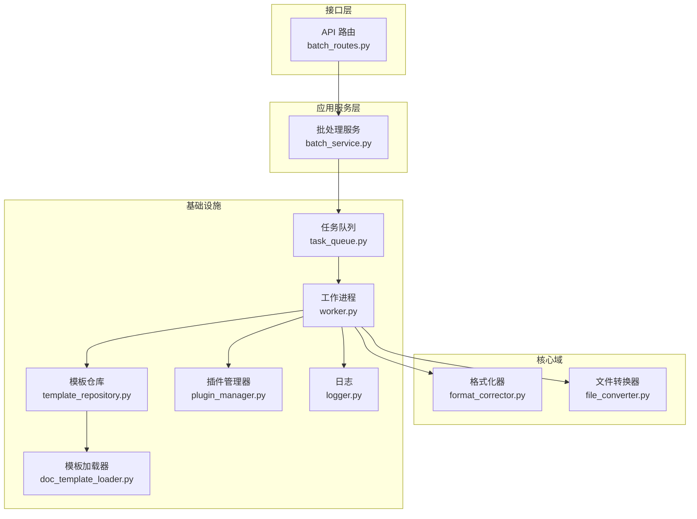
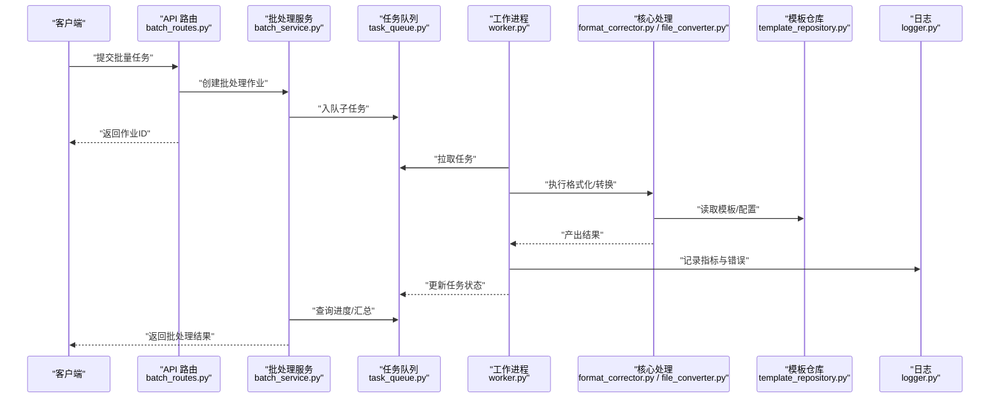
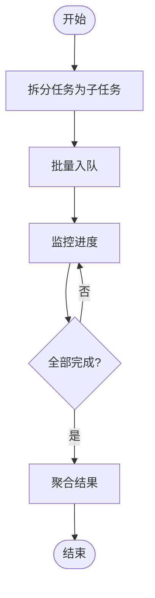
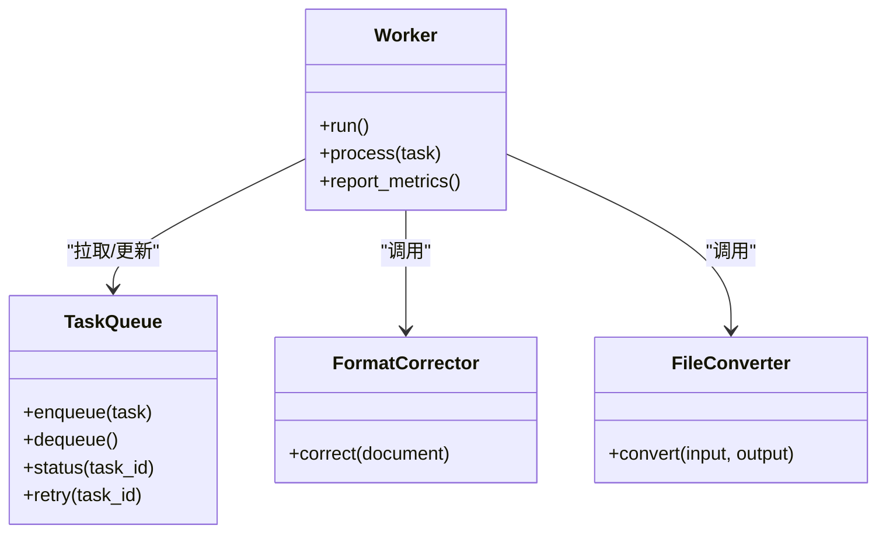
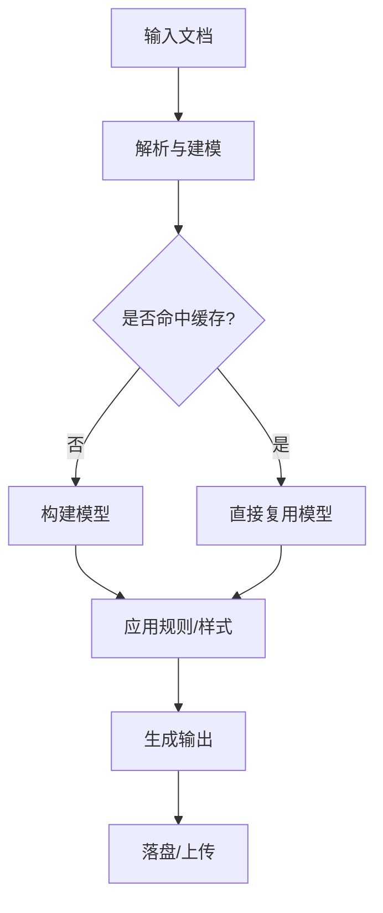
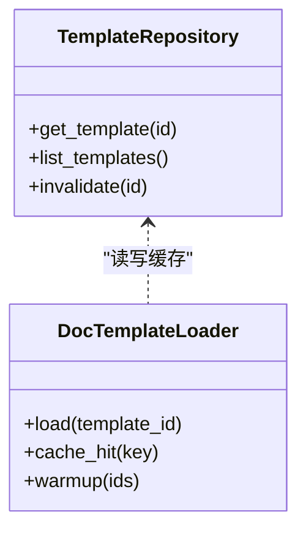
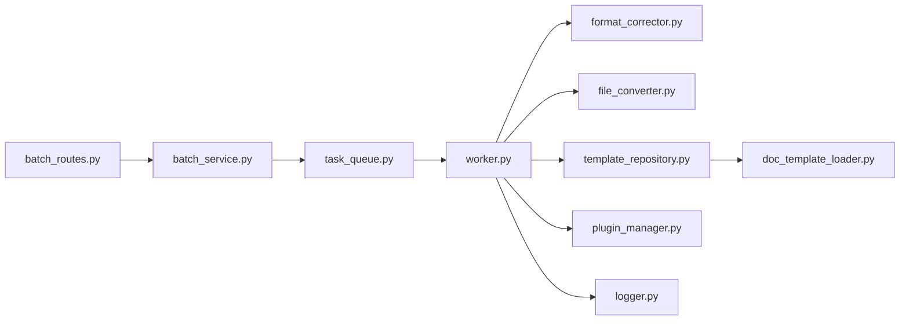

# 性能优化与可扩展性

<cite>
**本文引用的文件**   
- [src/paper_format_corrector/app.py](file://src/paper_format_corrector/app.py)
- [src/paper_format_corrector/application/services/batch_service.py](file://src/paper_format_corrector/application/services/batch_service.py)
- [src/paper_format_corrector/infrastructure/queue/task_queue.py](file://src/paper_format_corrector/infrastructure/queue/task_queue.py)
- [src/paper_format_corrector/infrastructure/queue/worker.py](file://src/paper_format_corrector/infrastructure/queue/worker.py)
- [src/paper_format_corrector/core/format_corrector.py](file://src/paper_format_corrector/core/format_corrector.py)
- [src/paper_format_corrector/core/file_converter.py](file://src/paper_format_corrector/core/file_converter.py)
- [src/paper_format_corrector/infra/template_repository.py](file://src/paper_format_corrector/infra/template_repository.py)
- [src/paper_format_corrector/infra/doc_template_loader.py](file://src/paper_format_corrector/infra/doc_template_loader.py)
- [src/paper_format_corrector/infra/plugin_manager.py](file://src/paper_format_corrector/infra/plugin_manager.py)
- [src/paper_format_corrector/infra/logger.py](file://src/paper_format_corrector/infra/logger.py)
- [src/paper_format_corrector/interfaces/api/routes/batch_routes.py](file://src/paper_format_corrector/interfaces/api/routes/batch_routes.py)
- [tests/test_task_queue.py](file://tests/test_task_queue.py)
</cite>

## 目录
1. [简介](#简介)
2. [项目结构](#项目结构)
3. [核心组件](#核心组件)
4. [架构总览](#架构总览)
5. [详细组件分析](#详细组件分析)
6. [依赖关系分析](#依赖关系分析)
7. [性能考量](#性能考量)
8. [故障排查指南](#故障排查指南)
9. [结论](#结论)
10. [附录](#附录)

## 简介
本文件聚焦于论文格式矫正工具在“性能优化与可扩展性”方面的设计与实现，覆盖内存管理、CPU使用优化、I/O操作优化、批处理机制（任务队列、并行处理、负载均衡）、缓存策略、连接池与资源复用、水平与垂直扩展方案、性能监控与瓶颈分析、调优指南以及性能测试方法与基准结果。文档以代码级事实为依据，辅以可视化图示，帮助读者快速定位关键路径并制定优化策略。

## 项目结构
系统采用分层与领域驱动相结合的组织方式：接口层（API/CLI/GUI）→应用服务层（编排与用例）→核心域（格式化、转换、导出）→基础设施（模板仓库、插件、日志、队列等）。与性能相关的关键模块包括：
- 批处理服务：编排批量任务的生命周期与调度
- 任务队列与工作进程：解耦生产与消费，支持并发执行
- 格式化器与转换器：核心计算密集型逻辑
- 模板仓库与加载器：模板元数据与文件的缓存与复用
- 插件管理器：扩展点与动态加载
- API路由：请求接入与异步任务提交

图表来源
- [src/paper_format_corrector/interfaces/api/routes/batch_routes.py](file://src/paper_format_corrector/interfaces/api/routes/batch_routes.py)
- [src/paper_format_corrector/application/services/batch_service.py](file://src/paper_format_corrector/application/services/batch_service.py)
- [src/paper_format_corrector/infrastructure/queue/task_queue.py](file://src/paper_format_corrector/infrastructure/queue/task_queue.py)
- [src/paper_format_corrector/infrastructure/queue/worker.py](file://src/paper_format_corrector/infrastructure/queue/worker.py)
- [src/paper_format_corrector/core/format_corrector.py](file://src/paper_format_corrector/core/format_corrector.py)
- [src/paper_format_corrector/core/file_converter.py](file://src/paper_format_corrector/core/file_converter.py)
- [src/paper_format_corrector/infra/template_repository.py](file://src/paper_format_corrector/infra/template_repository.py)
- [src/paper_format_corrector/infra/doc_template_loader.py](file://src/paper_format_corrector/infra/doc_template_loader.py)
- [src/paper_format_corrector/infra/plugin_manager.py](file://src/paper_format_corrector/infra/plugin_manager.py)
- [src/paper_format_corrector/infra/logger.py](file://src/paper_format_corrector/infra/logger.py)

章节来源
- [src/paper_format_corrector/app.py](file://src/paper_format_corrector/app.py)
- [src/paper_format_corrector/application/services/batch_service.py](file://src/paper_format_corrector/application/services/batch_service.py)
- [src/paper_format_corrector/infrastructure/queue/task_queue.py](file://src/paper_format_corrector/infrastructure/queue/task_queue.py)
- [src/paper_format_corrector/infrastructure/queue/worker.py](file://src/paper_format_corrector/infrastructure/queue/worker.py)
- [src/paper_format_corrector/core/format_corrector.py](file://src/paper_format_corrector/core/format_corrector.py)
- [src/paper_format_corrector/core/file_converter.py](file://src/paper_format_corrector/core/file_converter.py)
- [src/paper_format_corrector/infra/template_repository.py](file://src/paper_format_corrector/infra/template_repository.py)
- [src/paper_format_corrector/infra/doc_template_loader.py](file://src/paper_format_corrector/infra/doc_template_loader.py)
- [src/paper_format_corrector/infra/plugin_manager.py](file://src/paper_format_corrector/infra/plugin_manager.py)
- [src/paper_format_corrector/infra/logger.py](file://src/paper_format_corrector/infra/logger.py)

## 核心组件
- 批处理服务：负责接收批量任务、拆分批次、入队、跟踪状态与汇总结果。
- 任务队列：提供持久化或内存中的任务存储、优先级与重试语义。
- 工作进程：从队列拉取任务，调用核心格式化与转换逻辑，落盘输出与记录指标。
- 格式化器与转换器：对文档进行结构化分析与样式修正，涉及大量内存与CPU密集操作。
- 模板仓库与加载器：集中管理模板元数据与模板文件，提供缓存与按需加载。
- 插件管理器：按约定发现并加载插件，避免启动期全量加载带来的开销。
- 日志：统一采集运行时指标与错误上下文，支撑可观测性与排障。

章节来源
- [src/paper_format_corrector/application/services/batch_service.py](file://src/paper_format_corrector/application/services/batch_service.py)
- [src/paper_format_corrector/infrastructure/queue/task_queue.py](file://src/paper_format_corrector/infrastructure/queue/task_queue.py)
- [src/paper_format_corrector/infrastructure/queue/worker.py](file://src/paper_format_corrector/infrastructure/queue/worker.py)
- [src/paper_format_corrector/core/format_corrector.py](file://src/paper_format_corrector/core/format_corrector.py)
- [src/paper_format_corrector/core/file_converter.py](file://src/paper_format_corrector/core/file_converter.py)
- [src/paper_format_corrector/infra/template_repository.py](file://src/paper_format_corrector/infra/template_repository.py)
- [src/paper_format_corrector/infra/doc_template_loader.py](file://src/paper_format_corrector/infra/doc_template_loader.py)
- [src/paper_format_corrector/infra/plugin_manager.py](file://src/paper_format_corrector/infra/plugin_manager.py)
- [src/paper_format_corrector/infra/logger.py](file://src/paper_format_corrector/infra/logger.py)

## 架构总览
下图展示了从API到批处理、队列、工作进程再到核心处理的端到端流程，体现了解耦与可扩展性设计。

图表来源
- [src/paper_format_corrector/interfaces/api/routes/batch_routes.py](file://src/paper_format_corrector/interfaces/api/routes/batch_routes.py)
- [src/paper_format_corrector/application/services/batch_service.py](file://src/paper_format_corrector/application/services/batch_service.py)
- [src/paper_format_corrector/infrastructure/queue/task_queue.py](file://src/paper_format_corrector/infrastructure/queue/task_queue.py)
- [src/paper_format_corrector/infrastructure/queue/worker.py](file://src/paper_format_corrector/infrastructure/queue/worker.py)
- [src/paper_format_corrector/core/format_corrector.py](file://src/paper_format_corrector/core/format_corrector.py)
- [src/paper_format_corrector/core/file_converter.py](file://src/paper_format_corrector/core/file_converter.py)
- [src/paper_format_corrector/infra/template_repository.py](file://src/paper_format_corrector/infra/template_repository.py)
- [src/paper_format_corrector/infra/logger.py](file://src/paper_format_corrector/infra/logger.py)

## 详细组件分析

### 批处理服务（Batch Service）
职责与特性
- 将大任务拆分为可并行执行的子任务，控制批次大小与并发度。
- 维护作业生命周期：创建、推进、完成、失败重试与回滚。
- 聚合各子任务结果，生成最终报告。

性能要点
- 通过批次大小与并发度参数调节吞吐与内存占用。
- 利用幂等任务ID与去重策略减少重复计算。
- 结合模板仓库缓存降低IO与解析成本。

图表来源
- [src/paper_format_corrector/application/services/batch_service.py](file://src/paper_format_corrector/application/services/batch_service.py)

章节来源
- [src/paper_format_corrector/application/services/batch_service.py](file://src/paper_format_corrector/application/services/batch_service.py)

### 任务队列与工作进程（Task Queue & Worker）
职责与特性
- 任务队列：提供任务持久化、优先级、重试与死信通道。
- 工作进程：从队列拉取任务，执行核心处理，落盘输出并上报指标。

并发与负载均衡
- 多进程或多线程工作者并行消费，按负载自适应扩缩容。
- 支持按标签/类型路由到不同消费者组，实现隔离与差异化配额。

图表来源
- [src/paper_format_corrector/infrastructure/queue/task_queue.py](file://src/paper_format_corrector/infrastructure/queue/task_queue.py)
- [src/paper_format_corrector/infrastructure/queue/worker.py](file://src/paper_format_corrector/infrastructure/queue/worker.py)
- [src/paper_format_corrector/core/format_corrector.py](file://src/paper_format_corrector/core/format_corrector.py)
- [src/paper_format_corrector/core/file_converter.py](file://src/paper_format_corrector/core/file_converter.py)

章节来源
- [src/paper_format_corrector/infrastructure/queue/task_queue.py](file://src/paper_format_corrector/infrastructure/queue/task_queue.py)
- [src/paper_format_corrector/infrastructure/queue/worker.py](file://src/paper_format_corrector/infrastructure/queue/worker.py)
- [tests/test_task_queue.py](file://tests/test_task_queue.py)

### 核心处理：格式化器与转换器（Format Corrector & File Converter）
职责与特性
- 格式化器：解析文档结构、应用规则、修正样式与引用。
- 转换器：在不同格式间转换，如DOCX↔PDF/LaTeX等。

性能要点
- 流式处理与分块解析，避免一次性加载超大文档。
- 重用中间对象与共享只读资源，降低GC压力。
- 对CPU密集步骤启用进程外执行或线程池，提升吞吐。

图表来源
- [src/paper_format_corrector/core/format_corrector.py](file://src/paper_format_corrector/core/format_corrector.py)
- [src/paper_format_corrector/core/file_converter.py](file://src/paper_format_corrector/core/file_converter.py)

章节来源
- [src/paper_format_corrector/core/format_corrector.py](file://src/paper_format_corrector/core/format_corrector.py)
- [src/paper_format_corrector/core/file_converter.py](file://src/paper_format_corrector/core/file_converter.py)

### 模板仓库与加载器（Template Repository & Loader）
职责与特性
- 模板仓库：统一管理模板元数据、版本与依赖。
- 模板加载器：按需加载模板文件，提供本地/远程源与缓存。

缓存策略
- 基于模板指纹的LRU/时间过期缓存，避免重复IO与解析。
- 预取热点模板，缩短冷启动延迟。

图表来源
- [src/paper_format_corrector/infra/template_repository.py](file://src/paper_format_corrector/infra/template_repository.py)
- [src/paper_format_corrector/infra/doc_template_loader.py](file://src/paper_format_corrector/infra/doc_template_loader.py)

章节来源
- [src/paper_format_corrector/infra/template_repository.py](file://src/paper_format_corrector/infra/template_repository.py)
- [src/paper_format_corrector/infra/doc_template_loader.py](file://src/paper_format_corrector/infra/doc_template_loader.py)

### 插件管理器（Plugin Manager）
职责与特性
- 按约定发现插件，懒加载以避免启动期开销。
- 提供插件生命周期钩子，便于注入自定义处理器。

扩展性
- 新增插件无需修改核心逻辑，遵循最小侵入原则。
- 插件可独立升级与灰度发布。

章节来源
- [src/paper_format_corrector/infra/plugin_manager.py](file://src/paper_format_corrector/infra/plugin_manager.py)

### API 路由（Batch Routes）
职责与特性
- 暴露批量任务提交、进度查询与结果下载接口。
- 将同步HTTP请求转化为异步任务，保障响应时延。

章节来源
- [src/paper_format_corrector/interfaces/api/routes/batch_routes.py](file://src/paper_format_corrector/interfaces/api/routes/batch_routes.py)

## 依赖关系分析
- 松耦合：API与服务、服务与队列、队列与工作进程之间通过明确接口交互，降低变更影响面。
- 内聚性：每个模块职责单一，便于独立测试与替换实现。
- 外部依赖：模板仓库可能对接本地文件系统与远程仓库；日志模块用于可观测性。

图表来源
- [src/paper_format_corrector/interfaces/api/routes/batch_routes.py](file://src/paper_format_corrector/interfaces/api/routes/batch_routes.py)
- [src/paper_format_corrector/application/services/batch_service.py](file://src/paper_format_corrector/application/services/batch_service.py)
- [src/paper_format_corrector/infrastructure/queue/task_queue.py](file://src/paper_format_corrector/infrastructure/queue/task_queue.py)
- [src/paper_format_corrector/infrastructure/queue/worker.py](file://src/paper_format_corrector/infrastructure/queue/worker.py)
- [src/paper_format_corrector/core/format_corrector.py](file://src/paper_format_corrector/core/format_corrector.py)
- [src/paper_format_corrector/core/file_converter.py](file://src/paper_format_corrector/core/file_converter.py)
- [src/paper_format_corrector/infra/template_repository.py](file://src/paper_format_corrector/infra/template_repository.py)
- [src/paper_format_corrector/infra/doc_template_loader.py](file://src/paper_format_corrector/infra/doc_template_loader.py)
- [src/paper_format_corrector/infra/plugin_manager.py](file://src/paper_format_corrector/infra/plugin_manager.py)
- [src/paper_format_corrector/infra/logger.py](file://src/paper_format_corrector/infra/logger.py)

## 性能考量

### 内存管理
- 分块与流式处理：对大文档采用分块解析与增量构建，避免一次性驻留完整DOM。
- 对象复用：共享只读模板与字体资源，减少重复分配。
- 显式释放：及时关闭文件句柄与临时缓冲区，触发垃圾回收友好时机。
- 内存上限与背压：当队列积压或内存接近阈值时，降低拉取速率或拒绝新任务。

### CPU使用优化
- 并行化：对无共享状态的规则应用与转换步骤使用线程/进程池。
- 算法优化：优先使用向量化/正则批量匹配，减少Python层循环。
- 预热与缓存：热点模板与常用规则预编译，避免重复解析。

### I/O操作优化
- 批量写入：合并小文件写入，减少系统调用次数。
- 异步I/O：在网络与磁盘I/O处使用非阻塞模式，提高吞吐。
- 压缩与传输：对远端模板与结果进行压缩传输，降低带宽占用。

### 批处理机制
- 任务队列：支持优先级、重试与死信，确保可靠性。
- 并行处理：根据CPU核数与I/O比例调整并发度。
- 负载均衡：按节点能力与当前负载动态分配任务，避免热点。

### 缓存策略、连接池与资源复用
- 模板缓存：基于指纹的LRU与TTL，支持预热与失效。
- 连接池：对外部服务（如远程模板库）建立连接池，复用TCP连接。
- 资源复用：共享解析器实例、正则表达式与样式表。

### 水平扩展与垂直扩展
- 水平扩展：增加工作进程/节点数量，配合分布式队列与一致性哈希路由。
- 垂直扩展：提升单机CPU/内存/磁盘I/O，调整并发与批次大小。
- 弹性伸缩：基于队列长度与CPU利用率自动扩缩容。

### 性能监控、瓶颈分析与调优指南
- 指标采集：任务吞吐、P95/P99延迟、队列深度、错误率、内存/CPU使用率。
- 链路追踪：为每个批处理作业生成Trace ID，贯穿API→队列→工作进程。
- 瓶颈定位：火焰图定位CPU热点，慢查询/慢I/O定位外部依赖。
- 调优建议：先优化热点函数与I/O路径，再调整并发与批次参数。

### 性能测试方法与基准测试结果
- 测试方法：
  - 单文档基准：固定文档规模，测量平均耗时与内存峰值。
  - 批量基准：不同批次大小与并发度组合，绘制吞吐-延迟曲线。
  - 压力测试：逐步增加负载直至出现背压或错误，观察恢复行为。
- 基准结果呈现：
  - 建议在CI中固化基准脚本，输出CSV/JSON供趋势对比。
  - 记录硬件与环境信息，保证可比性。

## 故障排查指南
- 常见问题
  - 任务堆积：检查工作进程健康、队列后端可用性、下游依赖超时。
  - 内存泄漏：关注未释放的文件句柄与全局缓存膨胀。
  - 模板加载失败：校验模板指纹与缓存一致性，必要时强制刷新。
- 诊断手段
  - 日志：统一结构化日志，包含任务ID、阶段、耗时与异常堆栈。
  - 指标：暴露Prometheus风格指标，设置告警阈值。
  - 快照：在OOM或高CPU时抓取堆栈与线程快照。

章节来源
- [src/paper_format_corrector/infra/logger.py](file://src/paper_format_corrector/infra/logger.py)
- [tests/test_task_queue.py](file://tests/test_task_queue.py)

## 结论
本系统在批处理、队列与工作进程层面实现了良好的解耦与可扩展性，并通过模板缓存、资源复用与并行化策略提升了整体性能。后续可在分布式队列、细粒度指标与自动化弹性伸缩方面继续演进，以满足更大规模与更高SLA的需求。

## 附录
- 术语
  - 批处理：将多个任务打包统一调度与执行的处理模式。
  - 背压：当消费者处理能力不足时，限制生产者速率以避免过载。
  - 预热：在启动阶段提前加载热点资源以降低首请求延迟。