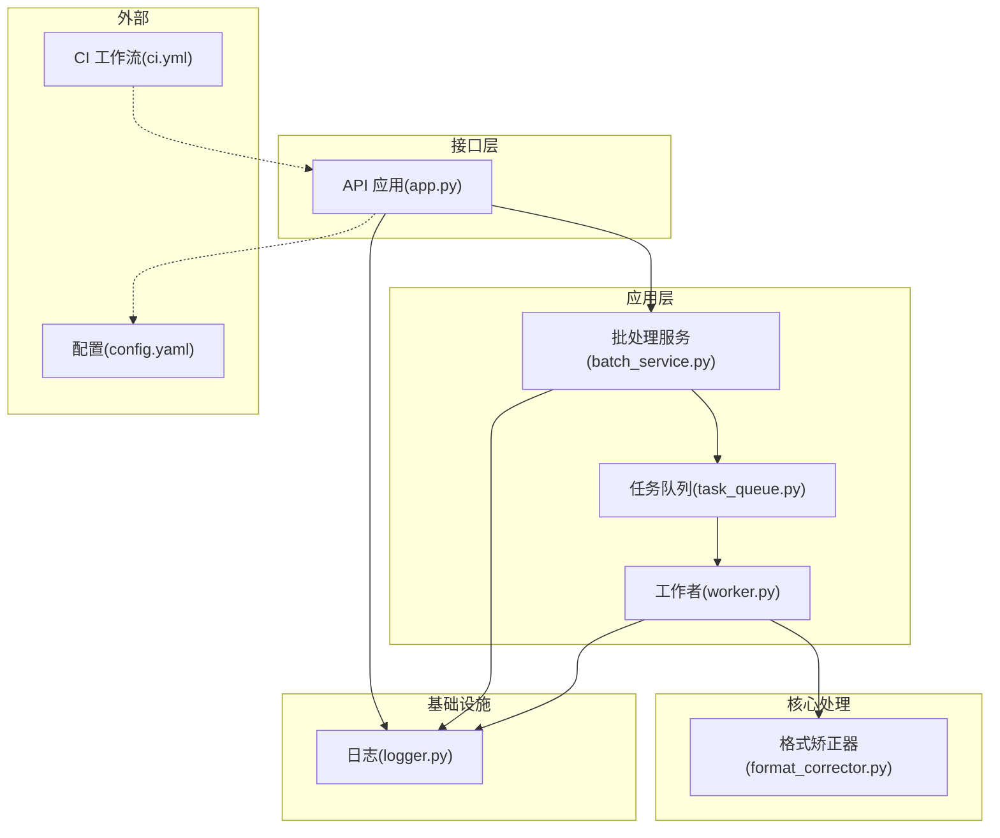
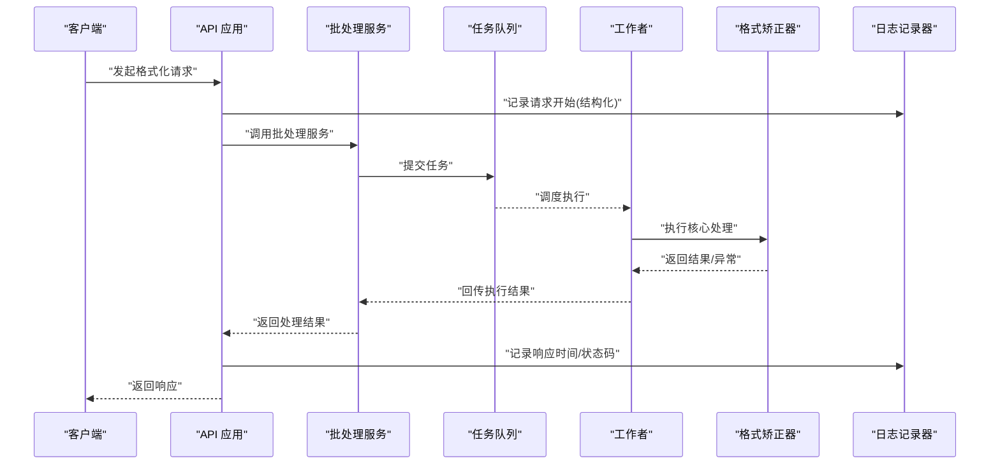
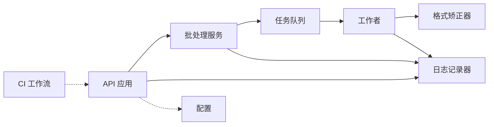

# 性能监控与分析

<cite>
**本文引用的文件**   
- [src/paper_format_corrector/infra/logger.py](file://src/paper_format_corrector/infra/logger.py)
- [src/paper_format_corrector/interfaces/api/app.py](file://src/paper_format_corrector/interfaces/api/app.py)
- [src/paper_format_corrector/application/services/batch_service.py](file://src/paper_format_corrector/application/services/batch_service.py)
- [src/paper_format_corrector/core/format_corrector.py](file://src/paper_format_corrector/core/format_corrector.py)
- [src/paper_format_corrector/infrastructure/queue/task_queue.py](file://src/paper_format_corrector/infrastructure/queue/task_queue.py)
- [src/paper_format_corrector/infrastructure/queue/worker.py](file://src/paper_format_corrector/infrastructure/queue/worker.py)
- [tests/test_task_queue.py](file://tests/test_task_queue.py)
- [config/config.yaml](file://config/config.yaml)
- [.github/workflows/ci.yml](file://.github/workflows/ci.yml)
</cite>

## 目录
1. [简介](#简介)
2. [项目结构](#项目结构)
3. [核心组件](#核心组件)
4. [架构总览](#架构总览)
5. [详细组件分析](#详细组件分析)
6. [依赖关系分析](#依赖关系分析)
7. [性能考量](#性能考量)
8. [故障排查指南](#故障排查指南)
9. [结论](#结论)
10. [附录](#附录)

## 简介
本文件面向“论文格式矫正工具”的性能监控与分析，聚焦以下目标：
- 指标收集：响应时间、吞吐量、资源使用率、错误率等关键指标
- 日志策略：结构化日志与分类管理（调试、性能追踪、业务日志）
- 瓶颈识别：CPU、内存、I/O 分析与监控方法
- 告警机制：阈值配置与触发流程
- 测试与持续集成：性能测试框架、基准用例与 CI 中的性能检查
- 报告与趋势：性能分析报告生成与趋势分析方法

## 项目结构
从仓库结构看，性能相关能力主要分布在以下位置：
- 应用服务层：批处理服务、任务队列与工作者
- API 层：HTTP 接口入口，适合埋点响应时间与吞吐
- 基础设施层：日志记录器、队列实现
- 配置与 CI：配置文件与工作流脚本

图表来源
- [src/paper_format_corrector/interfaces/api/app.py](file://src/paper_format_corrector/interfaces/api/app.py)
- [src/paper_format_corrector/application/services/batch_service.py](file://src/paper_format_corrector/application/services/batch_service.py)
- [src/paper_format_corrector/infrastructure/queue/task_queue.py](file://src/paper_format_corrector/infrastructure/queue/task_queue.py)
- [src/paper_format_corrector/infrastructure/queue/worker.py](file://src/paper_format_corrector/infrastructure/queue/worker.py)
- [src/paper_format_corrector/core/format_corrector.py](file://src/paper_format_corrector/core/format_corrector.py)
- [src/paper_format_corrector/infra/logger.py](file://src/paper_format_corrector/infra/logger.py)
- [config/config.yaml](file://config/config.yaml)
- [.github/workflows/ci.yml](file://.github/workflows/ci.yml)

章节来源
- [src/paper_format_corrector/interfaces/api/app.py](file://src/paper_format_corrector/interfaces/api/app.py)
- [src/paper_format_corrector/application/services/batch_service.py](file://src/paper_format_corrector/application/services/batch_service.py)
- [src/paper_format_corrector/infrastructure/queue/task_queue.py](file://src/paper_format_corrector/infrastructure/queue/task_queue.py)
- [src/paper_format_corrector/infrastructure/queue/worker.py](file://src/paper_format_corrector/infrastructure/queue/worker.py)
- [src/paper_format_corrector/core/format_corrector.py](file://src/paper_format_corrector/core/format_corrector.py)
- [src/paper_format_corrector/infra/logger.py](file://src/paper_format_corrector/infra/logger.py)
- [config/config.yaml](file://config/config.yaml)
- [.github/workflows/ci.yml](file://.github/workflows/ci.yml)

## 核心组件
- API 应用：作为请求入口，适合统一采集 HTTP 响应时间、状态码分布与吞吐。
- 批处理服务：编排批量文档处理流程，适合在阶段边界埋点耗时与错误计数。
- 任务队列与工作者：承载异步处理，适合统计排队时长、执行时长、并发度与失败重试。
- 格式矫正器：核心计算路径，适合 CPU/内存热点定位与 I/O 密集段观测。
- 日志记录器：提供结构化日志输出，便于聚合与检索。

章节来源
- [src/paper_format_corrector/interfaces/api/app.py](file://src/paper_format_corrector/interfaces/api/app.py)
- [src/paper_format_corrector/application/services/batch_service.py](file://src/paper_format_corrector/application/services/batch_service.py)
- [src/paper_format_corrector/infrastructure/queue/task_queue.py](file://src/paper_format_corrector/infrastructure/queue/task_queue.py)
- [src/paper_format_corrector/infrastructure/queue/worker.py](file://src/paper_format_corrector/infrastructure/queue/worker.py)
- [src/paper_format_corrector/core/format_corrector.py](file://src/paper_format_corrector/core/format_corrector.py)
- [src/paper_format_corrector/infra/logger.py](file://src/paper_format_corrector/infra/logger.py)

## 架构总览
下图展示一次典型请求从 API 到核心处理的完整链路，以及可观测性埋点位置。

图表来源
- [src/paper_format_corrector/interfaces/api/app.py](file://src/paper_format_corrector/interfaces/api/app.py)
- [src/paper_format_corrector/application/services/batch_service.py](file://src/paper_format_corrector/application/services/batch_service.py)
- [src/paper_format_corrector/infrastructure/queue/task_queue.py](file://src/paper_format_corrector/infrastructure/queue/task_queue.py)
- [src/paper_format_corrector/infrastructure/queue/worker.py](file://src/paper_format_corrector/infrastructure/queue/worker.py)
- [src/paper_format_corrector/core/format_corrector.py](file://src/paper_format_corrector/core/format_corrector.py)
- [src/paper_format_corrector/infra/logger.py](file://src/paper_format_corrector/infra/logger.py)

## 详细组件分析

### API 层：响应时间与吞吐埋点
- 建议做法
  - 在请求进入时记录开始时间戳与请求元数据（方法、路径、用户标识等）。
  - 在响应返回前记录结束时间戳，并计算响应时间。
  - 按状态码维度统计成功/失败比例，用于错误率计算。
  - 结合并发度估算吞吐（QPS），并按端点维度拆分。
- 指标定义
  - 响应时间：P50/P90/P99 分位值
  - 吞吐：每秒请求数（QPS）
  - 错误率：非 2xx 状态码占比
- 可视化建议
  - 时序图：各端点 P99 响应时间趋势
  - 柱状图：状态码分布
  - 热力图：并发度与响应时间的关系

章节来源
- [src/paper_format_corrector/interfaces/api/app.py](file://src/paper_format_corrector/interfaces/api/app.py)

### 批处理服务：阶段化计时与错误计数
- 建议做法
  - 将批处理拆分为若干阶段（如解析、规则匹配、导出），在每个阶段前后记录耗时。
  - 对每个阶段的异常进行捕获并记录错误类型与上下文，便于错误率与失败原因分析。
- 指标定义
  - 阶段耗时：各阶段 P50/P90/P99
  - 批处理成功率：成功批次/总批次
  - 阶段错误率：各阶段失败次数/总尝试次数
- 可视化建议
  - 堆叠面积图：各阶段耗时占比
  - 折线图：批处理成功率趋势

章节来源
- [src/paper_format_corrector/application/services/batch_service.py](file://src/paper_format_corrector/application/services/batch_service.py)

### 任务队列与工作者：排队与执行指标
- 建议做法
  - 在入队与出队时刻记录时间戳，计算排队时长。
  - 在执行前后记录时间戳，计算执行时长。
  - 统计并发工作者数量、活跃任务数、失败重试次数。
- 指标定义
  - 排队时长：P50/P90/P99
  - 执行时长：P50/P90/P99
  - 并发度：同时运行的工作者数量
  - 失败率：失败任务/总任务
- 可视化建议
  - 箱线图：排队时长与执行时长分布
  - 折线图：并发度与延迟的关系

章节来源
- [src/paper_format_corrector/infrastructure/queue/task_queue.py](file://src/paper_format_corrector/infrastructure/queue/task_queue.py)
- [src/paper_format_corrector/infrastructure/queue/worker.py](file://src/paper_format_corrector/infrastructure/queue/worker.py)
- [tests/test_task_queue.py](file://tests/test_task_queue.py)

### 核心处理：CPU/内存/I/O 热点定位
- 建议做法
  - 在核心处理函数入口与关键分支处记录 CPU 时间或系统时间，识别热点。
  - 对大对象创建与释放点进行采样，评估内存峰值与分配频率。
  - 对文件读写、网络请求等 I/O 操作记录耗时与大小，识别 I/O 瓶颈。
- 指标定义
  - CPU 占用：进程级与线程级 CPU 百分比
  - 内存使用：RSS、虚拟内存、对象分配计数
  - I/O 吞吐：读/写字节数、I/O 等待时间
- 可视化建议
  - 火焰图：CPU 热点
  - 时序图：内存使用曲线
  - 散点图：文件大小与处理耗时关系

章节来源
- [src/paper_format_corrector/core/format_corrector.py](file://src/paper_format_corrector/core/format_corrector.py)

### 日志记录器：结构化日志与分类
- 建议做法
  - 采用 JSON 结构化日志，包含字段：时间戳、级别、模块、消息、trace_id、span_id、耗时、状态码等。
  - 分类管理：
    - 调试日志：开发环境开启，生产默认关闭
    - 性能追踪：仅记录耗时、事件与关键上下文
    - 业务日志：记录关键业务流程与决策点
  - 控制输出目标：控制台、文件、远程收集器（可选）
- 指标关联
  - 通过 trace_id/span_id 将日志与指标关联，形成端到端追踪
- 可视化建议
  - 日志聚合平台：按 trace_id 串联全链路日志
  - 仪表盘：按级别与模块的日志量趋势

章节来源
- [src/paper_format_corrector/infra/logger.py](file://src/paper_format_corrector/infra/logger.py)

## 依赖关系分析
- 耦合与内聚
  - API 层与应用层解耦，通过服务接口交互，利于独立埋点与扩展
  - 队列与工作者职责清晰，便于横向扩展与容量规划
- 外部依赖
  - 配置中心：集中管理阈值与开关
  - CI 流水线：自动化性能回归与基线对比

图表来源
- [src/paper_format_corrector/interfaces/api/app.py](file://src/paper_format_corrector/interfaces/api/app.py)
- [src/paper_format_corrector/application/services/batch_service.py](file://src/paper_format_corrector/application/services/batch_service.py)
- [src/paper_format_corrector/infrastructure/queue/task_queue.py](file://src/paper_format_corrector/infrastructure/queue/task_queue.py)
- [src/paper_format_corrector/infrastructure/queue/worker.py](file://src/paper_format_corrector/infrastructure/queue/worker.py)
- [src/paper_format_corrector/core/format_corrector.py](file://src/paper_format_corrector/core/format_corrector.py)
- [src/paper_format_corrector/infra/logger.py](file://src/paper_format_corrector/infra/logger.py)
- [config/config.yaml](file://config/config.yaml)
- [.github/workflows/ci.yml](file://.github/workflows/ci.yml)

章节来源
- [config/config.yaml](file://config/config.yaml)
- [.github/workflows/ci.yml](file://.github/workflows/ci.yml)

## 性能考量
- 指标采集开销控制
  - 采样策略：对高频路径采用概率采样，降低开销
  - 异步上报：指标与日志异步写入，避免阻塞主流程
- 资源上限与降级
  - 设置最大并发与队列长度，超限快速失败或拒绝
  - 超时与熔断：对下游依赖设置超时与熔断，保护整体可用性
- 容量规划
  - 基于历史 QPS 与 P99 延迟，预估所需工作者数量与实例规模
  - 关注 I/O 密集型路径，必要时引入缓存或并行化

[本节为通用指导，不直接分析具体文件]

## 故障排查指南
- 常见症状与定位
  - 响应时间飙升：查看 API 层 P99 趋势与队列排队时长，确认是否并发不足或下游慢
  - 错误率升高：检查状态码分布与错误日志，定位失败阶段与根因
  - 内存泄漏迹象：观察 RSS 增长曲线与对象分配热点，定位未释放的大对象
- 排查步骤
  - 拉取 trace_id 对应全链路日志，核对关键阶段耗时
  - 使用 CPU 火焰图定位热点函数，结合代码路径优化
  - 对 I/O 密集路径增加缓冲与批处理，减少系统调用次数
- 告警与阈值
  - 建议阈值（示例）：
    - P99 响应时间 > 2s
    - 错误率 > 1%
    - 队列排队时长 P90 > 500ms
    - 内存使用持续增长且无回落
  - 告警渠道：邮件、IM、工单系统

章节来源
- [src/paper_format_corrector/infra/logger.py](file://src/paper_format_corrector/infra/logger.py)
- [src/paper_format_corrector/interfaces/api/app.py](file://src/paper_format_corrector/interfaces/api/app.py)
- [src/paper_format_corrector/infrastructure/queue/task_queue.py](file://src/paper_format_corrector/infrastructure/queue/task_queue.py)
- [src/paper_format_corrector/infrastructure/queue/worker.py](file://src/paper_format_corrector/infrastructure/queue/worker.py)

## 结论
通过在 API、批处理、队列与核心处理路径的系统化埋点，配合结构化日志与指标体系，可实现端到端的性能可视性与问题定位。结合阈值告警与 CI 性能回归，能够持续提升系统的稳定性与效率。

[本节为总结，不直接分析具体文件]

## 附录

### 指标字典与口径
- 响应时间：请求从进入 API 到返回响应的总耗时
- 吞吐：单位时间内处理的请求数（QPS）
- 错误率：非成功状态码的请求占比
- 排队时长：任务在队列中等待的时间
- 执行时长：工作者实际执行任务的时间
- CPU/内存/I/O：进程级资源使用与 I/O 统计

[本节为概念说明，不直接分析具体文件]

### 告警阈值配置建议
- 建议将阈值集中在配置文件中管理，支持动态调整与灰度发布
- 不同环境（开发/预发/生产）采用差异化阈值

章节来源
- [config/config.yaml](file://config/config.yaml)

### 性能测试与基准
- 单元测试覆盖队列行为与工作者调度逻辑，确保功能正确性
- 基准测试建议：
  - 固定输入集，重复运行 N 次，统计 P50/P90/P99 与吞吐
  - 逐步增加并发，观察延迟与资源使用变化
  - 对比不同配置下的性能差异，选择最优参数

章节来源
- [tests/test_task_queue.py](file://tests/test_task_queue.py)

### 持续集成中的性能检查
- 在 CI 中增加性能回归任务：
  - 运行基准用例，记录关键指标
  - 与基线对比，超过阈值则标记失败
  - 产出性能报告附件，供评审与归档

章节来源
- [.github/workflows/ci.yml](file://.github/workflows/ci.yml)